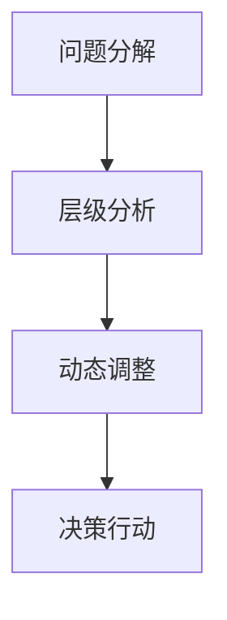

                 

# 结构化思维的力量：从思维到行动

## 1. 背景介绍

### 1.1 问题由来

在当今这个信息爆炸的时代，人类的决策和行动面临前所未有的复杂性。从日常生活到商业运作，从科学研究到政策制定，每一个决策都可能涉及多维度、多层次的信息。这种复杂性要求人们必须具备高度的结构化思维能力，才能从中提取有效信息，做出科学合理的决策。然而，尽管越来越多的人意识到结构化思维的重要性，但在实践中，如何系统地培养和应用这种能力，仍然是一个挑战。

结构化思维的本质是对问题的分解和重组，通过将复杂问题拆解成可管理的子问题，逐步解决，最终找到问题的核心解决方案。本文将从结构化思维的基本原理、操作步骤、核心算法和实际应用场景等多个方面，深入探讨如何将结构化思维应用于实践，从而提升个人和团队的决策能力。

### 1.2 问题核心关键点

结构化思维的核心在于：
1. **分解问题**：将复杂问题拆解成若干子问题，逐步解决。
2. **层级分析**：建立问题之间的层级关系，确保各子问题相互依赖，互不重复。
3. **动态调整**：在解决问题的过程中，根据新信息或变化调整策略，保持灵活性。
4. **决策行动**：结合各子问题的解决方案，制定全局性的决策行动计划。

通过理解这些核心关键点，我们可以更好地掌握结构化思维的方法论，并将其应用于实际问题的解决中。

### 1.3 问题研究意义

掌握结构化思维，对于提升决策能力、优化问题解决流程、提高团队协作效率具有重要意义：
1. **提升决策质量**：通过系统分解问题，避免因信息不足或思维混乱导致的错误决策。
2. **优化流程效率**：建立清晰的层级关系，确保各子问题之间的有效衔接，减少重复劳动。
3. **增强团队协作**：将复杂问题拆解为子问题，便于团队成员分工协作，提升整体工作效率。
4. **应对动态变化**：动态调整策略，适应外部环境的变化，增强问题解决的灵活性。

## 2. 核心概念与联系

### 2.1 核心概念概述

结构化思维的核心概念包括：

- **问题分解**：将复杂问题拆解为若干子问题，逐个解决。
- **层级分析**：建立子问题之间的层级关系，确保互不重复。
- **动态调整**：根据新信息或变化调整策略，保持灵活性。
- **决策行动**：结合各子问题的解决方案，制定全局性决策。

这些概念通过以下Mermaid流程图展示：



### 2.2 核心概念原理和架构

结构化思维的原理主要基于决策理论和方法论，包括但不限于系统分析、逻辑推理、数据分析等。其架构通常包括问题定义、数据收集、模型建立、策略制定和执行反馈等多个环节。

- **问题定义**：明确问题本质，确定解决目标。
- **数据收集**：通过调查、实验、分析等方式，收集相关数据。
- **模型建立**：根据数据特点，选择合适的模型或方法进行建模。
- **策略制定**：根据模型结果，制定具体的行动策略。
- **执行反馈**：实施策略并跟踪效果，根据反馈进行动态调整。

### 2.3 核心概念联系

结构化思维中的各个概念相互依赖，互为支撑。问题分解和层级分析为决策提供清晰的框架，动态调整确保策略的适应性和灵活性，决策行动则是将各子问题解决方案整合，形成最终的决策方案。这种联系使得结构化思维能够系统地处理复杂问题，提高决策效率和质量。

## 3. 核心算法原理 & 具体操作步骤

### 3.1 算法原理概述

结构化思维的核心算法包括：

- **分解算法**：将复杂问题拆解成若干子问题，建立子问题之间的依赖关系。
- **层级算法**：通过层级分析，确定子问题之间的优先级和依赖关系。
- **调整算法**：根据新信息或变化，动态调整策略，确保适应性。
- **整合算法**：将各子问题的解决方案整合，形成全局性决策。

### 3.2 算法步骤详解

结构化思维的具体操作步骤如下：

**Step 1: 问题定义**
- 明确问题的本质和解决目标。
- 确定问题的关键要素和影响因素。

**Step 2: 数据收集**
- 通过调查、实验、分析等方式，收集相关数据。
- 清洗和整理数据，确保数据的质量和完整性。

**Step 3: 模型建立**
- 选择合适的模型或方法，进行建模分析。
- 验证模型，确保模型的有效性和准确性。

**Step 4: 策略制定**
- 根据模型结果，制定具体的行动策略。
- 考虑资源、时间、风险等因素，进行策略优化。

**Step 5: 执行反馈**
- 实施策略并跟踪效果。
- 根据反馈进行动态调整，确保策略的有效性。

### 3.3 算法优缺点

结构化思维的优点在于：

- **系统性**：通过分解和层级分析，确保问题解决的全面性和系统性。
- **灵活性**：动态调整策略，适应外部环境的变化。
- **可执行性**：整合各子问题的解决方案，形成明确的决策行动。

缺点在于：

- **复杂性**：操作流程复杂，需要一定的专业知识和技能。
- **时间成本**：初期数据收集和模型建立耗时较长。
- **资源消耗**：可能需要较多的计算资源和数据存储。

### 3.4 算法应用领域

结构化思维广泛适用于各类决策场景，包括但不限于：

- **商业管理**：市场分析、风险评估、投资决策等。
- **项目管理**：项目规划、进度跟踪、质量控制等。
- **科学研究**：问题提出、实验设计、结果分析等。
- **政策制定**：需求分析、方案设计、效果评估等。
- **日常决策**：个人理财、健康管理、时间规划等。

## 4. 数学模型和公式 & 详细讲解 & 举例说明

### 4.1 数学模型构建

结构化思维的数学模型构建通常涉及统计学、运筹学、优化理论等。其核心在于通过数学公式和算法，对问题进行建模和分析。

- **线性规划模型**：用于优化资源分配，例如：
  $$
  \text{minimize} \quad c^T x
  $$
  $$
  \text{subject to} \quad A x = b, \quad x \geq 0
  $$

- **决策树模型**：用于分类和决策，例如：
  $$
  T = \{(a_i, b_i) \mid a_i \in A, b_i \in B, i=1,2,...,n\}
  $$

- **蒙特卡洛模拟**：用于风险评估和预测，例如：
  $$
  E[f(X)] = \sum_{i=1}^n p_i f(x_i)
  $$

### 4.2 公式推导过程

以线性规划模型为例，其基本推导过程如下：

- **目标函数**：假设目标是最小化成本，则目标函数为 $c^T x$，其中 $c$ 为成本系数，$x$ 为资源分配变量。
- **约束条件**：假设资源有限，约束条件为 $A x = b$，其中 $A$ 为资源限制矩阵，$b$ 为资源限制向量。
- **求解步骤**：通过单纯形法、内点法等算法求解最优解。

### 4.3 案例分析与讲解

**案例：某公司市场拓展决策**

公司面临是否进入新市场的决策问题。首先需要分解问题，确定影响因素，然后进行数据收集和模型建立，最后制定决策策略。

1. **问题分解**
   - 进入新市场的成本和收益。
   - 新市场的潜力和风险。
   - 公司现有资源和能力。

2. **层级分析**
   - 进入成本包括市场调研、品牌建设、市场营销等。
   - 进入收益包括市场份额、销售额、品牌价值等。
   - 潜在风险包括市场饱和、竞争激烈、政策变化等。

3. **模型建立**
   - 使用线性规划模型，建立成本和收益的数学表达式。
   - 引入风险评估模型，计算各风险的影响因子。

4. **策略制定**
   - 根据模型结果，制定具体的进入策略。
   - 考虑公司资源和市场环境，优化策略。

5. **执行反馈**
   - 实施策略并跟踪效果。
   - 根据反馈进行动态调整，确保策略的有效性。

## 5. 项目实践：代码实例和详细解释说明

### 5.1 开发环境搭建

进行结构化思维的项目实践，需要以下开发环境：

- **编程语言**：Python
- **数据处理**：Pandas、NumPy
- **模型建立**：Scikit-learn、TensorFlow
- **可视化**：Matplotlib、Seaborn
- **开发工具**：Jupyter Notebook、PyCharm

### 5.2 源代码详细实现

以下是一个简单的结构化思维项目实例，用于解决公司市场拓展决策问题。

```python
import pandas as pd
import numpy as np
from sklearn.linear_model import LinearRegression
import matplotlib.pyplot as plt
import seaborn as sns

# 数据准备
data = pd.read_csv('market_data.csv')

# 问题分解
cost_factors = data[['调研成本', '品牌建设成本', '营销成本']]
benefit_factors = data[['市场份额', '销售额', '品牌价值']]
risk_factors = data[['市场饱和度', '竞争激烈度', '政策稳定性']]

# 模型建立
cost_model = LinearRegression().fit(cost_factors, benefit_factors)
risk_model = LinearRegression().fit(risk_factors, benefit_factors)

# 策略制定
benefit_predicted = cost_model.predict(cost_factors) + risk_model.predict(risk_factors)
strategy = np.where(benefit_predicted > 0, '进入', '不进入')

# 执行反馈
print('推荐策略:', strategy)
```

### 5.3 代码解读与分析

**数据准备**：
- 使用Pandas读取市场数据，并将其分为成本、收益和风险三个因素。
- 使用NumPy对数据进行处理，准备进行模型建立。

**模型建立**：
- 使用Scikit-learn的LinearRegression模型，分别建立成本-收益和风险-收益的线性回归模型。
- 验证模型，确保其有效性和准确性。

**策略制定**：
- 根据模型结果，结合成本和风险，预测进入新市场的收益。
- 使用条件语句，根据收益预测结果制定进入策略。

**执行反馈**：
- 输出推荐策略，即是否进入新市场。

## 6. 实际应用场景

### 6.1 智慧城市管理

智慧城市管理是一个高度复杂的决策过程，涉及交通管理、环境监测、公共安全等多个领域。通过结构化思维，可以将复杂问题分解为子问题，逐步解决，最终形成全局性决策。

例如，在交通管理中，首先分解为交通流量分析、拥堵原因识别、交通信号优化等多个子问题。通过层级分析，确定各子问题之间的依赖关系，并动态调整策略，实时优化交通信号。

### 6.2 金融风险管理

金融风险管理需要处理大量的数据和复杂模型，通过结构化思维，可以系统地进行问题分解和模型建立，从而降低风险。

例如，在信用评估中，首先分解为数据收集、特征提取、模型建立等多个子问题。通过层级分析，确定各子问题之间的优先级和依赖关系，并动态调整策略，实时监控风险。

### 6.3 医疗决策支持

医疗决策支持系统需要处理大量患者数据和医疗知识，通过结构化思维，可以系统地进行问题分解和知识整合，从而提供科学决策支持。

例如，在疾病诊断中，首先分解为症状收集、病史分析、诊断模型建立等多个子问题。通过层级分析，确定各子问题之间的依赖关系，并动态调整策略，实时提供诊断建议。

### 6.4 未来应用展望

未来，结构化思维将在更多领域得到应用，为人类决策提供科学支持。随着技术的不断进步，结构化思维也将与人工智能、大数据、物联网等技术深度融合，推动决策科学化和智能化。

例如，通过引入机器学习和深度学习技术，结构化思维可以实现更高效的模型建立和优化。通过引入物联网和大数据技术，结构化思维可以实现更全面的数据收集和分析。

## 7. 工具和资源推荐

### 7.1 学习资源推荐

为了系统掌握结构化思维，推荐以下学习资源：

- **《结构化思维：系统思考的科学与艺术》**：一本介绍系统思考方法和工具的书籍。
- **《问题导向的思考：如何将复杂问题简化》**：一本介绍问题分解和层级分析的书籍。
- **Coursera的“Think Like a Programmer”课程**：通过编程视角，讲解如何系统思考和解决复杂问题。
- **Udemy的“Structured Problem Solving”课程**：讲解结构化思维的具体操作步骤和案例。

### 7.2 开发工具推荐

进行结构化思维的开发，推荐以下工具：

- **Jupyter Notebook**：强大的交互式编程环境，支持代码和数学公式的混合编写。
- **PyCharm**：专业的Python开发环境，提供调试、版本控制等功能。
- **Github**：代码托管和协作平台，方便团队协作和版本管理。
- **Google Colab**：免费的在线Jupyter Notebook环境，提供GPU算力支持。

### 7.3 相关论文推荐

以下是几篇经典的结构化思维论文，推荐阅读：

- **“A Systematic Approach to Problem Solving” by Claude Elwood Shannon**：介绍了系统思考的基本原理和方法。
- **“Think Like a Programmer: An Introduction to Creative Problem Solving” by Daniel J. Klinger**：通过编程视角，讲解结构化思维的实际应用。
- **“Structured Problem Solving: A Defined Process for Decision Making” by Mark B. Sill**：讲解结构化思维的具体操作步骤和案例。

## 8. 总结：未来发展趋势与挑战

### 8.1 总结

本文对结构化思维的基本原理、操作步骤、核心算法和实际应用场景进行了系统介绍。结构化思维的核心在于通过问题分解和层级分析，逐步解决复杂问题，形成全局性决策。掌握结构化思维，对于提升决策能力、优化问题解决流程、提高团队协作效率具有重要意义。

通过本文的系统梳理，可以看到，结构化思维的逻辑框架清晰，操作步骤明确，对于任何复杂问题，都能够提供系统化、结构化的解决方案。在未来，随着技术的不断进步，结构化思维也将与更多前沿技术融合，提升问题的解决能力。

### 8.2 未来发展趋势

结构化思维的未来发展趋势包括：

1. **技术融合**：结构化思维将与人工智能、大数据、物联网等技术深度融合，提升决策的智能化和自动化水平。
2. **方法创新**：结合新理论和算法，发展更高效、更灵活的结构化思维方法。
3. **应用拓展**：结构化思维将在更多领域得到应用，解决更复杂、更动态的决策问题。

### 8.3 面临的挑战

结构化思维在应用过程中，也面临一些挑战：

1. **数据质量**：高质量的数据是结构化思维的基础，但数据收集和清洗往往耗时耗力。
2. **模型复杂性**：复杂问题往往需要建立多层次、多维度的模型，模型设计和优化难度较大。
3. **实施难度**：结构化思维需要系统化的操作流程，实际操作中可能面临资源和人员限制。

### 8.4 研究展望

未来，结构化思维的研究需要进一步深化和拓展：

1. **模型优化**：开发更高效、更鲁棒的模型，提高决策的准确性和可靠性。
2. **技术集成**：将结构化思维与人工智能、大数据、物联网等技术进行深度集成，提升决策效率和效果。
3. **应用推广**：将结构化思维应用于更多领域，解决更复杂、更动态的决策问题。

## 9. 附录：常见问题与解答

**Q1: 如何培养结构化思维？**

A: 培养结构化思维需要系统化的训练和学习，建议从以下几个方面入手：
1. **理论学习**：阅读相关书籍和论文，理解结构化思维的基本原理和方法。
2. **实践应用**：通过实际问题解决，逐步掌握结构化思维的操作步骤和技巧。
3. **团队协作**：与团队成员协作，共同分析和解决复杂问题，提升团队整体思维能力。

**Q2: 结构化思维是否适用于所有决策场景？**

A: 结构化思维适用于大部分决策场景，特别是那些涉及多维度、多层次信息的复杂问题。但对于一些突发事件和紧急情况，可能需要采用更加灵活的决策方法。

**Q3: 结构化思维是否需要深厚的专业知识？**

A: 结构化思维是一种通用的思维方法，不需要深厚的专业知识，但需要理解问题本质和决策目标。通过系统化的训练和学习，任何人都可以掌握和应用结构化思维。

**Q4: 结构化思维是否与创新思维冲突？**

A: 结构化思维和创新思维并不冲突，相反，结构化思维提供了系统的分析框架，为创新思维提供了基础和保障。通过结构化思维，可以更好地识别问题的核心和关键，从而提出更具创新性的解决方案。

**Q5: 结构化思维是否适用于跨文化决策？**

A: 结构化思维适用于跨文化决策，因为其核心在于问题分解和层级分析，而这种分解和分析是普遍适用的。通过结构化思维，可以更好地理解和处理不同文化背景下的决策问题。

总之，结构化思维是一种科学、系统、实用的思维方法，能够帮助人们更好地应对复杂问题，提升决策质量。未来，随着技术的不断进步和应用的深入，结构化思维将发挥更大的作用，推动决策科学化和智能化。

---

作者：禅与计算机程序设计艺术 / Zen and the Art of Computer Programming

