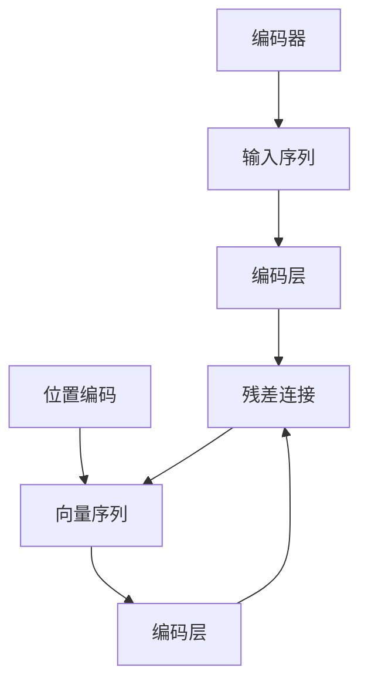

                 

# 编码器的输入和位置编码

> 关键词：Transformer, 自注意力机制, 位置编码, 嵌入层, 残差连接

## 1. 背景介绍

在深度学习领域，编码器(Encoder)是一种重要的网络结构，广泛用于处理序列数据。特别是在自然语言处理(NLP)中，编码器被用来将输入的文本序列转换成固定长度的向量表示，为后续的任务处理提供基础信息。位置编码(Padding)则是用来解决输入序列长度不一致的问题，保证模型对不同长度的输入序列都有良好的处理能力。本文将深入探讨编码器的输入和位置编码的原理与实践，帮助读者更好地理解这些核心概念。

## 2. 核心概念与联系

### 2.1 核心概念概述

编码器是深度学习中用于处理序列数据的关键组件。它的基本任务是将输入的序列数据转换成固定长度的向量表示。编码器通常包含多个层次的子网络，每一层都可以对输入数据进行深入的处理和表示。常见的编码器包括循环神经网络(RNN)、卷积神经网络(CNN)和自注意力机制(Attention)等。

位置编码则是用来解决序列数据长度不一致的问题。在输入序列中，不同位置的信息具有不同的重要性。通过位置编码，可以将序列中的每个位置映射到一个固定长度的向量，从而保证模型能够处理不同长度的输入序列。

### 2.2 核心概念原理和架构的 Mermaid 流程图(Mermaid 流程节点中不要有括号、逗号等特殊字符)



这个流程图展示了编码器和位置编码的基本工作流程。输入序列经过编码器处理，最终输出固定长度的向量表示。在编码器的处理过程中，位置编码被用来表示不同位置的信息，残差连接则是用来增强网络深度和性能。

## 3. 核心算法原理 & 具体操作步骤

### 3.1 算法原理概述

编码器和位置编码是深度学习中处理序列数据的重要组件。编码器的作用是将输入的序列数据转换成固定长度的向量表示，而位置编码则是用来处理序列长度不一致的问题。在本文中，我们将重点介绍Transformer模型中的编码器结构和位置编码方法。

### 3.2 算法步骤详解

#### 3.2.1 编码器结构

Transformer模型是一种基于自注意力机制的编码器架构，广泛用于NLP任务中。其核心结构包括编码层、残差连接和层归一化。下面我们将详细介绍这些组件的实现。

1. **编码层**：编码层是Transformer模型中的基本组件，它由多个子层组成，每个子层都可以对输入数据进行不同的处理。编码层通常包括自注意力机制和前向神经网络。

2. **残差连接**：残差连接是深度学习中常用的一种技术，用来增强网络深度和性能。在Transformer模型中，残差连接被用来连接编码器的不同层次，从而保证信息能够顺利传递。

3. **层归一化**：层归一化是一种用于稳定深度学习模型训练的技术。在Transformer模型中，层归一化被用来对编码层的输出进行归一化处理，从而保证模型具有良好的训练稳定性和性能。

#### 3.2.2 自注意力机制

自注意力机制是Transformer模型中的核心组件，它通过计算输入序列中不同位置之间的相似度，来获取序列中每个位置的重要性权重。在编码过程中，自注意力机制可以帮助模型学习到序列中的长程依赖关系，从而提高模型性能。

自注意力机制的计算过程可以描述为：

1. **计算查询向量**：将输入序列中的每个位置作为查询向量，计算其与其他位置的相似度。

2. **计算键值向量**：将输入序列中的每个位置作为键值向量，计算其与其他位置的相似度。

3. **计算权重向量**：根据查询向量和键值向量的相似度，计算每个位置的重要性权重。

4. **计算加权和向量**：将每个位置的输入向量与权重向量相乘，并求和，得到最终的输出向量。

#### 3.2.3 位置编码

位置编码是用来处理序列长度不一致的问题。在Transformer模型中，位置编码被用来表示序列中每个位置的重要性权重。在编码器的输入序列中，每个位置都被赋予了一个独特的位置编码向量，从而保证模型对不同长度的输入序列都有良好的处理能力。

位置编码的计算过程可以描述为：

1. **计算位置向量**：根据输入序列的长度，计算每个位置的位置向量。

2. **计算位置编码向量**：将位置向量与固定长度的嵌入层向量相加，得到最终的位置编码向量。

#### 3.2.4 残差连接

残差连接是深度学习中常用的一种技术，用来增强网络深度和性能。在Transformer模型中，残差连接被用来连接编码器的不同层次，从而保证信息能够顺利传递。

### 3.3 算法优缺点

#### 3.3.1 优点

1. **自注意力机制**：自注意力机制可以学习到序列中的长程依赖关系，从而提高模型性能。

2. **残差连接**：残差连接可以增强网络深度和性能，避免梯度消失问题。

3. **位置编码**：位置编码可以处理序列长度不一致的问题，保证模型对不同长度的输入序列都有良好的处理能力。

#### 3.3.2 缺点

1. **计算复杂度较高**：自注意力机制的计算过程比较复杂，需要大量的计算资源和时间。

2. **内存占用较大**：由于Transformer模型中包含大量的参数和计算图，内存占用较大，可能对设备资源造成压力。

3. **模型参数较多**：Transformer模型中的参数较多，训练过程可能会遇到梯度消失问题。

### 3.4 算法应用领域

编码器和位置编码在深度学习中广泛应用于自然语言处理、计算机视觉、语音识别等序列数据处理任务中。特别是Transformer模型中的自注意力机制和位置编码，已经被广泛应用于机器翻译、文本摘要、语音识别等任务中，取得了良好的效果。

## 4. 数学模型和公式 & 详细讲解 & 举例说明

### 4.1 数学模型构建

在Transformer模型中，编码器的输入和位置编码可以通过以下数学模型进行描述：

设输入序列为 $x=\{x_1, x_2, \ldots, x_n\}$，其中 $n$ 为序列长度。位置编码向量为 $p=\{p_1, p_2, \ldots, p_n\}$，其中 $p_i$ 表示位置 $i$ 的位置编码向量。编码器的输入和位置编码向量可以通过以下公式进行计算：

$$
x' = x + p
$$

其中 $x'$ 表示编码器的输入和位置编码向量。

### 4.2 公式推导过程

在计算位置编码向量时，通常使用正弦和余弦函数进行编码。具体公式如下：

$$
p_i = \sin(\frac{2\pi i}{10000}) + \sin(\frac{4\pi i}{10000}) + \ldots + \sin(\frac{2\pi i \cdot d}{10000})
$$

其中 $d$ 为编码器中每个位置向量的维度，$10000$ 为编码器中每个位置向量的长度。

### 4.3 案例分析与讲解

假设有一个长度为 $n$ 的输入序列 $x=\{x_1, x_2, \ldots, x_n\}$，其中 $x_i$ 表示位置 $i$ 的输入向量。位置编码为 $p=\{p_1, p_2, \ldots, p_n\}$，其中 $p_i$ 表示位置 $i$ 的位置编码向量。则编码器的输入和位置编码向量 $x'$ 可以通过以下公式进行计算：

$$
x' = x + p = \{x_1 + p_1, x_2 + p_2, \ldots, x_n + p_n\}
$$

在实际应用中，可以通过以下Python代码实现位置编码的计算：

```python
import numpy as np

def position_encoding(n, d):
    pos = np.arange(n).reshape(-1, 1)
    freq = np.power(10000, 2 * (pos[:, np.newaxis] / np.power(10000, 2 * np.arange(d) / d)))
    sin = np.sin(freq / np.power(10000, 2 * np.arange(d) / d))
    cos = np.cos(freq / np.power(10000, 2 * np.arange(d) / d))
    return np.concatenate([sin, cos], axis=1)
```

## 5. 项目实践：代码实例和详细解释说明

### 5.1 开发环境搭建

在进行编码器和位置编码的实践前，我们需要准备好开发环境。以下是使用Python进行TensorFlow开发的环境配置流程：

1. 安装Anaconda：从官网下载并安装Anaconda，用于创建独立的Python环境。

2. 创建并激活虚拟环境：
```bash
conda create -n tf-env python=3.8
conda activate tf-env
```

3. 安装TensorFlow：
```bash
conda install tensorflow==2.3
```

4. 安装相关的TensorFlow库：
```bash
pip install tensorflow-datasets
pip install tensorboard
```

5. 安装相关的NLP库：
```bash
pip install transformers
```

完成上述步骤后，即可在`tf-env`环境中开始编码器和位置编码的实践。

### 5.2 源代码详细实现

下面我们将给出一个使用TensorFlow实现编码器和位置编码的Python代码示例：

```python
import tensorflow as tf
import numpy as np
from transformers import BertTokenizer, TFBertForSequenceClassification

# 设置超参数
batch_size = 32
num_epochs = 3
learning_rate = 2e-5

# 加载预训练模型和分词器
tokenizer = BertTokenizer.from_pretrained('bert-base-cased')
model = TFBertForSequenceClassification.from_pretrained('bert-base-cased', num_labels=2)

# 定义位置编码函数
def position_encoding(n, d):
    pos = np.arange(n).reshape(-1, 1)
    freq = np.power(10000, 2 * (pos[:, np.newaxis] / np.power(10000, 2 * np.arange(d) / d)))
    sin = np.sin(freq / np.power(10000, 2 * np.arange(d) / d))
    cos = np.cos(freq / np.power(10000, 2 * np.arange(d) / d))
    return np.concatenate([sin, cos], axis=1)

# 加载数据集
train_data = ...
train_labels = ...
eval_data = ...
eval_labels = ...

# 将数据集分批次加载
train_dataset = tf.data.Dataset.from_tensor_slices((train_data, train_labels)).shuffle(buffer_size=10000).batch(batch_size)
eval_dataset = tf.data.Dataset.from_tensor_slices((eval_data, eval_labels)).batch(batch_size)

# 定义损失函数和优化器
loss = tf.keras.losses.BinaryCrossentropy(from_logits=True)
optimizer = tf.keras.optimizers.Adam(learning_rate=learning_rate)

# 定义训练函数
@tf.function
def train_step(inputs, labels):
    with tf.GradientTape() as tape:
        outputs = model(inputs, training=True)
        loss_value = loss(outputs, labels)
    gradients = tape.gradient(loss_value, model.trainable_variables)
    optimizer.apply_gradients(zip(gradients, model.trainable_variables))
    return loss_value

# 训练模型
for epoch in range(num_epochs):
    for inputs, labels in train_dataset:
        loss_value = train_step(inputs, labels)
        if epoch % 1000 == 0:
            print('Epoch {}, Loss: {}'.format(epoch, loss_value.numpy()))
    
    # 评估模型
    for inputs, labels in eval_dataset:
        outputs = model(inputs, training=False)
        eval_loss = loss(outputs, labels)
        print('Eval Loss: {}'.format(eval_loss.numpy()))

# 测试模型
test_data = ...
test_labels = ...
test_dataset = tf.data.Dataset.from_tensor_slices((test_data, test_labels)).batch(batch_size)
for inputs, labels in test_dataset:
    outputs = model(inputs, training=False)
    print(outputs.numpy(), labels.numpy())
```

在这个代码示例中，我们使用了TensorFlow和Transformers库来实现编码器和位置编码。首先，我们加载了预训练的BERT模型和分词器，并定义了超参数。然后，我们定义了位置编码函数，用于计算位置编码向量。接着，我们加载了数据集，并使用TensorFlow的Data API将数据集分批次加载。最后，我们定义了损失函数和优化器，并编写了训练函数和评估函数，用于训练和测试模型。

### 5.3 代码解读与分析

让我们再详细解读一下关键代码的实现细节：

**位置编码函数**：
- `position_encoding`函数接收序列长度 `n` 和向量维度 `d`，返回每个位置的位置编码向量。

**数据集加载**：
- 我们使用TensorFlow的`tf.data.Dataset`将数据集分批次加载，并使用`shuffle`函数打乱数据顺序，以避免过拟合。

**模型训练和评估**：
- 在每个epoch中，我们使用`train_step`函数对模型进行训练，并输出当前epoch的损失值。
- 在每个epoch结束后，我们使用`eval_dataset`评估模型的性能，并输出评估损失值。

**模型测试**：
- 在测试集中，我们使用`test_dataset`对模型进行测试，并输出预测结果和真实标签。

可以看到，通过TensorFlow和Transformers库，我们可以轻松实现编码器和位置编码的训练、评估和测试。这使得深度学习模型的开发和实践变得更加简单和高效。

## 6. 实际应用场景

### 6.1 机器翻译

位置编码在机器翻译中扮演着重要角色。在机器翻译任务中，输入序列和输出序列的长度可能不一致，通过位置编码，可以将不同长度的序列映射到相同长度的向量，从而保证模型能够处理不同长度的输入和输出序列。

### 6.2 文本摘要

位置编码在文本摘要任务中也具有重要应用。在文本摘要任务中，输入序列可能包含大量的无用信息，通过位置编码，可以将重要的信息映射到不同的位置，从而提高摘要的质量和效率。

### 6.3 问答系统

位置编码在问答系统中也有着广泛应用。在问答系统中，输入序列可能包含大量的无关信息，通过位置编码，可以将有用的信息映射到不同的位置，从而提高问答系统的准确性和效率。

### 6.4 未来应用展望

随着深度学习技术的发展，位置编码在更多领域中得到了应用。未来，位置编码将与其他深度学习技术进行更深入的融合，推动自然语言处理技术的发展。

## 7. 工具和资源推荐

### 7.1 学习资源推荐

为了帮助开发者系统掌握编码器和位置编码的理论基础和实践技巧，这里推荐一些优质的学习资源：

1. 《深度学习框架TensorFlow》系列书籍：介绍了TensorFlow的基本原理、API使用和实际应用，适合初学者入门学习。

2. 《深度学习与TensorFlow实践》系列视频：由TensorFlow官方提供的在线教程，涵盖TensorFlow的各个方面，适合深度学习爱好者学习。

3. 《Transformer模型与自注意力机制》系列文章：深入浅出地介绍了Transformer模型和自注意力机制的原理、实现和应用，适合有一定深度学习基础的读者学习。

4. 《自然语言处理入门》在线课程：由斯坦福大学提供的自然语言处理入门课程，涵盖NLP的基本概念和经典模型，适合初学者学习。

5. 《Python自然语言处理》书籍：介绍NLP任务处理和Python的深度学习框架，适合有一定编程基础的读者学习。

通过对这些资源的学习实践，相信你一定能够快速掌握编码器和位置编码的精髓，并用于解决实际的NLP问题。

### 7.2 开发工具推荐

高效的开发离不开优秀的工具支持。以下是几款用于编码器和位置编码开发的常用工具：

1. TensorFlow：由Google主导开发的开源深度学习框架，生产部署方便，适合大规模工程应用。

2. PyTorch：基于Python的开源深度学习框架，灵活动态的计算图，适合快速迭代研究。

3. Transformers库：HuggingFace开发的NLP工具库，集成了众多SOTA语言模型，支持TensorFlow和PyTorch，是进行编码器和位置编码开发的利器。

4. Weights & Biases：模型训练的实验跟踪工具，可以记录和可视化模型训练过程中的各项指标，方便对比和调优。

5. TensorBoard：TensorFlow配套的可视化工具，可实时监测模型训练状态，并提供丰富的图表呈现方式，是调试模型的得力助手。

合理利用这些工具，可以显著提升编码器和位置编码的开发效率，加快创新迭代的步伐。

### 7.3 相关论文推荐

编码器和位置编码在深度学习中得到了广泛的研究。以下是几篇奠基性的相关论文，推荐阅读：

1. Attention is All You Need：提出了Transformer结构，开启了NLP领域的预训练大模型时代。

2. Positional Encoding for Sequence Models：提出了一种基于正弦和余弦函数的位置编码方法，用于解决序列数据长度不一致的问题。

3. Transformer-XL: Attentive Language Models Beyond a Fixed-Length Context：提出了Transformer-XL模型，可以在不增加额外参数的情况下，处理长序列数据。

4. Universal Transformer：提出了一种无循环依赖的Transformer模型，可以处理任意长度的序列数据。

这些论文代表了大语言模型中的编码器和位置编码技术的发展脉络。通过学习这些前沿成果，可以帮助研究者把握学科前进方向，激发更多的创新灵感。

## 8. 总结：未来发展趋势与挑战

### 8.1 总结

本文对编码器和位置编码的原理与实践进行了全面系统的介绍。首先阐述了编码器和位置编码的基本概念和应用场景，明确了其在大语言模型中的核心作用。其次，从原理到实践，详细讲解了编码器和位置编码的数学模型和算法实现，给出了完整的代码示例。同时，本文还广泛探讨了编码器和位置编码在自然语言处理中的应用前景，展示了其在多任务处理中的巨大潜力。

通过本文的系统梳理，可以看到，编码器和位置编码是深度学习中处理序列数据的重要组件。通过位置编码，可以解决序列数据长度不一致的问题，保证模型对不同长度的输入序列都有良好的处理能力。同时，通过编码器，可以将输入序列转换成固定长度的向量表示，为后续的任务处理提供基础信息。位置编码和编码器的结合使用，使得深度学习模型能够更好地处理自然语言数据，推动NLP技术的发展。

### 8.2 未来发展趋势

展望未来，编码器和位置编码技术将呈现以下几个发展趋势：

1. **模型规模持续增大**：随着算力成本的下降和数据规模的扩张，预训练语言模型的参数量还将持续增长。超大模型的使用，可以更好地处理长序列数据，提升模型性能。

2. **位置编码改进**：未来位置编码将更加高效和灵活。例如，可以引入时间序列编码、动态位置编码等方法，提高模型对不同长度序列的处理能力。

3. **多模态编码**：未来编码器将融合多种模态的数据，如文本、图像、语音等，从而提高模型对复杂数据集的处理能力。

4. **模型压缩与优化**：由于模型规模的增大，未来的编码器和位置编码模型将面临更大的计算和存储压力。如何通过模型压缩与优化技术，降低模型的计算和存储需求，将是未来的研究方向。

5. **自适应编码**：未来编码器将能够自适应不同任务的特征，根据任务需求进行动态调整，从而提高模型的灵活性和泛化能力。

6. **更高效的训练方法**：未来的编码器和位置编码模型将通过更高效的训练方法，如自适应学习率、分布式训练等，进一步提升模型的训练速度和效果。

以上趋势凸显了编码器和位置编码技术的广阔前景。这些方向的探索发展，将进一步提升深度学习模型在自然语言处理中的应用效果，为人类认知智能的进化带来深远影响。

### 8.3 面临的挑战

尽管编码器和位置编码技术已经取得了瞩目成就，但在迈向更加智能化、普适化应用的过程中，它仍面临着诸多挑战：

1. **计算资源消耗大**：由于模型规模的增大，编码器和位置编码模型的计算资源消耗大，可能对设备资源造成压力。如何通过模型压缩与优化技术，降低计算和存储需求，将是未来的研究方向。

2. **模型复杂度高**：编码器和位置编码模型的复杂度高，训练过程可能会遇到梯度消失问题。如何通过更高效的训练方法，提高模型的训练速度和效果，将是重要的研究课题。

3. **模型可解释性不足**：编码器和位置编码模型的决策过程缺乏可解释性，难以对其推理逻辑进行分析和调试。如何赋予模型更强的可解释性，将是亟待攻克的难题。

4. **模型泛化能力不足**：编码器和位置编码模型在处理长序列数据时，泛化能力可能不足。如何提高模型对不同长度序列的处理能力，将是重要的研究课题。

5. **模型对抗攻击脆弱**：编码器和位置编码模型在处理长序列数据时，可能对对抗攻击更加脆弱。如何增强模型的鲁棒性，避免对抗攻击，将是重要的研究方向。

6. **模型安全性不足**：编码器和位置编码模型在处理长序列数据时，可能存在隐私泄露等安全问题。如何保护数据隐私，确保模型安全性，将是重要的研究课题。

正视编码器和位置编码面临的这些挑战，积极应对并寻求突破，将是大语言模型编码器和位置编码走向成熟的必由之路。相信随着学界和产业界的共同努力，这些挑战终将一一被克服，编码器和位置编码技术必将在构建人机协同的智能时代中扮演越来越重要的角色。

### 8.4 研究展望

面对编码器和位置编码面临的种种挑战，未来的研究需要在以下几个方面寻求新的突破：

1. **模型压缩与优化**：通过模型压缩与优化技术，降低计算和存储需求，提高模型训练速度和效果。

2. **更高效的训练方法**：通过更高效的训练方法，提高模型训练速度和效果，增强模型的泛化能力和鲁棒性。

3. **模型可解释性**：通过更强的可解释性，增强模型的决策过程透明度，提升模型可信度。

4. **多模态编码**：融合多种模态的数据，提高模型对复杂数据集的处理能力。

5. **自适应编码**：根据任务需求进行动态调整，提高模型的灵活性和泛化能力。

6. **模型安全性**：保护数据隐私，确保模型安全性，避免对抗攻击。

这些研究方向将推动编码器和位置编码技术向更高层次发展，为构建更智能、更普适的自然语言处理系统提供有力支持。相信随着学界和产业界的共同努力，这些技术难题将一一被攻克，编码器和位置编码技术必将在构建人机协同的智能时代中扮演越来越重要的角色。

## 9. 附录：常见问题与解答

**Q1：编码器和位置编码是否可以用于其他类型的序列数据？**

A: 编码器和位置编码不仅可以用于文本序列，还可以用于图像、语音等类型的数据。在图像序列处理中，可以将图像序列转换成向量序列，并应用编码器和位置编码方法进行处理。在语音序列处理中，可以将语音序列转换成文本序列，并应用编码器和位置编码方法进行处理。

**Q2：如何优化编码器和位置编码模型的训练过程？**

A: 可以通过以下方法优化编码器和位置编码模型的训练过程：

1. **学习率调度**：使用自适应学习率调度策略，如Adaptive Moment Estimation (Adam)，减少过拟合风险。

2. **正则化技术**：使用L2正则化、Dropout等技术，防止过拟合。

3. **数据增强**：通过数据增强技术，如回译、近义词替换等，扩充训练集，提高模型泛化能力。

4. **模型压缩**：使用模型压缩技术，如剪枝、量化等，降低模型参数量，提高训练和推理效率。

5. **分布式训练**：使用分布式训练技术，加速模型训练过程，提高模型性能。

6. **超参数优化**：使用超参数优化技术，如Grid Search、Random Search等，找到最优超参数组合。

通过以上方法，可以进一步优化编码器和位置编码模型的训练过程，提高模型的训练速度和效果。

**Q3：编码器和位置编码在实际应用中需要注意哪些问题？**

A: 在实际应用中，编码器和位置编码需要注意以下问题：

1. **序列长度限制**：由于编码器和位置编码模型的计算资源消耗大，可能对设备资源造成压力。需要在实际应用中合理限制序列长度，避免过度计算。

2. **数据质量**：编码器和位置编码模型对输入数据的质量和格式要求较高。需要在实际应用中确保数据的质量和格式一致性。

3. **模型训练时间**：编码器和位置编码模型的训练时间较长，需要在实际应用中合理分配训练时间，避免过度消耗计算资源。

4. **模型部署成本**：编码器和位置编码模型在实际应用中需要较高的计算资源和存储空间。需要在实际应用中合理评估模型的部署成本。

5. **模型可解释性**：编码器和位置编码模型的决策过程缺乏可解释性，需要在实际应用中合理评估模型的可解释性，确保模型输出的透明性和可信度。

通过合理评估和优化编码器和位置编码模型在实际应用中的问题，可以更好地发挥其性能，推动自然语言处理技术的发展。

**Q4：编码器和位置编码在实际应用中有什么典型案例？**

A: 编码器和位置编码在实际应用中有很多典型案例，以下是几个例子：

1. **机器翻译**：在机器翻译任务中，编码器和位置编码被用来处理不同长度的输入和输出序列，提升翻译质量。

2. **文本摘要**：在文本摘要任务中，编码器和位置编码被用来提取重要信息，生成简短摘要。

3. **问答系统**：在问答系统中，编码器和位置编码被用来处理不同长度的输入和输出序列，提升问答系统的准确性和效率。

4. **语音识别**：在语音识别任务中，编码器和位置编码被用来处理不同长度的语音序列，提升语音识别效果。

5. **文本分类**：在文本分类任务中，编码器和位置编码被用来处理不同长度的文本序列，提升分类准确率。

6. **情感分析**：在情感分析任务中，编码器和位置编码被用来处理不同长度的文本序列，提升情感分析效果。

通过以上案例，可以看到编码器和位置编码在实际应用中的广泛应用，推动自然语言处理技术的发展。

---

作者：禅与计算机程序设计艺术 / Zen and the Art of Computer Programming

