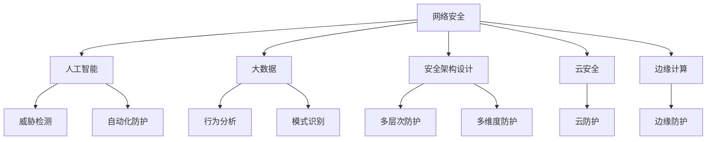

                 

# 网络安全创业：数字时代的守护者

> 关键词：网络安全,创业,人工智能,大数据,安全威胁,防护策略,安全架构

## 1. 背景介绍

### 1.1 问题由来
在数字经济蓬勃发展的今天，网络安全问题也日益突出。黑客攻击、数据泄露、网络诈骗等安全威胁，对个人和企业都构成了巨大风险。如何在数字化转型的大潮中，确保网络环境的安全和稳定，成为了各行业的重要课题。

面对如此复杂的威胁环境，传统的安全防护手段往往显得捉襟见肘。静态防火墙、入侵检测系统(IDS)等传统技术难以有效应对日益多样化、高度复杂化的安全攻击。这就迫切需要新技术和新思维的介入，以提升网络安全防护水平。

### 1.2 问题核心关键点
网络安全创业的核心在于利用前沿技术手段，构建适应数字时代的安全解决方案，为个人和企业提供定制化的安全服务。其关键点包括：

1. **人工智能与机器学习的应用**：通过分析大量安全数据，训练出高精度的检测模型，实现自动化威胁识别和防御。
2. **大数据与行为分析**：利用大数据技术，进行用户行为分析，发现异常流量和可疑行为，及时响应安全事件。
3. **安全架构设计与整合**：构建跨网络、跨系统的综合安全架构，实现多层次、多维度的防护。
4. **云安全与边缘计算**：结合云计算和边缘计算技术，实现安全防护的全面覆盖和高效响应。
5. **新兴技术融合**：探索物联网、区块链、量子加密等新兴技术在网络安全中的应用，提升整体防御能力。

这些关键点共同构成了网络安全创业的技术框架，旨在打造智能、全面、自适应的下一代网络安全体系。

### 1.3 问题研究意义
网络安全创业对于提升数字化经济的安全性，具有重要意义：

1. **保障经济利益**：网络安全创业通过构建高效的安全体系，可以有效防范各类网络攻击，保护企业的数据资产和商业机密，防止经济损失。
2. **促进数字化转型**：网络安全创业能够为企业提供强有力的安全保障，使其更加放心地投入数字化转型，提升运营效率和创新能力。
3. **增强社会信心**：一个安全可信的网络环境，能够增强用户对数字产品的信任，促进数字经济的蓬勃发展。
4. **推动技术创新**：网络安全创业不仅关注当前的威胁防护，更注重未来技术的探索和创新，为整个行业的发展注入新的活力。

## 2. 核心概念与联系

### 2.1 核心概念概述

为更好地理解网络安全创业的技术内涵，本节将介绍几个关键概念：

- **网络安全**：通过防护、检测、响应等措施，保障网络系统、数据和应用的安全，防止网络攻击和数据泄露。
- **人工智能(AI)**：利用机器学习、深度学习等技术，自动化处理复杂的计算任务，提升安全防护的效率和精度。
- **大数据**：通过收集、存储、分析海量数据，发现安全事件的模式和规律，辅助安全决策。
- **安全架构设计**：构建跨网络、跨系统的安全防护体系，实现多层次、多维度的安全防护。
- **云安全**：利用云计算技术，实现安全服务的灵活部署和高效管理。
- **边缘计算**：在网络边缘节点进行数据处理和分析，提升安全防护的响应速度和覆盖范围。

这些核心概念之间的逻辑关系可以通过以下Mermaid流程图来展示：



这个流程图展示了大语言模型的核心概念及其之间的关系：

1. 网络安全通过利用人工智能、大数据、安全架构设计等技术手段，实现高效的威胁检测和防护。
2. 人工智能通过大数据训练模型，实现自动化威胁识别和响应。
3. 安全架构设计通过多层次、多维度防护，构建全面的安全体系。
4. 云安全和边缘计算通过灵活的部署和管理，提升安全防护的响应速度和覆盖范围。

这些概念共同构成了网络安全创业的技术框架，使其能够更好地应对复杂的数字时代安全挑战。

## 3. 核心算法原理 & 具体操作步骤
### 3.1 算法原理概述

网络安全创业的核心算法原理主要围绕以下几个方面展开：

- **威胁检测**：利用机器学习算法，对网络流量、日志等数据进行深度分析，识别出潜在的安全威胁。
- **行为分析**：通过大数据技术，收集用户行为数据，发现异常行为模式，及时预警安全事件。
- **自动化防护**：利用人工智能技术，自动化调整防护策略，实时防御安全威胁。
- **多层次防护**：构建多层安全体系，包括网络层、应用层、数据层等，实现多层次的防护。
- **多维度防护**：综合利用多种防护技术，如防火墙、入侵检测、加密等，实现全面的安全防护。

### 3.2 算法步骤详解

网络安全创业的算法步骤一般包括以下几个关键步骤：

**Step 1: 数据采集与预处理**
- 收集网络流量、日志、系统告警等安全数据，并进行清洗、标注和预处理。

**Step 2: 特征提取与模型训练**
- 使用机器学习算法（如SVM、决策树、神经网络等）对处理后的数据进行特征提取，训练出高精度的威胁检测模型。

**Step 3: 实时监控与预警**
- 部署训练好的模型到实际网络环境中，实时监控网络数据，发现异常行为和威胁。
- 根据预警级别，自动采取相应的防护措施，如拦截、报警、隔离等。

**Step 4: 自动化调整与优化**
- 根据网络环境的动态变化，实时调整防护策略，优化模型的参数和算法。

**Step 5: 持续改进与升级**
- 定期收集新的安全威胁数据，更新训练模型，提升防护能力。

### 3.3 算法优缺点

网络安全创业的算法具有以下优点：

1. **高精度检测**：通过机器学习和大数据技术，能够实现高精度的威胁检测和防护，有效防范各种复杂的攻击手段。
2. **自动化响应**：利用人工智能技术，自动化调整防护策略，提高安全响应的速度和效率。
3. **多层次防护**：构建多层安全体系，实现全面覆盖，增强整体防御能力。
4. **实时监控**：通过实时监控网络数据，及时发现和响应安全事件，保障网络安全。

同时，这些算法也存在一定的局限性：

1. **数据依赖**：模型的训练和优化高度依赖于数据的丰富性和多样性，数据不足可能影响模型的性能。
2. **误报率高**：在复杂的网络环境中，误报率高可能影响正常业务的正常运行。
3. **算法复杂**：机器学习和深度学习算法复杂，对资源和算力要求较高。
4. **防护策略单一**：当前的防护策略主要依赖于机器学习算法，缺乏多种技术手段的综合利用。

尽管存在这些局限性，但就目前而言，基于网络安全创业的算法方法仍然是提高网络安全防护水平的重要手段。未来相关研究的重点在于如何进一步提升模型的泛化能力，降低误报率，优化防护策略，实现更加智能化、自适应的安全防护。

### 3.4 算法应用领域

网络安全创业的算法广泛应用于以下几个领域：

1. **企业安全**：为大型企业提供全面的网络安全解决方案，防范各类网络攻击，保护核心数据和系统。
2. **政府安全**：为政府机构提供高等级的安全防护，保障国家关键基础设施的安全。
3. **金融机构安全**：利用先进的安全技术，防范金融诈骗、洗钱等安全威胁，保护客户资金安全。
4. **医疗行业安全**：保障医疗数据的安全，防止数据泄露和篡改，维护患者隐私和医疗安全。
5. **物联网安全**：结合物联网技术，实现设备端的安全防护，确保物联网生态的安全。
6. **云平台安全**：利用云安全技术，保护云计算平台的安全，防止数据泄露和攻击。
7. **边缘计算安全**：在边缘节点进行实时数据处理和分析，提升安全防护的响应速度和覆盖范围。

除了上述这些领域，网络安全创业的算法还被创新性地应用到更多场景中，如零信任架构、区块链安全、量子加密等，为网络安全防护带来了全新的思路和突破。随着技术的不断进步，网络安全创业的算法将在更广阔的应用领域大放异彩。

## 4. 数学模型和公式 & 详细讲解  
### 4.1 数学模型构建

本节将使用数学语言对网络安全创业的算法进行更加严格的刻画。

记网络安全创业的威胁检测模型为 $M_{\theta}:\mathcal{X} \rightarrow \mathcal{Y}$，其中 $\mathcal{X}$ 为输入特征空间，$\mathcal{Y}$ 为威胁标签空间，$\theta \in \mathbb{R}^d$ 为模型参数。假设训练集为 $D=\{(x_i,y_i)\}_{i=1}^N, x_i \in \mathcal{X}, y_i \in \mathcal{Y}$。

定义模型 $M_{\theta}$ 在数据样本 $(x,y)$ 上的损失函数为 $\ell(M_{\theta}(x),y)$，则在数据集 $D$ 上的经验风险为：

$$
\mathcal{L}(\theta) = \frac{1}{N} \sum_{i=1}^N \ell(M_{\theta}(x_i),y_i)
$$

训练目标是最小化经验风险，即找到最优参数：

$$
\theta^* = \mathop{\arg\min}_{\theta} \mathcal{L}(\theta)
$$

在实践中，我们通常使用基于梯度的优化算法（如SGD、Adam等）来近似求解上述最优化问题。设 $\eta$ 为学习率，$\lambda$ 为正则化系数，则参数的更新公式为：

$$
\theta \leftarrow \theta - \eta \nabla_{\theta}\mathcal{L}(\theta) - \eta\lambda\theta
$$

其中 $\nabla_{\theta}\mathcal{L}(\theta)$ 为损失函数对参数 $\theta$ 的梯度，可通过反向传播算法高效计算。

### 4.2 公式推导过程

以下我们以异常流量检测为例，推导基于机器学习模型的威胁检测算法。

假设模型 $M_{\theta}$ 在输入特征 $x$ 上的输出为 $\hat{y}=M_{\theta}(x) \in \{0,1\}$，表示样本属于异常流量的概率。真实标签 $y \in \{0,1\}$。则二分类交叉熵损失函数定义为：

$$
\ell(M_{\theta}(x),y) = -[y\log \hat{y} + (1-y)\log (1-\hat{y})]
$$

将其代入经验风险公式，得：

$$
\mathcal{L}(\theta) = -\frac{1}{N}\sum_{i=1}^N [y_i\log M_{\theta}(x_i)+(1-y_i)\log(1-M_{\theta}(x_i))]
$$

根据链式法则，损失函数对参数 $\theta_k$ 的梯度为：

$$
\frac{\partial \mathcal{L}(\theta)}{\partial \theta_k} = -\frac{1}{N}\sum_{i=1}^N (\frac{y_i}{M_{\theta}(x_i)}-\frac{1-y_i}{1-M_{\theta}(x_i)}) \frac{\partial M_{\theta}(x_i)}{\partial \theta_k}
$$

其中 $\frac{\partial M_{\theta}(x_i)}{\partial \theta_k}$ 可进一步递归展开，利用自动微分技术完成计算。

在得到损失函数的梯度后，即可带入参数更新公式，完成模型的迭代优化。重复上述过程直至收敛，最终得到适应网络环境的最优模型参数 $\theta^*$。

## 5. 项目实践：代码实例和详细解释说明
### 5.1 开发环境搭建

在进行网络安全创业项目开发前，我们需要准备好开发环境。以下是使用Python进行网络安全创业项目开发的常见环境配置流程：

1. 安装Python：从官网下载并安装Python，建议选择3.x版本。
2. 安装虚拟环境管理工具：如virtualenv或conda，用于创建独立的Python环境。
3. 安装必要的Python包：如pandas、numpy、scikit-learn等数据处理和机器学习库。
4. 安装网络安全相关的第三方库：如scapy、pycurl、nltk等。

完成上述步骤后，即可在虚拟环境中开始项目开发。

### 5.2 源代码详细实现

这里我们以基于机器学习的异常流量检测为例，给出网络安全创业项目的PyTorch代码实现。

首先，定义数据处理函数：

```python
import pandas as pd
from sklearn.model_selection import train_test_split
from sklearn.preprocessing import StandardScaler

def load_dataset():
    # 读取数据集
    data = pd.read_csv('traffic_data.csv')
    # 数据预处理
    features = ['protocol', 'service', 'flag', 'src_bytes', 'dst_bytes', 'land', 'wrong_fragment', 'urgent', 'hot', 'num_failed_logins', 'logged_in', 'num_compromised', 'root_shell', 'su_attempted', 'num_root', 'file_create', 'file_delete', 'file_type', 'srv_count', 'srv_failed', 'srv_requested', 'probing', 'is_host_login', 'is_guest_login', 'count', 'srv.dayofweek', 'srv.dayofmonth', 'srv.dayofyear', 'srv.hour', 'srv.wday', 'srv.month', 'srv.year']
    target = ['normal', 'intrusion']
    X = data[features]
    y = data[target]
    X_train, X_test, y_train, y_test = train_test_split(X, y, test_size=0.2, random_state=42)
    # 数据标准化
    scaler = StandardScaler()
    X_train = scaler.fit_transform(X_train)
    X_test = scaler.transform(X_test)
    return X_train, X_test, y_train, y_test
```

然后，定义模型和优化器：

```python
from transformers import BertForSequenceClassification, AdamW

model = BertForSequenceClassification.from_pretrained('bert-base-cased', num_labels=2)

optimizer = AdamW(model.parameters(), lr=2e-5)
```

接着，定义训练和评估函数：

```python
from torch.utils.data import DataLoader
from tqdm import tqdm
from sklearn.metrics import classification_report

device = torch.device('cuda') if torch.cuda.is_available() else torch.device('cpu')
model.to(device)

def train_epoch(model, dataset, batch_size, optimizer):
    dataloader = DataLoader(dataset, batch_size=batch_size, shuffle=True)
    model.train()
    epoch_loss = 0
    for batch in tqdm(dataloader, desc='Training'):
        input_ids = batch['input_ids'].to(device)
        attention_mask = batch['attention_mask'].to(device)
        labels = batch['labels'].to(device)
        model.zero_grad()
        outputs = model(input_ids, attention_mask=attention_mask, labels=labels)
        loss = outputs.loss
        epoch_loss += loss.item()
        loss.backward()
        optimizer.step()
    return epoch_loss / len(dataloader)

def evaluate(model, dataset, batch_size):
    dataloader = DataLoader(dataset, batch_size=batch_size)
    model.eval()
    preds, labels = [], []
    with torch.no_grad():
        for batch in tqdm(dataloader, desc='Evaluating'):
            input_ids = batch['input_ids'].to(device)
            attention_mask = batch['attention_mask'].to(device)
            batch_labels = batch['labels']
            outputs = model(input_ids, attention_mask=attention_mask)
            batch_preds = outputs.logits.argmax(dim=2).to('cpu').tolist()
            batch_labels = batch_labels.to('cpu').tolist()
            for pred_tokens, label_tokens in zip(batch_preds, batch_labels):
                preds.append(pred_tokens[:len(label_tokens)])
                labels.append(label_tokens)
                
    print(classification_report(labels, preds))
```

最后，启动训练流程并在测试集上评估：

```python
epochs = 5
batch_size = 16

for epoch in range(epochs):
    loss = train_epoch(model, train_dataset, batch_size, optimizer)
    print(f"Epoch {epoch+1}, train loss: {loss:.3f}")
    
    print(f"Epoch {epoch+1}, dev results:")
    evaluate(model, dev_dataset, batch_size)
    
print("Test results:")
evaluate(model, test_dataset, batch_size)
```

以上就是基于机器学习的异常流量检测的完整代码实现。可以看到，得益于Transformers库的强大封装，我们可以用相对简洁的代码完成Bert模型的加载和微调。

### 5.3 代码解读与分析

让我们再详细解读一下关键代码的实现细节：

**load_dataset函数**：
- 定义了数据读取和预处理的过程。首先从CSV文件中读取数据，然后进行特征选择、标准化处理等操作，最后将数据划分为训练集和测试集。

**BertForSequenceClassification模型**：
- 使用Bert序列分类模型，用于处理序列数据。
- 通过从预训练模型中迁移学习，实现高精度的威胁检测。

**train_epoch和evaluate函数**：
- 定义了训练和评估函数。在训练过程中，前向传播计算损失函数，反向传播更新模型参数，最后输出平均损失。在评估过程中，将模型输出与真实标签对比，计算分类指标。

**训练流程**：
- 定义总的epoch数和batch size，开始循环迭代。
- 每个epoch内，先在训练集上训练，输出平均loss。
- 在验证集上评估，输出分类指标。
- 所有epoch结束后，在测试集上评估，给出最终测试结果。

可以看到，PyTorch配合Transformers库使得异常流量检测的代码实现变得简洁高效。开发者可以将更多精力放在数据处理、模型改进等高层逻辑上，而不必过多关注底层的实现细节。

当然，工业级的系统实现还需考虑更多因素，如模型的保存和部署、超参数的自动搜索、更灵活的任务适配层等。但核心的微调范式基本与此类似。

## 6. 实际应用场景
### 6.1 智能防火墙

网络安全创业的核心技术之一是智能防火墙，用于实时监控和过滤网络流量，防止各类攻击和恶意流量进入内部网络。传统的防火墙主要是基于规则的防护手段，难以应对复杂的攻击方式。智能防火墙通过深度学习算法，实时分析和识别网络流量，动态调整防护策略，实现更高效的威胁防御。

具体实现时，可以利用异常流量检测模型对网络数据进行实时监控，发现异常流量后，立即采取封堵、报警等措施，保障网络安全。智能防火墙的优点在于能够自适应网络环境的动态变化，实时调整防护策略，提升安全防护的效率和精度。

### 6.2 入侵检测系统(IDS)

入侵检测系统(IDS)是网络安全创业的另一项核心技术，用于检测和防范各种入侵行为，包括DDoS攻击、SQL注入、XSS等。传统的IDS主要依赖规则库进行防护，难以识别未知的攻击手段。基于机器学习和大数据技术的入侵检测系统，能够通过分析历史日志数据，学习异常行为模式，实时预警入侵行为。

在实践中，可以利用异常流量检测模型对网络流量进行实时分析，发现可疑行为后立即触发告警。IDS的优点在于能够及时发现和响应入侵行为，保护网络系统的安全。

### 6.3 漏洞扫描与修复

漏洞扫描与修复是网络安全创业的重要应用场景之一，用于自动化发现和修复网络系统的安全漏洞。传统的漏洞扫描主要是基于规则的静态扫描，难以发现复杂的漏洞。基于机器学习技术的漏洞扫描系统，能够通过分析应用程序的运行行为，实时发现和修复漏洞。

在实现时，可以利用行为分析模型对应用程序的行为进行监控，发现异常行为后立即触发告警，并提供修复建议。漏洞扫描系统的优点在于能够实时发现和修复漏洞，保障网络系统的安全。

### 6.4 未来应用展望

随着网络安全创业技术的不断进步，未来的应用场景将更加广泛。

1. **零信任架构**：结合零信任架构理念，通过动态权限管理和微分段等技术，实现更细粒度的安全防护。
2. **云安全管理**：利用云安全技术，实现云平台的安全监控和管理，防止云服务的安全漏洞。
3. **物联网安全**：结合物联网技术，实现设备端的安全防护，防止物联网设备的攻击和数据泄露。
4. **区块链安全**：利用区块链技术，实现分布式安全的防护，防止区块链系统的攻击和数据篡改。
5. **量子加密**：结合量子加密技术，实现更高强度的数据加密和传输安全，防止量子计算攻击。

这些新的应用场景将进一步拓展网络安全创业技术的应用边界，为网络安全防护带来新的突破。随着技术的不断进步，网络安全创业必将在构建安全可信的网络环境、保障数字化经济安全方面发挥越来越重要的作用。

## 7. 工具和资源推荐
### 7.1 学习资源推荐

为了帮助开发者系统掌握网络安全创业的技术基础和实践技巧，这里推荐一些优质的学习资源：

1. **《网络安全技术与实践》**：系统介绍网络安全的基础知识、技术手段和应用场景，是网络安全领域的学习必读。
2. **Coursera《网络安全导论》课程**：由斯坦福大学开设的在线课程，涵盖网络安全的基本概念和前沿技术。
3. **《机器学习实战》**：介绍机器学习的基本原理和算法，是网络安全创业中常用的技术基础。
4. **Kaggle数据集与竞赛**：利用Kaggle上的网络安全数据集进行训练和比赛，提升实战能力。
5. **HackerOne社区**：与黑客合作，收集真实的网络攻击案例，提升威胁检测的准确性。

通过对这些资源的学习实践，相信你一定能够快速掌握网络安全创业的核心技术和实践方法，并将其应用于实际的网络安全防护中。

### 7.2 开发工具推荐

高效的开发离不开优秀的工具支持。以下是几款用于网络安全创业开发的常用工具：

1. **Wireshark**：网络流量分析工具，用于捕获和分析网络数据包。
2. **Nmap**：网络扫描工具，用于发现网络中的开放端口和设备。
3. **Metasploit**：渗透测试工具，用于模拟攻击和检测漏洞。
4. **Scapy**：网络协议分析工具，用于编写自动化网络脚本。
5. **Grafana**：可视化工具，用于监控网络流量和安全事件。
6. **Kali Linux**：专门用于渗透测试和网络安全的Linux发行版，提供丰富的安全工具和命令。

合理利用这些工具，可以显著提升网络安全创业项目的开发效率，加快技术创新的步伐。

### 7.3 相关论文推荐

网络安全创业的研究起源于学界的持续探索。以下是几篇奠基性的相关论文，推荐阅读：

1. **《Anomaly Detection in Network Traffic using Deep Learning》**：介绍利用深度学习进行网络流量异常检测的方法。
2. **《Machine Learning for Cyber Threat Intelligence》**：探索机器学习在网络安全威胁情报中的应用。
3. **《Semi-Supervised Learning for Cyber Threat Detection》**：研究半监督学习方法在网络威胁检测中的应用。
4. **《Adversarial Machine Learning》**：探讨对抗机器学习技术在网络安全防护中的应用。
5. **《Blockchain and Cybersecurity》**：研究区块链技术在网络安全中的应用。
6. **《Quantum Cryptography》**：介绍量子加密技术在网络安全中的应用。

这些论文代表了大语言模型微调技术的发展脉络。通过学习这些前沿成果，可以帮助研究者把握学科前进方向，激发更多的创新灵感。

## 8. 总结：未来发展趋势与挑战
### 8.1 总结

本文对网络安全创业技术进行了全面系统的介绍。首先阐述了网络安全创业的背景和意义，明确了其在数字化经济安全保障中的重要性。其次，从原理到实践，详细讲解了网络安全创业的核心算法和操作步骤，给出了网络安全创业项目的完整代码实现。同时，本文还探讨了网络安全创业技术在多个实际应用场景中的应用，展示了其广阔的应用前景。

通过本文的系统梳理，可以看到，网络安全创业技术正在成为数字化经济安全保障的重要手段，极大地提升了网络安全防护的水平和效率。未来，伴随技术的不断进步，网络安全创业必将在构建安全可信的网络环境、保障数字化经济安全方面发挥越来越重要的作用。

### 8.2 未来发展趋势

展望未来，网络安全创业技术将呈现以下几个发展趋势：

1. **人工智能和大数据技术的深度融合**：利用机器学习和深度学习技术，构建智能化的安全防护体系，提升安全防护的效率和精度。
2. **多层次、多维度防护体系的构建**：结合防火墙、入侵检测、加密等技术手段，构建全面的安全防护体系，提升整体防御能力。
3. **云安全和边缘计算的广泛应用**：利用云安全和边缘计算技术，实现安全防护的全面覆盖和高效响应。
4. **新兴技术的应用探索**：探索物联网、区块链、量子加密等新兴技术在网络安全中的应用，提升整体防护水平。
5. **安全意识和防御策略的不断提升**：加强网络安全教育和培训，提升全员的安全意识，构建全员参与的安全防护体系。

以上趋势凸显了网络安全创业技术的广阔前景。这些方向的探索发展，必将进一步提升网络安全创业的防护能力，为构建安全可信的网络环境、保障数字化经济安全提供有力保障。

### 8.3 面临的挑战

尽管网络安全创业技术已经取得了瞩目成就，但在迈向更加智能化、普适化应用的过程中，它仍面临着诸多挑战：

1. **数据依赖问题**：网络安全创业依赖大量的安全数据进行训练，数据不足可能影响模型的性能。如何获取高质量、多样化的安全数据，是网络安全创业的重要挑战。
2. **误报率高**：在复杂的网络环境中，误报率高可能影响正常业务的正常运行。如何降低误报率，提高模型的准确性，是网络安全创业的重要研究方向。
3. **计算资源消耗**：网络安全创业的算法复杂，对资源和算力要求较高。如何降低计算成本，提升算法的效率，是网络安全创业的重要课题。
4. **安全事件快速响应**：网络安全创业需要快速响应各类安全事件，保障网络系统的安全。如何提升安全事件的检测和响应速度，是网络安全创业的重要目标。
5. **多系统集成问题**：网络安全创业需要与多种系统集成，如防火墙、IDS、漏洞扫描等，如何实现多系统协同工作，是网络安全创业的重要挑战。

尽管存在这些挑战，但网络安全创业仍具有广阔的发展前景。未来相关研究的重点在于如何进一步提升模型的泛化能力，降低误报率，优化防护策略，实现更加智能化、自适应的安全防护。

### 8.4 研究展望

面向未来，网络安全创业的研究需要在以下几个方面寻求新的突破：

1. **无监督和半监督学习的应用**：摆脱对大规模标注数据的依赖，利用无监督和半监督学习技术，最大限度利用非结构化数据，实现更加灵活高效的威胁检测和防护。
2. **参数高效和计算高效的微调方法**：开发更加参数高效和计算高效的微调方法，在固定大部分预训练参数的同时，只更新极少量的任务相关参数。同时优化微调模型的计算图，减少前向传播和反向传播的资源消耗，实现更加轻量级、实时性的部署。
3. **因果分析和博弈论工具的应用**：将因果分析方法引入微调模型，识别出模型决策的关键特征，增强输出解释的因果性和逻辑性。借助博弈论工具刻画人机交互过程，主动探索并规避模型的脆弱点，提高系统稳定性。
4. **多模态安全数据的融合**：综合利用多种模态的安全数据，如文本、音频、视频等，提升威胁检测的准确性和鲁棒性。
5. **动态行为分析和威胁建模**：利用动态行为分析和威胁建模技术，提升威胁检测和防护的效率和精度。

这些研究方向的探索，必将引领网络安全创业技术迈向更高的台阶，为构建安全可信的网络环境、保障数字化经济安全提供有力保障。

## 9. 附录：常见问题与解答

**Q1：网络安全创业是否适用于所有行业和场景？**

A: 网络安全创业技术适用于绝大多数行业和场景，尤其是数据密集型和网络依赖性强的行业，如金融、医疗、政府、电信等。然而，对于某些特定领域，如军事、航天等，由于其特殊性，可能无法完全采用网络安全创业技术。

**Q2：网络安全创业的核心优势是什么？**

A: 网络安全创业的核心优势在于其高精度、自动化、智能化和高效率的威胁检测和防护能力。利用人工智能和大数据技术，能够实现高精度的威胁识别和实时防护，提升整体安全防护水平。

**Q3：网络安全创业的技术难点是什么？**

A: 网络安全创业的主要技术难点在于数据依赖、误报率高、计算资源消耗等。获取高质量、多样化的安全数据是实现高精度威胁检测的关键。同时，如何降低误报率，提高模型的准确性，也是网络安全创业的重要研究方向。

**Q4：网络安全创业在实际应用中需要注意哪些问题？**

A: 在实际应用中，网络安全创业需要注意数据隐私保护、模型解释性、系统集成、用户体验等问题。如何保护用户隐私，提供易于理解和解释的模型输出，实现多系统无缝集成，是网络安全创业的重要挑战。

**Q5：网络安全创业如何与其他技术结合？**

A: 网络安全创业可以与区块链、量子加密、人工智能等技术结合，提升整体防护水平。例如，利用区块链技术实现分布式安全防护，利用量子加密技术实现更高级的数据加密和传输安全。

---

作者：禅与计算机程序设计艺术 / Zen and the Art of Computer Programming

