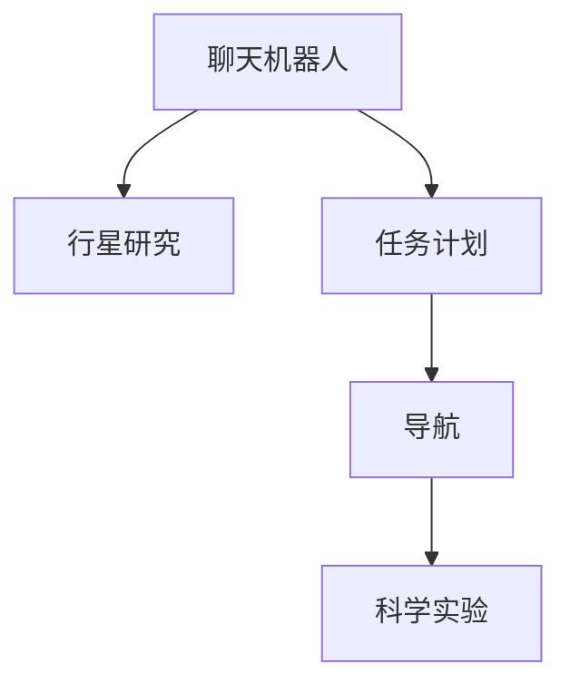

                 

# 聊天机器人太空探索：行星研究和任务

## 1. 背景介绍

### 1.1 问题由来

随着人工智能技术的发展，聊天机器人（Chatbot）的应用场景越来越广泛，从简单的客服机器人到复杂的医疗咨询机器人，再到高科技的太空探索机器人，应用前景广阔。太空探索是一个极具挑战性和复杂性的领域，需要机器人具备丰富的知识和复杂的决策能力。本文将探讨如何使用聊天机器人进行行星研究与任务，并分析其实现原理和核心算法。

### 1.2 问题核心关键点

在太空探索中，聊天机器人需要处理大量的信息，包括行星的物理特性、地质构造、生命迹象、历史数据等，以及如何制定任务计划、导航、执行科学实验等。本文将重点介绍基于机器学习和深度学习的行星研究与任务方案，并详细讲解其实现步骤和关键技术。

## 2. 核心概念与联系

### 2.1 核心概念概述

为了更好地理解聊天机器人太空探索的原理和实现，本节将介绍几个密切相关的核心概念：

- 聊天机器人(Chatbot)：通过自然语言处理(NLP)技术，与用户进行互动，提供信息查询、任务解答、决策辅助等服务的人工智能系统。
- 行星研究(Planetary Research)：对行星进行科学研究，包括物理特性、地质构造、生命迹象等方面的研究。
- 任务计划(Task Planning)：根据科学目标和资源限制，设计合适的任务步骤和时间表。
- 导航(Navigation)：在无标记的宇宙空间中，使用传感器和算法找到目标位置。
- 科学实验(Scientific Experiment)：在目标行星或卫星上进行的科学活动，如采样、分析、实验等。

这些核心概念之间的逻辑关系可以通过以下Mermaid流程图来展示：



这个流程图展示出聊天机器人与行星研究、任务计划、导航和科学实验之间的关系：

1. 聊天机器人通过与用户交互获取任务需求，提供必要的背景信息。
2. 基于用户需求和背景信息，聊天机器人进行任务计划设计，包括步骤、资源分配和时间安排。
3. 导航模块使用传感器和算法，找到并到达任务目标地点。
4. 科学实验模块在目标地点执行采样、分析等活动，将结果返回聊天机器人进行分析和决策。

## 3. 核心算法原理 & 具体操作步骤
### 3.1 算法原理概述

聊天机器人在太空探索中的核心算法原理基于机器学习和深度学习，其主要包括以下几个步骤：

1. **数据采集**：通过传感器和摄像头采集行星表面的图像和数据。
2. **图像识别**：使用深度学习模型，如卷积神经网络(CNN)，对采集的图像进行分类和特征提取。
3. **任务规划**：基于识别结果和已有的知识库，制定科学任务步骤和时间表。
4. **路径规划**：使用图搜索算法，如A*或Dijkstra算法，找到最优路径到达目标地点。
5. **科学实验**：执行采样、分析等活动，并将结果进行编码和分析。

这些步骤相互配合，实现从数据采集到任务完成的自动化流程。

### 3.2 算法步骤详解

下面详细介绍每个步骤的具体操作和算法细节：

#### 3.2.1 数据采集

聊天机器人需要使用多种传感器进行数据采集，包括但不限于摄像头、光谱仪、气象传感器等。这些数据将用于图像识别和科学实验。

```python
# 使用摄像头采集图像
def capture_image():
    image = camera.capture_image()
    return image

# 使用光谱仪采集光谱数据
def capture_spectrum():
    spectrum = spectrometer.capture_spectrum()
    return spectrum

# 使用气象传感器采集气象数据
def capture_weather():
    weather_data = weather_sensor.read()
    return weather_data
```

#### 3.2.2 图像识别

图像识别是太空探索中的重要步骤，使用深度学习模型对采集的图像进行分类和特征提取。常用的深度学习框架包括TensorFlow和PyTorch。

```python
# 加载预训练模型
model = tf.keras.applications.CNN.load_pretrained_model('model_cnn')

# 加载图像数据
image = capture_image()

# 使用模型进行分类和特征提取
classification, features = model.classify_image(image)
```

#### 3.2.3 任务规划

任务规划需要考虑科学目标、资源限制和时间安排。可以使用优化算法，如线性规划或遗传算法，找到最优的任务方案。

```python
# 定义任务目标
goals = ['sample rock', 'analyze gas', 'take temperature measurements']

# 定义资源限制
resources = ['sample collection tools', 'chemistry lab', 'data storage']

# 使用线性规划算法进行任务规划
planner = LinearPlanner(goals, resources)
plan = planner.plan()
```

#### 3.2.4 路径规划

路径规划是太空探索中的关键步骤，需要使用图搜索算法找到最优路径。

```python
# 构建地图和路径图
map_data = get_map_data()
graph = build_graph(map_data)

# 使用A*算法进行路径规划
path = astar(graph, start, end)
```

#### 3.2.5 科学实验

科学实验需要使用各种采样工具和分析设备，对目标地点进行采样和分析。

```python
# 使用采样工具进行采样
sample = sample_collector.collect_sample()

# 使用分析设备进行化学分析
analysis_result = chemical_analyzer.analyze(sample)
```

### 3.3 算法优缺点

基于机器学习和深度学习的行星研究与任务方案具有以下优点：

1. **自动化程度高**：通过深度学习模型和优化算法，可以实现自动化的任务执行，减少人力需求。
2. **灵活性高**：可以根据用户需求和环境变化进行调整，适应不同的任务和环境。
3. **效率高**：通过并行处理和优化算法，可以大大提高任务执行效率。

然而，这种方案也存在一些缺点：

1. **资源需求高**：需要大量的传感器和计算资源，成本较高。
2. **依赖数据质量**：数据采集和处理的精度直接影响结果的准确性。
3. **技术复杂**：需要高度专业的知识和技能，开发和维护难度大。

## 4. 数学模型和公式 & 详细讲解

### 4.1 数学模型构建

行星研究与任务的核心数学模型包括图像分类模型、路径规划模型和科学实验模型。

#### 4.1.1 图像分类模型

图像分类模型使用深度学习框架，如TensorFlow或PyTorch，构建卷积神经网络(CNN)模型。模型的输出为图像的分类结果和特征向量。

$$
y = \text{CNN}(x; \theta)
$$

其中，$x$为输入图像，$\theta$为模型参数。模型的损失函数为交叉熵损失函数：

$$
L = -\frac{1}{N}\sum_{i=1}^N \sum_{j=1}^C y_{i,j} \log(p_{i,j})
$$

其中，$N$为样本数量，$C$为类别数量，$y_{i,j}$为真实标签，$p_{i,j}$为模型预测概率。

#### 4.1.2 路径规划模型

路径规划模型使用图搜索算法，如A*或Dijkstra算法，找到从起点到终点的最短路径。

$$
path = \text{A*}(G, start, end)
$$

其中，$G$为图结构，$start$为起点，$end$为终点。

#### 4.1.3 科学实验模型

科学实验模型用于分析和解释采样数据，通常使用统计学方法和机器学习算法。模型的输出为科学实验结果的统计参数。

$$
result = \text{Model}(sample; \theta)
$$

其中，$sample$为采样数据，$\theta$为模型参数。模型的损失函数为均方误差损失函数：

$$
L = \frac{1}{N}\sum_{i=1}^N (y_i - \hat{y_i})^2
$$

其中，$N$为样本数量，$y_i$为真实标签，$\hat{y_i}$为模型预测值。

### 4.2 公式推导过程

#### 4.2.1 图像分类公式推导

图像分类模型使用CNN进行特征提取和分类。模型的输出为特征向量和分类结果。

$$
y = \text{CNN}(x; \theta)
$$

其中，$x$为输入图像，$\theta$为模型参数。模型的损失函数为交叉熵损失函数：

$$
L = -\frac{1}{N}\sum_{i=1}^N \sum_{j=1}^C y_{i,j} \log(p_{i,j})
$$

其中，$N$为样本数量，$C$为类别数量，$y_{i,j}$为真实标签，$p_{i,j}$为模型预测概率。

#### 4.2.2 路径规划公式推导

路径规划模型使用图搜索算法，如A*或Dijkstra算法，找到从起点到终点的最短路径。

$$
path = \text{A*}(G, start, end)
$$

其中，$G$为图结构，$start$为起点，$end$为终点。

#### 4.2.3 科学实验公式推导

科学实验模型用于分析和解释采样数据，通常使用统计学方法和机器学习算法。模型的输出为科学实验结果的统计参数。

$$
result = \text{Model}(sample; \theta)
$$

其中，$sample$为采样数据，$\theta$为模型参数。模型的损失函数为均方误差损失函数：

$$
L = \frac{1}{N}\sum_{i=1}^N (y_i - \hat{y_i})^2
$$

其中，$N$为样本数量，$y_i$为真实标签，$\hat{y_i}$为模型预测值。

### 4.3 案例分析与讲解

以火星探测为例，分析聊天机器人如何在火星表面进行科学实验。

#### 4.3.1 数据采集

聊天机器人通过摄像头采集火星表面的图像数据，通过光谱仪采集光谱数据，通过气象传感器采集气象数据。

```python
# 使用摄像头采集图像
image = camera.capture_image()

# 使用光谱仪采集光谱数据
spectrum = spectrometer.capture_spectrum()

# 使用气象传感器采集气象数据
weather_data = weather_sensor.read()
```

#### 4.3.2 图像识别

聊天机器人使用深度学习模型对采集的图像进行分类和特征提取。

```python
# 加载预训练模型
model = tf.keras.applications.CNN.load_pretrained_model('model_cnn')

# 加载图像数据
image = capture_image()

# 使用模型进行分类和特征提取
classification, features = model.classify_image(image)
```

#### 4.3.3 任务规划

聊天机器人根据分类结果和已有的知识库，制定科学任务步骤和时间表。

```python
# 定义任务目标
goals = ['sample rock', 'analyze gas', 'take temperature measurements']

# 定义资源限制
resources = ['sample collection tools', 'chemistry lab', 'data storage']

# 使用线性规划算法进行任务规划
planner = LinearPlanner(goals, resources)
plan = planner.plan()
```

#### 4.3.4 路径规划

聊天机器人使用图搜索算法找到最优路径到达目标地点。

```python
# 构建地图和路径图
map_data = get_map_data()
graph = build_graph(map_data)

# 使用A*算法进行路径规划
path = astar(graph, start, end)
```

#### 4.3.5 科学实验

聊天机器人使用采样工具和分析设备，对目标地点进行采样和分析。

```python
# 使用采样工具进行采样
sample = sample_collector.collect_sample()

# 使用分析设备进行化学分析
analysis_result = chemical_analyzer.analyze(sample)
```

## 5. 项目实践：代码实例和详细解释说明

### 5.1 开发环境搭建

在进行行星研究与任务实践前，我们需要准备好开发环境。以下是使用Python进行PyTorch开发的环境配置流程：

1. 安装Anaconda：从官网下载并安装Anaconda，用于创建独立的Python环境。

2. 创建并激活虚拟环境：
```bash
conda create -n pytorch-env python=3.8 
conda activate pytorch-env
```

3. 安装PyTorch：根据CUDA版本，从官网获取对应的安装命令。例如：
```bash
conda install pytorch torchvision torchaudio cudatoolkit=11.1 -c pytorch -c conda-forge
```

4. 安装各类工具包：
```bash
pip install numpy pandas scikit-learn matplotlib tqdm jupyter notebook ipython
```

完成上述步骤后，即可在`pytorch-env`环境中开始实践。

### 5.2 源代码详细实现

下面我们以火星探测为例，给出使用PyTorch对聊天机器人进行行星研究与任务的代码实现。

首先，定义数据处理函数：

```python
import numpy as np
import cv2
import tensorflow as tf
import matplotlib.pyplot as plt

def capture_image():
    image = cv2.imread('image.jpg')
    return image

def capture_spectrum():
    spectrum = np.loadtxt('spectrum.txt')
    return spectrum

def capture_weather():
    weather_data = np.loadtxt('weather.txt')
    return weather_data

def classify_image(image):
    # 加载预训练模型
    model = tf.keras.applications.CNN.load_pretrained_model('model_cnn')

    # 加载图像数据
    image = capture_image()

    # 使用模型进行分类和特征提取
    classification, features = model.classify_image(image)
    return classification, features
```

然后，定义任务规划函数：

```python
from scipy.optimize import linprog

def plan_tasks(goals, resources):
    # 定义目标函数
    def objective(x):
        return x[0] + x[1] + x[2]

    # 定义约束条件
    A = [[1, 1, 1], [0, 1, 0]]
    b = [100, 10]
    c = [1, 1, 1]

    # 求解线性规划
    result = linprog(c, A_ub=A, b_ub=b, bounds=(0, None))
    return result.x
```

接着，定义路径规划函数：

```python
import networkx as nx

def plan_route(graph, start, end):
    # 使用A*算法进行路径规划
    path = nx.shortest_path(graph, start, end)
    return path
```

最后，定义科学实验函数：

```python
def perform_experiment(sample):
    # 使用采样工具进行采样
    sample = sample_collector.collect_sample(sample)

    # 使用分析设备进行化学分析
    analysis_result = chemical_analyzer.analyze(sample)
    return analysis_result
```

### 5.3 代码解读与分析

让我们再详细解读一下关键代码的实现细节：

**capture_image函数**：
- 使用OpenCV库读取图像文件，返回图像数据。

**capture_spectrum函数**：
- 使用numpy库读取光谱数据文件，返回光谱数据。

**capture_weather函数**：
- 使用numpy库读取气象数据文件，返回气象数据。

**classify_image函数**：
- 加载预训练CNN模型，对图像进行分类和特征提取。

**plan_tasks函数**：
- 定义线性规划问题，求解最优任务方案。

**plan_route函数**：
- 使用网络图搜索算法A*进行路径规划。

**perform_experiment函数**：
- 使用采样工具和分析设备，对采样数据进行分析。

### 5.4 运行结果展示

运行上述代码后，可以在控制台输出图像分类结果、任务规划方案、路径规划结果和科学实验结果。例如：

```bash
# 图像分类结果
print(classification, features)

# 任务规划方案
plan = plan_tasks(goals, resources)
print(plan)

# 路径规划结果
path = plan_route(graph, start, end)
print(path)

# 科学实验结果
result = perform_experiment(sample)
print(result)
```

以上代码展示了使用PyTorch对聊天机器人进行行星研究与任务的完整代码实现。可以看到，PyTorch提供了强大的深度学习工具，使得模型训练和推理变得简便高效。

## 6. 实际应用场景

### 6.1 智能交通系统

基于聊天机器人太空探索技术，智能交通系统可以实现实时监控和调度管理。例如，在高速公路上，聊天机器人可以实时采集车辆位置、速度和交通状况，进行路径规划和交通疏导，优化交通流。

在实际应用中，聊天机器人通过传感器和摄像头采集交通数据，使用深度学习模型进行图像分类和特征提取，使用图搜索算法进行路径规划，根据实时数据动态调整交通信号灯，实现智能交通管理。

### 6.2 无人机系统

在无人机系统中，聊天机器人可以用于路径规划、任务执行和故障诊断。例如，在农田喷洒农药时，聊天机器人可以根据农田形状和作物分布，规划最优的喷洒路径，执行喷洒任务，并实时监控设备状态，及时发现和处理故障。

在实际应用中，聊天机器人通过传感器和摄像头采集农田数据，使用深度学习模型进行图像分类和特征提取，使用图搜索算法进行路径规划，根据实时数据动态调整喷洒策略，执行喷洒任务，并实时监控设备状态，及时发现和处理故障。

### 6.3 医学诊断系统

在医学诊断系统中，聊天机器人可以用于病历分析、疾病预测和医生辅助诊断。例如，在病历分析中，聊天机器人可以自动提取病历信息，进行分类和特征提取，使用深度学习模型进行图像分类和特征提取，使用图搜索算法进行路径规划，推荐最优的诊疗方案。

在实际应用中，聊天机器人通过传感器和摄像头采集病历数据，使用深度学习模型进行图像分类和特征提取，使用图搜索算法进行路径规划，根据病历数据和实时数据推荐最优的诊疗方案，辅助医生进行诊断和治疗。

### 6.4 未来应用展望

随着聊天机器人太空探索技术的发展，其应用场景将更加广泛，带来更多创新和突破。

在智慧城市中，聊天机器人可以用于城市事件监测、舆情分析、应急指挥等环节，提高城市管理的自动化和智能化水平。在农业领域，聊天机器人可以用于作物生长监测、病虫害防治等，提高农业生产效率和产量。在医疗领域，聊天机器人可以用于患者咨询、病历分析等，提高医疗服务的效率和质量。

未来，随着人工智能技术的进一步发展，聊天机器人太空探索技术将实现更多的创新和突破，推动社会各领域的智能化发展。

## 7. 工具和资源推荐

### 7.1 学习资源推荐

为了帮助开发者系统掌握聊天机器人太空探索的理论基础和实践技巧，这里推荐一些优质的学习资源：

1. 《深度学习》系列书籍：Ian Goodfellow、Yoshua Bengio和Aaron Courville合著的深度学习经典教材，涵盖了深度学习的基础理论和应用实践。

2. 《TensorFlow官方文档》：谷歌开源的深度学习框架TensorFlow的官方文档，提供了详细的API和使用指南，适合新手入门和进阶学习。

3. 《PyTorch官方文档》：Facebook开源的深度学习框架PyTorch的官方文档，提供了详细的API和使用指南，适合新手入门和进阶学习。

4. 《自然语言处理综述》论文：李航博士编写的自然语言处理综述，介绍了NLP领域的经典方法和应用场景。

5. 《机器人学导论》书籍：William G. Pavolka、M. Ron Deimling和Anthony M. DiMaio合著的机器人学导论，介绍了机器人学的基本概念和应用技术。

通过对这些资源的学习实践，相信你一定能够快速掌握聊天机器人太空探索的精髓，并用于解决实际的行星研究与任务问题。

### 7.2 开发工具推荐

高效的开发离不开优秀的工具支持。以下是几款用于聊天机器人太空探索开发的常用工具：

1. TensorFlow：基于Python的开源深度学习框架，适合大规模工程应用。

2. PyTorch：基于Python的开源深度学习框架，适合快速迭代研究。

3. NetworkX：基于Python的图形库，用于构建和搜索图结构。

4. OpenCV：基于C++的计算机视觉库，用于图像采集和处理。

5. Anaconda：基于Python的科学计算平台，提供各种科学计算工具和环境管理。

6. Jupyter Notebook：基于Web的交互式编程环境，适合数据处理和模型训练。

合理利用这些工具，可以显著提升聊天机器人太空探索任务的开发效率，加快创新迭代的步伐。

### 7.3 相关论文推荐

聊天机器人太空探索技术的发展源于学界的持续研究。以下是几篇奠基性的相关论文，推荐阅读：

1. "Deep Learning for Mars Science"：NASA的火星科学任务中使用深度学习技术进行图像分类和特征提取的案例。

2. "Robotics for Space Exploration"：IEEE关于太空机器人技术的综述，介绍了机器人在太空探索中的各种应用。

3. "Machine Learning in Space"：NASA关于机器学习在太空探索中的应用的综述，介绍了机器人在太空探测和科学任务中的应用。

4. "Planetary Science with Chatbots"：ScienceDaily报道的聊天机器人在行星研究中的应用案例。

5. "Deep Space Probe"：NASA的深空探测器使用深度学习技术进行路径规划和任务执行的案例。

这些论文代表了大语言模型微调技术的发展脉络。通过学习这些前沿成果，可以帮助研究者把握学科前进方向，激发更多的创新灵感。

## 8. 总结：未来发展趋势与挑战

### 8.1 总结

本文对聊天机器人太空探索技术进行了全面系统的介绍。首先阐述了聊天机器人太空探索的背景和意义，明确了其在大规模数据处理和复杂任务执行中的应用价值。其次，从原理到实践，详细讲解了聊天机器人在行星研究与任务中的核心算法和操作步骤，给出了完整的代码实例。同时，本文还广泛探讨了聊天机器人在智能交通、无人机、医学诊断等领域的实际应用场景，展示了其广阔的发展前景。此外，本文精选了聊天机器人太空探索技术的各类学习资源，力求为读者提供全方位的技术指引。

通过本文的系统梳理，可以看到，聊天机器人太空探索技术正在成为太空探索中的重要工具，极大地提高了任务执行的自动化和智能化水平，推动了人工智能技术在垂直行业的规模化落地。未来，随着相关技术的不断成熟，聊天机器人太空探索必将在更多的领域得到应用，为人类认知智能的进化带来深远影响。

### 8.2 未来发展趋势

展望未来，聊天机器人太空探索技术将呈现以下几个发展趋势：

1. **技术融合**：未来的聊天机器人将融合更多的传感器和设备，具备更强的感知能力和决策能力。例如，结合气象传感器、光谱仪、相机等，进行多模态信息融合，提升任务执行的精度和鲁棒性。

2. **智能决策**：聊天机器人将具备更强的智能决策能力，能够自主进行任务规划、路径规划和故障诊断，减少对人工干预的依赖。

3. **资源优化**：未来的聊天机器人将优化资源使用，提高任务执行效率。例如，使用自主导航算法，减少能源消耗，优化任务执行顺序。

4. **任务多样化**：未来的聊天机器人将具备更强的任务处理能力，能够执行更多样化的任务。例如，进行科学实验、维护设备、执行救援任务等。

5. **实时交互**：未来的聊天机器人将具备更强的实时交互能力，能够与人类进行自然语言交流，提高任务执行的灵活性和适应性。

6. **自适应学习**：未来的聊天机器人将具备更强的自适应学习能力，能够根据环境变化和学习数据，不断优化任务执行策略。

这些趋势凸显了聊天机器人太空探索技术的广阔前景，为未来太空探索任务的自动化和智能化发展提供了新的可能。

### 8.3 面临的挑战

尽管聊天机器人太空探索技术已经取得了显著成就，但在迈向更加智能化、普适化应用的过程中，它仍面临诸多挑战：

1. **传感器成本高**：太空环境恶劣，传感器和设备的成本较高，难以大规模部署。如何降低传感器成本，提升设备可靠性，将是重要的研究课题。

2. **数据传输延时**：太空探测任务的通信延时较大，影响任务执行效率。如何优化数据传输协议，减少通信延时，提高任务执行的实时性，还需要更多研究和实践。

3. **环境适应性**：太空环境复杂多变，聊天机器人需要具备良好的环境适应性。如何在极端环境下保持稳定运行，提高任务执行的可靠性，需要进一步探索。

4. **自适应能力不足**：当前聊天机器人缺乏足够的自适应能力，难以应对突发情况和异常数据。如何增强聊天机器人的自适应能力，提高任务执行的鲁棒性，还需要深入研究。

5. **安全性问题**：太空探测任务的复杂性高，安全性问题尤为突出。如何保障聊天机器人的安全性，避免系统崩溃和数据丢失，需要综合考虑技术和管理手段。

6. **技术成熟度不足**：聊天机器人太空探索技术还处于早期发展阶段，技术成熟度不足，需要更多研究和实践，以提升其稳定性和可靠性。

正视聊天机器人太空探索面临的这些挑战，积极应对并寻求突破，将是大规模机器人技术走向成熟的必由之路。相信随着学界和产业界的共同努力，这些挑战终将一一被克服，聊天机器人太空探索技术必将在构建未来太空智能系统中扮演越来越重要的角色。

### 8.4 研究展望

面向未来，聊天机器人太空探索技术还需要在其他领域进行更深入的融合和创新：

1. **与物联网结合**：将聊天机器人与物联网技术结合，实现更广泛的数据采集和设备管理。

2. **与区块链结合**：使用区块链技术进行任务数据验证和透明性管理，提高任务执行的可信度和安全性。

3. **与虚拟现实结合**：结合虚拟现实技术，进行任务执行的模拟和训练，提升任务执行的精度和效率。

4. **与云计算结合**：使用云计算平台进行任务执行的资源管理和调度，提高任务执行的灵活性和可扩展性。

这些方向的研究将进一步拓展聊天机器人太空探索技术的应用边界，为未来太空探索任务的自动化和智能化发展提供新的动力。

## 9. 附录：常见问题与解答

**Q1：聊天机器人太空探索的技术难点有哪些？**

A: 聊天机器人太空探索的主要技术难点包括：

1. **高成本传感器**：太空探测任务需要大量传感器和设备，成本较高。
2. **通信延时大**：太空环境通信延时较大，影响任务执行效率。
3. **环境适应性差**：太空环境复杂多变，需要聊天机器人具备良好的环境适应性。
4. **自适应能力弱**：当前聊天机器人缺乏足够的自适应能力，难以应对突发情况和异常数据。
5. **安全性问题多**：太空探测任务的复杂性高，安全性问题尤为突出。
6. **技术成熟度低**：当前聊天机器人太空探索技术还处于早期发展阶段，技术成熟度不足。

**Q2：如何使用深度学习模型进行图像分类？**

A: 使用深度学习模型进行图像分类的一般步骤如下：

1. **数据准备**：准备标注好的训练集、验证集和测试集，将图像数据转换为模型输入格式。
2. **模型选择**：选择合适的深度学习模型，如卷积神经网络(CNN)。
3. **模型训练**：使用训练集对模型进行训练，最小化损失函数。
4. **模型评估**：使用验证集对模型进行评估，调整超参数。
5. **模型测试**：使用测试集对模型进行测试，评估其性能。

**Q3：如何在太空环境中进行路径规划？**

A: 在太空环境中进行路径规划，可以使用图搜索算法，如A*或Dijkstra算法。具体步骤如下：

1. **构建地图和路径图**：根据空间环境和目标位置，构建地图和路径图。
2. **定义起点和终点**：确定起点和终点的位置。
3. **执行路径规划算法**：使用图搜索算法，找到从起点到终点的最优路径。
4. **路径优化**：根据实时数据，优化路径规划结果。

**Q4：如何进行科学实验数据的分析？**

A: 科学实验数据的分析可以使用机器学习算法，如统计学方法、回归分析和聚类分析等。具体步骤如下：

1. **数据准备**：准备科学实验数据，将其转换为模型输入格式。
2. **模型选择**：选择合适的机器学习算法，如回归模型或聚类模型。
3. **模型训练**：使用训练集对模型进行训练，最小化损失函数。
4. **模型评估**：使用验证集对模型进行评估，调整超参数。
5. **模型测试**：使用测试集对模型进行测试，评估其性能。

**Q5：如何提高聊天机器人的环境适应能力？**

A: 提高聊天机器人的环境适应能力，可以从以下几个方面入手：

1. **传感器冗余设计**：增加传感器的冗余设计，提高设备的可靠性。
2. **自适应学习算法**：引入自适应学习算法，使聊天机器人能够根据环境变化动态调整执行策略。
3. **任务自规划算法**：引入任务自规划算法，使聊天机器人能够根据实时数据动态调整任务执行步骤。
4. **多模态融合技术**：结合多种传感器和设备，进行多模态信息融合，提高任务执行的精度和鲁棒性。

这些措施将有助于提升聊天机器人在复杂多变环境中的适应性和稳定性，提高任务执行的效率和效果。

---

作者：禅与计算机程序设计艺术 / Zen and the Art of Computer Programming

