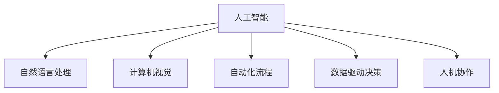

                 

## 1. 背景介绍

随着人工智能技术的飞速发展，越来越多的创业者开始尝试利用自动化技术打造创新的业务模式，希望通过机器学习、自然语言处理、计算机视觉等前沿技术，解决实际问题，推动业务增长。然而，实践证明，自动化创业并非想象中那么简单，面临诸多挑战和风险。本文将以若干自动化创业失败的案例为切入点，深入剖析失败的原因，并总结经验教训，为创业者提供有价值的参考。

## 2. 核心概念与联系

### 2.1 核心概念概述

自动化创业指的是利用人工智能和自动化技术来优化、自动化甚至颠覆传统业务流程的创业活动。其中，核心概念包括：

- **人工智能（AI）**：通过机器学习、深度学习等技术，使机器具备智能化的决策和执行能力。
- **自然语言处理（NLP）**：使计算机能够理解、处理和生成人类语言的技术。
- **计算机视觉（CV）**：使计算机能够“看”和理解图像、视频等视觉信息的技术。
- **自动化流程**：通过编程、机器人、流程自动化工具等实现业务流程的自动化。
- **数据驱动决策**：利用数据和算法进行业务决策，提高决策效率和准确性。
- **人机协作**：结合人工与自动化系统，实现最佳的用户体验和业务效果。

### 2.2 核心概念原理和架构的 Mermaid 流程图



上述流程图展示了自动化创业中几个核心概念及其相互关系。其中，人工智能是核心驱动力，而自然语言处理、计算机视觉和自动化流程是实现方式，数据驱动决策和人机协作是应用目标。

## 3. 核心算法原理 & 具体操作步骤

### 3.1 算法原理概述

自动化创业涉及的算法原理较为复杂，包括但不限于：

- **机器学习算法**：用于训练模型，使其能够从数据中学习，实现自动化决策。
- **自然语言处理算法**：用于文本分析、情感分析、语义理解等，实现智能客服、自动摘要等功能。
- **计算机视觉算法**：用于图像识别、目标检测、图像分割等，实现自动驾驶、智能监控等功能。
- **自动化流程算法**：用于设计、实现和优化业务流程自动化，提高效率和准确性。
- **数据驱动决策算法**：用于分析数据、提取洞察，指导业务决策，优化资源配置。

### 3.2 算法步骤详解

以一个典型的自动化创业项目为例，其基本步骤如下：

1. **需求分析**：明确自动化创业的目标和需求，识别业务流程中可以自动化的环节。
2. **技术选型**：根据需求选择合适的技术栈和工具，如TensorFlow、PyTorch、Scikit-Learn等。
3. **数据准备**：收集、清洗和标注数据，用于训练模型。
4. **模型训练**：使用收集的数据训练模型，进行超参数调优。
5. **系统集成**：将训练好的模型集成到业务系统中，实现自动化功能。
6. **测试和优化**：对自动化系统进行测试和优化，确保其稳定性和高效性。
7. **上线部署**：将自动化系统部署到生产环境，持续监控和维护。

### 3.3 算法优缺点

**优点**：

- **效率提升**：自动化系统能够大幅提升业务流程的处理速度和效率。
- **成本节约**：通过自动化减少了人力成本和错误率。
- **决策优化**：数据驱动的决策过程更加科学和准确。
- **灵活性**：可以灵活调整算法和模型，快速响应市场变化。

**缺点**：

- **技术门槛高**：需要具备较强的技术能力和专业知识。
- **数据依赖性**：依赖高质量的数据和算法，对数据质量要求高。
- **风险和不确定性**：自动化系统可能出现错误，影响业务稳定性。
- **初期投入大**：开发和部署自动化系统需要投入大量资源和时间。

### 3.4 算法应用领域

自动化创业的应用领域广泛，涵盖金融、医疗、零售、制造等多个行业。例如：

- **金融领域**：自动化贷款审批、风险评估、智能投顾等。
- **医疗领域**：自动化病历分析、医疗影像诊断、智能健康管理等。
- **零售领域**：自动化库存管理、个性化推荐、智能客服等。
- **制造领域**：自动化质量检测、生产调度、设备维护等。

## 4. 数学模型和公式 & 详细讲解 & 举例说明

### 4.1 数学模型构建

在自动化创业中，常用的数学模型包括：

- **线性回归模型**：用于预测数值型变量的模型，广泛应用于自动化供应链管理。
- **决策树模型**：用于分类和回归任务的模型，适合处理结构化数据，如自动化客户分类。
- **神经网络模型**：用于处理非结构化数据的模型，如自然语言处理中的文本分类。
- **支持向量机模型**：用于分类任务的模型，适用于自动化图像分类。
- **强化学习模型**：用于动态决策任务的模型，如自动化交易策略。

### 4.2 公式推导过程

以线性回归模型为例，公式推导如下：

$$
y = \beta_0 + \beta_1 x_1 + \beta_2 x_2 + \ldots + \beta_n x_n + \epsilon
$$

其中，$y$ 为输出变量，$x_i$ 为输入变量，$\beta_i$ 为系数，$\epsilon$ 为误差项。通过最小化均方误差（MSE）损失函数，求解系数 $\beta_i$。

### 4.3 案例分析与讲解

以一个自动化库存管理系统的案例为例：

- **需求分析**：自动化库存管理系统需要实时监控库存水平，预测补货需求，自动生成采购订单。
- **技术选型**：选择TensorFlow作为技术框架，使用神经网络模型进行需求预测。
- **数据准备**：收集历史销售数据、库存数据、市场数据等，进行清洗和标注。
- **模型训练**：使用历史数据训练神经网络模型，优化超参数，提高预测精度。
- **系统集成**：将训练好的模型集成到业务系统中，实现实时库存监控和自动补货。
- **测试和优化**：对系统进行测试和优化，确保其稳定性和高效性。
- **上线部署**：将系统部署到生产环境，持续监控和维护。

## 5. 项目实践：代码实例和详细解释说明

### 5.1 开发环境搭建

自动化创业项目开发通常需要高性能计算资源，建议搭建虚拟化开发环境。具体步骤如下：

1. 安装Anaconda：从官网下载并安装Anaconda，用于创建独立的Python环境。
2. 创建并激活虚拟环境：
```bash
conda create -n auto-env python=3.8 
conda activate auto-env
```
3. 安装相关依赖：
```bash
conda install numpy pandas scikit-learn tensorflow
```

### 5.2 源代码详细实现

以一个自动化贷款审批系统的实现为例：

```python
import pandas as pd
from sklearn.model_selection import train_test_split
from sklearn.linear_model import LogisticRegression
from sklearn.metrics import accuracy_score
from sklearn.preprocessing import StandardScaler

# 数据准备
data = pd.read_csv('loan_data.csv')
X = data.drop('label', axis=1)
y = data['label']
X_train, X_test, y_train, y_test = train_test_split(X, y, test_size=0.2, random_state=42)

# 数据标准化
scaler = StandardScaler()
X_train = scaler.fit_transform(X_train)
X_test = scaler.transform(X_test)

# 模型训练
model = LogisticRegression()
model.fit(X_train, y_train)

# 模型评估
y_pred = model.predict(X_test)
accuracy = accuracy_score(y_test, y_pred)
print(f'Accuracy: {accuracy:.2f}')
```

### 5.3 代码解读与分析

上述代码实现了使用逻辑回归模型进行自动化贷款审批。关键步骤包括：

1. 数据准备：读取贷款数据，拆分训练集和测试集。
2. 数据标准化：使用标准化方法对特征数据进行归一化处理。
3. 模型训练：使用逻辑回归模型进行训练。
4. 模型评估：计算模型在测试集上的准确率。

## 6. 实际应用场景

### 6.1 金融领域

金融领域是自动化创业的重要应用场景之一。通过自动化系统，金融企业能够大幅提升贷款审批、风险评估、智能投顾等业务的效率和精度。例如，利用自然语言处理技术，智能客服系统可以自动回答客户咨询，提高客户满意度。

### 6.2 医疗领域

医疗领域的自动化创业主要集中在自动化病历分析、医疗影像诊断、智能健康管理等方面。例如，计算机视觉技术可以用于自动化医学影像分析，提高诊断准确性和效率。

### 6.3 零售领域

零售领域的自动化创业主要集中在自动化库存管理、个性化推荐、智能客服等方面。例如，利用机器学习技术，自动化库存管理系统可以实时监控库存水平，预测补货需求，自动生成采购订单。

### 6.4 未来应用展望

未来，随着技术的发展，自动化创业将更加普及和深入，应用领域将不断扩大。例如：

- **智能制造**：自动化生产线的智能化升级，如自动调度、质量检测、设备维护等。
- **智能交通**：自动驾驶、智能交通管理等。
- **智能家居**：自动化家庭设备的智能化管理，如智能家电、智能安防等。

## 7. 工具和资源推荐

### 7.1 学习资源推荐

为了帮助创业者系统掌握自动化创业的相关知识，推荐以下学习资源：

1. **《Python机器学习》**：这是一本全面介绍机器学习、数据科学、深度学习等领域的经典教材，适合初学者入门。
2. **Coursera和edX在线课程**：提供众多与自动化创业相关的课程，如《深度学习基础》、《机器学习工程实践》等。
3. **Kaggle竞赛平台**：提供丰富的数据集和挑战，通过竞赛形式锻炼实战能力。
4. **GitHub开源项目**：浏览和研究自动化创业项目的代码，学习最佳实践。
5. **书籍《AI创业》**：介绍了人工智能创业的成功案例和经验，提供实用的建议和指导。

### 7.2 开发工具推荐

为了提高自动化创业的开发效率，推荐以下开发工具：

1. **Jupyter Notebook**：用于数据处理、模型训练和结果展示，支持交互式编程。
2. **TensorFlow和PyTorch**：两大主流的深度学习框架，提供强大的模型训练和推理能力。
3. **Git和GitHub**：版本控制工具，便于协作开发和代码管理。
4. **Docker和Kubernetes**：容器化和集群管理工具，支持自动化部署和维护。
5. **Google Colab**：免费的GPU/TPU云环境，方便快速实验新模型。

### 7.3 相关论文推荐

以下是几篇关于自动化创业的重要论文，推荐阅读：

1. **《深度学习在金融领域的应用》**：介绍了深度学习在金融领域的具体应用，包括自动化风险评估和智能投顾。
2. **《医疗影像自动化的最新进展》**：介绍了计算机视觉技术在医疗影像自动化中的应用，如自动诊断和图像分割。
3. **《自动化客服系统的设计与实现》**：介绍了基于自然语言处理的智能客服系统，提升客户满意度。
4. **《基于机器学习的个性化推荐系统》**：介绍了机器学习技术在零售领域的应用，如自动化库存管理和个性化推荐。
5. **《人工智能创业的挑战与策略》**：讨论了人工智能创业面临的挑战和应对策略，提供了实用的建议和经验。

## 8. 总结：未来发展趋势与挑战

### 8.1 研究成果总结

自动化创业是人工智能技术在实际应用中的重要体现。通过案例分析，我们总结了自动化创业失败的原因，主要包括技术门槛高、数据依赖性大、风险不确定性高等问题。此外，我们还介绍了自动化创业的优点和应用场景，强调了其重要性和未来潜力。

### 8.2 未来发展趋势

未来，自动化创业将更加普及和深入，应用领域将不断扩大。技术的发展也将推动自动化创业向更加智能化、自动化的方向发展。例如，人工智能和自动化技术的结合将更加紧密，形成更加智能的自动化系统。

### 8.3 面临的挑战

尽管自动化创业具有广阔前景，但仍然面临诸多挑战：

- **技术门槛**：需要具备较强的技术能力和专业知识，门槛较高。
- **数据质量**：自动化系统的性能依赖高质量的数据，数据收集和清洗难度较大。
- **系统稳定性**：自动化系统可能出现错误，影响业务稳定性。
- **成本投入**：自动化系统的开发和部署需要投入大量资源和时间。

### 8.4 研究展望

未来，自动化创业的研究应重点关注以下几个方向：

- **技术普及**：推动自动化技术的普及，降低技术门槛，吸引更多创业者。
- **数据优化**：优化数据收集和清洗方法，提高数据质量。
- **系统可靠性**：提升自动化系统的稳定性和鲁棒性，确保业务连续性。
- **资源优化**：优化自动化系统的资源配置，降低成本投入。

## 9. 附录：常见问题与解答

**Q1：如何提高自动化创业项目的成功率？**

A: 提高自动化创业项目的成功率，可以从以下几个方面入手：

- **需求明确**：明确自动化创业的目标和需求，识别业务流程中可以自动化的环节。
- **技术选型**：根据需求选择合适的技术栈和工具，如TensorFlow、PyTorch、Scikit-Learn等。
- **数据准备**：收集、清洗和标注数据，确保数据质量。
- **模型训练**：使用高质量的数据训练模型，优化超参数。
- **系统集成**：将训练好的模型集成到业务系统中，实现自动化功能。
- **测试和优化**：对自动化系统进行测试和优化，确保其稳定性和高效性。
- **上线部署**：将系统部署到生产环境，持续监控和维护。

**Q2：自动化创业中常见的技术挑战有哪些？**

A: 自动化创业中常见的技术挑战包括：

- **技术门槛高**：需要具备较强的技术能力和专业知识，门槛较高。
- **数据依赖性大**：自动化系统的性能依赖高质量的数据，数据收集和清洗难度较大。
- **系统稳定性**：自动化系统可能出现错误，影响业务稳定性。
- **成本投入大**：自动化系统的开发和部署需要投入大量资源和时间。

**Q3：如何降低自动化创业的风险？**

A: 降低自动化创业的风险，可以从以下几个方面入手：

- **明确需求**：明确自动化创业的目标和需求，避免盲目投入。
- **技术选型**：根据需求选择合适的技术栈和工具，降低技术风险。
- **数据准备**：收集、清洗和标注数据，确保数据质量。
- **模型训练**：使用高质量的数据训练模型，优化超参数。
- **系统集成**：将训练好的模型集成到业务系统中，实现自动化功能。
- **测试和优化**：对自动化系统进行测试和优化，确保其稳定性和高效性。
- **上线部署**：将系统部署到生产环境，持续监控和维护。

**Q4：自动化创业中如何实现人机协作？**

A: 自动化创业中实现人机协作，可以从以下几个方面入手：

- **智能客服**：使用自然语言处理技术，自动回答客户咨询，提升客户满意度。
- **辅助决策**：利用数据驱动决策算法，辅助业务决策，提高决策效率和准确性。
- **任务分配**：将复杂任务分解为多个子任务，使用自动化系统完成部分任务，人工处理关键任务。
- **人机交互**：设计友好的人机交互界面，使用户能够方便地与自动化系统交互。

通过本文的系统梳理，相信读者能够对自动化创业有更深入的了解，避免常见的失败陷阱，在创业道路上少走弯路，实现成功。

