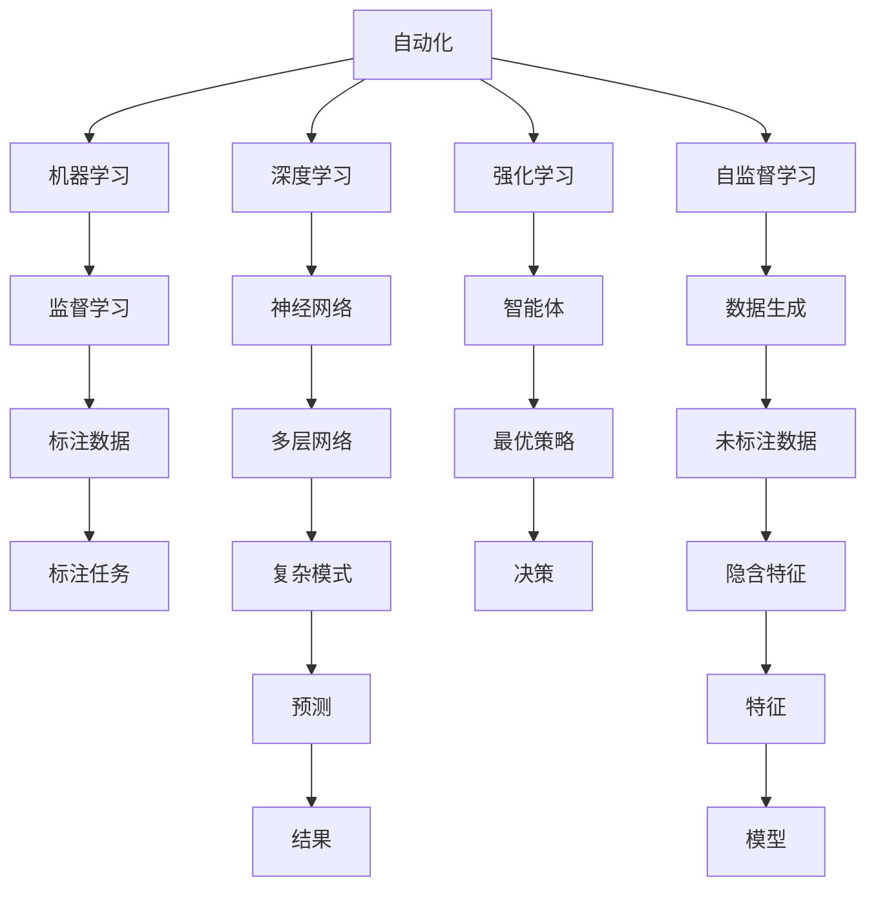

                 

# 自动化的最新发展与挑战

> 关键词：自动化,机器学习,深度学习,人工智能,自监督学习,强化学习,自动化工具,未来展望,挑战

## 1. 背景介绍

### 1.1 问题由来

随着技术的飞速发展，自动化已经成为各行各业的重要驱动力。从工业制造到医疗健康，从金融服务到交通运输，自动化技术的应用范围不断扩展，效率和精度不断提高。自动化技术的发展，不仅提高了生产力，还大大降低了人力成本，推动了社会经济的快速发展。

然而，自动化技术的普及和发展也带来了新的挑战。自动化系统的复杂性越来越高，如何设计、构建、维护和优化自动化系统，成为摆在研究人员和技术工作者面前的重要问题。同时，自动化技术的应用也引发了一系列伦理和社会问题，如失业率上升、隐私泄露等，需要全社会共同面对和解决。

本文旨在全面梳理自动化的最新进展，探讨自动化技术在不同领域的广泛应用，同时指出自动化技术面临的挑战和未来的发展方向。

### 1.2 问题核心关键点

自动化的核心关键点包括：

- 机器学习和深度学习：利用大规模数据和强大算法，实现对复杂任务的自动化处理。
- 自监督学习：利用未标注数据进行模型训练，提高模型泛化能力。
- 强化学习：通过与环境的互动，学习最优的决策策略。
- 自动化工具：如自动化测试、自动化部署、自动化监控等，提升工作效率和质量。
- 未来展望：自动化技术将向更智能化、集成化和自适应方向发展。
- 挑战：数据质量和获取、模型复杂度和计算资源、伦理和社会问题等。

这些关键点构成了自动化技术发展的全貌，涵盖了技术手段、应用领域、未来趋势和面临的挑战。

## 2. 核心概念与联系

### 2.1 核心概念概述

为更好地理解自动化的最新发展与挑战，本节将介绍几个核心概念：

- 自动化(Automation)：指利用机器代替人类完成重复性、规则性任务的过程。自动化技术涉及机械自动化、流程自动化、知识自动化等多个层面。
- 机器学习(Machine Learning)：通过算法训练模型，使机器能够从数据中学习规律，自主完成特定任务。机器学习分为监督学习、无监督学习和强化学习等。
- 深度学习(Deep Learning)：一种机器学习算法，通过多层神经网络模拟人脑的工作机制，进行复杂模式识别和预测。深度学习是当前自动化技术中的重要组成部分。
- 自监督学习(Self-Supervised Learning)：利用未标注数据进行模型训练，通过预定义的任务或规则，学习数据的隐含特征和结构。自监督学习广泛应用于自然语言处理、计算机视觉等领域。
- 强化学习(Reinforcement Learning)：通过与环境的互动，学习最优的决策策略，使智能体在特定环境中获得最大奖励。强化学习常用于游戏、机器人控制等领域。
- 自动化工具(Automation Tools)：用于自动化执行特定任务的各类软件工具，如自动化测试工具、自动化部署工具、自动化监控工具等。自动化工具极大地提升了工作效率和质量。

这些核心概念之间的逻辑关系可以通过以下Mermaid流程图来展示：



这个流程图展示了自动化技术的核心概念及其之间的关系：

1. 自动化技术通过机器学习和深度学习实现任务自动化。
2. 深度学习利用多层神经网络进行复杂模式识别和预测。
3. 自监督学习利用未标注数据进行模型训练。
4. 强化学习通过与环境的互动，学习最优的决策策略。
5. 自动化工具用于自动化执行特定任务。

这些概念共同构成了自动化技术的基本框架，使得自动化技术能够应用于各种场景。

## 3. 核心算法原理 & 具体操作步骤
### 3.1 算法原理概述

自动化技术的核心算法原理包括：

- 监督学习(Supervised Learning)：利用已标注数据训练模型，使其能够预测新数据的结果。
- 无监督学习(Unsupervised Learning)：利用未标注数据训练模型，学习数据的隐含结构和规律。
- 强化学习(Reinforcement Learning)：通过与环境的互动，学习最优的决策策略。

这些算法原理构成了自动化技术的基础，使得自动化系统能够自主地完成各种任务。

### 3.2 算法步骤详解

以下是自动化技术的主要算法步骤：

1. **数据准备**：收集和处理数据，包括数据清洗、数据增强、数据划分等。
2. **模型选择**：选择合适的机器学习模型或深度学习模型，根据任务类型和数据特点进行设计。
3. **模型训练**：利用训练数据集对模型进行训练，优化模型参数，提高模型的预测能力。
4. **模型评估**：使用验证数据集或测试数据集对模型进行评估，检验模型的泛化能力和鲁棒性。
5. **模型部署**：将训练好的模型部署到生产环境中，进行实际应用。
6. **模型监控**：实时监控模型的运行状态，收集反馈信息，及时调整和优化模型。

这些步骤构成了自动化技术的完整流程，每一步都需要精心设计和科学执行，才能实现自动化系统的稳定运行。

### 3.3 算法优缺点

自动化技术具有以下优点：

- 高效性：自动化系统能够快速、准确地完成大量重复性任务，减少人力成本。
- 可靠性：自动化系统具有高度的稳定性和可靠性，降低出错率和故障率。
- 可扩展性：自动化系统可以根据需求进行扩展和升级，适应业务变化的需要。

然而，自动化技术也存在以下缺点：

- 数据依赖性：自动化系统的性能高度依赖于数据质量和数据量。数据偏差或数据不足可能导致模型性能下降。
- 复杂性：自动化系统的设计和实现复杂度较高，需要专业知识和技术积累。
- 伦理问题：自动化技术的应用可能引发伦理和社会问题，如隐私保护、就业影响等。

### 3.4 算法应用领域

自动化技术在多个领域得到了广泛应用，具体包括：

- 工业自动化：通过机器人、自动化生产线等实现制造过程的自动化。
- 医疗健康：利用自动化诊断工具、自动化手术机器人等提高医疗服务的质量和效率。
- 金融服务：使用自动化交易系统、自动化风险评估等提升金融服务的智能化水平。
- 交通运输：采用自动驾驶技术、交通管理自动化等提高交通系统的安全性和效率。
- 能源管理：利用自动化控制系统和智能电网技术，优化能源分配和管理。

这些应用领域展示了自动化技术的广泛影响力和巨大潜力。

## 4. 数学模型和公式 & 详细讲解 & 举例说明

### 4.1 数学模型构建

自动化的数学模型构建涉及以下核心步骤：

1. **数据表示**：将数据表示为向量或矩阵形式，便于机器学习和深度学习模型的处理。
2. **特征提取**：从原始数据中提取有意义的特征，提高模型的表达能力和预测能力。
3. **模型设计**：选择合适的模型结构，如线性回归、卷积神经网络、循环神经网络等。
4. **损失函数设计**：定义损失函数，衡量模型预测结果与真实结果之间的差异。
5. **优化算法选择**：选择适合的优化算法，如梯度下降、Adam、SGD等，更新模型参数。
6. **模型评估**：使用准确率、召回率、F1分数等指标评估模型的性能。

这些步骤构成了自动化技术的数学模型构建框架。

### 4.2 公式推导过程

以监督学习为例，其基本流程可以表示为：

1. **数据准备**：假设训练数据集为 $D=\{(x_i,y_i)\}_{i=1}^N$，其中 $x_i$ 为输入数据，$y_i$ 为标签。
2. **模型选择**：假设模型为 $f(x;\theta)$，其中 $\theta$ 为模型参数。
3. **模型训练**：最小化损失函数 $\mathcal{L}(\theta)$，得到模型参数 $\hat{\theta}$。

监督学习的损失函数通常采用交叉熵损失函数，其形式为：

$$
\mathcal{L}(\theta) = -\frac{1}{N}\sum_{i=1}^N\sum_{j=1}^C\mathbb{I}(y_i=j) \log(f(x_i;\theta))
$$

其中，$\mathbb{I}$ 为示性函数，$\log$ 为自然对数函数。

通过梯度下降等优化算法，可以得到模型参数的更新公式：

$$
\theta \leftarrow \theta - \eta \nabla_{\theta}\mathcal{L}(\theta)
$$

其中，$\eta$ 为学习率，$\nabla_{\theta}\mathcal{L}(\theta)$ 为损失函数对模型参数的梯度。

### 4.3 案例分析与讲解

以图像识别任务为例，分析自动化技术的实际应用：

1. **数据准备**：收集大量标注的图像数据，将图像转换为像素向量。
2. **模型选择**：选择卷积神经网络(CNN)模型，如LeNet、AlexNet、VGG等。
3. **模型训练**：使用图像数据对CNN模型进行训练，优化模型参数。
4. **模型评估**：使用验证集对模型进行评估，调整超参数。
5. **模型部署**：将训练好的模型部署到实际应用中，如自动驾驶车辆的图像识别系统。
6. **模型监控**：实时监控模型运行状态，收集反馈信息，及时调整和优化模型。

以上步骤展示了自动化技术在图像识别任务中的实际应用流程。

## 5. 项目实践：代码实例和详细解释说明

### 5.1 开发环境搭建

在进行自动化技术项目实践前，需要准备好开发环境。以下是使用Python进行TensorFlow开发的环境配置流程：

1. 安装Anaconda：从官网下载并安装Anaconda，用于创建独立的Python环境。

2. 创建并激活虚拟环境：
```bash
conda create -n tf-env python=3.7 
conda activate tf-env
```

3. 安装TensorFlow：从官网获取对应的安装命令。例如：
```bash
pip install tensorflow
```

4. 安装TensorBoard：TensorFlow配套的可视化工具，用于实时监测模型训练状态，并提供丰富的图表呈现方式。
```bash
pip install tensorboard
```

5. 安装numpy、pandas、scikit-learn等常用的Python库，用于数据处理和模型评估。
```bash
pip install numpy pandas scikit-learn
```

完成上述步骤后，即可在`tf-env`环境中开始自动化技术项目实践。

### 5.2 源代码详细实现

以下是一个使用TensorFlow进行图像识别任务的示例代码：

```python
import tensorflow as tf
from tensorflow.keras import layers
from tensorflow.keras.preprocessing.image import ImageDataGenerator

# 数据预处理
train_datagen = ImageDataGenerator(
    rescale=1./255,
    shear_range=0.2,
    zoom_range=0.2,
    horizontal_flip=True)

test_datagen = ImageDataGenerator(rescale=1./255)

train_generator = train_datagen.flow_from_directory(
    'train/',
    target_size=(64, 64),
    batch_size=32,
    class_mode='categorical')

test_generator = test_datagen.flow_from_directory(
    'test/',
    target_size=(64, 64),
    batch_size=32,
    class_mode='categorical')

# 模型定义
model = tf.keras.Sequential([
    layers.Conv2D(32, (3,3), activation='relu', input_shape=(64,64,3)),
    layers.MaxPooling2D((2,2)),
    layers.Conv2D(64, (3,3), activation='relu'),
    layers.MaxPooling2D((2,2)),
    layers.Flatten(),
    layers.Dense(128, activation='relu'),
    layers.Dense(10, activation='softmax')
])

# 模型编译
model.compile(optimizer='adam',
              loss='categorical_crossentropy',
              metrics=['accuracy'])

# 模型训练
model.fit(
    train_generator,
    steps_per_epoch=train_generator.n // train_generator.batch_size,
    epochs=10,
    validation_data=test_generator,
    validation_steps=test_generator.n // test_generator.batch_size)

# 模型评估
test_loss, test_acc = model.evaluate(test_generator, verbose=2)
print('Test accuracy:', test_acc)
```

这个代码示例展示了如何使用TensorFlow进行图像识别任务的自动化实践。

### 5.3 代码解读与分析

让我们再详细解读一下关键代码的实现细节：

**ImageDataGenerator**：
- 用于数据增强和预处理，如调整图像大小、旋转、翻转等。
- 支持批量生成图像数据，方便模型训练。

**Sequential模型**：
- 定义了一个简单的卷积神经网络模型，包括两个卷积层、两个池化层、两个全连接层。
- 使用`compile`方法编译模型，指定优化器、损失函数和评估指标。
- 使用`fit`方法对模型进行训练，指定训练数据、验证数据、训练轮数等参数。
- 使用`evaluate`方法评估模型性能，输出测试集上的准确率。

这个代码示例展示了TensorFlow在自动化技术项目中的实际应用，通过简单的数据预处理和模型定义，实现了图像识别任务的自动化。

## 6. 实际应用场景

### 6.1 工业自动化

工业自动化是自动化技术的重要应用领域，通过自动化生产线、机器人、自动化控制系统等，实现了生产过程的智能化、自动化和信息化。自动化技术的应用提高了生产效率、降低了生产成本，提升了产品质量。

以汽车制造为例，自动化技术在汽车生产中得到广泛应用：

1. **自动化装配线**：使用机器人、传送带等设备，实现汽车零部件的自动化装配。
2. **质量检测**：通过自动化检测设备，对汽车零件进行质量检测和筛选，提高产品质量。
3. **生产调度**：使用自动化控制系统，对生产流程进行实时监控和调度，优化生产效率。

自动化技术在汽车制造中的应用，不仅提高了生产效率，还提升了生产线的灵活性和可扩展性。

### 6.2 医疗健康

自动化技术在医疗健康领域也得到了广泛应用，通过自动化诊断、智能医疗设备、医疗机器人等，提高了医疗服务的质量和效率。

以医学影像诊断为例，自动化技术在医学影像分析中的应用：

1. **自动化图像识别**：使用深度学习模型，对医学影像进行自动化分析，自动识别病变区域和异常特征。
2. **智能诊断系统**：通过自动化诊断系统，结合医学知识库，对患者进行智能诊断和治疗方案推荐。
3. **医疗机器人**：利用自动化机器人进行手术操作，提高手术的精确度和安全性。

自动化技术在医学影像诊断中的应用，提高了医疗服务的智能化水平，为医生提供了有力的辅助工具。

### 6.3 金融服务

自动化技术在金融服务领域也得到了广泛应用，通过自动化交易、风险评估、智能投顾等，提升了金融服务的效率和精准度。

以金融风险评估为例，自动化技术在金融风险评估中的应用：

1. **自动化风险评估**：利用深度学习模型，对客户信用、交易行为等数据进行分析，自动化评估客户的信用风险。
2. **智能投顾系统**：通过自动化投资顾问系统，结合市场数据和客户需求，自动化生成投资建议和组合。
3. **自动化交易系统**：使用自动化交易系统，根据市场行情和策略，自动化执行交易操作。

自动化技术在金融风险评估中的应用，提高了金融服务的智能化水平，为金融机构提供了有力的决策支持。

### 6.4 交通运输

自动化技术在交通运输领域也得到了广泛应用，通过自动驾驶、交通管理、智能调度等，提高了交通系统的安全性和效率。

以自动驾驶为例，自动化技术在自动驾驶中的应用：

1. **自动驾驶技术**：利用深度学习模型，对传感器数据进行实时分析和处理，自动化驾驶车辆。
2. **交通管理**：通过自动化交通管理系统，实时监控交通流量，优化交通信号灯和道路资源分配。
3. **智能调度**：利用自动化调度系统，优化车辆路线和运输计划，提高运输效率和成本效益。

自动化技术在自动驾驶中的应用，提高了交通系统的智能化水平，为城市交通提供了新的解决方案。

## 7. 工具和资源推荐

### 7.1 学习资源推荐

为了帮助开发者系统掌握自动化技术的理论基础和实践技巧，这里推荐一些优质的学习资源：

1. 《深度学习》（Ian Goodfellow、Yoshua Bengio和Aaron Courville著）：深度学习领域的经典教材，涵盖了深度学习的理论基础、算法实现和应用案例。
2. 《机器学习实战》（Peter Harrington著）：机器学习实战指南，包含大量的代码示例和应用场景。
3. 《强化学习》（Richard S. Sutton和Andrew G. Barto著）：强化学习的经典教材，详细介绍了强化学习的理论基础和算法实现。
4. Coursera《机器学习》课程：斯坦福大学开设的机器学习课程，由Andrew Ng主讲，内容涵盖机器学习的基本概念和算法。
5. Udacity《深度学习基础》课程：由Google Brain团队主导的深度学习课程，涵盖深度学习的理论和实践。

通过对这些资源的学习实践，相信你一定能够快速掌握自动化技术的精髓，并用于解决实际的自动化问题。

### 7.2 开发工具推荐

高效的开发离不开优秀的工具支持。以下是几款用于自动化技术开发的常用工具：

1. TensorFlow：Google开发的开源深度学习框架，支持分布式训练、模型优化和部署。
2. PyTorch：Facebook开发的开源深度学习框架，具有灵活的动态计算图和高效的模型构建能力。
3. OpenCV：开源计算机视觉库，支持图像处理、特征提取和图像识别等自动化任务。
4. ROS（Robot Operating System）：开源机器人操作系统，支持机器人感知、运动和交互等自动化功能。
5. Ansys Fluent：商业软件，支持复杂流场计算和优化，广泛应用于工业自动化和智能制造。

合理利用这些工具，可以显著提升自动化技术开发的效率，加快创新迭代的步伐。

### 7.3 相关论文推荐

自动化技术的发展源于学界的持续研究。以下是几篇奠基性的相关论文，推荐阅读：

1. "Neural Computation of Capacitance-Voltage Characteristics in Metal-Oxide-Semiconductor Field-Effect Transistors"（Hassibi和Stefano）：介绍了神经网络在电路分析中的应用。
2. "Deep Reinforcement Learning for Physical Robot Manipulation"（Leonard、Szatmary等）：介绍了深度强化学习在机器人控制中的应用。
3. "Visual WordSpotting with A CNN-based System"（Dozat、Chandrakar等）：介绍了深度学习在图像识别中的应用。
4. "ImageNet Classification with Deep Convolutional Neural Networks"（Krizhevsky、Sutskever和Hinton）：介绍了深度学习在图像分类中的应用。
5. "The Master Algorithm"（Peter Norvig）：探讨了自动化技术的未来发展方向和挑战。

这些论文代表了大规模自动化技术的最新进展，对理解自动化技术的未来发展具有重要意义。

## 8. 总结：未来发展趋势与挑战

### 8.1 总结

本文对自动化技术的最新进展进行了全面系统的介绍。首先阐述了自动化技术的背景和重要性，明确了自动化技术在各行各业的应用价值和影响。其次，从原理到实践，详细讲解了自动化技术的数学模型和关键步骤，给出了自动化技术项目开发的完整代码实例。同时，本文还广泛探讨了自动化技术在工业自动化、医疗健康、金融服务、交通运输等多个领域的应用前景，展示了自动化技术的广阔前景。

通过本文的系统梳理，可以看到，自动化技术正在成为各行各业的重要驱动力，极大地提高了生产力、降低成本、提升效率。未来，伴随自动化技术的不断演进，将有更多的行业受益于自动化，迎来全新的发展机遇。

### 8.2 未来发展趋势

展望未来，自动化技术将呈现以下几个发展趋势：

1. **智能化升级**：未来的自动化系统将具备更高的智能化水平，能够进行更加复杂和灵活的任务处理，如自然语言理解、自主决策等。
2. **集成化发展**：未来的自动化系统将更多地与其他技术进行融合，如人工智能、物联网、区块链等，实现跨领域的智能化协同。
3. **自适应性增强**：未来的自动化系统将具备更强的自适应能力，能够根据环境变化自动调整和优化系统参数，提高系统的鲁棒性和稳定性。
4. **普及率提高**：随着技术的不断成熟和成本的降低，自动化技术将进一步普及，渗透到更多的行业和领域。
5. **人机协作加强**：未来的自动化系统将更加注重人机协作，提升工作效率和用户满意度。

这些趋势将进一步推动自动化技术的普及和发展，为社会经济带来更大的价值。

### 8.3 面临的挑战

尽管自动化技术在各行各业得到了广泛应用，但在迈向更加智能化、普适化应用的过程中，仍面临诸多挑战：

1. **数据质量和获取**：自动化系统依赖于高质量的数据，如何获取、处理和维护数据，是自动化系统面临的主要问题。
2. **模型复杂度和计算资源**：自动化系统的复杂度不断增加，需要更强大的计算资源和算法支持，这对硬件和软件提出了更高的要求。
3. **伦理和社会问题**：自动化技术的应用可能引发伦理和社会问题，如就业影响、隐私保护等，需要全社会共同面对和解决。
4. **技术壁垒**：自动化技术的开发和部署需要专业知识和技术积累，如何降低技术壁垒，提高技术的普及性，是自动化技术发展的重要方向。
5. **安全性问题**：自动化系统的安全性问题日益凸显，如何保障系统的安全性和稳定性，是自动化系统开发的重要课题。

这些挑战需要全社会共同面对和解决，只有不断优化和完善自动化技术，才能实现其更大的价值。

### 8.4 研究展望

未来的研究需要在以下几个方面寻求新的突破：

1. **自监督学习和无监督学习**：探索无监督学习和自监督学习的技术手段，提高数据利用率和模型泛化能力。
2. **模型优化和压缩**：研究模型优化和压缩技术，提高模型的效率和可扩展性。
3. **人机协作和智能决策**：探索人机协作和智能决策的技术手段，提高系统的智能化水平和用户满意度。
4. **跨领域融合**：研究自动化技术与人工智能、物联网、区块链等技术的融合，实现跨领域的智能化协同。
5. **伦理和安全**：研究自动化技术的伦理和安全问题，构建安全、可控的自动化系统。

这些研究方向将引领自动化技术迈向更高的台阶，为构建更加智能化、普适化的自动化系统提供新的动力。

## 9. 附录：常见问题与解答

**Q1：自动化系统如何处理数据？**

A: 自动化系统通常使用数据预处理技术，将原始数据转换为机器可以处理的形式，如将图像转换为像素向量、将文本转换为词向量等。常用的数据预处理技术包括数据清洗、数据增强、数据标准化等。

**Q2：自动化系统如何评估性能？**

A: 自动化系统通常使用评估指标来评估性能，如准确率、召回率、F1分数等。这些指标可以衡量模型的预测能力和泛化能力。

**Q3：自动化系统如何优化模型？**

A: 自动化系统通常使用优化算法来优化模型，如梯度下降、Adam、SGD等。优化算法可以最小化模型的损失函数，提高模型的预测能力和泛化能力。

**Q4：自动化系统如何部署？**

A: 自动化系统通常使用模型部署技术，将训练好的模型部署到生产环境中，进行实际应用。常用的模型部署技术包括模型压缩、模型量化、模型切片等。

**Q5：自动化系统如何监控和优化？**

A: 自动化系统通常使用监控和优化技术，实时监控模型的运行状态，收集反馈信息，及时调整和优化模型。常用的监控和优化技术包括模型监控、模型诊断、模型重训练等。

这些问答展示了自动化系统在数据处理、模型评估、模型优化、模型部署和模型监控等方面的基本流程和技术手段。

---

作者：禅与计算机程序设计艺术 / Zen and the Art of Computer Programming

