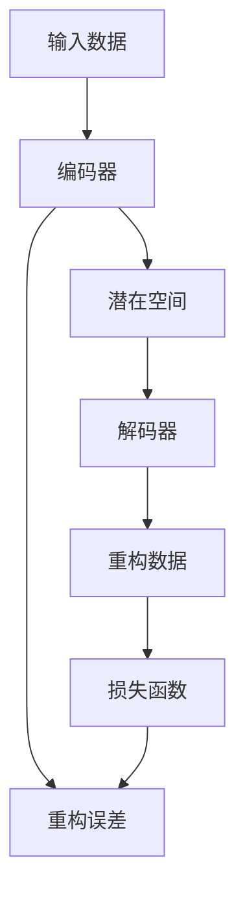

                 

## 1. 背景介绍

自动编码器(Autoencoder)是一种无监督学习的神经网络模型，用于数据降维和特征提取。它最初由Hinton和Salmon于1986年提出，用于解决特征提取和数据压缩问题。近年来，自动编码器被广泛应用于图像处理、信号处理、数据压缩、异常检测等多个领域，成为机器学习中一个不可或缺的工具。

### 1.1 问题由来
在深度学习快速发展的今天，自动编码器成为了一个重要的研究方向。其核心思想是通过一个编码器(Encoder)和一个解码器(Decoder)的组合，实现对输入数据的压缩和重建，从而达到特征提取和数据降维的目的。自动编码器通过学习输入数据与重构数据之间的误差最小化，能够自适应地捕捉数据的本质特征。

### 1.2 问题核心关键点
自动编码器的核心在于其编码器和解码器的设计。编码器负责将输入数据映射到一个低维的潜在空间，解码器则将潜在空间中的数据重构回原始空间。通过最小化重构误差，自动编码器能够提取数据中的重要特征，并对输入数据进行压缩，使得数据更易于处理和存储。

## 2. 核心概念与联系

### 2.1 核心概念概述

为了更好地理解自动编码器的工作原理，本节将介绍几个关键的概念：

- 自动编码器(Autoencoder)：一种无监督学习的神经网络模型，用于特征提取和数据降维。
- 编码器(Encoder)：自动编码器中的第一个神经网络层，将输入数据映射到潜在空间。
- 解码器(Decoder)：自动编码器中的第二个神经网络层，将潜在空间中的数据重构回原始空间。
- 潜在空间(Latent Space)：编码器将输入数据映射到的低维空间，解码器在此空间中重构数据。
- 重构误差(Reconstruction Error)：输入数据与重构数据之间的误差，通常用均方误差或交叉熵损失表示。
- 特征提取(Feature Extraction)：自动编码器通过学习重构误差最小化，自动提取数据的重要特征。

这些核心概念之间的逻辑关系可以通过以下Mermaid流程图来展示：



这个流程图展示自动编码器的工作流程：

1. 输入数据通过编码器进行编码，映射到低维的潜在空间。
2. 在潜在空间中，解码器对数据进行重构。
3. 重构后的数据与原始数据之间的误差构成重构误差。
4. 自动编码器通过最小化重构误差，实现特征提取和数据压缩。

## 3. 核心算法原理 & 具体操作步骤

### 3.1 算法原理概述

自动编码器的工作原理可以简要描述为：通过一个编码器(Encoder)将输入数据映射到一个潜在空间(Latent Space)，再通过一个解码器(Decoder)将潜在空间中的数据重构回原始空间，最终目标是使得重构误差最小化。

具体来说，设输入数据为 $x \in \mathbb{R}^n$，编码器的输出为潜在空间中的表示 $z \in \mathbb{R}^k$，解码器的输出为重构后的数据 $\hat{x} \in \mathbb{R}^n$。自动编码器通过训练编码器和解码器，使得重构误差 $\mathcal{L}$ 最小化：

$$
\mathcal{L} = \frac{1}{N} \sum_{i=1}^N \|x_i - \hat{x}_i\|
$$

其中 $\| \cdot \|$ 为某种距离度量，如均方误差(MSE)或交叉熵损失。

### 3.2 算法步骤详解

自动编码器的训练过程主要包括以下几个关键步骤：

**Step 1: 准备数据集**
- 收集大量未标注的输入数据，将其划分为训练集、验证集和测试集。
- 对输入数据进行标准化和归一化，以便于后续的训练和计算。

**Step 2: 设计编码器和解码器**
- 选择合适的神经网络结构作为编码器和解码器，如卷积神经网络(Convolutional Neural Network, CNN)、循环神经网络(Recurrent Neural Network, RNN)等。
- 设定编码器与解码器的输出维度，一般为小于输入维度的低维空间。

**Step 3: 定义损失函数**
- 根据任务需求选择合适的损失函数，如均方误差、交叉熵等。
- 定义重构误差，将其作为损失函数的组成部分。

**Step 4: 优化训练**
- 使用梯度下降等优化算法，最小化损失函数。
- 在训练过程中，周期性在验证集上评估模型性能，以避免过拟合。
- 重复上述步骤，直至收敛或达到预设迭代次数。

**Step 5: 模型评估**
- 在测试集上评估模型性能，评估指标包括重构误差、数据重构质量等。
- 使用评估结果指导模型参数调整，进一步优化模型性能。

### 3.3 算法优缺点

自动编码器具有以下优点：

- 无监督学习：自动编码器通过最小化重构误差进行特征提取，无需标注数据，节省了数据标注成本。
- 特征提取：自动编码器能够自适应地提取数据的重要特征，适用于复杂、高维数据。
- 数据压缩：通过降低数据维度，自动编码器能够显著减少存储空间，提高数据处理效率。
- 通用性强：自动编码器可应用于图像、文本、音频等多种数据类型。

同时，自动编码器也存在一些局限性：

- 重构误差依赖于数据分布：当输入数据分布发生变化时，自动编码器的重构效果可能下降。
- 编码器与解码器设计复杂：选择合适的神经网络结构和参数是自动编码器设计中的重要问题。
- 容易过拟合：在训练过程中，自动编码器可能过拟合训练数据，导致泛化性能下降。
- 特征稀疏性问题：自动编码器提取的潜在空间中的特征可能存在稀疏性，影响模型性能。

尽管存在这些局限性，但自动编码器仍然是数据降维和特征提取领域的重要工具，广泛应用于图像处理、信号处理、数据压缩等多个领域。

### 3.4 算法应用领域

自动编码器在多个领域具有广泛的应用，以下是其中几个典型的应用场景：

- 图像压缩与去噪：自动编码器能够对图像进行压缩，去除噪声，提高图像处理效率。
- 特征提取与降维：自动编码器能够自动提取数据的重要特征，并通过降维减少计算量。
- 数据可视化：自动编码器能够将高维数据映射到低维空间，实现数据的可视化。
- 异常检测与重构：自动编码器能够检测数据的异常，并通过重构误差判断数据是否正常。

除了上述这些经典应用外，自动编码器还被创新性地应用到更多的领域中，如自然语言处理、生物信息学、金融风险管理等，为各行各业提供了新的技术工具。

## 4. 数学模型和公式 & 详细讲解 & 举例说明

### 4.1 数学模型构建

本节将使用数学语言对自动编码器的工作原理进行更加严格的刻画。

设输入数据为 $x \in \mathbb{R}^n$，编码器输出的潜在表示为 $z \in \mathbb{R}^k$，解码器重构后的数据为 $\hat{x} \in \mathbb{R}^n$。自动编码器的重构误差定义如下：

$$
\mathcal{L} = \frac{1}{N} \sum_{i=1}^N \|x_i - \hat{x}_i\|
$$

其中 $\| \cdot \|$ 为某种距离度量，如均方误差(MSE)或交叉熵损失。

### 4.2 公式推导过程

下面以一个简单的卷积神经网络(Convolutional Neural Network, CNN)自动编码器为例，进行数学推导。

设输入数据 $x \in \mathbb{R}^{n \times n}$，编码器为一个 $m \times n \times k$ 的卷积层，输出为 $z \in \mathbb{R}^{k \times k}$。解码器同样为一个卷积层，输出为 $\hat{x} \in \mathbb{R}^{n \times n}$。

首先，定义编码器的卷积操作：

$$
z = \text{Conv}_1(x)
$$

其中 $\text{Conv}_1$ 为卷积层，可以表示为：

$$
z_{i,j} = \sum_{a,b} w_{i,j,a,b} x_{a,b}
$$

其中 $w_{i,j,a,b}$ 为卷积核的权重，$x_{a,b}$ 为输入数据在位置 $(a,b)$ 的像素值。

接着，定义解码器的卷积操作：

$$
\hat{x} = \text{Conv}_2(z)
$$

其中 $\text{Conv}_2$ 为卷积层，可以表示为：

$$
\hat{x}_{i,j} = \sum_{a,b} v_{i,j,a,b} z_{a,b}
$$

其中 $v_{i,j,a,b}$ 为卷积核的权重。

最后，定义重构误差，通常采用均方误差(MSE)：

$$
\mathcal{L} = \frac{1}{N} \sum_{i=1}^N \|x_i - \hat{x}_i\|^2
$$

根据链式法则，损失函数对参数 $w$ 和 $v$ 的梯度为：

$$
\frac{\partial \mathcal{L}}{\partial w} = -\frac{2}{N} \sum_{i=1}^N \sum_{a,b} \frac{\partial z_{a,b}}{\partial w} \frac{\partial \|x_i - \hat{x}_i\|^2}{\partial x_i}
$$

$$
\frac{\partial \mathcal{L}}{\partial v} = -\frac{2}{N} \sum_{i=1}^N \sum_{a,b} \frac{\partial \hat{x}_{a,b}}{\partial v} \frac{\partial \|x_i - \hat{x}_i\|^2}{\partial \hat{x}_i}
$$

其中 $\frac{\partial z_{a,b}}{\partial w}$ 和 $\frac{\partial \hat{x}_{a,b}}{\partial v}$ 可以通过反向传播算法高效计算。

在得到损失函数的梯度后，即可带入参数更新公式，完成模型的迭代优化。重复上述过程直至收敛，最终得到最小化重构误差的自动编码器模型。

### 4.3 案例分析与讲解

以MNIST手写数字识别数据集为例，展示自动编码器在图像压缩与特征提取中的应用。

首先，准备MNIST数据集，并对其进行预处理：

```python
import numpy as np
from tensorflow.keras.datasets import mnist
from tensorflow.keras.utils import to_categorical

(x_train, y_train), (x_test, y_test) = mnist.load_data()
x_train = x_train.reshape(-1, 28*28) / 255.0
x_test = x_test.reshape(-1, 28*28) / 255.0
y_train = to_categorical(y_train)
y_test = to_categorical(y_test)
```

然后，定义自动编码器的编码器和解码器：

```python
from tensorflow.keras.layers import Input, Conv2D, Conv2DTranspose, Reshape, Dense, Dropout

input_shape = (28, 28, 1)
encoding_dim = 32

inputs = Input(shape=input_shape)
encoded = Conv2D(encoding_dim, (3, 3), activation='relu', padding='same')(inputs)
encoded = Conv2D(encoding_dim, (3, 3), activation='relu', padding='same')(encoded)
encoded = Reshape((encoding_dim, -1))(encoded)
encoded = Dense(encoding_dim)(encoded)
encoded = Dropout(0.2)(encoded)

decoded = Dense(7*7*encoding_dim, activation='relu')(encoded)
decoded = Reshape((7, 7, encoding_dim))(decoded)
decoded = Conv2DTranspose(encoding_dim, (3, 3), activation='relu', padding='same')(decoded)
decoded = Conv2DTranspose(1, (3, 3), activation='sigmoid', padding='same')(decoded)

autoencoder = Model(inputs=inputs, outputs=decoded)
```

接着，定义损失函数并编译模型：

```python
autoencoder.compile(optimizer='adam', loss='mse')
```

最后，训练自动编码器：

```python
autoencoder.fit(x_train, x_train, epochs=20, batch_size=128, shuffle=True, validation_data=(x_test, x_test))
```

训练完成后，评估自动编码器在测试集上的性能：

```python
test_loss = autoencoder.evaluate(x_test, x_test)
print('\nTest loss:', test_loss)
```

通过上述案例，可以看到，自动编码器能够有效地对图像数据进行压缩和重构，同时提取图像的重要特征。

## 5. 项目实践：代码实例和详细解释说明

### 5.1 开发环境搭建

在进行自动编码器实践前，我们需要准备好开发环境。以下是使用Python进行Keras开发的环境配置流程：

1. 安装Anaconda：从官网下载并安装Anaconda，用于创建独立的Python环境。

2. 创建并激活虚拟环境：
```bash
conda create -n keras-env python=3.8 
conda activate keras-env
```

3. 安装Keras：
```bash
pip install keras tensorflow
```

4. 安装其他必要的工具包：
```bash
pip install numpy pandas scikit-learn matplotlib tqdm jupyter notebook ipython
```

完成上述步骤后，即可在`keras-env`环境中开始自动编码器的实践。

### 5.2 源代码详细实现

下面我们以MNIST手写数字识别数据集为例，给出使用Keras实现自动编码器的完整代码实现。

首先，定义自动编码器的编码器和解码器：

```python
from tensorflow.keras.layers import Input, Conv2D, Conv2DTranspose, Reshape, Dense, Dropout

input_shape = (28, 28, 1)
encoding_dim = 32

inputs = Input(shape=input_shape)
encoded = Conv2D(encoding_dim, (3, 3), activation='relu', padding='same')(inputs)
encoded = Conv2D(encoding_dim, (3, 3), activation='relu', padding='same')(encoded)
encoded = Reshape((encoding_dim, -1))(encoded)
encoded = Dense(encoding_dim)(encoded)
encoded = Dropout(0.2)(encoded)

decoded = Dense(7*7*encoding_dim, activation='relu')(encoded)
decoded = Reshape((7, 7, encoding_dim))(decoded)
decoded = Conv2DTranspose(encoding_dim, (3, 3), activation='relu', padding='same')(decoded)
decoded = Conv2DTranspose(1, (3, 3), activation='sigmoid', padding='same')(decoded)

autoencoder = Model(inputs=inputs, outputs=decoded)
```

然后，定义损失函数并编译模型：

```python
autoencoder.compile(optimizer='adam', loss='mse')
```

接着，训练自动编码器：

```python
autoencoder.fit(x_train, x_train, epochs=20, batch_size=128, shuffle=True, validation_data=(x_test, x_test))
```

最后，评估自动编码器在测试集上的性能：

```python
test_loss = autoencoder.evaluate(x_test, x_test)
print('\nTest loss:', test_loss)
```

以上就是使用Keras实现MNIST手写数字识别数据集上的自动编码器的完整代码实现。可以看到，得益于Keras的强大封装，我们可以用相对简洁的代码完成自动编码器的实现。

### 5.3 代码解读与分析

让我们再详细解读一下关键代码的实现细节：

**定义输入层**：
```python
inputs = Input(shape=input_shape)
```
这里定义了一个输入层，输入数据的形状为(28, 28, 1)，即28x28的灰度图像。

**定义编码器**：
```python
encoded = Conv2D(encoding_dim, (3, 3), activation='relu', padding='same')(inputs)
encoded = Conv2D(encoding_dim, (3, 3), activation='relu', padding='same')(encoded)
encoded = Reshape((encoding_dim, -1))(encoded)
encoded = Dense(encoding_dim)(encoded)
encoded = Dropout(0.2)(encoded)
```
这里定义了一个简单的编码器，包括两个卷积层和两个全连接层。卷积层用于提取图像的局部特征，全连接层用于进一步压缩特征。Dropout用于防止过拟合。

**定义解码器**：
```python
decoded = Dense(7*7*encoding_dim, activation='relu')(encoded)
decoded = Reshape((7, 7, encoding_dim))(decoded)
decoded = Conv2DTranspose(encoding_dim, (3, 3), activation='relu', padding='same')(decoded)
decoded = Conv2DTranspose(1, (3, 3), activation='sigmoid', padding='same')(decoded)
```
这里定义了一个解码器，包括一个全连接层和两个卷积转置层。全连接层用于恢复特征，卷积转置层用于重构图像。Sigmoid激活函数用于将重构图像限制在[0, 1]之间。

**定义损失函数并编译模型**：
```python
autoencoder.compile(optimizer='adam', loss='mse')
```
这里选择了Adam优化器和均方误差损失函数，用于最小化重构误差。

**训练自动编码器**：
```python
autoencoder.fit(x_train, x_train, epochs=20, batch_size=128, shuffle=True, validation_data=(x_test, x_test))
```
这里使用了训练集作为输入，训练了20个epoch，每批128个样本，并周期性在测试集上评估模型性能。

**评估自动编码器**：
```python
test_loss = autoencoder.evaluate(x_test, x_test)
print('\nTest loss:', test_loss)
```
这里使用测试集评估模型性能，并输出重构误差。

可以看到，Keras提供了丰富的API，使得自动编码器的实现变得简单易懂。开发者可以根据具体需求灵活组合各种层和损失函数，快速实现自动编码器的功能。

## 6. 实际应用场景

### 6.1 图像压缩与去噪

自动编码器在图像压缩与去噪领域有着广泛的应用。传统的图像压缩方法如JPEG等，通常需要预定义压缩参数，难以自动适应不同的图像。而自动编码器能够自动学习图像的特征，实现高效的压缩和去噪。

例如，在图像去噪方面，可以使用自动编码器对图像中的噪声进行滤除，提高图像的清晰度。具体实现时，可以在输入层对图像进行去噪操作，通过最小化重构误差，自动提取图像的噪声特征，并将其去除。

### 6.2 特征提取与降维

自动编码器在特征提取与降维方面也有着重要的应用。传统的特征提取方法需要手动设计特征，难以适应复杂的数据分布。而自动编码器能够自动学习数据的特征，并对其进行降维，使得数据更易于处理和存储。

例如，在文本分类任务中，可以使用自动编码器对文本进行降维，提取重要的文本特征。具体实现时，可以将文本转换为向量，通过自动编码器对其进行降维，提取重要的文本特征。

### 6.3 数据可视化

自动编码器在数据可视化方面也有着重要的应用。传统的数据可视化方法需要手动设计可视化方案，难以适应复杂的数据结构。而自动编码器能够自动学习数据的特征，并对其进行降维，使得数据更易于可视化。

例如，在医学图像可视化方面，可以使用自动编码器对图像进行降维，生成高质量的图像。具体实现时，可以将医学图像转换为向量，通过自动编码器对其进行降维，生成高质量的图像。

### 6.4 异常检测与重构

自动编码器在异常检测与重构方面也有着重要的应用。传统的数据异常检测方法需要手动设计异常特征，难以适应复杂的数据分布。而自动编码器能够自动学习数据的特征，并对其进行重构，从而检测数据的异常。

例如，在网络异常检测方面，可以使用自动编码器对网络数据进行重构，检测异常的网络流量。具体实现时，可以将网络数据转换为向量，通过自动编码器对其进行重构，检测数据的异常。

## 7. 工具和资源推荐

### 7.1 学习资源推荐

为了帮助开发者系统掌握自动编码器的理论基础和实践技巧，这里推荐一些优质的学习资源：

1. 《Deep Learning》书籍：Ian Goodfellow、Yoshua Bengio、Aaron Courville合著，全面介绍了深度学习的原理和应用，包括自动编码器的相关内容。

2. CS231n《Convolutional Neural Networks for Visual Recognition》课程：斯坦福大学开设的计算机视觉课程，有Lecture视频和配套作业，适合深入学习自动编码器的应用。

3. 《Hands-On Autoencoders》书籍：Michael Nielsen著，详细介绍了自动编码器的原理和实现，适合入门学习。

4. Keras官方文档：Keras的官方文档，提供了丰富的API示例和详细的使用指南，适合实践学习。

5. TensorFlow官方文档：TensorFlow的官方文档，提供了自动编码器的经典实现和最新进展，适合深入学习。

通过对这些资源的学习实践，相信你一定能够快速掌握自动编码器的精髓，并用于解决实际的图像处理问题。

### 7.2 开发工具推荐

高效的开发离不开优秀的工具支持。以下是几款用于自动编码器开发的常用工具：

1. Keras：基于Python的开源深度学习框架，灵活动态的计算图，适合快速迭代研究。提供了丰富的层和损失函数，支持自动编码器的实现。

2. PyTorch：基于Python的开源深度学习框架，动态计算图，适合动态网络构建。提供了丰富的自动编码器实现和优化技术，适合复杂网络的设计。

3. TensorFlow：由Google主导开发的开源深度学习框架，生产部署方便，适合大规模工程应用。提供了丰富的自动编码器实现和优化技术，适合工业级部署。

4. Weights & Biases：模型训练的实验跟踪工具，可以记录和可视化模型训练过程中的各项指标，方便对比和调优。与主流深度学习框架无缝集成。

5. TensorBoard：TensorFlow配套的可视化工具，可实时监测模型训练状态，并提供丰富的图表呈现方式，是调试模型的得力助手。

合理利用这些工具，可以显著提升自动编码器开发的效率，加快创新迭代的步伐。

### 7.3 相关论文推荐

自动编码器在多个领域的研究不断深入，以下是几篇奠基性的相关论文，推荐阅读：

1. Auto-Encoding Variational Bayes（BDAEK）：Kingma和Welling在2013年提出的变分自编码器，通过引入变分推断，实现了对数据的分布建模。

2. Generative Adversarial Nets（GANs）：Goodfellow等人在2014年提出的生成对抗网络，通过对抗训练，实现了对数据的生成建模。

3. Deep Networks with Stochastic Depth：Dumoulin、Bamata和Manzagol在2016年提出的深度残差网络，通过引入深度残差连接，解决了深度网络训练中的梯度消失问题。

4. Dilated Residual Networks：Huang等人提出的深度残差网络变体，通过引入空洞卷积，解决了深度网络中的空间限制问题。

5. TensorFlow 2.0：Abadi等人提出的TensorFlow 2.0，通过简化API和优化计算图，使得深度学习模型的构建和训练更加简单高效。

这些论文代表自动编码器研究的发展脉络。通过学习这些前沿成果，可以帮助研究者把握学科前进方向，激发更多的创新灵感。

## 8. 总结：未来发展趋势与挑战

### 8.1 总结

本文对自动编码器的工作原理和实践技巧进行了全面系统的介绍。首先阐述了自动编码器的背景和意义，明确了其在数据降维、特征提取等方面的重要价值。其次，从原理到实践，详细讲解了自动编码器的数学模型和训练流程，给出了自动编码器在图像压缩、去噪、特征提取等领域的完整代码实现。同时，本文还探讨了自动编码器的应用场景，展示了其在图像处理、文本分类、数据可视化等方面的广泛应用。

通过对自动编码器的系统梳理，可以看到，自动编码器在数据处理和特征提取方面具有强大的能力，已成为深度学习领域的重要工具。它不仅能够自动学习数据的特征，还能够对数据进行压缩和重构，提高数据处理效率。

### 8.2 未来发展趋势

展望未来，自动编码器技术将呈现以下几个发展趋势：

1. 深度学习与传统方法的融合：自动编码器与传统的数据处理方法和特征提取方法相结合，可以进一步提升数据处理的效率和精度。

2. 多模态数据的融合：自动编码器可以用于处理多模态数据，如图像、文本、音频等，实现跨模态的数据融合和信息整合。

3. 高效计算与压缩：随着计算硬件的发展，自动编码器将能够处理更大规模的数据，并实现更高的计算效率和更低的存储成本。

4. 自主学习与自适应：自动编码器将更加自主和自适应，能够自动学习数据的特征，并根据数据分布进行动态调整。

5. 应用场景的拓展：自动编码器将在更多领域得到应用，如医疗图像处理、智能推荐系统、金融风险管理等，为各行各业提供新的技术工具。

6. 理论与应用的平衡：未来的自动编码器研究将更加注重理论与应用的平衡，在保证模型精度的同时，提升模型的可解释性和可控性。

以上趋势凸显了自动编码器的广阔前景。这些方向的探索发展，必将进一步提升自动编码器的性能和应用范围，为数据处理和特征提取领域带来新的突破。

### 8.3 面临的挑战

尽管自动编码器技术在数据降维和特征提取方面取得了显著成果，但在迈向更加智能化、普适化应用的过程中，它仍面临诸多挑战：

1. 数据依赖性：自动编码器的效果很大程度上依赖于输入数据的质量和数量。对于复杂、高维数据，自动编码器可能需要大量数据才能取得理想效果。

2. 训练成本高：自动编码器的训练过程需要大量计算资源，对于大规模数据集和复杂网络结构，训练成本较高。

3. 可解释性差：自动编码器作为"黑盒"模型，难以解释其内部工作机制和决策逻辑，缺乏可解释性。

4. 鲁棒性不足：自动编码器在面对噪声数据和异常情况时，可能出现重构误差较大的情况，鲁棒性有待提高。

5. 模型设计复杂：自动编码器的设计涉及神经网络结构、激活函数、损失函数等多个方面，设计复杂，需要深厚的专业知识。

6. 数据分布变化：自动编码器在数据分布变化时，需要重新训练或微调，才能保持性能。

尽管存在这些挑战，但随着技术的不断进步，自动编码器有望在数据处理和特征提取领域发挥更大的作用。相信未来，自动编码器技术将继续得到完善和优化，为各行各业带来新的机遇。

### 8.4 研究展望

面对自动编码器面临的挑战，未来的研究需要在以下几个方面寻求新的突破：

1. 无监督学习与半监督学习：探索无监督学习和半监督学习范式，最大化利用非结构化数据，提升模型性能。

2. 模型压缩与优化：开发更加高效的模型压缩和优化技术，减少训练成本，提升模型效率。

3. 可解释性与可控性：研究自动编码器的可解释性，引入更多先验知识，提升模型的可控性。

4. 多模态融合：探索多模态数据的融合方法，实现跨模态的数据整合与信息融合。

5. 鲁棒性与泛化性：研究自动编码器的鲁棒性和泛化性，提升模型在面对噪声数据和异常情况下的表现。

6. 计算硬件与技术进步：利用计算硬件的发展，进一步提升自动编码器的计算效率和存储性能。

这些研究方向将推动自动编码器技术迈向更高的台阶，为数据处理和特征提取领域带来新的突破。

## 9. 附录：常见问题与解答

**Q1：自动编码器的重构误差与输入数据的误差有何关系？**

A: 自动编码器的重构误差是输入数据与重构数据之间的误差，通常用均方误差(MSE)或交叉熵损失表示。重构误差越小，说明自动编码器对输入数据的压缩和重构效果越好。重构误差与输入数据的误差有密切关系，输入数据的误差越大，自动编码器的重构误差也越大。

**Q2：自动编码器在图像压缩与去噪中如何保证重构质量？**

A: 自动编码器在图像压缩与去噪中，通过最小化重构误差来保证重构质量。具体来说，编码器将输入图像映射到一个低维空间，解码器在此空间中重构图像。通过最小化重构误差，自动编码器能够自动学习图像的重要特征，并将其压缩到低维空间中。在重构过程中，可以通过选择合适的解码器结构和优化算法，进一步提升重构效果。

**Q3：自动编码器在特征提取与降维中如何保证特征的全面性和代表性？**

A: 自动编码器在特征提取与降维中，通过最小化重构误差来提取数据的重要特征。具体来说，编码器将输入数据映射到一个低维空间，解码器在此空间中重构数据。通过最小化重构误差，自动编码器能够自动学习数据的特征，并将其压缩到低维空间中。为了保证特征的全面性和代表性，可以采用多种编码器和解码器结构，如卷积神经网络、残差网络等，并选择合适的损失函数，如交叉熵损失、均方误差损失等，进行优化。

**Q4：自动编码器在数据可视化中如何保证可视化效果？**

A: 自动编码器在数据可视化中，通过最小化重构误差来生成高质量的可视化图像。具体来说，编码器将输入数据映射到一个低维空间，解码器在此空间中重构数据。通过最小化重构误差，自动编码器能够自动学习数据的重要特征，并将其压缩到低维空间中。为了保证可视化效果，可以采用多种编码器和解码器结构，如卷积神经网络、残差网络等，并选择合适的损失函数，如均方误差损失、交叉熵损失等，进行优化。

**Q5：自动编码器在异常检测与重构中如何保证异常检测的准确性？**

A: 自动编码器在异常检测与重构中，通过最小化重构误差来检测数据的异常。具体来说，编码器将输入数据映射到一个低维空间，解码器在此空间中重构数据。通过最小化重构误差，自动编码器能够自动学习数据的特征，并将其压缩到低维空间中。在重构过程中，可以引入对抗样本和正则化技术，进一步提升异常检测的准确性。

**Q6：自动编码器在实际应用中如何平衡性能与计算资源？**

A: 自动编码器在实际应用中，可以通过多种策略平衡性能与计算资源：

1. 网络结构优化：选择简单的网络结构，如卷积神经网络、残差网络等，可以降低计算复杂度，提高计算效率。

2. 优化算法选择：选择高效的优化算法，如Adam、Adagrad等，可以加速模型训练，提高训练效率。

3. 模型压缩与剪枝：通过剪枝和压缩技术，减少模型参数量，降低计算资源需求，提高模型性能。

4. 分布式计算：利用分布式计算框架，如TensorFlow、Keras等，实现大规模模型的并行训练，提高计算效率。

**Q7：自动编码器在多模态数据融合中的应用有哪些？**

A: 自动编码器在多模态数据融合中，可以用于将不同模态的数据进行融合和整合，提升数据处理的效率和精度。具体应用包括：

1. 图像-文本融合：将图像和文本数据进行融合，提升图像分类和文本分类的效果。

2. 音频-文本融合：将音频和文本数据进行融合，提升语音识别和情感分析的效果。

3. 视频-文本融合：将视频和文本数据进行融合，提升视频分类和情感分析的效果。

4. 图像-语音融合：将图像和语音数据进行融合，提升图像生成和语音识别的效果。

通过多模态数据的融合，自动编码器能够提取更加全面、准确的特征，提升数据处理的效率和精度。

---

作者：禅与计算机程序设计艺术 / Zen and the Art of Computer Programming

