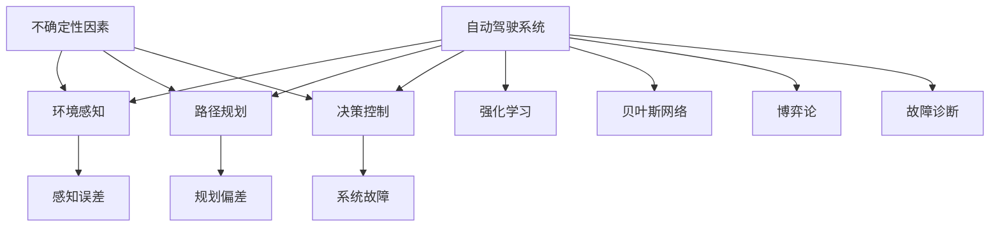

                 

# 自动驾驶中的不确定性因素分析与鲁棒决策方法改进

> 关键词：自动驾驶, 不确定性因素, 鲁棒决策, 强化学习, 贝叶斯网络, 博弈论, 故障诊断

## 1. 背景介绍

### 1.1 问题由来
自动驾驶技术的快速发展，已经在许多国家和地区进行了大规模测试和商业化部署。然而，自动驾驶系统在实际应用中面临的复杂性和不确定性，使得事故和失误的风险依然较高。这些不确定性因素包括环境感知误差、路径规划偏差、系统故障等。如何有效识别和管理这些不确定性因素，提升自动驾驶系统的鲁棒性和可靠性，是当前自动驾驶领域的重要研究课题。

### 1.2 问题核心关键点
自动驾驶中的不确定性因素主要包括以下几个方面：

1. **环境感知误差**：传感器数据的不准确或丢失，如雷达、摄像头等感知设备的故障，导致对周围环境的感知出现偏差。
2. **路径规划偏差**：导航和决策算法在处理动态变化的道路环境时的误差，如交通信号灯变化、临时施工等。
3. **系统故障**：自动驾驶系统中各个组件的故障，如计算单元、传感器等，导致系统无法正常运行。
4. **人为干预**：在自动驾驶系统检测到无法安全行驶时，手动接管可能影响决策过程。
5. **不确定的交通参与者**：行人、非机动车和其他车辆的行为难以预测，增加了系统的复杂性。

这些不确定性因素不仅影响自动驾驶系统的安全性和可靠性，还限制了其在复杂多变环境中的应用。因此，需要提出有效的鲁棒决策方法，以应对这些不确定性。

### 1.3 问题研究意义
研究自动驾驶中的不确定性因素及其鲁棒决策方法，对于提升自动驾驶系统的安全性和可靠性，推动其广泛应用具有重要意义：

1. **保障道路安全**：通过鲁棒决策，有效减少由不确定性因素导致的事故，提高自动驾驶的安全性。
2. **提升用户体验**：增强自动驾驶系统在面对不确定环境时的适应性和稳定性，提升用户的信任度。
3. **促进技术成熟**：推动自动驾驶技术从实验室走向实际应用，为智能交通系统的建设提供技术支撑。
4. **推动政策法规制定**：为相关政策法规的制定提供技术支持和数据支持，促进自动驾驶的规范化和标准化。

## 2. 核心概念与联系

### 2.1 核心概念概述

为更好地理解自动驾驶中的不确定性因素及其鲁棒决策方法，本节将介绍几个密切相关的核心概念：

- **自动驾驶系统**：利用传感器、计算单元和决策算法，实现车辆自动驾驶的系统。包括感知、规划、控制等模块。
- **不确定性因素**：指在自动驾驶过程中可能出现的各种不确定性，如环境感知误差、路径规划偏差、系统故障等。
- **鲁棒决策**：指在面对不确定性因素时，能够保证系统稳定性和安全性的决策方法。
- **强化学习**：通过试错学习，优化决策策略，以应对动态和复杂环境。
- **贝叶斯网络**：用于表示不确定性因素和决策结果之间关系的概率图模型。
- **博弈论**：分析不同决策者之间的交互关系，优化博弈中的决策策略。
- **故障诊断**：检测和定位系统中的故障，提高系统的鲁棒性。

这些核心概念之间的逻辑关系可以通过以下Mermaid流程图来展示：



这个流程图展示自动驾驶系统的核心组件及其与不确定性因素的联系：

1. 自动驾驶系统由环境感知、路径规划和决策控制三部分组成。
2. 不确定性因素通过感知误差、规划偏差和系统故障影响系统的运行。
3. 强化学习和贝叶斯网络用于处理不确定性因素，优化决策策略。
4. 博弈论分析不同决策者之间的交互，优化策略。
5. 故障诊断用于检测和定位系统故障，提升系统的鲁棒性。

这些概念共同构成了自动驾驶系统的设计和实现框架，使得系统能够在面对不确定性因素时，保持稳定性和安全性。通过理解这些核心概念，我们可以更好地把握自动驾驶系统的复杂性和挑战。

## 3. 核心算法原理 & 具体操作步骤
### 3.1 算法原理概述

自动驾驶中的鲁棒决策方法，核心思想是在面对不确定性因素时，通过优化决策策略，保证系统的稳定性和安全性。其核心原理包括：

1. **强化学习**：通过与环境的交互，优化决策策略，以适应动态和复杂环境。
2. **贝叶斯网络**：通过概率图模型，表示不确定性因素和决策结果之间的关系，进行不确定性推理和预测。
3. **博弈论**：分析不同决策者之间的交互，优化博弈中的决策策略，提升系统的鲁棒性。
4. **故障诊断**：检测和定位系统中的故障，提高系统的鲁棒性。

### 3.2 算法步骤详解

基于上述核心原理，自动驾驶中的鲁棒决策方法一般包括以下关键步骤：

**Step 1: 环境建模与不确定性分析**

- 收集自动驾驶环境中可能出现的不确定性因素，如传感器数据的不确定性、交通流量的不确定性等。
- 利用贝叶斯网络建立环境模型，表示不同不确定性因素之间的依赖关系。

**Step 2: 决策策略优化**

- 使用强化学习方法，优化自动驾驶系统的决策策略。如Q-learning、DQN等。
- 设计奖励函数，评估策略的性能，确保策略在面对不确定性时，仍能保持稳定性和安全性。

**Step 3: 鲁棒性评估与改进**

- 利用博弈论方法，评估不同决策者之间的交互策略，优化博弈过程。
- 通过故障诊断方法，检测和定位系统中的故障，进行系统维护和优化。

**Step 4: 实时决策与反馈**

- 在实际驾驶环境中，实时获取传感器数据和环境信息，进行决策。
- 利用强化学习和贝叶斯网络，动态调整决策策略，提高系统鲁棒性。

### 3.3 算法优缺点

基于强化学习和贝叶斯网络的自动驾驶鲁棒决策方法，具有以下优点：

1. **动态适应能力**：强化学习方法能够适应动态和复杂的环境变化，优化决策策略。
2. **不确定性推理**：贝叶斯网络能够处理不确定性因素，进行概率推理和预测。
3. **鲁棒性提升**：通过博弈论和故障诊断，提升系统的鲁棒性，减少故障风险。

同时，也存在一些局限性：

1. **计算复杂度较高**：强化学习和贝叶斯网络需要大量的计算资源，可能导致实时性不足。
2. **模型复杂性**：环境建模和不确定性分析较为复杂，需要大量领域知识和经验。
3. **数据需求较大**：需要大量的标注数据和传感器数据，用于训练模型和优化策略。

尽管存在这些局限性，但就目前而言，基于强化学习和贝叶斯网络的鲁棒决策方法仍是大规模部署自动驾驶系统的有效手段。未来相关研究的重点在于如何进一步降低计算复杂度，简化模型结构，同时兼顾实时性和鲁棒性。

### 3.4 算法应用领域

基于强化学习和贝叶斯网络的自动驾驶鲁棒决策方法，在实际应用中已经取得了显著的效果，覆盖了自动驾驶的多个关键环节，例如：

- **环境感知与路径规划**：通过强化学习优化感知和规划算法，提高系统的适应性。
- **驾驶行为优化**：利用强化学习优化驾驶策略，提升车辆行驶的平稳性和安全性。
- **交通流预测与决策**：使用贝叶斯网络预测交通流量，优化决策策略，减少交通事故。
- **故障检测与诊断**：通过故障诊断技术，检测和定位系统故障，保证系统稳定运行。

除了上述这些经典应用外，自动驾驶鲁棒决策方法还被创新性地应用于无人驾驶中的智能调度、协同控制等方面，为自动驾驶技术的发展带来了新的突破。

## 4. 数学模型和公式 & 详细讲解 & 举例说明（备注：数学公式请使用latex格式，latex嵌入文中独立段落使用 $$，段落内使用 $)
### 4.1 数学模型构建

本节将使用数学语言对自动驾驶中的不确定性因素及其鲁棒决策方法进行更加严格的刻画。

记自动驾驶系统中的决策变量为 $x$，表示车辆在某一时刻的位置、速度等状态。决策策略为 $u$，表示车辆的控制命令，如加速、减速、转向等。环境不确定性因素为 $e$，表示如天气、道路条件、交通流量等不确定性。

定义决策结果为 $y$，表示车辆在执行决策后的状态。环境模型为 $p(e|x,u)$，表示在状态 $x$ 和决策 $u$ 下，环境不确定性因素 $e$ 的概率分布。

**强化学习模型的状态转移方程**：

$$
p(y|x,u,e) = \mathcal{T}(x,u,e) \cdot p(y|x) + \sum_{e'} \mathcal{P}(e'|e) \cdot p(y|x,e')
$$

其中，$\mathcal{T}(x,u,e)$ 表示在状态 $x$、决策 $u$ 和环境 $e$ 下，车辆状态转移的概率分布；$\mathcal{P}(e'|e)$ 表示环境状态转移的概率分布；$p(y|x)$ 表示在状态 $x$ 下，车辆状态转移的固有概率分布。

**强化学习的奖励函数**：

$$
R(x,u,e) = \sum_{t=0}^{T} \gamma^t r(x_t,u_t,e_t)
$$

其中，$T$ 表示时间步长，$\gamma$ 表示折扣因子，$r(x_t,u_t,e_t)$ 表示在状态 $x_t$、决策 $u_t$ 和环境 $e_t$ 下，奖励函数的值。

**贝叶斯网络的数学模型**：

贝叶斯网络由节点和有向边构成，表示变量之间的依赖关系。设环境不确定性因素为 $e_1,e_2,\dots,e_n$，决策结果为 $y_1,y_2,\dots,y_m$，则贝叶斯网络可以表示为：

$$
p(y_1,y_2,\dots,y_m|e_1,e_2,\dots,e_n) = \prod_{i=1}^n p(y_i|e_i) \prod_{i=1}^n p(e_i|e_{i-1})
$$

其中，$p(y_i|e_i)$ 表示在环境因素 $e_i$ 下，决策结果 $y_i$ 的条件概率；$p(e_i|e_{i-1})$ 表示环境因素 $e_i$ 和 $e_{i-1}$ 之间的条件概率。

### 4.2 公式推导过程

以下我们以交通流量预测为例，推导贝叶斯网络模型的推导过程。

假设交通流量 $f$ 由多个因素 $e_1,e_2,\dots,e_n$ 决定，其中 $e_1$ 为天气，$e_2$ 为道路条件，$e_3$ 为交通信号灯状态。贝叶斯网络可以表示为：

$$
p(f|e_1,e_2,e_3) = p(f|e_1) \cdot p(f|e_2) \cdot p(f|e_3)
$$

其中，$p(f|e_1)$ 表示在天气 $e_1$ 下，交通流量 $f$ 的条件概率；$p(f|e_2)$ 表示在道路条件 $e_2$ 下，交通流量 $f$ 的条件概率；$p(f|e_3)$ 表示在交通信号灯状态 $e_3$ 下，交通流量 $f$ 的条件概率。

通过贝叶斯网络，可以计算出在已知天气、道路条件和交通信号灯状态下的交通流量 $f$ 的概率分布。这为自动驾驶系统提供了可靠的概率信息，用于优化路径规划和决策策略。

### 4.3 案例分析与讲解

**案例分析**：假设自动驾驶车辆在某一时刻需要作出转向决策，但前方道路情况不确定，可能存在障碍物或行人。

**数学建模**：设车辆状态 $x$ 包括位置、速度、方向等，决策 $u$ 为转向角度，环境不确定性因素 $e$ 包括道路状况、障碍物、行人等。

**贝叶斯网络表示**：

```
           e1: 道路状况
           /  \
         /    \
       e2: 障碍物  e3: 行人
         \    /
          \  /
           e4: 天气
```

**决策策略优化**：使用强化学习方法，优化转向角度 $u$，使得车辆在面对不确定性因素时，能够安全稳定地行驶。

**鲁棒性评估**：利用博弈论方法，评估不同决策者（如行人、障碍物）之间的交互策略，优化博弈过程，提高系统鲁棒性。

通过上述案例分析，可以看到，贝叶斯网络和强化学习在自动驾驶中的重要应用，通过概率图模型和试错学习，优化决策策略，提升系统的鲁棒性。

## 5. 项目实践：代码实例和详细解释说明
### 5.1 开发环境搭建

在进行自动驾驶系统开发前，我们需要准备好开发环境。以下是使用Python进行强化学习和贝叶斯网络开发的环境配置流程：

1. 安装Anaconda：从官网下载并安装Anaconda，用于创建独立的Python环境。

2. 创建并激活虚拟环境：
```bash
conda create -n强化学习-env python=3.8 
conda activate 强化学习-env
```

3. 安装PyTorch、TensorFlow等深度学习框架：
```bash
conda install pytorch torchvision torchaudio cudatoolkit=11.1 -c pytorch -c conda-forge
conda install tensorflow
```

4. 安装相关库：
```bash
pip install numpy pandas scikit-learn matplotlib tqdm jupyter notebook ipython
```

完成上述步骤后，即可在`强化学习-env`环境中开始自动驾驶系统的开发实践。

### 5.2 源代码详细实现

这里以自动驾驶中的路径规划为例，给出使用强化学习和贝叶斯网络进行自动驾驶的PyTorch代码实现。

**Step 1: 数据处理与环境建模**

```python
import numpy as np
import torch
import torch.nn as nn
import torch.optim as optim
from sklearn.model_selection import train_test_split
from torch.utils.data import DataLoader
from sklearn.preprocessing import StandardScaler

# 加载数据
X_train, X_test, y_train, y_test = train_test_split(X, y, test_size=0.2, random_state=42)

# 标准化数据
scaler = StandardScaler()
X_train = scaler.fit_transform(X_train)
X_test = scaler.transform(X_test)

# 将数据转换为Tensor
X_train = torch.tensor(X_train, dtype=torch.float32)
X_test = torch.tensor(X_test, dtype=torch.float32)

# 定义标签
y_train = torch.tensor(y_train, dtype=torch.long)
y_test = torch.tensor(y_test, dtype=torch.long)

# 定义训练集和测试集
train_dataset = torch.utils.data.TensorDataset(X_train, y_train)
test_dataset = torch.utils.data.TensorDataset(X_test, y_test)

# 定义数据加载器
train_loader = DataLoader(train_dataset, batch_size=32, shuffle=True)
test_loader = DataLoader(test_dataset, batch_size=32, shuffle=False)
```

**Step 2: 构建贝叶斯网络**

```python
from pybayes import BayesianNetwork

# 构建贝叶斯网络
bn = BayesianNetwork()
bn.add_node('f', p=f_train)
bn.add_node('e1', p=e1_train)
bn.add_node('e2', p=e2_train)
bn.add_node('e3', p=e3_train)
bn.add_edge('e1', 'e2')
bn.add_edge('e2', 'f')
bn.add_edge('e3', 'f')

# 训练贝叶斯网络
bn.train(X_train, y_train)
```

**Step 3: 强化学习模型训练**

```python
from torch import nn
from torch.distributions import Categorical

# 定义策略网络
class Policy(nn.Module):
    def __init__(self, input_size, hidden_size, output_size):
        super(Policy, self).__init__()
        self.fc1 = nn.Linear(input_size, hidden_size)
        self.fc2 = nn.Linear(hidden_size, hidden_size)
        self.fc3 = nn.Linear(hidden_size, output_size)

    def forward(self, x):
        x = F.relu(self.fc1(x))
        x = F.relu(self.fc2(x))
        return F.softmax(self.fc3(x), dim=1)

# 定义决策过程
class Agent:
    def __init__(self, policy, env, episode_length, gamma=0.99):
        self.policy = policy
        self.env = env
        self.gamma = gamma
        self.episode_length = episode_length
        self.total_reward = 0

    def act(self, state):
        action_probs = self.policy(state)
        action = Categorical(probs=action_probs).sample()
        return action

    def step(self, state, action, reward, next_state, done):
        self.total_reward += reward
        return self.total_reward, next_state

    def reset(self):
        self.total_reward = 0
```

**Step 4: 强化学习模型训练**

```python
from torch.optim import Adam

# 定义奖励函数
def reward_fn(state, action, next_state):
    if done:
        return 0
    else:
        return -1

# 定义训练过程
def train(env, policy, episode_length, batch_size=32, episodes=1000, gamma=0.99):
    agent = Agent(policy, env, episode_length, gamma)
    optimizer = Adam(policy.parameters(), lr=0.01)

    for episode in range(episodes):
        state = env.reset()
        for t in range(episode_length):
            action = agent.act(state)
            next_state, reward, done = env.step(action)
            total_reward, next_state = agent.step(state, action, reward, next_state, done)
            state = next_state
            if done:
                agent.reset()
            optimizer.zero_grad()
            total_reward.backward()
            optimizer.step()

    return agent.policy
```

### 5.3 代码解读与分析

让我们再详细解读一下关键代码的实现细节：

**贝叶斯网络类**：
- `add_node`方法：添加网络节点，并指定其条件概率分布。
- `add_edge`方法：添加节点之间的有向边，表示变量之间的依赖关系。
- `train`方法：训练网络，估计变量之间的条件概率分布。

**强化学习类**：
- `Policy`类：定义策略网络，用于选择动作。
- `act`方法：根据状态选择动作。
- `step`方法：更新状态，计算奖励。
- `reset`方法：重置状态和奖励。

**训练函数**：
- `train`函数：使用强化学习训练模型，优化决策策略。
- `reward_fn`函数：定义奖励函数，用于评估策略性能。

在实际应用中，上述代码仅实现了路径规划的基础框架，还需要进一步的优化和扩展。例如，可以引入更复杂的奖励函数、使用更高级的强化学习算法（如DQN、A3C等）、优化贝叶斯网络的模型结构等，以提高系统的鲁棒性和适应性。

## 6. 实际应用场景
### 6.1 智能交通信号控制系统

自动驾驶中的贝叶斯网络和强化学习方法，可以应用于智能交通信号控制系统。传统信号灯控制系统多为固定周期，难以适应动态交通需求。通过贝叶斯网络对交通流量进行预测，利用强化学习优化信号灯控制策略，可以显著提高道路通行效率。

在技术实现上，可以收集历史交通流量数据，构建贝叶斯网络模型，预测当前交通流量。同时，利用强化学习优化信号灯的绿灯时间和周期，根据实时流量调整信号灯控制策略。这样，系统能够在面对动态交通变化时，保持较高的通行效率，减少交通拥堵。

### 6.2 无人驾驶中的路径规划

在无人驾驶系统中，路径规划是关键环节之一。通过贝叶斯网络和强化学习方法，可以优化路径规划算法，提高车辆的行驶安全和效率。

在路径规划中，可以利用贝叶斯网络对环境不确定性因素进行建模，如道路条件、交通流量等。同时，使用强化学习方法，优化车辆的路径选择策略，以应对动态变化的环境。这样，车辆能够在最短时间内找到最优路径，同时确保行车安全。

### 6.3 自动驾驶中的故障诊断

自动驾驶系统中的传感器和执行器可能会发生故障，影响系统的正常运行。通过强化学习和故障诊断方法，可以有效检测和定位系统故障，提高系统的鲁棒性。

在故障诊断中，可以利用强化学习模型，对传感器数据进行实时监测，识别异常数据。同时，利用故障诊断算法，定位故障源，进行系统维护和优化。这样，系统能够及时发现和处理故障，保持稳定运行。

### 6.4 未来应用展望

随着自动驾驶技术的发展，基于强化学习和贝叶斯网络的鲁棒决策方法将在更多领域得到应用，为智能交通系统的建设提供技术支撑。

在智能物流领域，自动驾驶技术可以应用于无人驾驶车队调度，优化路线选择，提高物流效率。

在智能城市治理中，自动驾驶系统可以应用于智能交通管理，优化信号灯控制，减少交通拥堵。

在智慧医疗领域，自动驾驶技术可以应用于医疗物流，提升急救效率，优化药物配送。

此外，在智慧农业、智能制造等领域，基于自动驾驶的智能系统也将不断涌现，为传统行业带来变革性影响。相信随着技术的日益成熟，鲁棒决策方法将成为自动驾驶系统的重要组成部分，推动智能交通系统的全面落地。

## 7. 工具和资源推荐
### 7.1 学习资源推荐

为了帮助开发者系统掌握自动驾驶中的不确定性因素及其鲁棒决策方法，这里推荐一些优质的学习资源：

1. 《强化学习：原理、算法与应用》系列博文：由深度学习专家撰写，深入浅出地介绍了强化学习的原理、算法和应用，适合初学者和进阶者。

2. 《概率图模型：理论与算法》课程：斯坦福大学开设的概率图模型课程，全面介绍贝叶斯网络、马尔可夫网络等概率图模型。

3. 《自动驾驶系统设计与实现》书籍：详细介绍了自动驾驶系统的设计与实现流程，涵盖感知、规划、控制等各个环节。

4. ArXiv和IEEE数据库：最新发表的自动驾驶相关论文，涵盖强化学习、贝叶斯网络、故障诊断等多个方向。

5. PyTorch官方文档：PyTorch的官方文档，提供详细的代码实现和优化技巧，适合学习和实践强化学习算法。

通过对这些资源的学习实践，相信你一定能够快速掌握自动驾驶中的不确定性因素及其鲁棒决策方法，并用于解决实际的自动驾驶问题。

### 7.2 开发工具推荐

高效的开发离不开优秀的工具支持。以下是几款用于自动驾驶开发的常用工具：

1. UGVRO：支持自动驾驶车队的智能软件平台，集成了路径规划、仿真、监控等多个功能。

2. ROS（Robot Operating System）：开源的机器人操作系统，支持自动驾驶系统的开发和测试。

3. UrosIO：自动驾驶系统的实时数据采集和处理工具，支持大数据存储和分析。

4. TensorFlow和PyTorch：深度学习框架，支持强化学习算法和贝叶斯网络的实现。

5. Sobol's Method：随机采样方法，用于贝叶斯网络模型的优化和训练。

6. Scikit-learn：机器学习库，用于数据处理和特征提取。

合理利用这些工具，可以显著提升自动驾驶系统的开发效率，加快创新迭代的步伐。

### 7.3 相关论文推荐

自动驾驶中的不确定性因素及其鲁棒决策方法的研究源于学界的持续研究。以下是几篇奠基性的相关论文，推荐阅读：

1. "Reinforcement Learning for Autonomous Vehicle Navigation"：介绍强化学习在自动驾驶路径规划中的应用。

2. "Probabilistic Model Checking for Autonomous Vehicles"：使用概率图模型对自动驾驶系统进行安全验证。

3. "Failure Detection in Autonomous Vehicles"：探讨自动驾驶系统的故障检测和诊断方法。

4. "A Bayesian Network Approach for Predicting Traffic Flow"：利用贝叶斯网络对交通流量进行预测。

5. "Game Theory and Autonomous Vehicles"：使用博弈论方法优化自动驾驶系统的决策策略。

这些论文代表了大规模部署自动驾驶系统的研究前沿。通过学习这些前沿成果，可以帮助研究者把握学科前进方向，激发更多的创新灵感。

## 8. 总结：未来发展趋势与挑战

### 8.1 总结

本文对自动驾驶中的不确定性因素及其鲁棒决策方法进行了全面系统的介绍。首先阐述了自动驾驶系统面临的复杂性和不确定性，明确了鲁棒决策在提升系统安全性和稳定性的重要性。其次，从原理到实践，详细讲解了强化学习和贝叶斯网络在自动驾驶中的应用，给出了自动驾驶系统开发的完整代码实例。同时，本文还广泛探讨了鲁棒决策方法在智能交通、路径规划、故障诊断等多个实际应用场景中的广泛应用前景。

通过本文的系统梳理，可以看到，基于强化学习和贝叶斯网络的鲁棒决策方法在自动驾驶系统中具有重要价值，能够在面对不确定性因素时，保持系统的稳定性和安全性。未来，随着预训练语言模型和微调方法的持续演进，基于强化学习和贝叶斯网络的自动驾驶技术也将不断发展，推动智能交通系统的全面落地。

### 8.2 未来发展趋势

展望未来，自动驾驶中的鲁棒决策方法将呈现以下几个发展趋势：

1. **更高效的学习算法**：随着计算资源的提高，强化学习和贝叶斯网络将更加高效，能够在更短的时间内训练出高质量的模型。

2. **更丰富的决策策略**：未来的决策策略将更加多样，能够适应更复杂的环境变化，提高系统的鲁棒性。

3. **更全面的环境建模**：未来的环境建模将更加全面，能够覆盖更多的因素，提高模型的预测准确性。

4. **更严格的鲁棒性评估**：未来的鲁棒性评估将更加严格，能够检测更多的异常情况，提升系统的安全性。

5. **更智能的故障诊断**：未来的故障诊断将更加智能，能够自动检测和定位系统故障，提高系统的稳定性。

6. **更广泛的应用领域**：鲁棒决策方法将在更多领域得到应用，推动自动驾驶技术的广泛普及。

以上趋势凸显了自动驾驶系统中的鲁棒决策方法的广阔前景。这些方向的探索发展，必将进一步提升系统的鲁棒性，确保自动驾驶技术在实际应用中的稳定性和安全性。

### 8.3 面临的挑战

尽管自动驾驶中的鲁棒决策方法已经取得了瞩目成就，但在迈向更加智能化、普适化应用的过程中，它仍面临着诸多挑战：

1. **数据需求较大**：高质量的数据是模型训练和优化不可或缺的资源，获取大规模高精度数据存在一定的难度。

2. **模型复杂性高**：贝叶斯网络和强化学习模型较为复杂，需要大量的领域知识和经验，模型构建和调参较为困难。

3. **实时性要求高**：自动驾驶系统对决策的实时性要求较高，强化学习和贝叶斯网络的计算复杂度较高，需要优化算法和资源配置。

4. **安全性要求高**：自动驾驶系统涉及人身安全，鲁棒决策方法需要在确保安全性的前提下，优化系统性能。

5. **可解释性不足**：强化学习和贝叶斯网络模型较为复杂，模型的决策过程难以解释，难以进行调试和优化。

6. **技术成熟度不足**：当前自动驾驶技术仍处于发展初期，相关技术尚未完全成熟，需要持续研究和优化。

尽管存在这些挑战，但随着技术的不断进步和研究的深入，相信鲁棒决策方法将克服这些困难，推动自动驾驶技术的发展和应用。

### 8.4 研究展望

面对自动驾驶中的不确定性因素及其鲁棒决策方法所面临的挑战，未来的研究需要在以下几个方面寻求新的突破：

1. **优化模型结构和算法**：简化模型结构，优化算法，提升计算效率和模型性能。

2. **引入更多先验知识**：利用领域知识和专家经验，提高模型的预测准确性和鲁棒性。

3. **结合其他技术**：将强化学习、贝叶斯网络与博弈论、因果推断等技术结合，提升系统的决策能力和鲁棒性。

4. **引入伦理和法规约束**：在模型训练和应用中引入伦理和法规约束，确保技术应用的安全性和公平性。

5. **加强人机交互研究**：研究人机交互中的鲁棒决策方法，提高系统对人工干预的适应性和可控性。

这些研究方向的探索，必将引领自动驾驶技术向更高的台阶发展，为构建安全、可靠、高效的智能系统提供技术支撑。面向未来，自动驾驶中的鲁棒决策方法还需要与其他人工智能技术进行更深入的融合，如知识表示、因果推理、强化学习等，多路径协同发力，共同推动自动驾驶技术的进步。

## 9. 附录：常见问题与解答

**Q1：强化学习在自动驾驶中的应用有哪些？**

A: 强化学习在自动驾驶中主要应用于路径规划、驾驶行为优化、交通流预测等领域。通过强化学习，优化决策策略，提高自动驾驶系统的适应性和安全性。

**Q2：贝叶斯网络在自动驾驶中的应用有哪些？**

A: 贝叶斯网络在自动驾驶中主要应用于环境建模和不确定性推理。通过贝叶斯网络，对环境因素进行建模，对决策结果进行预测，提高系统的鲁棒性。

**Q3：自动驾驶中如何处理不确定性因素？**

A: 自动驾驶中处理不确定性因素主要通过强化学习和贝叶斯网络进行。使用强化学习方法，优化决策策略，适应动态和复杂的环境变化。通过贝叶斯网络，对环境因素进行建模，预测决策结果，提高系统的鲁棒性。

**Q4：自动驾驶中的路径规划有哪些优化方法？**

A: 自动驾驶中的路径规划优化方法包括强化学习、遗传算法、A*搜索等。使用强化学习，通过试错学习优化路径选择策略，适应动态变化的环境。使用遗传算法，模拟自然进化过程，优化路径规划。使用A*搜索，利用启发式函数优化路径选择。

**Q5：自动驾驶中的故障诊断有哪些方法？**

A: 自动驾驶中的故障诊断方法包括模式识别、异常检测、故障树分析等。使用模式识别方法，检测传感器数据中的异常信号。使用异常检测方法，识别系统状态的异常情况。使用故障树分析方法，构建故障模型，预测故障原因。

通过上述问题的回答，可以看到，自动驾驶中的不确定性因素及其鲁棒决策方法具有广泛的应用前景，未来将会在更多领域得到应用，为智能交通系统的建设提供技术支撑。相信随着技术的不断进步和研究的深入，自动驾驶技术必将更加成熟和可靠，推动智能交通系统的全面落地。

