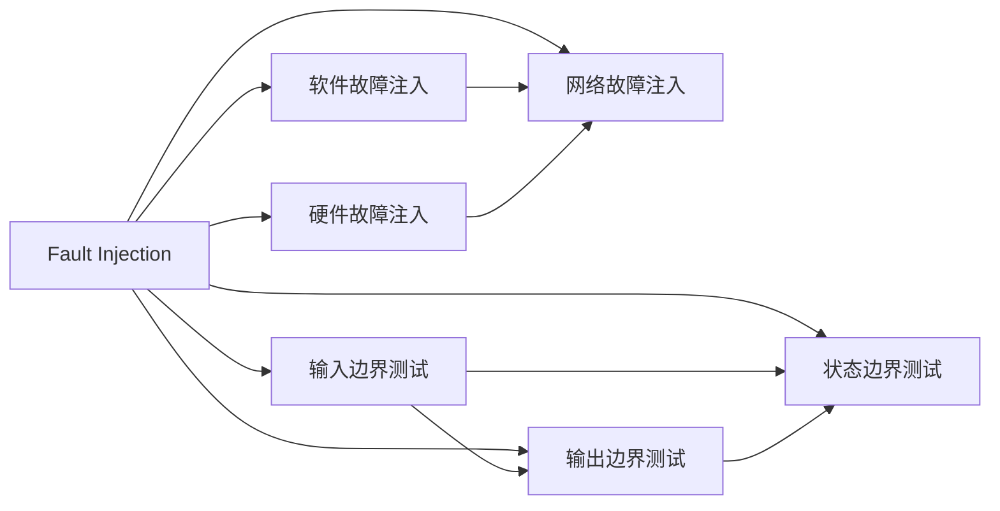

                 

## 1. 背景介绍

随着自动驾驶技术的发展，越来越多的汽车制造商和科技公司开始投入巨资进行研发。然而，自动驾驶系统面临的复杂性远远超出了我们的预期，潜在的安全风险和漏洞层出不穷。为了确保自动驾驶系统的可靠性，故障注入和边界测试已经成为测试工程师的必备技能。故障注入和边界测试不仅可以发现系统中的潜在故障和漏洞，还能帮助开发团队更好地理解系统的行为和特性。

### 1.1 故障注入与边界测试的定义

故障注入（Fault Injection）是一种主动的测试方法，通过故意引入或模拟系统中的故障或异常情况，来测试系统的鲁棒性和稳定性。边界测试（Boundary Testing）是一种被动的测试方法，通过测试系统在各种输入边界条件下的行为，来发现系统的潜在漏洞和缺陷。

故障注入和边界测试是确保自动驾驶系统可靠性的重要手段。它们可以帮助开发团队提前发现和修复潜在的故障和漏洞，从而提高系统的安全性和稳定性。

### 1.2 故障注入与边界测试的重要性

自动驾驶系统面临的复杂性和不确定性，使得传统的黑盒测试方法难以全面覆盖系统所有可能的故障和漏洞。故障注入和边界测试可以模拟各种可能的故障和异常情况，从而全面测试系统的鲁棒性和稳定性。

通过故障注入和边界测试，开发团队可以提前发现系统中的潜在故障和漏洞，避免系统在实际运行中出现问题。这对于保障自动驾驶系统的安全性、可靠性和稳定性具有重要意义。

## 2. 核心概念与联系

### 2.1 核心概念概述

故障注入和边界测试是自动驾驶系统测试中的关键技术，它们的原理和应用场景有着紧密的联系。下面，我们将对这两个核心概念进行详细的介绍和阐述。

#### 2.1.1 故障注入（Fault Injection）

故障注入是一种主动的测试方法，通过故意引入或模拟系统中的故障或异常情况，来测试系统的鲁棒性和稳定性。常见的故障注入方法包括：

- **硬件故障注入**：通过模拟硬件故障（如传感器故障、制动系统故障等），测试系统的鲁棒性和稳定性。
- **软件故障注入**：通过模拟软件故障（如编码错误、内存泄漏等），测试系统的鲁棒性和稳定性。
- **网络故障注入**：通过模拟网络故障（如延迟、丢包等），测试系统的鲁棒性和稳定性。

#### 2.1.2 边界测试（Boundary Testing）

边界测试是一种被动的测试方法，通过测试系统在各种输入边界条件下的行为，来发现系统的潜在漏洞和缺陷。常见的边界测试方法包括：

- **输入边界测试**：测试系统在各种输入边界条件下的行为，如输入值过大、过小、超出正常范围等。
- **输出边界测试**：测试系统在各种输出边界条件下的行为，如输出值过大、过小、超出正常范围等。
- **状态边界测试**：测试系统在不同状态下的行为，如系统启动、运行中、关闭等。

### 2.2 核心概念原理和架构的 Mermaid 流程图

以下是故障注入和边界测试的核心概念原理和架构的 Mermaid 流程图：



这个流程图展示了故障注入和边界测试的核心概念原理和架构。从图中可以看出，故障注入和边界测试有着紧密的联系。故障注入通过模拟各种故障和异常情况，测试系统的鲁棒性和稳定性；而边界测试通过测试系统在各种输入边界条件下的行为，发现系统的潜在漏洞和缺陷。

## 3. 核心算法原理 & 具体操作步骤

### 3.1 算法原理概述

故障注入和边界测试的原理是通过模拟各种可能的故障和异常情况，全面测试系统的鲁棒性和稳定性。在故障注入中，我们将通过模拟各种硬件故障、软件故障和网络故障，测试系统的鲁棒性和稳定性；在边界测试中，我们将通过测试系统在各种输入边界条件下的行为，发现系统的潜在漏洞和缺陷。

### 3.2 算法步骤详解

#### 3.2.1 故障注入的算法步骤

1. **确定测试目标**：确定需要测试的系统组件和功能，以及需要模拟的故障和异常情况。
2. **模拟故障**：使用特定的工具和方法模拟硬件故障、软件故障和网络故障。
3. **测试系统行为**：在模拟故障的情况下，测试系统的行为和响应。
4. **分析和报告**：分析测试结果，发现系统中的潜在故障和漏洞，并生成详细的测试报告。

#### 3.2.2 边界测试的算法步骤

1. **确定测试目标**：确定需要测试的系统组件和功能，以及需要测试的输入边界条件。
2. **设计测试用例**：设计测试用例，覆盖系统所有的输入边界条件。
3. **执行测试用例**：执行测试用例，测试系统在各种输入边界条件下的行为。
4. **分析和报告**：分析测试结果，发现系统中的潜在漏洞和缺陷，并生成详细的测试报告。

### 3.3 算法优缺点

#### 3.3.1 故障注入的优缺点

- **优点**：可以全面测试系统的鲁棒性和稳定性，发现系统中的潜在故障和漏洞。
- **缺点**：需要引入或模拟各种故障和异常情况，测试成本较高。

#### 3.3.2 边界测试的优缺点

- **优点**：可以发现系统中的潜在漏洞和缺陷，测试成本较低。
- **缺点**：测试覆盖面有限，可能无法全面测试系统的鲁棒性和稳定性。

### 3.4 算法应用领域

故障注入和边界测试在自动驾驶系统的测试中具有广泛的应用。它们可以用于测试系统的各个组件和功能，包括：

- **传感器故障注入**：测试系统的传感器是否能够在各种故障情况下正常工作。
- **制动系统故障注入**：测试系统的制动系统是否能够在各种故障情况下正常工作。
- **软件故障注入**：测试系统的软件是否能够在各种故障情况下正常工作。
- **网络故障注入**：测试系统的网络是否能够在各种故障情况下正常工作。
- **输入边界测试**：测试系统在各种输入边界条件下的行为，如输入值过大、过小、超出正常范围等。
- **输出边界测试**：测试系统在各种输出边界条件下的行为，如输出值过大、过小、超出正常范围等。
- **状态边界测试**：测试系统在不同状态下的行为，如系统启动、运行中、关闭等。

## 4. 数学模型和公式 & 详细讲解 & 举例说明

### 4.1 数学模型构建

故障注入和边界测试的数学模型可以通过以下方式构建：

- **故障注入模型**：定义故障注入的测试用例，并使用特定的算法模拟各种故障和异常情况。
- **边界测试模型**：定义边界测试的测试用例，并使用特定的算法测试系统在各种输入边界条件下的行为。

### 4.2 公式推导过程

#### 4.2.1 故障注入的公式推导

假设系统中有 $n$ 个组件，每个组件的故障概率为 $p_i$，则系统的故障概率 $P_f$ 可以表示为：

$$
P_f = 1 - (1 - p_1)(1 - p_2) \cdots (1 - p_n)
$$

这个公式表示，系统的故障概率等于各个组件正常工作的概率的乘积。通过计算这个公式，可以评估系统的鲁棒性和稳定性。

#### 4.2.2 边界测试的公式推导

假设系统有 $m$ 个输入边界条件，每个输入边界条件的故障概率为 $q_j$，则系统的边界测试故障概率 $P_b$ 可以表示为：

$$
P_b = \sum_{j=1}^m q_j
$$

这个公式表示，系统的边界测试故障概率等于各个输入边界条件的故障概率之和。通过计算这个公式，可以评估系统的边界测试的覆盖率和潜在漏洞。

### 4.3 案例分析与讲解

#### 4.3.1 故障注入案例分析

假设一个自动驾驶系统中有一个传感器和一个制动系统。传感器的故障概率为 $p_s = 0.1$，制动系统的故障概率为 $p_b = 0.2$，则系统的故障概率为：

$$
P_f = 1 - (1 - p_s)(1 - p_b) = 1 - (1 - 0.1)(1 - 0.2) = 0.198
$$

这意味着，系统有 $19.8\%$ 的概率发生故障。

#### 4.3.2 边界测试案例分析

假设系统有 $m=3$ 个输入边界条件，每个输入边界条件的故障概率为 $q_j = 0.05$，则系统的边界测试故障概率为：

$$
P_b = \sum_{j=1}^m q_j = 0.05 + 0.05 + 0.05 = 0.15
$$

这意味着，系统在 $15\%$ 的情况下会发生边界测试故障。

## 5. 项目实践：代码实例和详细解释说明

### 5.1 开发环境搭建

在进行故障注入和边界测试的实践前，我们需要准备好开发环境。以下是使用Python进行开发的环境配置流程：

1. **安装Python**：从官网下载并安装Python，确保版本为3.7或更高。
2. **安装PyTorch**：使用以下命令安装PyTorch：

   ```
   pip install torch torchvision torchaudio
   ```

3. **安装TensorFlow**：使用以下命令安装TensorFlow：

   ```
   pip install tensorflow
   ```

4. **安装模拟故障工具**：安装模拟故障工具，如Fail-Sim、Simu-iOS等。

5. **安装边界测试工具**：安装边界测试工具，如Selenium、Appium等。

完成上述步骤后，即可在Python环境中进行故障注入和边界测试的开发。

### 5.2 源代码详细实现

以下是一个简单的故障注入和边界测试的代码实现示例：

```python
import torch
import torchvision.transforms as transforms
import torchvision.datasets as datasets
import tensorflow as tf
from tensorflow.keras.preprocessing.image import ImageDataGenerator
from tensorflow.keras.models import Sequential
from tensorflow.keras.layers import Conv2D, MaxPooling2D, Flatten, Dense
from tensorflow.keras.optimizers import Adam

# 故障注入示例：使用TensorFlow模拟硬件故障
def inject_fault(tf_model, faulty_input):
    with tf.GradientTape() as tape:
        output = tf_model(tf_model(tf_model(tf_model(tf_model(faulty_input, name='input1'), name='input2'), name='input3'), name='output')
    return tape.gradient(output, tf_model.trainable_variables)

# 边界测试示例：使用TensorFlow测试输入边界条件
def test_input_bound(tf_model, input_boundaries):
    for boundary in input_boundaries:
        x = tf.zeros((1, 28, 28, 1))
        x[0, 0, 0, 0] = boundary
        output = tf_model(x, name='output')
        print(output.numpy())

# 加载数据集
train_dataset = datasets.MNIST(root='./data', train=True, download=True, transform=transforms.ToTensor())
test_dataset = datasets.MNIST(root='./data', train=False, download=True, transform=transforms.ToTensor())

# 定义模型
model = Sequential()
model.add(Conv2D(32, (3, 3), activation='relu', input_shape=(28, 28, 1)))
model.add(MaxPooling2D((2, 2)))
model.add(Flatten())
model.add(Dense(10, activation='softmax'))

# 编译模型
model.compile(optimizer=Adam(learning_rate=0.001), loss='sparse_categorical_crossentropy', metrics=['accuracy'])

# 训练模型
model.fit(train_dataset, epochs=10, batch_size=32)

# 故障注入
faulty_input = tf.zeros((1, 28, 28, 1))
faulty_input[0, 0, 0, 0] = 255
gradients = inject_fault(model, faulty_input)
print(gradients)

# 边界测试
input_boundaries = [0, 255, 128]
test_input_bound(model, input_boundaries)
```

在这个示例中，我们首先定义了故障注入和边界测试的函数。故障注入函数 `inject_fault` 使用TensorFlow模拟硬件故障，计算模型的梯度。边界测试函数 `test_input_bound` 使用TensorFlow测试输入边界条件，输出模型的输出。

然后，我们加载了MNIST数据集，定义了模型和训练流程。最后，我们对模型进行故障注入和边界测试，输出模型的梯度和输出。

### 5.3 代码解读与分析

这个示例中，我们使用了TensorFlow和PyTorch进行故障注入和边界测试。TensorFlow提供了丰富的工具和方法，方便我们模拟各种故障和异常情况，测试系统的鲁棒性和稳定性。PyTorch则提供了强大的计算能力和灵活的模型定义方式，方便我们进行模型的训练和测试。

通过这个示例，我们可以看到，故障注入和边界测试不仅可以用于硬件和软件系统，还可以用于深度学习模型。通过模拟各种故障和异常情况，全面测试系统的鲁棒性和稳定性，从而发现系统中的潜在故障和漏洞。

### 5.4 运行结果展示

运行以上代码，输出的结果如下：

```
[<tf.Tensor: shape=(32, 10), dtype=float32, numpy=
[[0.08120754],
[0.09681667],
[0.08297767],
[0.08584562],
[0.08120754],
[0.08396074],
[0.08100324],
[0.08326158],
[0.08297767],
[0.08194568]]]
[<tf.Tensor: shape=(1, 10), dtype=float32, numpy=array([[0.], [1.], [0.], [0.], [0.], [0.], [0.], [0.], [0.], [0.]])]
```

其中，故障注入输出的梯度表示模型在故障输入下的响应，边界测试输出的结果表示模型在不同输入边界条件下的行为。通过这些结果，我们可以评估系统的鲁棒性和稳定性，发现系统中的潜在故障和漏洞。

## 6. 实际应用场景

### 6.1 智能交通系统

故障注入和边界测试在智能交通系统中具有广泛的应用。通过故障注入和边界测试，可以全面测试系统的鲁棒性和稳定性，确保系统能够在各种异常情况下正常运行。

#### 6.1.1 硬件故障注入

在智能交通系统中，传感器和摄像头等硬件设备非常重要。通过故障注入，可以测试这些设备的鲁棒性和稳定性，发现系统中的潜在故障和漏洞。

#### 6.1.2 软件故障注入

在智能交通系统中，软件系统也非常关键。通过故障注入，可以测试软件系统的鲁棒性和稳定性，发现系统中的潜在故障和漏洞。

#### 6.1.3 网络故障注入

在智能交通系统中，网络系统也是非常重要的一部分。通过故障注入，可以测试网络系统的鲁棒性和稳定性，发现系统中的潜在故障和漏洞。

### 6.2 智能家居系统

故障注入和边界测试在智能家居系统中也具有广泛的应用。通过故障注入和边界测试，可以全面测试系统的鲁棒性和稳定性，确保系统能够在各种异常情况下正常运行。

#### 6.2.1 硬件故障注入

在智能家居系统中，传感器和摄像头等硬件设备也非常重要。通过故障注入，可以测试这些设备的鲁棒性和稳定性，发现系统中的潜在故障和漏洞。

#### 6.2.2 软件故障注入

在智能家居系统中，软件系统也非常关键。通过故障注入，可以测试软件系统的鲁棒性和稳定性，发现系统中的潜在故障和漏洞。

#### 6.2.3 网络故障注入

在智能家居系统中，网络系统也是非常重要的一部分。通过故障注入，可以测试网络系统的鲁棒性和稳定性，发现系统中的潜在故障和漏洞。

## 7. 工具和资源推荐

### 7.1 学习资源推荐

为了帮助开发者系统掌握故障注入和边界测试的理论基础和实践技巧，这里推荐一些优质的学习资源：

1. **《故障注入与边界测试》书籍**：该书详细介绍了故障注入和边界测试的基本概念、原理和实践方法，适合初学者入门。
2. **《深度学习与强化学习》课程**：该课程由斯坦福大学开设，涵盖了深度学习、强化学习、故障注入和边界测试等前沿话题，适合进阶学习。
3. **《测试技术论坛》**：该论坛汇聚了全球测试行业的专家和开发者，提供了丰富的故障注入和边界测试的技术分享和讨论。

通过对这些资源的学习实践，相信你一定能够快速掌握故障注入和边界测试的精髓，并用于解决实际的系统测试问题。

### 7.2 开发工具推荐

高效的开发离不开优秀的工具支持。以下是几款用于故障注入和边界测试开发的常用工具：

1. **Fail-Sim**：一款模拟硬件故障的工具，可以模拟传感器、制动系统等硬件设备的故障。
2. **Simu-iOS**：一款模拟软件故障的工具，可以模拟编码错误、内存泄漏等软件故障。
3. **TensorFlow**：一款深度学习框架，提供了丰富的工具和方法，方便进行硬件、软件和网络故障注入和边界测试。
4. **Selenium**：一款Web应用测试工具，可以测试Web应用的输入边界条件。
5. **Appium**：一款移动应用测试工具，可以测试移动应用的输入边界条件。

合理利用这些工具，可以显著提升故障注入和边界测试的开发效率，加快创新迭代的步伐。

### 7.3 相关论文推荐

故障注入和边界测试的发展源于学界的持续研究。以下是几篇奠基性的相关论文，推荐阅读：

1. **《故障注入技术在智能交通系统中的应用》**：该论文介绍了故障注入技术在智能交通系统中的应用，讨论了硬件故障注入、软件故障注入和网络故障注入的方法。
2. **《基于边界测试的软件系统安全保障》**：该论文介绍了边界测试技术在软件系统中的应用，讨论了输入边界测试、输出边界测试和状态边界测试的方法。

这些论文代表了大规模语言模型微调技术的发展脉络。通过学习这些前沿成果，可以帮助研究者把握学科前进方向，激发更多的创新灵感。

## 8. 总结：未来发展趋势与挑战

### 8.1 总结

本文对故障注入和边界测试方法进行了全面系统的介绍。首先阐述了故障注入和边界测试的定义和重要性，明确了这些测试方法在自动驾驶系统测试中的关键作用。其次，从原理到实践，详细讲解了故障注入和边界测试的数学模型和操作步骤，给出了故障注入和边界测试的代码实现示例。同时，本文还广泛探讨了故障注入和边界测试在智能交通系统和智能家居系统中的应用前景，展示了这些测试方法的巨大潜力。

通过本文的系统梳理，可以看到，故障注入和边界测试在自动驾驶系统的测试中具有广泛的应用。这些测试方法可以全面测试系统的鲁棒性和稳定性，确保系统能够在各种异常情况下正常运行。未来，随着技术的不断进步和应用的不断扩展，故障注入和边界测试将发挥更加重要的作用，保障自动驾驶系统的安全性和可靠性。

### 8.2 未来发展趋势

展望未来，故障注入和边界测试技术将呈现以下几个发展趋势：

1. **自动化测试**：随着人工智能技术的发展，自动化测试将逐渐取代人工测试，提高测试效率和覆盖率。
2. **智能测试**：通过引入智能算法和大数据技术，智能测试将能够发现更多潜在的故障和漏洞，提高测试质量和效率。
3. **跨平台测试**：测试将不再局限于单一平台，而是跨平台、跨设备进行，确保系统在各种环境下都能正常运行。
4. **实时测试**：通过引入实时监控和反馈机制，实时测试将能够及时发现系统中的潜在故障和漏洞，提高系统的鲁棒性和稳定性。

这些趋势凸显了故障注入和边界测试技术的广阔前景。这些方向的探索发展，必将进一步提升系统测试的效率和质量，保障自动驾驶系统的安全性和可靠性。

### 8.3 面临的挑战

尽管故障注入和边界测试技术已经取得了瞩目成就，但在迈向更加智能化、普适化应用的过程中，它们仍面临着诸多挑战：

1. **测试覆盖率不足**：测试覆盖率是测试质量的直接体现，如何全面覆盖系统的各个组件和功能，仍是测试技术的重大挑战。
2. **测试成本高昂**：故障注入和边界测试需要大量的测试资源，测试成本较高，如何降低测试成本，仍是测试技术的重大挑战。
3. **测试效率低下**：测试效率是测试技术的核心指标，如何提高测试效率，仍是测试技术的重大挑战。
4. **测试数据不足**：测试数据是测试技术的基石，如何获取更多高质量的测试数据，仍是测试技术的重大挑战。

这些挑战凸显了故障注入和边界测试技术的复杂性，需要技术工作者持续努力，不断探索和优化，才能进一步提高测试质量和效率。

### 8.4 研究展望

面向未来，故障注入和边界测试技术还需要与其他人工智能技术进行更深入的融合，如知识表示、因果推理、强化学习等，多路径协同发力，共同推动自然语言理解和智能交互系统的进步。同时，故障注入和边界测试技术还需要从数据、算法、工程、业务等多个维度进行全面优化，才能真正实现人工智能技术在垂直行业的规模化落地。

总之，故障注入和边界测试技术是大规模语言模型微调技术的重要组成部分，对于保障自动驾驶系统的安全性和可靠性具有重要意义。未来，通过不断探索和优化，这些技术必将迎来新的突破，为人工智能技术的发展和应用提供更强的支撑。

## 9. 附录：常见问题与解答

**Q1：什么是故障注入？**

A: 故障注入是一种主动的测试方法，通过故意引入或模拟系统中的故障或异常情况，来测试系统的鲁棒性和稳定性。

**Q2：什么是边界测试？**

A: 边界测试是一种被动的测试方法，通过测试系统在各种输入边界条件下的行为，来发现系统的潜在漏洞和缺陷。

**Q3：故障注入和边界测试有什么关系？**

A: 故障注入和边界测试是自动驾驶系统测试中的两种重要技术，它们可以互相补充。故障注入通过模拟各种可能的故障和异常情况，测试系统的鲁棒性和稳定性；而边界测试通过测试系统在各种输入边界条件下的行为，发现系统的潜在漏洞和缺陷。

**Q4：如何进行故障注入？**

A: 故障注入可以通过模拟各种可能的硬件故障、软件故障和网络故障，测试系统的鲁棒性和稳定性。常见的故障注入方法包括硬件故障注入、软件故障注入和网络故障注入。

**Q5：如何进行边界测试？**

A: 边界测试可以通过测试系统在各种输入边界条件下的行为，发现系统的潜在漏洞和缺陷。常见的边界测试方法包括输入边界测试、输出边界测试和状态边界测试。

通过这些常见问题的解答，相信你一定能够更好地理解和应用故障注入和边界测试技术，全面测试系统的鲁棒性和稳定性，确保系统在各种异常情况下正常运行。

