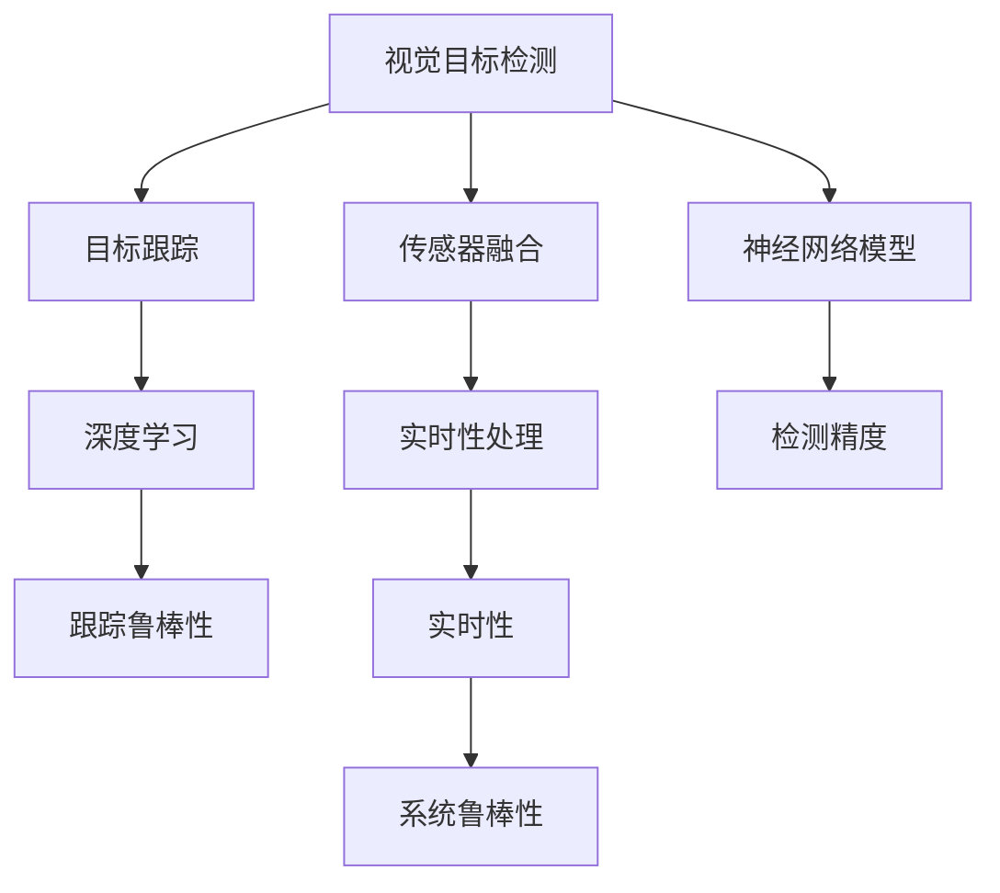

                 

# 自动驾驶中的视觉目标检测与跟踪算法创新

> 关键词：自动驾驶, 视觉目标检测, 目标跟踪, 算法创新, 深度学习, 计算机视觉, 神经网络, 传感器融合

## 1. 背景介绍

自动驾驶技术是当前人工智能与计算机视觉领域的重要应用之一。其核心在于使车辆能够自主导航，在复杂的交通环境中保证安全、高效、舒适的驾驶体验。视觉目标检测与跟踪是自动驾驶系统中的关键环节，负责在实时视频流中识别并追踪道路上的车辆、行人、交通标志等关键对象。

近年来，随着深度学习技术的快速发展，基于神经网络的视觉目标检测与跟踪方法在自动驾驶领域取得了显著进步。特别是YOLO、SSD、Faster R-CNN、CenterNet等单阶段检测器，以及DeepSORT、D Tracker等跟踪算法，在精度、速度等方面都有了质的飞跃。

然而，实际的自动驾驶场景中，目标多样性高、光照和天气条件变化大、传感器信息融合复杂等问题，使得目标检测与跟踪任务仍然面临巨大挑战。本文将详细探讨自动驾驶中视觉目标检测与跟踪算法的原理与创新，为未来的研究和应用提供参考。

## 2. 核心概念与联系

### 2.1 核心概念概述

自动驾驶中的视觉目标检测与跟踪算法主要包括以下几个关键概念：

- **视觉目标检测**：在静态图像或视频流中，识别出道路上的车辆、行人、交通标志等关键对象，并对其进行定位和分类。
- **目标跟踪**：在视频流中，跟踪目标从一帧到另一帧的位置变化，保持对目标的持续关注。
- **深度学习**：通过神经网络模型，从大量数据中学习特征表示，提升检测与跟踪的精度和鲁棒性。
- **传感器融合**：结合多种传感器（如相机、雷达、激光雷达等）信息，增强检测与跟踪系统的鲁棒性和准确性。
- **实时性**：自动驾驶场景对算法的实时性要求极高，需在毫秒级别内完成目标检测与跟踪。

这些核心概念之间的逻辑关系可以通过以下Mermaid流程图来展示：



这个流程图展示了视觉目标检测与跟踪算法的主要流程及其与深度学习和传感器融合的关系。

## 3. 核心算法原理 & 具体操作步骤

### 3.1 算法原理概述

自动驾驶中的视觉目标检测与跟踪算法通常遵循以下步骤：

1. **目标检测**：通过神经网络模型在输入图像或视频流中，识别出道路上的对象并给出它们的位置和类别信息。
2. **目标跟踪**：使用深度学习模型在相邻视频帧之间，预测目标的移动轨迹，并更新其位置和类别信息。
3. **数据融合**：结合来自不同传感器（如摄像头、雷达、激光雷达等）的数据，增强检测与跟踪的准确性和鲁棒性。
4. **实时处理**：通过优化算法和硬件加速，确保目标检测与跟踪过程在实时环境中高效运行。

这些步骤通过深度学习模型的迭代训练和优化，逐步提升算法的精度和鲁棒性。

### 3.2 算法步骤详解

#### 3.2.1 目标检测

目标检测通常包括以下几个关键步骤：

1. **数据预处理**：将原始图像或视频流转换为神经网络模型所需的输入格式，如调整大小、归一化等。
2. **特征提取**：通过卷积神经网络（CNN）等模型，提取图像中的特征表示。
3. **候选框生成**：通过非极大值抑制（NMS）等算法，生成候选目标区域。
4. **分类与定位**：对每个候选框进行分类和定位，输出目标类别和边界框位置。

#### 3.2.2 目标跟踪

目标跟踪通常包括以下几个关键步骤：

1. **初始化**：使用目标检测算法获得初始的目标位置和大小信息。
2. **运动模型预测**：通过卡尔曼滤波、粒子滤波等方法，预测目标的下一帧位置。
3. **关联匹配**：使用关联算法，如匈牙利算法、IOU（Intersection over Union）等，将预测位置与实际目标位置进行匹配。
4. **状态更新**：根据匹配结果，更新目标的位置、大小和类别信息。

#### 3.2.3 数据融合

传感器数据融合通常包括以下几个关键步骤：

1. **数据获取**：从不同传感器（如摄像头、雷达、激光雷达等）中获取目标的多个观测数据。
2. **数据对齐**：将来自不同传感器的时间戳对齐，保证数据的一致性。
3. **数据融合**：使用融合算法（如加权平均、卡尔曼滤波等），将来自不同传感器的数据进行综合处理。
4. **信息更新**：根据融合结果，更新目标的最新状态信息。

#### 3.2.4 实时处理

实时处理通常包括以下几个关键步骤：

1. **算法优化**：使用并行计算、剪枝、量化等技术，优化算法性能。
2. **硬件加速**：使用GPU、TPU等高性能硬件加速芯片，提升算法的运行速度。
3. **任务调度**：通过多线程、分布式计算等方法，实现算法的并行处理。

### 3.3 算法优缺点

自动驾驶中的视觉目标检测与跟踪算法有以下几个优点：

1. **精度高**：通过深度学习模型的优化，检测与跟踪精度显著提升。
2. **鲁棒性好**：结合多种传感器数据，增强算法的鲁棒性和适应性。
3. **实时性好**：通过算法优化和硬件加速，实现实时处理。
4. **可扩展性高**：算法模型和架构灵活，易于在不同场景中进行调整和优化。

同时，这些算法也存在一些局限性：

1. **计算量大**：深度学习模型需要大量的计算资源，对硬件要求较高。
2. **数据需求高**：需要大量标注数据进行训练，数据获取和标注成本较高。
3. **噪声敏感**：传感器数据的噪声和遮挡问题，可能影响算法的准确性。
4. **更新困难**：目标的复杂行为和动态变化，使得跟踪算法难以实现长期稳定跟踪。

### 3.4 算法应用领域

基于深度学习的视觉目标检测与跟踪算法，已经在自动驾驶、智能交通、智慧城市等领域得到了广泛应用，以下是几个典型应用场景：

- **自动驾驶**：通过视觉目标检测与跟踪，自动驾驶车辆能够识别道路上的车辆、行人、交通标志等关键对象，进行避障和路径规划。
- **智能交通**：通过目标检测与跟踪，智能交通系统能够监测交通流量、识别违法行为，优化交通管理。
- **智慧城市**：通过目标检测与跟踪，智慧城市系统能够监测环境变化、识别紧急事件，提升城市安全性和应急响应能力。
- **安防监控**：通过目标检测与跟踪，安防监控系统能够实时监测重点区域，识别异常行为，提升监控效率。

## 4. 数学模型和公式 & 详细讲解 & 举例说明

### 4.1 数学模型构建

在自动驾驶中，视觉目标检测与跟踪通常使用神经网络模型进行建模。以YOLO（You Only Look Once）算法为例，其数学模型可以表示为：

1. **输入层**：输入原始图像或视频流。
2. **特征提取层**：通过卷积层提取图像特征。
3. **候选框生成层**：通过全连接层生成候选框。
4. **分类与定位层**：通过Softmax层和回归层对候选框进行分类和定位。

### 4.2 公式推导过程

以YOLO算法为例，其目标检测过程的数学公式推导如下：

1. **候选框生成**：假设输入图像大小为 $H \times W$，每个候选框的大小为 $n \times n$，则候选框数量为 $H \times W / (n \times n)$。对于每个候选框，其特征表示可以表示为 $f(x,y)$。
2. **候选框分类**：对于每个候选框，通过Softmax层计算其属于不同类别的概率。假设共有 $C$ 类，则分类概率为 $p_i(x,y)$。
3. **候选框定位**：对于每个候选框，通过回归层计算其边界框位置。假设边界框大小为 $b$，则定位结果为 $l(x,y)$。

### 4.3 案例分析与讲解

以YOLOv3为例，其目标检测过程可以分为以下几个步骤：

1. **输入图像**：将原始图像大小调整为 $416 \times 416$，并归一化处理。
2. **特征提取**：通过Darknet-53网络提取图像特征，生成 $C \times H \times W$ 的特征图。
3. **候选框生成**：在特征图上生成 $S \times S$ 个候选框，每个候选框包含 $n^2$ 个特征图上的元素。
4. **候选框分类**：对于每个候选框，通过Softmax层计算其属于 $C$ 类别的概率。
5. **候选框定位**：对于每个候选框，通过回归层计算其边界框位置。
6. **非极大值抑制**：通过NMS算法，去除重叠度较高的候选框，得到最终的检测结果。

## 5. 项目实践：代码实例和详细解释说明

### 5.1 开发环境搭建

在进行自动驾驶中的视觉目标检测与跟踪算法实践前，我们需要准备好开发环境。以下是使用Python进行OpenCV和TensorFlow开发的Python环境配置流程：

1. 安装Anaconda：从官网下载并安装Anaconda，用于创建独立的Python环境。
2. 创建并激活虚拟环境：
```bash
conda create -n cv-env python=3.8 
conda activate cv-env
```

3. 安装OpenCV和TensorFlow：
```bash
conda install opencv==4.5.1
pip install tensorflow
```

4. 安装其他相关工具包：
```bash
pip install numpy scipy scikit-image scikit-learn matplotlib tqdm jupyter notebook ipython
```

完成上述步骤后，即可在`cv-env`环境中开始实践。

### 5.2 源代码详细实现

这里我们以YOLOv3算法为例，给出在OpenCV和TensorFlow中实现目标检测的代码。

```python
import cv2
import numpy as np
import tensorflow as tf

# 加载YOLO模型
model = tf.keras.models.load_model('yolo.h5')
classes = ['person', 'car', 'bus', 'truck']

# 加载OpenCV输入和输出组件
cap = cv2.VideoCapture(0)
writer = cv2.VideoWriter('output.avi', cv2.VideoWriter_fourcc(*'XVID'), 30, (640, 480))

while True:
    ret, frame = cap.read()
    if not ret:
        break
    
    # 预处理输入图像
    frame_resized = cv2.resize(frame, (416, 416))
    frame_preprocessed = preprocess(frame_resized)
    
    # 检测目标
    results = model.predict(frame_preprocessed)
    boxes, labels, confidences = postprocess(results, classes)
    
    # 绘制检测结果
    draw_boxes(frame, boxes, labels, confidences)
    
    # 写入输出视频
    writer.write(frame)
    
cap.release()
writer.release()
```

### 5.3 代码解读与分析

让我们再详细解读一下关键代码的实现细节：

**YOLO模型加载**：
- 使用TensorFlow的`load_model`函数加载预训练好的YOLO模型。
- 获取模型中的所有类别标签。

**OpenCV输入输出组件**：
- 使用OpenCV的`VideoCapture`函数获取视频流。
- 使用`VideoWriter`函数将检测结果写入视频文件。

**预处理输入图像**：
- 对输入图像进行尺寸调整和归一化处理，以便模型能够接受。

**目标检测**：
- 通过模型对预处理后的图像进行预测，获取目标的边界框位置和类别概率。
- 对预测结果进行后处理，得到最终的检测结果。

**绘制检测结果**：
- 对图像进行可视化处理，绘制检测框和类别标签。

**输出视频**：
- 将检测结果写入视频文件，实现实时展示。

在实际应用中，还需要考虑更多的因素，如模型裁剪、量化加速、硬件加速等，以实现高效的检测和跟踪。但核心的检测和跟踪流程基本与此类似。

## 6. 实际应用场景

### 6.1 自动驾驶

在自动驾驶中，目标检测与跟踪技术是不可或缺的一部分。通过实时检测和跟踪道路上的对象，自动驾驶系统能够识别交通标志、车辆、行人等关键元素，进行避障和路径规划，确保行车安全。

### 6.2 智能交通

智能交通系统通过目标检测与跟踪技术，实时监测交通流量、识别违法行为，优化交通管理。例如，在交通信号灯控制中，通过检测车流量和行人流量，智能系统能够动态调整信号灯时长，提高交通效率。

### 6.3 智慧城市

智慧城市系统通过目标检测与跟踪技术，实时监测环境变化、识别紧急事件，提升城市安全性和应急响应能力。例如，在公共安全领域，通过目标检测与跟踪，能够及时发现异常行为，预防犯罪。

### 6.4 未来应用展望

随着深度学习技术和计算机视觉的不断进步，自动驾驶中的视觉目标检测与跟踪算法将呈现以下几个发展趋势：

1. **多模态融合**：结合视觉、雷达、激光雷达等多种传感器数据，提升检测与跟踪的准确性和鲁棒性。
2. **实时处理**：通过算法优化和硬件加速，实现更高效的实时处理。
3. **可解释性**：通过引入可解释性技术，如Attention机制，提升算法的透明性和可信度。
4. **个性化定制**：根据不同场景的需求，进行算法和模型的个性化定制。

未来，基于深度学习的视觉目标检测与跟踪算法将在自动驾驶、智能交通、智慧城市等领域发挥更大作用，推动智能化社会的全面发展。

## 7. 工具和资源推荐

### 7.1 学习资源推荐

为了帮助开发者系统掌握自动驾驶中的视觉目标检测与跟踪算法，这里推荐一些优质的学习资源：

1. 《深度学习与计算机视觉》课程：斯坦福大学开设的深度学习课程，详细讲解深度学习在计算机视觉中的应用。
2. 《自动驾驶技术》书籍：全面介绍自动驾驶技术的基本原理和实现方法。
3. 《OpenCV官方文档》：OpenCV官方文档，提供丰富的API和算法实现细节。
4. 《TensorFlow官方文档》：TensorFlow官方文档，提供深度学习模型的实现细节和示例代码。
5. 《YOLOv3论文》：YOLOv3的原始论文，详细介绍YOLO算法的原理和实现。

通过对这些资源的学习实践，相信你一定能够快速掌握自动驾驶中的视觉目标检测与跟踪算法，并用于解决实际的自动驾驶问题。

### 7.2 开发工具推荐

高效的开发离不开优秀的工具支持。以下是几款用于自动驾驶中视觉目标检测与跟踪算法开发的常用工具：

1. OpenCV：开源计算机视觉库，提供丰富的图像处理和算法实现。
2. TensorFlow：开源深度学习框架，支持多种神经网络模型和算法。
3. PyTorch：开源深度学习框架，灵活且易于调试。
4. ROS（Robot Operating System）：开源机器人操作系统，支持多种传感器和算法集成。
5. UAVCAN：开源无人驾驶车辆通信协议，支持高效的传感器数据传输和同步。

合理利用这些工具，可以显著提升自动驾驶中视觉目标检测与跟踪算法的开发效率，加快创新迭代的步伐。

### 7.3 相关论文推荐

自动驾驶中的视觉目标检测与跟踪算法发展迅速，以下是几篇奠基性的相关论文，推荐阅读：

1. You Only Look Once: Unified, Real-Time Object Detection（YOLO论文）：提出YOLO算法，将目标检测和分类任务统一到一个框架中，提升检测速度和精度。
2. SSD: Single Shot MultiBox Detector（SSD论文）：提出SSD算法，通过多尺度特征图检测目标，提升检测准确性和鲁棒性。
3. Faster R-CNN: Towards Real-Time Object Detection with Region Proposal Networks：提出Faster R-CNN算法，通过区域提议网络提升检测速度和精度。
4. DeepSORT: Identifying People by Their Movement Patterns：提出DeepSORT算法，通过运动轨迹和特征学习，实现稳定跟踪。
5. Learning to Track（D Tracker论文）：提出D Tracker算法，通过特征学习和数据关联，实现高精度跟踪。

这些论文代表了大规模目标检测与跟踪算法的最新进展，通过学习这些前沿成果，可以帮助研究者把握学科前进方向，激发更多的创新灵感。

## 8. 总结：未来发展趋势与挑战

### 8.1 总结

本文对自动驾驶中的视觉目标检测与跟踪算法进行了全面系统的介绍。首先阐述了目标检测与跟踪在自动驾驶中的重要性，明确了深度学习在大规模目标检测与跟踪中的作用。其次，从原理到实践，详细讲解了目标检测与跟踪的数学模型和算法步骤，给出了具体的代码实例。同时，本文还广泛探讨了目标检测与跟踪算法在自动驾驶、智能交通、智慧城市等多个领域的应用前景，展示了算法的广阔应用空间。此外，本文精选了目标检测与跟踪算法的各类学习资源，力求为读者提供全方位的技术指引。

通过本文的系统梳理，可以看到，基于深度学习的视觉目标检测与跟踪算法在自动驾驶领域具有巨大的应用潜力。这些算法的不断进步，有望实现更加智能、安全的自动驾驶系统，为人类带来更加便捷、舒适的生活体验。

### 8.2 未来发展趋势

展望未来，自动驾驶中的视觉目标检测与跟踪算法将呈现以下几个发展趋势：

1. **多模态融合**：结合视觉、雷达、激光雷达等多种传感器数据，提升检测与跟踪的准确性和鲁棒性。
2. **实时处理**：通过算法优化和硬件加速，实现更高效的实时处理。
3. **可解释性**：通过引入可解释性技术，如Attention机制，提升算法的透明性和可信度。
4. **个性化定制**：根据不同场景的需求，进行算法和模型的个性化定制。

这些趋势凸显了深度学习在自动驾驶领域的应用潜力，同时也对算法的计算效率、鲁棒性和可解释性提出了更高的要求。

### 8.3 面临的挑战

尽管深度学习在自动驾驶中取得了显著进展，但在实际应用中也面临一些挑战：

1. **计算资源消耗大**：深度学习模型需要大量的计算资源，对硬件要求较高。
2. **数据需求高**：需要大量标注数据进行训练，数据获取和标注成本较高。
3. **噪声敏感**：传感器数据的噪声和遮挡问题，可能影响算法的准确性。
4. **更新困难**：目标的复杂行为和动态变化，使得跟踪算法难以实现长期稳定跟踪。

### 8.4 研究展望

为了应对上述挑战，未来的研究需要在以下几个方面寻求新的突破：

1. **模型压缩与加速**：通过模型剪枝、量化、压缩等技术，减小模型尺寸，提升计算效率。
2. **数据增强与标注**：通过数据增强和迁移学习等技术，降低对标注数据的需求，提高数据利用率。
3. **传感器融合与多模态数据**：结合视觉、雷达、激光雷达等多种传感器数据，提升检测与跟踪的准确性和鲁棒性。
4. **鲁棒性增强**：通过鲁棒性学习、对抗训练等技术，增强算法的鲁棒性和泛化能力。
5. **可解释性与透明性**：通过可解释性技术，提升算法的透明性和可信度，增强用户信任。

这些研究方向的研究突破，将使深度学习在自动驾驶领域的应用更加广泛，推动智能化社会的全面发展。

## 9. 附录：常见问题与解答

**Q1：深度学习在自动驾驶中的应用前景如何？**

A: 深度学习在自动驾驶中的应用前景非常广阔。通过深度学习模型，可以提升目标检测与跟踪的精度和鲁棒性，增强系统的安全性和可靠性。未来，深度学习有望成为自动驾驶技术的重要支撑。

**Q2：自动驾驶中目标检测与跟踪的难点是什么？**

A: 自动驾驶中目标检测与跟踪的难点主要包括以下几个方面：
1. 目标多样性高：道路上的对象种类繁多，检测算法需要能够识别各种类型的对象。
2. 光照和天气变化大：光照和天气条件的变化可能会影响传感器数据的采集和处理。
3. 传感器数据噪声：传感器数据的噪声和遮挡问题可能会影响检测与跟踪的准确性。
4. 长期稳定跟踪：目标的复杂行为和动态变化，使得跟踪算法难以实现长期稳定跟踪。

**Q3：自动驾驶中常用的目标检测算法有哪些？**

A: 自动驾驶中常用的目标检测算法包括：
1. YOLO：You Only Look Once，通过单阶段检测提升检测速度和精度。
2. SSD：Single Shot MultiBox Detector，通过多尺度特征图检测目标。
3. Faster R-CNN：Faster Region-based Convolutional Neural Network，通过区域提议网络提升检测速度和精度。
4. CenterNet：通过中心点检测提升检测速度和精度。

**Q4：自动驾驶中常用的目标跟踪算法有哪些？**

A: 自动驾驶中常用的目标跟踪算法包括：
1. DeepSORT：通过运动轨迹和特征学习，实现稳定跟踪。
2. D Tracker：通过特征学习和数据关联，实现高精度跟踪。
3. Mahalanobis Filtering Tracker：通过多模态数据融合，实现高精度跟踪。

**Q5：自动驾驶中如何进行传感器数据融合？**

A: 自动驾驶中进行传感器数据融合通常包括以下几个步骤：
1. 数据获取：从不同传感器（如摄像头、雷达、激光雷达等）中获取目标的多个观测数据。
2. 数据对齐：将来自不同传感器的时间戳对齐，保证数据的一致性。
3. 数据融合：使用融合算法（如加权平均、卡尔曼滤波等），将来自不同传感器的数据进行综合处理。
4. 信息更新：根据融合结果，更新目标的最新状态信息。

通过合理的数据融合，可以增强检测与跟踪系统的鲁棒性和准确性，提升自动驾驶系统的整体性能。

---

作者：禅与计算机程序设计艺术 / Zen and the Art of Computer Programming

