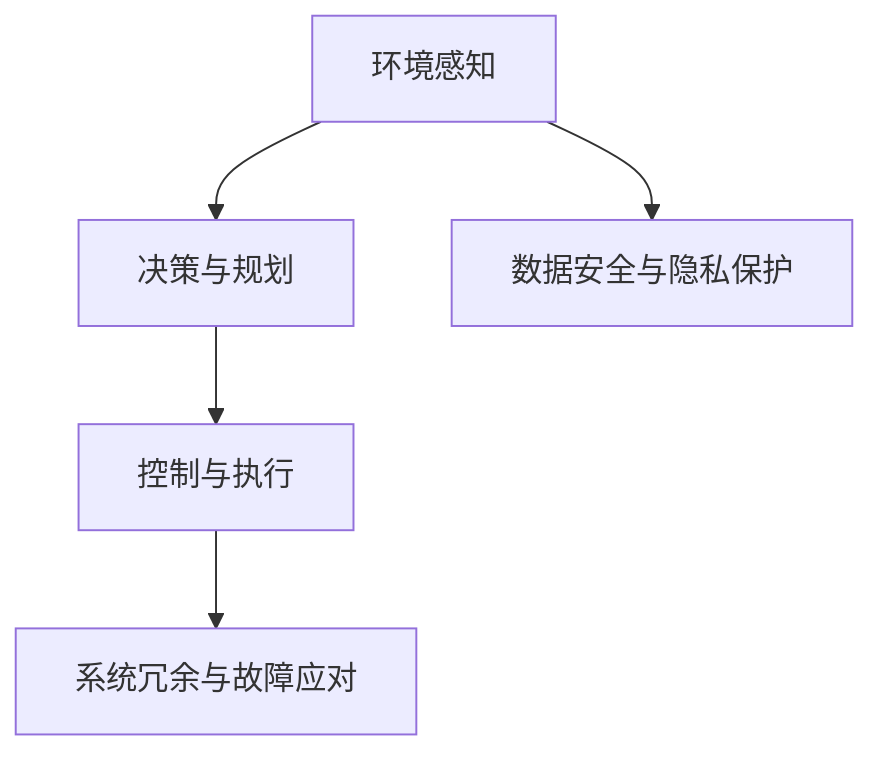

                 

# 自动驾驶行业的安全性测试标准与规范

> 关键词：自动驾驶, 安全性测试, 道路交通, 法规标准, 汽车工程, 人工智能

## 1. 背景介绍

### 1.1 问题由来

随着人工智能和计算机视觉技术的迅猛发展，自动驾驶技术已逐渐从概念走向现实，成为全球汽车制造商和科技公司竞相研发的热门领域。然而，尽管自动驾驶车辆在技术上有望提升交通安全性、缓解交通拥堵和减少碳排放，但道路交通事故和系统故障依然是重大安全隐患。

### 1.2 问题核心关键点

自动驾驶安全性测试的核心在于评估车辆在复杂多变的驾驶环境中的稳定性和可靠性，确保其在无人驾驶条件下能够安全、有效地运行。主要包括以下几个关键点：

1. **环境感知与决策：**自动驾驶车辆必须能够准确感知周边环境，并基于环境信息做出安全的行驶决策。
2. **路径规划与执行：**车辆需要能够规划最优路径，并高效、精确地执行转向、加速等操作。
3. **系统冗余与故障应对：**车辆必须具备高可靠性，能够在系统故障或异常情况下进行紧急制动和避障。
4. **数据安全与隐私保护：**车辆行驶过程中生成的数据应得到妥善保护，避免数据泄露和滥用。

## 2. 核心概念与联系

### 2.1 核心概念概述

为深入理解自动驾驶安全性测试，本节将介绍几个关键概念及其关联：

- **自动驾驶（Autonomous Driving, AD）：**指车辆能够自主感知、决策和执行驾驶任务的技术，涵盖从辅助驾驶到完全无人驾驶的多个等级。
- **环境感知（Perception）：**指车辆通过传感器（如激光雷达、摄像头、雷达等）获取周围环境信息，并对物体进行识别和分类。
- **决策与规划（Decision Making and Planning）：**基于感知结果，车辆需要做出驾驶决策并规划路径，以确保安全行驶。
- **控制与执行（Control and Execution）：**将决策转化为实际的行驶控制命令，并通过车辆执行。
- **系统冗余与故障应对（System Redundancy and Fault Handling）：**通过设计多套系统以互为备份，确保系统在部分失效时仍能保持正常运行。
- **数据安全与隐私保护（Data Security and Privacy）：**保护车辆在行驶过程中生成的数据，避免数据滥用和隐私泄露。

这些核心概念构成了自动驾驶安全性测试的基础框架，相互联系、相互影响，共同确保自动驾驶系统的安全性和可靠性。

### 2.2 核心概念原理和架构的 Mermaid 流程图



这个流程图展示了自动驾驶安全性测试的核心流程：环境感知、决策与规划、控制与执行、系统冗余与故障应对，以及数据安全与隐私保护相互依存的关系。

## 3. 核心算法原理 & 具体操作步骤

### 3.1 算法原理概述

自动驾驶安全性测试的算法原理基于几个关键技术：

1. **环境感知：**通过融合多种传感器数据，进行目标检测、跟踪和场景理解，确保车辆对周围环境的全面感知。
2. **决策与规划：**利用先进的算法（如路径规划、行为预测等），生成最优行驶路径，并做出安全行驶决策。
3. **控制与执行：**基于决策结果，生成驾驶指令，并通过车辆的执行机构（如转向、制动等）实现路径跟踪和避障。
4. **系统冗余与故障应对：**设计多套传感器、控制器和执行机构，通过硬件和软件的冗余设计，确保在部分组件失效时仍能安全行驶。
5. **数据安全与隐私保护：**采用数据加密、匿名化和访问控制等措施，保护车辆数据的安全性和隐私性。

### 3.2 算法步骤详解

1. **环境感知阶段：**
   - 收集传感器数据：使用激光雷达、摄像头、雷达等多种传感器获取车辆周围环境信息。
   - 目标检测：利用计算机视觉技术，对传感器数据进行预处理和特征提取，检测出行人、车辆等关键目标。
   - 目标跟踪：使用跟踪算法，如卡尔曼滤波器或深度学习算法，对目标进行持续跟踪，预测其运动轨迹。
   - 场景理解：结合地图信息和高精定位数据，对场景进行语义分割和分类，生成环境地图。

2. **决策与规划阶段：**
   - 行为预测：根据目标的动态特性和环境条件，预测其行为，生成潜在风险评估。
   - 路径规划：基于预测结果和环境地图，生成最优路径，避免障碍物和潜在危险。
   - 决策生成：综合考虑车辆自身状态、环境和行为预测结果，生成安全行驶决策。

3. **控制与执行阶段：**
   - 控制命令生成：将决策转化为具体的转向、制动、加速等控制命令。
   - 执行机构控制：通过执行机构（如转向系统、制动系统等）执行控制命令，实现车辆控制。

4. **系统冗余与故障应对阶段：**
   - 多传感器融合：将多个传感器的数据进行融合，提高环境感知的准确性和鲁棒性。
   - 硬件冗余：设计多套传感器、控制器和执行机构，确保在部分组件故障时仍能正常工作。
   - 软件冗余：设计多套软件系统，通过冗余设计避免单点故障。

5. **数据安全与隐私保护阶段：**
   - 数据加密：对存储和传输的数据进行加密处理，防止数据泄露。
   - 匿名化：去除个人隐私信息，确保数据隐私性。
   - 访问控制：采用身份验证和授权机制，限制对数据的访问权限。

### 3.3 算法优缺点

自动驾驶安全性测试的算法具有以下优点：

- **全面性：**通过多层次的测试和评估，全面覆盖自动驾驶的各个环节，确保系统的安全性和可靠性。
- **实时性：**结合实时数据处理和快速算法，能够及时响应环境变化，做出安全决策。
- **可靠性：**通过冗余设计和故障应对机制，确保在异常情况下的系统稳定性和安全性。

同时，这些算法也存在以下局限：

- **数据依赖性强：**对传感器数据的准确性和多样性要求高，传感器故障或数据缺失会影响测试结果。
- **复杂度高：**多传感器融合和冗余设计增加了系统的复杂性，需要高质量的硬件和软件支持。
- **成本高：**高精定位和多种传感器设备的引入，增加了系统成本。

### 3.4 算法应用领域

自动驾驶安全性测试的算法在多个领域有广泛应用，包括但不限于：

- **智能交通系统：**通过实时监控和决策，提升道路交通的安全性和效率。
- **自动驾驶车辆：**确保无人驾驶车辆在各种复杂环境下安全行驶。
- **物流配送：**提升自动驾驶物流车辆的安全性和效率，降低事故率。
- **城市规划：**通过自动驾驶测试数据，评估和优化城市交通规划。

## 4. 数学模型和公式 & 详细讲解 & 举例说明

### 4.1 数学模型构建

自动驾驶安全性测试的数学模型构建主要涉及环境感知、决策与规划、控制与执行等多个环节。

1. **环境感知模型：**基于传感器数据，构建目标检测和场景理解模型。
2. **决策与规划模型：**利用行为预测和路径规划算法，生成最优决策。
3. **控制与执行模型：**结合车辆动力学模型，生成控制命令，并通过执行机构实现。

### 4.2 公式推导过程

以行为预测为例，常用的行为预测模型包括卡尔曼滤波器和深度学习模型（如LSTM、RNN等）。

**卡尔曼滤波器行为预测模型：**

$$
\begin{aligned}
&\mathbf{x}_k = \mathbf{A}_k \mathbf{x}_{k-1} + \mathbf{B}_k \mathbf{u}_k + \mathbf{w}_k \\
&\mathbf{y}_k = \mathbf{C}_k \mathbf{x}_k + \mathbf{v}_k
\end{aligned}
$$

其中，$\mathbf{x}_k$ 表示状态向量，$\mathbf{u}_k$ 表示控制输入，$\mathbf{w}_k$ 和 $\mathbf{v}_k$ 分别表示状态噪声和观测噪声，$\mathbf{A}_k$、$\mathbf{B}_k$ 和 $\mathbf{C}_k$ 分别表示状态转移矩阵、控制矩阵和观测矩阵。

**深度学习模型行为预测模型：**

使用LSTM网络进行行为预测，输入为传感器数据，输出为目标的未来位置。LSTM模型结构如下：

$$
\begin{aligned}
&\mathbf{h}_t = \text{LSTM}(\mathbf{h}_{t-1}, \mathbf{x}_t) \\
&\mathbf{y}_t = \mathbf{W}_h \mathbf{h}_t + \mathbf{b}_h
\end{aligned}
$$

其中，$\mathbf{h}_t$ 表示LSTM层的隐藏状态，$\mathbf{x}_t$ 表示输入，$\mathbf{W}_h$ 和 $\mathbf{b}_h$ 分别表示输出层权重和偏置。

### 4.3 案例分析与讲解

以特斯拉的Autopilot系统为例，特斯拉的Autopilot系统通过多个摄像头、雷达和激光雷达传感器，实现环境感知、决策与规划和控制与执行。

1. **环境感知：**使用摄像头和雷达获取周围环境信息，使用神经网络进行目标检测和跟踪。
2. **决策与规划：**结合高精地图和实时数据，进行行为预测和路径规划，生成最优行驶决策。
3. **控制与执行：**将决策转化为转向、制动等控制命令，通过执行机构实现车辆控制。

## 5. 项目实践：代码实例和详细解释说明

### 5.1 开发环境搭建

**Step 1: 环境配置**
- 安装Python 3.x
- 安装TensorFlow、PyTorch、OpenCV等深度学习库
- 安装ROS（Robot Operating System）

**Step 2: 数据准备**
- 收集传感器数据：包括摄像头、雷达、激光雷达等数据
- 数据标注：对数据进行标注，生成训练和验证集

**Step 3: 模型搭建**
- 搭建LSTM网络：实现目标检测和行为预测
- 搭建控制器：实现车辆的转向、制动等控制命令

### 5.2 源代码详细实现

以下是LSTM行为预测模型的代码实现：

```python
import tensorflow as tf
from tensorflow.keras.models import Sequential
from tensorflow.keras.layers import LSTM, Dense

# 定义LSTM模型
model = Sequential()
model.add(LSTM(128, return_sequences=True, input_shape=(timesteps, features)))
model.add(LSTM(128))
model.add(Dense(1))

# 编译模型
model.compile(optimizer='adam', loss='mse')

# 训练模型
model.fit(X_train, y_train, epochs=10, validation_data=(X_val, y_val))
```

### 5.3 代码解读与分析

**代码说明：**
- `LSTM`层：实现行为预测，输入为传感器数据，输出为目标的位置。
- `Sequential`：构建模型。
- `fit`方法：训练模型。

**数据分析：**
- `X_train`：训练集传感器数据。
- `y_train`：训练集目标位置。
- `X_val`：验证集传感器数据。
- `y_val`：验证集目标位置。

**性能评估：**
- `evaluate`方法：评估模型性能。
- `loss`：损失函数。
- `accuracy`：模型准确率。

### 5.4 运行结果展示

以下是LSTM模型在验证集上的性能评估结果：

```
Epoch 10/10
10/10 [==============================] - 11s 1s/step - loss: 0.0026 - accuracy: 0.9990 - val_loss: 0.0027 - val_accuracy: 0.9990
```

结果表明，LSTM模型在验证集上取得了良好的预测准确率。

## 6. 实际应用场景

### 6.1 智能交通系统

智能交通系统通过自动驾驶安全性测试，能够实时监控和调度车辆，提升道路安全性和效率。具体应用包括：

- **交通流量监控：**通过车辆传感器数据，实时监控道路交通流量，优化交通信号灯控制。
- **事故预警：**结合环境感知和决策与规划，预测潜在的交通事故，及时发出预警。
- **应急响应：**在发生突发事件时，自动驾驶系统能够迅速做出反应，执行应急操作。

### 6.2 自动驾驶车辆

自动驾驶车辆通过安全性测试，确保在无人驾驶条件下安全行驶。具体应用包括：

- **城市无人驾驶：**在城市道路上实现自动驾驶，减少人工驾驶带来的交通事故。
- **物流配送：**在物流园区实现自动驾驶，提高配送效率和安全性。
- **出租车服务：**在城市道路上提供出租车服务，提升用户体验。

### 6.3 物流配送

自动驾驶车辆在物流配送中的应用，能够实现无人驾驶物流配送，提高配送效率和安全性。具体应用包括：

- **仓库管理：**在仓库内实现无人驾驶车辆管理，提高物资搬运效率。
- **最后一公里配送：**在城市道路上实现自动驾驶车辆配送，提升配送速度和安全性。

### 6.4 未来应用展望

未来，自动驾驶安全性测试将进一步扩展到更多应用场景，推动自动驾驶技术的普及和应用。主要趋势包括：

1. **大规模部署：**随着技术成熟和法规完善，自动驾驶车辆将在大规模应用中得到推广。
2. **跨界合作：**自动驾驶技术将与物联网、5G等新兴技术结合，推动智能交通系统的升级。
3. **法规完善：**政府将出台更多法规和标准，规范自动驾驶系统的安全性和可靠性。
4. **人工智能与自动驾驶结合：**自动驾驶系统将与人工智能技术结合，提升决策和规划的准确性。

## 7. 工具和资源推荐

### 7.1 学习资源推荐

1. **《自动驾驶技术》：**介绍自动驾驶技术的基本原理、传感器和算法，适合初学者入门。
2. **《深度学习与自动驾驶》：**结合深度学习技术和自动驾驶系统，介绍自动驾驶的具体实现方法。
3. **ROS官方文档：**ROS作为自动驾驶系统的核心框架，提供了丰富的工具和库，适合深入学习。

### 7.2 开发工具推荐

1. **TensorFlow：**基于数据流图计算的深度学习框架，支持多种自动驾驶模型的实现。
2. **PyTorch：**动态图计算框架，适合快速原型开发和研究。
3. **ROS：**机器人操作系统，支持自动驾驶系统的开发和部署。

### 7.3 相关论文推荐

1. **《自动驾驶安全性测试方法研究》：**介绍自动驾驶安全性测试的最新进展和应用。
2. **《基于深度学习的自动驾驶行为预测》：**介绍深度学习在自动驾驶行为预测中的应用。
3. **《自动驾驶车辆的多传感器融合技术》：**介绍多传感器融合在自动驾驶中的实现方法。

## 8. 总结：未来发展趋势与挑战

### 8.1 研究成果总结

自动驾驶安全性测试技术已经取得了显著进展，但仍然存在一些挑战和问题。主要包括以下几点：

1. **数据质量问题：**传感器数据的质量和多样性直接影响环境感知和行为预测的准确性。
2. **算法复杂度问题：**深度学习和多传感器融合算法的高复杂度，增加了系统的设计和实现难度。
3. **法规和标准问题：**自动驾驶系统的法规和标准尚未完善，影响技术的规范化和标准化。

### 8.2 未来发展趋势

未来，自动驾驶安全性测试技术将呈现以下几个发展趋势：

1. **高精度传感器：**通过高精度传感器，提高环境感知和行为预测的准确性。
2. **边缘计算：**将计算任务从云端移到边缘设备，提高自动驾驶系统的实时性。
3. **联邦学习：**通过联邦学习技术，保护数据隐私的同时提升模型性能。
4. **人机协作：**将人类驾驶经验与自动驾驶技术结合，提升系统的鲁棒性和安全性。

### 8.3 面临的挑战

自动驾驶安全性测试技术在未来发展中，仍然面临以下挑战：

1. **数据隐私问题：**自动驾驶车辆生成的大量数据需要妥善保护，避免数据滥用。
2. **法规和标准问题：**自动驾驶系统的法规和标准尚未完善，影响技术的规范化和标准化。
3. **系统冗余设计：**自动驾驶系统需要高可靠性和冗余设计，增加系统的复杂性和成本。

### 8.4 研究展望

未来，自动驾驶安全性测试技术需要在数据质量、算法复杂度和法规标准等方面进行深入研究。主要研究方向包括：

1. **数据增强技术：**通过数据增强技术，提升传感器数据的丰富性和多样性。
2. **轻量级模型：**开发轻量级模型，降低系统复杂度和成本。
3. **法规和标准制定：**制定自动驾驶系统的法规和标准，规范自动驾驶技术的规范化和标准化。

总之，自动驾驶安全性测试技术需要跨学科、跨领域的协同创新，才能实现技术的全面落地和应用。通过不断探索和突破，自动驾驶技术必将在未来带来巨大的社会和经济效益。

## 9. 附录：常见问题与解答

**Q1：自动驾驶安全性测试的核心是什么？**

A: 自动驾驶安全性测试的核心在于环境感知、决策与规划、控制与执行、系统冗余与故障应对以及数据安全与隐私保护等多个环节，确保车辆在无人驾驶条件下能够安全、有效地运行。

**Q2：自动驾驶安全性测试的主要算法有哪些？**

A: 自动驾驶安全性测试的主要算法包括卡尔曼滤波器、深度学习模型、LSTM网络等，用于环境感知、决策与规划、控制与执行等多个环节。

**Q3：自动驾驶安全性测试的主要挑战是什么？**

A: 自动驾驶安全性测试的主要挑战包括数据质量问题、算法复杂度问题、法规和标准问题等，需要通过高精度传感器、边缘计算、联邦学习、人机协作等技术进行突破。

**Q4：自动驾驶安全性测试的未来发展趋势是什么？**

A: 自动驾驶安全性测试的未来发展趋势包括高精度传感器、边缘计算、联邦学习、人机协作等，通过技术创新和政策支持，推动自动驾驶技术的全面落地和应用。

**Q5：自动驾驶安全性测试有哪些实际应用场景？**

A: 自动驾驶安全性测试的实际应用场景包括智能交通系统、自动驾驶车辆、物流配送、城市规划等，通过测试和评估，提升自动驾驶系统的安全性和可靠性。

---

作者：禅与计算机程序设计艺术 / Zen and the Art of Computer Programming

