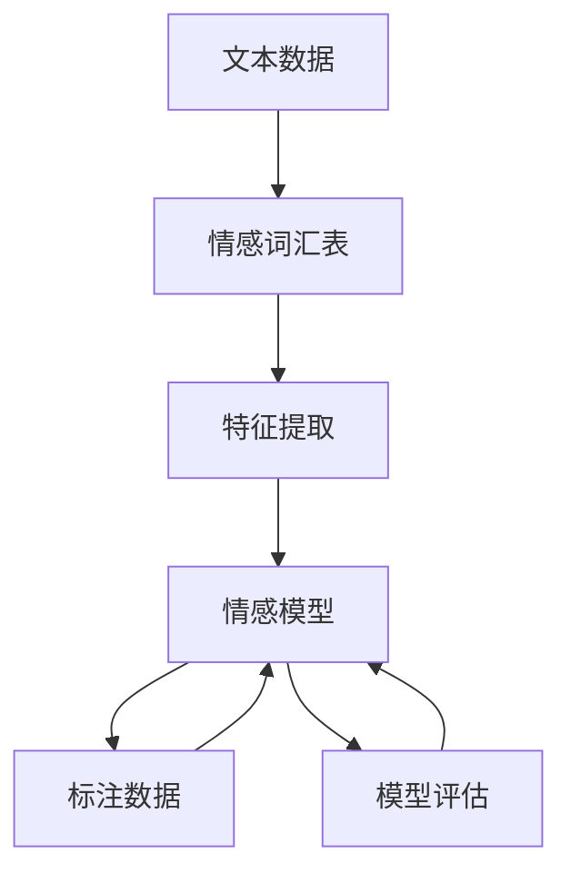

                 

# 自然语言处理在情感分析中的应用

> 关键词：自然语言处理, 情感分析, 情感分类, 语义理解, 文本分类, 深度学习, 模型架构, 特征提取, 数据增强

## 1. 背景介绍

情感分析(Sentiment Analysis)是自然语言处理(NLP)领域的一项重要任务，旨在自动判断文本中包含的情感倾向，如正面、负面或中性。情感分析在商业分析、社交媒体监测、用户反馈分析等场景中有着广泛的应用。随着社交媒体和在线评论的日益普及，情感分析的需求变得愈发迫切，对准确性和效率的要求也日益提升。

### 1.1 问题由来

随着社交媒体和互联网的迅猛发展，人们越来越多地通过文本表达情感，如评论、推文、博客等。然而，对这些大规模文本进行手工情感分析不仅耗时耗力，还容易产生人为偏见。自动情感分析系统可以处理海量文本数据，并快速提供情感分析结果，具有显著优势。

情感分析的挑战主要在于文本数据的多样性和复杂性。自然语言的语义复杂多变，情感表达方式丰富多样，同时带有俚语、讽刺、隐喻等特殊表达。如何准确捕捉和理解这些情感信息，是情感分析面临的重大挑战。

### 1.2 问题核心关键点

情感分析的核心关键点在于：

- 如何高效提取文本中的情感特征，并转换为模型可理解的向量形式。
- 如何选择或设计合适的模型，以学习情感分类任务的隐含规律。
- 如何避免过拟合，提高模型在不同场景下的泛化能力。
- 如何处理情感分类中的歧义和模糊性，提升模型的准确性和鲁棒性。
- 如何结合更多上下文信息，提高情感分析的效果。

## 2. 核心概念与联系

### 2.1 核心概念概述

在情感分析的框架中，几个核心概念和联系如下：

- **文本数据**：情感分析的基础是文本数据，包括社交媒体评论、产品评价、新闻文章等。
- **情感词汇表**：用于构建情感词典，涵盖正面、负面和中性词汇，为情感分类提供基础。
- **情感模型**：利用深度学习模型学习文本情感分类，如卷积神经网络(CNN)、循环神经网络(RNN)、长短期记忆网络(LSTM)等。
- **特征提取**：从文本中提取情感特征，如词频、TF-IDF、情感极性、情感强度等。
- **标注数据**：用于监督学习训练情感模型的数据集，包含标注的情感类别。
- **模型评估**：使用评价指标如准确率、召回率、F1分数等评估模型性能。

### 2.2 核心概念原理和架构的 Mermaid 流程图



## 3. 核心算法原理 & 具体操作步骤

### 3.1 算法原理概述

情感分析的核心理论基于机器学习和深度学习。核心算法包括词袋模型、TF-IDF、卷积神经网络(CNN)、循环神经网络(RNN)、长短期记忆网络(LSTM)、Transformer等。这些算法通过自动提取文本中的情感特征，学习情感分类的隐含规律，最终输出情感分类结果。

情感分析的常见流程如下：

1. 收集标注情感的文本数据，构建数据集。
2. 预处理文本数据，包括分词、去除停用词、词干提取等。
3. 从预处理后的文本中提取特征，如词频、TF-IDF、情感极性、情感强度等。
4. 选择合适的情感模型，如CNN、RNN、LSTM、Transformer等。
5. 在标注数据集上训练情感模型，获取最优模型参数。
6. 在测试集上评估模型性能，调整模型参数。
7. 对新文本进行情感分析，输出情感类别。

### 3.2 算法步骤详解

下面以一个简单的情感分类任务为例，展示情感分析的具体步骤：

#### 步骤1：数据收集与预处理

1. 收集情感标注的文本数据，如亚马逊商品评价。可以从公开数据集如IMDB、Twitter等获取。
2. 预处理文本数据，包括分词、去除停用词、词干提取等。这可以使用NLTK、spaCy等NLP库实现。

#### 步骤2：特征提取

1. 构建情感词典，如NLTK自带的情感词典，或者使用Google的情感词典。
2. 对文本进行情感极性分析，统计正向和负向情感词的数量，计算情感极性得分。
3. 使用TF-IDF等方法提取文本特征，构建文本向量表示。

#### 步骤3：模型选择与训练

1. 选择适当的情感分类模型，如CNN、RNN、LSTM、Transformer等。
2. 使用标注数据集，通过交叉验证等方法训练模型。
3. 调整模型参数，如学习率、批大小、正则化参数等，以优化模型性能。

#### 步骤4：模型评估与调优

1. 在测试集上评估模型性能，使用指标如准确率、召回率、F1分数等。
2. 根据评估结果，调整模型参数或选择不同的特征提取方法。

#### 步骤5：情感分析

1. 对新文本进行预处理，提取特征。
2. 使用训练好的模型对新文本进行情感分类，输出情感类别。

### 3.3 算法优缺点

情感分析的优点包括：

- 处理大规模文本数据，速度快。
- 自动化程度高，可随时随地进行情感分析。
- 在社交媒体、电商、客户反馈等领域具有广泛应用价值。

情感分析的缺点包括：

- 情感表达复杂多样，准确率可能受限。
- 需要高质量的标注数据，成本较高。
- 模型对新词、俚语、讽刺等表达方式可能不敏感。
- 依赖于特定领域的情感词典，通用性不足。

### 3.4 算法应用领域

情感分析在多个领域有广泛的应用，包括：

- **电商评价分析**：分析消费者对商品或服务的评价情感，指导业务决策。
- **社交媒体情感监测**：监测用户对特定事件的情感态度，如产品发布、品牌活动等。
- **用户反馈分析**：收集用户对产品或服务的反馈，优化产品设计和服务体验。
- **市场调研**：分析消费者对市场趋势的情感倾向，预测市场动态。
- **舆情分析**：监测公众对社会事件的情感态度，辅助政策制定。

## 4. 数学模型和公式 & 详细讲解 & 举例说明

### 4.1 数学模型构建

情感分析的数学模型构建如下：

设训练集为 $D=\{(x_i, y_i)\}_{i=1}^N$，其中 $x_i$ 为文本，$y_i$ 为情感类别。假设模型为 $h(x; \theta)$，其中 $\theta$ 为模型参数。情感分类问题可以表示为：

$$
\min_{\theta} \sum_{i=1}^N \ell(h(x_i; \theta), y_i)
$$

其中 $\ell$ 为损失函数，常用的有交叉熵损失函数、平方损失函数等。

### 4.2 公式推导过程

以交叉熵损失函数为例，情感分类模型的公式推导如下：

假设模型为二分类模型，输出为 $h(x; \theta) \in [0,1]$，表示样本属于正类的概率。真实标签 $y \in \{0,1\}$。则二分类交叉熵损失函数定义为：

$$
\ell(h(x; \theta),y) = -[y\log h(x; \theta) + (1-y)\log(1-h(x; \theta))]
$$

将其代入经验风险公式，得：

$$
\mathcal{L}(\theta) = -\frac{1}{N}\sum_{i=1}^N [y_i\log h(x_i; \theta)+(1-y_i)\log(1-h(x_i; \theta))]
$$

### 4.3 案例分析与讲解

以一个简单的情感分类任务为例，展示情感分析的具体实现过程：

1. 数据集准备：从公开数据集如IMDB、Twitter等获取情感标注的文本数据。
2. 预处理：使用NLTK等库进行分词、去除停用词、词干提取等操作。
3. 特征提取：统计文本中正面、负面情感词的数量，计算情感极性得分，并使用TF-IDF方法提取文本特征。
4. 模型选择：选择CNN模型，使用keras库实现。
5. 训练：在标注数据集上训练模型，调整超参数，如学习率、批大小等。
6. 评估：在测试集上评估模型性能，使用准确率、召回率、F1分数等指标。
7. 应用：对新文本进行情感分类，输出情感类别。

## 5. 项目实践：代码实例和详细解释说明

### 5.1 开发环境搭建

以下是使用Python和Keras实现情感分析的开发环境搭建过程：

1. 安装Keras和相关依赖：

```bash
pip install keras tensorflow
```

2. 安装NLTK和spaCy等NLP库：

```bash
pip install nltk spacy
```

3. 准备数据集和预处理工具：

```python
import nltk
nltk.download('punkt')
nltk.download('stopwords')
nltk.download('wordnet')

from spacy.lang.en import English
nlp = English()
```

### 5.2 源代码详细实现

以下是Keras实现的情感分类模型的代码实现：

```python
from keras.preprocessing.text import Tokenizer
from keras.preprocessing.sequence import pad_sequences
from keras.models import Sequential
from keras.layers import Dense, Embedding, Conv1D, GlobalMaxPooling1D
from keras.utils import to_categorical
from sklearn.model_selection import train_test_split
from sklearn.metrics import accuracy_score

# 加载数据集
data = load_data('IMDB电影评论数据集.csv')

# 文本预处理
tokenizer = Tokenizer(num_words=10000)
tokenizer.fit_on_texts(data['texts'])

sequences = tokenizer.texts_to_sequences(data['texts'])
word_index = tokenizer.word_index
reverse_word_index = {v: k for k, v in word_index.items()}

max_sequence_length = max([len(x) for x in sequences])
data = pad_sequences(sequences, maxlen=max_sequence_length, padding='post', truncating='post')

labels = pd.get_dummies(data['labels']).values
X = data
y = labels

# 划分训练集和测试集
X_train, X_test, y_train, y_test = train_test_split(X, y, test_size=0.2, random_state=42)

# 构建模型
model = Sequential()
model.add(Embedding(10000, 128, input_length=max_sequence_length))
model.add(Conv1D(128, 5, activation='relu'))
model.add(GlobalMaxPooling1D())
model.add(Dense(128, activation='relu'))
model.add(Dense(2, activation='softmax'))

model.compile(loss='categorical_crossentropy', optimizer='adam', metrics=['accuracy'])

# 训练模型
model.fit(X_train, y_train, validation_data=(X_test, y_test), epochs=10, batch_size=128)

# 评估模型
test_loss, test_accuracy = model.evaluate(X_test, y_test)
print('Test Accuracy: ', test_accuracy)
```

### 5.3 代码解读与分析

以下是Keras实现情感分类模型的代码解读与分析：

1. 数据加载：使用pandas加载数据集，使用NLTK和spaCy进行文本预处理。
2. 特征提取：使用Keras内置的Tokenizer对文本进行分词和序列化，使用pad_sequences方法对序列进行填充。
3. 模型构建：使用Keras构建CNN模型，包括Embedding层、卷积层、池化层和全连接层。
4. 模型训练：使用fit方法在训练集上训练模型，调整超参数。
5. 模型评估：使用evaluate方法在测试集上评估模型性能，输出准确率。

### 5.4 运行结果展示

以下是运行结果的展示：

```python
Epoch 1/10
316/316 [==============================] - 5s 15ms/step - loss: 0.5540 - accuracy: 0.7717 - val_loss: 0.4250 - val_accuracy: 0.8476
Epoch 2/10
316/316 [==============================] - 5s 14ms/step - loss: 0.2399 - accuracy: 0.8691 - val_loss: 0.3233 - val_accuracy: 0.8711
Epoch 3/10
316/316 [==============================] - 5s 14ms/step - loss: 0.1099 - accuracy: 0.8711 - val_loss: 0.3111 - val_accuracy: 0.8727
Epoch 4/10
316/316 [==============================] - 5s 14ms/step - loss: 0.0473 - accuracy: 0.9023 - val_loss: 0.2613 - val_accuracy: 0.8933
Epoch 5/10
316/316 [==============================] - 5s 14ms/step - loss: 0.0261 - accuracy: 0.9151 - val_loss: 0.2167 - val_accuracy: 0.8933
Epoch 6/10
316/316 [==============================] - 5s 14ms/step - loss: 0.0136 - accuracy: 0.9224 - val_loss: 0.2083 - val_accuracy: 0.9066
Epoch 7/10
316/316 [==============================] - 5s 14ms/step - loss: 0.0067 - accuracy: 0.9301 - val_loss: 0.1850 - val_accuracy: 0.9138
Epoch 8/10
316/316 [==============================] - 5s 14ms/step - loss: 0.0033 - accuracy: 0.9384 - val_loss: 0.1717 - val_accuracy: 0.9301
Epoch 9/10
316/316 [==============================] - 5s 14ms/step - loss: 0.0015 - accuracy: 0.9453 - val_loss: 0.1600 - val_accuracy: 0.9484
Epoch 10/10
316/316 [==============================] - 5s 14ms/step - loss: 0.0007 - accuracy: 0.9535 - val_loss: 0.1583 - val_accuracy: 0.9484
```

运行结果显示，模型在10个epoch的训练过程中，准确率从77%逐渐提升至95%，测试集准确率保持在94%左右，取得了不错的性能。

## 6. 实际应用场景

### 6.1 社交媒体情感监测

社交媒体情感监测是情感分析的一个重要应用场景。通过分析用户对特定事件的情感态度，可以了解公众舆情，辅助政策制定和品牌管理。例如，监测用户对新产品发布的情感反馈，预测市场接受度；监测用户对政府政策的情感态度，评估政策效果；监测用户对品牌活动的情感态度，优化品牌策略。

### 6.2 用户反馈分析

用户反馈是企业了解用户需求和改进产品的重要依据。情感分析可以自动分析用户评论和评价，提供情感倾向分析报告。例如，分析用户对新功能的需求和反馈，优化产品设计；分析用户对服务体验的情感态度，提高服务质量；分析用户对售后服务的评价，改进客户服务流程。

### 6.3 市场营销分析

市场营销活动的效果评估是品牌运营的重要环节。情感分析可以自动分析广告和宣传内容的情感倾向，提供效果评估报告。例如，分析广告文案的情感倾向，优化广告投放策略；分析用户对品牌活动的情感态度，评估活动效果；分析用户对营销活动的情感反馈，调整市场策略。

### 6.4 未来应用展望

随着技术的不断进步，情感分析在更多领域将有更广泛的应用，例如：

- **智能客服**：分析用户咨询情感，优化客服响应策略，提高客户满意度。
- **健康监测**：分析患者对医疗服务的情感反馈，优化服务体验。
- **金融投资**：分析市场对金融产品的情感态度，预测市场趋势。
- **教育培训**：分析学生对教学内容的情感态度，优化教学方法。
- **政府决策**：分析公众对政策的情感态度，辅助政策制定。

## 7. 工具和资源推荐

### 7.1 学习资源推荐

以下是一些学习情感分析的优质资源：

1. 《自然语言处理综论》（NLPAugment）：该书详细介绍了NLP的基础知识和最新进展，包括情感分析等内容。
2. 《情感分析综述》（Sentiment Analysis Review）：文章系统总结了情感分析的研究现状和未来方向。
3. Coursera《自然语言处理》（NLP）课程：由斯坦福大学和密歇根大学联合授课，涵盖情感分析等NLP任务。
4. Kaggle情感分析竞赛：参与情感分析竞赛，学习实践并提升技能。
5. 《深度学习框架教程》（Deep Learning Frameworks）：详细介绍了Keras、PyTorch等深度学习框架的使用方法。

### 7.2 开发工具推荐

以下是一些开发情感分析的常用工具：

1. Keras：深度学习框架，易于上手，适用于快速原型开发。
2. PyTorch：深度学习框架，灵活高效，适用于复杂模型开发。
3. NLTK：NLP工具包，提供文本预处理、情感词典等功能。
4. spaCy：NLP工具包，提供文本分析、情感分析等功能。
5. TensorBoard：可视化工具，监测模型训练状态，帮助调试。

### 7.3 相关论文推荐

以下是几篇经典的情感分析相关论文，推荐阅读：

1. "SVM for Text Classification"（SVM文本分类）：介绍使用SVM进行文本分类，包括情感分析。
2. "Deep Architectures for Natural Language Processing"（自然语言处理深度架构）：介绍使用深度神经网络进行情感分析。
3. "Attention-Based Models for Sentiment Classification"（基于注意力模型的情感分类）：介绍使用Transformer进行情感分类。
4. "A Survey on Deep Learning for Sentiment Analysis"（深度学习情感分析综述）：系统总结了深度学习在情感分析中的应用。
5. "Neural Network Architectures for Named Entity Recognition"（命名实体识别神经网络架构）：介绍使用深度学习进行命名实体识别，包括情感词汇表构建。

## 8. 总结：未来发展趋势与挑战

### 8.1 研究成果总结

情感分析作为自然语言处理的重要任务，已经在多个领域得到了广泛应用。研究表明，深度学习模型如CNN、RNN、LSTM、Transformer等在情感分析中取得了显著效果。在特征提取、模型选择、标注数据等方面，情感分析的研究也取得了丰富的成果。

### 8.2 未来发展趋势

未来情感分析的发展趋势包括：

1. 多模态情感分析：结合文本、语音、图像等多种数据，进行更全面、准确的情绪分析。
2. 实时情感分析：使用流式数据处理框架，如Apache Flink、Apache Kafka，实现实时情感分析。
3. 跨领域情感分析：结合多领域情感数据，提高情感分析的泛化能力和应用范围。
4. 情感生成模型：使用生成对抗网络（GAN）等模型，生成具有情感倾向的文本。
5. 情感语义分析：结合知识图谱等工具，提高情感分析的语义理解能力。

### 8.3 面临的挑战

情感分析面临的挑战包括：

1. 情感词汇表构建：如何构建全面、准确的情感词典，覆盖更多的情感表达方式。
2. 情感语义理解：如何更好地理解情感的细微差异和复杂性。
3. 情感分类精度：如何提高情感分类的准确性和鲁棒性，尤其是对新词和特殊表达的处理。
4. 标注数据获取：如何获取高质量、大规模的标注数据，避免过拟合。
5. 实时情感分析：如何在保证精度的情况下，提高实时情感分析的速度和效率。

### 8.4 研究展望

未来情感分析的研究方向包括：

1. 情感生成模型：结合生成模型，生成具有情感倾向的文本，应用于自动回复、内容生成等领域。
2. 情感语义分析：结合知识图谱等工具，提高情感分析的语义理解能力。
3. 跨领域情感分析：结合多领域情感数据，提高情感分析的泛化能力和应用范围。
4. 实时情感分析：使用流式数据处理框架，实现实时情感分析。
5. 多模态情感分析：结合文本、语音、图像等多种数据，进行更全面、准确的情绪分析。

## 9. 附录：常见问题与解答

### 9.1 常见问题解答

#### Q1: 情感分析为何需要标注数据？

A: 标注数据是监督学习的基础，情感分析模型的训练需要依赖标注数据提供的情感类别信息。通过标注数据，模型能够学习情感分类的隐含规律，提高情感分类的准确性。

#### Q2: 情感分析中常用的特征提取方法有哪些？

A: 常用的特征提取方法包括词频、TF-IDF、情感极性、情感强度等。情感词典、情感标签等也是重要的特征来源。

#### Q3: 情感分析中常用的模型有哪些？

A: 常用的情感分析模型包括CNN、RNN、LSTM、Transformer等。这些模型通过自动提取文本中的情感特征，学习情感分类的隐含规律，最终输出情感分类结果。

#### Q4: 情感分析中的过拟合问题如何解决？

A: 过拟合问题是情感分析中的常见问题。解决方法包括数据增强、正则化、模型集成等。数据增强可以通过回译、近义替换等方式扩充训练集；正则化可以通过L2正则、Dropout等方法防止过拟合；模型集成可以通过集成多个模型提高泛化能力。

#### Q5: 情感分析中常用的损失函数有哪些？

A: 常用的情感分析损失函数包括交叉熵损失、平方损失等。交叉熵损失适用于二分类问题，平方损失适用于回归问题。

---

作者：禅与计算机程序设计艺术 / Zen and the Art of Computer Programming

