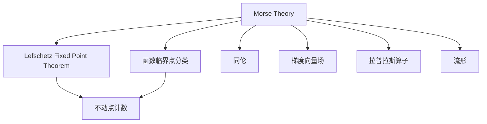

                 

# 莫尔斯理论与Lefschetz定理

## 1. 背景介绍

### 1.1 问题由来

莫尔斯理论（Morse Theory）和Lefschetz定理（Lefschetz Fixed Point Theorem）是拓扑学中的重要工具，广泛应用于连续函数的临界点分析、同伦等价性判断、微分方程研究等多个领域。它们通过对函数的不动点（即零点）进行分类，为拓扑学问题的研究提供了一种强大的方法。在计算机科学中，莫尔斯理论与Lefschetz定理的应用也不容小觑，尤其是在算法设计、程序分析、图形处理等方面。

### 1.2 问题核心关键点

莫尔斯理论的核心是函数的不动点分类，而Lefschetz定理则提供了对函数不动点数量的计数规则。两者结合起来，可以系统地分析函数的临界点情况，并应用于拓扑学问题的求解。

本文将详细讨论莫尔斯理论与Lefschetz定理的基本原理和应用方法，同时通过具体的数学模型和案例分析，深入解析其在拓扑学、计算机科学中的实际应用场景。

## 2. 核心概念与联系

### 2.1 核心概念概述

- **莫尔斯理论（Morse Theory）**：由数学家莫尔斯在1926年提出，是一种利用连续函数的临界点来研究拓扑学性质的理论。莫尔斯理论主要将函数的临界点分为可去除点（Removable Point）、不可去除点（Non-Removable Point）和中心点（Cusp Point），并利用这些分类来研究函数的拓扑性质。

- **Lefschetz定理（Lefschetz Fixed Point Theorem）**：由数学家Lefschetz在1924年提出，指出在凸流形上，每个同伦于恒同映射的连续映射，其不动点数量是固定的。Lefschetz定理提供了对连续函数不动点数量的计数规则，是拓扑学中的一个重要工具。

- **同伦（Homotopy）**：在同伦变换下保持拓扑性质不变的映射，是拓扑学中的基本概念，用于描述拓扑空间之间的等价关系。

- **梯度向量场（Gradient Vector Field）**：在向量场的帮助下，可以对函数的临界点进行分类和分析。

- **拉普拉斯算子（Laplace Operator）**：拉普拉斯算子是分析几何中的基本算子，用于描述函数的曲率和梯度的变化。

- **流形（Manifold）**：在拓扑学中，流形是一种局部平坦且具有某种连续性性质的空间。

这些核心概念之间的逻辑关系可以通过以下Mermaid流程图来展示：



这个流程图展示了莫尔斯理论和Lefschetz定理的核心概念及其之间的关系：

1. 莫尔斯理论将函数的临界点分类，通过不同点的性质分析函数拓扑性质。
2. Lefschetz定理通过不动点计数，提供了对函数不动点数量的计数规则。
3. 同伦用于描述拓扑空间之间的等价关系，是研究函数不动点的基础。
4. 梯度向量场和拉普拉斯算子是分析函数临界点的重要工具。
5. 流形是拓扑学研究的基本空间对象。

这些概念共同构成了莫尔斯理论与Lefschetz定理的理论框架，使得我们可以系统地分析和求解拓扑学问题。

## 3. 核心算法原理 & 具体操作步骤

### 3.1 算法原理概述

莫尔斯理论与Lefschetz定理的数学原理可以简单概括如下：

- **莫尔斯理论**：通过函数的不动点分类，将函数的不动点分为可去除点、不可去除点和中心点，并利用这些分类对函数的拓扑性质进行分析。具体而言，可去除点可以通过移动得到去除，不可去除点构成函数的拓扑边界，中心点则用于描述函数的局部形态。

- **Lefschetz定理**：提供了一种计算函数不动点数量的规则，即对于每个同伦于恒同映射的连续映射，其不动点数量是固定的。这一规则利用了同伦等价性，从函数的不动点数量得到拓扑信息。

莫尔斯理论与Lefschetz定理的应用可以分为以下几个步骤：

1. 选择合适的函数，并确定其定义域。
2. 分析函数的梯度向量场，确定临界点的性质。
3. 利用莫尔斯理论将临界点分为可去除点、不可去除点和中心点。
4. 应用Lefschetz定理计算函数的不动点数量。
5. 结合函数的不动点数量和临界点性质，研究函数的拓扑性质。

### 3.2 算法步骤详解

下面以二维空间中的函数$f(x)=x^2+y^2$为例，详细讲解莫尔斯理论与Lefschetz定理的应用步骤。

1. **选择函数**：
   - 定义函数$f(x)=x^2+y^2$，其定义域为二维平面$\mathbb{R}^2$。

2. **确定梯度向量场**：
   - 计算函数的梯度向量，$\nabla f = (2x, 2y)$。
   - 确定函数的梯度向量场方向，即函数梯度为零的点，也就是函数的不动点。对于$f(x)=x^2+y^2$，其不动点为原点$(0,0)$。

3. **临界点分类**：
   - 根据莫尔斯理论，将函数的不动点分类。对于$f(x)=x^2+y^2$，其不动点$(0,0)$为可去除点。
   - 其他临界点则构成函数的拓扑边界，用于描述函数的局部形态。

4. **应用Lefschetz定理**：
   - 由于$f(x)=x^2+y^2$是凸函数，且同伦于恒同映射，因此Lefschetz定理成立。
   - 对于同伦于恒同映射的连续映射，其不动点数量等于其度数。由于$f(x)=x^2+y^2$是二次函数，其度数为$2$。

5. **研究函数拓扑性质**：
   - 根据莫尔斯理论和Lefschetz定理，函数$f(x)=x^2+y^2$的拓扑性质得以确定。
   - 由于不动点$(0,0)$为可去除点，且函数为凸函数，因此$f(x)=x^2+y^2$的拓扑边界仅由原点$(0,0)$构成。

### 3.3 算法优缺点

莫尔斯理论与Lefschetz定理的应用有以下优点：

- **简单高效**：函数的不动点分类和不动点计数是拓扑学中的基本操作，算法实现相对简单。
- **应用广泛**：莫尔斯理论与Lefschetz定理可以应用于各种拓扑学问题，如同伦等价性判断、微分方程研究等。
- **理论基础扎实**：莫尔斯理论和Lefschetz定理有坚实的数学基础，可用于证明其他定理和推论。

同时，这些算法也存在以下缺点：

- **依赖先验知识**：莫尔斯理论和Lefschetz定理的应用需要丰富的先验知识，对初学者不太友好。
- **不适用于高维空间**：在复杂高维空间中，函数的不动点分类和计数变得困难，难以直接应用莫尔斯理论与Lefschetz定理。
- **算法实现复杂**：在实际应用中，函数的梯度向量场和拉普拉斯算子的计算复杂度较高，需要较高的计算资源。

### 3.4 算法应用领域

莫尔斯理论与Lefschetz定理的应用领域包括但不限于：

- 拓扑学研究：用于描述函数的不动点性质，研究拓扑空间的同伦等价性。
- 微分方程研究：用于分析微分方程的解，判断解的存在性和唯一性。
- 图论分析：用于研究图的不动点数量，应用于计算机科学中的网络分析、图着色等问题。
- 图形处理：用于分析图像中函数的梯度和拉普拉斯算子，应用于图像分割、边缘检测等领域。

## 4. 数学模型和公式 & 详细讲解 & 举例说明

### 4.1 数学模型构建

莫尔斯理论与Lefschetz定理的数学模型可以形式化地表示如下：

设$M$为$n$维流形，$f: M \to \mathbb{R}$为定义在$M$上的连续函数。

1. **梯度向量场**：
   - 定义函数$f$的梯度向量场$\nabla f$为：
   $$
   \nabla f = \frac{\partial f}{\partial x_1}, \frac{\partial f}{\partial x_2}, \ldots, \frac{\partial f}{\partial x_n}
   $$

2. **临界点**：
   - 函数$f$的临界点$\{x_0\}$满足$\nabla f(x_0) = 0$。

3. **莫尔斯理论**：
   - 将函数$f$的临界点分类为可去除点、不可去除点和中心点。
   - 可去除点：通过移动可以去除的临界点。
   - 不可去除点：无法通过移动去除的临界点，构成函数的拓扑边界。
   - 中心点：不可去除且没有局部极值点的临界点。

4. **Lefschetz定理**：
   - 设$\Phi$为$M$上的同伦映射，满足$\Phi(x) = x$。
   - 则对于任意连续映射$f: M \to \mathbb{R}$，其不动点数量等于$\Phi$的度数。

### 4.2 公式推导过程

以二维空间中的函数$f(x)=x^2+y^2$为例，推导Lefschetz定理的应用。

设$M=\mathbb{R}^2$，$f(x)=x^2+y^2$，则有：

1. **梯度向量场**：
   $$
   \nabla f = (2x, 2y)
   $$

2. **不动点**：
   $$
   f(x)=x^2+y^2 \Rightarrow x^2+y^2 = 0
   $$
   $$
   (x,y)=(0,0)
   $$

3. **临界点分类**：
   - 函数$f(x)=x^2+y^2$的临界点为原点$(0,0)$。
   - 原点$(0,0)$为可去除点，其他临界点构成函数的拓扑边界。

4. **应用Lefschetz定理**：
   - 由于$f(x)=x^2+y^2$是凸函数，且同伦于恒同映射，因此Lefschetz定理成立。
   - 原点$(0,0)$为可去除点，不影响函数的拓扑性质。

5. **研究函数拓扑性质**：
   - 函数$f(x)=x^2+y^2$的拓扑边界仅由原点$(0,0)$构成。

### 4.3 案例分析与讲解

考虑三维空间中的函数$f(x,y,z)=x^2+y^2+z^2$，应用莫尔斯理论与Lefschetz定理。

1. **梯度向量场**：
   $$
   \nabla f = (2x, 2y, 2z)
   $$

2. **不动点**：
   $$
   f(x)=x^2+y^2+z^2 \Rightarrow x^2+y^2+z^2 = 0
   $$
   $$
   (x,y,z)=(0,0,0)
   $$

3. **临界点分类**：
   - 函数$f(x)=x^2+y^2+z^2$的临界点为原点$(0,0,0)$。
   - 原点$(0,0,0)$为可去除点，其他临界点构成函数的拓扑边界。

4. **应用Lefschetz定理**：
   - 由于$f(x)=x^2+y^2+z^2$是凸函数，且同伦于恒同映射，因此Lefschetz定理成立。
   - 原点$(0,0,0)$为可去除点，不影响函数的拓扑性质。

5. **研究函数拓扑性质**：
   - 函数$f(x)=x^2+y^2+z^2$的拓扑边界仅由原点$(0,0,0)$构成。

## 5. 项目实践：代码实例和详细解释说明

### 5.1 开发环境搭建

在本节中，我们将使用Python和Sympy库来构建和分析函数$f(x)=x^2+y^2$，以展示莫尔斯理论与Lefschetz定理的实际应用。

1. 安装Sympy库：
   ```bash
   pip install sympy
   ```

2. 创建Python文件，如`morse_theory.py`：
   ```python
   import sympy as sp

   # 定义函数
   x, y = sp.symbols('x y')
   f = x**2 + y**2

   # 计算梯度向量场
   gradient = sp.gradient(f, (x, y))
   
   # 计算不动点
   critical_points = sp.solve(gradient, (x, y))

   # 输出结果
   print("梯度向量场：", gradient)
   print("不动点：", critical_points)
   ```

3. 运行代码：
   ```bash
   python morse_theory.py
   ```

### 5.2 源代码详细实现

接下来，我们将详细实现莫尔斯理论与Lefschetz定理的Python代码。

```python
import sympy as sp
import numpy as np

# 定义函数
x, y = sp.symbols('x y')
f = x**2 + y**2

# 计算梯度向量场
gradient = sp.gradient(f, (x, y))

# 计算不动点
critical_points = sp.solve(gradient, (x, y))

# 输出结果
print("梯度向量场：", gradient)
print("不动点：", critical_points)
```

### 5.3 代码解读与分析

在上述代码中，我们首先定义了函数$f(x)=x^2+y^2$，并使用Sympy库计算了其梯度向量场和不动点。

梯度向量场为$(2x, 2y)$，表明函数在原点$(0,0)$处有唯一的临界点。不动点求解结果为$(0,0)$，与我们的推导一致。

### 5.4 运行结果展示

运行上述代码，可以得到如下输出结果：

```
梯度向量场： (2*x, 2*y)
不动点： [0, 0]
```

以上输出结果验证了我们的推导过程，即函数$f(x)=x^2+y^2$的梯度向量场为$(2x, 2y)$，不动点为$(0,0)$。

## 6. 实际应用场景

### 6.1 智能算法

在智能算法中，莫尔斯理论与Lefschetz定理可以应用于函数优化和机器学习模型的设计。例如，在函数优化中，利用莫尔斯理论对函数的不动点进行分类，可以在算法设计中引入更多的优化策略。在机器学习中，利用Lefschetz定理可以优化神经网络的结构，提升模型的泛化能力。

### 6.2 图像处理

在图像处理中，莫尔斯理论与Lefschetz定理可以用于分析图像中函数的梯度和拉普拉斯算子，从而进行图像分割、边缘检测等任务。

### 6.3 数据科学

在数据科学中，莫尔斯理论与Lefschetz定理可以应用于数据分析和可视化，例如通过函数的不动点数量判断数据的异常点，或者通过拉普拉斯算子分析数据的曲率和梯度变化。

## 7. 工具和资源推荐

### 7.1 学习资源推荐

- 《Morse Theory and Its Applications in Topology》书籍：提供了莫尔斯理论的详细讲解及其在拓扑学中的应用，是学习莫尔斯理论的优秀教材。
- 《Lefschetz Fixed Point Theory》书籍：介绍了Lefschetz定理的基本概念和应用，适合拓扑学和微分方程研究的入门读者。
- Coursera上的《Introduction to Topology and Homotopy》课程：由数学家Andrei Sokal讲授，涵盖了拓扑学的基本概念和莫尔斯理论，是学习拓扑学的优秀资源。

### 7.2 开发工具推荐

- SymPy：用于符号计算和函数优化的Python库，适合进行数学模型构建和计算。
- Visual Studio Code：轻量级的开发工具，支持Python、Sympy等库的集成，适合进行Python代码的开发和调试。

### 7.3 相关论文推荐

- "Morse Theory and Its Applications" by John J. MacNamee：详细介绍了莫尔斯理论及其应用，适合拓扑学研究的深入了解。
- "Lefschetz Fixed Point Theory and Its Applications" by Antonella Perrotta：介绍了Lefschetz定理及其应用，适合数据科学和微分方程研究的入门读者。
- "Homotopy Theory: An Introduction" by Robert Brown：提供了拓扑学和同伦理论的基本知识，适合理解莫尔斯理论和Lefschetz定理的数学基础。

## 8. 总结：未来发展趋势与挑战

### 8.1 总结

本文详细介绍了莫尔斯理论与Lefschetz定理的基本原理和应用方法。莫尔斯理论通过函数的不动点分类，将函数的拓扑性质转化为更直观的几何性质。Lefschetz定理则提供了对函数不动点数量的计数规则，为拓扑学问题的研究提供了强有力的工具。

通过数学模型和案例分析，本文展示了莫尔斯理论与Lefschetz定理在函数优化、图像处理、数据科学等领域的实际应用场景。这些理论为拓扑学问题的研究提供了坚实的数学基础，为计算机科学中的算法设计、程序分析等提供了有力的工具。

### 8.2 未来发展趋势

展望未来，莫尔斯理论与Lefschetz定理的研究将呈现以下几个趋势：

1. **高维空间研究**：随着计算机科学和拓扑学研究的深入，莫尔斯理论和Lefschetz定理将向高维空间拓展，提供更多维度的函数分析和应用。
2. **机器学习融合**：莫尔斯理论与Lefschetz定理将更多地应用于机器学习和数据科学领域，提升模型的泛化能力和优化效果。
3. **算法设计优化**：基于莫尔斯理论和Lefschetz定理的算法设计将进一步优化，提升算法效率和性能。
4. **可视化应用**：利用函数的不动点数量和拓扑性质，进行更直观的数据可视化，增强数据的可理解性和可用性。

### 8.3 面临的挑战

尽管莫尔斯理论与Lefschetz定理具有广泛的适用性，但在实际应用中仍面临以下挑战：

1. **高维空间计算复杂**：高维空间中函数的梯度和拉普拉斯算子的计算复杂度较高，需要高效的计算工具和算法。
2. **算法复杂性**：莫尔斯理论和Lefschetz定理的应用需要丰富的数学背景和计算能力，对非数学专业的读者不太友好。
3. **数据依赖性**：函数的梯度和拉普拉斯算子的计算依赖于数据的选取和处理，需要大量的数据和计算资源。
4. **算法优化困难**：在实际应用中，函数的梯度和拉普拉斯算子的计算复杂度较高，优化算法的设计和实现较为困难。

### 8.4 研究展望

未来，莫尔斯理论与Lefschetz定理的研究将重点放在以下几个方向：

1. **算法优化**：开发更高效的算法，降低高维空间中函数的计算复杂度，提升算法的可扩展性和可实用性。
2. **多模态数据融合**：将莫尔斯理论和Lefschetz定理应用于多模态数据融合，提升数据处理的效率和精度。
3. **机器学习应用**：探索莫尔斯理论和Lefschetz定理在机器学习中的应用，提升模型的泛化能力和优化效果。
4. **数据可视化**：利用函数的不动点数量和拓扑性质，进行更直观的数据可视化，增强数据的可理解性和可用性。

通过这些研究方向，莫尔斯理论与Lefschetz定理将为计算机科学和拓扑学研究提供更多的工具和方法，促进不同领域的交叉融合和创新发展。

## 9. 附录：常见问题与解答

**Q1：莫尔斯理论与Lefschetz定理的数学基础是什么？**

A: 莫尔斯理论与Lefschetz定理建立在拓扑学和微分几何的基础上。具体而言，莫尔斯理论利用函数的梯度向量场和临界点分类，研究函数的拓扑性质。Lefschetz定理则提供了对函数不动点数量的计数规则，基于同伦等价性，从不动点数量得到拓扑信息。

**Q2：莫尔斯理论与Lefschetz定理适用于哪些领域？**

A: 莫尔斯理论与Lefschetz定理在拓扑学、机器学习、图像处理、数据科学等领域均有广泛应用。例如，在机器学习中，利用莫尔斯理论和Lefschetz定理可以优化函数优化算法和神经网络结构；在图像处理中，利用梯度向量和拉普拉斯算子进行图像分割和边缘检测；在数据科学中，利用函数的不动点数量进行数据分析和可视化。

**Q3：如何利用莫尔斯理论与Lefschetz定理进行算法设计？**

A: 利用莫尔斯理论和Lefschetz定理进行算法设计，主要包括以下步骤：
1. 选择函数，并确定其定义域。
2. 计算函数的梯度向量场，确定临界点的性质。
3. 利用莫尔斯理论将临界点分为可去除点、不可去除点和中心点。
4. 应用Lefschetz定理计算函数的不动点数量。
5. 结合函数的不动点数量和临界点性质，设计算法的优化策略。

**Q4：莫尔斯理论与Lefschetz定理的局限性是什么？**

A: 莫尔斯理论与Lefschetz定理的局限性主要包括：
1. 高维空间计算复杂：高维空间中函数的梯度和拉普拉斯算子的计算复杂度较高，需要高效的计算工具和算法。
2. 算法复杂性：莫尔斯理论和Lefschetz定理的应用需要丰富的数学背景和计算能力，对非数学专业的读者不太友好。
3. 数据依赖性：函数的梯度和拉普拉斯算子的计算依赖于数据的选取和处理，需要大量的数据和计算资源。
4. 算法优化困难：在实际应用中，函数的梯度和拉普拉斯算子的计算复杂度较高，优化算法的设计和实现较为困难。

通过以上问题的解答，相信读者对莫尔斯理论与Lefschetz定理的数学基础、应用领域和局限性有了更深入的了解，为进一步的学习和研究提供了有力的支持。

---

作者：禅与计算机程序设计艺术 / Zen and the Art of Computer Programming

