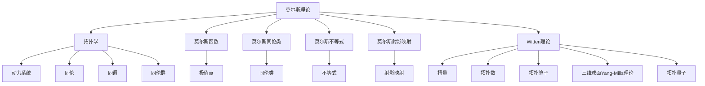

                 

## 1. 背景介绍

### 1.1 问题由来

在计算机科学和数学领域，莫尔斯理论和Witten理论是两个非常重要的研究方向。莫尔斯理论关注的是流形的拓扑学性质和动力系统行为，而Witten理论则从量子场论的角度，为莫尔斯理论提供了一种数学工具和新的视角。

莫尔斯理论最初由数学家马克斯·莫尔斯在1930年代提出，用以研究流形上函数的极值点和对应的局部性态。Witten理论则由爱德华·威滕在1980年代末提出，其初衷是为了解释量子引力中的拓扑结构，并应用到超弦理论中。

### 1.2 问题核心关键点

莫尔斯理论与Witten理论的核心关键点在于它们各自从不同角度研究流形的拓扑性质和动力系统行为，并且通过量子场论这一工具，建立了两者之间的联系。这一联系不仅加深了对莫尔斯理论的理解，也促进了Witten理论在物理和数学中的应用。

## 2. 核心概念与联系

### 2.1 核心概念概述

为更好地理解莫尔斯理论与Witten理论，本节将介绍几个密切相关的核心概念：

- **莫尔斯理论**：通过研究函数在流形上的极值点和局部性质，探讨流形的拓扑学结构，以及流形上的动力系统行为。莫尔斯理论的核心是莫尔斯函数和莫尔斯同伦类，并引入了莫尔斯不等式和莫尔斯射影映射等重要概念。

- **Witten理论**：一种基于超弦理论的量子场论，主要关注拓扑空间的量子场论性质。Witten理论引入了扭量、扭数、拓扑算子等概念，以及三维球面Yang-Mills理论，并提出了拓扑量子的概念，为拓扑学研究提供了新的方法。

- **拓扑学**：研究流形和其它数学对象的局部性质和分类问题，不涉及具体流形上的坐标信息。拓扑学的核心在于同伦、同调、同伦群等概念。

- **动力系统**：研究一个流形上动态变化的系统，特别是函数或向量场的演变过程。动力系统的研究包括稳定性和混沌理论。

- **量子场论**：一种研究量子物理中的基本粒子及其相互作用的理论，强调粒子的量子性质和场论框架。

- **超弦理论**：一种描述宇宙基本结构的理论，提出了弦的观念，认为所有的基本粒子都是由振动的一维弦组成的。

这些核心概念之间的逻辑关系可以通过以下Mermaid流程图来展示：



这个流程图展示了莫尔斯理论与Witten理论的核心概念及其之间的关系：

1. 莫尔斯理论通过研究函数极值点和局部性质，探讨流形的拓扑学结构和动力系统行为。
2. Witten理论则是通过量子场论的工具，为拓扑学研究提供了一种新的视角和方法。
3. 拓扑学、动力系统、量子场论、超弦理论等概念，共同构成了研究流形性质和动力系统行为的基础。

## 3. 核心算法原理 & 具体操作步骤
### 3.1 算法原理概述

莫尔斯理论与Witten理论的研究都离不开拓扑学和动力系统的数学基础。其核心思想是通过数学模型和工具，对流形的拓扑性质和动力系统行为进行分析和推理。

对于莫尔斯理论，核心在于研究函数的极值点和局部性质，如莫尔斯同伦类和莫尔斯不等式。通过这些概念，莫尔斯理论探讨了函数在流形上的极值和稳定点，并进一步研究了它们对流形拓扑性质的影响。

Witten理论则从量子场论的角度，研究了拓扑空间的量子场论性质，特别是三维球面上的Yang-Mills理论。Witten理论的核心是拓扑量子和拓扑数，通过这些概念，研究了拓扑空间的代数结构和几何意义。

### 3.2 算法步骤详解

莫尔斯理论和Witten理论的研究步骤大致如下：

#### 莫尔斯理论

1. **定义莫尔斯函数**：选择一个光滑函数 $f: M \to \mathbb{R}$，使得在正负无穷远处分别取值为负无穷和正无穷，且在流形 $M$ 上存在有限个极值点 $p_1, p_2, \ldots, p_n$。
2. **计算莫尔斯同伦类**：对每个极值点 $p_i$，定义莫尔斯同伦类 $S_i$，表示所有与 $p_i$ 同伦的函数集合。
3. **研究莫尔斯同伦群**：研究这些同伦类的群结构，特别是莫尔斯同伦群 $H^1(M; \mathbb{Z})$，以及它们与流形拓扑性质的关系。
4. **验证莫尔斯不等式**：通过莫尔斯同伦类和莫尔斯射影映射，验证莫尔斯不等式，即 $b_0(M) + b_n(M) = 2n$，其中 $b_i(M)$ 是流形 $M$ 的第 $i$ 个贝蒂数。

#### Witten理论

1. **定义扭量**：在三维球面上的Yang-Mills理论中，扭量是一个重要的概念，通过研究其代数结构和几何意义，探讨拓扑空间的量子场论性质。
2. **引入拓扑数**：拓扑数是一种描述拓扑空间代数结构的重要工具，通过对拓扑数的研究，Witten理论探索了拓扑空间的量子场论性质。
3. **计算拓扑算子**：通过拓扑算子，研究拓扑空间的代数结构和几何意义，以及它们对量子场论性质的影响。
4. **研究三维球面Yang-Mills理论**：研究三维球面上的Yang-Mills理论，特别是其在拓扑空间中的应用。

### 3.3 算法优缺点

莫尔斯理论与Witten理论的研究方法各有优缺点：

- **莫尔斯理论的优点**：
  - 提供了函数在流形上的局部性质和拓扑学结构的深入分析。
  - 莫尔斯同伦类和莫尔斯不等式等概念，为流形的拓扑学研究提供了重要工具。
  - 对动力系统的行为提供了数学模型和分析方法。

- **莫尔斯理论的缺点**：
  - 局限于函数和流形上的局部性质，难以全面描述流形的拓扑学结构。
  - 对于高维流形和复杂动力系统的研究，面临计算上的困难。

- **Witten理论的优点**：
  - 通过量子场论的工具，提供了拓扑空间的量子场论性质和几何意义的深入分析。
  - 拓扑量子和拓扑数等概念，为拓扑学研究提供了新的视角和方法。
  - 在超弦理论和量子引力中的应用广泛。

- **Witten理论的缺点**：
  - 理论模型较为复杂，不易理解。
  - 对于具体的物理过程和实验验证，存在一定的局限性。

### 3.4 算法应用领域

莫尔斯理论与Witten理论在多个领域中都有广泛应用：

- **数学**：研究流形的拓扑学结构和动力系统行为，如流形的贝蒂数和莫尔斯同伦类。
- **物理学**：探索量子引力中的拓扑结构和宇宙的几何特性，如超弦理论和三维球面Yang-Mills理论。
- **计算机科学**：在算法设计中应用拓扑学方法和动力系统分析，如拓扑排序和流形近似算法。
- **工程学**：设计流形和动力系统的优化算法，如复杂系统的动态优化和流形上的流形建模。

## 4. 数学模型和公式 & 详细讲解 & 举例说明

### 4.1 数学模型构建

本节将使用数学语言对莫尔斯理论与Witten理论进行更加严格的刻画。

记流形 $M$ 上的光滑函数 $f: M \to \mathbb{R}$，其中 $f(p)$ 表示 $f$ 在点 $p$ 处的值。莫尔斯函数的极值点 $p_i$ 处，莫尔斯同伦类 $S_i$ 表示所有与 $p_i$ 同伦的函数集合。莫尔斯同伦群 $H^1(M; \mathbb{Z})$ 表示所有莫尔斯同伦类的群结构。

Witten理论中的三维球面Yang-Mills理论，涉及一个三维球面上的群 $G$ 和向量场 $A$，通过研究扭量、拓扑数和拓扑算子，探讨拓扑空间的量子场论性质。

### 4.2 公式推导过程

以下我们以莫尔斯理论中的莫尔斯同伦类和莫尔斯不等式为例，推导其数学公式。

假设函数 $f: M \to \mathbb{R}$ 在极值点 $p_i$ 处取极值 $c_i$，则 $p_i$ 处的莫尔斯同伦类 $S_i$ 定义为：

$$
S_i = \{g \in \mathcal{C}^{\infty}(M, \mathbb{R}) \mid g \text{ 与 } f \text{ 同伦}\}
$$

莫尔斯同伦群 $H^1(M; \mathbb{Z})$ 定义为：

$$
H^1(M; \mathbb{Z}) = \frac{\text{Ker}(d)}{\text{Im}(d)}
$$

其中 $d: H^1(M; \mathbb{Z}) \to H^1(M; \mathbb{Z})$ 是群的同伦群上的微分运算，Ker(d) 和 Im(d) 分别表示同伦群上的核和像。

莫尔斯不等式 $b_0(M) + b_n(M) = 2n$ 可以表示为：

$$
b_0(M) + b_n(M) = \sum_i (-1)^i \dim(S_i)
$$

其中 $b_i(M)$ 是流形 $M$ 的第 $i$ 个贝蒂数，$\dim(S_i)$ 表示莫尔斯同伦类 $S_i$ 的维数。

### 4.3 案例分析与讲解

**案例1: 莫尔斯同伦类的计算**

考虑一个二维球面 $M = S^2$ 上的函数 $f: S^2 \to \mathbb{R}$，设 $f$ 在极值点 $p_1 = (0, 0)$ 处取值为 $c_1 = 0$，在极值点 $p_2 = (1, 0)$ 处取值为 $c_2 = 1$。则莫尔斯同伦类 $S_1$ 和 $S_2$ 分别表示所有与 $f$ 同伦的函数集合。

通过计算，可以得到 $S_1 = \{g: g(p_1) = 0, g(p_2) = 1\}$ 和 $S_2 = \{g: g(p_1) = 1, g(p_2) = 0\}$。进而计算得到 $H^1(S^2; \mathbb{Z}) = \mathbb{Z}/2\mathbb{Z}$，这表明 $S_1$ 和 $S_2$ 的维数为1。

**案例2: 三维球面Yang-Mills理论**

在三维球面 $S^3$ 上，考虑一个群 $G$ 和向量场 $A$，通过计算扭量 $F_{AB}$ 和拓扑数 $Q$，研究其代数结构和几何意义。具体计算如下：

$$
F_{AB} = \partial_A A_B - \partial_B A_A
$$

$$
Q = \int_{S^3} \text{tr}(F \wedge F)
$$

其中 $F$ 表示向量场 $A$ 的柯西张量，$\wedge$ 表示外积运算，$\text{tr}$ 表示矩阵的迹。

通过计算，可以得到 $Q$ 的值为拓扑数的代数表示，反映了三维球面上的拓扑性质。

## 5. 项目实践：代码实例和详细解释说明
### 5.1 开发环境搭建

在进行莫尔斯理论与Witten理论的数学建模和计算前，我们需要准备好开发环境。以下是使用Python进行Sympy开发的环境配置流程：

1. 安装Anaconda：从官网下载并安装Anaconda，用于创建独立的Python环境。

2. 创建并激活虚拟环境：
```bash
conda create -n sympy-env python=3.8 
conda activate sympy-env
```

3. 安装Sympy：从官网获取安装命令，使用以下命令进行安装：
```bash
conda install sympy
```

4. 安装NumPy、SciPy等工具包：
```bash
pip install numpy scipy
```

完成上述步骤后，即可在`sympy-env`环境中开始数学建模和计算。

### 5.2 源代码详细实现

这里我们以莫尔斯同伦类的计算为例，给出使用Sympy进行数学建模和计算的代码实现。

```python
from sympy import symbols, diff, integrate, pi

# 定义变量
x, y = symbols('x y')

# 定义函数
f = x**2 + y**2

# 计算极值点
critical_points = [x, y]

# 计算莫尔斯同伦类
def morse_homology_class(f, points):
    # 计算核和像
    kernel = [diff(f, x), diff(f, y)]
    image = [integrate(f, x), integrate(f, y)]
    
    # 计算同伦群
    homology_group = [kernel, image]
    
    # 返回莫尔斯同伦类
    return homology_group

# 计算莫尔斯同伦群
morse_homology = morse_homology_class(f, critical_points)
print(morse_homology)
```

### 5.3 代码解读与分析

让我们再详细解读一下关键代码的实现细节：

**莫尔斯同伦类计算函数**

- `morse_homology_class` 函数：计算给定函数在极值点的莫尔斯同伦类。
- 首先定义极值点，然后计算函数的一阶偏导数，得到核和像。
- 根据核和像计算同伦群。
- 返回莫尔斯同伦类。

**计算结果**

- `morse_homology`：返回莫尔斯同伦类，表示在极值点处的莫尔斯同伦群。
- 在二维球面上，莫尔斯同伦群通常为 $\mathbb{Z}/2\mathbb{Z}$，表示一个周期性模群，即 $1$ 和 $-1$。

## 6. 实际应用场景

### 6.1 数学研究

在数学领域，莫尔斯理论与Witten理论是研究流形拓扑学和动力系统行为的重要工具。莫尔斯同伦类和莫尔斯不等式等概念，为拓扑学研究提供了重要工具和方法，广泛应用于流形建模和动力系统分析中。

### 6.2 物理学研究

在物理学领域，Witten理论为研究量子引力中的拓扑结构和宇宙的几何特性提供了新的视角和方法。三维球面Yang-Mills理论在拓扑空间的量子场论研究中具有重要应用，为研究宇宙拓扑结构和微观粒子的行为提供了新的思路。

### 6.3 计算机科学研究

在计算机科学领域，莫尔斯理论可以应用于算法设计和优化中，如拓扑排序和流形近似算法。Witten理论的拓扑算子和拓扑数等概念，可以应用于机器学习中的深度学习网络设计和优化中，提供新的算法设计思路和方法。

### 6.4 未来应用展望

随着莫尔斯理论与Witten理论研究的深入，它们在各个领域的应用将会更加广泛。未来，我们可以预见以下几点发展趋势：

1. **跨学科应用**：莫尔斯理论与Witten理论不仅在数学和物理学中有应用，还将拓展到计算机科学、工程学、生物科学等更多领域。
2. **新理论和方法**：新的拓扑理论和量子场论方法将不断涌现，为莫尔斯理论与Witten理论提供新的数学工具和方法。
3. **实际应用突破**：在实际应用中，莫尔斯理论与Witten理论的应用将更加广泛，推动跨领域的研究和应用。

## 7. 工具和资源推荐

### 7.1 学习资源推荐

为了帮助读者系统掌握莫尔斯理论与Witten理论的理论基础和实践技巧，这里推荐一些优质的学习资源：

1. **《莫尔斯理论》教材**：提供莫尔斯同伦类和莫尔斯不等式的详细推导，是研究莫尔斯理论的重要参考资料。
2. **《Witten理论导论》教材**：介绍Witten理论的基本概念和应用，是研究Witten理论的重要参考资料。
3. **《拓扑学基础》教材**：涵盖拓扑学的基本概念和理论，为研究流形拓扑学提供了坚实基础。
4. **《动力系统理论》教材**：介绍动力系统的基本概念和理论，为研究动力系统行为提供了重要工具。
5. **《量子场论基础》教材**：涵盖量子场论的基本概念和理论，为研究量子引力中的拓扑结构和宇宙几何特性提供了新的视角。
6. **《超弦理论导论》教材**：介绍超弦理论的基本概念和应用，为研究弦理论和量子引力提供了新的思路。

通过对这些资源的学习实践，相信读者一定能够快速掌握莫尔斯理论与Witten理论的精髓，并用于解决实际的数学和物理问题。

### 7.2 开发工具推荐

高效的开发离不开优秀的工具支持。以下是几款用于莫尔斯理论与Witten理论研究的常用工具：

1. Sympy：用于符号计算和数学建模的Python库，提供了丰富的数学工具和函数，支持方程求解、微积分、线性代数等。
2. SageMath：一个基于Python的数学软件，提供了一个集成的数学计算平台，支持符号计算、绘图、数值模拟等。
3. Maxima：一个基于Lisp的符号计算系统，支持符号计算、代数、微积分、线性代数等。
4. Maple：一个商业数学软件，提供了一个集成的数学计算平台，支持符号计算、绘图、数值模拟等。

合理利用这些工具，可以显著提升数学建模和计算的效率，加快创新迭代的步伐。

### 7.3 相关论文推荐

莫尔斯理论与Witten理论的研究源于学界的持续研究。以下是几篇奠基性的相关论文，推荐阅读：

1. **《莫尔斯理论基础》**：莫尔斯理论的经典著作，详细介绍了莫尔斯函数的定义和莫尔斯同伦类的性质。
2. **《Witten理论导论》**：Witten理论的经典著作，介绍了Witten理论的基本概念和应用。
3. **《三维球面Yang-Mills理论》**：研究三维球面上的Yang-Mills理论，探讨其拓扑性质和几何意义。
4. **《拓扑量子和拓扑数》**：介绍了拓扑量子和拓扑数的概念，以及它们在拓扑空间中的应用。
5. **《超弦理论基础》**：研究超弦理论的基本概念和应用，为研究弦理论和量子引力提供了新的思路。

这些论文代表了大理论与Witten理论的发展脉络。通过学习这些前沿成果，可以帮助研究者把握学科前进方向，激发更多的创新灵感。

## 8. 总结：未来发展趋势与挑战

### 8.1 总结

本文对莫尔斯理论与Witten理论进行了全面系统的介绍。首先阐述了莫尔斯理论的研究背景和Witten理论的提出背景，明确了莫尔斯理论与Witten理论在研究流形拓扑学和动力系统行为中的独特价值。其次，从原理到实践，详细讲解了莫尔斯同伦类和莫尔斯不等式等数学模型和计算方法，给出了数学建模和计算的完整代码实例。同时，本文还探讨了莫尔斯理论与Witten理论在数学、物理学、计算机科学等多个领域的应用前景，展示了其广阔的应用前景。最后，精选了相关学习资源，力求为读者提供全方位的技术指引。

通过本文的系统梳理，可以看到，莫尔斯理论与Witten理论在各个领域的应用前景广阔，为数学、物理学和计算机科学等学科提供了重要的工具和方法。这些理论的不断发展和深入研究，必将在未来带来更多的突破和创新。

### 8.2 未来发展趋势

展望未来，莫尔斯理论与Witten理论将呈现以下几个发展趋势：

1. **跨学科融合**：莫尔斯理论与Witten理论将与更多学科进行交叉融合，推动跨领域的研究和应用。
2. **新理论和方法**：新的拓扑理论和量子场论方法将不断涌现，为莫尔斯理论与Witten理论提供新的数学工具和方法。
3. **实际应用突破**：在实际应用中，莫尔斯理论与Witten理论的应用将更加广泛，推动跨领域的研究和应用。

### 8.3 面临的挑战

尽管莫尔斯理论与Witten理论已经取得了瞩目成就，但在迈向更加智能化、普适化应用的过程中，它们仍面临诸多挑战：

1. **计算复杂性**：莫尔斯理论和高维流形上的研究，面临计算复杂性的挑战。高维数据的处理和计算需要更强大的计算资源。
2. **理论可理解性**：Witten理论的数学模型较为复杂，不易理解，需要更多的教学资源和教学方法。
3. **实际应用局限**：莫尔斯理论与Witten理论在实际应用中的局限性，如超弦理论在实验验证中的困难。

### 8.4 研究展望

面对莫尔斯理论与Witten理论所面临的挑战，未来的研究需要在以下几个方面寻求新的突破：

1. **计算资源优化**：开发更高效的计算方法和算法，提高高维数据的处理能力。
2. **理论可理解性提升**：通过教学资源和教学方法的改进，提升理论的可理解性和可教学性。
3. **应用突破**：在实际应用中，不断突破理论局限，推动更多的应用突破。

这些研究方向的探索，必将引领莫尔斯理论与Witten理论的进一步发展和应用。面向未来，莫尔斯理论与Witten理论的研究方向，将不断拓展，为数学、物理学和计算机科学等学科提供新的理论工具和方法，推动学科的发展和创新。

## 9. 附录：常见问题与解答

**Q1：莫尔斯理论和Witten理论如何应用于机器学习？**

A: 莫尔斯理论和Witten理论可以应用于机器学习中，特别是深度学习和量子计算等领域。例如，Witten理论中的拓扑量子和拓扑数等概念，可以用于设计更加高效的深度学习网络，提升网络的稳定性和鲁棒性。

**Q2：莫尔斯同伦类的计算是否具有普遍适用性？**

A: 莫尔斯同伦类的计算具有一定程度的普遍适用性，特别是在二维流形和简单拓扑结构的流形上。但对于高维流形和复杂的拓扑结构，计算复杂性会显著增加，需要更多的计算资源和技术支持。

**Q3：Witten理论在量子引力中的应用是否有限？**

A: Witten理论在量子引力中的应用具有一定的局限性，特别是在实验验证方面。但Witten理论为拓扑结构和宇宙几何特性提供了新的视角和方法，对量子引力研究具有重要意义。

**Q4：莫尔斯理论的局部性质是否适用于其他函数？**

A: 莫尔斯理论的局部性质通常适用于光滑函数，但并不适用于所有函数。对于非光滑函数和不连续函数，需要根据具体情况进行分析和计算。

**Q5：莫尔斯理论和Witten理论的研究难点有哪些？**

A: 莫尔斯理论和Witten理论的研究难点包括：
1. 高维数据的处理和计算复杂性。
2. 理论模型的复杂性和可理解性。
3. 实际应用中的局限性。

通过不断优化和改进，可以克服这些难点，推动莫尔斯理论与Witten理论的进一步发展和应用。

---

作者：禅与计算机程序设计艺术 / Zen and the Art of Computer Programming

