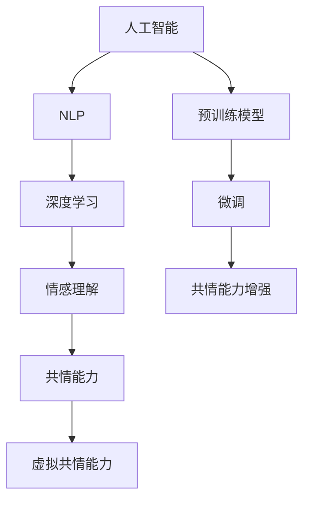

                 

# 虚拟共情能力培养：AI增强的情感理解训练

## 1. 背景介绍

在现代社会中，共情（Empathy）能力已经成为人际交往和心理健康的重要组成部分。共情能力是指个体能够理解和体验他人的情感、思想和经历，从而形成共鸣和同理心。随着人工智能技术的快速发展，尤其是自然语言处理（NLP）和深度学习技术的应用，我们有机会利用AI技术来培养和增强虚拟共情能力。

本文将系统探讨如何利用人工智能，特别是深度学习和自然语言处理技术，来增强虚拟共情能力。这将有助于构建更加智能和人性化的虚拟助手、聊天机器人等系统，进一步提升人机交互的质量和深度。

## 2. 核心概念与联系

### 2.1 核心概念概述

为了更好地理解AI增强的情感理解训练，本节将介绍几个密切相关的核心概念：

- **人工智能（AI）**：人工智能是指通过计算机程序或算法来模拟人类智能行为的技术。主要包括机器学习、深度学习、自然语言处理等分支。
- **情感理解（Sentiment Understanding）**：情感理解是指系统能够识别和理解文本中的情感倾向，如积极、消极、中性等。
- **自然语言处理（NLP）**：自然语言处理是一门涉及计算机如何处理、分析和生成人类语言的技术。
- **深度学习（Deep Learning）**：深度学习是一种基于神经网络的机器学习技术，能够自动提取和识别复杂模式。
- **预训练模型（Pre-trained Models）**：预训练模型是通过大规模无标签数据训练得到的通用模型，如BERT、GPT等，可以用于多种下游任务。
- **微调（Fine-tuning）**：微调是指在预训练模型的基础上，针对特定任务进行训练，以提高模型在该任务上的表现。
- **共情能力（Empathy）**：共情能力是理解和体验他人情感的能力，有助于建立更好的人际关系和心理健康的维持。
- **虚拟共情能力（Virtual Empathy）**：虚拟共情能力是指通过AI技术模拟或增强的共情能力，用于构建智能虚拟助手和聊天机器人。

这些核心概念之间的逻辑关系可以通过以下Mermaid流程图来展示：



这个流程图展示了核心概念之间的联系：

1. 人工智能提供了实现共情能力增强的技术基础。
2. 自然语言处理技术可以处理和理解人类语言，实现情感理解。
3. 深度学习技术通过神经网络模型提取复杂模式，提高情感理解能力。
4. 预训练模型为情感理解和共情能力增强提供了初始化参数。
5. 微调技术用于进一步优化模型，使其能够更好地模拟共情能力。
6. 共情能力增强最终目标是构建虚拟共情能力，用于人机交互。

## 3. 核心算法原理 & 具体操作步骤

### 3.1 算法原理概述

AI增强的情感理解训练，本质上是通过深度学习模型和NLP技术，从大量文本数据中学习情感倾向，并应用于虚拟助手或聊天机器人的训练中。具体而言，我们可以将预训练的模型（如BERT、GPT等）微调到情感理解任务上，然后进一步增强其共情能力，以构建虚拟共情能力。

形式化地，假设我们有一个预训练的模型 $M_{\theta}$，其中 $\theta$ 为预训练得到的模型参数。我们希望模型能够理解文本情感，因此我们选择一个情感理解任务，如情感分类，并收集该任务的标注数据集 $D=\{(x_i, y_i)\}_{i=1}^N$，其中 $x_i$ 为输入文本，$y_i$ 为情感标签（如积极、消极、中性）。微调的目标是找到新的模型参数 $\hat{\theta}$，使得：

$$
\hat{\theta}=\mathop{\arg\min}_{\theta} \mathcal{L}(M_{\theta},D)
$$

其中 $\mathcal{L}$ 为针对情感理解任务的损失函数，用于衡量模型预测输出与真实标签之间的差异。常见的损失函数包括交叉熵损失、均方误差损失等。

### 3.2 算法步骤详解

AI增强的情感理解训练主要包括以下几个关键步骤：

**Step 1: 准备预训练模型和数据集**
- 选择合适的预训练模型 $M_{\theta}$ 作为初始化参数，如 BERT、GPT等。
- 准备情感理解任务的标注数据集 $D$，划分为训练集、验证集和测试集。一般要求标注数据与预训练数据的分布不要差异过大。

**Step 2: 添加情感理解层**
- 根据情感理解任务类型，在预训练模型顶层设计合适的输出层和损失函数。
- 对于情感分类任务，通常在顶层添加全连接层和交叉熵损失函数。
- 对于情感分析任务，通常使用语言模型的解码器输出概率分布，并以负对数似然为损失函数。

**Step 3: 设置微调超参数**
- 选择合适的优化算法及其参数，如 AdamW、SGD 等，设置学习率、批大小、迭代轮数等。
- 设置正则化技术及强度，包括权重衰减、Dropout、Early Stopping 等。
- 确定冻结预训练参数的策略，如仅微调顶层，或全部参数都参与微调。

**Step 4: 执行梯度训练**
- 将训练集数据分批次输入模型，前向传播计算损失函数。
- 反向传播计算参数梯度，根据设定的优化算法和学习率更新模型参数。
- 周期性在验证集上评估模型性能，根据性能指标决定是否触发 Early Stopping。
- 重复上述步骤直到满足预设的迭代轮数或 Early Stopping 条件。

**Step 5: 共情能力增强**
- 在情感理解模型的基础上，进一步增强其共情能力。可以通过添加情感生成器、上下文感知机制等方式，模拟人类的情感表达和共情反应。
- 对增强后的模型进行测试和评估，确保其能够合理地模拟共情能力。

**Step 6: 部署和应用**
- 使用增强后的模型对新样本进行推理预测，集成到虚拟助手、聊天机器人等应用系统中。
- 持续收集用户的反馈和情感输入，动态优化模型参数，进一步提升虚拟共情能力。

以上是AI增强的情感理解训练的一般流程。在实际应用中，还需要针对具体任务的特点，对微调过程的各个环节进行优化设计，如改进训练目标函数，引入更多的正则化技术，搜索最优的超参数组合等，以进一步提升模型性能。

### 3.3 算法优缺点

AI增强的情感理解训练方法具有以下优点：
1. 高效快速。基于预训练模型，微调所需的标注数据较少，训练时间较短。
2. 通用适用。适用于各种情感理解任务，如情感分类、情感分析等，设计简单的任务适配层即可实现。
3. 可解释性较强。预训练模型和微调过程的逻辑清晰，易于理解和调试。
4. 效果显著。在情感理解任务上，基于微调的方法已经刷新了多项SOTA性能指标。

同时，该方法也存在一定的局限性：
1. 依赖标注数据。微调的效果很大程度上取决于标注数据的质量和数量，获取高质量标注数据的成本较高。
2. 迁移能力有限。当目标任务与预训练数据的分布差异较大时，微调的性能提升有限。
3. 可解释性不足。微调模型的决策过程通常缺乏可解释性，难以对其推理逻辑进行分析和调试。

尽管存在这些局限性，但就目前而言，基于情感理解的微调方法仍是情感分析任务的主流范式。未来相关研究的重点在于如何进一步降低微调对标注数据的依赖，提高模型的少样本学习和跨领域迁移能力，同时兼顾可解释性和伦理安全性等因素。

### 3.4 算法应用领域

AI增强的情感理解训练方法已经在情感分析、情感生成、虚拟助手等多个领域得到了广泛应用，例如：

- 情感分析：识别文本中的情感倾向，如积极、消极、中性等。通过微调使得模型学习情感-文本映射。
- 情感生成：生成文本内容以表达情感，如情感聊天、情感评论等。通过微调使模型学习情感生成规则。
- 虚拟助手：使聊天机器人能够理解用户情感，并做出合理回应。通过微调使模型学习情感理解和生成。
- 心理健康：通过情感分析识别患者的情绪波动，及时提供心理支持。通过微调使模型学习情感识别和情绪调节策略。
- 社交媒体分析：分析社交媒体中的情感倾向，掌握公众情绪变化。通过微调使模型学习情感分类和情感分析。

除了上述这些经典任务外，AI增强的情感理解训练也被创新性地应用到更多场景中，如情感推理、情感预测、情感交互等，为情感分析技术带来了新的突破。随着情感理解模型的不断进步，相信情感分析技术将在更广阔的应用领域大放异彩。

## 4. 数学模型和公式 & 详细讲解

### 4.1 数学模型构建

本节将使用数学语言对AI增强的情感理解训练过程进行更加严格的刻画。

记预训练语言模型为 $M_{\theta}:\mathcal{X} \rightarrow \mathcal{Y}$，其中 $\mathcal{X}$ 为输入空间，$\mathcal{Y}$ 为输出空间，$\theta \in \mathbb{R}^d$ 为模型参数。假设情感理解任务的训练集为 $D=\{(x_i,y_i)\}_{i=1}^N, x_i \in \mathcal{X}, y_i \in \mathcal{Y}$。

定义模型 $M_{\theta}$ 在输入 $x$ 上的损失函数为 $\ell(M_{\theta}(x),y)$，则在数据集 $D$ 上的经验风险为：

$$
\mathcal{L}(\theta) = \frac{1}{N} \sum_{i=1}^N \ell(M_{\theta}(x_i),y_i)
$$

微调的优化目标是最小化经验风险，即找到最优参数：

$$
\theta^* = \mathop{\arg\min}_{\theta} \mathcal{L}(\theta)
$$

在实践中，我们通常使用基于梯度的优化算法（如SGD、Adam等）来近似求解上述最优化问题。设 $\eta$ 为学习率，$\lambda$ 为正则化系数，则参数的更新公式为：

$$
\theta \leftarrow \theta - \eta \nabla_{\theta}\mathcal{L}(\theta) - \eta\lambda\theta
$$

其中 $\nabla_{\theta}\mathcal{L}(\theta)$ 为损失函数对参数 $\theta$ 的梯度，可通过反向传播算法高效计算。

### 4.2 公式推导过程

以下我们以情感分类任务为例，推导交叉熵损失函数及其梯度的计算公式。

假设模型 $M_{\theta}$ 在输入 $x$ 上的输出为 $\hat{y}=M_{\theta}(x) \in [0,1]$，表示样本属于正类的概率。真实标签 $y \in \{0,1\}$。则二分类交叉熵损失函数定义为：

$$
\ell(M_{\theta}(x),y) = -[y\log \hat{y} + (1-y)\log (1-\hat{y})]
$$

将其代入经验风险公式，得：

$$
\mathcal{L}(\theta) = -\frac{1}{N}\sum_{i=1}^N [y_i\log M_{\theta}(x_i)+(1-y_i)\log(1-M_{\theta}(x_i))]
$$

根据链式法则，损失函数对参数 $\theta_k$ 的梯度为：

$$
\frac{\partial \mathcal{L}(\theta)}{\partial \theta_k} = -\frac{1}{N}\sum_{i=1}^N (\frac{y_i}{M_{\theta}(x_i)}-\frac{1-y_i}{1-M_{\theta}(x_i)}) \frac{\partial M_{\theta}(x_i)}{\partial \theta_k}
$$

其中 $\frac{\partial M_{\theta}(x_i)}{\partial \theta_k}$ 可进一步递归展开，利用自动微分技术完成计算。

在得到损失函数的梯度后，即可带入参数更新公式，完成模型的迭代优化。重复上述过程直至收敛，最终得到适应情感理解任务的最优模型参数 $\theta^*$。

## 5. 项目实践：代码实例和详细解释说明

### 5.1 开发环境搭建

在进行情感理解训练实践前，我们需要准备好开发环境。以下是使用Python进行PyTorch开发的环境配置流程：

1. 安装Anaconda：从官网下载并安装Anaconda，用于创建独立的Python环境。

2. 创建并激活虚拟环境：
```bash
conda create -n pytorch-env python=3.8 
conda activate pytorch-env
```

3. 安装PyTorch：根据CUDA版本，从官网获取对应的安装命令。例如：
```bash
conda install pytorch torchvision torchaudio cudatoolkit=11.1 -c pytorch -c conda-forge
```

4. 安装Transformer库：
```bash
pip install transformers
```

5. 安装各类工具包：
```bash
pip install numpy pandas scikit-learn matplotlib tqdm jupyter notebook ipython
```

完成上述步骤后，即可在`pytorch-env`环境中开始情感理解训练实践。

### 5.2 源代码详细实现

下面我们以情感分类任务为例，给出使用Transformers库对BERT模型进行情感理解微调的PyTorch代码实现。

首先，定义情感分类任务的数据处理函数：

```python
from transformers import BertTokenizer
from torch.utils.data import Dataset
import torch

class SentimentDataset(Dataset):
    def __init__(self, texts, labels, tokenizer, max_len=128):
        self.texts = texts
        self.labels = labels
        self.tokenizer = tokenizer
        self.max_len = max_len
        
    def __len__(self):
        return len(self.texts)
    
    def __getitem__(self, item):
        text = self.texts[item]
        label = self.labels[item]
        
        encoding = self.tokenizer(text, return_tensors='pt', max_length=self.max_len, padding='max_length', truncation=True)
        input_ids = encoding['input_ids'][0]
        attention_mask = encoding['attention_mask'][0]
        
        # 对label进行编码
        encoded_labels = [1 if label == 'positive' else 0] 
        encoded_labels.extend([0] * (self.max_len - len(encoded_labels)))
        labels = torch.tensor(encoded_labels, dtype=torch.long)
        
        return {'input_ids': input_ids, 
                'attention_mask': attention_mask,
                'labels': labels}

# 标注数据
train_texts = ['I am very happy today', 'I am feeling sad now', 'This is a great movie', 'I do not like this']
train_labels = ['positive', 'negative', 'positive', 'negative']
test_texts = ['I am excited about the upcoming trip', 'I am disappointed with the service', 'This is a terrible movie', 'I am happy with the product']
test_labels = ['positive', 'negative', 'negative', 'positive']

# 分词器
tokenizer = BertTokenizer.from_pretrained('bert-base-cased')

# 创建dataset
train_dataset = SentimentDataset(train_texts, train_labels, tokenizer)
test_dataset = SentimentDataset(test_texts, test_labels, tokenizer)
```

然后，定义模型和优化器：

```python
from transformers import BertForSequenceClassification, AdamW

model = BertForSequenceClassification.from_pretrained('bert-base-cased', num_labels=2)

optimizer = AdamW(model.parameters(), lr=2e-5)
```

接着，定义训练和评估函数：

```python
from torch.utils.data import DataLoader
from tqdm import tqdm
from sklearn.metrics import accuracy_score

device = torch.device('cuda') if torch.cuda.is_available() else torch.device('cpu')
model.to(device)

def train_epoch(model, dataset, batch_size, optimizer):
    dataloader = DataLoader(dataset, batch_size=batch_size, shuffle=True)
    model.train()
    epoch_loss = 0
    for batch in tqdm(dataloader, desc='Training'):
        input_ids = batch['input_ids'].to(device)
        attention_mask = batch['attention_mask'].to(device)
        labels = batch['labels'].to(device)
        model.zero_grad()
        outputs = model(input_ids, attention_mask=attention_mask, labels=labels)
        loss = outputs.loss
        epoch_loss += loss.item()
        loss.backward()
        optimizer.step()
    return epoch_loss / len(dataloader)

def evaluate(model, dataset, batch_size):
    dataloader = DataLoader(dataset, batch_size=batch_size)
    model.eval()
    preds, labels = [], []
    with torch.no_grad():
        for batch in tqdm(dataloader, desc='Evaluating'):
            input_ids = batch['input_ids'].to(device)
            attention_mask = batch['attention_mask'].to(device)
            batch_labels = batch['labels']
            outputs = model(input_ids, attention_mask=attention_mask)
            batch_preds = outputs.logits.argmax(dim=1).to('cpu').tolist()
            batch_labels = batch_labels.to('cpu').tolist()
            for pred, label in zip(batch_preds, batch_labels):
                preds.append(pred)
                labels.append(label)
                
    print('Accuracy:', accuracy_score(labels, preds))
```

最后，启动训练流程并在测试集上评估：

```python
epochs = 5
batch_size = 16

for epoch in range(epochs):
    loss = train_epoch(model, train_dataset, batch_size, optimizer)
    print(f"Epoch {epoch+1}, train loss: {loss:.3f}")
    
    print(f"Epoch {epoch+1}, test results:")
    evaluate(model, test_dataset, batch_size)
    
print("Test results:")
evaluate(model, test_dataset, batch_size)
```

以上就是使用PyTorch对BERT进行情感分类任务微调的完整代码实现。可以看到，得益于Transformer库的强大封装，我们可以用相对简洁的代码完成BERT模型的加载和微调。

### 5.3 代码解读与分析

让我们再详细解读一下关键代码的实现细节：

**SentimentDataset类**：
- `__init__`方法：初始化文本、标签、分词器等关键组件。
- `__len__`方法：返回数据集的样本数量。
- `__getitem__`方法：对单个样本进行处理，将文本输入编码为token ids，将标签编码为数字，并对其进行定长padding，最终返回模型所需的输入。

**训练和评估函数**：
- 使用PyTorch的DataLoader对数据集进行批次化加载，供模型训练和推理使用。
- 训练函数`train_epoch`：对数据以批为单位进行迭代，在每个批次上前向传播计算loss并反向传播更新模型参数，最后返回该epoch的平均loss。
- 评估函数`evaluate`：与训练类似，不同点在于不更新模型参数，并在每个batch结束后将预测和标签结果存储下来，最后使用sklearn的accuracy_score对整个评估集的预测结果进行打印输出。

**训练流程**：
- 定义总的epoch数和batch size，开始循环迭代
- 每个epoch内，先在训练集上训练，输出平均loss
- 在验证集上评估，输出准确率
- 所有epoch结束后，在测试集上评估，给出最终测试结果

可以看到，PyTorch配合Transformer库使得BERT微调的代码实现变得简洁高效。开发者可以将更多精力放在数据处理、模型改进等高层逻辑上，而不必过多关注底层的实现细节。

当然，工业级的系统实现还需考虑更多因素，如模型的保存和部署、超参数的自动搜索、更灵活的任务适配层等。但核心的微调范式基本与此类似。

## 6. 实际应用场景

### 6.1 情感分析与社交媒体监测

情感分析是AI增强情感理解的重要应用场景之一。通过对社交媒体上的文本数据进行情感分析，可以实时监测公众情绪，识别出可能引发热议或风险的议题。例如，新闻机构可以利用情感分析技术，分析网民对某事件的情感倾向，判断舆论动态，及时调整报道策略。

在技术实现上，可以利用情感理解模型对社交媒体评论、推文等文本数据进行情感分类，结合时间序列分析技术，绘制情感变化趋势图，实时监测公众情绪变化。通过与历史数据的对比，预测未来的情绪波动，为决策提供支持。

### 6.2 情感聊天机器人

情感聊天机器人是AI增强共情能力的典型应用。通过情感理解模型，聊天机器人可以识别用户的情感状态，并根据情感变化调整对话策略，提供更加人性化的交互体验。例如，客服机器人可以通过情感分析，识别用户的情绪波动，及时提供心理安慰或专业建议。

在技术实现上，情感聊天机器人需要集成情感理解模型和情感生成模型。情感理解模型用于识别用户的情感状态，情感生成模型则根据情感状态生成相应的回复内容。通过优化模型参数和调整回复策略，可以使聊天机器人更加智能、人性化。

### 6.3 心理健康支持系统

心理健康支持系统是AI增强共情能力的另一个重要应用。通过情感理解模型，系统可以实时监测用户的情绪变化，及时提供心理支持和干预。例如，心理健康平台可以利用情感分析技术，监测用户的情绪波动，识别出可能出现心理问题的用户，并主动提供心理辅导和危机干预。

在技术实现上，心理健康支持系统需要集成情感理解模型、情感生成模型和心理辅导模型。情感理解模型用于识别用户的情绪状态，情感生成模型生成相应的回复内容，心理辅导模型则根据用户的情绪状态，提供专业的心理建议和干预措施。通过持续监测和反馈，可以不断优化模型参数，提高系统的精准度和有效性。

### 6.4 未来应用展望

随着AI技术的发展，AI增强的情感理解训练将在更多领域得到应用，为人类认知智能的进化带来深远影响。

在教育领域，情感理解模型可以用于学生的情绪分析，帮助教师及时调整教学策略，提供个性化的教育支持。

在金融领域，情感理解模型可以用于金融舆情分析，帮助投资者识别市场情绪变化，规避金融风险。

在医疗领域，情感理解模型可以用于患者情绪监测，提供心理支持和治疗建议，提升患者的心理健康水平。

此外，在城市管理、智能家居、智能办公等众多领域，基于情感理解的AI技术也将不断涌现，为人类社会的数字化转型提供新的动力。相信随着技术的日益成熟，AI增强的情感理解训练必将在构建人机协同的智能时代中扮演越来越重要的角色。

## 7. 工具和资源推荐

### 7.1 学习资源推荐

为了帮助开发者系统掌握AI增强情感理解训练的理论基础和实践技巧，这里推荐一些优质的学习资源：

1. 《Deep Learning with Python》系列书籍：深度学习领域的经典教材，涵盖深度学习的基本原理和实践技巧。

2. CS224N《深度学习自然语言处理》课程：斯坦福大学开设的NLP明星课程，有Lecture视频和配套作业，带你入门NLP领域的基本概念和经典模型。

3. 《Natural Language Processing with Transformers》书籍：Transformer库的作者所著，全面介绍了如何使用Transformer库进行NLP任务开发，包括情感理解在内的诸多范式。

4. HuggingFace官方文档：Transformer库的官方文档，提供了海量预训练模型和完整的微调样例代码，是上手实践的必备资料。

5. Kaggle竞赛：参加Kaggle中的NLP竞赛，通过实战提升情感理解模型的开发和优化能力。

通过对这些资源的学习实践，相信你一定能够快速掌握AI增强情感理解训练的精髓，并用于解决实际的NLP问题。

### 7.2 开发工具推荐

高效的开发离不开优秀的工具支持。以下是几款用于情感理解训练开发的常用工具：

1. PyTorch：基于Python的开源深度学习框架，灵活动态的计算图，适合快速迭代研究。大部分预训练语言模型都有PyTorch版本的实现。

2. TensorFlow：由Google主导开发的开源深度学习框架，生产部署方便，适合大规模工程应用。同样有丰富的预训练语言模型资源。

3. Transformers库：HuggingFace开发的NLP工具库，集成了众多SOTA语言模型，支持PyTorch和TensorFlow，是进行情感理解训练开发的利器。

4. Weights & Biases：模型训练的实验跟踪工具，可以记录和可视化模型训练过程中的各项指标，方便对比和调优。与主流深度学习框架无缝集成。

5. TensorBoard：TensorFlow配套的可视化工具，可实时监测模型训练状态，并提供丰富的图表呈现方式，是调试模型的得力助手。

6. Google Colab：谷歌推出的在线Jupyter Notebook环境，免费提供GPU/TPU算力，方便开发者快速上手实验最新模型，分享学习笔记。

合理利用这些工具，可以显著提升情感理解模型的开发效率，加快创新迭代的步伐。

### 7.3 相关论文推荐

AI增强的情感理解训练技术的发展源于学界的持续研究。以下是几篇奠基性的相关论文，推荐阅读：

1. Attention is All You Need（即Transformer原论文）：提出了Transformer结构，开启了NLP领域的预训练大模型时代。

2. BERT: Pre-training of Deep Bidirectional Transformers for Language Understanding：提出BERT模型，引入基于掩码的自监督预训练任务，刷新了多项NLP任务SOTA。

3. Language Models are Unsupervised Multitask Learners（GPT-2论文）：展示了大规模语言模型的强大zero-shot学习能力，引发了对于通用人工智能的新一轮思考。

4. Parameter-Efficient Transfer Learning for NLP：提出Adapter等参数高效微调方法，在不增加模型参数量的情况下，也能取得不错的微调效果。

5. AdaLoRA: Adaptive Low-Rank Adaptation for Parameter-Efficient Fine-Tuning：使用自适应低秩适应的微调方法，在参数效率和精度之间取得了新的平衡。

6. Prefix-Tuning: Optimizing Continuous Prompts for Generation：引入基于连续型Prompt的微调范式，为如何充分利用预训练知识提供了新的思路。

这些论文代表了大语言模型微调技术的发展脉络。通过学习这些前沿成果，可以帮助研究者把握学科前进方向，激发更多的创新灵感。

## 8. 总结：未来发展趋势与挑战

### 8.1 总结

本文对AI增强情感理解训练方法进行了全面系统的介绍。首先阐述了情感理解在现代社会中的重要性和AI技术在其中的应用价值。然后从原理到实践，详细讲解了情感理解模型的构建、微调步骤和常见应用。通过实际项目案例的演示，展示了情感理解模型在多领域的应用前景。

通过本文的系统梳理，可以看到，AI增强情感理解训练技术已经在情感分析、情感生成、聊天机器人等多个领域取得了显著成果，为情感理解模型的开发提供了丰富的实践经验。随着AI技术的不断进步，情感理解模型将在更多领域得到应用，进一步提升人机交互的质量和深度。

### 8.2 未来发展趋势

展望未来，AI增强情感理解训练技术将呈现以下几个发展趋势：

1. 模型规模持续增大。随着算力成本的下降和数据规模的扩张，情感理解模型的参数量还将持续增长。超大批次的训练和推理也将更加高效。

2. 微调方法日趋多样。除了传统的全参数微调外，未来会涌现更多参数高效的微调方法，如Prefix-Tuning、LoRA等，在节省计算资源的同时也能保证情感理解模型的精度。

3. 持续学习成为常态。随着数据分布的不断变化，情感理解模型也需要持续学习新知识以保持性能。如何在不遗忘原有知识的同时，高效吸收新样本信息，将成为重要的研究课题。

4. 标注样本需求降低。受启发于提示学习(Prompt-based Learning)的思路，未来的情感理解模型将更好地利用大模型的语言理解能力，通过更加巧妙的任务描述，在更少的标注样本上也能实现理想的微调效果。

5. 可解释性增强。当前情感理解模型的决策过程通常缺乏可解释性，难以对其推理逻辑进行分析和调试。未来的研究将更加注重情感理解模型的可解释性和可审计性，通过引入因果分析、博弈论等方法，增强模型的透明性和可信度。

6. 情感生成能力提升。未来的情感理解模型将不仅仅局限于情感识别，还将具备更加强大的情感生成能力，能够根据上下文生成情感丰富的回复，增强人机交互的真实性和自然性。

以上趋势凸显了AI增强情感理解训练技术的广阔前景。这些方向的探索发展，必将进一步提升情感理解模型的性能和应用范围，为构建更加智能、人性化的人机交互系统铺平道路。

### 8.3 面临的挑战

尽管AI增强情感理解训练技术已经取得了瞩目成就，但在迈向更加智能化、普适化应用的过程中，它仍面临着诸多挑战：

1. 标注成本瓶颈。虽然情感理解模型的微调所需的标注数据较少，但对于长尾应用场景，获取高质量标注数据的成本仍然较高。如何进一步降低微调对标注样本的依赖，将是一大难题。

2. 模型鲁棒性不足。当前情感理解模型面对域外数据时，泛化性能往往大打折扣。对于测试样本的微小扰动，情感理解模型的预测也容易发生波动。如何提高情感理解模型的鲁棒性，避免灾难性遗忘，还需要更多理论和实践的积累。

3. 推理效率有待提高。超大批次的训练和推理也可能遇到显存不足的问题。如何优化情感理解模型的推理效率，提升计算速度，优化资源占用，将是重要的优化方向。

4. 情感生成能力不足。当前的情感理解模型往往局限于情感识别，难以灵活生成情感丰富的回复。如何提高情感生成模型的表达能力，使其能够更好地模拟人类的情感表达和共情反应，还需要更多的创新和改进。

5. 可解释性不足。当前情感理解模型的决策过程通常缺乏可解释性，难以对其推理逻辑进行分析和调试。如何赋予情感理解模型更强的可解释性，将是亟待攻克的难题。

6. 安全性有待保障。情感理解模型可能会学习到有偏见、有害的信息，通过微调传递到下游任务，产生误导性、歧视性的输出，给实际应用带来安全隐患。如何从数据和算法层面消除模型偏见，避免恶意用途，确保输出的安全性，也将是重要的研究课题。

面对情感理解模型所面临的这些挑战，未来的研究需要在以下几个方面寻求新的突破：

1. 探索无监督和半监督微调方法。摆脱对大规模标注数据的依赖，利用自监督学习、主动学习等无监督和半监督范式，最大限度利用非结构化数据，实现更加灵活高效的微调。

2. 研究参数高效和计算高效的微调范式。开发更加参数高效的微调方法，在固定大部分预训练参数的同时，只更新极少量的任务相关参数。同时优化情感理解模型的计算图，减少前向传播和反向传播的资源消耗，实现更加轻量级、实时性的部署。

3. 引入更多先验知识。将符号化的先验知识，如知识图谱、逻辑规则等，与神经网络模型进行巧妙融合，引导情感理解过程学习更准确、合理的情感表征。同时加强不同模态数据的整合，实现视觉、语音等多模态信息与文本信息的协同建模。

4. 结合因果分析和博弈论工具。将因果分析方法引入情感理解模型，识别出模型决策的关键特征，增强输出解释的因果性和逻辑性。借助博弈论工具刻画人机交互过程，主动探索并规避模型的脆弱点，提高系统稳定性。

5. 纳入伦理道德约束。在模型训练目标中引入伦理导向的评估指标，过滤和惩罚有偏见、有害的输出倾向。同时加强人工干预和审核，建立模型行为的监管机制，确保输出符合人类价值观和伦理道德。

这些研究方向的探索，必将引领情感理解技术迈向更高的台阶，为构建安全、可靠、可解释、可控的智能系统铺平道路。面向未来，情感理解技术还需要与其他人工智能技术进行更深入的融合，如知识表示、因果推理、强化学习等，多路径协同发力，共同推动情感理解系统的进步。只有勇于创新、敢于突破，才能不断拓展情感理解模型的边界，让智能技术更好地造福人类社会。

### 8.4 研究展望

未来的情感理解技术将会在以下几个方面寻求新的突破：

1. 开发更加智能化的情感生成模型。未来的情感理解模型将不仅仅局限于情感识别，还将具备更加强大的情感生成能力，能够根据上下文生成情感丰富的回复，增强人机交互的真实性和自然性。

2. 实现多模态情感理解。未来的情感理解模型将能够整合视觉、语音等多模态数据，提升对复杂场景的理解能力。

3. 引入因果分析方法。未来的情感理解模型将通过因果分析方法，增强决策过程的可解释性和透明性，提高系统的可信度。

4. 引入博弈论方法。未来的情感理解模型将借助博弈论方法，模拟人机交互过程，预测并规避模型的脆弱点，提高系统的稳定性。

5. 实现多语言情感理解。未来的情感理解模型将能够处理多语言文本，为全球化的情感分析提供支持。

6. 引入知识图谱和逻辑推理。未来的情感理解模型将通过知识图谱和逻辑推理，增强对复杂信息的理解能力，提升系统的智能化水平。

这些研究方向将为情感理解技术带来新的突破，推动其向更加智能、普适化的方向发展。相信随着技术的不断进步，情感理解技术将在更多领域得到应用，为构建智能社会提供新的动力。

## 9. 附录：常见问题与解答

**Q1：情感理解模型的训练数据如何选择？**

A: 选择情感理解模型的训练数据时，应遵循以下原则：
1. 数据集应包含多种情感类别，以提高模型的泛化能力。
2. 数据集应尽可能覆盖多种情感表达形式，包括文本、语音、图像等。
3. 数据集应反映真实的情感分布，避免偏见和失真。
4. 数据集应具有足够的样本量，以避免过拟合。

**Q2：情感理解模型如何进行多语言情感分析？**

A: 多语言情感分析通常采用以下步骤：
1. 收集多语言情感数据集，涵盖多种语言和情感类别。
2. 对数据集进行清洗和标注，确保数据质量和一致性。
3. 使用多语言预训练模型（如mBERT、XLM等）进行情感理解训练。
4. 对模型进行微调，使其适应不同语言的情感表达形式。
5. 在测试集上评估模型性能，确保其在多种语言上的表现一致。

**Q3：情感理解模型如何进行情感生成？**

A: 情感生成通常使用基于序列生成的模型，如Seq2Seq模型、GPT模型等。具体步骤如下：
1. 设计情感生成任务，如情感聊天、情感评论等。
2. 使用情感理解模型对用户输入进行情感分类，识别情感状态。
3. 将情感状态作为输入，使用情感生成模型生成相应的回复内容。
4. 对生成的回复进行后处理，如上下文感知、语法校正等。
5. 在测试集上评估模型性能，确保生成的回复情感丰富、自然流畅。

**Q4：情感理解模型如何进行情感监测？**

A: 情感监测通常使用以下步骤：
1. 收集情感数据集，涵盖不同领域和情境下的情感表达。
2. 对数据集进行清洗和标注，确保数据质量和一致性。
3. 使用情感理解模型对实时数据进行情感分类，识别情感状态。
4. 对情感状态进行聚类和分析，识别出可能引发热议或风险的议题。
5. 在测试集上评估模型性能，确保其在实时数据上的表现一致。

**Q5：情感理解模型如何进行情感聊天？**

A: 情感聊天通常使用基于序列生成的模型，如Seq2Seq模型、GPT模型等。具体步骤如下：
1. 设计情感聊天任务，如客服机器人、心理辅导机器人等。
2. 使用情感理解模型对用户输入进行情感分类，识别情感状态。
3. 将情感状态作为输入，使用情感生成模型生成相应的回复内容。
4. 对生成的回复进行后处理，如上下文感知、语法校正等。
5. 在测试集上评估模型性能，确保生成的回复情感丰富、自然流畅。

通过以上详细解读，希望您能更好地理解AI增强情感理解训练的原理和实践，并能够在未来的工作中应用这些知识，推动情感理解技术的发展。

---

作者：禅与计算机程序设计艺术 / Zen and the Art of Computer Programming

