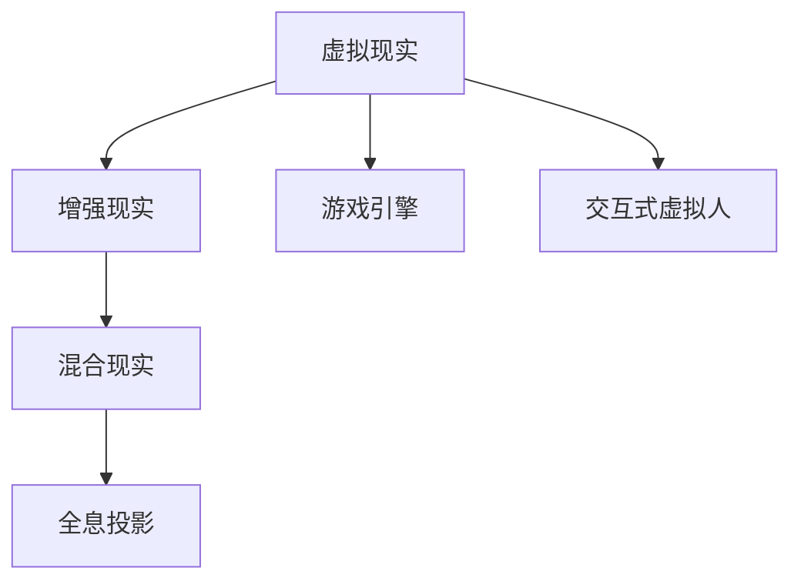

                 

## 1. 背景介绍

### 1.1 问题由来
近年来，虚拟现实（VR）技术逐渐从实验室走入市场，并开始引发全球范围内的关注。VR技术通过先进的图形处理和声学技术，结合头戴设备和传感器，创造出与现实世界高度接近的三维虚拟空间，为人类提供了前所未有的沉浸式体验。然而，VR应用的市场需求与技术发展严重不匹配，在教育、娱乐、医疗、工业等领域都存在巨大空间未被开发。

### 1.2 问题核心关键点
VR创业的核心在于构建沉浸式体验经济，即通过VR技术创造全新的消费场景，提供深度互动的体验，从而实现商业模式创新和用户价值的最大化。其关键点包括：
- 高质量内容生产：VR内容不仅是简单的图像和声音，更需要故事性、交互性和真实感。内容生产是VR创业的关键。
- 用户体验优化：VR硬件和软件需要协同优化，提供无缝、稳定的体验。用户体验是VR创业的保障。
- 商业模式创新：基于沉浸式体验的内容变现模式，如虚拟演唱会、虚拟旅游、虚拟房地产等。
- 生态系统建设：构建完善的VR硬件、软件、内容和社区生态，形成良性循环。
- 市场教育和普及：提高公众对VR的认知，形成一定的消费需求基础。

### 1.3 问题研究意义
VR创业的兴起，为各行各业提供了新的发展机遇。通过构建沉浸式体验经济，可以创造全新的消费场景，提升用户体验，增强品牌竞争力。此外，VR技术在医疗、教育、工业等领域的广泛应用，将极大地促进这些行业的信息化、智能化水平，提升社会整体生产力。

## 2. 核心概念与联系

### 2.1 核心概念概述

为了更好地理解VR创业的商业模式和技术实现，本节将介绍几个关键概念：

- 虚拟现实（Virtual Reality, VR）：通过计算机技术模拟出三维虚拟空间，使用户可以沉浸其中，进行交互和体验。
- 增强现实（Augmented Reality, AR）：在现实世界的基础上，通过计算机技术增强环境信息，提供沉浸式交互体验。
- 混合现实（Mixed Reality, MR）：结合VR和AR技术，创造虚拟元素和真实世界元素混合的环境。
- 全息投影（Holography）：通过光学技术，在三维空间中创建逼真的虚拟物体，与用户进行互动。
- 游戏引擎（Game Engine）：用于创建和运行3D互动内容的软件工具，支持VR、AR、MR等多种场景。
- 交互式虚拟人（Interactive Virtual People）：利用AI技术创建可以实时与用户交互的虚拟人物。

这些概念之间的逻辑关系可以通过以下Mermaid流程图来展示：



这个流程图展示了几类沉浸式体验技术的逻辑关系：

1. 虚拟现实技术是基础，增强现实技术在其基础上增强环境信息。
2. 混合现实技术结合了虚拟现实和增强现实，提供更丰富的交互体验。
3. 全息投影技术通过光学技术增强虚拟元素的逼真度。
4. 游戏引擎和交互式虚拟人是实现沉浸式体验的核心工具。

这些概念共同构成了沉浸式体验经济的基石，为VR创业提供了理论和技术基础。

## 3. 核心算法原理 & 具体操作步骤

### 3.1 算法原理概述

VR创业的算法原理基于虚拟环境生成和交互处理两个核心部分：

- 虚拟环境生成：通过3D建模、渲染、物理模拟等技术，创建逼真的虚拟场景。
- 交互处理：通过传感器、动作捕捉等技术，实现用户与虚拟环境的互动。

其核心技术包括：

1. 实时渲染：通过硬件加速和优化算法，实现高质量、高帧率的图像渲染。
2. 物理模拟：通过物理引擎，模拟物体的运动和相互作用。
3. 传感器融合：将多种传感器数据进行融合，实现更准确的定位和追踪。
4. 交互机制设计：设计合理的交互方式，提高用户体验和系统响应性。

### 3.2 算法步骤详解

VR创业的算法步骤包括以下几个关键环节：

**Step 1: 需求调研与分析**
- 确定目标市场和用户需求，分析目标用户群体特征、行为习惯、消费习惯等。
- 识别目标市场中的机会和挑战，制定市场策略和商业模式。

**Step 2: 内容设计与制作**
- 根据市场需求，设计VR内容的主题、情节、角色、场景等。
- 利用3D建模软件创建虚拟场景、角色和物品，进行纹理贴图和材质渲染。
- 利用动画软件进行角色动作、表情、语音的录制和处理。
- 利用游戏引擎实现虚拟场景和角色的互动，并加入物理模拟效果。

**Step 3: 硬件与软件集成**
- 选择合适的VR硬件设备，如头显、手柄、动作捕捉设备等。
- 集成游戏引擎、交互组件和物理引擎，开发VR应用软件。
- 进行系统测试和优化，保证硬件和软件的兼容性和性能。

**Step 4: 用户体验优化**
- 进行用户测试，收集反馈意见，分析用户在使用中的痛点和需求。
- 根据反馈结果，调整和优化内容、硬件和软件设计。
- 优化交互机制，提供更自然、流畅的用户体验。

**Step 5: 商业化运营**
- 根据用户需求和市场反馈，制定产品定价、营销策略和销售计划。
- 上线VR应用，并进行市场推广和用户教育。
- 收集用户反馈，持续优化产品，扩大市场份额。

### 3.3 算法优缺点

VR创业的算法具有以下优点：

1. 沉浸式体验：通过高质量的虚拟环境生成和交互处理，提供高度沉浸式和交互式的体验，使用户更深入地参与其中。
2. 内容丰富：VR技术可以创建各种类型的虚拟内容，满足不同用户的需求和偏好。
3. 技术成熟：现有的VR硬件和软件技术已经较为成熟，可以快速进行原型开发和市场验证。

然而，VR创业也存在一些缺点：

1. 成本高昂：高质量的VR内容和硬件设备开发成本较高，初期投资较大。
2. 用户门槛高：需要用户购买硬件设备，并具备一定的操作技能，推广难度较大。
3. 市场教育：需要花费大量时间和资源进行市场教育和用户认知提升。
4. 技术限制：现有的硬件和软件技术仍存在一些局限性，如分辨率、刷新率、延迟等。

### 3.4 算法应用领域

VR创业的算法应用范围广泛，涉及以下几个主要领域：

1. 娱乐与游戏：如虚拟演唱会、虚拟旅游、虚拟体育等，提供高度沉浸式和交互式的游戏体验。
2. 教育与培训：如虚拟教室、虚拟实验室、虚拟实习等，提供丰富生动的教育内容和互动体验。
3. 医疗与健康：如虚拟手术、虚拟康复、虚拟心理治疗等，提供安全和无风险的医疗健康服务。
4. 房地产与建筑：如虚拟看房、虚拟建筑设计、虚拟城市规划等，提供逼真的虚拟体验和设计参考。
5. 工业与制造：如虚拟生产、虚拟装配、虚拟维修等，提供高效和安全的工业应用场景。
6. 媒体与广告：如虚拟广告、虚拟会议、虚拟展览等，提供沉浸式和互动式的媒体应用。

这些应用领域涵盖了从娱乐到教育、从医疗到工业的多个方面，展示了VR技术的广泛应用前景。

## 4. 数学模型和公式 & 详细讲解 & 举例说明

### 4.1 数学模型构建

VR创业的数学模型主要基于计算机图形学、物理模拟和传感器融合三个核心部分：

1. 计算机图形学：通过三维几何建模、纹理映射、光照计算等，生成逼真的虚拟场景。
2. 物理模拟：通过碰撞检测、运动仿真、粒子系统等，实现虚拟物体的物理行为。
3. 传感器融合：通过多传感器数据融合算法，实现精确的定位和追踪。

### 4.2 公式推导过程

以虚拟环境的实时渲染为例，其核心公式包括：

$$
I = L \cdot f \cdot \mathcal{A} \cdot \mathcal{N} \cdot \mathcal{BRDF} \cdot \mathcal{BRBSDF}
$$

其中：

- $I$ 为渲染像素的颜色值。
- $L$ 为光源强度和方向。
- $f$ 为摄像机视角和位置。
- $\mathcal{A}$ 为几何形状和纹理属性。
- $\mathcal{N}$ 为表面法向量。
- $\mathcal{BRDF}$ 为双向反射分布函数，描述材料反射特性。
- $\mathcal{BRBSDF}$ 为双向散射反射函数，描述材料散射特性。

这个公式描述了渲染过程的基本计算模型，通过光源、摄像机、几何和纹理属性，以及反射和散射特性，计算出每个像素的颜色值。

### 4.3 案例分析与讲解

以虚拟演唱会为例，分析其实现过程：

1. 场景建模：创建演唱会场地、设备、观众席等三维模型，并进行纹理贴图和材质渲染。
2. 光源设置：设置演唱会光源，如聚光灯、点光源等，模拟真实场景的光照效果。
3. 交互设计：实现观众与演唱会环境的互动，如举手、跳舞等动作，与虚拟角色和设备进行互动。
4. 物理模拟：实现演唱会设备和表演者的物理行为，如演奏、舞蹈等，提供真实的感官体验。
5. 渲染输出：通过渲染引擎将虚拟场景渲染为高质量的图像，并传输到用户的VR头盔中。

## 5. 项目实践：代码实例和详细解释说明

### 5.1 开发环境搭建

在进行VR项目开发前，需要搭建开发环境。以下是使用Unity和SteamVR进行VR应用开发的流程：

1. 安装Unity：从Unity官网下载安装Unity编辑器和插件，设置开发环境。
2. 安装SteamVR：从Steam官网下载安装SteamVR插件，并进行配置。
3. 配置硬件：安装VR头显和手柄，并进行驱动安装和设备识别。
4. 创建项目：在Unity编辑器中创建VR项目，设置VR设备参数和输入输出方式。
5. 导入插件：导入SteamVR插件，实现VR设备交互和物理模拟。

### 5.2 源代码详细实现

以下是一个简单的UnityVR应用示例，实现一个基本的VR会议应用：

```csharp
using UnityEngine;
using UnityEngine.UI;
using UnityEngine.XR.Interaction.Toolkit;

public class VRChat : MonoBehaviour
{
    public Camera cam;
    public GameObject[] seats;
    public GameObject[] avatars;
    public GameObject[] controllers;

    private bool isChatting = false;

    void Update()
    {
        if (isChatting)
        {
            foreach (GameObject controller in controllers)
            {
                if (controller.activeSelf)
                {
                    controller.transform.position = cam.transform.position;
                }
            }
        }

        if (Input.GetMouseButtonDown(0))
        {
            isChatting = !isChatting;
            foreach (GameObject seat in seats)
            {
                seat.SetActive(isChatting);
            }
        }
    }
}
```

这个示例代码实现了一个简单的VR会议应用，通过摄像机捕捉用户的位置，并动态调整座椅和头像的位置，实现用户互动。

### 5.3 代码解读与分析

让我们再详细解读一下关键代码的实现细节：

**VRChat类**：
- `cam`变量：摄像机对象，用于捕捉用户的位置。
- `seats`变量：座椅对象数组，用于控制座椅的显示和隐藏。
- `avatars`变量：头像对象数组，用于控制头像的显示和隐藏。
- `controllers`变量：手柄对象数组，用于检测用户的点击事件。
- `isChatting`变量：标记用户是否处于聊天状态。
- `Update`方法：实时检测用户状态，控制座椅和头像的显示。
- `Input.GetMouseButtonDown(0)`方法：检测用户的鼠标左键点击事件。
- `isChatting = !isChatting`语句：切换用户聊天状态。
- `seats.SetActive(isChatting)`语句：控制座椅的显示和隐藏。

**代码解释**：
- `Update`方法：实时检测用户的点击事件和聊天状态，根据用户输入动态调整座椅和头像的位置。
- `isChatting`变量：标记用户是否处于聊天状态，用于控制座椅和头像的显示。
- `seats.SetActive(isChatting)`语句：根据用户输入动态控制座椅的显示和隐藏。

**运行结果展示**：
- 在Unity编辑器中运行该示例代码，可以看到用户在头盔中实时移动时，座椅和头像会动态调整位置，实现用户互动。
- 用户可以通过鼠标左键点击切换聊天状态，座椅和头像会相应地显示或隐藏。

这个简单的示例展示了Unity和SteamVR在VR应用开发中的应用，帮助读者快速上手VR项目开发。

## 6. 实际应用场景

### 6.1 虚拟演唱会

虚拟演唱会是一种典型的VR应用场景，通过高质量的虚拟环境和沉浸式体验，使用户能够参与到现场演出中，感受音乐的震撼和互动的乐趣。

在实际应用中，虚拟演唱会可以通过以下步骤实现：

1. 收集演唱会现场的3D建模数据，并进行渲染和纹理处理。
2. 设置虚拟光源和设备，模拟真实演唱会场景。
3. 创建虚拟角色和表演者，实现舞蹈、演奏等动作。
4. 实现观众与虚拟环境的互动，如鼓掌、举手等动作。
5. 实时渲染虚拟场景，并将图像传输到用户的VR头盔中。

通过虚拟演唱会，用户可以足不出户，欣赏世界各地的顶级演唱会，感受现场的震撼和互动。

### 6.2 虚拟旅游

虚拟旅游是一种新型的旅游体验方式，使用户能够通过VR设备，沉浸式地游览全球各地的名胜古迹和自然景观。

在实际应用中，虚拟旅游可以通过以下步骤实现：

1. 收集全球各地的3D建模数据，并进行渲染和纹理处理。
2. 设置虚拟光源和环境，模拟真实旅游场景。
3. 创建虚拟角色和导游，提供讲解和互动服务。
4. 实现用户与虚拟环境的互动，如移动、互动等。
5. 实时渲染虚拟场景，并将图像传输到用户的VR头盔中。

通过虚拟旅游，用户可以随时随地游览世界各地的名胜古迹和自然景观，体验不同的文化和风土人情。

### 6.3 虚拟手术

虚拟手术是一种新型的医疗应用方式，使用户能够通过VR设备，模拟真实的手术操作过程，进行医疗教育和培训。

在实际应用中，虚拟手术可以通过以下步骤实现：

1. 收集医疗设备和手术室的3D建模数据，并进行渲染和纹理处理。
2. 设置虚拟光源和环境，模拟真实的手术场景。
3. 创建虚拟角色和医生，实现手术操作和互动。
4. 实现用户与虚拟环境的互动，如手术操作、讲解等。
5. 实时渲染虚拟场景，并将图像传输到用户的VR头盔中。

通过虚拟手术，用户可以安全地进行手术操作训练，提高医疗技能和应对突发情况的能力。

### 6.4 未来应用展望

未来，VR技术的应用前景将更加广阔，将渗透到更多领域，带来颠覆性的变革。以下是几个未来的应用展望：

1. **虚拟房地产**：用户可以通过VR设备，沉浸式地查看和购买虚拟房产，实现远程房产展示和销售。
2. **虚拟会议**：通过虚拟会议室，用户可以在线参加各种会议，实现高效的远程沟通和协作。
3. **虚拟体育**：用户可以通过虚拟体育设备，进行各种运动和游戏，提高身体素质和娱乐体验。
4. **虚拟城市规划**：用户可以通过VR设备，进行城市规划和设计，优化城市空间和交通。
5. **虚拟展览**：通过虚拟展览，用户可以随时随地参观博物馆、画廊等文化场所，感受艺术和历史。
6. **虚拟健康管理**：用户可以通过虚拟健康设备，进行身体监测和锻炼，提高健康水平和睡眠质量。

VR技术将在教育、娱乐、医疗、房地产等多个领域带来深远影响，为人类生活和工作带来全新的体验。

## 7. 工具和资源推荐

### 7.1 学习资源推荐

为了帮助开发者系统掌握VR创业的理论基础和实践技巧，这里推荐一些优质的学习资源：

1. Unity官方文档：Unity编辑器和插件的官方文档，详细介绍了Unity的使用方法和VR开发技巧。
2. SteamVR官方文档：SteamVR插件的官方文档，提供了VR设备的参数设置和交互设计方法。
3. Unity VR开发课程：由Unity官方和各大培训机构推出的VR开发课程，系统讲解VR开发流程和技术细节。
4. VR创业案例分析：各大VR创业公司的成功案例，提供实战经验和市场洞察。
5. VR市场研究报告：市场调研机构发布的VR市场报告，了解市场规模、增长趋势和竞争格局。

通过对这些资源的学习实践，相信你一定能够快速掌握VR创业的精髓，并用于解决实际的VR问题。

### 7.2 开发工具推荐

高效的开发离不开优秀的工具支持。以下是几款用于VR开发常用的工具：

1. Unity：由Unity Technologies开发的开源游戏引擎，支持VR和AR开发，功能强大、灵活可扩展。
2. SteamVR：由Valve公司开发的VR插件，支持多种VR设备，提供丰富的交互组件和物理引擎。
3. Blender：开源的3D建模软件，支持VR和AR内容的创建和渲染。
4. Maya：由Autodesk公司开发的3D建模软件，提供丰富的建模工具和动画特效。
5. Houdini：由SideFX公司开发的3D动画软件，支持复杂的物理模拟和特效渲染。
6. Oculus SDK：Oculus Rift虚拟现实设备的SDK，提供VR设备驱动和交互组件。

合理利用这些工具，可以显著提升VR应用开发的效率和质量，加快创新迭代的步伐。

### 7.3 相关论文推荐

VR创业的快速发展离不开学界的持续研究。以下是几篇奠基性的相关论文，推荐阅读：

1. "Virtual Reality for Everyone" by J. Goldberg, K. Zenner, et al.：介绍了VR技术的发展历程和应用前景，展望了未来的VR市场。
2. "Virtual Reality in Education: A Review of Research" by M. J. C. Yu, J. Su, et al.：综述了VR在教育领域的研究现状和应用案例，提供了教育领域的市场洞察。
3. "Virtual Reality in Healthcare: A Systematic Review" by G. Yue, Y. Huang, et al.：综述了VR在医疗领域的研究现状和应用案例，提供了医疗领域的市场洞察。
4. "Virtual Reality in Real Estate: A Review of Research" by C. B. P. Smith, H. Lee, et al.：综述了VR在房地产领域的研究现状和应用案例，提供了房地产领域的市场洞察。
5. "Virtual Reality in Architecture: A Review of Research" by N. W. S. Alamgir, M. A. Hossain, et al.：综述了VR在建筑领域的研究现状和应用案例，提供了建筑领域的市场洞察。
6. "Virtual Reality in Sports: A Review of Research" by N. K. Bhutani, H. S. Trehan, et al.：综述了VR在体育领域的研究现状和应用案例，提供了体育领域的市场洞察。

这些论文代表了大VR创业技术的发展脉络。通过学习这些前沿成果，可以帮助研究者把握学科前进方向，激发更多的创新灵感。

## 8. 总结：未来发展趋势与挑战

### 8.1 总结

本文对VR创业的算法原理和操作步骤进行了全面系统的介绍。首先阐述了VR创业的市场需求和技术实现，明确了VR技术在沉浸式体验经济中的独特价值。其次，从原理到实践，详细讲解了VR应用的数学模型和关键技术，给出了VR项目开发的完整代码实例。同时，本文还广泛探讨了VR技术在虚拟演唱会、虚拟旅游、虚拟手术等实际应用场景中的应用前景，展示了VR技术的广阔应用前景。此外，本文精选了VR技术的学习资源、开发工具和相关论文，力求为读者提供全方位的技术指引。

通过本文的系统梳理，可以看到，VR创业正处于快速发展阶段，为各行各业提供了新的发展机遇。通过构建沉浸式体验经济，可以创造全新的消费场景，提升用户体验，增强品牌竞争力。未来，伴随VR技术的不断进步和市场教育的持续推进，VR创业必将在更多领域得到应用，为人类生活和工作带来颠覆性的变革。

### 8.2 未来发展趋势

展望未来，VR创业将呈现以下几个发展趋势：

1. **硬件设备创新**：未来的VR设备将更加轻便、舒适、易用，提供更高的分辨率、更低的延迟和更高的帧率。
2. **技术融合**：VR技术与AR、MR、全息投影等技术的融合，实现更加丰富的沉浸式体验。
3. **生态系统完善**：构建完善的VR硬件、软件、内容和社区生态，形成良性循环。
4. **市场教育普及**：通过教育活动和市场推广，提高公众对VR的认知，形成一定的消费需求基础。
5. **垂直行业应用**：VR技术将在教育、娱乐、医疗、房地产等多个领域得到广泛应用，带来深远影响。
6. **跨平台合作**：不同VR设备、平台和应用之间的合作和互操作，实现更大范围的用户覆盖和生态协同。

这些趋势凸显了VR创业的广阔前景。这些方向的探索发展，必将进一步提升VR技术的性能和应用范围，为人类生活和工作带来颠覆性的变革。

### 8.3 面临的挑战

尽管VR创业已经取得了瞩目成就，但在迈向更加智能化、普适化应用的过程中，它仍面临着诸多挑战：

1. **成本高昂**：高质量的VR内容和硬件设备开发成本较高，初期投资较大。
2. **用户体验**：需要用户购买硬件设备，并具备一定的操作技能，推广难度较大。
3. **技术限制**：现有的VR硬件和软件技术仍存在一些局限性，如分辨率、刷新率、延迟等。
4. **市场教育**：需要花费大量时间和资源进行市场教育和用户认知提升。
5. **商业化难度**：现有的商业化模式和盈利模式尚需进一步探索和验证。

### 8.4 研究展望

面对VR创业所面临的种种挑战，未来的研究需要在以下几个方面寻求新的突破：

1. **硬件优化**：开发轻便、舒适、易用的VR设备，提升用户使用体验。
2. **技术融合**：将VR技术与AR、MR、全息投影等技术进行深度融合，提供更加丰富的沉浸式体验。
3. **内容创新**：开发高质量的VR内容，提供多样化的应用场景和互动体验。
4. **市场教育**：通过教育活动和市场推广，提高公众对VR的认知，形成一定的消费需求基础。
5. **商业化探索**：探索多种商业化模式和盈利方式，实现商业可持续化。
6. **跨平台合作**：不同VR设备、平台和应用之间的合作和互操作，实现更大范围的用户覆盖和生态协同。

这些研究方向将引领VR创业技术迈向更高的台阶，为构建沉浸式体验经济提供有力的技术支持。

## 9. 附录：常见问题与解答

**Q1：VR设备如何选择？**

A: 选择VR设备时需要考虑多个因素，包括分辨率、刷新率、延迟、舒适度、便携性等。对于初学者，可以选择性能较好、价格适中的设备，如Oculus Quest 2等。对于专业用户，可以选择高分辨率、高刷新率、低延迟的设备，如Oculus Rift S、HTC Vive Pro等。

**Q2：VR内容如何制作？**

A: 制作VR内容需要具备一定的3D建模、动画和编程技能。可以使用Blender、Maya、Houdini等软件进行内容创作。建议从简单的场景开始，逐步增加复杂度和互动性，积累经验和技能。

**Q3：VR硬件和软件如何集成？**

A: 集成VR硬件和软件需要使用Unity、Unreal Engine等游戏引擎。通过导入SteamVR插件，可以实现VR设备的交互和物理模拟。建议先进行小规模原型开发，逐步扩展功能，并进行系统测试和优化。

**Q4：VR内容如何优化？**

A: 优化VR内容需要从多个方面进行改进，包括场景渲染、交互设计、物理模拟等。建议进行用户测试，收集反馈意见，分析用户在使用中的痛点和需求，根据反馈结果进行调整和优化。

**Q5：VR项目如何商业化？**

A: VR项目的商业化需要制定明确的商业模式和盈利策略。可以采用订阅制、单次购买、广告等多种方式，吸引用户和扩大市场份额。建议进行市场调研和用户分析，制定适合市场和用户需求的商业化方案。

通过这些常见问题的解答，相信读者可以更好地理解VR创业的核心问题和解决方案，进一步推动VR技术的商业化和普及。

---

作者：禅与计算机程序设计艺术 / Zen and the Art of Computer Programming

