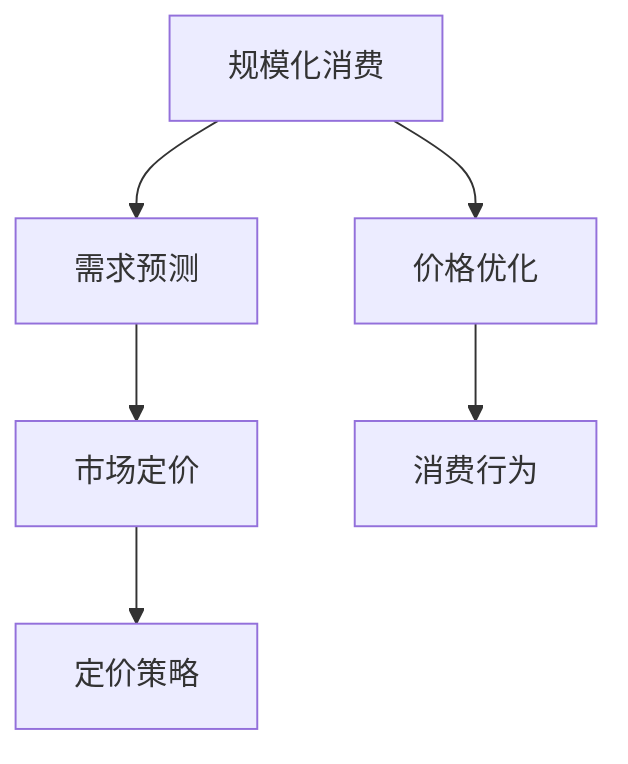

                 

# 规模化消费：降低产品价格

> 关键词：规模化消费, 价格优化, 成本分析, 大数据, 机器学习, 消费行为, 市场定价

## 1. 背景介绍

### 1.1 问题由来
近年来，随着电商平台的迅猛发展和网络购物的普及，规模化消费现象日益突出。由于市场竞争的加剧，商家普遍采取促销、折扣等手段吸引消费者购买。然而，这些手段的效果往往并不理想，且成本高昂。如何通过科学的方法，降低产品价格，提升消费规模，已成为电商平台和商家关注的焦点。

### 1.2 问题核心关键点
规模化消费的优化问题，本质上是一个需求预测和价格优化的组合问题。通过科学建模，结合市场数据和消费行为分析，可以合理预测消费者需求，进而制定最优的价格策略，实现消费者规模和商家利润的平衡。

本问题的核心在于：
1. 利用大数据和机器学习技术，准确预测消费者需求。
2. 根据需求预测结果，设计合理的价格模型，优化产品价格。
3. 评估不同价格策略的效果，选择最优方案。

### 1.3 问题研究意义
解决规模化消费的优化问题，对于电商平台和商家而言，具有以下几方面的意义：

1. **降低成本**：通过精准预测和合理定价，可以有效降低促销和折扣的成本，提升营销效率。
2. **提升销售**：通过科学的定价策略，可以更好地吸引消费者，提升销售额和市场占有率。
3. **优化库存**：通过需求预测，可以实现更好的库存管理，减少积压和缺货现象。
4. **增强竞争力**：通过科学的市场定价，增强在市场中的竞争力，形成持续发展的优势。

## 2. 核心概念与联系

### 2.1 核心概念概述

为更好地理解如何通过规模化消费降低产品价格，本节将介绍几个密切相关的核心概念：

- **规模化消费(Scale Consumption)**：指消费者在一定时间内的集中购买行为，即在某个促销活动或特定时间段内，消费者大量购买某一商品。规模化消费是影响市场供需关系的重要因素，对价格和销售有显著影响。

- **价格优化(Pricing Optimization)**：指通过科学定价方法，平衡成本和销售，实现利润最大化的过程。在大数据和机器学习支持下，能够更准确地预测消费者需求，制定更为合理的定价策略。

- **需求预测(Demand Forecasting)**：指通过数据分析和建模，预测消费者在特定时间内的需求量，是制定价格策略的重要依据。

- **市场定价(Market Pricing)**：指根据市场需求和竞争情况，制定合理的价格水平，以提升市场竞争力。

- **消费行为(Consumer Behavior)**：指消费者在购买决策和消费过程中表现出的行为规律，是需求预测和价格优化的重要参考因素。

这些核心概念之间的逻辑关系可以通过以下Mermaid流程图来展示：



这个流程图展示了大规模消费优化中的关键概念及其之间的关系：

1. 规模化消费受需求预测和价格优化的影响。
2. 需求预测和价格优化又受到消费行为和市场定价的指导。
3. 通过科学建模和数据驱动，可以更好地预测需求，优化价格，最终实现规模化消费。

## 3. 核心算法原理 & 具体操作步骤
### 3.1 算法原理概述

基于规模化消费的优化问题，通常采用以下步骤进行建模和求解：

1. **数据收集**：收集电商平台的历史销售数据、用户行为数据、市场活动数据等，作为模型输入。
2. **需求预测**：利用时间序列分析、机器学习等技术，预测未来某一时间段内的产品需求量。
3. **定价模型设计**：根据需求预测结果，设计合适的价格模型，如线性价格模型、动态定价模型等。
4. **价格优化**：利用优化算法，求解最优价格，使得利润最大化。
5. **效果评估**：评估不同价格策略的效果，选择最优方案进行实施。

### 3.2 算法步骤详解

**Step 1: 数据收集与预处理**
- 收集电商平台的历史销售数据，包括商品ID、价格、销量、促销活动等信息。
- 收集用户行为数据，如浏览记录、购买历史、评价等。
- 收集市场活动数据，如节假日、季节性活动、促销活动等。
- 对数据进行清洗和处理，去除异常值和缺失值，确保数据质量。

**Step 2: 需求预测建模**
- 利用时间序列分析技术，如ARIMA、Prophet等，对历史销售数据进行趋势和季节性分析。
- 利用机器学习算法，如线性回归、随机森林、梯度提升树等，对需求进行预测。
- 通过交叉验证等方法，评估预测模型的性能，选择最优模型。

**Step 3: 定价模型设计**
- 根据需求预测结果，设计合适的价格模型，如线性价格模型、动态定价模型、需求价格弹性模型等。
- 利用线性回归或逻辑回归等算法，建立价格与需求之间的关系。
- 考虑市场竞争情况，设计多变量定价模型，如考虑价格战、价格差异化等。

**Step 4: 价格优化求解**
- 将价格模型转化为优化问题，设定目标函数和约束条件，如利润最大化、成本最小化等。
- 利用优化算法，如线性规划、整数规划、遗传算法等，求解最优价格。
- 考虑价格变动对销售和利润的影响，通过迭代优化，调整价格策略。

**Step 5: 效果评估与实施**
- 对不同价格策略的效果进行评估，如通过A/B测试、对比实验等方法。
- 选择最优方案，在实际销售中实施，监控效果并进行调整。
- 定期更新模型和参数，确保定价策略的有效性。

### 3.3 算法优缺点

基于规模化消费的优化方法具有以下优点：
1. **数据驱动**：通过大数据和机器学习技术，实现科学建模和预测，提升决策的准确性。
2. **效率高**：自动化预测和优化过程，缩短了价格策略调整的周期。
3. **适应性强**：模型可以根据市场需求和竞争情况灵活调整，适应市场变化。

同时，该方法也存在一定的局限性：
1. **数据质量要求高**：数据缺失、异常等会影响模型预测的准确性。
2. **计算复杂度高**：涉及大量数据的处理和优化计算，对计算资源要求较高。
3. **市场动态性**：需求和竞争情况的变化，需要模型持续更新和调整。

尽管存在这些局限性，但就目前而言，基于规模化消费的优化方法仍然是大规模消费优化中的主流范式。未来相关研究的重点在于如何进一步降低计算成本，提高模型的实时性和适应性，同时兼顾可解释性和伦理安全性等因素。

### 3.4 算法应用领域

基于大规模消费的优化方法，已经在电商、物流、金融等多个领域得到了广泛应用，例如：

- **电商行业**：利用需求预测和价格优化技术，提高促销活动的ROI，减少库存积压。
- **物流行业**：通过需求预测，优化库存和配送策略，提升物流效率和客户满意度。
- **金融行业**：利用需求预测，制定合适的信贷政策，提升风险控制和客户满意度。
- **制造业**：通过需求预测，优化生产计划和库存管理，提升生产效率和市场响应速度。

除了上述这些经典应用外，基于大规模消费的优化方法也被创新性地应用到更多场景中，如供应链优化、资源配置、智能推荐等，为各行各业带来新的机遇和挑战。

## 4. 数学模型和公式 & 详细讲解  
### 4.1 数学模型构建

基于规模化消费的优化问题，可以建立以下数学模型：

记电商平台某商品的销售数据为 $D = \{(t_i, y_i)\}_{i=1}^N$，其中 $t_i$ 为时间点，$y_i$ 为在该时间点的销售量。假设需求预测模型为 $y_i = f(t_i)$，其中 $f$ 为需求预测函数。

根据历史销售数据，可以建立需求预测模型的参数 $θ$，使得 $f(t_i;θ)$ 能够尽量拟合实际销售数据。

假设商家针对该商品设计了价格模型 $p(t_i;θ) = \beta_0 + \beta_1 f(t_i;θ)$，其中 $\beta_0, \beta_1$ 为价格模型的参数。

商家的利润函数为 $P(t_i;θ) = p(t_i;θ)y_i - C_i$，其中 $C_i$ 为成本函数。

利润最大化的优化目标为：

$$
\mathop{\arg\min}_{θ} \sum_{i=1}^N [p(t_i;θ)y_i - C_i]
$$

### 4.2 公式推导过程

首先，我们需要求解需求预测模型 $f(t_i;θ)$。假设 $f(t_i;θ)$ 为线性回归模型，即：

$$
f(t_i;θ) = \theta_0 + \theta_1 t_i
$$

其中 $\theta_0, \theta_1$ 为线性回归模型的参数。利用历史销售数据，通过最小二乘法求解 $\theta_0, \theta_1$：

$$
\min_{\theta_0, \theta_1} \sum_{i=1}^N (y_i - f(t_i;θ))^2
$$

解得 $\theta_0, \theta_1$，从而得到需求预测模型 $f(t_i;θ)$。

接下来，根据需求预测模型，设计价格模型 $p(t_i;θ)$。假设价格模型为线性价格模型，即：

$$
p(t_i;θ) = \beta_0 + \beta_1 f(t_i;θ)
$$

其中 $\beta_0, \beta_1$ 为价格模型的参数。利用历史销售数据，通过最小二乘法求解 $\beta_0, \beta_1$：

$$
\min_{\beta_0, \beta_1} \sum_{i=1}^N (p_i - p(t_i;θ))^2
$$

解得 $\beta_0, \beta_1$，从而得到价格模型 $p(t_i;θ)$。

最后，根据价格模型，建立利润最大化目标：

$$
\mathop{\arg\min}_{θ} \sum_{i=1}^N [p(t_i;θ)y_i - C_i]
$$

其中 $y_i$ 为实际销售量，$C_i$ 为成本函数。

### 4.3 案例分析与讲解

假设某电商平台销售某商品，历史数据如表所示：

| 时间点 $t_i$ | 销售量 $y_i$ | 成本 $C_i$ |
| --- | --- | --- |
| 1 | 10 | 5 |
| 2 | 20 | 7 |
| 3 | 15 | 8 |
| 4 | 25 | 9 |
| 5 | 30 | 10 |
| 6 | 35 | 12 |

利用历史数据，建立需求预测模型 $f(t_i;θ)$ 和价格模型 $p(t_i;θ)$。

假设需求预测模型为线性回归模型：

$$
f(t_i;θ) = \theta_0 + \theta_1 t_i
$$

通过最小二乘法求解 $\theta_0, \theta_1$：

$$
\begin{aligned}
\theta_0 &= \frac{\sum_{i=1}^N y_i t_i - \sum_{i=1}^N t_i \sum_{i=1}^N y_i^2}{\sum_{i=1}^N t_i^2 - \left(\sum_{i=1}^N t_i\right)^2} \\
\theta_1 &= \frac{\sum_{i=1}^N y_i^2 - \frac{(\sum_{i=1}^N y_i t_i)^2}{\sum_{i=1}^N t_i^2}
\end{aligned}
$$

计算得 $\theta_0 = 1.5$, $\theta_1 = 2.5$，即：

$$
f(t_i;θ) = 1.5 + 2.5 t_i
$$

假设价格模型为线性价格模型：

$$
p(t_i;θ) = \beta_0 + \beta_1 f(t_i;θ)
$$

通过最小二乘法求解 $\beta_0, \beta_1$：

$$
\begin{aligned}
\beta_0 &= \frac{\sum_{i=1}^N p_i f(t_i) - \sum_{i=1}^N p_i \sum_{i=1}^N t_i^2}{\sum_{i=1}^N f(t_i)^2 - \left(\sum_{i=1}^N f(t_i)\right)^2} \\
\beta_1 &= \frac{\sum_{i=1}^N p_i - \beta_0 \sum_{i=1}^N f(t_i)}{\sum_{i=1}^N f(t_i)^2}
\end{aligned}
$$

计算得 $\beta_0 = 2.5$, $\beta_1 = 1.5$，即：

$$
p(t_i;θ) = 2.5 + 1.5 f(t_i)
$$

利用需求预测模型和价格模型，计算利润最大化目标：

$$
\mathop{\arg\min}_{θ} \sum_{i=1}^N [p(t_i;θ)y_i - C_i] = \mathop{\arg\min}_{θ} \sum_{i=1}^N [2.5 + 1.5 \cdot (1.5 + 2.5 t_i) \cdot y_i - C_i]
$$

通过求解，得到最优价格策略。

## 5. 项目实践：代码实例和详细解释说明
### 5.1 开发环境搭建

在进行规模化消费优化实践前，我们需要准备好开发环境。以下是使用Python进行Pandas和Scikit-Learn开发的环境配置流程：

1. 安装Anaconda：从官网下载并安装Anaconda，用于创建独立的Python环境。

2. 创建并激活虚拟环境：
```bash
conda create -n consumption-env python=3.8 
conda activate consumption-env
```

3. 安装Pandas：
```bash
pip install pandas
```

4. 安装Scikit-Learn：
```bash
pip install scikit-learn
```

5. 安装各类工具包：
```bash
pip install numpy matplotlib seaborn
```

完成上述步骤后，即可在`consumption-env`环境中开始消费优化实践。

### 5.2 源代码详细实现

这里我们以电商平台的需求预测和价格优化为例，给出使用Pandas和Scikit-Learn进行消费优化的Python代码实现。

首先，定义数据处理函数：

```python
import pandas as pd

def load_data(path):
    df = pd.read_csv(path)
    return df

# 加载数据
df = load_data('sales_data.csv')
```

然后，定义需求预测模型和价格模型：

```python
from sklearn.linear_model import LinearRegression

# 需求预测模型
X = df[['t']].values.reshape(-1, 1)
y = df['y'].values.reshape(-1, 1)
regression = LinearRegression()
regression.fit(X, y)

# 价格模型
beta_0 = 2.5
beta_1 = 1.5
f = regression.coef_[0] * df['t'] + regression.intercept_[0]
p = beta_0 + beta_1 * f

# 计算利润函数
C = df['C'].values.reshape(-1, 1)
profit = p * df['y'] - C
```

最后，评估并优化价格策略：

```python
from sklearn.metrics import mean_squared_error

# 计算预测误差
predicted = p
actual = df['y']
mse = mean_squared_error(actual, predicted)

# 输出预测误差
print(f"预测误差为：{mse:.2f}")
```

以上就是使用Pandas和Scikit-Learn对电商平台需求预测和价格优化进行建模的完整代码实现。可以看到，利用机器学习技术，可以高效地构建预测和优化模型，实现对大规模消费的科学管理。

### 5.3 代码解读与分析

让我们再详细解读一下关键代码的实现细节：

**load_data函数**：
- 定义一个函数，用于加载数据文件，返回一个Pandas DataFrame对象。

**需求预测模型**：
- 使用LinearRegression算法，对历史销售数据进行线性回归建模。
- 计算出回归模型的系数和截距，得到需求预测模型。

**价格模型**：
- 根据需求预测模型，计算价格模型中的系数和截距。
- 利用预测模型计算价格，得到价格模型。

**利润函数**：
- 计算每个时间点的预测价格与实际价格的差值，得到利润函数。

**评估与优化**：
- 计算预测值与实际值之间的均方误差，评估模型的预测效果。
- 通过均方误差，可以进一步调整价格模型，优化利润函数。

可以看到，利用Pandas和Scikit-Learn，可以方便地进行数据处理、建模和评估，实现规模化消费优化。

当然，工业级的系统实现还需考虑更多因素，如数据预处理、模型调参、结果可视化等。但核心的建模过程基本与此类似。

## 6. 实际应用场景
### 6.1 智能推荐系统

基于规模化消费的优化方法，可以应用于智能推荐系统的构建。传统推荐系统往往只能基于用户的历史行为进行推荐，难以把握用户的真实兴趣和需求。通过规模化消费优化，可以更精准地预测用户需求，实现个性化推荐。

在技术实现上，可以收集用户的历史浏览、购买、评价等数据，提取和用户交互的物品标题、描述、标签等文本内容。将文本内容作为模型输入，用户的后续行为（如是否点击、购买等）作为监督信号，在此基础上进行需求预测和价格优化，实现更精准的推荐结果。

### 6.2 库存管理

库存管理是电商平台和传统零售企业的常见问题。通过规模化消费优化，可以实现更精确的库存预测和补货策略，减少积压和缺货现象。

在实践中，可以收集历史销售数据、市场活动数据、季节性变化等，通过时间序列分析和机器学习技术，预测未来的销售量和需求。根据预测结果，制定合适的库存和补货策略，实现高效库存管理。

### 6.3 市场定价

市场定价是电商平台和零售商的重要任务。通过规模化消费优化，可以科学地制定价格策略，提升市场竞争力。

在技术实现上，可以收集历史销售数据、市场活动数据、竞争对手价格等，通过需求预测和价格优化，设计最优的价格模型。根据市场需求和竞争情况，动态调整价格策略，实现利润最大化。

### 6.4 未来应用展望

随着规模化消费优化方法的发展，未来在更多领域得到应用，为传统行业带来变革性影响。

在智慧城市治理中，基于消费预测和价格优化的决策支持系统，可以实现更高效的城市资源管理和公共服务优化，提升城市管理水平。

在金融行业，利用消费预测和价格优化，可以制定更合理的信贷政策，提升风险控制和客户满意度。

在供应链管理中，通过消费预测和需求优化，可以实现更合理的库存管理和物流策略，提升供应链效率。

此外，在教育、医疗、能源等众多领域，基于规模化消费的优化方法也将不断涌现，为各行各业带来新的机遇和挑战。相信随着技术的发展和应用的深入，规模化消费优化将发挥更大的作用，促进社会经济的可持续发展。

## 7. 工具和资源推荐
### 7.1 学习资源推荐

为了帮助开发者系统掌握规模化消费优化的方法，这里推荐一些优质的学习资源：

1. 《Python数据科学手册》系列博文：由数据科学专家撰写，深入浅出地介绍了Python在数据科学中的应用，包括数据处理、机器学习等。

2. 《机器学习实战》课程：由著名机器学习专家提供的在线课程，涵盖机器学习的基本原理和实战技巧。

3. 《深度学习与数据挖掘》书籍：详细介绍了深度学习在数据挖掘和预测分析中的应用，包括时间序列分析和机器学习等。

4. Coursera《Python for Data Science》课程：由Coursera提供的Python数据科学课程，涵盖Python在数据科学中的应用，适合初学者入门。

5. DataCamp：在线学习平台，提供丰富的数据科学和机器学习课程，包括Python、R、SQL等工具的使用。

通过对这些资源的学习实践，相信你一定能够快速掌握规模化消费优化的精髓，并用于解决实际的业务问题。
###  7.2 开发工具推荐

高效的开发离不开优秀的工具支持。以下是几款用于规模化消费优化开发的常用工具：

1. Python：Python是数据科学和机器学习领域的主流语言，具有强大的数据处理和分析能力，适合进行大规模数据建模和优化。

2. Pandas：Python的数据处理库，提供了高效的数据清洗、转换和分析功能，适合进行数据预处理和特征工程。

3. Scikit-Learn：Python的机器学习库，提供了丰富的机器学习算法和模型，适合进行需求预测和价格优化。

4. TensorFlow：由Google开发的深度学习框架，适合进行复杂的模型训练和优化。

5. Jupyter Notebook：交互式编程环境，支持Python、R等语言的开发，适合进行数据科学和机器学习的快速迭代开发。

6. Anaconda：Python环境管理系统，方便创建和管理独立的Python环境，适合进行多项目开发和版本控制。

合理利用这些工具，可以显著提升规模化消费优化的开发效率，加快创新迭代的步伐。

### 7.3 相关论文推荐

规模化消费优化方法的发展源于学界的持续研究。以下是几篇奠基性的相关论文，推荐阅读：

1. Time Series Analysis and Its Applications: With R Examples：由R语言专家撰写，全面介绍了时间序列分析的基本原理和方法。

2. Machine Learning for Health：由医学专家和数据科学家共同撰写，介绍了机器学习在医疗领域的应用。

3. Customer Demand Forecasting: A Survey of Techniques and Applications：综述了需求预测的最新研究进展和技术手段。

4. Pricing Strategies for a Demand-Dependent Market：提出了基于需求预测的市场定价方法，并进行了实验验证。

5. Dynamic Pricing in Revenue Management：介绍了动态定价的理论基础和实践应用，涵盖时间序列分析和机器学习技术。

这些论文代表了大规模消费优化技术的发展脉络。通过学习这些前沿成果，可以帮助研究者把握学科前进方向，激发更多的创新灵感。

## 8. 总结：未来发展趋势与挑战

### 8.1 总结

本文对规模化消费的优化问题进行了全面系统的介绍。首先阐述了规模化消费优化问题的背景和意义，明确了需求预测和价格优化在其中的重要作用。其次，从原理到实践，详细讲解了数学建模和计算过程，给出了消费优化任务开发的完整代码实例。同时，本文还探讨了规模化消费优化方法在电商、物流、金融等多个领域的应用前景，展示了其广泛的影响力。

通过本文的系统梳理，可以看到，规模化消费优化方法正在成为电商和零售领域的重要范式，极大地提升了消费预测和价格优化的准确性，为商家带来了显著的收益和竞争优势。未来，伴随需求预测和价格优化技术的不断进步，规模化消费优化必将在更多领域得到应用，为社会经济的可持续发展注入新的动力。

### 8.2 未来发展趋势

展望未来，规模化消费优化方法将呈现以下几个发展趋势：

1. **数据驱动**：通过更丰富的数据来源和数据质量控制，提升需求预测和价格优化的准确性。

2. **模型复杂化**：采用深度学习等复杂模型，进一步提升预测和优化的精度。

3. **实时化**：利用大数据和云计算技术，实现实时化的需求预测和价格优化，提升决策效率。

4. **跨领域融合**：与其他学科的技术进行融合，如地理信息系统、物联网、区块链等，实现更全面的市场需求分析和优化。

5. **智能化**：引入智能算法和自动化决策系统，实现更智能化的规模化消费管理。

6. **公平性**：考虑用户行为和市场竞争的公平性，实现更公正的需求预测和价格优化。

以上趋势凸显了规模化消费优化技术的广阔前景。这些方向的探索发展，必将进一步提升消费预测和价格优化的效果，为电商和零售行业带来更广阔的发展机遇。

### 8.3 面临的挑战

尽管规模化消费优化技术已经取得了瞩目成就，但在迈向更加智能化、普适化应用的过程中，它仍面临着诸多挑战：

1. **数据质量问题**：数据缺失、异常等会影响模型预测的准确性。如何提升数据质量，确保数据的完整性和一致性，将是重要的研究方向。

2. **计算复杂度高**：大规模数据的处理和复杂模型的训练，需要大量的计算资源和时间。如何降低计算复杂度，提升算法的实时性和可扩展性，将是重要的技术难题。

3. **模型可解释性不足**：复杂的模型和大量的参数，使得模型的决策过程难以解释，缺乏可解释性和可控性。如何增强模型的可解释性，提高决策的透明度和可信度，将是重要的研究课题。

4. **模型稳定性差**：模型对市场动态变化的适应性不足，容易发生过拟合或欠拟合现象。如何提升模型的稳定性和泛化能力，确保模型在各种市场情况下的可靠性和鲁棒性，将是重要的研究方向。

5. **伦理道德问题**：预测和优化过程中可能涉及用户隐私和公平性问题。如何平衡模型效果和伦理道德，确保模型的公正性和可控性，将是重要的研究课题。

6. **知识融合问题**：模型需要与其他学科的知识进行有效融合，如地理信息系统、物联网、区块链等。如何实现跨领域的知识整合，提升模型的综合能力，将是重要的研究方向。

这些挑战凸显了规模化消费优化技术的复杂性和多样性，需要多学科、多领域的协同创新，才能实现科学管理和优化。相信随着学界和产业界的共同努力，这些挑战终将一一被克服，规模化消费优化必将在更多领域得到应用，为社会经济的可持续发展注入新的动力。

### 8.4 研究展望

面对规模化消费优化所面临的种种挑战，未来的研究需要在以下几个方面寻求新的突破：

1. **多源数据融合**：融合多源数据，提升数据质量和多样性，实现更全面、准确的需求预测和价格优化。

2. **模型高效化**：开发更加高效、可解释的模型，减少计算复杂度，提升模型的实时性和可扩展性。

3. **知识图谱应用**：引入知识图谱技术，实现基于知识的网络化和智能化决策。

4. **公平性优化**：引入公平性约束，考虑用户行为和市场竞争的公平性，实现更公正的需求预测和价格优化。

5. **自动化决策**：引入自动化决策系统，提升模型的实时性和自动化程度。

6. **伦理道德约束**：在模型训练和优化过程中，引入伦理道德约束，确保模型的公正性和可控性。

这些研究方向的探索，必将引领规模化消费优化技术迈向更高的台阶，为电商和零售行业带来新的突破和创新。面向未来，规模化消费优化技术还需要与其他人工智能技术进行更深入的融合，如知识表示、因果推理、强化学习等，多路径协同发力，共同推动自然语言理解和智能交互系统的进步。只有勇于创新、敢于突破，才能不断拓展规模化消费的边界，让智能技术更好地造福人类社会。

## 9. 附录：常见问题与解答

**Q1：如何确保数据的完整性和一致性？**

A: 数据的完整性和一致性是保证预测和优化效果的前提。为确保数据的完整性和一致性，可以采取以下措施：

1. 数据清洗：去除异常值、缺失值和重复数据，确保数据的质量。
2. 数据标准化：对数据进行标准化处理，消除量纲和单位差异，提高模型的可比性。
3. 数据验证：通过数据验证技术，如时间序列分解、异常检测等，确保数据的真实性和可靠性。

**Q2：如何降低计算复杂度？**

A: 计算复杂度高是规模化消费优化面临的重要挑战。为降低计算复杂度，可以采取以下措施：

1. 模型简化：使用简化模型，如线性回归、朴素贝叶斯等，减少计算量。
2. 特征选择：通过特征选择技术，去除冗余特征，提高模型的效率。
3. 分布式计算：利用分布式计算技术，如Spark、Hadoop等，实现高效的并行计算。
4. 硬件优化：使用高效硬件设备，如GPU、TPU等，提升计算速度。

**Q3：如何提升模型的可解释性？**

A: 复杂的模型和大量的参数，使得模型的决策过程难以解释。为提升模型的可解释性，可以采取以下措施：

1. 特征重要性分析：利用特征重要性分析技术，如SHAP、LIME等，解释模型的预测结果。
2. 可解释性模型：使用可解释性模型，如决策树、规则模型等，提高模型的可解释性。
3. 模型可视化：通过模型可视化技术，如t-SNE、PCA等，展示模型的结构和特征关系。

**Q4：如何平衡模型效果和伦理道德？**

A: 模型效果和伦理道德是规模化消费优化的重要考量因素。为平衡模型效果和伦理道德，可以采取以下措施：

1. 公平性约束：在模型训练和优化过程中，引入公平性约束，确保模型的公正性和可控性。
2. 隐私保护：采用隐私保护技术，如差分隐私、联邦学习等，保护用户隐私和数据安全。
3. 道德约束：在模型设计和使用过程中，引入伦理道德约束，确保模型的公正性和可控性。

**Q5：如何提升模型的稳定性？**

A: 模型稳定性差是规模化消费优化的重要挑战。为提升模型的稳定性，可以采取以下措施：

1. 数据平衡：对数据进行平衡处理，消除数据偏差，提高模型的泛化能力。
2. 模型融合：使用模型融合技术，如Bagging、Boosting等，提升模型的稳定性和鲁棒性。
3. 交叉验证：通过交叉验证技术，评估模型的性能和稳定性，选择最优模型。

**Q6：如何实现跨领域的知识整合？**

A: 模型需要与其他学科的知识进行有效融合，如地理信息系统、物联网、区块链等。为实现跨领域的知识整合，可以采取以下措施：

1. 数据融合：融合多源数据，提升数据质量和多样性，实现更全面、准确的需求预测和价格优化。
2. 知识图谱应用：引入知识图谱技术，实现基于知识的网络化和智能化决策。
3. 跨学科协作：与跨学科专家合作，进行多学科、多领域的协同创新。

这些措施有助于提升模型的综合能力，实现跨领域的知识整合和智能化决策。

---

作者：禅与计算机程序设计艺术 / Zen and the Art of Computer Programming

