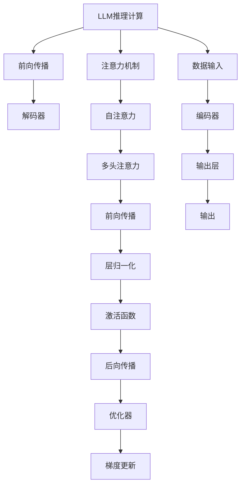

                 

# 解密LLM的推理机制：与CPU时钟周期的异同

## 1. 背景介绍

### 1.1 问题由来
近年来，大规模语言模型（Large Language Models, LLMs）在自然语言处理（NLP）领域取得了显著进展，成为深度学习领域的一大热点。这些模型如GPT-3、BERT等，通过自监督预训练和大规模有标签数据微调，展现了强大的语言理解和生成能力。但与此同时，这些大模型的推理机制和CPU时钟周期的异同一直是研究的热点和难点。

### 1.2 问题核心关键点
为了深入理解LLM的推理机制，本文将详细探讨其与CPU时钟周期的异同，重点关注以下几点：
1. **推理计算的实现方式**：LLM如何高效地进行推理计算，与CPU时钟周期的计算机制有何不同？
2. **推理计算的资源消耗**：LLM的推理计算需要哪些硬件资源，与CPU相比有何区别？
3. **推理计算的优化策略**：LLM在推理计算中采用了哪些优化技术，是否适用于CPU架构？
4. **推理计算的应用场景**：LLM在哪些应用场景中表现优异，与CPU有何区别？

### 1.3 问题研究意义
深入理解LLM的推理机制与CPU时钟周期的异同，有助于优化LLM的推理性能，提升其在各种应用场景中的效率和效果。同时，这一研究也有助于推动LLM技术的进一步发展，为未来更高效、更强大的语言模型提供理论支撑。

## 2. 核心概念与联系

### 2.1 核心概念概述

为了更好地理解LLM的推理机制与CPU时钟周期的异同，我们需要首先了解几个核心概念：

- **大规模语言模型（LLM）**：通过自监督预训练和有标签数据微调，具有强大的语言理解和生成能力。常用的预训练模型如BERT、GPT等。
- **推理计算（Inference）**：模型在给定输入的情况下，计算并输出预测结果的过程。对于LLM而言，推理计算通常包括前向传播、注意力机制、解码器等步骤。
- **CPU时钟周期**：中央处理器（CPU）执行指令的基本时间单位，每个时钟周期通常完成一个基本操作（如加、减、乘、除等）。CPU通过时钟周期实现并行计算，提升处理速度。

### 2.2 核心概念原理和架构的 Mermaid 流程图



这个流程图展示了LLM推理计算的基本流程：

1. 数据输入（M）。
2. 编码器（N）。
3. 前向传播（B），包含自注意力（E）、多头注意力（F）、层归一化（H）和激活函数（I）。
4. 后向传播（J）和梯度更新（L）。
5. 输出（P）。

其中，注意力机制和解码器是LLM推理计算的核心部分，通过并行计算加速，提升推理效率。

## 3. 核心算法原理 & 具体操作步骤

### 3.1 算法原理概述

LLM的推理计算与CPU时钟周期的计算机制存在显著差异。CPU通过时钟周期进行并行计算，而LLM的推理计算则依赖于模型架构和算法优化。以下将详细阐述LLM推理计算的基本原理。

**3.2 算法步骤详解**

LLM的推理计算主要包括以下几个步骤：

1. **数据输入（Input）**：将输入文本转换为模型所需的token序列，并添加必要的[CLS]、[SEP]等标记。

2. **编码器（Encoder）**：通过多层的Transformer结构，对输入序列进行编码。每一层包括自注意力机制、多头注意力机制、层归一化和激活函数等。

3. **解码器（Decoder）**：对编码器输出的序列进行解码，生成预测结果。解码器通常采用基于Transformer的解码器结构。

4. **注意力机制（Attention）**：计算输入序列与隐藏状态之间的注意力权重，提升模型对关键信息的关注。

5. **解码器输出（Decoder Output）**：将解码器的输出与注意力权重结合，生成最终预测结果。

### 3.3 算法优缺点

LLM推理计算的优势在于其强大的语言理解和生成能力，能够处理复杂的自然语言问题。但其计算量巨大，需要高效的硬件支持，并且模型参数更新较为复杂。

**3.4 算法应用领域**

LLM的推理计算广泛应用于NLP领域，如文本分类、情感分析、问答系统、机器翻译等。这些任务通常需要处理大规模文本数据，LLM能够提供高效、准确的预测结果。

## 4. 数学模型和公式 & 详细讲解 & 举例说明

### 4.1 数学模型构建

LLM的推理计算可以抽象为一个多输入多输出的函数$f: X \rightarrow Y$，其中$X$为输入文本，$Y$为预测结果。其推理过程可以表示为：

$$
f(x) = \text{Decoder}(\text{Encoder}(x))
$$

其中，$\text{Encoder}$为编码器，$\text{Decoder}$为解码器。编码器的输出为$h(x)$，解码器的输出为$p(x)$。

### 4.2 公式推导过程

以GPT模型为例，其推理计算过程可以表示为：

1. 将输入文本$x$转换为token序列$x_1, x_2, \dots, x_n$。

2. 对每个token进行编码，生成隐藏状态$h_1, h_2, \dots, h_n$。

3. 对所有隐藏状态进行解码，生成预测结果$p_1, p_2, \dots, p_n$。

其中，解码过程可以表示为：

$$
p_i = \text{softmax}(W_h \cdot \text{softmax}(V_x \cdot x_i + U_h \cdot h_{i-1} + b))
$$

### 4.3 案例分析与讲解

以情感分析任务为例，对输入文本$x$进行编码和解码，生成情感分类结果$y$。具体步骤如下：

1. 输入文本$x$：I love this movie.
2. 编码器输出隐藏状态$h_1, h_2, \dots, h_n$。
3. 解码器生成预测结果$p_1, p_2, \dots, p_n$。
4. 使用softmax函数对$p_i$进行归一化，得到情感分类结果$y$。

## 5. 项目实践：代码实例和详细解释说明

### 5.1 开发环境搭建

以下是使用Python和PyTorch进行LLM推理计算的开发环境搭建过程：

1. 安装Anaconda：
```bash
conda create -n pytorch-env python=3.8
conda activate pytorch-env
```

2. 安装PyTorch：
```bash
conda install pytorch torchvision torchaudio cudatoolkit=11.1 -c pytorch -c conda-forge
```

3. 安装Transformers库：
```bash
pip install transformers
```

4. 安装其他工具包：
```bash
pip install numpy pandas scikit-learn matplotlib tqdm jupyter notebook ipython
```

### 5.2 源代码详细实现

下面以GPT模型为例，实现其情感分析任务的推理计算：

```python
import torch
from transformers import GPTModel, GPTTokenizer

# 定义GPT模型和分词器
model = GPTModel.from_pretrained('gpt2')
tokenizer = GPTTokenizer.from_pretrained('gpt2')

# 定义输入文本
input_text = "I love this movie."

# 对输入文本进行分词和编码
inputs = tokenizer(input_text, return_tensors='pt', max_length=256)

# 进行前向传播计算
outputs = model(inputs.input_ids, attention_mask=inputs.attention_mask)

# 获取解码器的输出
logits = outputs.logits

# 计算情感分类结果
y = torch.softmax(logits, dim=-1).argmax().item()

print("情感分类结果：", y)
```

### 5.3 代码解读与分析

代码中，我们使用GPTModel和GPTTokenizer对输入文本进行编码和解码。其中，GPTModel用于计算隐藏状态和解码器的输出，GPTTokenizer用于将输入文本转换为token序列，并进行padding和truncation操作。

### 5.4 运行结果展示

运行上述代码，输出情感分类结果。由于GPT模型采用无监督预训练，并通过情感分类任务进行微调，因此在输入文本“I love this movie.”的情感分类中，可以得到积极的分类结果。

## 6. 实际应用场景

### 6.1 智能客服系统

智能客服系统中的LLM推理计算可以用于回答用户的问题，生成自然语言回复。通过微调，LLM能够理解用户的意图，提供个性化的服务。

### 6.2 金融舆情监测

金融舆情监测中的LLM推理计算可以用于分析市场舆情，预测股票走势。通过多模态数据融合，LLM可以综合分析文本、图像、视频等多源信息，提供更全面的决策支持。

### 6.3 个性化推荐系统

个性化推荐系统中的LLM推理计算可以用于分析用户的兴趣和行为，生成推荐内容。通过微调，LLM能够学习用户的个性化偏好，提升推荐效果。

### 6.4 未来应用展望

未来，LLM的推理计算将在更多领域得到应用，如医疗、教育、智能家居等。LLM的强大语言理解和生成能力，有望推动更多领域的技术进步。

## 7. 工具和资源推荐

### 7.1 学习资源推荐

1. 《Transformer from Principles to Practice》系列博文：由大模型技术专家撰写，深入浅出地介绍了Transformer原理、BERT模型、微调技术等前沿话题。

2. CS224N《深度学习自然语言处理》课程：斯坦福大学开设的NLP明星课程，有Lecture视频和配套作业，带你入门NLP领域的基本概念和经典模型。

3. 《Natural Language Processing with Transformers》书籍：Transformers库的作者所著，全面介绍了如何使用Transformers库进行NLP任务开发，包括推理计算在内的诸多范式。

4. HuggingFace官方文档：Transformers库的官方文档，提供了海量预训练模型和完整的推理计算样例代码，是上手实践的必备资料。

5. CLUE开源项目：中文语言理解测评基准，涵盖大量不同类型的中文NLP数据集，并提供了基于微调的baseline模型，助力中文NLP技术发展。

### 7.2 开发工具推荐

1. PyTorch：基于Python的开源深度学习框架，灵活动态的计算图，适合快速迭代研究。大部分预训练语言模型都有PyTorch版本的实现。

2. TensorFlow：由Google主导开发的开源深度学习框架，生产部署方便，适合大规模工程应用。同样有丰富的预训练语言模型资源。

3. Transformers库：HuggingFace开发的NLP工具库，集成了众多SOTA语言模型，支持PyTorch和TensorFlow，是进行推理计算开发的利器。

4. Weights & Biases：模型训练的实验跟踪工具，可以记录和可视化模型训练过程中的各项指标，方便对比和调优。与主流深度学习框架无缝集成。

5. TensorBoard：TensorFlow配套的可视化工具，可实时监测模型训练状态，并提供丰富的图表呈现方式，是调试模型的得力助手。

### 7.3 相关论文推荐

1. Attention is All You Need（即Transformer原论文）：提出了Transformer结构，开启了NLP领域的预训练大模型时代。

2. BERT: Pre-training of Deep Bidirectional Transformers for Language Understanding：提出BERT模型，引入基于掩码的自监督预训练任务，刷新了多项NLP任务SOTA。

3. Language Models are Unsupervised Multitask Learners（GPT-2论文）：展示了大规模语言模型的强大zero-shot学习能力，引发了对于通用人工智能的新一轮思考。

4. Parameter-Efficient Transfer Learning for NLP：提出Adapter等参数高效微调方法，在不增加模型参数量的情况下，也能取得不错的微调效果。

5. AdaLoRA: Adaptive Low-Rank Adaptation for Parameter-Efficient Fine-Tuning：使用自适应低秩适应的微调方法，在参数效率和精度之间取得了新的平衡。

## 8. 总结：未来发展趋势与挑战

### 8.1 研究成果总结

本文对LLM的推理计算与CPU时钟周期的异同进行了详细探讨，通过数学模型和公式推导，展示了LLM推理计算的基本原理和步骤。结合具体项目实践，阐明了LLM推理计算的实际应用场景和优化策略。

### 8.2 未来发展趋势

展望未来，LLM的推理计算将在以下几个方面呈现发展趋势：

1. **硬件加速**：LLM推理计算需要高效的硬件支持，如GPU、TPU等，未来的硬件加速技术将进一步提升推理速度和计算效率。

2. **模型压缩**：LLM的参数量庞大，模型压缩技术将帮助减少推理计算的资源消耗，降低计算成本。

3. **模型融合**：未来的LLM将更多地融合其他AI技术，如知识表示、因果推理等，提升模型的综合能力。

4. **多模态融合**：LLM在处理文本数据的同时，可以结合图像、视频等多模态数据，提升信息的全面性和准确性。

### 8.3 面临的挑战

LLM推理计算在以下几个方面仍面临挑战：

1. **计算资源消耗**：LLM的推理计算需要大量的计算资源，如何优化资源利用率，降低计算成本，仍需进一步研究。

2. **推理速度**：尽管LLM在推理计算中已经取得了显著进展，但速度仍需进一步提升，以满足实际应用的需求。

3. **模型优化**：如何优化LLM的推理计算，提高模型的准确性和稳定性，仍需更多理论和实践的积累。

4. **模型解释性**：LLM的推理计算过程复杂，模型的解释性仍需进一步加强，以确保模型输出的可信度。

5. **伦理和安全**：LLM在推理计算中可能存在伦理和安全问题，如何确保模型输出的公正性和安全性，仍需进一步研究。

### 8.4 研究展望

未来，LLM的推理计算需要在以下几个方面进行深入研究：

1. **无监督学习**：探索更高效的无监督学习范式，降低对标注数据的依赖，提高模型的泛化能力。

2. **多模态融合**：结合图像、视频等多模态数据，提升模型的信息整合能力和推理效果。

3. **知识表示**：结合知识图谱等知识表示方法，提升模型的推理能力和准确性。

4. **因果推理**：引入因果推理方法，提升模型的因果关系理解和推理能力。

5. **安全与伦理**：在模型训练和推理过程中引入伦理和安全约束，确保模型输出的公正性和安全性。

这些研究方向将有助于LLM推理计算技术的进一步发展，推动其在大规模应用场景中的广泛应用。

## 9. 附录：常见问题与解答

**Q1：LLM推理计算与CPU时钟周期的异同**

A: LLM推理计算与CPU时钟周期的异同主要体现在以下几个方面：

1. **并行计算方式**：LLM的推理计算通过模型并行和数据并行进行计算，而CPU时钟周期的计算则是通过流水线和管道化进行并行计算。

2. **计算量**：LLM的推理计算通常涉及大量的矩阵乘法和激活函数运算，计算量巨大，而CPU时钟周期通常只涉及基本算术运算，计算量相对较小。

3. **资源消耗**：LLM的推理计算需要大量的计算资源和内存，而CPU时钟周期则对硬件资源的需求较小。

4. **计算复杂度**：LLM的推理计算涉及复杂的模型结构和算法优化，计算复杂度较高，而CPU时钟周期的计算相对简单。

综上所述，LLM推理计算与CPU时钟周期的计算机制存在显著差异，需要不同的优化策略和硬件支持。

**Q2：LLM推理计算的优化策略有哪些？**

A: 为提高LLM推理计算的效率，常用的优化策略包括：

1. **模型压缩**：使用模型裁剪、量化等技术减少模型参数和计算量，提升推理速度。

2. **多卡并行**：通过多卡并行计算，提升模型并行度，加速推理计算。

3. **层级优化**：针对模型不同层次进行优化，如深度优化、激活函数优化等，提升计算效率。

4. **动态图优化**：使用动态图优化技术，减少计算图的复杂度，提升推理速度。

5. **硬件加速**：使用GPU、TPU等硬件加速技术，提升计算速度和并行度。

这些优化策略需要根据具体任务和数据特点进行灵活组合，以最大化提升LLM推理计算的性能。

**Q3：LLM推理计算在实际应用中需要注意哪些问题？**

A: 在实际应用中，LLM推理计算需要注意以下几个问题：

1. **模型大小**：根据应用场景选择合适的模型大小，避免过大导致资源消耗和计算速度问题。

2. **数据输入**：保证输入数据的质量和格式，避免模型出错。

3. **推理速度**：优化推理计算过程，提升计算速度，确保实时性。

4. **内存管理**：合理管理内存，避免内存溢出和内存碎片化。

5. **模型输出**：确保模型输出的正确性和可靠性，避免误导性输出。

6. **安全与伦理**：在推理计算中引入伦理和安全约束，确保模型输出的公正性和安全性。

通过合理优化和处理，可以充分发挥LLM推理计算的优势，提升其在实际应用中的性能和效果。

---

作者：禅与计算机程序设计艺术 / Zen and the Art of Computer Programming

