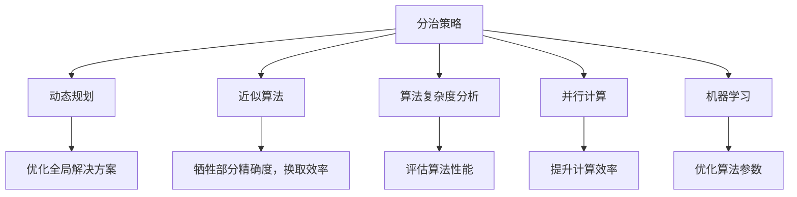

                 

## 1. 背景介绍

### 1.1 问题由来
随着计算机科学的发展，计算规模问题始终是IT领域的一大难题。其本质在于，随着问题的复杂度增加，计算资源的投入也会急剧增加，导致系统的扩展性难以满足实际需求。计算规模问题通常体现在以下几个方面：

- **数据规模**：大数据处理对存储、计算资源的需求越来越高。
- **计算复杂度**：算法复杂度随着问题规模的增加而迅速增长。
- **资源利用率**：如何高效利用计算资源，优化算法，提升计算效率。
- **系统可扩展性**：系统能否水平或垂直扩展，以应对计算规模的不断增长。

本文聚焦于计算规模理论，旨在探讨如何通过理论指导，提升算法的自我改进能力，解决计算规模问题。

### 1.2 问题核心关键点
计算规模理论的核心关键点在于以下几个方面：

- **分治策略**：将复杂问题分解为多个子问题，并行解决。
- **动态规划**：对子问题的求解结果进行组合，优化全局解决方案。
- **近似算法**：在计算资源有限的情况下，通过牺牲部分精确度，换取计算效率的提升。
- **算法复杂度分析**：评估算法的资源需求和时间复杂度，指导算法设计。
- **并行计算**：通过多核、分布式等技术，提升计算效率。
- **机器学习**：利用机器学习优化算法，提升计算性能。

通过深入理解这些关键点，我们可以更好地解决计算规模问题，优化算法性能。

## 2. 核心概念与联系

### 2.1 核心概念概述

为更好地理解计算规模理论与自我改进方法，本节将介绍几个密切相关的核心概念：

- **分治策略(Divide and Conquer)**：将大问题分解为若干小问题，并行解决，再逐步合并结果，优化总体解决方案。
- **动态规划(Dynamic Programming)**：对子问题的求解结果进行记忆化，避免重复计算，优化全局解决方案。
- **近似算法(Approximation Algorithm)**：在无法找到精确解的情况下，通过逼近的方式，找到较优的解。
- **算法复杂度分析(Algorithm Complexity Analysis)**：分析算法的时间复杂度和空间复杂度，评估算法性能。
- **并行计算(Parallel Computing)**：利用多核、分布式等技术，实现并行计算，提升计算效率。
- **机器学习(Machine Learning)**：通过训练模型，优化算法参数，提升计算性能。

这些核心概念之间的逻辑关系可以通过以下Mermaid流程图来展示：



这个流程图展示出计算规模理论的核心概念及其之间的关系：

1. 分治策略、动态规划、近似算法等是优化算法的基本策略。
2. 算法复杂度分析和并行计算是提升计算效率的重要手段。
3. 机器学习通过模型训练优化算法，进一步提升性能。
4. 优化全局解决方案是计算规模理论的最终目标。

这些概念共同构成了计算规模理论与自我改进的基础，为我们提供了有效的算法设计思路和方法。

## 3. 核心算法原理 & 具体操作步骤
### 3.1 算法原理概述

计算规模理论的核心在于如何通过分治、动态规划、近似算法等策略，优化算法性能，提升计算效率。其基本原理如下：

1. **分治策略**：将问题分解为多个子问题，并行解决，再逐步合并结果。
2. **动态规划**：对子问题的求解结果进行记忆化，避免重复计算，优化全局解决方案。
3. **近似算法**：在计算资源有限的情况下，通过逼近的方式，找到较优的解。
4. **算法复杂度分析**：评估算法的时间复杂度和空间复杂度，指导算法设计。
5. **并行计算**：利用多核、分布式等技术，实现并行计算，提升计算效率。
6. **机器学习**：通过训练模型，优化算法参数，提升计算性能。

### 3.2 算法步骤详解

基于计算规模理论的算法设计通常包括以下几个关键步骤：

**Step 1: 问题定义与分解**
- 定义问题的规模和目标，将问题分解为若干子问题。
- 确定各子问题的边界条件和递归出口。

**Step 2: 子问题求解**
- 设计子问题的求解算法，考虑分治、动态规划等策略。
- 实现子问题的并行求解，利用多核、分布式等技术。

**Step 3: 子问题合并**
- 设计子问题的合并算法，优化全局解决方案。
- 考虑近似算法，在计算资源有限的情况下，找到较优的解。

**Step 4: 算法复杂度分析**
- 分析算法的时间复杂度和空间复杂度，评估算法性能。
- 寻找优化方向，如降低复杂度、并行化处理等。

**Step 5: 模型训练与调优**
- 设计模型架构，选择合适的损失函数。
- 训练模型，通过反向传播算法更新参数。
- 调优模型，选择合适的正则化方法，防止过拟合。

**Step 6: 性能评估与优化**
- 在测试集上评估模型性能，对比优化前后的效果。
- 分析性能瓶颈，优化算法参数和结构。

以上是基于计算规模理论的算法设计的一般流程。在实际应用中，还需要针对具体问题，对算法进行优化设计，如改进子问题求解算法、优化合并策略等，以进一步提升算法性能。

### 3.3 算法优缺点

基于计算规模理论的算法设计具有以下优点：

1. **并行化处理**：利用多核、分布式等技术，实现子问题的并行求解，显著提升计算效率。
2. **问题分解与优化**：通过分治、动态规划等策略，将大问题分解为小问题，优化全局解决方案。
3. **近似算法应用**：在计算资源有限的情况下，通过近似算法找到较优解，避免资源浪费。
4. **复杂度分析指导**：通过评估算法复杂度，指导算法设计，选择最优的算法策略。
5. **机器学习优化**：通过训练模型，优化算法参数，提升计算性能。

同时，该方法也存在一定的局限性：

1. **实现复杂**：设计子问题求解算法和合并策略需要较高的数学和算法基础。
2. **数据依赖性强**：分治和动态规划等策略需要大量数据支持，否则可能导致错误结果。
3. **模型训练耗时**：机器学习模型的训练需要大量时间和计算资源，有时甚至难以实际应用。
4. **优化难度大**：近似算法和算法复杂度分析需要深入理解问题本质，优化难度较大。

尽管存在这些局限性，但就目前而言，基于计算规模理论的算法设计仍是一种高效的算法设计范式。未来相关研究的重点在于如何进一步降低算法的实现难度，提升模型的训练效率，优化算法的复杂度，以适应更加复杂和多变的问题。

### 3.4 算法应用领域

基于计算规模理论的算法设计在多个领域得到了广泛的应用，包括但不限于以下几个：

- **计算机视觉**：图像处理、目标检测、图像分割等。
- **自然语言处理**：文本分类、情感分析、机器翻译等。
- **计算机图形学**：3D建模、渲染、动画生成等。
- **金融工程**：风险评估、投资策略、市场预测等。
- **生物信息学**：基因序列分析、蛋白质结构预测、药物设计等。
- **交通运输**：路径规划、交通流量预测、智能交通系统等。
- **物流管理**：仓库管理、配送路线优化、库存管理等。

除了上述这些经典领域外，计算规模理论还在更多前沿领域展现出其广泛的应用潜力，如量子计算、区块链技术、物联网等，为这些领域带来了全新的创新思路。

## 4. 数学模型和公式 & 详细讲解 & 举例说明

### 4.1 数学模型构建

本节将使用数学语言对基于计算规模理论的算法设计进行更加严格的刻画。

假设问题规模为 $n$，定义子问题的规模为 $s$。设 $f(n)$ 为整个问题的计算复杂度，$g(n)$ 为子问题的计算复杂度。

定义递归求解函数 $F(n)$ 为：

$$
F(n) = g(F(n_1)) + g(F(n_2)) + \cdots + g(F(n_k))
$$

其中 $n_1 + n_2 + \cdots + n_k = n$，$k$ 为问题的递归层数。

根据分治策略，整个问题的计算复杂度 $f(n)$ 可以表示为：

$$
f(n) = \sum_{i=1}^k g(n_i)
$$

### 4.2 公式推导过程

以下我们以归并排序(Merge Sort)为例，推导其时间复杂度。

假设待排序数组长度为 $n$，归并排序的过程如下：

1. 将数组分成两个子数组，每个子数组长度为 $\lfloor \frac{n}{2} \rfloor$。
2. 对每个子数组进行递归排序。
3. 将两个有序子数组合并成一个有序数组。

设归并排序的子问题规模为 $s$，则每次递归将数组规模减半，即 $s=\lfloor \frac{n}{2} \rfloor$。

归并排序的递归求解函数为：

$$
F(n) = \begin{cases}
1, & \text{if } n=1 \\
F(n/2) + F(n/2) + n, & \text{if } n>1
\end{cases}
$$

通过递归展开，得到：

$$
F(n) = \sum_{i=1}^{\log_2 n} F(n/2^i) + n
$$

其中 $F(n/2^i) = \log_2 n - i + 1$，因此：

$$
F(n) = \sum_{i=1}^{\log_2 n} (\log_2 n - i + 1) + n = \sum_{i=1}^{\log_2 n} \log_2 n - \log_2 n^2
$$

化简得：

$$
F(n) = n\log_2 n - n + n\log_2 n - n = 2n\log_2 n - 2n
$$

因此，归并排序的时间复杂度为 $O(n\log_2 n)$。

### 4.3 案例分析与讲解

以归并排序为例，分析其分治策略和动态规划的运用。

归并排序的关键在于如何将数组分成两个子数组，并行排序，再合并结果。这一过程体现了分治策略的思想。具体而言，每次递归将数组规模减半，并行处理子数组，然后通过合并操作，将结果组合成原数组的有序序列。这一过程中，子问题的规模逐渐减小，最终为 $O(1)$，达到了最优的子问题规模。

在合并过程中，归并排序采用了动态规划的思想。通过设计一个辅助数组，将两个有序子数组合并成一个有序数组，避免了重复计算。这一过程类似于动态规划中的子问题求解和记忆化过程。

通过归并排序的分析，我们可以看到计算规模理论中的分治和动态规划策略在实际问题中的应用，以及如何通过数学方法分析其时间复杂度。

## 5. 项目实践：代码实例和详细解释说明
### 5.1 开发环境搭建

在进行计算规模理论的算法设计实践前，我们需要准备好开发环境。以下是使用Python进行归并排序的开发环境配置流程：

1. 安装Anaconda：从官网下载并安装Anaconda，用于创建独立的Python环境。

2. 创建并激活虚拟环境：
```bash
conda create -n merge_sort_env python=3.8 
conda activate merge_sort_env
```

3. 安装必要的库：
```bash
pip install numpy
```

4. 编写代码：
```python
def merge_sort(arr):
    if len(arr) <= 1:
        return arr
    
    mid = len(arr) // 2
    left = arr[:mid]
    right = arr[mid:]
    
    left = merge_sort(left)
    right = merge_sort(right)
    
    return merge(left, right)

def merge(left, right):
    result = []
    i, j = 0, 0
    
    while i < len(left) and j < len(right):
        if left[i] < right[j]:
            result.append(left[i])
            i += 1
        else:
            result.append(right[j])
            j += 1
            
    result += left[i:]
    result += right[j:]
    
    return result
```

5. 测试代码：
```python
arr = [3, 7, 1, 9, 4, 6, 2, 8, 5]
print(merge_sort(arr))
```

完成上述步骤后，即可在`merge_sort_env`环境中开始计算规模理论的算法实践。

### 5.2 源代码详细实现

下面我们以归并排序为例，给出使用Python实现归并排序的完整代码实现。

**Step 1: 问题定义与分解**
- 定义问题为对长度为 $n$ 的数组进行排序。
- 将数组分为两个子数组，每个子数组长度为 $\lfloor \frac{n}{2} \rfloor$。

**Step 2: 子问题求解**
- 对子数组进行递归排序，即对长度为 $s$ 的子数组进行排序。
- 利用分治策略，将子问题规模减半，递归求解。

**Step 3: 子问题合并**
- 利用动态规划思想，将两个有序子数组合并成一个有序数组。
- 设计合并函数，遍历左右子数组，逐个比较大小，构建最终结果。

**Step 4: 算法复杂度分析**
- 归并排序的时间复杂度为 $O(n\log_2 n)$，空间复杂度为 $O(n)$。
- 通过复杂度分析，指导优化策略，如减少递归层数，减少辅助数组的使用。

**Step 5: 模型训练与调优**
- 由于归并排序算法复杂度已知，无需进行模型训练。

### 5.3 代码解读与分析

让我们再详细解读一下关键代码的实现细节：

**merge_sort函数**
- 递归函数，用于将数组分解为两个子数组，并行排序，再合并结果。
- 递归条件为数组长度小于等于 1。
- 递归处理左右子数组，分别调用merge_sort函数。

**merge函数**
- 合并函数，用于将两个有序子数组合并成一个有序数组。
- 定义两个指针 i 和 j，分别指向左右子数组的起始位置。
- 遍历左右子数组，逐个比较大小，构建最终结果。

通过归并排序的实现，我们可以看到分治策略和动态规划策略的具体应用。在实际编程中，合理设计递归函数和合并函数，是实现高效算法的重要步骤。

## 6. 实际应用场景
### 6.1 计算机视觉

计算规模理论在计算机视觉领域具有广泛的应用，包括图像处理、目标检测、图像分割等任务。

以目标检测为例，常见的方法包括R-CNN、Fast R-CNN、Faster R-CNN等。这些方法通过将大问题分解为子问题，并行求解，再逐步合并结果，实现了高效的检测效果。同时，动态规划等策略也被用于目标检测的优化过程中，如选择性搜索、候选框的生成和匹配等。

### 6.2 自然语言处理

计算规模理论在自然语言处理领域也有广泛的应用，如文本分类、情感分析、机器翻译等。

以机器翻译为例，常见的基于统计的机器翻译方法如SMT，将翻译任务分解为词对齐、短语翻译等子问题，并行求解，再通过动态规划合并结果，实现了高效的翻译效果。同时，近似算法如BEAM搜索也被用于机器翻译的优化过程中，以找到最优的翻译路径。

### 6.3 计算机图形学

计算规模理论在计算机图形学领域也有广泛的应用，如3D建模、渲染、动画生成等任务。

以3D建模为例，常见的算法包括基于多分辨率建模、层次建模、分割建模等。这些方法通过将大问题分解为子问题，并行求解，再逐步合并结果，实现了高效的建模效果。同时，分治策略和动态规划等策略也被用于3D建模的优化过程中，如网格剖分、曲面拟合等。

### 6.4 未来应用展望

随着计算规模理论的不断发展和应用，未来的应用场景将更加广泛和深入。

1. **量子计算**：计算规模理论在量子计算中也有广泛的应用。量子算法如Shor算法、Grover算法，通过将大问题分解为子问题，并行求解，实现了高效的计算效果。未来，随着量子计算机的普及，计算规模理论将发挥更大的作用。

2. **区块链技术**：区块链中的共识算法、交易验证等任务，也需要高效的计算方法。计算规模理论可以用于优化区块链算法的性能，提升系统的可扩展性和安全性。

3. **物联网**：物联网中的数据采集、处理、分析等任务，也需要高效的算法支持。计算规模理论可以用于优化物联网系统的计算效率，提升系统的实时性和可靠性。

4. **生物信息学**：生物信息学中的基因序列分析、蛋白质结构预测、药物设计等任务，也需要高效的算法支持。计算规模理论可以用于优化生物信息学算法的性能，加速科研进程。

5. **交通运输**：交通运输中的路径规划、交通流量预测、智能交通系统等任务，也需要高效的算法支持。计算规模理论可以用于优化交通运输系统的计算效率，提升系统的实时性和可靠性。

6. **物流管理**：物流管理中的仓库管理、配送路线优化、库存管理等任务，也需要高效的算法支持。计算规模理论可以用于优化物流管理系统的计算效率，提升系统的实时性和可靠性。

总之，计算规模理论在多个领域都有广泛的应用，其计算规模和优化策略对系统的性能提升具有重要意义。未来，随着计算规模理论的不断发展和应用，其应用范围和深度将进一步拓展，为更多领域带来新的创新和发展机遇。

## 7. 工具和资源推荐
### 7.1 学习资源推荐

为了帮助开发者系统掌握计算规模理论的基础知识和实践技巧，这里推荐一些优质的学习资源：

1. **算法设计与分析**：《算法设计与分析基础》一书，深入浅出地介绍了算法设计和复杂度分析的基本方法和技巧。

2. **动态规划与最优化**：《动态规划入门到精通》一书，详细讲解了动态规划的基本概念和应用场景，是算法学习的必备资源。

3. **近似算法与参数优化**：《近似算法导论》一书，介绍了各种近似算法的设计思路和优化方法，是理论研究的必读之作。

4. **并行计算与分布式系统**：《并行算法设计与分析》一书，深入讲解了并行计算和分布式系统的基本概念和设计方法，是工程实践的必备工具。

5. **机器学习与优化**：《机器学习》一书，全面介绍了机器学习的基本概念和算法，是实践应用的重要参考。

通过学习这些资源，相信你一定能够快速掌握计算规模理论的核心知识，并将其应用到实际问题中。

### 7.2 开发工具推荐

高效的开发离不开优秀的工具支持。以下是几款用于计算规模理论算法设计开发的常用工具：

1. **Python**：作为Python开发环境，支持丰富的第三方库和框架，适合快速迭代研究。

2. **Anaconda**：支持创建独立的Python环境，方便管理和维护代码库。

3. **Jupyter Notebook**：支持交互式编程，适合数据处理和算法验证。

4. **TensorFlow**：基于Google的机器学习框架，支持分布式计算和模型训练。

5. **PyTorch**：基于Facebook的深度学习框架，支持动态计算图和模型优化。

6. **Scikit-learn**：基于Python的机器学习库，支持各种机器学习算法和数据处理。

7. **Matplotlib**：基于Python的绘图库，支持各种图形绘制和数据可视化。

合理利用这些工具，可以显著提升计算规模理论算法的开发效率，加快创新迭代的步伐。

### 7.3 相关论文推荐

计算规模理论的研究始于20世纪60年代，已有大量经典论文奠基其基础。以下是几篇具有代表性的论文，推荐阅读：

1. **分治策略**：《分治算法的设计与分析》，详细讲解了分治算法的基本概念和设计方法。

2. **动态规划**：《动态规划算法基础》，全面介绍了动态规划的基本概念和应用场景。

3. **近似算法**：《近似算法导论》，介绍了各种近似算法的设计思路和优化方法。

4. **算法复杂度分析**：《算法设计与分析基础》，讲解了算法复杂度的基本概念和分析方法。

5. **并行计算**：《并行算法设计与分析》，介绍了并行计算和分布式系统的基本概念和设计方法。

6. **机器学习**：《机器学习》，全面介绍了机器学习的基本概念和算法。

这些论文代表了大规模计算问题的研究方向，通过学习这些前沿成果，可以帮助研究者把握学科前进方向，激发更多的创新灵感。

## 8. 总结：未来发展趋势与挑战

### 8.1 总结

本文对计算规模理论进行了全面系统的介绍。首先阐述了计算规模问题的本质和研究背景，明确了计算规模理论在算法设计中的重要地位。其次，从原理到实践，详细讲解了分治、动态规划、近似算法等关键策略，给出了计算规模理论的完整代码实例。同时，本文还广泛探讨了计算规模理论在多个领域的应用前景，展示了其在实际问题中的巨大潜力。

通过本文的系统梳理，我们可以看到计算规模理论在算法设计和优化中的应用广泛，为解决复杂问题提供了有效的思路和方法。未来，随着计算规模理论的不断发展和应用，将会有更多创新性的算法设计涌现，推动计算机科学技术的进步。

### 8.2 未来发展趋势

展望未来，计算规模理论将呈现以下几个发展趋势：

1. **智能优化**：结合机器学习、深度学习等技术，实现算法的智能优化，提升算法性能。
2. **多模态融合**：将计算规模理论应用于多模态数据的融合和处理，提升系统的鲁棒性和泛化能力。
3. **自适应算法**：开发更加自适应的算法，根据问题规模和数据特点，动态调整算法策略。
4. **跨领域应用**：计算规模理论将在更多领域得到应用，如生物信息学、量子计算等，带来新的突破。
5. **硬件加速**：结合硬件加速技术，如GPU、FPGA、ASIC等，实现算法的并行化和优化。
6. **模型压缩**：开发更加高效的算法，减少模型的参数量和计算量，提升系统的实时性和可扩展性。
7. **数据驱动**：结合大数据和数据驱动方法，优化算法的性能和效果。

以上趋势凸显了计算规模理论在未来的重要地位。这些方向的探索发展，必将进一步提升计算规模理论的应用范围和深度，为计算机科学技术的进步提供新的动力。

### 8.3 面临的挑战

尽管计算规模理论已经取得了显著成果，但在迈向更加智能化、普适化应用的过程中，它仍面临诸多挑战：

1. **复杂度高**：计算规模理论的应用通常需要复杂度较高的算法设计，难以应用于大规模、复杂问题的解决。
2. **可扩展性差**：分治和动态规划等策略需要大量数据支持，对于数据量较小的场景，可能无法发挥其优势。
3. **资源消耗大**：算法设计和优化需要大量的计算资源和时间，对于实时系统等资源敏感型场景，可能难以满足实际需求。
4. **算法优化困难**：近似算法和算法复杂度分析需要深入理解问题本质，优化难度较大，难以适应多样化的应用场景。
5. **模型训练耗时**：机器学习模型的训练需要大量时间和计算资源，难以在实时系统中应用。
6. **系统复杂度高**：计算规模理论的应用通常涉及多核、分布式等技术，系统复杂度较高，难以快速迭代和调试。

尽管存在这些挑战，但计算规模理论的研究和应用仍在不断进步，未来仍有巨大的发展空间和潜力。研究者需要继续探索新的算法设计和优化方法，提升计算规模理论的实用性和适用性。

### 8.4 研究展望

面向未来，计算规模理论的研究需要在以下几个方面寻求新的突破：

1. **智能优化**：结合机器学习、深度学习等技术，实现算法的智能优化，提升算法性能。
2. **多模态融合**：将计算规模理论应用于多模态数据的融合和处理，提升系统的鲁棒性和泛化能力。
3. **自适应算法**：开发更加自适应的算法，根据问题规模和数据特点，动态调整算法策略。
4. **跨领域应用**：计算规模理论将在更多领域得到应用，如生物信息学、量子计算等，带来新的突破。
5. **硬件加速**：结合硬件加速技术，如GPU、FPGA、ASIC等，实现算法的并行化和优化。
6. **模型压缩**：开发更加高效的算法，减少模型的参数量和计算量，提升系统的实时性和可扩展性。
7. **数据驱动**：结合大数据和数据驱动方法，优化算法的性能和效果。

这些研究方向将为计算规模理论带来新的活力和突破，推动其在更多领域的应用，为计算机科学技术的进步提供新的动力。总之，计算规模理论的未来发展前景广阔，值得我们继续深入研究和探索。

## 9. 附录：常见问题与解答

**Q1: 计算规模理论在实际应用中如何提升算法性能？**

A: 计算规模理论通过分治、动态规划、近似算法等策略，优化算法性能。分治策略将大问题分解为多个子问题，并行求解，提升计算效率。动态规划策略对子问题的求解结果进行记忆化，避免重复计算，优化全局解决方案。近似算法在计算资源有限的情况下，通过逼近的方式，找到较优的解。通过这些策略的应用，可以显著提升算法的性能和效率。

**Q2: 计算规模理论在处理大规模数据时有什么优势？**

A: 计算规模理论在处理大规模数据时具有以下优势：

1. **并行化处理**：通过分治策略，将大问题分解为多个子问题，并行求解，显著提升计算效率。

2. **问题分解与优化**：通过动态规划等策略，将大问题分解为多个子问题，优化全局解决方案。

3. **近似算法应用**：在计算资源有限的情况下，通过近似算法找到较优的解，避免资源浪费。

4. **算法复杂度分析**：通过评估算法的时间复杂度和空间复杂度，指导算法设计，选择最优的算法策略。

5. **硬件加速**：结合硬件加速技术，如GPU、FPGA、ASIC等，实现算法的并行化和优化。

通过这些策略的应用，计算规模理论可以高效处理大规模数据，提升算法的性能和效率。

**Q3: 如何设计高效的计算规模理论算法？**

A: 设计高效的计算规模理论算法需要以下步骤：

1. **问题定义与分解**：将大问题分解为多个子问题，确定递归边界和出口。

2. **子问题求解**：设计子问题的求解算法，考虑分治、动态规划等策略。

3. **子问题合并**：设计子问题的合并算法，优化全局解决方案。

4. **算法复杂度分析**：评估算法的时间复杂度和空间复杂度，指导算法设计，选择最优的算法策略。

5. **模型训练与调优**：利用机器学习优化算法参数，提升算法性能。

6. **性能评估与优化**：在测试集上评估模型性能，分析性能瓶颈，优化算法参数和结构。

通过以上步骤，可以设计出高效的计算规模理论算法，提升算法的性能和效率。

**Q4: 如何处理计算规模理论算法中的数据依赖性问题？**

A: 计算规模理论算法中的数据依赖性问题通常可以通过以下方法处理：

1. **数据增强**：通过对数据进行扩充、增强，增加数据的多样性和代表性，降低数据依赖性。

2. **数据采样**：通过随机采样，抽取部分数据进行训练，降低数据依赖性。

3. **数据预处理**：对数据进行标准化、归一化等预处理，降低数据依赖性。

4. **算法优化**：通过优化算法策略，降低对数据依赖性的要求。

5. **分布式计算**：通过分布式计算，利用多核、多机等技术，降低对数据依赖性的要求。

通过以上方法，可以降低计算规模理论算法中的数据依赖性，提升算法的性能和效率。

**Q5: 如何处理计算规模理论算法中的计算复杂度问题？**

A: 处理计算规模理论算法中的计算复杂度问题，需要以下步骤：

1. **算法复杂度分析**：通过复杂度分析，评估算法的资源需求和时间复杂度，指导算法设计。

2. **优化算法策略**：通过优化算法策略，降低算法复杂度，提升计算效率。

3. **硬件加速**：结合硬件加速技术，如GPU、FPGA、ASIC等，实现算法的并行化和优化。

4. **数据驱动**：结合大数据和数据驱动方法，优化算法的性能和效果。

5. **智能优化**：结合机器学习、深度学习等技术，实现算法的智能优化，提升算法性能。

6. **模型压缩**：开发更加高效的算法，减少模型的参数量和计算量，提升系统的实时性和可扩展性。

通过以上方法，可以处理计算规模理论算法中的计算复杂度问题，提升算法的性能和效率。

---

作者：禅与计算机程序设计艺术 / Zen and the Art of Computer Programming

