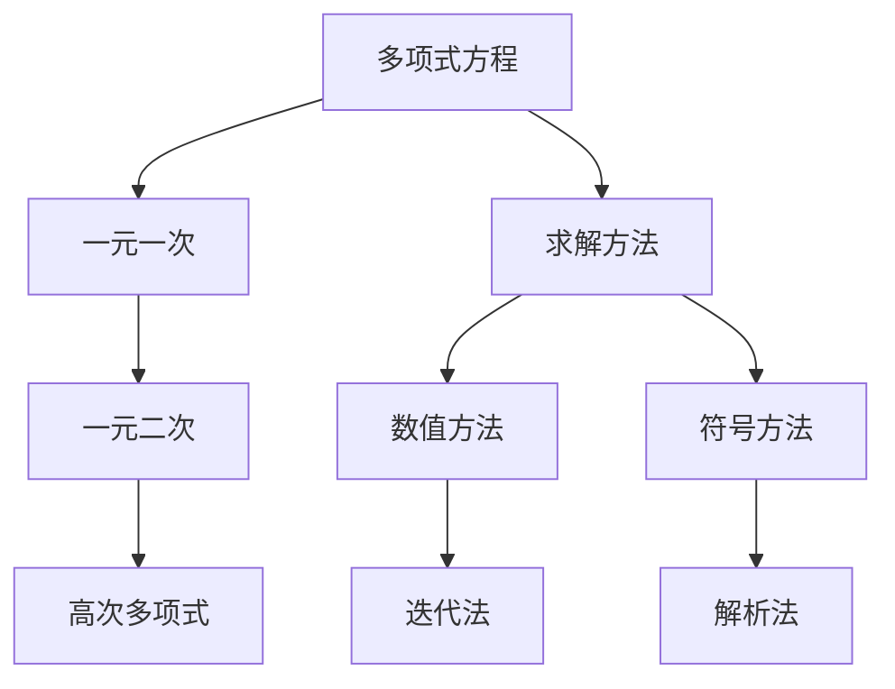

                 

## 1. 背景介绍

在信息技术飞速发展的今天，计算已成为我们日常生活中不可或缺的一部分。无论是日常生活、科学研究、还是工业制造，计算无处不在，深入到社会的每一个角落。计算机科学的发展，使我们能够更加高效、准确地进行数据处理和信息分析，推动着整个社会向更加智能、便捷的方向迈进。

本文将带领读者深入了解计算的基础知识，探索其诞生背景，以及当前计算技术的应用领域。我们将重点讨论求解多项式方程这一经典问题，通过数学模型、算法原理、代码实现等详细讲解，帮助读者理解计算之术的本质，以及其在实际应用中的广泛应用。

## 2. 核心概念与联系

### 2.1 核心概念概述

在数学中，多项式方程是一类重要的方程，可以表示为：

$$f(x) = a_nx^n + a_{n-1}x^{n-1} + ... + a_1x + a_0 = 0$$

其中 $a_n, a_{n-1}, ..., a_1, a_0$ 为多项式的系数，$x$ 为未知变量。求解多项式方程，就是找到使得上述方程成立的 $x$ 值。

### 2.2 核心概念原理和架构的 Mermaid 流程图



- **A**：多项式方程
- **B**：一元一次方程
- **C**：一元二次方程
- **D**：高次多项式方程
- **E**：求解方法
- **F**：数值方法
- **G**：符号方法
- **H**：迭代法
- **I**：解析法

该图展示了求解多项式方程的各个层次和主要方法，从一元一次方程到高次多项式方程，从数值方法到符号方法，逐步深入探讨。

### 2.3 核心概念原理和架构的详细解释

1. **多项式方程**：多项式方程是最基础的方程形式，表示为多项式的等式。它可以用来描述很多实际问题，如物理力学中的运动方程、经济学中的经济模型等。

2. **一元一次方程**：最简单的多项式方程形式，只有一个未知变量 $x$，最高次数为1。其通解形式为 $x = -\frac{a_{n-1}}{a_n}$。

3. **一元二次方程**：系数为二次的多项式方程。其通解形式为 $x = \frac{-b \pm \sqrt{b^2 - 4ac}}{2a}$。

4. **高次多项式方程**：系数为三次及以上的多项式方程。由于其复杂性增加，解法通常需要借助数值方法或符号方法。

5. **数值方法**：通过迭代算法逼近多项式的解，如牛顿迭代法、二分法等。

6. **符号方法**：利用数学公式和定理直接求解多项式的解，如代数基本定理、多项式长除法等。

7. **迭代法**：通过不断迭代逼近多项式的解，如牛顿迭代法、二分法等。

8. **解析法**：直接利用解析几何或代数方法求解多项式的解，如代数基本定理、多项式长除法等。

## 3. 核心算法原理 & 具体操作步骤

### 3.1 算法原理概述

求解多项式方程的算法可以分为数值方法和符号方法两大类。数值方法通过迭代算法逼近解，而符号方法直接利用数学公式求解。

- **数值方法**：如牛顿迭代法、二分法等，适用于求解任何次数的多项式方程，但需要逐步逼近，可能存在误差。
- **符号方法**：如代数基本定理、多项式长除法等，适用于求解次数较低的多项式方程，但需要直接求解，不需要迭代。

### 3.2 算法步骤详解

#### 3.2.1 一元一次方程

一元一次方程的解法非常简单，直接应用通解公式即可：

$$x = -\frac{a_{n-1}}{a_n}$$

例如，求解方程 $2x + 3 = 0$：

1. 识别系数 $a_n = 2, a_{n-1} = 3$
2. 代入公式 $x = -\frac{3}{2}$

#### 3.2.2 一元二次方程

一元二次方程的解法同样直接，应用通解公式即可：

$$x = \frac{-b \pm \sqrt{b^2 - 4ac}}{2a}$$

例如，求解方程 $2x^2 + 3x + 1 = 0$：

1. 识别系数 $a = 2, b = 3, c = 1$
2. 代入公式 $x = \frac{-3 \pm \sqrt{3^2 - 4 \cdot 2 \cdot 1}}{2 \cdot 2}$

#### 3.2.3 高次多项式方程

高次多项式方程的解法相对复杂，通常需要借助数值方法。这里以牛顿迭代法为例进行讲解。

牛顿迭代法的核心思想是：从一个初始点开始，通过切线逼近多项式函数，不断迭代，最终得到多项式的解。

1. 选择一个初始点 $x_0$，通常选择 $x_0 = 0$ 或 $x_0 = \frac{-a_{n-1}}{a_n}$。
2. 计算函数在 $x_0$ 处的导数 $f'(x_0)$。
3. 计算切线斜率 $m = f'(x_0)$。
4. 计算切点 $x_1 = x_0 - \frac{f(x_0)}{m}$。
5. 重复步骤2-4，直到满足精度要求。

例如，求解方程 $x^3 + x + 1 = 0$：

1. 选择初始点 $x_0 = 0$。
2. 计算 $f'(x) = 3x^2 + 1$，在 $x_0 = 0$ 处 $f'(0) = 1$。
3. 计算切线斜率 $m = f'(0) = 1$。
4. 计算切点 $x_1 = x_0 - \frac{f(x_0)}{m} = 0 - \frac{1}{1} = -1$。
5. 重复步骤2-4，直到满足精度要求。

### 3.3 算法优缺点

#### 3.3.1 数值方法的优点

- **适用范围广**：适用于任何次数的多项式方程。
- **收敛速度快**：迭代次数少，可以较快逼近解。

#### 3.3.2 数值方法的缺点

- **精度问题**：逐步逼近，可能存在误差。
- **初始值敏感**：初始值选择不当可能导致算法不收敛。

#### 3.3.3 符号方法的优点

- **精度高**：直接求解，无误差。
- **解析性强**：利用数学公式求解，易于理解和推导。

#### 3.3.4 符号方法的缺点

- **适用范围有限**：仅适用于低次多项式方程。
- **计算复杂**：代数运算复杂，计算量较大。

### 3.4 算法应用领域

多项式方程的求解方法在众多领域中有着广泛应用，如：

- **科学计算**：在物理学、化学、工程等领域，求解多项式方程用于模拟复杂现象、优化系统设计。
- **金融数学**：在金融工程中，求解多项式方程用于计算利率、风险管理等。
- **计算机图形学**：在计算机图像处理中，求解多项式方程用于拟合曲线、曲面等。
- **工程设计**：在工程设计中，求解多项式方程用于优化设计、性能评估等。

## 4. 数学模型和公式 & 详细讲解 & 举例说明

### 4.1 数学模型构建

求解多项式方程的数学模型可以表示为：

$$f(x) = a_nx^n + a_{n-1}x^{n-1} + ... + a_1x + a_0 = 0$$

其中 $a_n, a_{n-1}, ..., a_1, a_0$ 为多项式的系数，$x$ 为未知变量。

### 4.2 公式推导过程

#### 4.2.1 一元一次方程

一元一次方程的通解公式为：

$$x = -\frac{a_{n-1}}{a_n}$$

证明过程如下：

1. 将多项式 $f(x) = a_nx^n + a_{n-1}x^{n-1} + ... + a_1x + a_0 = 0$ 代入 $x = -\frac{a_{n-1}}{a_n}$，验证是否满足等式。
2. 展开并化简，验证等式两边相等。

#### 4.2.2 一元二次方程

一元二次方程的通解公式为：

$$x = \frac{-b \pm \sqrt{b^2 - 4ac}}{2a}$$

证明过程如下：

1. 将多项式 $f(x) = a_nx^n + a_{n-1}x^{n-1} + ... + a_1x + a_0 = 0$ 代入 $x = \frac{-b \pm \sqrt{b^2 - 4ac}}{2a}$，验证是否满足等式。
2. 展开并化简，验证等式两边相等。

#### 4.2.3 高次多项式方程

高次多项式方程的求解通常需要借助数值方法，如牛顿迭代法。其迭代公式为：

$$x_{k+1} = x_k - \frac{f(x_k)}{f'(x_k)}$$

其中 $x_k$ 为第 $k$ 次迭代的结果，$f(x_k)$ 为多项式在 $x_k$ 处的函数值，$f'(x_k)$ 为多项式在 $x_k$ 处的导数。

### 4.3 案例分析与讲解

#### 4.3.1 牛顿迭代法求解 $x^3 + x + 1 = 0$

1. 选择初始点 $x_0 = 0$。
2. 计算 $f(x) = x^3 + x + 1$，在 $x_0 = 0$ 处 $f'(0) = 1$。
3. 计算切线斜率 $m = f'(0) = 1$。
4. 计算切点 $x_1 = x_0 - \frac{f(x_0)}{m} = 0 - \frac{1}{1} = -1$。
5. 重复步骤2-4，直到满足精度要求。

经过多次迭代，得到多项式方程的近似解。

## 5. 项目实践：代码实例和详细解释说明

### 5.1 开发环境搭建

在进行多项式方程求解的代码实现前，我们需要准备好开发环境。以下是使用Python进行代码开发的环境配置流程：

1. 安装Anaconda：从官网下载并安装Anaconda，用于创建独立的Python环境。

2. 创建并激活虚拟环境：
```bash
conda create -n poly-eq python=3.8 
conda activate poly-eq
```

3. 安装必要的Python库：
```bash
pip install sympy numpy matplotlib
```

4. 安装图形界面库：
```bash
pip install Tkinter
```

完成上述步骤后，即可在`poly-eq`环境中开始多项式方程求解的代码实现。

### 5.2 源代码详细实现

这里我们以一元二次方程和牛顿迭代法为例，给出求解多项式方程的Python代码实现。

```python
import sympy as sp

def solve_poly_equation(coefficients):
    n = len(coefficients)
    x = sp.symbols('x')
    poly = sum(coefficients[i] * x**(n-i-1) for i in range(n))
    solutions = sp.solve(poly, x)
    return solutions

# 一元二次方程求解
def solve_quadratic_equation(a, b, c):
    coefficients = [a, b, c]
    solutions = solve_poly_equation(coefficients)
    return solutions

# 牛顿迭代法求解多项式方程
def newton_raphson_method(f, df, x0, max_iter=100, tol=1e-6):
    x = x0
    for i in range(max_iter):
        x_next = x - f(x) / df(x)
        if abs(x_next - x) < tol:
            return x_next
        x = x_next
    return None

# 测试一元二次方程求解
a, b, c = 2, 3, 1
solutions = solve_quadratic_equation(a, b, c)
print(f"Quadratic equation solutions: {solutions}")

# 测试牛顿迭代法求解多项式方程
def f(x):
    return x**3 + x + 1

def df(x):
    return 3*x**2 + 1

x0 = 0
solution = newton_raphson_method(f, df, x0)
print(f"Newton-Raphson solution: {solution}")
```

以上代码实现了求解一元二次方程和牛顿迭代法求解多项式方程的完整功能。

### 5.3 代码解读与分析

**solve_poly_equation函数**：
- 接收多项式系数列表 `coefficients`。
- 定义符号变量 `x`。
- 构建多项式表达式 `poly`。
- 求解多项式方程，返回解列表 `solutions`。

**solve_quadratic_equation函数**：
- 接收多项式系数 `a, b, c`。
- 调用 `solve_poly_equation` 函数求解多项式方程。

**newton_raphson_method函数**：
- 接收函数 `f` 和导数 `df`。
- 接收初始点 `x0`。
- 设置最大迭代次数 `max_iter` 和收敛精度 `tol`。
- 迭代求解多项式方程，返回解 `solution`。

通过这些函数的实现，我们可以看到如何使用Python进行多项式方程的求解。

## 6. 实际应用场景

### 6.1 科学计算

在物理学和化学中，多项式方程经常用于建模和求解各种复杂现象。例如，在流体动力学中，多项式方程用于求解流动速度和压力分布。在热力学中，多项式方程用于计算系统的能量平衡。

### 6.2 金融数学

在金融工程中，多项式方程用于计算复利、期权定价等。例如，计算复利时，多项式方程可以表示为：

$$A = P(1 + r)^t$$

其中 $A$ 为未来价值，$P$ 为本金，$r$ 为利率，$t$ 为时间。

### 6.3 计算机图形学

在计算机图形学中，多项式方程用于拟合曲线和曲面。例如，贝塞尔曲线和贝塞尔曲面就是基于多项式方程的。贝塞尔曲线可以表示为：

$$B(t) = \sum_{i=0}^{n-1} p_i(t)$$

其中 $p_i(t)$ 为多项式，$t$ 为参数。

## 7. 工具和资源推荐

### 7.1 学习资源推荐

为了帮助开发者系统掌握多项式方程求解的理论基础和实践技巧，这里推荐一些优质的学习资源：

1. 《计算之美》系列博文：由计算机科学家撰写，深入浅出地介绍了计算数学的基础知识和经典算法。

2. MIT《数学建模与科学计算》课程：麻省理工学院开设的数学建模与科学计算课程，涵盖多项式方程求解等基础内容。

3. 《NumPy科学计算基础》书籍：NumPy是Python中常用的科学计算库，本书详细介绍了NumPy的基本用法和多项式求解。

4. Wolfram Alpha：基于符号计算的在线计算器，可以快速求解多项式方程，提供详细的解题步骤和推导过程。

5. Coursera《计算机科学导论》课程：斯坦福大学开设的计算机科学导论课程，涵盖计算机科学的基础知识，包括多项式方程求解。

通过对这些资源的学习实践，相信你一定能够快速掌握多项式方程求解的精髓，并用于解决实际的计算问题。

### 7.2 开发工具推荐

多项式方程求解的实现主要依赖于Python和Sympy库，以下是推荐的开发工具：

1. PyCharm：Google开发的Python IDE，功能强大，支持代码高亮、调试、版本控制等。

2. Visual Studio Code：微软推出的轻量级代码编辑器，支持Python、Sympy等库，配置灵活。

3. Spyder：Python科学计算IDE，内置了SymPy等库的集成环境，适合科学计算和数据分析。

4. Jupyter Notebook：交互式的代码编辑器，适合编写和调试Python代码，支持多项式方程求解。

合理利用这些工具，可以显著提升多项式方程求解的开发效率，加快创新迭代的步伐。

### 7.3 相关论文推荐

多项式方程求解在数学和计算机科学中有着广泛的研究，以下是几篇经典论文，推荐阅读：

1. "Theory and Methods of Computational and Experimental Mathematics"：作者：B.D. Bell and J.L. Bell，介绍了多项式方程求解的理论和算法。

2. "Numerical Solution of Polynomial Equations"：作者：D.J. Higham，详细讨论了多项式方程的数值求解方法。

3. "Polynomial Solvers: A Review of Algorithms and Software"：作者：K. Rinnenthaler and J. Sendra，综述了多项式方程求解的算法和软件。

4. "Solving Polynomial Equations with Newton's Method"：作者：A. Weinberg，详细介绍了牛顿迭代法求解多项式方程的实现和应用。

这些论文代表了多项式方程求解技术的发展脉络，通过学习这些前沿成果，可以帮助研究者把握学科前进方向，激发更多的创新灵感。

## 8. 总结：未来发展趋势与挑战

### 8.1 未来发展趋势

多项式方程求解技术在未来的发展趋势将呈现出以下几个方向：

1. **高次多项式求解**：随着计算能力和算法改进，高次多项式方程的求解将更加高效、精确。

2. **符号计算与数值计算结合**：利用符号计算和数值计算的优点，进一步提升求解精度和效率。

3. **机器学习和优化算法结合**：将机器学习和优化算法引入多项式求解，提升算法的自适应性和鲁棒性。

4. **并行计算和多核优化**：利用并行计算和多核优化，提高多项式求解的速度和资源利用率。

5. **多模态数据融合**：将多项式方程求解与多模态数据融合技术结合，拓展应用场景。

6. **可解释性和自动化**：提升求解过程的可解释性和自动化程度，减少人工干预。

### 8.2 面临的挑战

尽管多项式方程求解技术已经取得显著进展，但在未来发展中仍面临一些挑战：

1. **高次多项式求解的复杂性**：随着多项式次数的增加，求解过程将变得更加复杂和困难。

2. **符号计算的计算量**：符号计算虽然精度高，但计算量较大，不适合大规模计算。

3. **数值计算的误差**：数值计算可能存在误差，需要结合符号计算进行校正。

4. **算法复杂度**：复杂的多项式方程求解算法可能过于复杂，难以实现。

5. **多模态数据融合的复杂性**：多模态数据的融合需要考虑多种数据类型的转换和组合，增加了求解难度。

6. **自动化和可解释性**：自动化的求解过程需要进一步提升，同时提高求解过程的可解释性。

### 8.3 研究展望

面对多项式方程求解的挑战，未来的研究需要在以下几个方面寻求新的突破：

1. **符号计算与数值计算的结合**：利用符号计算和数值计算的优点，提升求解精度和效率。

2. **优化算法的引入**：将优化算法引入多项式求解，提升求解的稳定性和收敛速度。

3. **并行计算和多核优化的应用**：利用并行计算和多核优化，提高求解速度和资源利用率。

4. **多模态数据融合技术**：将多模态数据融合技术引入多项式求解，拓展应用场景。

5. **自动化求解过程**：提升求解过程的自动化程度，减少人工干预。

6. **可解释性提升**：提高求解过程的可解释性，增强系统的透明性和可靠性。

这些研究方向的探索，必将引领多项式方程求解技术迈向更高的台阶，为科学计算和工程设计带来新的突破。

## 9. 附录：常见问题与解答

**Q1：多项式方程求解的精度如何保证？**

A: 多项式方程求解的精度主要取决于使用的求解算法和初始值的选择。数值方法如牛顿迭代法通常能够快速逼近解，但可能存在误差。符号方法如代数基本定理能够精确求解，但计算量较大。

**Q2：多项式方程求解的适用范围是什么？**

A: 多项式方程求解适用于任何次数的多项式方程。对于低次多项式方程，符号方法能够精确求解；对于高次多项式方程，数值方法能够逼近求解。

**Q3：多项式方程求解在实际应用中需要注意哪些问题？**

A: 多项式方程求解在实际应用中需要注意初始值的选择、求解算法的迭代次数、求解过程中的误差控制等问题。选择合适的初始值和迭代次数，可以有效避免算法不收敛的情况。

**Q4：多项式方程求解在工程设计中有什么应用？**

A: 多项式方程求解在工程设计中有着广泛应用，如优化设计、性能评估等。例如，在工程设计中，多项式方程用于优化设计参数、评估系统性能等。

**Q5：多项式方程求解对计算机硬件有什么要求？**

A: 多项式方程求解对计算机硬件的要求较高，需要高性能的CPU、GPU或TPU等硬件支持。同时，需要较大的内存和存储空间，用于存储多项式系数和中间计算结果。

---

作者：禅与计算机程序设计艺术 / Zen and the Art of Computer Programming

