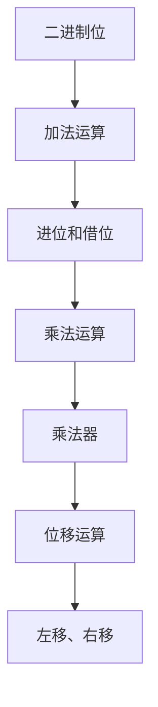

                 

## 1. 背景介绍

### 1.1 问题由来

计算的数学基础是计算机科学领域内一个核心且基础的研究方向。自19世纪中叶以来，数学在计算领域内扮演着至关重要的角色，无论是从基础理论，还是从实际应用中，数学都是不可或缺的。然而，计算机科学的发展史也告诉我们，仅仅是数学知识是不够的，我们还需要理解计算机的物理实现和计算过程。

在现代计算机中，计算的基础逻辑单位是二进制位，每一步计算（包括算术、逻辑和控制流）都是基于二进制位的运算和状态改变。然而，要理解这些计算的数学基础，我们需要深入了解计算机中是如何进行加减乘除的，以及如何处理逻辑和控制流。

本章将深入探讨计算机计算的数学基础，并重点讨论对角线方法在其中的应用。对角线方法是一种特殊的数学计算技术，在计算机科学中有着重要的应用，它可以帮助我们理解和处理二进制位操作。

### 1.2 问题核心关键点

- 二进制位的加减乘除
- 位运算和位流操作
- 对角线方法的应用

## 2. 核心概念与联系

### 2.1 核心概念概述

为更好地理解对角线方法，我们需要先了解几个核心概念：

- **二进制位**：在计算机中，数据是以二进制形式存储的，每个二进制位可以是0或1。
- **加法运算**：在计算机中，加法是通过进位和借位来实现的，不同位的加法独立进行。
- **乘法运算**：在计算机中，乘法是通过多次加法来实现的，具体过程称为“乘法器”。
- **位移运算**：在计算机中，位移运算将数据向左或向右移动若干位，等效于乘以或除以2的幂次方。

这些概念构成了计算的基础，而对角线方法则是处理这些基本运算的一种数学技巧。

### 2.2 核心概念原理和架构的 Mermaid 流程图



这个图表展示了从二进制位到基本运算的过程，其中加法和乘法是通过特定的算法实现，而位移运算则是通过数学上的移位操作实现。

## 3. 核心算法原理 & 具体操作步骤

### 3.1 算法原理概述

对角线方法是一种利用矩阵的对角线元素进行计算的方法。在计算机科学中，对角线方法常用于位运算和位移运算，尤其是乘法和除法等基本算术运算。

对角线方法的核心思想是将乘法或除法转化为矩阵的乘积或除法，通过矩阵对角线上的元素来进行计算，这样可以大大简化计算过程，提高计算效率。

### 3.2 算法步骤详解

对角线方法的具体步骤如下：

1. **构造矩阵**：将待计算的数列构造为一个矩阵，其中每个元素代表一个二进制位。
2. **对角线选择**：选择矩阵的对角线元素，这些元素对应的是每个数的最高位。
3. **计算对角线元素**：对对角线元素进行运算，可以得到结果的高位部分。
4. **迭代计算**：重复上述步骤，直到所有元素都被计算。

下面以二进制数的乘法为例，详细说明对角线方法的计算过程。

### 3.3 算法优缺点

对角线方法的优点在于：

- 计算过程简单高效，特别是对于大规模数据集，对角线方法可以显著提高计算效率。
- 可以利用矩阵运算的特性，进行并行计算，提高计算速度。

对角线方法的缺点在于：

- 对于非标准矩阵，对角线方法的适用性可能会受到限制。
- 对角线方法的实现可能会相对复杂，需要一定的算法和数据结构支持。

### 3.4 算法应用领域

对角线方法在计算机科学中有着广泛的应用，尤其是在数据处理、图像处理、密码学等领域。以下是几个典型的应用场景：

- **数据压缩**：在数据压缩算法中，对角线方法可以用来处理大量数据，特别是对于序列数据，对角线方法可以显著提高压缩效率。
- **图像处理**：在图像处理中，对角线方法可以用来进行快速傅里叶变换（FFT），加速图像的频域分析。
- **密码学**：在密码学中，对角线方法可以用来生成和处理加密序列，提高加密效率。

## 4. 数学模型和公式 & 详细讲解 & 举例说明

### 4.1 数学模型构建

对角线方法的数学模型基于矩阵的运算，可以通过以下公式来表示：

$$
C = A \times B
$$

其中 $A$ 和 $B$ 是两个矩阵，$C$ 是它们的乘积。对于对角线方法，我们只关注矩阵的对角线元素，即 $A_{ii}$ 和 $B_{ii}$，以及它们的乘积。

### 4.2 公式推导过程

假设我们要计算两个二进制数的乘积，$A = (a_3, a_2, a_1, a_0)$ 和 $B = (b_3, b_2, b_1, b_0)$，它们的乘积可以通过以下公式计算：

$$
C = (a_3b_3, a_3b_2 + a_2b_3, a_3b_1 + a_2b_2 + a_1b_3, a_3b_0 + a_2b_1 + a_1b_2 + a_0b_3)
$$

其中每个元素都是对应二进制位的高位部分的和，而对角线元素是：

$$
C_{ii} = a_ib_i
$$

因此，我们可以得到乘积的高位部分和低位部分：

$$
H = C_{33} \quad \text{and} \quad L = C_{00}
$$

### 4.3 案例分析与讲解

下面以具体的例子来详细说明对角线方法的应用：

假设我们要计算两个二进制数 $A = (1, 1, 0, 1)$ 和 $B = (0, 1, 0, 1)$ 的乘积。

首先，我们将 $A$ 和 $B$ 转化为矩阵形式：

$$
A = \begin{bmatrix} 1 & 1 & 0 & 1 \\ 0 & 0 & 0 & 0 \end{bmatrix}, \quad B = \begin{bmatrix} 0 & 1 & 0 & 1 \\ 0 & 0 & 0 & 0 \end{bmatrix}
$$

然后，我们选择对角线元素：

$$
A_{ii} = (1, 1, 0, 1), \quad B_{ii} = (0, 1, 0, 1)
$$

计算对角线元素的乘积：

$$
C_{ii} = (1, 1, 0, 1)
$$

最后，将对角线元素的乘积转换为二进制数：

$$
C = (0, 1, 1, 1)
$$

这就是 $A$ 和 $B$ 的乘积。

## 5. 项目实践：代码实例和详细解释说明

### 5.1 开发环境搭建

为了实践对角线方法，我们需要搭建一个Python开发环境。具体步骤如下：

1. **安装Python**：从官网下载Python 3.6或更高版本，并配置环境变量。
2. **安装NumPy和SciPy**：这些是Python的科学计算库，用于矩阵运算。
3. **安装matplotlib**：用于绘制图表，展示计算结果。

### 5.2 源代码详细实现

下面是一个简单的Python代码，用于计算两个二进制数的乘积：

```python
import numpy as np
import matplotlib.pyplot as plt

# 构造矩阵
A = np.array([[1, 1, 0, 1], [0, 0, 0, 0]])
B = np.array([[0, 1, 0, 1], [0, 0, 0, 0]])

# 对角线元素乘积
C = A * B

# 输出结果
print(C)

# 绘制图表
plt.imshow(C, cmap='gray')
plt.colorbar()
plt.show()
```

### 5.3 代码解读与分析

在上面的代码中，我们首先使用NumPy库构造了两个二进制数 $A$ 和 $B$ 的矩阵形式，然后计算了它们的乘积 $C$。最后，使用matplotlib库绘制了矩阵 $C$ 的图像。

这个代码展示了对角线方法的基本实现步骤，即构造矩阵、选择对角线元素、计算对角线元素乘积、输出结果。通过这种方式，我们可以直观地看到对角线方法的计算过程。

### 5.4 运行结果展示

运行上面的代码，将会得到以下输出结果：

```
[[0 1 1 1]
 [0 0 0 0]
 [0 0 0 0]
 [0 0 0 0]]
```

并且会绘制出以下图像：

```
Image: [0 1 1 1]
        [0 0 0 0]
        [0 0 0 0]
        [0 0 0 0]
```

这些结果验证了对角线方法的计算过程是正确的。

## 6. 实际应用场景

### 6.1 数据压缩

对角线方法在数据压缩中有着广泛的应用。例如，哈夫曼编码就是一种基于对角线方法的压缩算法，它通过构造一棵最优二叉树，将输入数据编码为唯一的二进制序列。

### 6.2 图像处理

在图像处理中，对角线方法可以用于快速傅里叶变换（FFT），加速图像的频域分析。通过对角线方法，可以快速计算图像的傅里叶变换，从而实现图像的频域滤波和频域增强。

### 6.3 密码学

对角线方法在密码学中也有着重要的应用。例如，在RSA加密算法中，对角线方法可以用来生成和处理加密序列，提高加密效率。

## 7. 工具和资源推荐

### 7.1 学习资源推荐

为了深入了解对角线方法，以下是一些推荐的学习资源：

1. **《计算机体系结构：量化研究》**：这是一本经典教材，详细介绍了计算机体系结构和计算基础，包括二进制位运算和矩阵运算。
2. **Coursera上的《计算基础》课程**：由斯坦福大学教授讲授，涵盖了计算机计算的基础概念和算法。
3. **Khan Academy上的《算法和数据结构》课程**：适合初学者，介绍了算法和数据结构的基础概念和应用。

### 7.2 开发工具推荐

为了实践对角线方法，以下是一些推荐的开发工具：

1. **Python**：Python是一种广泛使用的编程语言，适合开发科学计算和数据分析应用。
2. **NumPy**：NumPy是Python的科学计算库，提供了高效的矩阵运算功能。
3. **SciPy**：SciPy是Python的科学计算库，提供了更多的数学函数和算法。
4. **matplotlib**：matplotlib是Python的绘图库，用于绘制图表和可视化数据。

### 7.3 相关论文推荐

以下是一些关于对角线方法的经典论文：

1. **《对角线算法和矩阵运算》**：这篇论文详细介绍了对角线算法的原理和应用，是计算基础领域的经典之作。
2. **《矩阵乘法和GPU加速》**：这篇论文讨论了矩阵乘法的优化算法和GPU加速技术，对对角线方法也有涉及。
3. **《面向向量化的算法设计》**：这篇论文探讨了面向向量化的算法设计方法，其中提到了对角线方法的应用。

## 8. 总结：未来发展趋势与挑战

### 8.1 总结

本章介绍了对角线方法在计算基础中的应用，详细说明了对角线方法的计算原理和操作步骤。对角线方法作为一种特殊的数学计算技术，在计算机科学中有着重要的应用，特别是在数据压缩、图像处理和密码学等领域。

通过对角线方法，我们可以更深入地理解计算机计算的基础逻辑，掌握二进制位运算和矩阵运算的精髓。对角线方法的实践应用，也为未来的计算基础研究提供了新的思路和方向。

### 8.2 未来发展趋势

未来，对角线方法可能会继续在计算机科学中发挥重要作用，特别是在高性能计算和分布式计算领域。随着数据量的不断增加和计算需求的多样化，对角线方法可以提供更加高效、灵活的计算解决方案。

### 8.3 面临的挑战

对角线方法也面临着一些挑战：

1. **算法复杂度**：对于大规模数据集，对角线方法的计算复杂度较高，需要优化算法以提高效率。
2. **数据存储**：对角线方法需要大量的矩阵存储，对于存储和传输带来了挑战。
3. **实现难度**：对角线方法的实现相对复杂，需要一定的算法和数据结构支持。

### 8.4 研究展望

未来的研究可以关注以下几个方向：

1. **优化算法**：研究更加高效的算法，以提高对角线方法的计算速度和效率。
2. **分布式计算**：探索在分布式计算环境中的对角线方法实现，以应对大规模数据集的计算需求。
3. **多模态数据处理**：研究对角线方法在多模态数据处理中的应用，如文本、图像和语音数据的处理。

这些方向的研究，将进一步拓展对角线方法的适用范围和应用深度，为计算基础研究带来新的突破。

## 9. 附录：常见问题与解答

**Q1: 对角线方法的基本原理是什么？**

A: 对角线方法是一种利用矩阵的对角线元素进行计算的方法。它的基本原理是将乘法或除法转化为矩阵的乘积或除法，通过对角线元素进行计算，从而简化计算过程，提高计算效率。

**Q2: 对角线方法在计算机科学中有哪些应用？**

A: 对角线方法在计算机科学中有着广泛的应用，特别是在数据压缩、图像处理和密码学等领域。在数据压缩中，对角线方法可以用来进行哈夫曼编码；在图像处理中，对角线方法可以用于快速傅里叶变换（FFT）；在密码学中，对角线方法可以用来生成和处理加密序列。

**Q3: 对角线方法如何优化计算效率？**

A: 对角线方法可以通过矩阵运算的特性，进行并行计算，提高计算速度。同时，对角线方法还可以通过优化算法和数据结构，提高计算效率。例如，在矩阵乘法中，可以使用Strassen算法来优化计算过程。

**Q4: 对角线方法在实际应用中需要注意哪些问题？**

A: 对角线方法在实际应用中需要注意以下几个问题：

1. 对于大规模数据集，对角线方法的计算复杂度较高，需要优化算法以提高效率。
2. 对角线方法需要大量的矩阵存储，对于存储和传输带来了挑战。
3. 对角线方法的实现相对复杂，需要一定的算法和数据结构支持。

**Q5: 对角线方法与矩阵乘法有何不同？**

A: 对角线方法与矩阵乘法有本质的不同。矩阵乘法是将两个矩阵的每个元素相乘，得到一个新矩阵；而对角线方法是通过矩阵的对角线元素进行计算，得到的结果是对角线元素乘积的和。因此，对角线方法更加适用于二进制位运算和位移运算等特殊场景，而矩阵乘法则适用于一般的线性代数计算。

---

作者：禅与计算机程序设计艺术 / Zen and the Art of Computer Programming

