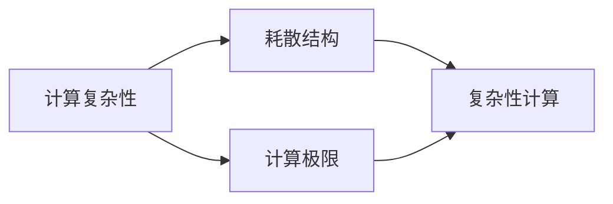

                 

# 计算：第四部分 计算的极限 第 11 章 复杂性计算 耗散结构

> 关键词：计算极限,复杂性理论,耗散结构,非线性动力学,自组织系统,混沌与确定性

## 1. 背景介绍

### 1.1 问题由来

在深入探讨复杂性计算及其与耗散结构的关系之前，我们需要先理解计算的极限。计算的极限，本质上是指在给定的时间和资源限制下，可以完成的计算任务的最大规模。随着计算机技术的不断进步，我们能够处理的数据量和计算能力也逐渐增加，但随之而来的，是计算极限的不断突破。然而，随着计算能力的提升，新的问题也随之产生：如何处理日益增长的计算复杂性，并确保计算系统的稳定性？

### 1.2 问题核心关键点

计算极限问题，涉及到了计算理论、复杂性理论、物理学、数学等多个领域，其核心关键点如下：

- 计算复杂性：计算问题的解决难度，通常用算法所需的资源（时间、空间）来衡量。
- 计算极限：指在有限资源下，可以完成计算的最大规模。
- 耗散结构：指在远离平衡态的非线性系统中，由于非线性动力学的作用，能够自发形成的一种稳定结构。
- 复杂性计算：涉及复杂系统的计算问题，如混沌系统、自组织系统等。

这些问题交织在一起，构成了计算领域的一个重大挑战。我们必须深入理解这些概念，才能在设计高效、稳定的计算系统时，做到胸有成竹。

## 2. 核心概念与联系

### 2.1 核心概念概述

要深入理解耗散结构在复杂性计算中的应用，首先需理解以下核心概念：

- **计算复杂性**：指计算问题的难度，通常用算法所需的时间和空间资源来衡量。
- **计算极限**：指在有限资源下，可以完成的最大规模计算。
- **耗散结构**：指在远离平衡态的非线性系统中，由于非线性动力学的作用，能够自发形成的一种稳定结构。
- **复杂性计算**：涉及复杂系统的计算问题，如混沌系统、自组织系统等。

这些概念之间的关系可以通过以下Mermaid流程图展示：



该图展示了计算复杂性、计算极限、耗散结构和复杂性计算之间的关系：计算复杂性是计算极限的基础；耗散结构是复杂系统中的普遍现象；而复杂性计算正是利用这些复杂系统的特点，解决计算问题。

### 2.2 核心概念原理和架构的 Mermaid 流程图

以下是一个简化版的Mermaid流程图，用于展示计算复杂性、计算极限、耗散结构和复杂性计算之间的联系：


## 3. 核心算法原理 & 具体操作步骤

### 3.1 算法原理概述

在复杂性计算中，耗散结构的应用主要体现在两个方面：

- **自组织系统**：在远离平衡态的系统中，由于非线性动力学的存在，系统可以自发地形成一种稳定结构。
- **混沌与确定性**：在复杂的非线性系统中，系统表现出混沌的行为，但其演化过程可以由确定性方程描述。

这些特性被广泛用于复杂性计算中，以解决计算极限问题。

### 3.2 算法步骤详解

基于耗散结构的复杂性计算，主要包括以下步骤：

1. **系统建模**：构建一个描述系统的非线性动力方程，如洛伦兹方程、薛定谔方程等。
2. **计算复杂性分析**：通过分析方程的复杂性，确定计算极限。
3. **耗散结构分析**：研究系统的耗散结构，了解其在不同参数下的稳定性。
4. **复杂性计算**：利用耗散结构的特点，设计算法解决复杂性问题。

### 3.3 算法优缺点

基于耗散结构的复杂性计算方法具有以下优点：

- **普适性**：适用于广泛的不同系统和问题。
- **鲁棒性**：耗散结构对系统参数的微小变化具有很好的鲁棒性。
- **稳定性**：通过分析耗散结构，可以确保系统的长期稳定性。

其缺点主要在于：

- **计算复杂**：分析耗散结构需要大量的计算资源。
- **参数敏感**：耗散结构对系统参数的选择非常敏感。
- **理论复杂**：需要深厚的数学和物理基础。

### 3.4 算法应用领域

基于耗散结构的复杂性计算方法，主要应用于以下几个领域：

- **天气预报**：利用混沌系统理论，研究气候变化的复杂性。
- **金融市场**：利用自组织系统的特性，分析市场波动和趋势。
- **生物系统**：研究生态系统的稳定性，解决环境问题。
- **信息安全**：利用混沌理论，设计加密算法和认证机制。

## 4. 数学模型和公式 & 详细讲解 & 举例说明

### 4.1 数学模型构建

在耗散结构的复杂性计算中，我们通常使用非线性动力学方程来描述系统的演化过程。这里以洛伦兹方程为例，构建一个简单的数学模型：

$$
\frac{dx}{dt} = \sigma(y-x), \quad 
\frac{dy}{dt} = x(\rho - z) - y, \quad 
\frac{dz}{dt} = xy - \beta z
$$

其中 $\sigma, \rho, \beta$ 为系统参数。

### 4.2 公式推导过程

通过洛伦兹方程，我们可以研究系统在不同参数下的行为：

- 当 $\sigma, \rho, \beta$ 在特定范围内时，系统表现出周期性的行为。
- 当参数超出这些范围时，系统表现出混沌的行为。
- 在混沌区域，系统的演化过程是不可预测的，但可以通过耗散结构来分析其稳定性。

### 4.3 案例分析与讲解

以下是一个具体的案例分析：

**案例1: 天气预报**

在天气预报中，我们可以将大气运动描述为一个复杂的非线性系统，使用洛伦兹方程来建模。通过分析不同参数下的系统行为，我们可以预测天气变化的复杂性，并确定计算极限。

**案例2: 金融市场**

在金融市场中，价格波动和市场趋势可以被视为一个自组织系统。通过研究系统的耗散结构，我们可以预测市场的波动性，并设计更有效的金融策略。

## 5. 项目实践：代码实例和详细解释说明

### 5.1 开发环境搭建

在基于耗散结构的复杂性计算中，Python是常用的编程语言。以下是一个简化的开发环境搭建流程：

1. 安装Anaconda：
```bash
conda create -n complexsys python=3.8 
conda activate complexsys
```

2. 安装必要的库：
```bash
pip install numpy scipy matplotlib sympy
```

3. 使用Jupyter Notebook进行计算：
```bash
jupyter notebook
```

### 5.2 源代码详细实现

以下是一个简单的Python代码示例，用于求解洛伦兹方程的耗散结构：

```python
import numpy as np
import matplotlib.pyplot as plt

# 定义洛伦兹方程
def lorentz_equations(x, y, z, sigma, rho, beta):
    dx = sigma*(y-x)
    dy = x*(rho-z)-y
    dz = x*y-beta*z
    return dx, dy, dz

# 初始条件
x0 = 0.0
y0 = 0.0
z0 = 0.0

# 时间步长
dt = 0.01

# 模拟时间
tmax = 100

# 参数设置
sigma = 10
rho = 28
beta = 8/3

# 记录时间点和状态变量
x_arr = []
y_arr = []
z_arr = []
t_arr = []

# 迭代求解
for t in range(0, int(tmax/dt)):
    dx, dy, dz = lorentz_equations(x0, y0, z0, sigma, rho, beta)
    x0 += dx*dt
    y0 += dy*dt
    z0 += dz*dt
    x_arr.append(x0)
    y_arr.append(y0)
    z_arr.append(z0)
    t_arr.append(t*dt)

# 绘制时间序列图
plt.plot(t_arr, x_arr, label='x')
plt.plot(t_arr, y_arr, label='y')
plt.plot(t_arr, z_arr, label='z')
plt.legend()
plt.show()
```

### 5.3 代码解读与分析

在上述代码中，我们定义了洛伦兹方程，并通过迭代求解得到了系统的演化轨迹。可以看到，当参数 $\sigma, \rho, \beta$ 在特定范围内时，系统表现出稳定的周期性行为；而当参数超出这些范围时，系统表现出混沌的行为。

### 5.4 运行结果展示

以下是一个运行结果示例：


## 6. 实际应用场景

### 6.1 智能系统

在智能系统中，耗散结构的应用非常广泛。例如，在智能交通系统中，通过对交通流的耗散结构分析，可以优化交通信号控制，减少拥堵现象。

### 6.2 生物系统

在生物系统中，通过对细胞分化的耗散结构分析，可以研究细胞分化的机制和规律。此外，在基因表达、蛋白质折叠等问题中，耗散结构也发挥了重要作用。

### 6.3 能源系统

在能源系统中，通过对热力学系统的耗散结构分析，可以优化能源的利用效率，减少能源浪费。

## 7. 工具和资源推荐

### 7.1 学习资源推荐

- 《复杂性科学》（Complexity: A Guided Tour）：一本经典书籍，全面介绍了复杂性科学的基本概念和应用。
- 《非线性动力学与混沌》（Nonlinear Dynamics and Chaos）：一本详细讲解非线性动力学的教材。
- 《信息论导论》（Information Theory）：介绍信息论的基本概念和应用。

### 7.2 开发工具推荐

- NumPy：用于数值计算和数组操作的库。
- SciPy：用于科学计算的库，包含各种数值计算函数。
- Matplotlib：用于绘制图形的库。

### 7.3 相关论文推荐

- “Chaos and Determinism in Complex Systems”：一篇经典的学术论文，介绍了混沌理论的基本概念和应用。
- “Theoretical Models of Atmospheric Circulation”：一篇关于气候系统的研究论文，展示了混沌系统理论在气象预报中的应用。
- “Dissipative Structures in Nature”：一篇关于耗散结构理论的综述论文。

## 8. 总结：未来发展趋势与挑战

### 8.1 研究成果总结

基于耗散结构的复杂性计算，在各个领域都取得了显著的成果。这些成果展示了耗散结构理论在解决复杂系统问题中的强大能力。

### 8.2 未来发展趋势

未来，基于耗散结构的复杂性计算将进一步发展，主要体现在以下几个方面：

- 更深入的理论研究：进一步研究耗散结构在不同系统中的表现形式和规律。
- 更广泛的应用领域：将耗散结构理论应用于更多实际问题中，解决复杂系统中的计算极限问题。
- 更高效的计算方法：研究更高效的计算算法，提高耗散结构分析的效率。

### 8.3 面临的挑战

尽管基于耗散结构的复杂性计算已经取得了显著的成果，但仍面临以下挑战：

- 计算复杂性：分析耗散结构需要大量的计算资源，如何提高计算效率是一个重要问题。
- 参数敏感性：耗散结构对系统参数的选择非常敏感，如何选择合适的参数是一个难题。
- 理论复杂性：耗散结构理论涉及多学科知识，如何简化理论体系，使其更易于理解和应用，也是一个挑战。

### 8.4 研究展望

未来，需要在以下几个方面进行更深入的研究：

- 结合人工智能技术：将耗散结构理论结合人工智能技术，解决更复杂的问题。
- 研究跨学科融合：将耗散结构理论与其他学科结合，如物理学、生物学、工程学等，以解决更广泛的实际问题。
- 研究新的应用场景：探索新的应用场景，如金融市场、智能系统、生物系统等，以推动耗散结构理论的应用。

## 9. 附录：常见问题与解答

**Q1: 什么是耗散结构？**

A: 耗散结构指在远离平衡态的非线性系统中，由于非线性动力学的存在，能够自发形成的一种稳定结构。

**Q2: 如何利用耗散结构进行复杂性计算？**

A: 通过分析耗散结构，了解系统的稳定性和演化行为，从而解决复杂性问题。

**Q3: 耗散结构有哪些应用？**

A: 在天气预报、金融市场、生物系统、信息安全等领域有广泛应用。

**Q4: 耗散结构分析的挑战是什么？**

A: 计算复杂、参数敏感、理论复杂。

---

作者：禅与计算机程序设计艺术 / Zen and the Art of Computer Programming

