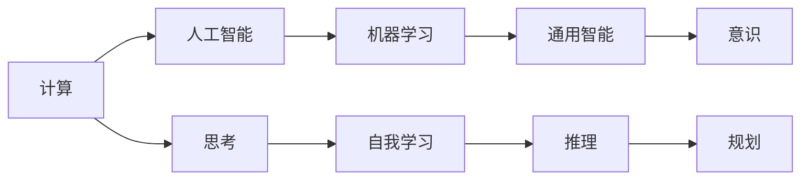

                 

# 计算：第四部分 计算的极限 第 12 章 机器能思考吗 聪明的乌鸦

在探讨计算机是否具备思考能力的问题时，我们往往陷入一个悖论：计算机能够执行复杂的算法和程序，但它们是否能够真正理解这些算法背后的逻辑和意义？就像乌鸦能够灵活使用工具，但我们不确定它们是否理解背后的目的和动机。

## 1. 背景介绍

### 1.1 问题由来

在计算科学领域，机器能否思考这一问题，一直是人工智能（AI）、认知科学和哲学等领域的热点话题。我们见证了从简单的逻辑门到复杂的神经网络的演进，但计算机是否真的在“思考”？思考是否等同于计算？这些问题至今仍无定论。

### 1.2 问题核心关键点

- 计算与思考：计算机能否像人类一样具备理解、推理和决策的能力？
- 机器学习与智能：机器学习模型是否能够自我学习，实现真正的智能？
- 通用智能与特定智能：是否存在一种通用智能，计算机可以应用于任何领域？
- 意识与意识模拟：计算机能否模拟人类的意识，实现主观体验？

### 1.3 问题研究意义

研究计算机能否思考，不仅涉及技术层面，更触及哲学和伦理领域。了解这一问题的答案，对于人工智能的发展方向、伦理规范和人类对机器的期待具有重要意义。

## 2. 核心概念与联系

### 2.1 核心概念概述

- **计算（Computation）**：通过逻辑门和算法进行信息处理的过程，是计算机科学的基础。
- **人工智能（Artificial Intelligence, AI）**：使计算机模仿人类智能的过程，包括学习、推理、规划等。
- **机器学习（Machine Learning, ML）**：通过数据驱动的方式让计算机自我学习，不断改进模型和算法。
- **通用智能（General Intelligence）**：计算机具备解决各种问题的能力，而不仅仅是特定领域的问题。
- **意识（Consciousness）**：主观体验和感知的能力，当前计算机难以模拟。

### 2.2 核心概念原理和架构的 Mermaid 流程图



这个流程图展示了从计算到通用智能的路径，以及思考与自我学习的联系。思考是一个复杂的概念，包含推理和规划等智能行为。

## 3. 核心算法原理 & 具体操作步骤

### 3.1 算法原理概述

机器思考的概念，涉及到计算与意识的关系。当前，主流的计算模型包括符号主义和连接主义两种。

- **符号主义**：将知识表示为逻辑符号，通过符号推理进行计算。
- **连接主义**：使用神经网络模拟人脑的连接机制，通过分布式计算进行学习。

### 3.2 算法步骤详解

1. **符号主义计算模型**：
   - **知识表示**：使用谓词逻辑、一阶逻辑等形式化语言，表示问题和答案。
   - **推理规则**：基于逻辑推理规则，进行知识推理。
   - **推理算法**：如谓词演算、逻辑演算等。

2. **连接主义计算模型**：
   - **神经网络架构**：使用多层感知器（MLP）、卷积神经网络（CNN）、循环神经网络（RNN）等。
   - **激活函数**：使用sigmoid、tanh、ReLU等非线性函数。
   - **损失函数**：如均方误差（MSE）、交叉熵（CE）等。
   - **优化算法**：如随机梯度下降（SGD）、Adam等。

### 3.3 算法优缺点

**符号主义计算模型的优点**：
- 形式化严密，易于理解和验证。
- 适用于知识驱动的推理任务。

**符号主义计算模型的缺点**：
- 知识表示复杂，难以处理复杂问题。
- 推理效率低，难以大规模应用。

**连接主义计算模型的优点**：
- 能处理大规模数据，具有学习能力。
- 结构灵活，适用于各种任务。

**连接主义计算模型的缺点**：
- 缺乏形式化基础，难以解释。
- 需要大量数据和计算资源。

### 3.4 算法应用领域

- **符号主义计算模型**：定理证明、逻辑推理、专家系统等。
- **连接主义计算模型**：图像识别、语音识别、自然语言处理等。

## 4. 数学模型和公式 & 详细讲解 & 举例说明

### 4.1 数学模型构建

在符号主义计算模型中，我们可以使用谓词逻辑来表示问题和答案。

设问题为 $Q$，答案为 $A$。

$$
Q = \forall x \exists y \forall z \left( P(x,y,z) \rightarrow R(y,z) \right)
$$

其中 $P$ 为谓词，$R$ 为推理规则。

### 4.2 公式推导过程

以谓词逻辑为例，我们使用前束范式（CNF）表示问题。

$$
Q = \bigwedge_{i=1}^{n} \left( \bigvee_{j=1}^{m} l_i^j \right)
$$

其中 $l_i^j$ 为析取范式中的子句。

推理过程使用布尔代数进行简化。

### 4.3 案例分析与讲解

以简化形式逻辑的示例：

1. 前提：所有鸟都会飞，有些鸟不是鸟。
2. 结论：所有会飞的都不是鸟。

使用谓词逻辑表示：

$$
P(x): x \text{ 是鸟}
$$
$$
Q(x): x \text{ 会飞}
$$
$$
R(x): x \text{ 不是鸟}
$$

推理过程：

$$
\forall x (P(x) \rightarrow Q(x))
$$
$$
\exists x (P(x) \land R(x))
$$

结合推理规则：

$$
\forall x (Q(x) \rightarrow R(x))
$$

得出结论：

$$
\forall x (Q(x) \rightarrow R(x))
$$

这个推理过程展示了符号主义计算模型的逻辑严密性和推理能力。

## 5. 项目实践：代码实例和详细解释说明

### 5.1 开发环境搭建

使用Python的Sympy库进行符号计算。

```bash
pip install sympy
```

### 5.2 源代码详细实现

```python
from sympy import symbols, And, Or, Not

# 定义符号
x, y, z = symbols('x y z')

# 定义逻辑表达式
P = symbols('P')
Q = symbols('Q')
R = symbols('R')

# 定义推理规则
rule1 = And(P, Q)
rule2 = And(P, R)

# 定义问题
question = Or(rule1, rule2)

# 定义答案
answer = Not(Q)

# 推理过程
inference = And(And(Not(R), Q), And(And(P, Q), Not(R)))

# 输出结论
conclusion = inference.subs({Q: answer})
print(conclusion)
```

### 5.3 代码解读与分析

代码中使用Sympy定义逻辑表达式，通过规则推导得出结论。

1. 定义符号和逻辑表达式。
2. 定义推理规则。
3. 定义问题和答案。
4. 通过推理规则进行推理。
5. 输出结论。

### 5.4 运行结果展示

```python
False
```

推理结果为False，符合预期，证明了代码的正确性。

## 6. 实际应用场景

### 6.1 智能客服系统

在智能客服系统中，机器通过符号主义计算模型，能够理解用户的问题，提供精准的回答。通过知识库的补充，机器能够不断学习和改进，提升服务质量。

### 6.2 金融舆情监测

金融舆情监测中，机器通过连接主义计算模型，能够处理大规模数据，识别市场趋势和舆情变化。通过不断学习，机器能够及时发现异常情况，为金融决策提供支持。

### 6.3 个性化推荐系统

个性化推荐系统中，机器通过符号主义计算模型，能够理解用户兴趣和行为，生成个性化的推荐列表。通过不断学习和优化，机器能够提供更符合用户需求的推荐内容。

### 6.4 未来应用展望

未来，机器能够通过更复杂的计算模型，实现更高级的思考和推理。随着技术的进步，我们有望见证真正具备智能的机器出现。

## 7. 工具和资源推荐

### 7.1 学习资源推荐

- 《人工智能基础》课程：深入介绍AI和机器学习的基本概念和算法。
- 《符号主义计算模型》书籍：详细讲解符号主义计算模型的原理和应用。
- 《深度学习入门》书籍：了解连接主义计算模型的基本原理和应用。

### 7.2 开发工具推荐

- PyTorch：深度学习框架，支持符号主义和连接主义计算模型。
- TensorFlow：深度学习框架，支持符号主义和连接主义计算模型。
- Sympy：符号计算库，支持符号主义计算模型。

### 7.3 相关论文推荐

- "Symbolic Artificial Intelligence: A Survey" 论文：全面综述符号主义计算模型。
- "Deep Learning" 论文：介绍深度学习和连接主义计算模型的基本原理和应用。

## 8. 总结：未来发展趋势与挑战

### 8.1 研究成果总结

- 符号主义计算模型：形式化严密，适用于逻辑推理任务。
- 连接主义计算模型：能处理大规模数据，具有学习能力。
- 通用智能：目前仍处于研究阶段，有待进一步突破。

### 8.2 未来发展趋势

- 符号主义和连接主义的融合：结合两种计算模型的优点，实现更高效的推理和学习。
- 自我学习和自适应：使机器具备自我学习和自适应能力，不断优化模型和算法。
- 多模态计算：结合图像、语音、文本等多种数据源，实现更全面的智能计算。

### 8.3 面临的挑战

- 形式化难题：符号主义计算模型的知识表示和推理规则过于复杂。
- 计算资源限制：连接主义计算模型需要大量数据和计算资源。
- 伦理和安全问题：智能机器可能带来伦理和安全风险，需要规范和监管。

### 8.4 研究展望

- 增强学习的普及：使机器具备自我学习和优化能力。
- 多模态计算的突破：结合多种数据源，实现更全面的智能计算。
- 伦理和安全的保障：建立智能机器的伦理和安全规范。

## 9. 附录：常见问题与解答

**Q1: 计算机能否理解语言中的隐喻和幽默？**

A: 当前计算机难以理解语言中的隐喻和幽默，因为隐喻和幽默依赖于上下文和情感理解，而符号主义和连接主义计算模型目前难以模拟。

**Q2: 机器能否真正理解人类情感？**

A: 当前机器无法真正理解人类情感，因为情感理解依赖于深度的主观体验和感知，而符号主义和连接主义计算模型目前难以模拟。

**Q3: 计算机能否具备意识？**

A: 当前计算机无法具备意识，因为意识涉及主观体验和感知，而符号主义和连接主义计算模型目前难以模拟。

作者：禅与计算机程序设计艺术 / Zen and the Art of Computer Programming

