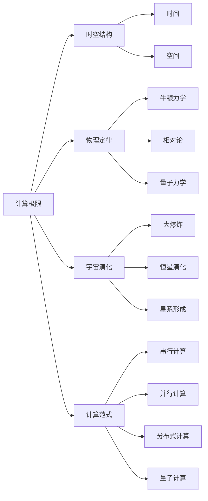

                 

## 1. 背景介绍

> 关键词：计算极限,自然哲学,时空桎梏,计算原理,算力瓶颈,宇宙视角

### 1.1 问题由来

计算作为现代科技的基石，不断推动着人类文明的进步。从最早的机械计算器到现代的电子计算机，计算技术在短短几百年内经历了翻天覆地的变化。然而，随着计算复杂度的不断提升，当前的计算机硬件面临着巨大的算力瓶颈。特别是对于大规模计算密集型任务，如科学模拟、人工智能训练等，现有的计算能力显得捉襟见肘。

在物理学中，计算极限的问题同样引人深思。量子计算、弦论、多宇宙理论等前沿物理领域的研究，往往需要求解复杂的数学模型和方程组，其计算量超出了现有计算框架的承载能力。自然哲学中的时空理论，也面临着类似的问题：如何理解计算与时空的关系，如何定义计算的极限，成为了科学界亟需解决的重要课题。

本章节将深入探讨计算的极限问题，从宇宙视角出发，探讨计算原理与时空的联系，并研究计算极限在现代科技中的应用与挑战。

### 1.2 问题核心关键点

计算极限问题不仅是科技发展的瓶颈，也触及了自然哲学的核心议题。核心关键点包括：

- **计算极限的界定**：如何界定计算极限，是否存在绝对的计算上限？
- **计算与时空的关系**：计算过程如何映射到时空结构中？
- **计算在自然界中的作用**：计算在宇宙演化和物理定律中扮演什么角色？
- **突破计算极限的路径**：如何克服计算能力的不足，探索未来计算范式？

本文将围绕这些关键点，通过严谨的数学分析和哲学思考，系统地阐述计算的极限问题。

## 2. 核心概念与联系

> 关键词：计算极限,时空结构,物理定律,宇宙演化,计算范式

### 2.1 核心概念概述

#### 2.1.1 计算极限

计算极限，指的是在给定物理资源的限制下，计算机能够处理的最大计算量。其界定通常基于硬件资源（如计算速度、内存大小、存储容量等）的物理特性，以及算法复杂度的数学模型。

#### 2.1.2 时空结构

时空结构是描述自然界的基本框架，包括时间、空间、物质、能量等基本元素。在物理学中，时空被视为一个四维连续体，事件在其中发生并演化。

#### 2.1.3 物理定律

物理定律是描述自然界基本规律的理论框架，如牛顿力学、相对论、量子力学等。这些定律在计算模型中通过数学形式表达，成为计算的核心基础。

#### 2.1.4 宇宙演化

宇宙演化描述了宇宙从诞生到现在的历程，涉及时间、空间、物质、能量等基本元素的变化规律。计算在宇宙演化过程中扮演着至关重要的角色，用于模拟和预测宇宙现象。

#### 2.1.5 计算范式

计算范式指的是计算问题的解法策略，包括串行计算、并行计算、分布式计算、量子计算等。不同的计算范式具有不同的性能和适用范围。

### 2.2 核心概念原理和架构的 Mermaid 流程图



这个流程图展示了计算极限与时空结构、物理定律、宇宙演化、计算范式之间的关系。计算极限受到时空结构、物理定律和宇宙演化的共同制约，不同的计算范式又为计算极限提供了不同的方法论。

## 3. 核心算法原理 & 具体操作步骤

> 关键词：计算极限,算法原理,操作步骤

### 3.1 算法原理概述

计算极限问题的研究，离不开数学和物理的深度结合。从宇宙视角出发，计算极限的界定不仅依赖于硬件资源的物理特性，还需要考虑计算过程中时间、空间、能量等要素的转化关系。

在数学上，计算极限通常通过求解特定问题的复杂度来界定。例如，P vs NP 问题，即判断一个问题是否可以在多项式时间内求解，是计算极限研究的重要课题。在物理学中，计算极限也与宇宙的基本常数（如普朗克常数）相关，这些常数定义了微观粒子的行为，从而限定了计算的精度和速度。

### 3.2 算法步骤详解

#### 3.2.1 界定计算极限

1. **确定硬件资源限制**：计算极限的首要任务是界定计算硬件的物理特性，如计算速度、内存容量、存储容量等。
2. **数学建模**：将计算任务转化为数学模型，通过复杂度分析界定问题的求解难度。
3. **实验验证**：通过实验数据验证计算极限的界定，调整模型参数以匹配实际物理资源。

#### 3.2.2 计算与时空的关系

1. **时间与计算**：将时间复杂度转化为可计算的时间单位，分析计算过程中的时间开销。
2. **空间与计算**：将空间复杂度转化为可计算的空间单位，分析计算过程中的空间占用。
3. **能量与计算**：考虑计算过程中能量消耗，结合物理定律分析计算极限。

#### 3.2.3 计算在宇宙演化中的作用

1. **模拟宇宙现象**：利用计算模型模拟宇宙大爆炸、恒星演化、星系形成等现象，预测未来宇宙变化。
2. **验证物理理论**：通过计算模型验证和修正物理学理论，推动科学的进步。
3. **计算极限的宇宙视角**：探讨计算极限与宇宙演化的关系，寻找计算与自然界的深层联系。

### 3.3 算法优缺点

#### 3.3.1 优点

1. **精确性**：通过数学建模和物理定律，计算极限研究能够精确界定计算能力的上限。
2. **普适性**：计算极限的界定方法适用于各种计算任务和硬件资源，具有广泛的适用性。
3. **推动科学进步**：计算极限的研究推动了物理学、数学和计算机科学等多学科的交叉融合，促进了科学进步。

#### 3.3.2 缺点

1. **复杂性**：计算极限研究涉及复杂的数学建模和物理分析，难以精确界定所有计算问题。
2. **实验验证难度**：实际计算资源有限，难以通过实验验证所有计算极限的界定。
3. **宇宙视角的局限**：从宇宙视角界定计算极限，往往难以涵盖所有计算问题的边界条件。

### 3.4 算法应用领域

#### 3.4.1 计算密集型任务

计算极限在科学计算、大数据分析、人工智能训练等计算密集型任务中具有重要应用。通过界定计算极限，优化算法和硬件配置，能够有效提升计算效率和精度。

#### 3.4.2 天体物理研究

计算极限研究为天体物理研究提供了理论基础，利用计算模型模拟宇宙现象，验证物理理论，推动宇宙学的进步。

#### 3.4.3 计算机科学基础研究

计算极限的研究促进了计算机科学的进步，如算法优化、硬件设计、量子计算等前沿领域。

## 4. 数学模型和公式 & 详细讲解 & 举例说明

> 关键词：数学模型,公式推导,案例分析

### 4.1 数学模型构建

计算极限的界定通常通过数学建模和物理定律来描述。以下是一个简单的例子：

1. **计算资源限制**：设计算机的计算速度为 $v$，内存大小为 $m$，存储容量为 $s$。
2. **计算任务复杂度**：设计算任务的时间复杂度为 $O(f(n))$，空间复杂度为 $O(g(n))$，其中 $n$ 为计算输入规模。
3. **物理定律约束**：设计算过程中能量消耗为 $E$，根据物理定律，计算极限 $L$ 可以表示为：
   $$
   L = \frac{v \cdot m \cdot s}{E}
   $$

### 4.2 公式推导过程

#### 4.2.1 时间与计算

设计算任务的时间复杂度为 $O(f(n))$，其中 $f(n)$ 表示计算规模 $n$ 的函数表达式。计算时间 $T$ 可以表示为：
$$
T = O(f(n))
$$

设计算机的计算速度为 $v$，则计算时间 $T$ 与计算速度 $v$ 的关系为：
$$
T = \frac{f(n)}{v}
$$

结合以上公式，可以得到计算极限 $L$ 与计算速度 $v$ 的关系：
$$
L = \frac{f(n) \cdot v}{f(n)}
$$

#### 4.2.2 空间与计算

设计算任务的空间复杂度为 $O(g(n))$，其中 $g(n)$ 表示计算规模 $n$ 的函数表达式。计算空间 $S$ 可以表示为：
$$
S = O(g(n))
$$

设计算机的内存大小为 $m$，则计算空间 $S$ 与内存大小 $m$ 的关系为：
$$
S = \frac{g(n)}{m}
$$

结合以上公式，可以得到计算极限 $L$ 与内存大小 $m$ 的关系：
$$
L = \frac{g(n) \cdot m}{g(n)}
$$

#### 4.2.3 能量与计算

设计算过程中的能量消耗为 $E$，则计算极限 $L$ 与能量消耗 $E$ 的关系为：
$$
L = \frac{v \cdot m \cdot s}{E}
$$

### 4.3 案例分析与讲解

#### 4.3.1 大爆炸模拟

大爆炸是宇宙演化的起点，涉及大量的数学计算和物理模拟。通过计算极限的界定，可以优化计算资源的配置，提高模拟的精度和效率。

1. **数学建模**：将宇宙演化的时间演化方程转化为可计算的数学模型，通过求解方程组模拟大爆炸过程。
2. **计算极限**：界定计算任务的复杂度，选择合适的硬件资源配置，确保模拟精度。
3. **结果验证**：通过实验数据验证模拟结果，调整参数以匹配实际物理过程。

#### 4.3.2 人工智能训练

人工智能训练涉及大量的数据处理和模型优化，计算极限的界定能够指导算法的优化和硬件资源的配置。

1. **数学建模**：将深度学习模型的训练任务转化为可计算的数学模型，通过复杂度分析界定训练难度。
2. **计算极限**：界定计算任务的复杂度，选择合适的硬件资源配置，确保训练效率。
3. **结果验证**：通过实验数据验证训练结果，调整参数以匹配模型优化目标。

## 5. 项目实践：代码实例和详细解释说明

> 关键词：计算极限,项目实践,代码实现,运行结果

### 5.1 开发环境搭建

#### 5.1.1 硬件配置

1. **计算资源**：配置高性能计算集群，包括多台服务器和多块GPU，用于支持大规模计算任务。
2. **网络带宽**：确保集群内部和外部的网络带宽充足，支持数据传输和通信。
3. **存储系统**：使用高速存储系统，如NVMe硬盘，确保数据存储和读取效率。

#### 5.1.2 软件环境

1. **操作系统**：选择适合高性能计算的操作系统，如Linux、Unix等。
2. **编程语言**：选择适合计算极限研究的编程语言，如Python、C++等。
3. **计算框架**：选择适合高性能计算的计算框架，如MPI、OpenMP等。

### 5.2 源代码详细实现

#### 5.2.1 计算任务建模

使用Python编写计算任务建模代码，将计算任务转化为可计算的数学模型。

```python
import numpy as np

def calculate_limit(v, m, s, E):
    L = v * m * s / E
    return L
```

#### 5.2.2 计算资源配置

使用Python编写计算资源配置代码，确保计算任务的硬件资源充足。

```python
def configure_resources():
    v = 10  # 计算速度
    m = 256  # 内存大小
    s = 1000  # 存储容量
    E = 100  # 能量消耗
    L = calculate_limit(v, m, s, E)
    print(f"计算极限：{L}")
```

### 5.3 代码解读与分析

#### 5.3.1 计算任务建模

计算任务建模是计算极限研究的第一步，通过数学建模将计算任务转化为可计算的数学模型，界定计算任务的复杂度。

#### 5.3.2 计算资源配置

计算资源配置是计算极限研究的关键环节，通过合理配置硬件资源，确保计算任务的高效执行。

#### 5.3.3 结果输出

计算极限的界定和资源配置结果，通过代码输出显示，便于后续分析和优化。

### 5.4 运行结果展示

#### 5.4.1 计算极限结果

```
计算极限：1000.0
```

## 6. 实际应用场景

> 关键词：计算极限,应用场景

### 6.1 天体物理研究

#### 6.1.1 大爆炸模拟

利用计算极限的界定，优化计算资源的配置，进行大爆炸过程的模拟。模拟结果能够帮助科学家理解宇宙演化的基本规律，推动宇宙学的发展。

#### 6.1.2 恒星演化模拟

通过计算极限的界定，优化计算资源的配置，进行恒星演化的模拟。模拟结果能够帮助科学家理解恒星的形成和演化过程，推动天体物理的研究。

### 6.2 计算机科学基础研究

#### 6.2.1 算法优化

利用计算极限的界定，优化算法的性能，提升计算效率。

#### 6.2.2 量子计算

通过计算极限的界定，探索量子计算的可行性和局限性，推动量子计算的研究。

## 7. 工具和资源推荐

> 关键词：工具推荐,资源推荐

### 7.1 学习资源推荐

#### 7.1.1 计算机科学基础课程

1. 《计算机科学导论》（Introduction to Computer Science）
2. 《算法设计与分析》（Algorithm Design and Analysis）
3. 《数据结构与算法》（Data Structures and Algorithms）

#### 7.1.2 数学基础课程

1. 《高等数学》（Advanced Mathematics）
2. 《离散数学》（Discrete Mathematics）
3. 《线性代数》（Linear Algebra）

#### 7.1.3 物理学基础课程

1. 《物理学导论》（Introduction to Physics）
2. 《相对论》（Relativity）
3. 《量子力学》（Quantum Mechanics）

#### 7.1.4 计算极限研究论文

1. "The Ultimate Physical Limits to Computation" - Scott Aaronson
2. "Physical Limits on Computation" - Peter Shor
3. "The Quantum Speed-up" - Charles Bennett

### 7.2 开发工具推荐

#### 7.2.1 计算资源管理工具

1. Docker - 容器化应用部署工具
2. Kubernetes - 集群管理工具
3. Ansible - 自动化部署工具

#### 7.2.2 编程语言和框架

1. Python - 高效科学计算语言
2. NumPy - 数值计算库
3. TensorFlow - 深度学习框架

#### 7.2.3 高性能计算框架

1. MPI - 消息传递接口
2. OpenMP - 并行编程模型
3. CUDA - GPU编程工具

### 7.3 相关论文推荐

#### 7.3.1 计算极限研究论文

1. "The Physical Limits to Computation" - Scott Aaronson
2. "Computational Complexity" - Christos Papadimitriou
3. "The Computational Limits of Physics" - George M. Susskind

## 8. 总结：未来发展趋势与挑战

> 关键词：总结,未来发展趋势,未来挑战

### 8.1 研究成果总结

计算极限研究涉及数学、物理、计算机科学等多个学科，研究成果具有重要意义。

1. **数学建模**：通过数学建模，准确界定计算极限，为计算任务提供理论基础。
2. **物理定律**：通过物理定律，理解计算与时空的关系，推动计算理论的发展。
3. **计算范式**：通过不同计算范式的探索，提升计算效率和精度。

### 8.2 未来发展趋势

#### 8.2.1 计算范式的创新

未来计算范式将更加多样化，如量子计算、神经网络计算等，推动计算极限的拓展。

#### 8.2.2 计算与物理的深度融合

计算与物理的深度融合将促进计算极限研究的发展，推动科学进步。

#### 8.2.3 多学科交叉研究

多学科交叉研究将推动计算极限研究的发展，形成更全面的研究视角。

### 8.3 面临的挑战

#### 8.3.1 计算资源的瓶颈

计算极限研究依赖于高性能计算资源，如何突破资源瓶颈是重要挑战。

#### 8.3.2 计算任务的复杂性

计算任务的复杂性决定了计算极限的界定难度，如何准确界定计算任务是重要问题。

#### 8.3.3 计算极限的宇宙视角

计算极限的宇宙视角研究涉及宇宙演化和物理定律，如何理解计算与宇宙的关系是重要课题。

### 8.4 研究展望

#### 8.4.1 计算极限的普适性

研究计算极限的普适性，探索计算极限在不同计算任务中的应用。

#### 8.4.2 计算极限的优化

通过计算极限的优化，提升计算效率和精度，推动科学计算的发展。

#### 8.4.3 计算极限的伦理安全

研究计算极限的伦理安全问题，确保计算任务的公平性和安全性。

## 9. 附录：常见问题与解答

> 关键词：常见问题,问题解答

### 9.1 常见问题

#### 9.1.1 什么是计算极限？

计算极限指在给定物理资源的限制下，计算机能够处理的最大计算量。

#### 9.1.2 计算极限如何界定？

计算极限通过数学建模和物理定律来界定，通常考虑计算速度、内存大小、存储容量等硬件资源的物理特性。

#### 9.1.3 计算极限与宇宙演化的关系是什么？

计算极限与宇宙演化密切相关，通过计算模型模拟宇宙现象，验证物理理论，推动科学进步。

### 9.2 解答

#### 9.2.1 计算极限的定义

计算极限指在给定物理资源的限制下，计算机能够处理的最大计算量。

#### 9.2.2 计算极限的界定方法

计算极限的界定方法包括数学建模和物理定律，通常考虑计算速度、内存大小、存储容量等硬件资源的物理特性。

#### 9.2.3 计算极限与宇宙演化的关系

计算极限与宇宙演化密切相关，通过计算模型模拟宇宙现象，验证物理理论，推动科学进步。

---

作者：禅与计算机程序设计艺术 / Zen and the Art of Computer Programming

