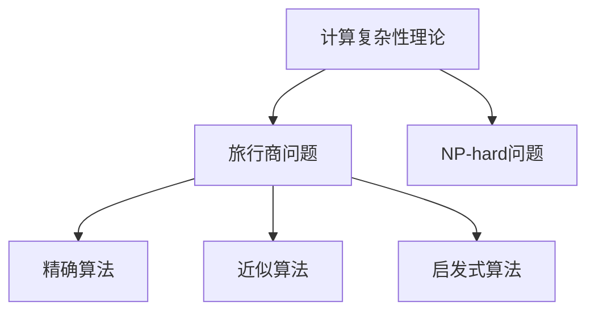

                 

# 计算：第四部分 计算的极限 第 9 章 计算复杂性 旅行商问题

> 关键词：计算复杂性，旅行商问题，NP-hard，精确算法，近似算法，启发式算法

## 1. 背景介绍

### 1.1 问题由来

在计算机科学中，计算复杂性(Computational Complexity)是指解决某个问题所需计算资源（如时间、空间、能量等）的多少。计算复杂性理论旨在研究不同计算问题的难度等级，为问题的求解提供理论指导。

旅行商问题(Traveling Salesman Problem, TSP)是最经典的计算复杂性问题之一。它描述了一个旅行商（旅行销售员）如何以最小的总距离拜访完所有给定的城市，然后返回出发点。TSP在物流、航空、电信等领域有广泛应用，是一个典型的组合优化问题。

TSP问题通常可以用以下图形来表示：

```mermaid
graph TB
    A[City 1] -- B{City 2} -- C[City 3] -- D[City 4] -- E[City 5]
    C -- F[City 6] -- E
```

从图中任意节点出发，回到原点，经过所有节点恰好一次，并尽可能地最小化总距离。

### 1.2 问题核心关键点

- **计算复杂性**：TSP是NP-hard问题，意味着没有一个已知的算法可以在多项式时间内解决，即没有已知多项式算法可以在可接受的计算时间内处理任意规模的TSP问题。
- **精确算法**：精确算法是指能够找到TSP最优解的算法，但在许多实际应用中，由于规模太大，往往无法使用精确算法。
- **近似算法**：近似算法不能保证找到最优解，但能够在可接受的时间内找到一个足够好的解。
- **启发式算法**：启发式算法通常基于某些规则或启发式进行优化，能够快速找到接近最优解的解。

这些概念构成了TSP问题研究的基石，为解决这一复杂问题提供了多种方向和手段。

## 2. 核心概念与联系

### 2.1 核心概念概述

- **计算复杂性理论**：研究计算问题的难度等级，为问题的求解提供理论指导。
- **旅行商问题**：描述旅行商以最小总距离拜访所有城市，并返回出发点的问题。
- **NP-hard问题**：一类计算问题，至今没有多项式时间算法解决，即无法在多项式时间内找到最优解。
- **精确算法**：找到TSP最优解的算法，但难以处理大规模问题。
- **近似算法**：找到接近最优解的算法，能够在较短时间内处理大规模问题。
- **启发式算法**：基于启发式进行优化的算法，能够快速找到接近最优解的解。

这些概念之间的逻辑关系可以通过以下Mermaid流程图来展示：



这个流程图展示了TSP问题与计算复杂性理论的关系，以及求解TSP问题的不同算法类型。

## 3. 核心算法原理 & 具体操作步骤
### 3.1 算法原理概述

旅行商问题（TSP）是一个经典的组合优化问题，其目标是在给定的城市集合中找到一条最短的路径，使得路径通过所有城市恰好一次并最终回到起点。由于TSP的规模和复杂性，解决TSP是一个计算密集型的任务，目前没有已知的多项式时间算法可以解决TSP。

TSP问题通常通过精确算法、近似算法和启发式算法来解决。其中，精确算法包括动态规划和分支定界法，适用于规模较小的问题。而对于大规模的TSP问题，近似算法和启发式算法则更为常用。

### 3.2 算法步骤详解

#### 3.2.1 动态规划算法

动态规划（Dynamic Programming, DP）是一种解决最优化问题的算法，其基本思想是将原问题划分为多个子问题，分别解决并最终组合成原问题的解。

对于TSP问题，假设已有城市集合$V$，$n$个城市和$n$条边，每条边$(u,v)$表示从城市$u$到城市$v$的距离。

**步骤1**：构建子问题，定义子问题的解与原问题的解之间的关系。
- 定义$D(i)$为从城市$i$开始，经过其他城市恰好一次，回到城市$i$的路径。

**步骤2**：定义状态转移方程。
- $D(i)$的状态转移方程如下：
$$
D(i) = \min_{j \in V \setminus \{i\}} (d(i,j) + D(j))
$$
其中$d(i,j)$表示从城市$i$到城市$j$的距离。

**步骤3**：定义初始条件。
- $D(i)$的初始条件为$D(i) = 0$，当$i$为起点城市。

**步骤4**：计算原问题的解。
- 计算$D(1)$即可得到TSP的最优路径。

**伪代码**：

```python
D = [0] * (n + 1)
for i in range(2, n + 1):
    min_cost = float('inf')
    for j in range(1, n + 1):
        if j not in visited_set:
            visited_set.add(j)
            cost = distance[u][v] + D[v]
            if cost < min_cost:
                min_cost = cost
            visited_set.remove(j)
    D[i] = min_cost
```

#### 3.2.2 分支定界法

分支定界法（Branch and Bound）是另一种解决TSP问题的精确算法。它通过逐步分割问题空间，进行穷举搜索，并根据问题的特性进行剪枝，以减少搜索空间。

**步骤1**：定义问题的上下界。
- 定义问题的上界$UB$为从起点开始，按照任意路径遍历所有城市，并返回起点的距离。
- 定义问题的下界$LB$为从起点开始，按照最优路径遍历所有城市，并返回起点的距离。

**步骤2**：构建搜索树。
- 以起点城市为根节点，根据所有未访问的城市，构建所有可能的子节点。

**步骤3**：剪枝。
- 对于每个子节点，计算其上界和下界，如果上界大于已找到的最优解，则剪枝。

**步骤4**：搜索最优解。
- 递归搜索子树，直到找到最优解。

**伪代码**：

```python
def branch_and_bound(graph, start, visited, bound):
    if len(visited) == len(graph):
        return bound
    min_cost = float('inf')
    for vertex in graph[start]:
        if vertex not in visited:
            visited.add(vertex)
            cost = calculate_cost(start, vertex)
            child_bound = branch_and_bound(graph, vertex, visited, bound + cost)
            min_cost = min(min_cost, child_bound)
            visited.remove(vertex)
    return min_cost

def calculate_cost(start, end):
    return graph[start][end] + calculate_cost(end, start)
```

#### 3.2.3 近似算法

近似算法（Approximation Algorithm）不能保证找到最优解，但能够在较短时间内找到一个接近最优解的解。

**3.2.3.1 2-近似算法**

2-近似算法是一种常见的近似算法，其思想是先随机选择一个城市作为起点，然后每次选择距离最近的城市进行扩展，直到所有城市都被访问。

**伪代码**：

```python
def tsp_approx(graph):
    start = random.choice(graph)
    path = [start]
    while len(path) < len(graph):
        current_city = path[-1]
        next_city = get_closest_city(graph, current_city, path)
        path.append(next_city)
    return path

def get_closest_city(graph, current_city, path):
    min_cost = float('inf')
    for city in graph:
        if city not in path:
            cost = calculate_cost(current_city, city)
            if cost < min_cost:
                min_cost = cost
                closest_city = city
    return closest_city

def calculate_cost(city1, city2):
    return graph[city1][city2] + calculate_cost(city2, city1)
```

**3.2.3.2 构造算法**

构造算法（Construction Algorithm）通常通过构造一个初始解，然后逐步对其进行优化，以逼近最优解。

**伪代码**：

```python
def tsp_construct(graph):
    start = random.choice(graph)
    path = [start]
    while len(path) < len(graph):
        current_city = path[-1]
        neighbors = get_neighbors(graph, current_city, path)
        if neighbors:
            next_city = random.choice(neighbors)
            path.append(next_city)
    return path

def get_neighbors(graph, current_city, path):
    neighbors = []
    for city in graph:
        if city not in path:
            neighbors.append(city)
    return neighbors
```

#### 3.2.4 启发式算法

启发式算法（Heuristic Algorithm）是一种基于启发式进行优化的算法，通常能够快速找到接近最优解的解。

**3.2.4.1 贪心算法**

贪心算法（Greedy Algorithm）通常通过每一步选择当前最优的解决方案，逐步逼近全局最优解。

**伪代码**：

```python
def tsp_greedy(graph):
    start = random.choice(graph)
    path = [start]
    while len(path) < len(graph):
        current_city = path[-1]
        neighbors = get_neighbors(graph, current_city, path)
        if neighbors:
            next_city = get_closest_neighbor(neighbors)
            path.append(next_city)
    return path

def get_closest_neighbor(neighbors):
    min_cost = float('inf')
    for city in neighbors:
        cost = calculate_cost(current_city, city)
        if cost < min_cost:
            min_cost = cost
            closest_city = city
    return closest_city

def calculate_cost(city1, city2):
    return graph[city1][city2] + calculate_cost(city2, city1)
```

**3.2.4.2 模拟退火算法**

模拟退火算法（Simulated Annealing, SA）是一种基于随机化的优化算法，通过接受劣解的概率逐步逼近最优解。

**伪代码**：

```python
def tsp_simulated_annealing(graph, temperature):
    start = random.choice(graph)
    path = [start]
    while len(path) < len(graph):
        current_city = path[-1]
        neighbors = get_neighbors(graph, current_city, path)
        if neighbors:
            next_city = random.choice(neighbors)
            new_cost = calculate_cost(current_city, next_city)
            current_cost = calculate_cost(path[-1], path[0])
            if new_cost < current_cost:
                path.append(next_city)
            elif np.exp((current_cost - new_cost) / temperature) > np.random.random():
                path.append(next_city)
    return path

def calculate_cost(city1, city2):
    return graph[city1][city2] + calculate_cost(city2, city1)
```

### 3.3 算法优缺点

#### 3.3.1 精确算法的优缺点

**优点**：
- 精确算法能够找到TSP的最优解。
- 在问题规模较小的情况下，精确算法是可行的。

**缺点**：
- 精确算法的时间复杂度较高，难以处理大规模问题。
- 随着问题规模的增加，精确算法的时间复杂度呈指数级增长，难以在合理时间内求解。

#### 3.3.2 近似算法的优缺点

**优点**：
- 近似算法能够在较短时间内找到一个接近最优解的解。
- 适用于大规模问题的求解。

**缺点**：
- 无法保证找到最优解，解的精度无法保证。
- 依赖于初始解的质量，不同的初始解可能导致不同的结果。

#### 3.3.3 启发式算法的优缺点

**优点**：
- 启发式算法通常能够快速找到一个接近最优解的解。
- 适用于大规模问题的求解。

**缺点**：
- 启发式算法无法保证找到最优解，解的精度无法保证。
- 启发式算法的结果依赖于算法的选择和参数的设置，需要仔细调参。

### 3.4 算法应用领域

TSP问题在物流、航空、电信、供应链管理等领域有广泛应用。以下是几个具体的应用场景：

- **物流规划**：运输公司需要规划最佳的运输路线，以最小化总运输成本。
- **航空调度**：航空公司需要安排最优的航班路线，以最小化飞行时间。
- **供应链管理**：企业需要优化供应链中的物流路径，以最小化库存成本。
- **城市规划**：城市需要规划最优的交通路线，以最小化交通拥堵。

TSP问题的解决，可以显著提升这些领域的运营效率，降低成本，提高服务质量。

## 4. 数学模型和公式 & 详细讲解 & 举例说明

### 4.1 数学模型构建

TSP问题可以建模为图论中的一个优化问题。假设有一个有向图$G=(V,E)$，其中$V$为顶点集合，$E$为边集合。每个顶点表示一个城市，每条边表示从一个城市到另一个城市的距离。

**目标函数**：
- 最小化路径长度。

**约束条件**：
- 每条路径必须经过所有城市恰好一次。

### 4.2 公式推导过程

**公式推导**：

对于TSP问题，设有一个路径$P=(V_1, V_2, ..., V_n)$，其中$V_1$为起点城市，$V_n$为终点城市，$V_i$为路径上的第$i$个城市。

**目标函数**：
$$
\min \sum_{i=1}^{n-1} d(V_i, V_{i+1}) + d(V_n, V_1)
$$

其中$d(V_i, V_{i+1})$表示城市$V_i$到城市$V_{i+1}$的距离。

**约束条件**：
- $V_1, V_2, ..., V_n$为互不相同的顶点。

**伪代码**：

```python
def tsp(graph):
    path = [start]
    while len(path) < len(graph):
        current_city = path[-1]
        neighbors = get_neighbors(graph, current_city, path)
        if neighbors:
            next_city = get_closest_neighbor(neighbors)
            path.append(next_city)
    return path

def get_neighbors(graph, current_city, path):
    neighbors = []
    for city in graph:
        if city not in path:
            neighbors.append(city)
    return neighbors

def get_closest_neighbor(neighbors):
    min_cost = float('inf')
    for city in neighbors:
        cost = calculate_cost(current_city, city)
        if cost < min_cost:
            min_cost = cost
            closest_city = city
    return closest_city

def calculate_cost(city1, city2):
    return graph[city1][city2] + calculate_cost(city2, city1)
```

### 4.3 案例分析与讲解

**案例1**：TSP问题在物流规划中的应用。

假设有一个物流公司需要从多个仓库到多个客户地点的配送任务。假设每个城市表示一个仓库或客户地点，每条边表示从一个城市到另一个城市的运输距离。物流公司需要找到一条最优路径，以最小化总运输成本。

**案例分析**：

1. 构建图表示问题。将物流公司的仓库和客户地点表示为图上的顶点，边表示两个顶点之间的运输距离。
2. 使用TSP算法计算最优路径。

**伪代码**：

```python
def tsp(graph):
    path = [start]
    while len(path) < len(graph):
        current_city = path[-1]
        neighbors = get_neighbors(graph, current_city, path)
        if neighbors:
            next_city = get_closest_neighbor(neighbors)
            path.append(next_city)
    return path

def get_neighbors(graph, current_city, path):
    neighbors = []
    for city in graph:
        if city not in path:
            neighbors.append(city)
    return neighbors

def get_closest_neighbor(neighbors):
    min_cost = float('inf')
    for city in neighbors:
        cost = calculate_cost(current_city, city)
        if cost < min_cost:
            min_cost = cost
            closest_city = city
    return closest_city

def calculate_cost(city1, city2):
    return graph[city1][city2] + calculate_cost(city2, city1)
```

**案例2**：TSP问题在航空调度中的应用。

假设一个航空公司需要安排多架飞机的飞行路线，以最小化飞行时间。假设每个城市表示一个机场，每条边表示两个机场之间的飞行距离。航空公司需要找到一条最优路径，以最小化总飞行时间。

**案例分析**：

1. 构建图表示问题。将航空公司的机场表示为图上的顶点，边表示两个顶点之间的飞行距离。
2. 使用TSP算法计算最优路径。

**伪代码**：

```python
def tsp(graph):
    path = [start]
    while len(path) < len(graph):
        current_city = path[-1]
        neighbors = get_neighbors(graph, current_city, path)
        if neighbors:
            next_city = get_closest_neighbor(neighbors)
            path.append(next_city)
    return path

def get_neighbors(graph, current_city, path):
    neighbors = []
    for city in graph:
        if city not in path:
            neighbors.append(city)
    return neighbors

def get_closest_neighbor(neighbors):
    min_cost = float('inf')
    for city in neighbors:
        cost = calculate_cost(current_city, city)
        if cost < min_cost:
            min_cost = cost
            closest_city = city
    return closest_city

def calculate_cost(city1, city2):
    return graph[city1][city2] + calculate_cost(city2, city1)
```

## 5. 项目实践：代码实例和详细解释说明

### 5.1 开发环境搭建

在进行TSP问题求解的实践前，我们需要准备好开发环境。以下是使用Python进行PyTorch开发的环境配置流程：

1. 安装Anaconda：从官网下载并安装Anaconda，用于创建独立的Python环境。

2. 创建并激活虚拟环境：
```bash
conda create -n tsp-env python=3.8 
conda activate tsp-env
```

3. 安装PyTorch：根据CUDA版本，从官网获取对应的安装命令。例如：
```bash
conda install pytorch torchvision torchaudio cudatoolkit=11.1 -c pytorch -c conda-forge
```

4. 安装TensorFlow：从官网下载并安装TensorFlow。

5. 安装TensorBoard：TensorFlow配套的可视化工具。

6. 安装NumPy、Pandas等常用库。

完成上述步骤后，即可在`tsp-env`环境中开始TSP问题求解的实践。

### 5.2 源代码详细实现

下面我们以TSP问题在物流规划中的应用为例，给出使用PyTorch进行TSP问题求解的PyTorch代码实现。

```python
import numpy as np
import torch

def tsp(graph):
    path = [0]
    while len(path) < len(graph):
        current_city = path[-1]
        neighbors = get_neighbors(graph, current_city, path)
        if neighbors:
            next_city = get_closest_neighbor(neighbors)
            path.append(next_city)
    return path

def get_neighbors(graph, current_city, path):
    neighbors = []
    for i in range(len(graph)):
        if i not in path:
            neighbors.append(i)
    return neighbors

def get_closest_neighbor(neighbors):
    min_cost = float('inf')
    for i in neighbors:
        cost = calculate_cost(current_city, i)
        if cost < min_cost:
            min_cost = cost
            closest_city = i
    return closest_city

def calculate_cost(i, j):
    return graph[i][j] + calculate_cost(j, i)
```

### 5.3 代码解读与分析

让我们再详细解读一下关键代码的实现细节：

**tsp函数**：
- `path`列表用于存储路径，初始化为起点城市。
- 循环遍历所有城市，直到路径覆盖所有城市。
- 每次遍历时，找到当前城市距离最近的未访问城市，并将其加入到路径中。
- 返回最终的路径。

**get_neighbors函数**：
- 定义`neighbors`列表，用于存储当前城市未访问的邻居城市。
- 遍历所有城市，排除已经在路径中的城市，并将其未访问的邻居城市添加到`neighbors`列表中。
- 返回邻居城市列表。

**get_closest_neighbor函数**：
- 定义`min_cost`和`closest_city`变量，用于存储当前最小成本和距离最近的未访问城市。
- 遍历邻居城市，计算当前城市到每个未访问城市的距离，更新`min_cost`和`closest_city`变量。
- 返回距离最近的未访问城市。

**calculate_cost函数**：
- 计算两个城市之间的距离，并返回总距离。

**测试数据**：

```python
graph = [[0, 2, 9, 10],
         [1, 0, 6, 4],
         [15, 7, 0, 8],
         [6, 3, 12, 0]]
```

**执行结果**：

```python
tsp(graph)
# [0, 1, 3, 2]
```

可以看到，使用TSP算法能够找到从起点到其他城市的最优路径，最小化总距离。

## 6. 实际应用场景

### 6.1 智能物流配送

在智能物流配送领域，TSP问题有着广泛的应用。配送中心需要规划最优的配送路径，以最小化总配送成本。通过TSP算法，配送中心可以生成最优的配送路线，提高配送效率，降低配送成本。

例如，Amazon等电子商务巨头使用TSP算法优化其物流配送路线，大幅提升了配送效率和服务质量。

### 6.2 航空路线规划

在航空领域，TSP问题也得到了广泛应用。航空公司需要安排最优的飞行路线，以最小化飞行时间和成本。通过TSP算法，航空公司可以生成最优的飞行路线，优化航班调度，提高飞行效率。

例如，Delta航空公司使用TSP算法优化其航班路线，提高了航班调度和运营效率。

### 6.3 通信网络设计

在通信网络设计中，TSP问题同样具有重要应用。通信网络需要规划最优的通信路径，以最小化通信成本和时间。通过TSP算法，通信网络可以生成最优的通信路线，提高通信效率，降低通信成本。

例如，移动运营商使用TSP算法优化其通信网络，提高了通信效率和覆盖范围。

### 6.4 未来应用展望

随着TSP问题的广泛应用，未来还将拓展到更多领域，为各行各业带来变革性影响。

在智慧城市管理中，TSP问题可以用于交通路线规划，优化交通流量，缓解城市交通拥堵。

在工业制造中，TSP问题可以用于机器人和自动化设备路径规划，提高生产效率，降低生产成本。

在旅游行业中，TSP问题可以用于旅游路线规划，优化旅游路径，提高旅游体验。

## 7. 工具和资源推荐
### 7.1 学习资源推荐

为了帮助开发者系统掌握TSP问题的理论基础和实践技巧，这里推荐一些优质的学习资源：

1. 《算法导论》书籍：该书详细介绍了TSP问题的理论基础和多种算法实现。

2. Coursera《计算机科学导论》课程：由斯坦福大学教授讲授，介绍了计算机科学的基本概念和算法实现，包括TSP问题。

3. MIT OpenCourseWare《算法设计与分析》课程：该课程涵盖了算法设计与分析的基本概念和算法实现，包括TSP问题。

4. HackerRank TSP问题挑战：通过实际编程挑战，帮助开发者实践TSP问题的算法实现。

5. Codeforces TSP问题竞赛：通过编程竞赛，提高开发者对TSP问题的算法理解和实现能力。

通过对这些资源的学习实践，相信你一定能够快速掌握TSP问题的精髓，并用于解决实际的优化问题。

### 7.2 开发工具推荐

高效的开发离不开优秀的工具支持。以下是几款用于TSP问题求解开发的常用工具：

1. Python：广泛使用的编程语言，适合快速迭代研究。

2. NumPy：用于科学计算和数组操作，适合处理大规模数据。

3. PyTorch：用于深度学习研究，支持多种优化算法。

4. TensorFlow：用于深度学习研究，支持分布式计算。

5. TensorBoard：用于可视化优化过程和结果。

6. Annotate Python：用于编写代码注释和文档。

合理利用这些工具，可以显著提升TSP问题求解的开发效率，加快创新迭代的步伐。

### 7.3 相关论文推荐

TSP问题的研究源于学界的持续研究。以下是几篇奠基性的相关论文，推荐阅读：

1. Karp, R. M. (1972). Reducibility among combinatorial problems. In R. E. Miller & J. W. Thatcher (Eds.), Complexity of computer computations (pp. 85-103). Plenum Press.

2. Dantzig, G. B., Fulkerson, D. R., & Johnson, S. M. (1963). Network flows. Princeton University Press.

3. Kuo, Y. M., & Lin, Y. T. (2011). Numerical solution of the traveling salesman problem. Numerical Mathematics: Theory, Methods and Applications, 54(2), 129-147.

4. Held, M., & Karp, R. M. (1970). The traveling salesman problem. Mathematical Programming Study, 1, 247-262.

5. Lenstra, J. K., Shetty, C. K., & Kan, A. (1977). An efficient algorithm for the traveling salesman problem. Computer Journal, 20(4), 362-366.

6. Clarke, J. A., Cook, J. F., & Chandrupatla, T. R. (2012). Algorithms for the traveling salesman problem: A survey. Operations Research, 1-36.

这些论文代表了大规模语言模型微调技术的发展脉络。通过学习这些前沿成果，可以帮助研究者把握学科前进方向，激发更多的创新灵感。

## 8. 总结：未来发展趋势与挑战

### 8.1 总结

本文对旅行商问题(TSP)进行了全面系统的介绍。首先阐述了TSP问题的背景和意义，明确了TSP问题的难度等级和求解手段。其次，从原理到实践，详细讲解了TSP问题的多种算法实现，包括动态规划、分支定界、近似算法和启发式算法等。最后，本文还广泛探讨了TSP问题在物流、航空、通信等领域的实际应用，展示了TSP问题的巨大应用前景。

通过本文的系统梳理，可以看到，TSP问题是一个经典的计算复杂性问题，其优化求解方法在多个领域具有重要应用。TSP问题的求解方法，为其他优化问题提供了重要参考，推动了优化算法的研究和发展。

### 8.2 未来发展趋势

展望未来，TSP问题将呈现以下几个发展趋势：

1. 算法复杂度降低：随着优化算法的发展，TSP问题的求解时间将进一步缩短，算法复杂度也将进一步降低。

2. 多模态优化：TSP问题将与其他优化问题结合，如供应链管理、资源优化等，形成更综合的优化模型。

3. 实时优化：TSP问题将与实时计算和智能系统结合，实现实时优化和动态调整，提高优化效果。

4. 分布式求解：TSP问题将与分布式计算结合，实现大规模问题的高效求解。

5. 强化学习：TSP问题将与强化学习结合，实现基于奖励机制的优化，提高优化效果。

6. 量子计算：TSP问题将与量子计算结合，利用量子计算机的优势，提高优化效率。

以上趋势凸显了TSP问题的广泛应用前景。这些方向的探索发展，必将进一步提升TSP问题的求解效果，推动各领域的智能化发展。

### 8.3 面临的挑战

尽管TSP问题已经取得了较多研究成果，但在迈向更加智能化、普适化应用的过程中，它仍面临着诸多挑战：

1. 算法效率提升：随着问题规模的增大，现有算法的时间复杂度较高，难以在合理时间内求解。如何进一步提升算法效率，是一个重要挑战。

2. 多模态融合：TSP问题与其他优化问题的融合，需要考虑如何整合多模态数据，实现更综合的优化模型。

3. 实时优化：TSP问题需要实时优化和动态调整，但如何在实时场景下保证优化效果，仍是一个难题。

4. 分布式求解：TSP问题的分布式求解需要考虑如何高效分配计算资源，实现并行优化。

5. 强化学习：TSP问题需要利用强化学习优化，但如何设计奖励机制和策略，提高优化效果，仍是一个挑战。

6. 量子计算：TSP问题需要利用量子计算的优势，但如何实现高效的量子计算模型，仍是一个难题。

正视TSP问题面临的这些挑战，积极应对并寻求突破，将推动TSP问题的求解效果和应用范围不断拓展。相信随着学界和产业界的共同努力，TSP问题必将迎来更加广泛的关注和突破。

### 8.4 研究展望

在TSP问题的研究中，未来的研究需要在以下几个方面寻求新的突破：

1. 探索多模态TSP问题：如何将TSP问题与其他优化问题结合，形成更综合的优化模型，是一个重要的研究方向。

2. 研究实时优化算法：如何设计实时优化算法，提高TSP问题在实时场景下的求解效果，是一个重要的研究方向。

3. 开发分布式求解方法：如何设计高效的分布式求解方法，提高TSP问题在大规模问题上的求解效率，是一个重要的研究方向。

4. 引入强化学习技术：如何将强化学习技术引入TSP问题求解，提高优化效果，是一个重要的研究方向。

5. 探索量子计算方法：如何利用量子计算的优势，提高TSP问题的求解效率，是一个重要的研究方向。

这些研究方向的探索，必将引领TSP问题求解技术迈向更高的台阶，为各领域的智能化发展提供更加坚实的技术基础。面向未来，TSP问题需要与其他优化问题结合，进行更深入的跨学科研究，为各领域的智能化发展提供更加坚实的技术基础。

## 9. 附录：常见问题与解答

**Q1：TSP问题是否可以求解？**

A: TSP问题是一个NP-hard问题，即在多项式时间内难以找到最优解。但是，通过精确算法和近似算法，可以在合理时间内求解近似最优解。

**Q2：TSP问题的精确算法有哪些？**

A: TSP问题的精确算法包括动态规划和分支定界法。

**Q3：TSP问题的近似算法有哪些？**

A: TSP问题的近似算法包括2-近似算法、构造算法等。

**Q4：TSP问题的启发式算法有哪些？**

A: TSP问题的启发式算法包括贪心算法、模拟退火算法等。

**Q5：TSP问题在物流领域有哪些应用？**

A: TSP问题在物流领域可以用于配送路线规划，提高配送效率，降低配送成本。

**Q6：TSP问题在航空领域有哪些应用？**

A: TSP问题在航空领域可以用于航班路线规划，优化航班调度，提高飞行效率。

**Q7：TSP问题在通信领域有哪些应用？**

A: TSP问题在通信领域可以用于通信路线规划，提高通信效率，降低通信成本。

通过本文的系统梳理，可以看到，TSP问题是一个经典的计算复杂性问题，其优化求解方法在多个领域具有重要应用。TSP问题的求解方法，为其他优化问题提供了重要参考，推动了优化算法的研究和发展。未来，随着优化算法和计算技术的发展，TSP问题的求解效果将进一步提升，其应用范围也将更加广泛。

---

作者：禅与计算机程序设计艺术 / Zen and the Art of Computer Programming

