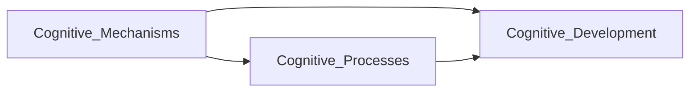

                 

## 1. 背景介绍

### 1.1 问题由来
认知科学作为一门交叉学科，研究人类认知过程的科学原理、心理机制及技术应用。随着信息技术的发展，认知科学逐渐演进为认知计算，强调利用计算机算法来模拟人脑的工作机制，从而实现认知过程的自动化。认知计算不仅为人工智能领域的研究提供了重要方向，还引发了认知心理学、神经科学等多学科的融合发展。

### 1.2 问题核心关键点
认知科学理论的发展，是认知计算及人工智能领域技术进步的基础。认知心理学是其中的核心分支，其主要目标是理解人类认知过程，构建可解释、可执行的认知模型。从认知心理学的发展脉络来看，认知渐进发展的理论演变主要围绕几个关键问题展开：认知机制的复杂性、认知过程的层次性、认知与环境交互等。

## 2. 核心概念与联系

### 2.1 核心概念概述

在认知科学领域，认知机制（Cognitive Mechanisms）、认知过程（Cognitive Processes）、认知发展（Cognitive Development）是研究的核心概念。

- **认知机制**：指人类在处理信息时所采用的基本操作和结构，如注意、记忆、决策、推理等。
- **认知过程**：指在特定情境中发生的认知机制的动态变化过程，如感知、学习、表征、问题解决等。
- **认知发展**：指个体在成长过程中，认知机制和认知过程的渐进性变化，表现出一定的阶段性和规律性。

这些概念之间的逻辑关系可以通过以下Mermaid流程图来展示：



这个流程图展示了三者之间的关系：认知机制作为认知过程和认知发展的基础，认知过程则是在特定情境中认知机制的具体应用，而认知发展则是认知机制和认知过程随时间的演变。

## 3. 核心算法原理 & 具体操作步骤
### 3.1 算法原理概述

认知科学中常见的认知模型构建方法主要有两种：符号主义和联结主义。

**符号主义**：使用符号逻辑表示认知过程，以规则为基础，强调符号的操纵和推理规则的运用。经典的认知模型如Washburn的认知发展理论，通过符号规则的递归来解释认知过程的动态变化。

**联结主义**：使用神经元网络的联结来模拟认知过程，强调神经元间的连接强度和信息流，如Rumelhart等人的多层感知器模型，通过神经元间的联结强度来模拟认知过程中的信息加工。

这两种方法各有优劣，符号主义强调规则和逻辑的可解释性，联结主义则强调信息的动态处理和并行计算。本文将主要介绍联结主义认知模型的算法原理和具体操作步骤。

### 3.2 算法步骤详解

**Step 1: 数据预处理**
- 收集认知行为数据，包括心理实验、脑成像等，提取相关的认知变量（如反应时间、正确率、血氧饱和度等）。
- 对数据进行预处理，包括数据清洗、特征提取、标准化处理等，确保数据的可靠性和一致性。

**Step 2: 建立神经网络模型**
- 选择合适的神经网络架构（如多层感知器、卷积神经网络、循环神经网络等），设置网络参数，包括神经元个数、连接强度、激活函数等。
- 对网络进行初始化，一般采用随机初始化，以保证模型具有足够的随机性。

**Step 3: 训练模型**
- 将预处理后的数据输入模型，使用梯度下降等优化算法更新网络参数。
- 设置训练参数，如学习率、迭代次数、批大小等，进行模型的迭代训练。
- 通过交叉验证等方法评估模型的性能，调整训练参数。

**Step 4: 模型评估与测试**
- 使用独立数据集对模型进行评估，计算模型的准确率、召回率、F1值等指标。
- 分析模型输出的认知变量，评估模型对认知过程的模拟效果。
- 针对模型不足之处，进行模型调优或参数调整，继续迭代训练。

**Step 5: 模型解释与验证**
- 对模型的预测结果进行解释，解释模型在特定认知任务中的决策机制。
- 在实验环境中验证模型的预测结果，确保模型具有较高的可靠性。
- 通过与心理实验和神经科学结果的对比，验证模型的科学性和普适性。

### 3.3 算法优缺点

**联结主义模型的优点**：
- 具有较强的并行处理能力，适合处理复杂的认知过程。
- 可解释性强，通过反向传播算法可以追溯输入与输出之间的因果关系。
- 适应性强，可以根据数据特点进行调整，具有较好的泛化能力。

**联结主义模型的缺点**：
- 缺乏理论基础，难以对认知机制进行深入解释。
- 模型训练复杂度高，需要大量的计算资源。
- 模型对数据的依赖性强，数据质量会影响模型的效果。

### 3.4 算法应用领域

联结主义模型在认知计算中的应用广泛，主要包括以下几个方面：

1. **认知行为模拟**：通过对神经网络模型的训练，可以模拟人类认知过程中的各种行为，如视觉感知、记忆、语言理解等。
2. **情感计算**：利用联结主义模型，可以模拟人类情感的产生、识别和表达，应用于人机交互和心理健康等领域。
3. **认知发育研究**：通过模型对不同年龄段的认知行为数据进行训练，可以揭示认知发育的规律和机制，帮助制定教育策略和干预方案。
4. **智能决策**：利用联结主义模型，可以构建智能决策系统，应用于企业决策、医疗诊断等领域，提升决策效率和准确性。
5. **认知增强**：通过神经网络模型的训练，可以增强人类认知能力，如记忆增强、注意力提升等，应用于脑机接口和认知辅助系统。

## 4. 数学模型和公式 & 详细讲解
### 4.1 数学模型构建

认知模型的数学模型通常基于神经网络框架，以多层感知器为例，数学模型可以表示为：

$$
y = \sigma(Wx + b)
$$

其中 $y$ 表示输出，$x$ 表示输入，$W$ 表示权重矩阵，$b$ 表示偏置项，$\sigma$ 表示激活函数，如Sigmoid、ReLU等。

### 4.2 公式推导过程

对于单个神经元，其输出可以表示为：

$$
y_i = \sigma(w_i^Tx + b_i)
$$

其中 $w_i$ 为权重向量，$x$ 为输入向量。对于多个神经元，输出向量可以表示为：

$$
y = [y_1, y_2, \ldots, y_n]
$$

其中 $n$ 为神经元个数。整个网络的输出可以通过递归计算得到，即：

$$
y_{n+1} = \sigma(W_{n+1}y_n + b_{n+1})
$$

其中 $W_{n+1}$ 为第 $n+1$ 层的权重矩阵，$b_{n+1}$ 为第 $n+1$ 层的偏置项。整个网络的输出可以表示为：

$$
y = W_L\sigma(W_{L-1}\sigma(\ldots \sigma(W_1x + b_1)\ldots + b_L)
$$

其中 $L$ 表示层数，$W_L$ 为第 $L$ 层的权重矩阵，$b_L$ 为第 $L$ 层的偏置项。

### 4.3 案例分析与讲解

以视觉感知为例，将输入图像转换为数字特征向量，输入神经网络进行感知。输出结果可以表示为：

$$
y = \sigma(W_{VN}\sigma(W_{CN}\sigma(W_{CN}\ldots\sigma(W_{CN}x_{CN})\ldots + b_{CN}) + b_{CN}) + b_{VN})
$$

其中 $CN$ 表示卷积层，$VN$ 表示全连接层，$x_{CN}$ 表示卷积层的输入特征向量。通过卷积层和全连接层的组合，可以实现对输入图像的特征提取和分类。

## 5. 项目实践：代码实例和详细解释说明
### 5.1 开发环境搭建

**Step 1: 安装依赖包**
- 使用Python 3.x版本，安装必要的依赖包，如TensorFlow、Keras、Matplotlib等。

**Step 2: 数据准备**
- 准备一组心理实验数据，包括输入和对应的输出结果。
- 对数据进行预处理，如数据清洗、特征提取等。

**Step 3: 模型搭建**
- 使用Keras框架搭建多层感知器模型，定义输入层、隐藏层和输出层，设置网络参数。

**Step 4: 模型训练**
- 将预处理后的数据输入模型，使用随机梯度下降等优化算法更新网络参数。
- 设置训练参数，如学习率、迭代次数、批大小等。
- 使用交叉验证等方法评估模型的性能，调整训练参数。

**Step 5: 模型评估**
- 使用独立数据集对模型进行评估，计算模型的准确率、召回率、F1值等指标。
- 分析模型输出的认知变量，评估模型对认知过程的模拟效果。

**Step 6: 模型解释与验证**
- 对模型的预测结果进行解释，解释模型在特定认知任务中的决策机制。
- 在实验环境中验证模型的预测结果，确保模型具有较高的可靠性。
- 通过与心理实验和神经科学结果的对比，验证模型的科学性和普适性。

### 5.2 源代码详细实现

```python
import tensorflow as tf
from tensorflow.keras.models import Sequential
from tensorflow.keras.layers import Dense, Activation

# 构建多层感知器模型
model = Sequential()
model.add(Dense(64, input_dim=10))
model.add(Activation('relu'))
model.add(Dense(10))
model.add(Activation('softmax'))

# 编译模型
model.compile(loss='categorical_crossentropy',
              optimizer=tf.keras.optimizers.SGD(0.01),
              metrics=['accuracy'])

# 训练模型
model.fit(X_train, y_train, epochs=100, batch_size=32)

# 评估模型
loss, accuracy = model.evaluate(X_test, y_test)

# 输出评估结果
print('Test loss:', loss)
print('Test accuracy:', accuracy)
```

### 5.3 代码解读与分析

**代码解读**：
- 首先导入必要的依赖包，包括TensorFlow和Keras。
- 然后定义多层感知器模型，包括输入层、隐藏层和输出层，设置网络参数。
- 编译模型，设置损失函数、优化器和评估指标。
- 训练模型，设置训练参数，进行迭代训练。
- 评估模型，使用独立测试集进行评估。
- 输出评估结果，包括损失和准确率。

**代码分析**：
- 使用Keras框架可以方便地搭建神经网络模型，并支持各种优化算法和评估指标。
- 模型训练过程中，需要注意选择合适的训练参数，如学习率、批大小等，以保证模型的收敛性。
- 模型评估和解释是认知计算中不可或缺的环节，需要仔细分析模型输出的认知变量，并验证模型的科学性和普适性。

## 6. 实际应用场景
### 6.1 智能决策系统

智能决策系统在商业和企业决策中具有广泛应用，如金融风控、物流管理、市场营销等。基于认知计算的决策模型，可以模拟人类决策过程，提高决策的效率和准确性。

在金融风控中，利用认知计算模型，可以模拟投资者在市场变化中的行为反应，构建预测模型，提前识别风险点，减少损失。在物流管理中，通过模拟配送中心的资源配置和路径规划，可以优化物流流程，提高配送效率。在市场营销中，利用认知计算模型，可以分析用户行为和市场需求，制定更有效的市场策略。

### 6.2 认知辅助系统

认知辅助系统主要应用于医疗、教育、法律等领域，帮助用户更好地理解和处理复杂信息。基于认知计算的辅助系统，可以模拟人类认知过程，提高系统的智能化水平。

在医疗领域，利用认知计算模型，可以模拟医生在诊断过程中的推理和判断，提供辅助诊断建议，提升诊断准确性。在教育领域，通过模拟教师和学生的交互过程，可以提供个性化的学习建议，提升学习效果。在法律领域，利用认知计算模型，可以分析案件材料和法律条文，提供法律咨询和审判建议，提高司法效率。

### 6.3 认知增强系统

认知增强系统主要应用于脑机接口和认知辅助设备中，帮助用户提升认知能力。基于认知计算的增强系统，可以模拟人类认知机制，增强用户的记忆、注意力、决策等能力。

在脑机接口中，利用认知计算模型，可以模拟大脑的认知过程，实现信息的输入和输出。在认知辅助设备中，通过模拟认知过程，可以提升用户的注意力和记忆能力，如认知增强耳机、认知增强手机等。

### 6.4 未来应用展望

随着认知计算技术的不断进步，未来认知辅助系统将变得更加智能化和普适化，为各行业带来新的变革。

在医疗领域，基于认知计算的辅助诊断系统，将能够提供更加精准、快速的诊断服务，减少误诊和漏诊。在教育领域，利用认知计算模型，可以提供更加个性化、互动式的学习体验，提升学生的学习效果。在金融领域，基于认知计算的决策系统，将能够更加准确地预测市场变化，提高投资收益。

## 7. 工具和资源推荐
### 7.1 学习资源推荐

**学习资源推荐**：

1. 《认知计算基础》（书籍）：详细介绍认知计算的基本概念和应用，适合入门学习。
2. 《深度学习入门》（书籍）：介绍深度学习的基础知识和算法，涵盖认知计算的常用模型。
3. 《认知计算与神经科学》（课程）：由斯坦福大学开设，涵盖认知计算的最新研究成果和应用案例。
4. 《Keras官方文档》：详细介绍了Keras框架的使用方法，适合进行神经网络模型的搭建和训练。
5. 《TensorFlow官方文档》：介绍TensorFlow框架的使用方法，适合进行大规模深度学习模型的训练和推理。

**学习资源总结**：

通过以上资源的学习，可以全面掌握认知计算的基本概念和应用方法，熟悉常用的神经网络模型和框架，掌握认知计算模型的构建和训练方法。

### 7.2 开发工具推荐

**开发工具推荐**：

1. TensorFlow：由Google主导开发的深度学习框架，具有强大的计算图和自动微分功能，适合进行大规模深度学习模型的训练和推理。
2. Keras：基于TensorFlow、Theano等后端实现的高级深度学习框架，易于上手，适合进行神经网络模型的搭建和训练。
3. PyTorch：由Facebook主导开发的深度学习框架，灵活性高，适合进行深度学习模型的研究和应用。
4. Matplotlib：用于数据可视化，支持各种图表类型的绘制，适合用于模型训练过程中的数据分析和结果展示。
5. TensorBoard：用于模型训练和推理过程中的可视化，支持实时监测和调试，适合用于模型的训练和优化。

**工具推荐总结**：

通过以上工具的使用，可以方便地进行认知计算模型的构建、训练和推理，同时支持数据的可视化分析和模型的调试优化。

### 7.3 相关论文推荐

**相关论文推荐**：

1. 《认知计算：走向未来的智能》（论文）：介绍认知计算的发展历程和应用前景，适合理解认知计算的基本概念和应用场景。
2. 《基于认知计算的智能决策模型》（论文）：介绍认知计算在智能决策中的应用，适合了解认知计算在实际问题中的应用方法。
3. 《认知增强系统的设计与实现》（论文）：介绍认知增强系统的设计思路和实现方法，适合理解认知增强系统的基本原理和应用效果。
4. 《深度学习在认知计算中的应用》（论文）：介绍深度学习在认知计算中的应用，适合理解深度学习模型在认知计算中的具体应用方法。
5. 《认知计算与神经科学的融合》（论文）：介绍认知计算与神经科学的融合发展，适合理解认知计算与神经科学的联系和未来发展方向。

## 8. 总结：未来发展趋势与挑战
### 8.1 总结

本文对认知渐进发展的理论演变进行了系统的介绍，从认知机制、认知过程、认知发展的角度，介绍了认知计算的基本概念和应用方法。通过案例分析和代码实现，展示了认知计算模型在实际应用中的实现方法和效果。

### 8.2 未来发展趋势

未来认知计算的发展趋势主要包括以下几个方面：

1. **多模态认知计算**：将视觉、听觉、触觉等多种模态的信息进行融合，实现更全面、更准确的认知计算。
2. **认知增强的个性化**：通过认知计算模型，实现个性化的认知增强，提升用户的认知能力和体验。
3. **认知计算与AI的融合**：利用认知计算模型，提升AI系统的智能化水平，实现更加高效、可靠的AI应用。
4. **认知计算的伦理和隐私**：在认知计算的应用过程中，需要注意伦理和隐私问题，确保系统的公平性和安全性。

### 8.3 面临的挑战

认知计算的发展过程中，面临的主要挑战包括：

1. **数据的质量和规模**：高质量的数据是认知计算的基础，但获取大规模、多模态的数据仍然是一个难题。
2. **模型的可解释性**：认知计算模型的决策过程通常缺乏可解释性，难以对其推理逻辑进行分析和调试。
3. **算法的复杂性**：认知计算模型通常比较复杂，难以理解和调试，需要更多理论和技术的研究支持。
4. **系统的安全性**：认知计算系统需要具备较高的安全性，避免数据泄露和系统攻击。
5. **用户的接受度**：认知计算系统需要符合用户的使用习惯和认知水平，否则难以获得用户的广泛接受。

### 8.4 研究展望

未来认知计算的研究方向主要包括以下几个方面：

1. **多模态认知计算**：研究多模态信息融合的方法，提高认知计算系统的感知能力和智能化水平。
2. **认知增强的个性化**：研究个性化的认知增强算法，提升用户的认知能力和体验。
3. **认知计算与AI的融合**：研究认知计算与AI技术的融合，提升AI系统的智能化水平，实现更加高效、可靠的AI应用。
4. **认知计算的伦理和隐私**：研究认知计算系统的伦理和隐私问题，确保系统的公平性和安全性。

## 9. 附录：常见问题与解答

**Q1: 什么是认知计算？**

A: 认知计算是一种模拟人类认知过程的计算方式，通过计算机算法来处理、理解和生成人类认知的信息和过程。

**Q2: 认知计算有哪些应用？**

A: 认知计算在医疗、教育、金融等领域具有广泛应用，如智能决策、认知辅助、认知增强等。

**Q3: 认知计算模型如何构建？**

A: 认知计算模型通常基于神经网络框架，通过数据预处理、模型搭建、训练、评估和解释等步骤，模拟人类认知过程。

**Q4: 认知计算面临的主要挑战是什么？**

A: 认知计算面临的主要挑战包括数据的质量和规模、模型的可解释性、算法的复杂性、系统的安全性、用户的接受度等。

**Q5: 认知计算的未来发展方向是什么？**

A: 未来认知计算的主要发展方向包括多模态认知计算、认知增强的个性化、认知计算与AI的融合、认知计算的伦理和隐私等。

---

作者：禅与计算机程序设计艺术 / Zen and the Art of Computer Programming

