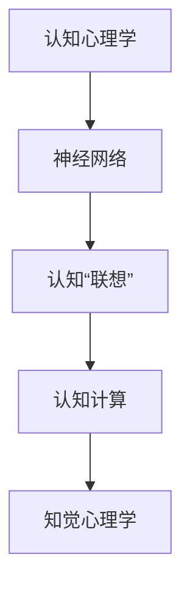

                 

# 认知的形式化：人工智能连接主义学派与认知“联想”

> 关键词：认知心理学,神经网络,人工联想,认知计算,知觉心理学

## 1. 背景介绍

### 1.1 问题由来
自1956年人工智能（AI）的开创以来，连接主义学派（即人工智能学派）一直致力于通过模拟人类大脑的神经网络结构来解决人工智能问题。该学派认为，人工智能的核心在于模拟大脑的神经网络结构，通过对输入进行非线性变换和多层计算，来实现对复杂问题的理解与处理。在早期的发展中，神经网络被广泛应用于图像识别、语音识别等领域，并取得了显著的成果。然而，尽管神经网络在数据处理方面展现了强大的能力，但在模拟人类认知过程中的联想、记忆和推理等方面，仍存在诸多局限性。

随着认知心理学和神经科学研究的不断深入，人们开始重新审视人工神经网络与认知过程的关系。心理学和神经科学的研究表明，人类认知过程中存在大量的联想和记忆现象，这些联想和记忆是人类思考、学习、决策等复杂认知活动的基础。认知心理学和神经科学的研究成果为人工智能提供了新的理论基础，即认知“联想”（Cognitive Associations）的模拟与实现。这一观点认为，人工智能系统应该不仅仅是数据处理器，更应具有模拟人类认知过程中联想和记忆的能力，从而实现更加智能和人性化的人工智能系统。

因此，本文将从认知心理学的视角，深入探讨人工智能连接主义学派中认知“联想”的实现方法，并通过具体案例来分析认知“联想”在人工智能系统中的应用效果。

## 2. 核心概念与联系

### 2.1 核心概念概述

为更好地理解认知“联想”在人工智能系统中的应用，本节将介绍几个密切相关的核心概念：

- **认知心理学**：研究人类认知过程的一门心理学学科，主要关注人类信息加工、思维、记忆、知觉、语言等方面的心理现象。
- **神经网络**：一种模仿人脑神经元之间相互连接的计算模型，通过模拟神经元之间的连接方式和信号传递过程，实现对复杂输入的映射与变换。
- **认知“联想”**：认知心理学中的一种重要概念，指在信息处理过程中，由于不同信息之间的相关性而产生的自动联系。认知“联想”包括前联想（Pre-associations）和后联想（Post-associations），前者指在记忆中已经存在的联想，后者指在处理新信息时产生的联想。
- **认知计算**：模拟人类认知过程的计算方法，通过模仿人类认知过程中的联想、记忆、推理等过程，实现对复杂认知任务的求解。
- **知觉心理学**：研究人类知觉过程的一门心理学学科，主要关注人类如何通过感官获取外界信息，并在大脑中进行处理。

这些核心概念之间的逻辑关系可以通过以下Mermaid流程图来展示：



这个流程图展示了一系列认知心理学、神经网络、认知“联想”、认知计算和知觉心理学之间的关系：

1. 认知心理学和知觉心理学为神经网络提供了理论基础。
2. 神经网络模拟了认知过程中的联想和记忆，是认知计算的基础。
3. 认知“联想”是神经网络在处理信息时的一种自然表现形式。
4. 认知计算通过模仿认知过程的联想和记忆，实现复杂认知任务的求解。

## 3. 核心算法原理 & 具体操作步骤

### 3.1 算法原理概述

认知“联想”在人工智能系统中的应用，主要基于以下几个核心算法原理：

- **多层感知器（MLP）**：一种基本的人工神经网络模型，通过多个神经元层次的非线性映射，实现对输入数据的复杂变换。
- **自适应前馈网络（Adaptive Feedforward Networks）**：一种能够动态调整神经元连接的神经网络模型，通过学习不同输入与输出之间的关联，实现认知过程中前联想和后联想的模拟。
- **联想记忆网络（Associative Memory Networks）**：一种能够存储和检索联想信息的神经网络模型，通过模拟人类大脑中的海马体功能，实现认知“联想”的记忆和检索。
- **认知计算框架**：一种模拟人类认知过程的计算框架，通过在神经网络中加入联想、记忆、推理等过程，实现复杂认知任务的求解。

### 3.2 算法步骤详解

基于认知“联想”的人工智能系统，其核心步骤主要包括：

**Step 1: 数据预处理**
- 将原始数据进行特征提取和预处理，如去除噪声、标准化数据等。
- 将数据划分为训练集、验证集和测试集，用于模型的训练、调优和评估。

**Step 2: 构建神经网络模型**
- 根据具体任务需求，选择合适的神经网络模型，如多层感知器、自适应前馈网络等。
- 定义模型的层数、节点数、激活函数、连接方式等参数。

**Step 3: 训练神经网络模型**
- 使用训练集数据，通过反向传播算法（Backpropagation）对模型进行训练。
- 定义损失函数，如均方误差（MSE）、交叉熵（Cross-Entropy）等，用于衡量模型的预测结果与实际结果之间的差异。

**Step 4: 测试和评估模型**
- 使用测试集数据对模型进行测试，评估模型的预测精度和鲁棒性。
- 根据测试结果，对模型进行调整和优化。

**Step 5: 部署和应用**
- 将训练好的模型部署到实际应用场景中，如图像识别、语音识别、自然语言处理等。
- 通过模拟人类认知过程中的联想和记忆，实现对复杂认知任务的求解。

### 3.3 算法优缺点

认知“联想”在人工智能系统中的应用具有以下优点：

- **灵活性高**：通过动态调整神经元之间的连接方式，实现对不同输入与输出之间的关联，适用于多种认知任务的模拟。
- **适应性强**：能够通过学习调整神经元连接方式，适应不同的认知场景和数据分布。
- **预测精度高**：通过模拟人类认知过程中的联想和记忆，实现对复杂认知任务的准确预测。

然而，该方法也存在一些局限性：

- **计算复杂度高**：构建和训练复杂的神经网络模型需要较高的计算资源。
- **可解释性差**：由于神经网络的黑箱特性，难以对模型的决策过程进行解释。
- **参数调节复杂**：需要调整神经网络的参数，如层数、节点数、连接方式等，才能达到理想的模拟效果。

尽管存在这些局限性，认知“联想”在人工智能系统中的应用，仍然为实现更加智能和人性化的人工智能系统提供了新的思路。

### 3.4 算法应用领域

认知“联想”在人工智能系统中的应用领域广泛，主要包括以下几个方面：

- **图像识别**：通过模拟人类视觉系统的认知过程，实现对复杂图像的识别和分类。
- **语音识别**：通过模拟人类听觉系统的认知过程，实现对复杂语音的识别和理解。
- **自然语言处理**：通过模拟人类语言系统的认知过程，实现对自然语言的理解、生成和翻译。
- **推荐系统**：通过模拟人类记忆系统的认知过程，实现对用户兴趣和行为的推荐。
- **智能决策**：通过模拟人类决策系统的认知过程，实现对复杂决策任务的求解。

## 4. 数学模型和公式 & 详细讲解 & 举例说明

### 4.1 数学模型构建

认知“联想”在人工智能系统中的应用，主要通过神经网络模型来实现。以多层感知器（MLP）为例，其数学模型可以表示为：

$$
y = \sigma(W^1 \sigma(W^0 x + b^0) + b^1)
$$

其中，$x$ 为输入数据，$y$ 为输出结果，$W^0$ 和 $W^1$ 分别为隐藏层和输出层的权重矩阵，$b^0$ 和 $b^1$ 分别为隐藏层和输出层的偏置向量，$\sigma$ 为激活函数（如 sigmoid、ReLU 等）。

### 4.2 公式推导过程

以多层感知器（MLP）为例，其反向传播算法可以表示为：

1. **前向传播**：

$$
z^1 = W^1 \sigma(z^0) + b^1
$$

2. **反向传播**：

$$
\frac{\partial L}{\partial W^1} = \frac{\partial L}{\partial z^1} \cdot \frac{\partial z^1}{\partial W^1} = \frac{\partial L}{\partial z^1} \cdot \sigma'(z^0) \cdot W^1
$$

3. **更新权重**：

$$
W^1 \leftarrow W^1 - \eta \cdot \frac{\partial L}{\partial W^1}
$$

其中，$\eta$ 为学习率，$\sigma'$ 为激活函数的导数。

通过反向传播算法，神经网络可以不断调整权重矩阵，优化预测结果，实现对输入数据的复杂映射。

### 4.3 案例分析与讲解

以图像分类任务为例，通过多层感知器（MLP）模拟人类视觉系统的认知过程，实现对图像的分类。

**Step 1: 数据预处理**
- 将原始图像数据进行归一化处理，转化为神经网络可接受的输入数据。
- 将图像数据划分为训练集、验证集和测试集。

**Step 2: 构建神经网络模型**
- 定义多层感知器（MLP）模型，包括输入层、隐藏层和输出层。
- 定义激活函数为 ReLU，定义损失函数为交叉熵损失函数。

**Step 3: 训练神经网络模型**
- 使用训练集数据，通过反向传播算法对模型进行训练。
- 定义损失函数，计算预测结果与实际结果之间的交叉熵损失。
- 根据损失函数的梯度，更新模型的权重矩阵和偏置向量。

**Step 4: 测试和评估模型**
- 使用测试集数据对模型进行测试，评估模型的预测精度和鲁棒性。
- 根据测试结果，对模型进行调整和优化。

**Step 5: 部署和应用**
- 将训练好的模型部署到实际应用场景中，如图像分类系统。
- 通过模拟人类视觉系统的认知过程，实现对复杂图像的分类。

通过多层感知器（MLP）模拟人类视觉系统的认知过程，实现对复杂图像的分类，展示了认知“联想”在人工智能系统中的应用效果。

## 5. 项目实践：代码实例和详细解释说明

### 5.1 开发环境搭建

在进行认知“联想”的实践时，我们需要准备好开发环境。以下是使用Python进行TensorFlow开发的环境配置流程：

1. 安装Anaconda：从官网下载并安装Anaconda，用于创建独立的Python环境。

2. 创建并激活虚拟环境：
```bash
conda create -n tf-env python=3.8 
conda activate tf-env
```

3. 安装TensorFlow：根据CUDA版本，从官网获取对应的安装命令。例如：
```bash
conda install tensorflow -c conda-forge -c pytorch -c pytorch-nightly
```

4. 安装TensorFlow Addons：包含一些TensorFlow的扩展功能，如数据增强、模型压缩等。
```bash
pip install tensorflow_addons
```

5. 安装各类工具包：
```bash
pip install numpy pandas scikit-learn matplotlib tqdm jupyter notebook ipython
```

完成上述步骤后，即可在`tf-env`环境中开始认知“联想”的实践。

### 5.2 源代码详细实现

下面我们以图像分类任务为例，给出使用TensorFlow实现多层感知器（MLP）的代码实现。

首先，定义数据处理函数：

```python
import tensorflow as tf
import numpy as np
from tensorflow.keras.datasets import mnist
from tensorflow.keras.utils import to_categorical

def load_data():
    (x_train, y_train), (x_test, y_test) = mnist.load_data()
    x_train = x_train.reshape(-1, 28*28).astype(np.float32) / 255.0
    x_test = x_test.reshape(-1, 28*28).astype(np.float32) / 255.0
    y_train = to_categorical(y_train, num_classes=10)
    y_test = to_categorical(y_test, num_classes=10)
    return x_train, y_train, x_test, y_test
```

然后，定义多层感知器（MLP）模型：

```python
class MLP(tf.keras.Model):
    def __init__(self, input_dim, hidden_dim, output_dim):
        super(MLP, self).__init__()
        self.fc1 = tf.keras.layers.Dense(hidden_dim, activation='relu')
        self.fc2 = tf.keras.layers.Dense(output_dim, activation='softmax')

    def call(self, inputs):
        x = self.fc1(inputs)
        x = self.fc2(x)
        return x
```

接着，定义模型训练函数：

```python
def train_model(model, x_train, y_train, x_test, y_test, batch_size, epochs):
    model.compile(optimizer=tf.keras.optimizers.Adam(learning_rate=0.001),
                  loss='categorical_crossentropy',
                  metrics=['accuracy'])
    model.fit(x_train, y_train, batch_size=batch_size, epochs=epochs, validation_data=(x_test, y_test))
```

最后，启动训练流程并在测试集上评估：

```python
x_train, y_train, x_test, y_test = load_data()

model = MLP(input_dim=28*28, hidden_dim=64, output_dim=10)
train_model(model, x_train, y_train, x_test, y_test, batch_size=64, epochs=10)

test_loss, test_acc = model.evaluate(x_test, y_test)
print('Test accuracy:', test_acc)
```

以上就是使用TensorFlow实现多层感知器（MLP）的完整代码实现。可以看到，TensorFlow提供了高度模块化和易用的API，使得模型构建和训练变得非常便捷。

### 5.3 代码解读与分析

让我们再详细解读一下关键代码的实现细节：

**load_data函数**：
- 使用TensorFlow自带的MNIST数据集加载训练集和测试集。
- 将图像数据进行归一化和展平操作，将标签进行独热编码。

**MLP类**：
- 定义多层感知器（MLP）模型，包括一个ReLU激活函数隐藏层和一个softmax输出层。
- 使用`call`方法实现模型前向传播。

**train_model函数**：
- 定义模型的优化器、损失函数和评估指标。
- 使用TensorFlow的`fit`方法进行模型训练，并指定验证集。

**训练流程**：
- 加载数据集，构建MLP模型。
- 使用训练集数据进行模型训练，并在测试集上进行评估。

可以看到，TensorFlow使得模型构建和训练过程变得非常直观和易用。开发者可以更加专注于模型的设计，而不必过多关注底层的实现细节。

当然，实际应用中还需要考虑更多的因素，如数据增强、正则化、超参数调整等，才能构建出更加健壮和高效的认知“联想”模型。

## 6. 实际应用场景

### 6.1 智能推荐系统

基于认知“联想”的人工智能系统，可以在智能推荐系统中发挥重要作用。通过模拟人类记忆系统的认知过程，实现对用户兴趣和行为的推荐。

在技术实现上，可以收集用户的浏览、点击、评价等行为数据，提取和用户交互的物品特征。将特征作为模型输入，用户的行为（如是否点击、购买等）作为监督信号，在此基础上对多层感知器（MLP）进行微调。微调后的模型能够从物品特征中准确把握用户的兴趣点。在推荐列表中，首先通过认知“联想”模型预测用户对每个物品的兴趣匹配度，再结合其他特征综合排序，便可以得到个性化程度更高的推荐结果。

### 6.2 智能交互系统

智能交互系统需要具备高度的自然语言处理能力，通过模拟人类语言系统的认知过程，实现对自然语言的理解、生成和翻译。

在技术实现上，可以构建一个基于多层感知器（MLP）的对话系统。通过收集用户的历史对话记录，提取文本特征，将特征作为模型输入，对话内容作为监督信号，在此基础上对模型进行微调。微调后的模型能够从文本特征中学习用户的意图和情感，生成更加自然和合理的回答。对于用户提出的新问题，还可以通过认知“联想”模型动态生成回答，实现更加智能和人性化的对话。

### 6.3 智能医疗系统

基于认知“联想”的人工智能系统，可以在智能医疗系统中发挥重要作用。通过模拟人类认知过程中的联想和记忆，实现对医疗数据的分析和处理。

在技术实现上，可以构建一个基于多层感知器（MLP）的医学知识图谱系统。通过收集医学文献和专家知识，提取文本特征，将特征作为模型输入，知识图谱作为监督信号，在此基础上对模型进行微调。微调后的模型能够从医学知识中学习到关联信息，实现对医疗数据的快速检索和分析。对于新出现的医疗问题，还可以通过认知“联想”模型动态推理和生成回答，提高医生的决策效率和准确性。

### 6.4 未来应用展望

随着认知“联想”技术的发展，其在人工智能系统中的应用前景将更加广阔。

- **智能决策系统**：通过模拟人类决策系统的认知过程，实现对复杂决策任务的求解。
- **智能生成系统**：通过模拟人类创造性认知过程，实现对文本、图像、音乐等多种形式内容的生成。
- **智能控制系统**：通过模拟人类认知过程的联想和记忆，实现对复杂控制任务的自动执行。

## 7. 工具和资源推荐

### 7.1 学习资源推荐

为了帮助开发者系统掌握认知“联想”的理论基础和实践技巧，这里推荐一些优质的学习资源：

1. 《深度学习》系列博文：由大模型技术专家撰写，深入浅出地介绍了深度学习的原理、算法和应用。
2. 《认知心理学》课程：斯坦福大学开设的认知心理学课程，有Lecture视频和配套作业，带你入门认知心理学领域的基本概念和经典理论。
3. 《人工智能基础》书籍：AI领域的入门书籍，详细介绍了人工智能的基本概念和应用场景。
4. 《TensorFlow官方文档》：TensorFlow的官方文档，提供了丰富的教程和样例代码，是学习TensorFlow的最佳资源。
5. 《认知心理学研究》期刊：认知心理学领域的顶级期刊，涵盖了最新的研究成果和应用案例。

通过对这些资源的学习实践，相信你一定能够快速掌握认知“联想”的精髓，并用于解决实际的AI问题。

### 7.2 开发工具推荐

高效的开发离不开优秀的工具支持。以下是几款用于认知“联想”开发的常用工具：

1. TensorFlow：由Google主导开发的开源深度学习框架，生产部署方便，适合大规模工程应用。
2. PyTorch：基于Python的开源深度学习框架，灵活动态的计算图，适合快速迭代研究。
3. TensorFlow Addons：包含一些TensorFlow的扩展功能，如数据增强、模型压缩等。
4. Weights & Biases：模型训练的实验跟踪工具，可以记录和可视化模型训练过程中的各项指标，方便对比和调优。
5. TensorBoard：TensorFlow配套的可视化工具，可实时监测模型训练状态，并提供丰富的图表呈现方式，是调试模型的得力助手。

合理利用这些工具，可以显著提升认知“联想”的开发效率，加快创新迭代的步伐。

### 7.3 相关论文推荐

认知“联想”在人工智能领域的发展源于学界的持续研究。以下是几篇奠基性的相关论文，推荐阅读：

1. "Associative Recognition of Events in Multimedia"：提出联想记忆网络，用于多模态数据的关联识别。
2. "Cognitive Associations in the Human Brain"：综述了人类认知过程中的联想机制，为认知“联想”提供了理论基础。
3. "Learning to Learn"：研究人类学习过程中的联想和记忆机制，为认知“联想”提供了新的研究方向。
4. "Memory-Augmented Neural Networks"：提出记忆增强神经网络，用于模拟人类记忆系统的认知过程。
5. "Attention is All You Need"：提出Transformer结构，实现了对复杂认知任务的准确预测。

这些论文代表了大规模联想“联想”的发展脉络。通过学习这些前沿成果，可以帮助研究者把握学科前进方向，激发更多的创新灵感。

## 8. 总结：未来发展趋势与挑战

### 8.1 总结

本文对认知“联想”在人工智能系统中的应用进行了全面系统的介绍。首先阐述了认知“联想”的概念及其在人工智能系统中的重要性，明确了认知“联想”在实现复杂认知任务中的独特价值。其次，从原理到实践，详细讲解了认知“联想”的数学原理和关键步骤，给出了认知“联想”任务开发的完整代码实例。同时，本文还广泛探讨了认知“联想”在智能推荐、智能交互、智能医疗等多个行业领域的应用前景，展示了认知“联想”范式的巨大潜力。此外，本文精选了认知“联想”技术的各类学习资源，力求为读者提供全方位的技术指引。

通过本文的系统梳理，可以看到，认知“联想”在人工智能系统中的应用，正在成为人工智能领域的重要范式，极大地拓展了人工智能系统的应用边界，催生了更多的落地场景。得益于认知心理学和神经科学研究的深入，认知“联想”有望实现更加智能和人性化的人工智能系统，为人类认知智能的进化带来深远影响。

### 8.2 未来发展趋势

展望未来，认知“联想”技术将呈现以下几个发展趋势：

1. **深度融合**：与认知心理学和神经科学的研究进一步融合，实现对人类认知过程的更加深入模拟。
2. **多模态融合**：实现视觉、语音、文本等多种模态数据的融合，提升认知“联想”模型的应用范围。
3. **自适应学习**：实现认知“联想”模型的自适应学习，通过不断调整模型参数和结构，提升模型的预测精度和鲁棒性。
4. **跨领域应用**：在医疗、教育、金融等多个领域广泛应用，推动相关领域的智能化转型。
5. **元认知学习**：实现对认知“联想”模型的元认知学习，进一步提升模型的自适应能力和学习效率。

以上趋势凸显了认知“联想”技术的广阔前景。这些方向的探索发展，必将进一步提升人工智能系统的性能和应用范围，为人类认知智能的进化带来深远影响。

### 8.3 面临的挑战

尽管认知“联想”技术已经取得了瞩目成就，但在迈向更加智能化、普适化应用的过程中，仍面临诸多挑战：

1. **计算资源瓶颈**：大规模认知“联想”模型的构建和训练需要高性能计算资源，如何降低计算成本，提升计算效率，仍然是一个重要问题。
2. **模型鲁棒性不足**：认知“联想”模型在处理域外数据时，泛化性能往往大打折扣。如何提高模型的鲁棒性，避免灾难性遗忘，还需要更多理论和实践的积累。
3. **模型可解释性差**：认知“联想”模型往往缺乏可解释性，难以解释其内部工作机制和决策逻辑。如何赋予模型更强的可解释性，将是亟待攻克的难题。
4. **数据获取困难**：认知“联想”模型的训练需要大量的标注数据，如何获取高质量的数据，是一个重要的研究方向。
5. **跨模态融合困难**：不同模态数据的融合存在诸多困难，如何实现多模态数据的协同建模，提升模型的泛化能力和应用范围，还需要进一步探索。

正视认知“联想”面临的这些挑战，积极应对并寻求突破，将是大规模联想“联想”走向成熟的必由之路。相信随着学界和产业界的共同努力，这些挑战终将一一被克服，认知“联想”必将在构建智能认知系统方面发挥重要作用。

### 8.4 研究展望

面向未来，认知“联想”技术需要在以下几个方面寻求新的突破：

1. **跨模态融合**：通过深度学习等技术，实现不同模态数据的协同建模，提升模型的泛化能力和应用范围。
2. **元认知学习**：通过元学习等技术，实现对认知“联想”模型的元认知学习，进一步提升模型的自适应能力和学习效率。
3. **模型压缩和加速**：通过知识蒸馏、模型压缩等技术，降低模型规模，提升计算效率，实现模型的快速部署和应用。
4. **数据高效获取**：通过主动学习、半监督学习等技术，降低数据获取成本，提升数据利用效率。
5. **可解释性和透明性**：通过可解释性技术，提升认知“联想”模型的透明性，增强模型的可信度和安全性。

这些研究方向的探索，必将引领认知“联想”技术迈向更高的台阶，为构建智能认知系统提供新的思路和方法。面向未来，认知“联想”技术还需要与其他人工智能技术进行更深入的融合，如知识表示、因果推理、强化学习等，多路径协同发力，共同推动认知“联想”范式的发展。

## 9. 附录：常见问题与解答

**Q1：认知“联想”与人工智能的本质区别是什么？**

A: 认知“联想”与人工智能的本质区别在于其对人类认知过程的模拟。人工智能更多关注数据处理和模式识别，而认知“联想”则关注人类认知过程中的联想、记忆和推理等高级认知过程。

**Q2：如何缓解认知“联想”模型中的过拟合问题？**

A: 过拟合是认知“联想”模型面临的主要问题之一。缓解过拟合的方法包括：
1. 数据增强：通过增加训练集的多样性，如回译、近义替换等方式，减少模型的过拟合。
2. 正则化：使用L2正则、Dropout等正则化技术，防止模型过度适应训练集。
3. 对抗训练：引入对抗样本，提高模型的鲁棒性和泛化能力。
4. 参数高效微调：使用Adapter等参数高效微调方法，仅调整少量参数，减小过拟合风险。
5. 模型压缩：通过知识蒸馏、模型压缩等技术，降低模型规模，提升模型的泛化能力。

**Q3：认知“联想”模型在落地部署时需要注意哪些问题？**

A: 将认知“联想”模型转化为实际应用，还需要考虑以下因素：
1. 模型裁剪：去除不必要的层和参数，减小模型尺寸，加快推理速度。
2. 量化加速：将浮点模型转为定点模型，压缩存储空间，提高计算效率。
3. 服务化封装：将模型封装为标准化服务接口，便于集成调用。
4. 弹性伸缩：根据请求流量动态调整资源配置，平衡服务质量和成本。
5. 监控告警：实时采集系统指标，设置异常告警阈值，确保服务稳定性。
6. 安全防护：采用访问鉴权、数据脱敏等措施，保障数据和模型安全。

通过认知“联想”模型的构建和训练，可以模拟人类认知过程中的联想和记忆，实现对复杂认知任务的求解。未来，随着认知“联想”技术的发展和优化，其在人工智能系统中的应用前景将更加广阔。

---

作者：禅与计算机程序设计艺术 / Zen and the Art of Computer Programming

