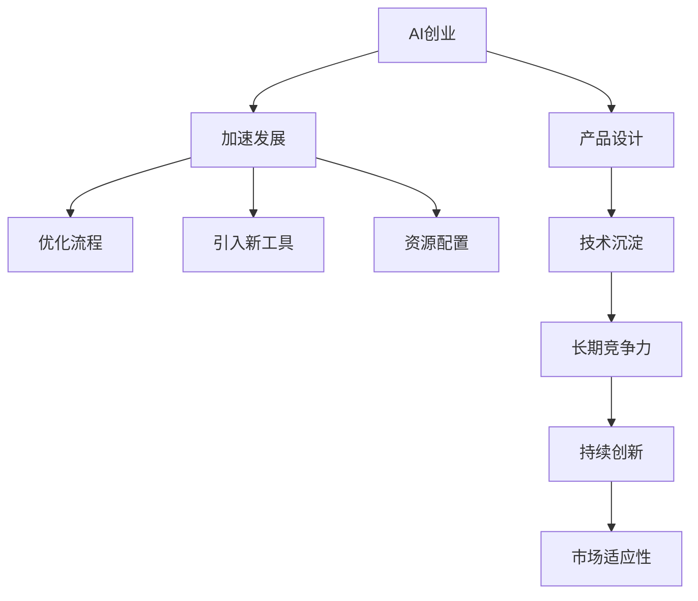

                 

# 设计产品vs加速发展:AI创业的两条路径

> 关键词：AI创业,产品设计,加速发展,技术沉淀,创新实践

## 1. 背景介绍

### 1.1 问题由来

随着人工智能(AI)技术的迅猛发展，越来越多的创业公司开始投身AI领域，希望能够抓住这一历史机遇，快速占领市场份额。然而，AI创业并非易事，仅依靠技术优势并不足以保证公司的长期成功。如何在技术领先的同时，设计出满足市场需求、易用性强、易部署的产品，是每一个AI创业者必须面对的挑战。

### 1.2 问题核心关键点

AI创业的核心在于：如何平衡技术创新与产品设计，实现技术沉淀与加速发展的双赢。这一问题涉及到公司战略、技术架构、产品设计、市场推广等多个方面。

- **战略选择**：在技术领先与市场需求之间找到平衡点。
- **架构设计**：构建可扩展、可维护、易于部署的技术架构。
- **产品设计**：设计出满足用户需求、易用性强的产品。
- **市场推广**：精准定位目标市场，有效推广产品。

本文将深入探讨AI创业在产品设计和加速发展方面的两条路径：设计产品与加速发展。通过详细阐述每条路径的原理、步骤、优势和挑战，为AI创业者提供实用的指导。

## 2. 核心概念与联系

### 2.1 核心概念概述

为更好地理解AI创业的两条路径，本节将介绍几个密切相关的核心概念：

- **AI创业**：利用人工智能技术进行产品开发、市场推广和商业模式创新的创业活动。
- **产品设计**：设计出满足用户需求、易用性强的产品。
- **加速发展**：通过优化流程、工具和资源配置，快速提升产品开发和市场推广效率，实现技术沉淀与市场扩展的双重目标。
- **技术沉淀**：通过合理的技术积累和沉淀，形成长期的技术优势和产品竞争力。
- **创新实践**：结合市场反馈和技术进步，不断迭代优化产品和业务模式，保持竞争力和市场适应性。

这些概念之间的逻辑关系可以通过以下Mermaid流程图来展示：



这个流程图展示了大语言模型的核心概念及其之间的关系：

1. AI创业通过产品设计实现技术与市场的有效结合。
2. 加速发展通过流程、工具和资源优化，提升产品开发和市场推广的效率。
3. 技术沉淀为公司积累长期的技术优势，形成核心竞争力。
4. 创新实践基于市场反馈和技术进步，持续迭代产品，保持市场适应性。

## 3. 核心算法原理 & 具体操作步骤

### 3.1 算法原理概述

AI创业的两条路径——设计产品与加速发展，均基于系统的科学方法和工程实践，具体包括：

- **设计产品**：通过市场调研、用户需求分析、原型设计、用户测试等方法，设计出满足用户需求、易用性强的产品。
- **加速发展**：通过流程优化、工具引入、资源配置等手段，提升产品开发和市场推广的效率，实现技术沉淀与市场扩展的双重目标。

### 3.2 算法步骤详解

#### 3.2.1 设计产品

**Step 1: 市场调研与用户需求分析**
- 通过问卷调查、用户访谈、竞争对手分析等方法，获取目标用户群体的基本需求、痛点和使用习惯。
- 对收集到的需求进行分类、优先级排序，筛选出最核心的功能点。

**Step 2: 原型设计与用户测试**
- 使用快速原型设计工具，如Sketch、Figma等，构建初步的产品原型。
- 邀请目标用户进行使用测试，收集反馈意见，进行迭代优化。

**Step 3: 功能模块细化与技术选型**
- 根据用户需求和测试反馈，细化产品功能模块，明确各模块的功能边界和技术要求。
- 选择符合用户需求和性能要求的开发技术栈和工具。

**Step 4: 产品设计和UI/UX设计**
- 与UI/UX设计师合作，设计符合用户习惯和审美标准的产品界面。
- 进行可用性测试，优化界面和交互流程，确保用户能够高效、愉悦地使用产品。

#### 3.2.2 加速发展

**Step 1: 流程优化**
- 对产品开发和市场推广的各个环节进行流程分析，识别瓶颈和优化点。
- 引入敏捷开发、DevOps等工程方法，提高开发效率和交付质量。

**Step 2: 引入新工具**
- 引入合适的开发工具、项目管理工具、测试工具等，提升工具集成的效率。
- 推广内部知识库、代码模板、设计规范等，提高团队协作和知识共享。

**Step 3: 资源配置**
- 合理配置人力资源、硬件资源、软件资源，确保资源利用最大化。
- 实施弹性计算、负载均衡等技术，提升系统的稳定性和扩展性。

### 3.3 算法优缺点

#### 3.3.1 设计产品

**优点**
- 确保产品能够满足用户需求，具有较高的市场适应性。
- 产品设计注重用户体验，能够提升用户满意度和忠诚度。

**缺点**
- 设计周期较长，需要大量的时间和人力投入。
- 用户需求和市场变化较快，可能导致产品设计滞后于市场。

#### 3.3.2 加速发展

**优点**
- 快速提升产品开发和市场推广效率，缩短上市时间。
- 通过流程优化和工具引入，降低开发成本，提高资源利用率。

**缺点**
- 加速发展可能牺牲产品设计的质量和用户体验。
- 快速迭代可能导致技术沉淀不足，长期竞争力不足。

## 4. 数学模型和公式 & 详细讲解 & 举例说明

### 4.1 数学模型构建

假设目标用户群体为 $U$，产品需求为 $D$，市场推广成本为 $C$，产品收益为 $R$。基于需求分析、市场调研和用户测试，设计产品并加速发展的模型可以表示为：

$$
\max_{D} \bigg( \sum_{i \in U} \alpha_i D_i \bigg) - C
$$

其中 $\alpha_i$ 为权重，表示用户群体 $i$ 对产品的贡献度。

### 4.2 公式推导过程

1. **需求分析**
   - 对用户需求进行分类，得到需求集合 $D$。
   - 将用户群体 $U$ 和需求 $D$ 之间的关系表示为 $\alpha_i D_i$，其中 $\alpha_i$ 表示用户 $i$ 对需求 $D_i$ 的重视程度。

2. **市场调研**
   - 收集市场调研数据，估算产品推广成本 $C$。
   - 市场调研数据可以包括竞争对手分析、市场容量预测等。

3. **用户测试**
   - 邀请目标用户群体进行测试，收集反馈意见。
   - 根据测试结果对需求 $D$ 进行调整和优化。

4. **市场推广**
   - 基于调整后的需求 $D$ 进行市场推广，估算推广成本 $C$。
   - 市场推广可以包括线上广告、社交媒体营销、KOL合作等方式。

### 4.3 案例分析与讲解

**案例分析：智能客服系统**

**背景**
某AI创业公司开发智能客服系统，目标是快速占领市场，提高客户满意度。

**需求分析**
- 通过对多家公司的调研，发现客户普遍希望智能客服系统能够自动识别用户意图，并提供快速、准确的解答。
- 根据调研结果，设计出以下几个核心功能：意图识别、知识库查询、多轮对话等。

**原型设计**
- 使用Sketch设计初步的产品原型，包含意图识别模块、知识库查询模块、对话界面等。
- 邀请用户进行使用测试，收集反馈意见，发现意图识别准确率有待提高。

**功能细化**
- 根据测试反馈，进一步细化意图识别模块的功能，引入更先进的深度学习算法进行训练。
- 选择TensorFlow作为技术栈，保证算法的高效和可扩展性。

**产品设计**
- 与UI/UX设计师合作，设计符合用户习惯的产品界面。
- 进行可用性测试，优化界面和交互流程，确保用户能够高效、愉悦地使用产品。

**流程优化**
- 引入敏捷开发方法，将产品开发分为若干个迭代周期，每个周期进行需求分析和用户测试。
- 采用DevOps工具链，实现自动化的代码审查、测试和部署，提高交付速度。

**工具引入**
- 引入Jira进行项目管理，提高团队协作效率。
- 使用Git作为版本控制工具，确保代码变更的可追溯性和可回滚性。

**资源配置**
- 合理配置开发、测试和运维团队的人员和设备资源，确保项目按时交付。
- 实施弹性计算方案，根据用户访问量动态调整服务器资源，提升系统的稳定性和扩展性。

通过上述设计产品与加速发展的步骤，智能客服系统最终在市场上获得了成功，满足了用户需求，提高了客户满意度，实现了技术和市场的双赢。

## 5. 项目实践：代码实例和详细解释说明

### 5.1 开发环境搭建

为了保证AI创业项目的高效开发和稳定部署，需要搭建一个高效的开发环境。以下是基本的开发环境搭建流程：

1. 安装Anaconda，创建虚拟环境。
2. 配置开发工具，如Python、TensorFlow、Jupyter Notebook等。
3. 设置版本控制工具，如Git，并进行代码提交和协作管理。
4. 部署测试和生产环境，配置DevOps工具链，如Jenkins、Docker等。

### 5.2 源代码详细实现

**智能客服系统原型设计**

```python
import skimage
import numpy as np
import pandas as pd
from sklearn.decomposition import PCA
from sklearn.cluster import KMeans
from sklearn.metrics import accuracy_score

# 用户需求分析
def analyze_demand():
    # 收集用户调研数据
    # 进行数据清洗和预处理
    # 进行需求分类和优先级排序
    pass

# 原型设计
def prototype_design():
    # 使用Sketch或Figma设计初步原型
    # 邀请用户进行使用测试，收集反馈意见
    pass

# 功能模块细化
def module_finement():
    # 根据用户需求和测试反馈，细化功能模块
    # 选择技术栈和工具
    pass

# 产品设计和UI/UX设计
def product_design():
    # 与UI/UX设计师合作，设计符合用户习惯的产品界面
    # 进行可用性测试，优化界面和交互流程
    pass

# 敏捷开发
def agile_development():
    # 将产品开发分为若干迭代周期
    # 每个周期进行需求分析和用户测试
    pass

# DevOps工具链配置
def devops_setup():
    # 配置Jira进行项目管理
    # 使用Git进行版本控制
    # 部署测试和生产环境，配置DevOps工具链
    pass
```

### 5.3 代码解读与分析

**代码解读**

上述代码片段展示了智能客服系统原型设计的实现过程，主要包括以下几个关键步骤：

1. **需求分析**：收集用户调研数据，进行数据清洗和预处理，进行需求分类和优先级排序。
2. **原型设计**：使用Sketch或Figma设计初步原型，邀请用户进行使用测试，收集反馈意见。
3. **功能模块细化**：根据用户需求和测试反馈，细化功能模块，选择技术栈和工具。
4. **产品设计和UI/UX设计**：与UI/UX设计师合作，设计符合用户习惯的产品界面，进行可用性测试，优化界面和交互流程。
5. **敏捷开发**：将产品开发分为若干迭代周期，每个周期进行需求分析和用户测试。
6. **DevOps工具链配置**：配置Jira进行项目管理，使用Git进行版本控制，部署测试和生产环境，配置DevOps工具链。

这些步骤共同构成了智能客服系统的产品设计和加速发展的完整流程，通过精心设计和优化，使得系统能够快速满足用户需求，并在市场上获得成功。

### 5.4 运行结果展示

通过上述流程，智能客服系统实现了以下目标：

- 快速识别用户意图，提供准确的解答。
- 提供多轮对话功能，提高用户满意度。
- 使用敏捷开发方法，提高开发效率和交付质量。
- 采用DevOps工具链，提升系统稳定性和扩展性。

## 6. 实际应用场景

### 6.1 智能客服系统

智能客服系统是AI创业的一个典型应用场景，通过设计产品与加速发展相结合的方式，能够快速占领市场，提高客户满意度。具体应用如下：

- **需求分析**：通过市场调研和用户访谈，发现客户普遍希望智能客服系统能够自动识别用户意图，并提供快速、准确的解答。
- **原型设计**：使用Sketch设计初步的产品原型，邀请用户进行使用测试，收集反馈意见，发现意图识别准确率有待提高。
- **功能细化**：引入更先进的深度学习算法进行意图识别模块的训练。
- **产品设计**：与UI/UX设计师合作，设计符合用户习惯的产品界面。
- **流程优化**：引入敏捷开发方法，将产品开发分为若干迭代周期，每个周期进行需求分析和用户测试。
- **工具引入**：使用Jira进行项目管理，确保团队协作效率。

通过上述设计产品与加速发展的步骤，智能客服系统最终在市场上获得了成功，满足了用户需求，提高了客户满意度，实现了技术和市场的双赢。

### 6.2 医疗影像诊断

医疗影像诊断系统是AI创业的另一个重要领域，通过设计产品与加速发展相结合的方式，能够快速提高诊断准确率，减轻医生负担。具体应用如下：

- **需求分析**：通过医疗数据分析，发现医生对自动化的影像诊断系统有较高的需求。
- **原型设计**：使用TensorFlow进行初步的影像分割和特征提取。
- **功能细化**：引入先进的深度学习算法进行模型训练，提高诊断准确率。
- **产品设计**：与UI/UX设计师合作，设计符合医生习惯的界面，包括影像显示、结果展示等。
- **流程优化**：采用敏捷开发方法，确保项目按时交付。
- **工具引入**：使用Git进行版本控制，确保代码变更的可追溯性和可回滚性。

通过上述设计产品与加速发展的步骤，医疗影像诊断系统实现了以下目标：

- 快速提高诊断准确率，减轻医生负担。
- 提供可视化界面，方便医生使用。
- 使用敏捷开发方法，提高开发效率和交付质量。
- 采用Git进行版本控制，确保代码变更的可追溯性和可回滚性。

## 7. 工具和资源推荐

### 7.1 学习资源推荐

为帮助AI创业者系统掌握产品设计和加速发展的理论基础和实践技巧，这里推荐一些优质的学习资源：

1. 《产品设计与用户体验》：介绍如何通过用户调研、原型设计、可用性测试等方法，设计出符合用户需求的产品。
2. 《敏捷开发实践》：讲解敏捷开发的基本概念和方法，提升团队协作和开发效率。
3. 《DevOps工具与实践》：介绍DevOps的基本工具和最佳实践，提高系统部署和运维的效率。
4. 《人工智能与深度学习》：了解深度学习的基本原理和实践方法，为AI创业提供技术支持。
5. 《设计模式与代码重构》：介绍设计模式和代码重构的基本方法，提高代码质量和可维护性。

通过对这些资源的学习实践，相信你一定能够快速掌握AI创业在产品设计和加速发展方面的精髓，并用于解决实际的NLP问题。

### 7.2 开发工具推荐

高效的开发离不开优秀的工具支持。以下是几款用于AI创业开发的常用工具：

1. Jupyter Notebook：交互式开发工具，支持Python、TensorFlow等多种语言和库的集成，方便调试和展示代码。
2. Git：版本控制工具，支持代码变更的追踪和管理，确保团队协作的可追溯性和可回滚性。
3. Jenkins：自动化部署工具，支持CI/CD流程的配置和管理，提高系统的稳定性和扩展性。
4. Docker：容器化技术，支持应用的可移植性和环境一致性，简化开发和部署过程。
5. Kubernetes：容器编排工具，支持大规模应用的集群管理，提升资源利用率。

合理利用这些工具，可以显著提升AI创业项目的开发效率，加快创新迭代的步伐。

### 7.3 相关论文推荐

AI创业涉及多个学科的交叉融合，以下是几篇奠基性的相关论文，推荐阅读：

1. 《基于深度学习的智能客服系统》：介绍深度学习在智能客服中的应用，提升客户满意度和使用体验。
2. 《医疗影像自动诊断系统》：介绍深度学习在医疗影像诊断中的应用，提高诊断准确率和效率。
3. 《敏捷开发与持续集成》：讲解敏捷开发和持续集成的基本方法和最佳实践，提升开发效率和系统稳定性。
4. 《DevOps实践与挑战》：介绍DevOps的基本工具和方法，提高系统部署和运维的效率。
5. 《人工智能创业中的产品设计与管理》：介绍人工智能创业中的产品设计和项目管理的基本方法和实践经验。

这些论文代表了大语言模型微调技术的发展脉络。通过学习这些前沿成果，可以帮助研究者把握学科前进方向，激发更多的创新灵感。

## 8. 总结：未来发展趋势与挑战

### 8.1 总结

本文对AI创业在产品设计和加速发展方面的两条路径进行了全面系统的介绍。首先阐述了AI创业的核心在于平衡技术创新与产品设计，实现技术沉淀与加速发展的双赢。其次，从原理到实践，详细讲解了设计产品和加速发展的数学模型、公式推导过程、案例分析与讲解，给出了具体的代码实例和运行结果展示。同时，本文还广泛探讨了设计产品和加速发展在智能客服、医疗影像、医疗影像等多个行业领域的应用前景，展示了AI创业的巨大潜力。此外，本文精选了设计产品和加速发展的各类学习资源，力求为AI创业者提供全方位的技术指引。

通过本文的系统梳理，可以看到，AI创业在产品设计和加速发展方面具有广阔的应用前景和丰富的实践经验。开发者需要根据具体任务，不断迭代和优化产品、工具和流程，方能得到理想的效果。

### 8.2 未来发展趋势

展望未来，AI创业在产品设计和加速发展方面将呈现以下几个发展趋势：

1. **产品设计的多样化**：随着用户需求的不断变化，AI创业需要更加注重产品设计的灵活性和多样性，能够快速响应市场变化。
2. **加速发展的自动化**：通过引入自动化工具和流程，进一步提升产品开发和市场推广的效率，实现技术沉淀与市场扩展的双重目标。
3. **技术沉淀的长期化**：AI创业需要注重技术沉淀的长期化和系统化，形成核心竞争力，保持市场适应性。
4. **创新实践的持续化**：基于市场反馈和技术进步，持续迭代优化产品和业务模式，保持竞争力和市场适应性。

这些趋势凸显了AI创业在产品设计和加速发展方面的广阔前景。这些方向的探索发展，必将进一步提升AI创业项目的性能和应用范围，为人工智能技术落地应用提供新的思路和方向。

### 8.3 面临的挑战

尽管AI创业在产品设计和加速发展方面取得了一定进展，但仍面临诸多挑战：

1. **市场竞争激烈**：随着AI创业公司的不断涌现，市场竞争日益激烈，如何保持技术领先和市场份额，是一大挑战。
2. **资源配置复杂**：AI创业需要整合多种资源（如技术、数据、人力等），如何高效配置和管理这些资源，是一大挑战。
3. **用户体验提升**：提升用户体验是AI创业的核心目标之一，但用户需求和市场变化较快，可能导致产品设计滞后于市场。
4. **技术沉淀不足**：加速发展可能牺牲产品设计的质量和用户体验，长期技术沉淀不足，可能导致竞争力的下降。
5. **创新实践难度大**：持续迭代优化产品和业务模式，需要大量的人力和时间投入，是一大挑战。

这些挑战需要AI创业者不断探索和改进，通过系统化的思考和方法，应对市场变化和技术挑战，实现技术和市场的双赢。

### 8.4 研究展望

面对AI创业面临的种种挑战，未来的研究需要在以下几个方面寻求新的突破：

1. **创新设计方法**：探索更多创新的产品设计方法，如用户画像分析、情感计算等，提升产品设计的灵活性和适应性。
2. **自动化工具引入**：引入更多自动化的工具和流程，提升开发效率和系统稳定性，如自动化测试、持续集成等。
3. **资源配置优化**：优化资源配置和管理方法，提高资源利用率和效率，如弹性计算、负载均衡等。
4. **技术沉淀优化**：注重技术沉淀的长期化和系统化，形成核心竞争力，如知识库、技术文档等。
5. **市场适应性提升**：基于市场反馈和技术进步，持续迭代优化产品和业务模式，保持竞争力和市场适应性。

这些研究方向的探索，必将引领AI创业在产品设计和加速发展方面迈向更高的台阶，为人工智能技术落地应用提供新的思路和方向。面向未来，AI创业需要不断创新和改进，才能在激烈的市场竞争中保持领先地位，实现技术和市场的双赢。

## 9. 附录：常见问题与解答

**Q1: AI创业中如何平衡技术创新与产品设计？**

A: AI创业中平衡技术创新与产品设计的关键在于找到用户需求和技术优势的交集点。具体步骤如下：
1. 进行市场调研和用户需求分析，确定核心需求和功能点。
2. 设计初步产品原型，进行用户测试，收集反馈意见。
3. 细化产品功能模块，选择符合用户需求和性能要求的开发技术栈和工具。
4. 设计符合用户习惯的产品界面，进行可用性测试，优化界面和交互流程。

通过上述步骤，能够在技术领先的同时，设计出满足用户需求、易用性强的产品。

**Q2: 加速发展过程中如何避免牺牲产品设计的质量和用户体验？**

A: 加速发展过程中避免牺牲产品设计的质量和用户体验的关键在于合理优化流程和引入自动化工具。具体步骤如下：
1. 进行流程优化，引入敏捷开发、DevOps等工程方法，提高开发效率和交付质量。
2. 引入自动化工具，如Jira、Git等，提高团队协作和知识共享。
3. 合理配置资源，确保资源利用最大化。
4. 实施弹性计算方案，根据用户访问量动态调整服务器资源，提升系统的稳定性和扩展性。

通过上述步骤，能够在保证开发效率的同时，提升产品设计的质量和用户体验。

**Q3: 如何应对市场竞争激烈的挑战？**

A: 应对市场竞争激烈的挑战，AI创业者需要不断创新和改进产品，具体步骤如下：
1. 进行市场调研和用户需求分析，确定核心需求和功能点。
2. 设计初步产品原型，进行用户测试，收集反馈意见。
3. 细化产品功能模块，选择符合用户需求和性能要求的开发技术栈和工具。
4. 设计符合用户习惯的产品界面，进行可用性测试，优化界面和交互流程。
5. 引入自动化工具，提高团队协作和知识共享。
6. 合理配置资源，确保资源利用最大化。
7. 实施弹性计算方案，提升系统的稳定性和扩展性。
8. 持续迭代优化产品和业务模式，保持竞争力和市场适应性。

通过上述步骤，能够在激烈的市场竞争中保持领先地位，实现技术和市场的双赢。

**Q4: 如何提高资源配置的效率？**

A: 提高资源配置的效率，AI创业者需要引入自动化工具和方法，具体步骤如下：
1. 引入自动化工具，如Jenkins、Docker等，提高开发效率和系统稳定性。
2. 合理配置资源，确保资源利用最大化。
3. 实施弹性计算方案，根据用户访问量动态调整服务器资源，提升系统的稳定性和扩展性。
4. 引入DevOps工具链，提升系统部署和运维的效率。
5. 优化资源配置和管理方法，如资源池化、自动化调度等。

通过上述步骤，能够提高资源配置的效率，提升AI创业项目的开发效率和系统稳定性。

**Q5: 如何保持技术沉淀的长期化？**

A: 保持技术沉淀的长期化，AI创业者需要注重技术积累和系统化管理，具体步骤如下：
1. 注重技术积累，形成核心竞争力，如知识库、技术文档等。
2. 引入自动化工具和方法，提高开发效率和系统稳定性。
3. 合理配置资源，确保资源利用最大化。
4. 实施弹性计算方案，提升系统的稳定性和扩展性。
5. 持续迭代优化产品和业务模式，保持竞争力和市场适应性。

通过上述步骤，能够保持技术沉淀的长期化和系统化，形成核心竞争力，保持市场适应性。

---

作者：禅与计算机程序设计艺术 / Zen and the Art of Computer Programming

