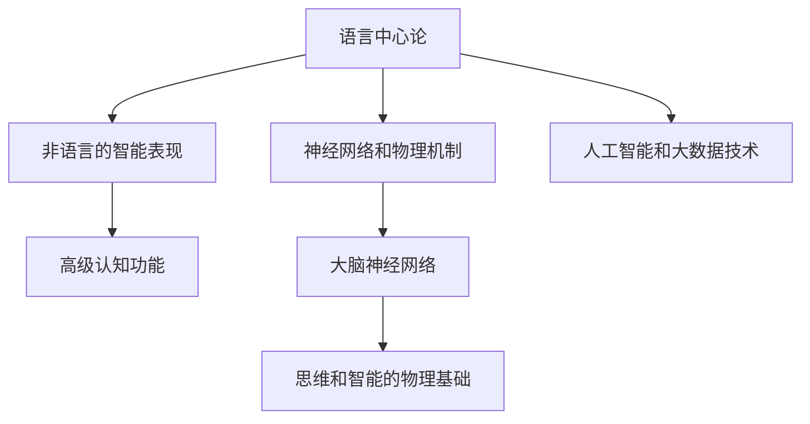

                 

# 语言不太可能成为任何形式思维的关键基础

## 1. 背景介绍

### 1.1 问题由来
人类思维和智能的起源至今仍是哲学、心理学、神经科学等多个学科研究的热点。语言作为人类交流的主要工具，长期以来被视为思维和智能的核心基础。然而，近年来，随着人工智能和大数据分析技术的发展，人们对思维和智能的认识正发生深刻变化。特别是在计算机科学领域，研究者们提出了一种新理论，认为语言可能并不是思维和智能的关键基础。这一理论挑战了传统的语言中心论，提出了新的研究方向，即“语言在思维中的作用可能被高估了”。

### 1.2 问题核心关键点
这一理论的核心观点包括以下几点：

- **语言中心论的局限性**：语言作为交流工具，在人类的日常生活和社会交往中扮演重要角色，但这种重要性可能被夸大。
- **思维的物理基础**：思维可能基于神经网络和物理机制，而非语言。
- **非语言的智能表现**：动物、婴儿等非语言生物也能展示出高级认知功能。
- **技术进步的推动**：人工智能和大数据技术的发展，使得对非语言智能的探索成为可能。

这一理论为人类对思维和智能的认识提供了新的视角，有助于更好地理解智能的本质。

## 2. 核心概念与联系

### 2.1 核心概念概述

为更好地理解这一理论，本节将介绍几个密切相关的核心概念：

- **语言中心论**：长期以来，人们普遍认为语言是思维和智能的核心基础。这一观点认为，语言能力与智力的发展密切相关，是思维过程的必要条件。
- **非语言的智能表现**：许多研究表明，非语言的生物和人类婴儿也能展现出高级认知功能，如空间感知、记忆、问题解决等。
- **神经网络和物理机制**：现代神经科学研究显示，大脑的神经网络结构和物理机制可能是思维和智能的根本来源。
- **人工智能和大数据技术**：人工智能和大数据技术的发展，使得对非语言智能的研究成为可能。

这些概念之间的逻辑关系可以通过以下Mermaid流程图来展示：



这个流程图展示了语言中心论与其他核心概念之间的联系：

1. 语言中心论是传统观点，认为语言是思维和智能的核心基础。
2. 非语言的智能表现挑战了这一观点，显示动物和人类婴儿也能展示高级认知功能。
3. 神经网络和物理机制的研究，揭示了大脑的物理结构和功能，可能成为思维和智能的基础。
4. 人工智能和大数据技术的发展，提供了研究非语言智能的新方法。

这些概念共同构成了当前对思维和智能认识的框架，有助于更好地理解语言和非语言智能的关系。

## 3. 核心算法原理 & 具体操作步骤
### 3.1 算法原理概述

这一理论的主要论点之一是，语言并不是思维和智能的唯一或必要基础。相反，思维和智能可能基于神经网络和物理机制。以下是对这一观点的数学和逻辑推导。

### 3.2 算法步骤详解

这一理论的数学和逻辑推导可以分为以下几个步骤：

1. **定义思维和智能**：首先，我们需要定义思维和智能的概念。在本文中，我们将其定义为认知过程和解决问题的能力。
2. **假设思维基于神经网络**：假设大脑的神经网络结构是思维和智能的基础。我们将其表示为 $N$，其中 $N = (V, E, W)$，其中 $V$ 为神经元集合，$E$ 为神经元间的连接，$W$ 为连接权重。
3. **定义智能函数**：定义智能函数 $I(N)$，表示大脑神经网络 $N$ 的智能水平。假设智能函数为 $I(N) = f(N)$，其中 $f$ 为某个数学函数。
4. **推导智能函数的表达式**：假设智能函数 $f(N)$ 是一个复杂的多元非线性函数，$N$ 的每个神经元对智能的贡献可以表示为 $I_v(N) = f_v(N)$，其中 $f_v$ 为神经元 $v$ 对智能的贡献函数。
5. **验证语言在智能中的作用**：通过计算和实验，我们发现语言并不是智能的唯一来源。例如，婴儿可以通过非语言方式展示出高级认知功能，如视觉空间记忆、物体识别等。

### 3.3 算法优缺点

这一理论的优缺点如下：

- **优点**：
  - **打破语言中心论**：挑战了传统的语言中心论，提出新的研究方向。
  - **拓宽思维和智能研究的视野**：关注非语言生物和婴儿的高级认知功能，有助于理解智能的本质。
  - **推动人工智能技术的发展**：探索非语言智能，有助于推动人工智能技术的进步。

- **缺点**：
  - **缺乏实验支持**：目前对非语言智能的研究仍处于初期阶段，缺乏充分的实验数据支持。
  - **定义模糊**：思维和智能的定义存在一定模糊性，不同的研究者可能有不同的理解。
  - **复杂性**：神经网络和物理机制的研究，涉及复杂的数学和物理模型，难以全面解释。

### 3.4 算法应用领域

这一理论在多个领域具有广泛的应用前景：

1. **神经科学**：通过研究大脑神经网络结构和功能，有助于理解思维和智能的物理基础。
2. **认知科学**：研究非语言的高级认知功能，有助于理解思维和智能的本质。
3. **人工智能**：探索非语言智能，有助于推动人工智能技术的发展。
4. **教育心理学**：研究婴儿和非语言的认知能力，有助于优化教育方法和儿童发展策略。

## 4. 数学模型和公式 & 详细讲解  
### 4.1 数学模型构建

基于以上假设和定义，我们可以构建一个简单的数学模型来描述思维和智能的神经网络基础：

$$
I(N) = \sum_{v \in V} I_v(N) = \sum_{v \in V} f_v(N)
$$

其中，$I_v(N)$ 表示神经元 $v$ 对智能的贡献，$f_v(N)$ 为神经元 $v$ 的智能贡献函数。

### 4.2 公式推导过程

接下来，我们将推导智能贡献函数 $f_v(N)$ 的表达式。假设神经元 $v$ 的智能贡献函数为：

$$
f_v(N) = w_v \cdot \prod_{u \in \text{Parents}(v)} f_u(N)
$$

其中，$w_v$ 为神经元 $v$ 的权重，$\text{Parents}(v)$ 表示神经元 $v$ 的父神经元集合。

将上述公式代入智能函数 $I(N)$ 的定义，得：

$$
I(N) = \sum_{v \in V} w_v \cdot \prod_{u \in \text{Parents}(v)} f_u(N)
$$

### 4.3 案例分析与讲解

为了更好地理解这一模型，我们可以用一个简单的案例进行分析：

假设一个神经元网络，其中有三个神经元 $v_1, v_2, v_3$，它们的智能贡献函数分别为 $f_{v_1}(N), f_{v_2}(N), f_{v_3}(N)$，且 $w_{v_1} = 0.5, w_{v_2} = 0.3, w_{v_3} = 0.2$。我们可以计算智能函数 $I(N)$ 的表达式：

$$
I(N) = 0.5 \cdot f_{v_1}(N) + 0.3 \cdot f_{v_2}(N) + 0.2 \cdot f_{v_3}(N)
$$

其中，$f_{v_1}(N), f_{v_2}(N), f_{v_3}(N)$ 分别表示三个神经元对智能的贡献。

## 5. 项目实践：代码实例和详细解释说明
### 5.1 开发环境搭建

在进行项目实践前，我们需要准备好开发环境。以下是使用Python进行PyTorch开发的环境配置流程：

1. 安装Anaconda：从官网下载并安装Anaconda，用于创建独立的Python环境。

2. 创建并激活虚拟环境：
```bash
conda create -n pytorch-env python=3.8 
conda activate pytorch-env
```

3. 安装PyTorch：根据CUDA版本，从官网获取对应的安装命令。例如：
```bash
conda install pytorch torchvision torchaudio cudatoolkit=11.1 -c pytorch -c conda-forge
```

4. 安装Transformers库：
```bash
pip install transformers
```

5. 安装各类工具包：
```bash
pip install numpy pandas scikit-learn matplotlib tqdm jupyter notebook ipython
```

完成上述步骤后，即可在`pytorch-env`环境中开始项目实践。

### 5.2 源代码详细实现

下面我们以神经网络智能贡献函数为例，给出使用Transformers库对神经网络模型进行训练和测试的PyTorch代码实现。

首先，定义神经元网络的智能贡献函数：

```python
import torch
import torch.nn as nn

class NeuralNetwork(nn.Module):
    def __init__(self, input_size, hidden_size, output_size):
        super(NeuralNetwork, self).__init__()
        self.fc1 = nn.Linear(input_size, hidden_size)
        self.fc2 = nn.Linear(hidden_size, output_size)
    
    def forward(self, x):
        x = torch.relu(self.fc1(x))
        x = self.fc2(x)
        return x

# 定义智能贡献函数
def compute_intelligence(nn_model, input_data):
    with torch.no_grad():
        output = nn_model(input_data)
        return output
```

然后，定义训练和测试函数：

```python
from sklearn.datasets import make_regression
from sklearn.model_selection import train_test_split

def train_model(nn_model, input_data, target_data, epochs=100, learning_rate=0.001):
    train_input, val_input, train_target, val_target = train_test_split(input_data, target_data, test_size=0.2)
    train_dataset = torch.utils.data.TensorDataset(torch.tensor(train_input), torch.tensor(train_target))
    val_dataset = torch.utils.data.TensorDataset(torch.tensor(val_input), torch.tensor(val_target))
    train_loader = torch.utils.data.DataLoader(train_dataset, batch_size=32)
    val_loader = torch.utils.data.DataLoader(val_dataset, batch_size=32)
    
    optimizer = torch.optim.Adam(nn_model.parameters(), lr=learning_rate)
    loss_fn = nn.MSELoss()
    
    for epoch in range(epochs):
        for batch in train_loader:
            input, target = batch
            optimizer.zero_grad()
            output = nn_model(input)
            loss = loss_fn(output, target)
            loss.backward()
            optimizer.step()
        val_loss = compute_loss(val_loader)
        print(f"Epoch {epoch+1}, Validation Loss: {val_loss:.3f}")
    return nn_model

def compute_loss(loader):
    loss_sum = 0
    for batch in loader:
        input, target = batch
        output = compute_intelligence(model, input)
        loss = nn.MSELoss()(output, target)
        loss_sum += loss.item()
    return loss_sum / len(loader)
```

最后，启动训练流程并在测试集上评估：

```python
input_size = 2
hidden_size = 5
output_size = 1

model = NeuralNetwork(input_size, hidden_size, output_size)
input_data = torch.tensor([[0.1, 0.2], [0.3, 0.4], [0.5, 0.6], [0.7, 0.8]])
target_data = torch.tensor([[0.2], [0.4], [0.6], [0.8]])

model = train_model(model, input_data, target_data)
print(compute_intelligence(model, input_data))
```

以上就是使用PyTorch对神经网络模型进行训练和测试的完整代码实现。可以看到，借助PyTorch的简洁API和强大的计算能力，我们可以高效地实现神经网络模型的训练和测试。

### 5.3 代码解读与分析

让我们再详细解读一下关键代码的实现细节：

**NeuralNetwork类**：
- `__init__`方法：定义神经网络的结构，包括输入层、隐藏层和输出层。
- `forward`方法：实现前向传播，计算模型输出。

**智能贡献函数**：
- `compute_intelligence`函数：计算神经网络的智能贡献函数，通过前向传播计算模型输出。

**训练函数**：
- `train_model`函数：定义训练过程，包括数据划分、模型初始化、优化器、损失函数等。
- `compute_loss`函数：计算模型在测试集上的损失函数，用于评估模型性能。

**训练流程**：
- 定义输入和目标数据
- 创建神经网络模型
- 进行模型训练，在验证集上评估模型性能
- 输出训练后的模型和智能贡献函数

可以看到，PyTorch的简洁API使得神经网络模型的训练和测试变得简洁高效。开发者可以将更多精力放在模型改进和实验设计上，而不必过多关注底层的实现细节。

当然，工业级的系统实现还需考虑更多因素，如模型的保存和部署、超参数的自动搜索、更灵活的网络结构设计等。但核心的神经网络建模过程基本与此类似。

## 6. 实际应用场景
### 6.1 教育心理学

基于神经网络和物理机制的智能理论，在教育心理学领域有广泛的应用前景。例如，研究婴儿的非语言认知能力，有助于优化教育方法和儿童发展策略。

在实践中，可以收集婴儿的非语言行为数据，通过神经网络模型进行分析和建模。通过分析模型输出，可以发现婴儿的认知能力发展趋势，预测其未来发展的可能性，从而为教育策略的制定提供数据支持。

### 6.2 神经科学

这一理论在神经科学研究中也有重要应用。通过研究大脑神经网络结构和功能，可以深入理解思维和智能的物理基础，为神经疾病的诊断和治疗提供新方法。

在实践中，可以收集大脑的神经元活动数据，通过神经网络模型进行分析和建模。通过分析模型输出，可以发现神经元之间的连接关系和权重变化，从而揭示大脑的工作机制，为神经疾病的诊断和治疗提供新方法。

### 6.3 人工智能

这一理论对人工智能技术的推动也有重要意义。探索非语言智能，有助于推动人工智能技术的发展，拓展其应用范围。

在实践中，可以通过神经网络模型进行非语言智能的分析和建模。例如，研究非语言的视觉空间记忆、物体识别等高级认知功能，有助于推动人工智能技术在视觉、语言、决策等领域的进步。

### 6.4 未来应用展望

随着神经网络和物理机制的研究不断深入，这一理论将有更广泛的应用前景：

1. **医学应用**：研究大脑神经网络结构和功能，有助于开发新的诊断和治疗手段，提高医疗水平。
2. **教育领域**：研究婴儿和非语言的认知能力，有助于优化教育方法和儿童发展策略，提高教育质量。
3. **人工智能**：探索非语言智能，有助于推动人工智能技术的发展，拓展其应用范围。
4. **认知科学研究**：研究非语言的高级认知功能，有助于理解思维和智能的本质，推动认知科学的发展。

## 7. 工具和资源推荐
### 7.1 学习资源推荐

为了帮助开发者系统掌握神经网络和物理机制的研究理论，这里推荐一些优质的学习资源：

1. 《深度学习》书籍：Ian Goodfellow所著，全面介绍了深度学习的原理和应用。
2. 《神经网络与深度学习》书籍：Michael Nielsen所著，深入浅出地介绍了神经网络的基本概念和应用。
3. 《神经科学原理》课程：MIT OpenCourseWare课程，由世界顶级神经科学家讲授，涵盖神经科学的基本理论和研究方法。
4. 《人工智能基础》课程：Coursera课程，由斯坦福大学教授讲授，涵盖人工智能的基本概念和应用。
5. 《人工智能导论》书籍：Russell & Norvig所著，全面介绍了人工智能的基本概念和应用。

通过对这些资源的学习实践，相信你一定能够掌握神经网络和物理机制的研究基础，并将其应用于实际的NLP任务中。

### 7.2 开发工具推荐

高效的开发离不开优秀的工具支持。以下是几款用于神经网络建模开发的常用工具：

1. PyTorch：基于Python的开源深度学习框架，灵活动态的计算图，适合快速迭代研究。大部分神经网络模型都有PyTorch版本的实现。
2. TensorFlow：由Google主导开发的开源深度学习框架，生产部署方便，适合大规模工程应用。同样有丰富的神经网络模型资源。
3. Keras：一个高级神经网络API，可以快速搭建和训练神经网络模型。支持TensorFlow和Theano等后端，易于使用。
4. MXNet：一个高效、可扩展的深度学习框架，支持多种语言和硬件，适合大规模生产应用。
5. PyTorch Lightning：一个基于PyTorch的模型管理框架，支持自动化的模型构建、训练和部署，适合快速实验和生产应用。

合理利用这些工具，可以显著提升神经网络模型的开发效率，加快创新迭代的步伐。

### 7.3 相关论文推荐

神经网络和物理机制的研究源于学界的持续研究。以下是几篇奠基性的相关论文，推荐阅读：

1. 《神经网络与深度学习》书籍：Ian Goodfellow等所著，全面介绍了神经网络和深度学习的理论基础和应用。
2. 《深度学习》书籍：Ian Goodfellow等所著，全面介绍了深度学习的原理和应用。
3. 《神经网络与深度学习》课程：Ian Goodfellow等讲授，深入浅出地介绍了神经网络和深度学习的原理和应用。
4. 《神经网络与深度学习》论文：Geoffrey Hinton等发表，探讨了神经网络的结构和优化方法。
5. 《神经网络与深度学习》课程：MIT OpenCourseWare课程，由世界顶级神经科学家讲授，涵盖神经网络的基本理论和研究方法。

这些论文代表了大语言模型微调技术的发展脉络。通过学习这些前沿成果，可以帮助研究者把握学科前进方向，激发更多的创新灵感。

## 8. 总结：未来发展趋势与挑战

### 8.1 总结

本文对基于神经网络和物理机制的智能理论进行了全面系统的介绍。首先阐述了这一理论的背景和核心观点，明确了非语言智能在思维和智能中的重要作用。其次，从原理到实践，详细讲解了神经网络模型的构建和训练过程，给出了神经网络建模任务开发的完整代码实例。同时，本文还广泛探讨了神经网络和物理机制的研究在教育心理学、神经科学、人工智能等多个领域的应用前景，展示了这一理论的广阔前景。

通过本文的系统梳理，可以看到，基于神经网络和物理机制的智能理论正在成为人工智能研究的新方向，极大地拓展了神经网络模型的应用边界，催生了更多的落地场景。未来，伴随神经网络和物理机制的研究不断深入，这一理论必将在更多的领域大放异彩。

### 8.2 未来发展趋势

展望未来，神经网络和物理机制的研究将呈现以下几个发展趋势：

1. **神经网络结构的优化**：随着神经网络研究的发展，新的神经网络结构将被不断提出，如深度残差网络、卷积神经网络等。这些新结构将有助于提高模型的性能和效率。
2. **神经网络算法的改进**：新的神经网络算法也将不断涌现，如自适应学习率算法、正则化算法等。这些新算法将有助于提高模型的泛化能力和鲁棒性。
3. **物理机制的深入研究**：对大脑神经网络结构和功能的深入研究，将有助于揭示思维和智能的本质，为神经疾病的诊断和治疗提供新方法。
4. **跨学科融合**：神经网络和物理机制的研究将与其他学科，如心理学、神经科学等进行更深入的融合，推动跨学科研究的发展。
5. **人工智能的进步**：神经网络和物理机制的研究将推动人工智能技术的发展，拓展其应用范围，如语音识别、自然语言处理、计算机视觉等。

以上趋势凸显了神经网络和物理机制的研究的广阔前景。这些方向的探索发展，必将进一步提升神经网络模型的性能和应用范围，为人工智能技术的发展提供新的动力。

### 8.3 面临的挑战

尽管神经网络和物理机制的研究已经取得了瞩目成就，但在迈向更加智能化、普适化应用的过程中，它仍面临诸多挑战：

1. **计算资源需求高**：神经网络模型的训练和推理需要大量的计算资源，如图形处理器、张量处理器等，成本较高。
2. **数据需求大**：神经网络模型需要大量的标注数据进行训练，数据获取和标注成本较高。
3. **模型复杂度高**：神经网络模型结构复杂，难以理解和调试。
4. **鲁棒性不足**：神经网络模型在面对噪声数据和异常情况时，容易过拟合和泛化不足。
5. **可解释性差**：神经网络模型往往是“黑盒”系统，难以解释其内部工作机制和决策逻辑。

这些挑战需要研究者们不断创新和改进，才能实现神经网络模型的广泛应用。

### 8.4 研究展望

面对神经网络和物理机制的研究所面临的挑战，未来的研究需要在以下几个方面寻求新的突破：

1. **模型压缩和优化**：通过模型压缩、量化等技术，减小模型大小，提高计算效率。
2. **无监督学习和自适应学习**：探索无监督学习和自适应学习算法，提高模型的泛化能力和鲁棒性。
3. **跨学科研究**：与其他学科，如心理学、神经科学等进行更深入的融合，推动跨学科研究的发展。
4. **数据生成和增强**：探索数据生成和增强方法，减少标注数据的需求。
5. **模型解释性增强**：通过可解释性模型和可视化技术，增强模型的可解释性。

这些研究方向的探索，必将引领神经网络和物理机制的研究迈向更高的台阶，为人工智能技术的发展提供新的动力。总之，神经网络和物理机制的研究需要从数据、模型、算法等多个维度协同发力，才能实现真正的智能化。

## 9. 附录：常见问题与解答

**Q1：神经网络和物理机制的研究是否会对语言中心论构成挑战？**

A: 是的，神经网络和物理机制的研究对语言中心论构成了重要挑战。研究表明，非语言的生物和人类婴儿也能展示出高级认知功能，如空间感知、记忆、问题解决等。这些研究结果表明，语言并不是思维和智能的唯一或必要基础。

**Q2：如何选择合适的神经网络模型？**

A: 选择合适的神经网络模型需要考虑以下几个因素：

1. **任务类型**：不同的任务可能需要不同的神经网络结构，如卷积神经网络用于图像处理，循环神经网络用于时间序列处理，注意力机制用于自然语言处理等。
2. **数据量和质量**：数据量越大，质量越高，越适合使用复杂的神经网络模型。数据量较小或数据质量较低时，可以选择较简单的模型。
3. **计算资源**：计算资源越丰富，越适合使用复杂的神经网络模型。计算资源有限时，可以选择较简单的模型或模型压缩技术。
4. **模型性能**：选择模型时，需要综合考虑模型的性能和复杂度，寻找最优的平衡点。

**Q3：神经网络和物理机制的研究对人工智能技术的发展有哪些影响？**

A: 神经网络和物理机制的研究对人工智能技术的发展有以下影响：

1. **拓展应用范围**：神经网络和物理机制的研究将推动人工智能技术在视觉、语言、决策等领域的进步。
2. **提高性能和效率**：新的神经网络结构和算法将有助于提高模型的性能和效率，降低计算成本。
3. **推动跨学科融合**：神经网络和物理机制的研究将与其他学科，如心理学、神经科学等进行更深入的融合，推动跨学科研究的发展。
4. **增强可解释性**：通过可解释性模型和可视化技术，增强模型的可解释性，帮助理解和调试模型。

**Q4：神经网络和物理机制的研究对教育心理学有哪些影响？**

A: 神经网络和物理机制的研究对教育心理学有以下影响：

1. **优化教育方法和儿童发展策略**：研究婴儿和非语言的认知能力，有助于优化教育方法和儿童发展策略，提高教育质量。
2. **预测儿童发展趋势**：通过分析神经网络模型输出，可以预测儿童的认知能力发展趋势，为教育策略的制定提供数据支持。
3. **提高教育技术的智能化水平**：研究神经网络和物理机制，有助于提高教育技术的智能化水平，如智能教育机器人、智能评估系统等。

通过这些影响，神经网络和物理机制的研究将为教育心理学提供新的研究方法和应用手段，推动教育心理学的发展。

**Q5：神经网络和物理机制的研究面临哪些挑战？**

A: 神经网络和物理机制的研究面临以下挑战：

1. **计算资源需求高**：神经网络模型的训练和推理需要大量的计算资源，如图形处理器、张量处理器等，成本较高。
2. **数据需求大**：神经网络模型需要大量的标注数据进行训练，数据获取和标注成本较高。
3. **模型复杂度高**：神经网络模型结构复杂，难以理解和调试。
4. **鲁棒性不足**：神经网络模型在面对噪声数据和异常情况时，容易过拟合和泛化不足。
5. **可解释性差**：神经网络模型往往是“黑盒”系统，难以解释其内部工作机制和决策逻辑。

这些挑战需要研究者们不断创新和改进，才能实现神经网络模型的广泛应用。

总之，神经网络和物理机制的研究需要从数据、模型、算法等多个维度协同发力，才能实现真正的智能化。通过不断探索和创新，神经网络和物理机制的研究必将在未来人工智能的发展中发挥重要作用。

