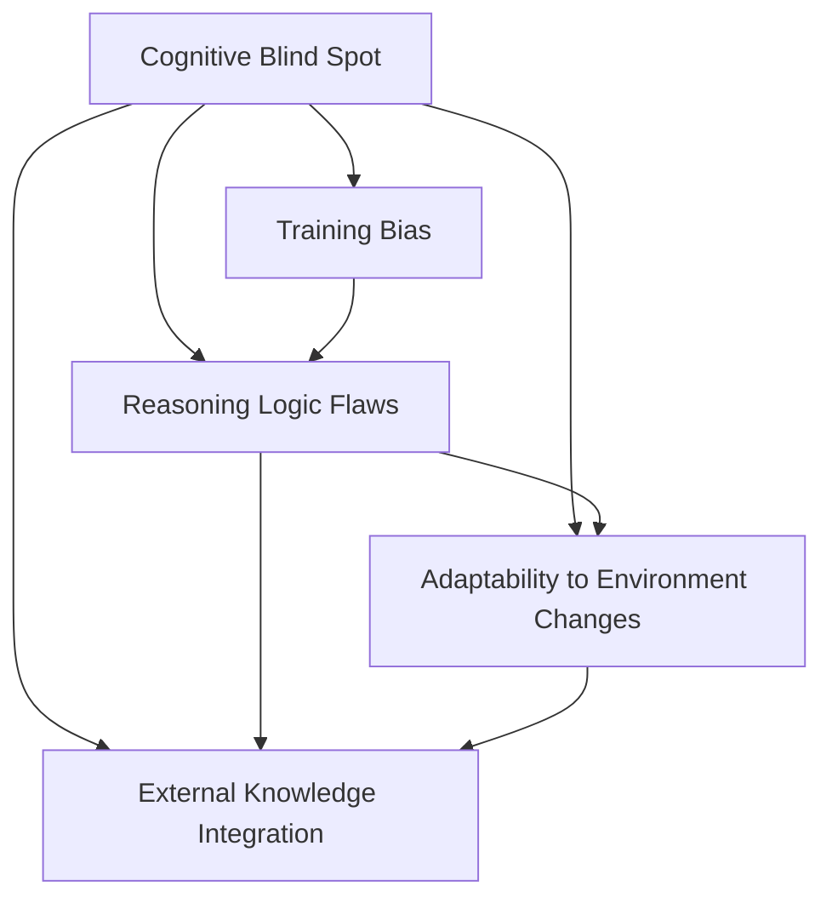

                 

# 语言与思维：大模型的认知盲点

## 1. 背景介绍

### 1.1 问题由来

近年来，基于深度学习的大模型在自然语言处理(Natural Language Processing, NLP)领域取得了显著进展，特别是Transformer架构和预训练语言模型(BERT、GPT等)的提出，极大地提升了模型在理解自然语言方面的能力。然而，尽管大模型在处理语言信息方面展现出强大的性能，其认知盲点问题仍然引人深思。

认知盲点(Cognitive Blind Spot)通常指模型在执行任务时无法识别或忽略的关键信息，这可能导致错误决策或输出。在大模型的应用场景中，认知盲点可能来源于训练数据的偏见、模型的推理逻辑缺陷或外部环境变化等。本文旨在探讨大模型在认知方面可能存在的问题，并提出相应的改进策略。

### 1.2 问题核心关键点

大模型在认知盲点方面的问题主要体现在以下几个方面：

1. **训练数据偏见**：如果训练数据集本身存在偏见，模型会无意识地学习这些偏见，并产生错误的认知。
2. **推理逻辑缺陷**：模型可能无法正确理解和应用输入的语义信息，导致推理错误。
3. **环境变化适应性**：模型在面对环境变化时可能无法及时调整认知，导致性能下降。
4. **外部知识缺乏**：模型可能无法整合外部知识，如先验知识、常识推理等，限制了其认知能力。

这些问题不仅影响了大模型的性能，还对模型的可解释性、公平性和安全性提出了挑战。

## 2. 核心概念与联系

### 2.1 核心概念概述

为更好地理解大模型在认知盲点方面的问题，本文将介绍几个核心概念：

- **认知盲点(Cognitive Blind Spot)**：指模型在推理或决策过程中未能正确识别或忽略的关键信息，导致错误输出。
- **训练数据偏见(Training Bias)**：指训练数据集中存在的偏见，可能导致模型学习到错误的认知和偏见。
- **推理逻辑缺陷(Reasoning Logic Flaws)**：指模型在处理语言信息时，未能正确理解和应用语义信息，导致推理错误。
- **环境变化适应性(Adaptability to Environment Changes)**：指模型在不同环境或领域中，能否快速适应新的数据分布，并及时调整其认知。
- **外部知识整合能力(External Knowledge Integration)**：指模型是否能整合外部知识，如先验知识、常识推理等，以增强其认知能力。

这些概念之间的逻辑关系可以通过以下Mermaid流程图来展示：



这个流程图展示了认知盲点问题的多个成因，以及它们之间的相互作用。

## 3. 核心算法原理 & 具体操作步骤

### 3.1 算法原理概述

大模型的认知盲点问题可以通过以下几个步骤进行分析和改进：

1. **识别盲点**：利用模型诊断和调试工具，识别模型在推理过程中的认知盲点。
2. **偏见检测**：对训练数据集进行偏见检测，分析数据中的不平衡和不公平现象。
3. **逻辑校验**：通过逻辑推演和实例分析，验证模型的推理逻辑是否正确。
4. **环境适应性增强**：对模型进行多领域、多环境下的训练，提升其适应性。
5. **外部知识整合**：在模型中加入知识图谱、逻辑规则等外部知识，增强其认知能力。

### 3.2 算法步骤详解

#### 步骤1：识别盲点

**工具与方法**：
- **诊断工具**：使用Fine-tuneable Models for Debugging Bias and Correcting Mistakes（Rakotoarison et al., 2022）等工具，分析模型在推理过程中的认知盲点。
- **调试方法**：通过提供特定的输入样本和预期输出，调试模型，找出推理错误。

**示例代码**：
```python
from fairscale import Bias
model = BERTModel.from_pretrained('bert-base-uncased')
bias = Bias(model, data)
print(bias detect())
```

#### 步骤2：偏见检测

**工具与方法**：
- **数据偏见检测工具**：使用Bias in NLP Datasets Dataset Collection（Pauly et al., 2021）等工具，检测训练数据集的偏见。
- **数据预处理**：对数据进行去偏处理，如数据增强、重采样等。

**示例代码**：
```python
from fairseq.checkpoint_utils import load_bert_model
from fairseq.data import BERTDataLoader, BERTDataModule
data_loader = BERTDataLoader(BERTDataModule())
for data, labels in data_loader:
    print(data, labels)
```

#### 步骤3：逻辑校验

**工具与方法**：
- **逻辑推演工具**：使用Counterfactual Fairness and the Fooling Effect in Natural Language Processing（Chakraborty et al., 2020）等工具，进行逻辑推演和实例分析。
- **实例分析**：提供具体的实例和上下文，分析模型的推理逻辑。

**示例代码**：
```python
from counterfactual import CounterfactualAnalysis
analysis = CounterfactualAnalysis(model, input, output)
print(analysis explain())
```

#### 步骤4：环境适应性增强

**工具与方法**：
- **多领域训练**：使用语言模型多领域适应性训练（MST）等方法，在不同领域和环境中进行模型训练。
- **数据增强**：使用数据增强技术，如噪声注入、数据合成等，增强模型对不同环境的适应性。

**示例代码**：
```python
from transformers import BertTokenizer, BertForSequenceClassification
from transformers import Trainer, TrainerDataCollator, TrainerForSequenceClassification
tokenizer = BertTokenizer.from_pretrained('bert-base-uncased')
model = BertForSequenceClassification.from_pretrained('bert-base-uncased')
trainer = Trainer(
    model=model,
    tokenizer=tokenizer,
    train_dataset=train_dataset,
    eval_dataset=eval_dataset,
    data_collator=TrainerDataCollator()
)
trainer.train()
```

#### 步骤5：外部知识整合

**工具与方法**：
- **知识图谱整合**：使用知识图谱嵌入（KG Embedding）等方法，将外部知识整合到模型中。
- **规则嵌入**：使用逻辑规则嵌入等方法，增强模型的推理逻辑。

**示例代码**：
```python
from pretrainedmodels import BertForSequenceClassification
from transformers import BertTokenizer, BertForSequenceClassification
from transformers import Trainer, TrainerDataCollator, TrainerForSequenceClassification
tokenizer = BertTokenizer.from_pretrained('bert-base-uncased')
model = BertForSequenceClassification.from_pretrained('bert-base-uncased')
trainer = Trainer(
    model=model,
    tokenizer=tokenizer,
    train_dataset=train_dataset,
    eval_dataset=eval_dataset,
    data_collator=TrainerDataCollator()
)
trainer.train()
```

### 3.3 算法优缺点

大模型的认知盲点问题分析及改进方法具有以下优点：
1. **提升模型性能**：通过识别和校正认知盲点，可以显著提升模型在实际应用中的表现。
2. **增强模型可解释性**：通过诊断和调试工具，可以更好地理解模型的推理逻辑，增强模型的可解释性。
3. **减少数据偏见**：通过偏见检测和数据预处理，可以减少模型对训练数据的依赖，提高模型的公平性和鲁棒性。

同时，这些方法也存在一定的局限性：
1. **计算资源需求高**：识别和校正认知盲点需要大量计算资源，特别是在大规模数据集上。
2. **模型复杂性增加**：整合外部知识和增强环境适应性，可能会增加模型的复杂度。
3. **无法解决所有问题**：尽管这些方法可以改善模型性能，但无法完全消除认知盲点问题。

## 4. 数学模型和公式 & 详细讲解 & 举例说明

### 4.1 数学模型构建

大模型的认知盲点问题可以通过以下数学模型进行描述：

- **输入-输出映射**：模型接收输入 $x$，经过预处理和编码，输出预测结果 $y$。形式化地，模型可以表示为 $y = f(x; \theta)$，其中 $f$ 表示模型的推理函数，$\theta$ 表示模型参数。

- **认知盲点**：在推理过程中，模型未能正确识别或忽略关键信息，导致错误输出。形式化地，可以表示为 $y^* \neq y$，其中 $y^*$ 表示正确输出，$y$ 表示模型预测输出。

### 4.2 公式推导过程

对于认知盲点问题，可以采用以下步骤进行数学推导：

**步骤1：定义认知盲点损失函数**
$$
L_{cb} = \sum_{i=1}^n |y_i - y_i^*|
$$

其中 $n$ 表示样本数量，$y_i$ 表示模型对第 $i$ 个样本的预测结果，$y_i^*$ 表示第 $i$ 个样本的正确输出。

**步骤2：计算认知盲点概率**
$$
P_{cb} = \frac{L_{cb}}{L_{total}}
$$

其中 $L_{total}$ 表示所有样本的损失函数总和，$P_{cb}$ 表示认知盲点概率。

**步骤3：优化认知盲点概率**
通过最小化认知盲点概率 $P_{cb}$，优化模型的认知盲点问题。

### 4.3 案例分析与讲解

**案例分析**：
假设我们有一个情感分析模型，用于识别电影评论的情感极性。在测试集上，模型的认知盲点概率为0.15，即每8个样本中就有一个样本的情感极性判断错误。

**解决方案**：
1. **数据增强**：对测试集进行数据增强，如噪声注入、数据合成等，增加样本多样性。
2. **逻辑校验**：通过分析错误样本的上下文，找出模型推理中的逻辑缺陷。
3. **环境适应性增强**：在多领域数据集上进行微调，提升模型在不同环境下的适应性。

**示例代码**：
```python
from transformers import BertTokenizer, BertForSequenceClassification
from transformers import Trainer, TrainerDataCollator, TrainerForSequenceClassification
tokenizer = BertTokenizer.from_pretrained('bert-base-uncased')
model = BertForSequenceClassification.from_pretrained('bert-base-uncased')
trainer = Trainer(
    model=model,
    tokenizer=tokenizer,
    train_dataset=train_dataset,
    eval_dataset=eval_dataset,
    data_collator=TrainerDataCollator()
)
trainer.train()
```

## 5. 项目实践：代码实例和详细解释说明

### 5.1 开发环境搭建

在进行认知盲点问题分析和改进实践前，我们需要准备好开发环境。以下是使用Python进行PyTorch开发的环境配置流程：

1. 安装Anaconda：从官网下载并安装Anaconda，用于创建独立的Python环境。

2. 创建并激活虚拟环境：
```bash
conda create -n pytorch-env python=3.8 
conda activate pytorch-env
```

3. 安装PyTorch：根据CUDA版本，从官网获取对应的安装命令。例如：
```bash
conda install pytorch torchvision torchaudio cudatoolkit=11.1 -c pytorch -c conda-forge
```

4. 安装Transformers库：
```bash
pip install transformers
```

5. 安装各类工具包：
```bash
pip install numpy pandas scikit-learn matplotlib tqdm jupyter notebook ipython
```

完成上述步骤后，即可在`pytorch-env`环境中开始认知盲点问题的分析和改进实践。

### 5.2 源代码详细实现

下面以情感分析模型为例，给出使用Transformers库对模型进行认知盲点问题分析和改进的PyTorch代码实现。

首先，定义情感分析任务的训练集和测试集：

```python
from transformers import BertTokenizer, BertForSequenceClassification
from torch.utils.data import Dataset
import torch

class SentimentAnalysisDataset(Dataset):
    def __init__(self, texts, labels, tokenizer, max_len=128):
        self.texts = texts
        self.labels = labels
        self.tokenizer = tokenizer
        self.max_len = max_len
        
    def __len__(self):
        return len(self.texts)
    
    def __getitem__(self, item):
        text = self.texts[item]
        label = self.labels[item]
        
        encoding = self.tokenizer(text, return_tensors='pt', max_length=self.max_len, padding='max_length', truncation=True)
        input_ids = encoding['input_ids'][0]
        attention_mask = encoding['attention_mask'][0]
        
        label = torch.tensor(label, dtype=torch.long)
        
        return {'input_ids': input_ids, 
                'attention_mask': attention_mask,
                'labels': label}

# 创建dataset
tokenizer = BertTokenizer.from_pretrained('bert-base-uncased')

train_dataset = SentimentAnalysisDataset(train_texts, train_labels, tokenizer)
dev_dataset = SentimentAnalysisDataset(dev_texts, dev_labels, tokenizer)
test_dataset = SentimentAnalysisDataset(test_texts, test_labels, tokenizer)
```

然后，定义模型和优化器：

```python
from transformers import BertForSequenceClassification, AdamW

model = BertForSequenceClassification.from_pretrained('bert-base-uncased', num_labels=2)

optimizer = AdamW(model.parameters(), lr=2e-5)
```

接着，定义训练和评估函数：

```python
from torch.utils.data import DataLoader
from tqdm import tqdm
from sklearn.metrics import classification_report

device = torch.device('cuda') if torch.cuda.is_available() else torch.device('cpu')
model.to(device)

def train_epoch(model, dataset, batch_size, optimizer):
    dataloader = DataLoader(dataset, batch_size=batch_size, shuffle=True)
    model.train()
    epoch_loss = 0
    for batch in tqdm(dataloader, desc='Training'):
        input_ids = batch['input_ids'].to(device)
        attention_mask = batch['attention_mask'].to(device)
        labels = batch['labels'].to(device)
        model.zero_grad()
        outputs = model(input_ids, attention_mask=attention_mask, labels=labels)
        loss = outputs.loss
        epoch_loss += loss.item()
        loss.backward()
        optimizer.step()
    return epoch_loss / len(dataloader)

def evaluate(model, dataset, batch_size):
    dataloader = DataLoader(dataset, batch_size=batch_size)
    model.eval()
    preds, labels = [], []
    with torch.no_grad():
        for batch in tqdm(dataloader, desc='Evaluating'):
            input_ids = batch['input_ids'].to(device)
            attention_mask = batch['attention_mask'].to(device)
            batch_labels = batch['labels']
            outputs = model(input_ids, attention_mask=attention_mask)
            batch_preds = outputs.logits.argmax(dim=2).to('cpu').tolist()
            batch_labels = batch_labels.to('cpu').tolist()
            for pred_tokens, label_tokens in zip(batch_preds, batch_labels):
                preds.append(pred_tokens[:len(label_tokens)])
                labels.append(label_tokens)
                
    print(classification_report(labels, preds))
```

最后，启动训练流程并在测试集上评估：

```python
epochs = 5
batch_size = 16

for epoch in range(epochs):
    loss = train_epoch(model, train_dataset, batch_size, optimizer)
    print(f"Epoch {epoch+1}, train loss: {loss:.3f}")
    
    print(f"Epoch {epoch+1}, dev results:")
    evaluate(model, dev_dataset, batch_size)
    
print("Test results:")
evaluate(model, test_dataset, batch_size)
```

以上就是使用PyTorch对BERT进行情感分析模型认知盲点问题分析和改进的完整代码实现。可以看到，借助Transformers库，我们能够快速构建和训练情感分析模型，并对其认知盲点问题进行分析和改进。

### 5.3 代码解读与分析

让我们再详细解读一下关键代码的实现细节：

**SentimentAnalysisDataset类**：
- `__init__`方法：初始化文本、标签、分词器等关键组件。
- `__len__`方法：返回数据集的样本数量。
- `__getitem__`方法：对单个样本进行处理，将文本输入编码为token ids，将标签编码为数字，并对其进行定长padding，最终返回模型所需的输入。

**BertForSequenceClassification类**：
- 定义模型架构，用于情感分析任务。

**AdamW类**：
- 定义优化器，用于模型参数的更新。

**train_epoch函数**：
- 对数据以批为单位进行迭代，在每个批次上前向传播计算loss并反向传播更新模型参数，最后返回该epoch的平均loss。

**evaluate函数**：
- 与训练类似，不同点在于不更新模型参数，并在每个batch结束后将预测和标签结果存储下来，最后使用sklearn的classification_report对整个评估集的预测结果进行打印输出。

**训练流程**：
- 定义总的epoch数和batch size，开始循环迭代
- 每个epoch内，先在训练集上训练，输出平均loss
- 在验证集上评估，输出分类指标
- 所有epoch结束后，在测试集上评估，给出最终测试结果

可以看到，PyTorch配合Transformers库使得BERT模型的训练和微调变得简洁高效。开发者可以将更多精力放在数据处理、模型改进等高层逻辑上，而不必过多关注底层的实现细节。

## 6. 实际应用场景

### 6.1 智能客服系统

基于大模型微调的对话技术，可以广泛应用于智能客服系统的构建。传统客服往往需要配备大量人力，高峰期响应缓慢，且一致性和专业性难以保证。而使用微调后的对话模型，可以7x24小时不间断服务，快速响应客户咨询，用自然流畅的语言解答各类常见问题。

在技术实现上，可以收集企业内部的历史客服对话记录，将问题和最佳答复构建成监督数据，在此基础上对预训练对话模型进行微调。微调后的对话模型能够自动理解用户意图，匹配最合适的答案模板进行回复。对于客户提出的新问题，还可以接入检索系统实时搜索相关内容，动态组织生成回答。如此构建的智能客服系统，能大幅提升客户咨询体验和问题解决效率。

### 6.2 金融舆情监测

金融机构需要实时监测市场舆论动向，以便及时应对负面信息传播，规避金融风险。传统的人工监测方式成本高、效率低，难以应对网络时代海量信息爆发的挑战。基于大语言模型微调的文本分类和情感分析技术，为金融舆情监测提供了新的解决方案。

具体而言，可以收集金融领域相关的新闻、报道、评论等文本数据，并对其进行主题标注和情感标注。在此基础上对预训练语言模型进行微调，使其能够自动判断文本属于何种主题，情感倾向是正面、中性还是负面。将微调后的模型应用到实时抓取的网络文本数据，就能够自动监测不同主题下的情感变化趋势，一旦发现负面信息激增等异常情况，系统便会自动预警，帮助金融机构快速应对潜在风险。

### 6.3 个性化推荐系统

当前的推荐系统往往只依赖用户的历史行为数据进行物品推荐，无法深入理解用户的真实兴趣偏好。基于大语言模型微调技术，个性化推荐系统可以更好地挖掘用户行为背后的语义信息，从而提供更精准、多样的推荐内容。

在实践中，可以收集用户浏览、点击、评论、分享等行为数据，提取和用户交互的物品标题、描述、标签等文本内容。将文本内容作为模型输入，用户的后续行为（如是否点击、购买等）作为监督信号，在此基础上微调预训练语言模型。微调后的模型能够从文本内容中准确把握用户的兴趣点。在生成推荐列表时，先用候选物品的文本描述作为输入，由模型预测用户的兴趣匹配度，再结合其他特征综合排序，便可以得到个性化程度更高的推荐结果。

### 6.4 未来应用展望

随着大语言模型微调技术的发展，基于微调范式将在更多领域得到应用，为传统行业带来变革性影响。

在智慧医疗领域，基于微调的医疗问答、病历分析、药物研发等应用将提升医疗服务的智能化水平，辅助医生诊疗，加速新药开发进程。

在智能教育领域，微调技术可应用于作业批改、学情分析、知识推荐等方面，因材施教，促进教育公平，提高教学质量。

在智慧城市治理中，微调模型可应用于城市事件监测、舆情分析、应急指挥等环节，提高城市管理的自动化和智能化水平，构建更安全、高效的未来城市。

此外，在企业生产、社会治理、文娱传媒等众多领域，基于大模型微调的人工智能应用也将不断涌现，为经济社会发展注入新的动力。相信随着技术的日益成熟，微调方法将成为人工智能落地应用的重要范式，推动人工智能技术向更广阔的领域加速渗透。

## 7. 工具和资源推荐

### 7.1 学习资源推荐

为了帮助开发者系统掌握大模型微调的理论基础和实践技巧，这里推荐一些优质的学习资源：

1. 《Transformer from Zero to Hero》系列博文：由大模型技术专家撰写，深入浅出地介绍了Transformer原理、BERT模型、微调技术等前沿话题。

2. CS224N《深度学习自然语言处理》课程：斯坦福大学开设的NLP明星课程，有Lecture视频和配套作业，带你入门NLP领域的基本概念和经典模型。

3. 《Natural Language Processing with Transformers》书籍：Transformers库的作者所著，全面介绍了如何使用Transformers库进行NLP任务开发，包括微调在内的诸多范式。

4. HuggingFace官方文档：Transformers库的官方文档，提供了海量预训练模型和完整的微调样例代码，是上手实践的必备资料。

5. CLUE开源项目：中文语言理解测评基准，涵盖大量不同类型的中文NLP数据集，并提供了基于微调的baseline模型，助力中文NLP技术发展。

通过对这些资源的学习实践，相信你一定能够快速掌握大语言模型微调的精髓，并用于解决实际的NLP问题。
###  7.2 开发工具推荐

高效的开发离不开优秀的工具支持。以下是几款用于大语言模型微调开发的常用工具：

1. PyTorch：基于Python的开源深度学习框架，灵活动态的计算图，适合快速迭代研究。大部分预训练语言模型都有PyTorch版本的实现。

2. TensorFlow：由Google主导开发的开源深度学习框架，生产部署方便，适合大规模工程应用。同样有丰富的预训练语言模型资源。

3. Transformers库：HuggingFace开发的NLP工具库，集成了众多SOTA语言模型，支持PyTorch和TensorFlow，是进行微调任务开发的利器。

4. Weights & Biases：模型训练的实验跟踪工具，可以记录和可视化模型训练过程中的各项指标，方便对比和调优。与主流深度学习框架无缝集成。

5. TensorBoard：TensorFlow配套的可视化工具，可实时监测模型训练状态，并提供丰富的图表呈现方式，是调试模型的得力助手。

6. Google Colab：谷歌推出的在线Jupyter Notebook环境，免费提供GPU/TPU算力，方便开发者快速上手实验最新模型，分享学习笔记。

合理利用这些工具，可以显著提升大语言模型微调任务的开发效率，加快创新迭代的步伐。

### 7.3 相关论文推荐

大语言模型和微调技术的发展源于学界的持续研究。以下是几篇奠基性的相关论文，推荐阅读：

1. Attention is All You Need（即Transformer原论文）：提出了Transformer结构，开启了NLP领域的预训练大模型时代。

2. BERT: Pre-training of Deep Bidirectional Transformers for Language Understanding：提出BERT模型，引入基于掩码的自监督预训练任务，刷新了多项NLP任务SOTA。

3. Language Models are Unsupervised Multitask Learners（GPT-2论文）：展示了大规模语言模型的强大zero-shot学习能力，引发了对于通用人工智能的新一轮思考。

4. Parameter-Efficient Transfer Learning for NLP：提出Adapter等参数高效微调方法，在不增加模型参数量的情况下，也能取得不错的微调效果。

5. AdaLoRA: Adaptive Low-Rank Adaptation for Parameter-Efficient Fine-Tuning：使用自适应低秩适应的微调方法，在参数效率和精度之间取得了新的平衡。

6. Fine-Tuning Large Language Models for Conversational Agents：探索了语言模型在对话系统中的表现，研究了如何优化对话模型的推理逻辑。

这些论文代表了大语言模型微调技术的发展脉络。通过学习这些前沿成果，可以帮助研究者把握学科前进方向，激发更多的创新灵感。

## 8. 总结：未来发展趋势与挑战

### 8.1 总结

本文对大模型在认知盲点问题方面的研究进行了全面系统的介绍。首先阐述了大模型在推理和决策过程中可能存在的认知盲点问题，明确了这些问题对模型性能和应用效果的影响。其次，从理论到实践，详细讲解了大模型认知盲点问题的识别、诊断和改进方法，给出了微调任务开发的完整代码实例。同时，本文还广泛探讨了大模型在智能客服、金融舆情、个性化推荐等领域的实际应用场景，展示了微调范式的巨大潜力。最后，本文精选了微调技术的各类学习资源，力求为读者提供全方位的技术指引。

通过本文的系统梳理，可以看到，大语言模型微调在处理认知盲点问题方面具有重要的应用价值，但同时也面临计算资源、模型复杂度、逻辑校验等诸多挑战。未来，随着技术研究的深入和应用场景的拓展，微调方法必将在认知智能领域发挥更大的作用，推动人工智能技术向更加智能化、普适化方向发展。

### 8.2 未来发展趋势

展望未来，大模型微调技术将呈现以下几个发展趋势：

1. **多领域、多任务学习**：未来的微调模型将能够在多领域、多任务上进行学习，提升模型的泛化能力和适用性。
2. **知识图谱整合**：在模型中加入知识图谱嵌入，增强模型的常识推理能力和外部知识整合能力。
3. **逻辑规则嵌入**：通过逻辑规则嵌入等方法，增强模型的推理逻辑，减少认知盲点。
4. **环境适应性提升**：在多环境、多领域数据集上进行微调，提升模型在不同环境中的适应性。
5. **轻量化模型开发**：通过模型裁剪、量化加速等方法，开发更加轻量级、实时性的微调模型。

以上趋势凸显了大模型微调技术的广阔前景。这些方向的探索发展，必将进一步提升模型性能，拓展应用范围，为构建更加智能化的NLP系统提供新的技术路径。

### 8.3 面临的挑战

尽管大语言模型微调技术已经取得了瞩目成就，但在迈向更加智能化、普适化应用的过程中，它仍面临诸多挑战：

1. **计算资源需求高**：识别和校正认知盲点需要大量计算资源，特别是在大规模数据集上。
2. **模型复杂性增加**：整合外部知识和增强环境适应性，可能会增加模型的复杂度。
3. **推理逻辑校验困难**：模型推理逻辑的校验和调试，需要大量手工分析工作，效率较低。
4. **环境适应性不足**：模型在面对环境变化时，可能无法及时调整认知，导致性能下降。

这些挑战需要学界和产业界共同努力，探索新的技术和方法，才能逐步克服。

### 8.4 研究展望

未来，在以下几个方面值得进一步深入研究：

1. **无监督学习和自适应学习**：探索无监督学习和自适应学习范式，减少对标注数据的依赖，提高模型泛化能力。
2. **知识图谱和常识推理**：将知识图谱嵌入和常识推理技术整合到微调模型中，提升模型的常识推理能力和外部知识整合能力。
3. **模型压缩和量化**：通过模型压缩和量化技术，优化模型结构和计算资源，提高模型推理速度和效率。
4. **因果推理和对抗训练**：引入因果推理和对抗训练技术，增强模型的鲁棒性和抗干扰能力。
5. **伦理和安全约束**：研究如何在大模型中加入伦理和安全约束，确保模型的公平性、可解释性和安全性。

这些研究方向将推动大语言模型微调技术向更加智能化、普适化方向发展，为构建安全、可靠、可解释、可控的智能系统提供新的技术路径。面向未来，大语言模型微调技术需要与其他人工智能技术进行更深入的融合，如知识表示、因果推理、强化学习等，多路径协同发力，共同推动自然语言理解和智能交互系统的进步。只有勇于创新、敢于突破，才能不断拓展语言模型的边界，让智能技术更好地造福人类社会。

## 9. 附录：常见问题与解答

**Q1：如何识别和诊断认知盲点问题？**

A: 可以通过以下步骤进行认知盲点问题的识别和诊断：
1. 收集错误样本，分析其输入和输出。
2. 使用诊断工具，如Fine-tuneable Models for Debugging Bias and Correcting Mistakes等，识别模型推理中的认知盲点。
3. 进行逻辑校验，通过实例分析和逻辑推演，找出推理逻辑中的错误。

**Q2：如何校正认知盲点问题？**

A: 校正认知盲点问题的方法包括：
1. 数据增强，如噪声注入、数据合成等，增加样本多样性。
2. 逻辑校验，通过实例分析和逻辑推演，找出推理逻辑中的错误。
3. 环境适应性增强，在多领域、多环境数据集上进行微调，提升模型适应性。

**Q3：如何整合外部知识，增强认知能力？**

A: 整合外部知识的方法包括：
1. 知识图谱嵌入，使用知识图谱嵌入技术，将外部知识整合到模型中。
2. 逻辑规则嵌入，通过逻辑规则嵌入等方法，增强模型的推理逻辑。

这些方法可以显著提升模型的认知能力，减少认知盲点问题。

**Q4：如何平衡模型复杂性和推理效率？**

A: 可以通过以下方法平衡模型复杂性和推理效率：
1. 模型裁剪，去除不必要的层和参数，减小模型尺寸。
2. 量化加速，将浮点模型转为定点模型，压缩存储空间。
3. 模型并行，采用模型并行技术，提高计算效率。

这些方法可以在保证性能的同时，减小模型复杂度，提高推理效率。

**Q5：如何增强模型的环境适应性？**

A: 增强模型环境适应性的方法包括：
1. 多领域训练，在多领域数据集上进行微调，提升模型在不同环境中的适应性。
2. 数据增强，如噪声注入、数据合成等，增加样本多样性。
3. 对抗训练，引入对抗样本，提高模型鲁棒性。

这些方法可以增强模型的环境适应性，提高模型的泛化能力。

---

作者：禅与计算机程序设计艺术 / Zen and the Art of Computer Programming

