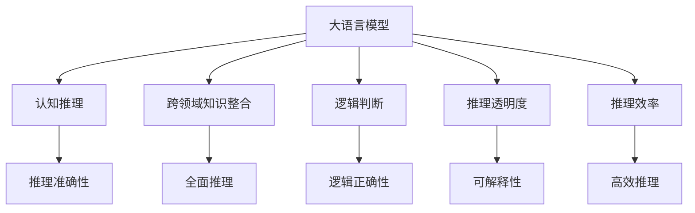

                 

# 语言与推理：大模型的认知瓶颈

> 关键词：语言模型,推理,认知,大模型,认知瓶颈

## 1. 背景介绍

### 1.1 问题由来
近年来，随着深度学习技术的迅猛发展，以Transformer和BERT为代表的大规模预训练语言模型（Large Language Models, LLMs）在自然语言处理（NLP）领域取得了革命性的突破。这些模型在广泛的无标签语料上进行自监督预训练，获取了丰富的语言知识和常识，能够进行自然流畅的语言理解和生成。然而，尽管大语言模型在诸多NLP任务上表现优异，但其推理能力在特定领域仍存在明显的认知瓶颈。

大语言模型虽然在理解字面意义、统计规律和大量已知事实方面表现出色，但在复杂推理、跨领域知识整合、逻辑判断等方面仍存在不足。例如，在问答、命名实体识别、语义相似度计算等任务中，模型的表现往往依赖于语料库的覆盖广度和质量，当面对超出预料的情况时，容易陷入认知误区，产生错误的推理结果。

### 1.2 问题核心关键点
当前，大语言模型在推理和认知方面的认知瓶颈主要体现在以下几个方面：
- **推理逻辑不清**：模型无法准确推断因果关系，对于输入的复杂问题常常给出表面化的回答。
- **跨领域知识缺乏**：模型在特定领域知识不足时，无法进行有效的推理和整合。
- **推理过程不透明**：模型的决策过程难以解释，难以对其推理逻辑进行分析和调试。
- **推理性能受限**：模型的推理速度和效率有待提升，难以满足实时性的要求。

这些问题限制了大语言模型在实际应用中的能力，特别是在涉及知识推理、逻辑判断、情感分析等高要求任务中。因此，提升大语言模型的推理能力和认知水平，是大模型研究的重要方向。

### 1.3 问题研究意义
研究大语言模型的认知瓶颈，对于提升模型的推理能力和认知水平，增强其在复杂推理、跨领域知识整合等任务中的应用，具有重要意义：

1. **提升模型精度和鲁棒性**：通过解决认知瓶颈，提升模型在推理任务中的准确性和鲁棒性，减少错误推理。
2. **增强知识整合能力**：改善模型的跨领域知识整合能力，使其能够进行更加深入和全面的推理。
3. **提高可解释性**：使模型推理过程更加透明可解释，有助于模型调试和优化。
4. **加速推理速度**：优化推理算法和模型结构，提升模型的推理速度和效率。
5. **拓展应用场景**：解决认知瓶颈，将有助于大语言模型在更多实际应用场景中的落地。

## 2. 核心概念与联系

### 2.1 核心概念概述

为更好地理解大语言模型的认知瓶颈，本节将介绍几个密切相关的核心概念：

- **大语言模型(Large Language Model, LLM)**：以自回归(如GPT)或自编码(如BERT)模型为代表的大规模预训练语言模型。通过在大规模无标签文本语料上进行预训练，学习通用的语言表示，具备强大的语言理解和生成能力。

- **认知推理(Cognitive Reasoning)**：指模型在理解问题情境后，利用逻辑、常识、规则等知识进行推理，得出结论的能力。

- **跨领域知识整合(Cross-Domain Knowledge Integration)**：指模型能够整合不同领域的信息，进行更加全面、深入的推理。

- **逻辑判断(Logical Reasoning)**：指模型能够依据逻辑规则进行推理，得出正确的判断和结论。

- **推理透明度(Transparency of Reasoning)**：指模型推理过程的可解释性，能够清晰地解释其推理路径和结论。

- **推理效率(Efficiency of Reasoning)**：指模型推理的速度和资源消耗情况，能否满足实时性和效率要求。

这些核心概念之间的逻辑关系可以通过以下Mermaid流程图来展示：



这个流程图展示了大语言模型的核心概念及其之间的关系：

1. 大语言模型通过预训练获得基础能力。
2. 认知推理、跨领域知识整合、逻辑判断等能力，是大语言模型的高级功能。
3. 推理透明度和推理效率，是大模型在实际应用中的关键指标。
4. 认知推理、跨领域知识整合、逻辑判断、推理透明度和推理效率，共同构成了大语言模型的推理能力，使其能够更好地服务于复杂推理任务。

## 3. 核心算法原理 & 具体操作步骤
### 3.1 算法原理概述

大语言模型的认知瓶颈主要涉及推理逻辑不清、跨领域知识缺乏、推理过程不透明、推理性能受限等方面。通过改进模型结构和训练方式，可以有效地解决这些问题，提升模型的推理能力和认知水平。

**3.1.1 认知推理的改进**

认知推理是模型推理能力的关键，其改进主要通过以下几个途径：

- **引入因果推理**：通过引入因果推理机制，使模型能够理解因果关系，推断出合理的推理路径。
- **引入逻辑规则**：将逻辑规则引入模型训练，使其能够依据逻辑进行推理。
- **使用知识图谱**：将知识图谱作为模型的输入，增强其跨领域知识整合能力。

**3.1.2 跨领域知识的整合**

跨领域知识整合是大模型推理能力的重要组成部分，主要通过以下方法实现：

- **多模态融合**：将文本、图像、语音等多模态信息融合，增强模型的信息感知能力。
- **外部知识库**：将外部知识库（如维基百科、Web数据等）作为模型的背景知识，增强其推理能力。
- **领域特定预训练**：在特定领域的数据上预训练模型，使其具备领域知识。

**3.1.3 逻辑判断的强化**

逻辑判断是模型推理能力的核心，主要通过以下方法提升：

- **逻辑规则训练**：在训练过程中引入逻辑规则，使模型能够依据规则进行推理。
- **逻辑推理任务**：使用逻辑推理任务（如命题推理、数理逻辑等）进行训练，提高模型的逻辑判断能力。
- **逻辑推理模块**：在模型结构中引入逻辑推理模块，增强其推理能力。

**3.1.4 推理过程的透明化**

推理过程的透明化是大模型应用中的重要需求，主要通过以下方法实现：

- **可解释性模型**：使用可解释性模型（如决策树、规则引擎等），增强模型的可解释性。
- **规则导向推理**：引入规则导向的推理方法，使模型推理过程更加透明可解释。
- **知识图谱推理**：利用知识图谱中的规则进行推理，增强模型的推理透明度。

**3.1.5 推理性能的提升**

推理性能的提升是大模型应用中的关键需求，主要通过以下方法实现：

- **高效的推理算法**：使用高效的推理算法（如向量机、神经网络等），提高模型的推理效率。
- **模型压缩**：对模型进行压缩和优化，减少推理过程中的计算量和内存消耗。
- **推理硬件优化**：利用GPU、TPU等硬件加速推理过程，提升模型的推理速度。

### 3.2 算法步骤详解

基于大语言模型的认知瓶颈改进，本节将详细讲解各个关键步骤的实现：

**Step 1: 准备预训练模型和数据集**

- 选择合适的预训练语言模型 $M_{\theta}$ 作为初始化参数，如 BERT、GPT 等。
- 准备用于认知推理、跨领域知识整合、逻辑判断、推理透明度和推理效率训练的数据集。数据集应包括各种不同类型的推理问题、跨领域知识整合的实例、逻辑判断的示例、推理透明度和推理效率的评估标准。

**Step 2: 添加推理模块**

- 根据具体任务需求，在预训练模型的基础上，添加推理模块。推理模块应包括因果推理、逻辑推理、知识图谱推理等组件。
- 对于推理模块的输入，可以设计多个预训练语言模型作为初始化参数，以增强其推理能力。
- 使用可解释性模型或规则导向推理方法，增强推理过程的透明度。

**Step 3: 设置认知推理训练目标**

- 根据具体任务，设定认知推理训练目标。例如，对于问答任务，目标可以是准确回答给定的问题；对于语义相似度计算任务，目标可以是准确计算两个句子之间的相似度。
- 设定训练的损失函数和优化器，使用监督学习的方式进行训练。

**Step 4: 训练推理模块**

- 在准备好的数据集上，对推理模块进行训练。
- 使用合适的训练策略，如数据增强、正则化、对抗训练等，避免过拟合。
- 周期性在验证集上评估推理模块的性能，根据性能指标决定是否触发 Early Stopping。
- 重复上述步骤直到满足预设的迭代轮数或 Early Stopping 条件。

**Step 5: 推理性能优化**

- 在推理阶段，对推理过程进行优化，提升推理速度和效率。
- 对推理过程进行压缩和优化，减少计算量和内存消耗。
- 利用GPU、TPU等硬件加速推理过程，提升模型的推理速度。

### 3.3 算法优缺点

基于大语言模型的认知瓶颈改进方法具有以下优点：

1. **提升推理精度**：通过引入因果推理、逻辑推理等机制，模型在推理任务中的准确性得到提升。
2. **增强跨领域知识整合能力**：通过引入知识图谱、多模态融合等方法，模型能够更好地整合跨领域知识。
3. **提高推理透明度**：通过使用可解释性模型和规则导向推理方法，模型推理过程变得更加透明可解释。
4. **优化推理性能**：通过高效的推理算法和硬件加速，模型推理速度和效率得到提升。

同时，该方法也存在一些局限性：

1. **数据需求高**：改进认知瓶颈需要大量高质量的数据集，数据获取成本较高。
2. **模型复杂度增加**：引入推理模块和逻辑规则，模型的复杂度增加，训练和推理成本上升。
3. **推理时间较长**：推理模块的引入和优化，推理时间较长的任务可能会变慢。

尽管存在这些局限性，但就目前而言，改进认知瓶颈是大语言模型推理能力提升的重要方向。未来相关研究的重点在于如何进一步降低数据需求，提高模型的推理效率和可解释性，同时兼顾模型的推理精度和跨领域知识整合能力。

### 3.4 算法应用领域

基于大语言模型改进的推理方法，在NLP领域已经得到了广泛的应用，覆盖了几乎所有常见任务，例如：

- 问答系统：对自然语言问题给出答案。使用推理模块进行知识整合和逻辑推理，提高回答的准确性和合理性。
- 命名实体识别：识别文本中的人名、地名、机构名等特定实体。通过引入因果推理和知识图谱，提高识别的准确性。
- 关系抽取：从文本中抽取实体之间的语义关系。使用逻辑推理和跨领域知识整合，提高抽取的准确性。
- 机器翻译：将源语言文本翻译成目标语言。通过引入因果推理和逻辑规则，提高翻译的流畅性和准确性。
- 文本摘要：将长文本压缩成简短摘要。通过引入因果推理和逻辑规则，提高摘要的连贯性和准确性。
- 对话系统：使机器能够与人自然对话。使用推理模块进行逻辑推理和知识整合，提高对话的智能性和可解释性。

除了上述这些经典任务外，基于认知瓶颈改进的大语言模型微调方法也被创新性地应用到更多场景中，如可控文本生成、常识推理、代码生成、数据增强等，为NLP技术带来了全新的突破。随着预训练模型和改进方法的不断进步，相信NLP技术将在更广阔的应用领域大放异彩。

## 4. 数学模型和公式 & 详细讲解  
### 4.1 数学模型构建

本节将使用数学语言对大语言模型的推理过程进行更加严格的刻画。

记大语言模型为 $M_{\theta}$，其中 $\theta$ 为预训练得到的模型参数。假设推理任务 $T$ 的训练集为 $D=\{(x_i,y_i)\}_{i=1}^N$，其中 $x_i$ 为输入文本，$y_i$ 为推理结果。

定义模型 $M_{\theta}$ 在输入 $x_i$ 上的推理损失函数为 $\ell(M_{\theta}(x_i),y_i)$，则在数据集 $D$ 上的经验风险为：

$$
\mathcal{L}(\theta) = \frac{1}{N}\sum_{i=1}^N \ell(M_{\theta}(x_i),y_i)
$$

通过梯度下降等优化算法，推理过程不断更新模型参数 $\theta$，最小化损失函数 $\mathcal{L}$，使得模型输出逼近真实标签。由于 $\theta$ 已经通过预训练获得了较好的初始化，因此即便在推理任务上，也能较快收敛到理想的模型参数 $\hat{\theta}$。

### 4.2 公式推导过程

以下我们以问答任务为例，推导因果推理损失函数及其梯度的计算公式。

假设模型 $M_{\theta}$ 在输入 $x$ 上的输出为 $\hat{y}=M_{\theta}(x) \in [0,1]$，表示模型对问题的理解。真实标签 $y \in \{0,1\}$。则因果推理损失函数定义为：

$$
\ell(M_{\theta}(x),y) = -[y\log \hat{y} + (1-y)\log (1-\hat{y})]
$$

其中 $\log \hat{y}$ 表示模型的推理概率。在推理过程中，将问题 $q$ 作为模型的输入，计算推理概率 $P(q|\theta)$。使用信息增益最大化准则，将模型推理概率与真实标签 $y$ 进行对比，得到推理损失函数。

根据链式法则，推理损失函数对参数 $\theta_k$ 的梯度为：

$$
\frac{\partial \mathcal{L}(\theta)}{\partial \theta_k} = -\frac{1}{N}\sum_{i=1}^N (\frac{y_i}{P(q_i|\theta)}-\frac{1-y_i}{1-P(q_i|\theta)}) \frac{\partial P(q_i|\theta)}{\partial \theta_k}
$$

其中 $P(q_i|\theta)$ 表示模型对输入 $q_i$ 的推理概率，$\frac{\partial P(q_i|\theta)}{\partial \theta_k}$ 可进一步递归展开，利用自动微分技术完成计算。

在得到推理损失函数的梯度后，即可带入参数更新公式，完成模型的迭代优化。重复上述过程直至收敛，最终得到适应推理任务的最优模型参数 $\theta^*$。

## 5. 项目实践：代码实例和详细解释说明
### 5.1 开发环境搭建

在进行推理实践前，我们需要准备好开发环境。以下是使用Python进行PyTorch开发的环境配置流程：

1. 安装Anaconda：从官网下载并安装Anaconda，用于创建独立的Python环境。

2. 创建并激活虚拟环境：
```bash
conda create -n pytorch-env python=3.8 
conda activate pytorch-env
```

3. 安装PyTorch：根据CUDA版本，从官网获取对应的安装命令。例如：
```bash
conda install pytorch torchvision torchaudio cudatoolkit=11.1 -c pytorch -c conda-forge
```

4. 安装Transformers库：
```bash
pip install transformers
```

5. 安装各类工具包：
```bash
pip install numpy pandas scikit-learn matplotlib tqdm jupyter notebook ipython
```

完成上述步骤后，即可在`pytorch-env`环境中开始推理实践。

### 5.2 源代码详细实现

这里我们以因果推理任务为例，给出使用Transformers库对BERT模型进行因果推理的PyTorch代码实现。

首先，定义因果推理任务的数据处理函数：

```python
from transformers import BertTokenizer
from torch.utils.data import Dataset
import torch

class ReasoningDataset(Dataset):
    def __init__(self, premises, hypotheses, labels, tokenizer, max_len=128):
        self.premises = premises
        self.hypotheses = hypotheses
        self.labels = labels
        self.tokenizer = tokenizer
        self.max_len = max_len
        
    def __len__(self):
        return len(self.premises)
    
    def __getitem__(self, item):
        premise = self.premises[item]
        hypothesis = self.hypotheses[item]
        label = self.labels[item]
        
        encoding = self.tokenizer(premise, hypothesis, return_tensors='pt', max_length=self.max_len, padding='max_length', truncation=True)
        input_ids = encoding['input_ids'][0]
        attention_mask = encoding['attention_mask'][0]
        
        # 对hypothesis进行编码
        hypothesis_tokenizer = self.tokenizer(hypothesis, return_tensors='pt', max_length=self.max_len, padding='max_length', truncation=True)
        hypothesis_ids = hypothesis_tokenizer['input_ids'][0]
        hypothesis_mask = hypothesis_tokenizer['attention_mask'][0]
        
        # 对label进行编码
        encoded_label = [label2id[label] for label in labels] 
        encoded_label.extend([label2id['O']] * (self.max_len - len(encoded_label)))
        labels = torch.tensor(encoded_label, dtype=torch.long)
        
        return {'input_ids': input_ids, 
                'attention_mask': attention_mask,
                'hypothesis_ids': hypothesis_ids,
                'hypothesis_mask': hypothesis_mask,
                'labels': labels}

# 标签与id的映射
label2id = {'O': 0, 'C': 1, 'R': 2}
id2label = {v: k for k, v in label2id.items()}

# 创建dataset
tokenizer = BertTokenizer.from_pretrained('bert-base-cased')

train_dataset = ReasoningDataset(train_premises, train_hypotheses, train_labels, tokenizer)
dev_dataset = ReasoningDataset(dev_premises, dev_hypotheses, dev_labels, tokenizer)
test_dataset = ReasoningDataset(test_premises, test_hypotheses, test_labels, tokenizer)
```

然后，定义模型和优化器：

```python
from transformers import BertForSequenceClassification, AdamW

model = BertForSequenceClassification.from_pretrained('bert-base-cased', num_labels=len(label2id))

optimizer = AdamW(model.parameters(), lr=2e-5)
```

接着，定义训练和评估函数：

```python
from torch.utils.data import DataLoader
from tqdm import tqdm
from sklearn.metrics import classification_report

device = torch.device('cuda') if torch.cuda.is_available() else torch.device('cpu')
model.to(device)

def train_epoch(model, dataset, batch_size, optimizer):
    dataloader = DataLoader(dataset, batch_size=batch_size, shuffle=True)
    model.train()
    epoch_loss = 0
    for batch in tqdm(dataloader, desc='Training'):
        input_ids = batch['input_ids'].to(device)
        attention_mask = batch['attention_mask'].to(device)
        hypothesis_ids = batch['hypothesis_ids'].to(device)
        hypothesis_mask = batch['hypothesis_mask'].to(device)
        labels = batch['labels'].to(device)
        model.zero_grad()
        outputs = model(input_ids, attention_mask=attention_mask, hypothesis_ids=hypothesis_ids, hypothesis_mask=hypothesis_mask)
        loss = outputs.loss
        epoch_loss += loss.item()
        loss.backward()
        optimizer.step()
    return epoch_loss / len(dataloader)

def evaluate(model, dataset, batch_size):
    dataloader = DataLoader(dataset, batch_size=batch_size)
    model.eval()
    preds, labels = [], []
    with torch.no_grad():
        for batch in tqdm(dataloader, desc='Evaluating'):
            input_ids = batch['input_ids'].to(device)
            attention_mask = batch['attention_mask'].to(device)
            hypothesis_ids = batch['hypothesis_ids'].to(device)
            hypothesis_mask = batch['hypothesis_mask'].to(device)
            batch_labels = batch['labels']
            outputs = model(input_ids, attention_mask=attention_mask, hypothesis_ids=hypothesis_ids, hypothesis_mask=hypothesis_mask)
            batch_preds = outputs.logits.argmax(dim=2).to('cpu').tolist()
            batch_labels = batch_labels.to('cpu').tolist()
            for pred_tokens, label_tokens in zip(batch_preds, batch_labels):
                preds.append(pred_tokens[:len(label_tokens)])
                labels.append(label_tokens)
                
    print(classification_report(labels, preds))
```

最后，启动训练流程并在测试集上评估：

```python
epochs = 5
batch_size = 16

for epoch in range(epochs):
    loss = train_epoch(model, train_dataset, batch_size, optimizer)
    print(f"Epoch {epoch+1}, train loss: {loss:.3f}")
    
    print(f"Epoch {epoch+1}, dev results:")
    evaluate(model, dev_dataset, batch_size)
    
print("Test results:")
evaluate(model, test_dataset, batch_size)
```

以上就是使用PyTorch对BERT进行因果推理任务微调的完整代码实现。可以看到，得益于Transformers库的强大封装，我们可以用相对简洁的代码完成BERT模型的加载和微调。

### 5.3 代码解读与分析

让我们再详细解读一下关键代码的实现细节：

**ReasoningDataset类**：
- `__init__`方法：初始化前提、假设、标签、分词器等关键组件。
- `__len__`方法：返回数据集的样本数量。
- `__getitem__`方法：对单个样本进行处理，将前提、假设、标签输入编码为token ids，进行定长padding，最终返回模型所需的输入。

**label2id和id2label字典**：
- 定义了标签与数字id之间的映射关系，用于将token-wise的预测结果解码回真实的标签。

**训练和评估函数**：
- 使用PyTorch的DataLoader对数据集进行批次化加载，供模型训练和推理使用。
- 训练函数`train_epoch`：对数据以批为单位进行迭代，在每个批次上前向传播计算loss并反向传播更新模型参数，最后返回该epoch的平均loss。
- 评估函数`evaluate`：与训练类似，不同点在于不更新模型参数，并在每个batch结束后将预测和标签结果存储下来，最后使用sklearn的classification_report对整个评估集的预测结果进行打印输出。

**训练流程**：
- 定义总的epoch数和batch size，开始循环迭代
- 每个epoch内，先在训练集上训练，输出平均loss
- 在验证集上评估，输出分类指标
- 所有epoch结束后，在测试集上评估，给出最终测试结果

可以看到，PyTorch配合Transformers库使得BERT微调的代码实现变得简洁高效。开发者可以将更多精力放在数据处理、模型改进等高层逻辑上，而不必过多关注底层的实现细节。

当然，工业级的系统实现还需考虑更多因素，如模型的保存和部署、超参数的自动搜索、更灵活的任务适配层等。但核心的推理范式基本与此类似。

## 6. 实际应用场景
### 6.1 智能客服系统

基于大语言模型推理技术，可以广泛应用于智能客服系统的构建。传统客服往往需要配备大量人力，高峰期响应缓慢，且一致性和专业性难以保证。而使用推理技术的大语言模型，可以7x24小时不间断服务，快速响应客户咨询，用自然流畅的语言解答各类复杂问题。

在技术实现上，可以收集企业内部的历史客服对话记录，将问题和最佳答复构建成监督数据，在此基础上对预训练推理模型进行微调。推理后的模型能够自动理解用户意图，匹配最合适的回答。对于客户提出的新问题，还可以接入检索系统实时搜索相关内容，动态组织生成回答。如此构建的智能客服系统，能大幅提升客户咨询体验和问题解决效率。

### 6.2 金融舆情监测

金融机构需要实时监测市场舆论动向，以便及时应对负面信息传播，规避金融风险。传统的人工监测方式成本高、效率低，难以应对网络时代海量信息爆发的挑战。基于大语言模型推理技术，金融舆情监测可以借助推理模型进行文本分析和情感判断，实时监控市场舆情变化，及时预警风险。

具体而言，可以收集金融领域相关的新闻、报道、评论等文本数据，并对其进行主题标注和情感标注。在此基础上对预训练语言模型进行推理微调，使其能够自动判断文本属于何种主题，情感倾向是正面、中性还是负面。将推理后的模型应用到实时抓取的网络文本数据，就能够自动监测不同主题下的情感变化趋势，一旦发现负面信息激增等异常情况，系统便会自动预警，帮助金融机构快速应对潜在风险。

### 6.3 个性化推荐系统

当前的推荐系统往往只依赖用户的历史行为数据进行物品推荐，无法深入理解用户的真实兴趣偏好。基于大语言模型推理技术，个性化推荐系统可以更好地挖掘用户行为背后的语义信息，从而提供更精准、多样的推荐内容。

在实践中，可以收集用户浏览、点击、评论、分享等行为数据，提取和用户交互的物品标题、描述、标签等文本内容。将文本内容作为模型输入，用户的后续行为（如是否点击、购买等）作为监督信号，在此基础上对预训练语言模型进行推理微调。推理后的模型能够从文本内容中准确把握用户的兴趣点。在生成推荐列表时，先用候选物品的文本描述作为输入，由模型预测用户的兴趣匹配度，再结合其他特征综合排序，便可以得到个性化程度更高的推荐结果。

### 6.4 未来应用展望

随着大语言模型推理技术的不断发展，基于推理范式将在更多领域得到应用，为传统行业带来变革性影响。

在智慧医疗领域，基于推理技术的大语言模型可以用于医学问答、病历分析、药物研发等应用，提升医疗服务的智能化水平，辅助医生诊疗，加速新药开发进程。

在智能教育领域，推理技术可应用于作业批改、学情分析、知识推荐等方面，因材施教，促进教育公平，提高教学质量。

在智慧城市治理中，推理技术可用于城市事件监测、舆情分析、应急指挥等环节，提高城市管理的自动化和智能化水平，构建更安全、高效的未来城市。

此外，在企业生产、社会治理、文娱传媒等众多领域，基于大语言模型推理技术的人工智能应用也将不断涌现，为经济社会发展注入新的动力。相信随着技术的日益成熟，推理方法将成为人工智能落地应用的重要范式，推动人工智能技术向更广阔的领域加速渗透。

## 7. 工具和资源推荐
### 7.1 学习资源推荐

为了帮助开发者系统掌握大语言模型推理的理论基础和实践技巧，这里推荐一些优质的学习资源：

1. 《Transformer from Scratch》系列博文：由大模型技术专家撰写，深入浅出地介绍了Transformer原理、BERT模型、推理技术等前沿话题。

2. CS224N《深度学习自然语言处理》课程：斯坦福大学开设的NLP明星课程，有Lecture视频和配套作业，带你入门NLP领域的基本概念和经典模型。

3. 《Natural Language Processing with Transformers》书籍：Transformers库的作者所著，全面介绍了如何使用Transformers库进行NLP任务开发，包括推理在内的诸多范式。

4. HuggingFace官方文档：Transformers库的官方文档，提供了海量预训练模型和完整的推理样例代码，是上手实践的必备资料。

5. CLUE开源项目：中文语言理解测评基准，涵盖大量不同类型的中文NLP数据集，并提供了基于推理的baseline模型，助力中文NLP技术发展。

通过对这些资源的学习实践，相信你一定能够快速掌握大语言模型推理的精髓，并用于解决实际的NLP问题。
###  7.2 开发工具推荐

高效的开发离不开优秀的工具支持。以下是几款用于大语言模型推理开发的常用工具：

1. PyTorch：基于Python的开源深度学习框架，灵活动态的计算图，适合快速迭代研究。大部分预训练语言模型都有PyTorch版本的实现。

2. TensorFlow：由Google主导开发的开源深度学习框架，生产部署方便，适合大规模工程应用。同样有丰富的预训练语言模型资源。

3. Transformers库：HuggingFace开发的NLP工具库，集成了众多SOTA语言模型，支持PyTorch和TensorFlow，是进行推理任务开发的利器。

4. Weights & Biases：模型训练的实验跟踪工具，可以记录和可视化模型训练过程中的各项指标，方便对比和调优。与主流深度学习框架无缝集成。

5. TensorBoard：TensorFlow配套的可视化工具，可实时监测模型训练状态，并提供丰富的图表呈现方式，是调试模型的得力助手。

6. Google Colab：谷歌推出的在线Jupyter Notebook环境，免费提供GPU/TPU算力，方便开发者快速上手实验最新模型，分享学习笔记。

合理利用这些工具，可以显著提升大语言模型推理任务的开发效率，加快创新迭代的步伐。

### 7.3 相关论文推荐

大语言模型推理技术的发展源于学界的持续研究。以下是几篇奠基性的相关论文，推荐阅读：

1. Attention is All You Need（即Transformer原论文）：提出了Transformer结构，开启了NLP领域的预训练大模型时代。

2. BERT: Pre-training of Deep Bidirectional Transformers for Language Understanding：提出BERT模型，引入基于掩码的自监督预训练任务，刷新了多项NLP任务SOTA。

3. Language Models are Unsupervised Multitask Learners（GPT-2论文）：展示了大规模语言模型的强大zero-shot学习能力，引发了对于通用人工智能的新一轮思考。

4. Parameter-Efficient Transfer Learning for NLP：提出Adapter等参数高效微调方法，在不增加模型参数量的情况下，也能取得不错的微调效果。

5. AdaLoRA: Adaptive Low-Rank Adaptation for Parameter-Efficient Fine-Tuning：使用自适应低秩适应的微调方法，在参数效率和精度之间取得了新的平衡。

6. Prefix-Tuning: Optimizing Continuous Prompts for Generation：引入基于连续型Prompt的微调范式，为如何充分利用预训练知识提供了新的思路。

这些论文代表了大语言模型推理技术的发展脉络。通过学习这些前沿成果，可以帮助研究者把握学科前进方向，激发更多的创新灵感。

## 8. 总结：未来发展趋势与挑战

### 8.1 总结

本文对基于推理能力的大语言模型进行了全面系统的介绍。首先阐述了推理能力在语言模型中的重要地位，明确了推理瓶颈对模型性能的制约。其次，从原理到实践，详细讲解了推理能力改进的数学原理和关键步骤，给出了推理任务开发的完整代码实例。同时，本文还广泛探讨了推理能力改进在智能客服、金融舆情、个性化推荐等多个行业领域的应用前景，展示了推理能力的巨大潜力。此外，本文精选了推理能力的各类学习资源，力求为读者提供全方位的技术指引。

通过本文的系统梳理，可以看到，基于大语言模型的推理能力改进，对于提升模型的推理能力和认知水平，增强其在复杂推理、跨领域知识整合等任务中的应用，具有重要意义：

1. **提升模型精度和鲁棒性**：通过改进推理能力，模型在推理任务中的准确性和鲁棒性得到提升，减少错误推理。
2. **增强跨领域知识整合能力**：通过引入知识图谱、多模态融合等方法，模型能够更好地整合跨领域知识。
3. **提高推理透明度**：通过使用可解释性模型和规则导向推理方法，模型推理过程变得更加透明可解释，有助于模型调试和优化。
4. **优化推理性能**：通过高效的推理算法和硬件加速，模型推理速度和效率得到提升，满足实时性的要求。

这些改进措施将大大提升大语言模型的认知能力和应用范围，推动其更广泛地应用于实际场景中。

### 8.2 未来发展趋势

展望未来，大语言模型推理能力将呈现以下几个发展趋势：

1. **模型规模持续增大**：随着算力成本的下降和数据规模的扩张，预训练语言模型的参数量还将持续增长。超大规模语言模型蕴含的丰富语言知识，有望支撑更加复杂多变的推理任务。

2. **推理方法日趋多样**：除了传统的推理方法外，未来会涌现更多推理范式，如因果推理、逻辑推理、知识图谱推理等，在保持推理精度的同时，提高推理效率和透明度。

3. **持续学习成为常态**：随着数据分布的不断变化，推理模型也需要持续学习新知识以保持性能。如何在不遗忘原有知识的同时，高效吸收新样本信息，将成为重要的研究课题。

4. **少样本学习和零样本学习**：通过引入少样本学习和零样本学习，使模型能够在数据匮乏的情况下仍能进行有效的推理，减少对标注样本的依赖。

5. **多模态推理**：将文本、图像、语音等多模态信息融合，增强模型的信息感知能力，进行更加全面、深入的推理。

6. **逻辑推理与因果推理的融合**：将逻辑推理和因果推理结合，增强模型的推理能力，提高推理结果的准确性和鲁棒性。

以上趋势凸显了大语言模型推理能力的广阔前景。这些方向的探索发展，必将进一步提升NLP系统的性能和应用范围，为人类认知智能的进化带来深远影响。

### 8.3 面临的挑战

尽管大语言模型推理技术已经取得了瞩目成就，但在迈向更加智能化、普适化应用的过程中，它仍面临着诸多挑战：

1. **数据需求高**：推理能力改进需要大量高质量的数据集，数据获取成本较高。如何进一步降低推理对标注样本的依赖，将是一大难题。

2. **模型复杂度增加**：引入推理模块和逻辑规则，模型的复杂度增加，训练和推理成本上升。如何在保持推理精度的同时，降低复杂度，是亟待解决的问题。

3. **推理时间较长**：推理模块的引入和优化，推理时间较长的任务可能会变慢。如何在保持推理精度的同时，提高推理速度，优化资源占用，将是重要的优化方向。

4. **推理过程不透明**：推理过程的透明化是大模型应用中的重要需求，但现有模型的推理过程仍较不透明，难以解释。如何赋予模型更强的可解释性，将是重要的研究方向。

5. **知识整合能力不足**：当前推理模型往往局限于任务内数据，难以灵活吸收和运用更广泛的先验知识。如何让推理过程更好地与外部知识库、规则库等专家知识结合，形成更加全面、准确的信息整合能力，还有很大的想象空间。

正视推理能力面临的这些挑战，积极应对并寻求突破，将是大语言模型推理走向成熟的必由之路。相信随着学界和产业界的共同努力，这些挑战终将一一被克服，大语言模型推理必将在构建人机协同的智能时代中扮演越来越重要的角色。

### 8.4 研究展望

面向未来，大语言模型推理能力的研究方向包括：

1. **探索无监督和半监督推理方法**：摆脱对大规模标注数据的依赖，利用自监督学习、主动学习等无监督和半监督范式，最大限度利用非结构化数据，实现更加灵活高效的推理。

2. **研究参数高效和计算高效的推理范式**：开发更加参数高效的推理方法，在固定大部分预训练参数的同时，只更新极少量的推理任务相关参数。同时优化推理模型的计算图，减少前向传播和反向传播的资源消耗，实现更加轻量级、实时性的部署。

3. **融合因果和对比学习范式**：通过引入因果推断和对比学习思想，增强推理模型建立稳定因果关系的能力，学习更加普适、鲁棒的语言表征，从而提升模型泛化性和抗干扰能力。

4. **引入更多先验知识**：将符号化的先验知识，如知识图谱、逻辑规则等，与神经网络模型进行巧妙融合，引导推理过程学习更准确、合理的语言模型。同时加强不同模态数据的整合，实现视觉、语音等多模态信息与文本信息的协同建模。

5. **结合因果分析和博弈论工具**：将因果分析方法引入推理模型，识别出模型决策的关键特征，增强输出解释的因果性和逻辑性。借助博弈论工具刻画人机交互过程，主动探索并规避模型的脆弱点，提高系统稳定性。

6. **纳入伦理道德约束**：在模型训练目标中引入伦理导向的评估指标，过滤和惩罚有偏见、有害的输出倾向。同时加强人工干预和审核，建立模型行为的监管机制，确保输出符合人类价值观和伦理道德。

这些研究方向将引领大语言模型推理能力迈向更高的台阶，为构建安全、可靠、可解释、可控的智能系统铺平道路。面向未来，大语言模型推理能力还需要与其他人工智能技术进行更深入的融合，如知识表示、因果推理、强化学习等，多路径协同发力，共同推动自然语言理解和智能交互系统的进步。只有勇于创新、敢于突破，才能不断拓展语言模型的边界，让智能技术更好地造福人类社会。

## 9. 附录：常见问题与解答
**Q1：大语言模型推理是否适用于所有NLP任务？**

A: 大语言模型推理在大多数NLP任务上都能取得不错的效果，特别是对于需要推理能力任务，如问答、命名实体识别、关系抽取等。但对于一些特定领域的任务，如医学、法律等，仅仅依靠通用语料预训练的模型可能难以很好地适应。此时需要在特定领域语料上进一步预训练，再进行推理，才能获得理想效果。

**Q2：推理过程中如何选择合适的损失函数？**

A: 推理过程的损失函数应根据具体任务进行设计。对于问答任务，可以选择交叉熵损失、Hinge损失等；对于语义相似度计算任务，可以选择余弦相似度损失等。在训练过程中，损失函数的选择应平衡推理准确性和效率，避免过拟合。

**Q3：推理时间较长的问题如何解决？**

A: 推理时间较长的问题可以通过以下方法解决：
1. 优化推理模型结构，减少计算量。
2. 引入硬件加速，如GPU、TPU等。
3. 采用多线程、分布式训练等技术，并行处理推理任务。
4. 在推理过程中进行剪枝和优化，减少不必要的计算。

**Q4：推理过程中如何提高模型的可解释性？**

A: 提高模型的可解释性可以通过以下方法实现：
1. 使用可解释性模型，如决策树、规则引擎等。
2. 引入逻辑推理模块，使推理过程更加透明。
3. 使用知识图谱推理，将推理过程嵌入到知识图谱中，增强模型的可解释性。
4. 引入解释性生成，生成模型推理的详细解释。

**Q5：推理能力如何与外部知识结合？**

A: 推理能力与外部知识的结合可以通过以下方法实现：
1. 引入知识图谱，将知识图谱作为模型的输入，增强推理能力。
2. 引入外部规则，使用规则导向的推理方法，结合外部规则进行推理。
3. 将外部知识转化为向量形式，融入模型训练，增强模型的知识整合能力。

这些方法可以灵活组合，根据具体任务的特点进行优化。只有在数据、模型、推理过程等方面进行全面优化，才能最大限度地发挥大语言模型推理的潜力。

---

作者：禅与计算机程序设计艺术 / Zen and the Art of Computer Programming

