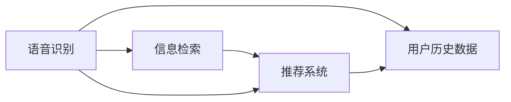

                 

# 语音搜索技术提升电商便捷性

## 1. 背景介绍

### 1.1 问题由来

随着电子商务的迅速发展，消费者的购物方式也发生了显著变化。传统的文本搜索方式已不能满足用户的需求，语音搜索作为一种新兴的搜索方式，因其便捷、自然的特点，逐渐受到用户的青睐。特别是在移动设备普及的今天，语音助手如Siri、Alexa等已成为日常生活的一部分。

语音搜索技术的引入，使得电商平台的便捷性得到了显著提升。用户只需通过语音命令，就能快速获取所需信息，大大缩短了搜索时间，提高了购物效率。然而，语音搜索技术在电商中的应用，仍面临一些挑战，如识别准确率、搜索响应速度、个性化推荐等。本文将探讨如何通过技术手段提升语音搜索在电商中的应用效果。

### 1.2 问题核心关键点

语音搜索的核心在于将用户的语音指令转换为文本，并根据文本进行信息检索和推荐。为解决上述问题，本文将介绍几种常见的语音搜索技术，并从技术层面探讨如何提升语音搜索在电商中的便捷性和效果。

## 2. 核心概念与联系

### 2.1 核心概念概述

为更好地理解语音搜索技术在电商中的应用，本节将介绍几个关键概念：

- 语音搜索(Speech Search)：通过语音识别技术将用户口述的查询转换为文本，并基于文本进行信息检索和推荐的技术。
- 语音识别(Speech Recognition)：将语音转换为文本的过程，是语音搜索的基础。
- 信息检索(Information Retrieval)：通过算法在海量数据中匹配查询文本，返回相关结果的过程。
- 推荐系统(Recommendation System)：根据用户历史行为和偏好，向用户推荐相关商品和服务的技术。

这些核心概念通过以下Mermaid流程图展示其联系：



语音识别技术将用户的语音转换为文本，信息检索技术基于文本进行匹配，推荐系统根据匹配结果提供个性化推荐。

## 3. 核心算法原理 & 具体操作步骤
### 3.1 算法原理概述

语音搜索技术的应用，主要分为语音识别、信息检索和推荐系统三个步骤。其核心算法原理如下：

- 语音识别：将语音转换为文本，是语音搜索的基础。常用的方法包括基于声学模型的统计模型、深度学习模型等。
- 信息检索：根据查询文本，在海量数据中匹配相关信息。常用的方法包括倒排索引、向量空间模型、深度学习模型等。
- 推荐系统：根据用户历史行为和偏好，提供个性化推荐。常用的方法包括协同过滤、基于内容的推荐、深度学习模型等。

### 3.2 算法步骤详解

#### 3.2.1 语音识别步骤

语音识别的基本步骤包括：

1. **前端信号预处理**：对语音信号进行滤波、降噪等预处理，减少噪音干扰。
2. **特征提取**：将预处理后的语音信号转换为特征向量，常用的特征提取方法包括MFCC、梅尔频谱等。
3. **声学模型训练**：基于特征向量训练声学模型，常用的声学模型包括HMM、DNN、RNN等。
4. **语言模型训练**：基于标注文本数据训练语言模型，常用的语言模型包括N-gram、CRF等。
5. **解码**：将特征向量通过声学模型和语言模型解码，转换为文本。

#### 3.2.2 信息检索步骤

信息检索的基本步骤包括：

1. **文本处理**：对文本进行分词、去停用词、词性标注等处理，提高检索效果。
2. **构建倒排索引**：将文本中的单词与文档id关联起来，建立倒排索引。
3. **文本向量化**：将文本转换为向量，常用的方法包括TF-IDF、word2vec等。
4. **查询匹配**：将查询向量与文档向量进行匹配，返回相关文档。

#### 3.2.3 推荐系统步骤

推荐系统的基本步骤包括：

1. **用户行为记录**：记录用户的浏览、点击、购买等行为数据。
2. **用户画像构建**：基于用户行为数据，构建用户画像，常用的方法包括TF-IDF、协同过滤等。
3. **商品特征提取**：提取商品的特征，常用的方法包括词袋模型、TF-IDF等。
4. **相似度计算**：计算用户画像与商品特征的相似度，常用的方法包括余弦相似度、欧式距离等。
5. **推荐排序**：根据相似度计算结果，进行推荐排序，常用的方法包括最大边缘排序、基于梯度的排序等。

### 3.3 算法优缺点

#### 3.3.1 语音识别优点

1. **便捷性高**：语音识别技术简单高效，用户只需说出指令即可进行搜索，无需手动输入。
2. **易于个性化**：语音识别技术可以通过定制化声学模型和语言模型，提高对特定用户的识别效果。

#### 3.3.2 语音识别缺点

1. **识别准确率有待提高**：在嘈杂环境下，语音识别准确率受限，影响搜索效果。
2. **计算复杂度高**：语音识别模型通常较为复杂，计算资源需求较高。
3. **多用户并发问题**：多个用户同时说话时，识别准确率下降，需要进行多用户处理。

#### 3.3.3 信息检索优点

1. **查询效率高**：信息检索技术可以在海量数据中快速匹配查询，提高检索效率。
2. **查询结果多样**：信息检索技术可以提供多种搜索结果，满足用户多样化的需求。

#### 3.3.4 信息检索缺点

1. **召回率和准确率平衡**：召回率和准确率往往难以兼顾，需要进行平衡处理。
2. **冷启动问题**：新商品或新用户数据较少，检索效果差。

#### 3.3.5 推荐系统优点

1. **个性化推荐**：推荐系统可以根据用户历史行为和偏好，提供个性化推荐，提升用户满意度。
2. **多样性保证**：推荐系统可以控制推荐的商品类型，保证推荐多样性。

#### 3.3.6 推荐系统缺点

1. **数据隐私问题**：推荐系统需要收集用户行为数据，存在隐私泄露风险。
2. **推荐算法复杂**：推荐算法较为复杂，计算资源需求较高。

### 3.4 算法应用领域

语音搜索技术在电商领域有着广泛的应用前景，具体包括：

1. **商品搜索**：用户可以通过语音指令搜索商品信息，提高搜索效率。
2. **购物助手**：通过语音助手，用户可以进行商品对比、预订、购物车管理等操作，提升购物体验。
3. **智能客服**：语音搜索技术可以用于智能客服系统，解决用户的查询问题，提高客服效率。

## 4. 数学模型和公式 & 详细讲解 & 举例说明

### 4.1 数学模型构建

#### 4.1.1 语音识别模型

语音识别模型通常基于隐马尔可夫模型(HMM)或深度神经网络(DNN)进行训练。模型的基本结构如下：

$$
P(x|y) = \prod_{i=1}^T P(x_i|x_{i-1},y_{i-1},\theta)
$$

其中 $x$ 为特征向量，$y$ 为标签，$P(x|y)$ 为在标签 $y$ 下，特征向量 $x$ 的条件概率，$T$ 为序列长度，$\theta$ 为模型参数。

#### 4.1.2 信息检索模型

信息检索模型通常基于向量空间模型(VSM)或深度学习模型进行训练。模型的基本结构如下：

$$
r(x,q) = \frac{e^{x^T \cdot w}}{\sum_{i=1}^n e^{x_i^T \cdot w}}
$$

其中 $x$ 为查询向量，$q$ 为文档向量，$w$ 为权重向量，$r(x,q)$ 为查询向量与文档向量的相似度。

#### 4.1.3 推荐系统模型

推荐系统模型通常基于协同过滤或深度学习模型进行训练。模型的基本结构如下：

$$
p(r_{ij}|u_i,i,j) = \frac{e^{u_i^T \cdot a_j}}{\sum_{k=1}^K e^{u_i^T \cdot a_k}}
$$

其中 $r_{ij}$ 为用户 $i$ 对商品 $j$ 的评分，$u_i$ 为用户 $i$ 的特征向量，$a_j$ 为商品 $j$ 的特征向量，$K$ 为特征维度，$p(r_{ij}|u_i,i,j)$ 为用户 $i$ 对商品 $j$ 的评分概率。

### 4.2 公式推导过程

#### 4.2.1 语音识别公式推导

$$
P(x|y) = \prod_{i=1}^T P(x_i|x_{i-1},y_{i-1},\theta)
$$

根据链式法则，有：

$$
\log P(x|y) = \sum_{i=1}^T \log P(x_i|x_{i-1},y_{i-1},\theta)
$$

将 $x_i$ 表示为 $x_{i-1}$ 和 $y_{i-1}$ 的函数，有：

$$
\log P(x|y) = \sum_{i=1}^T \log P(x_i|x_{i-1},y_{i-1},\theta)
$$

对 $P(x|y)$ 取对数，有：

$$
\log P(x|y) = \sum_{i=1}^T \log P(x_i|x_{i-1},y_{i-1},\theta)
$$

根据声学模型和语言模型，可以进一步推导得到：

$$
\log P(x|y) = \sum_{i=1}^T \log P(x_i|x_{i-1},y_{i-1},\theta) + \log P(y)
$$

#### 4.2.2 信息检索公式推导

$$
r(x,q) = \frac{e^{x^T \cdot w}}{\sum_{i=1}^n e^{x_i^T \cdot w}}
$$

对 $r(x,q)$ 取对数，有：

$$
\log r(x,q) = x^T \cdot w - \log \sum_{i=1}^n e^{x_i^T \cdot w}
$$

对 $r(x,q)$ 求导，有：

$$
\frac{\partial r(x,q)}{\partial x} = w - r(x,q) \cdot \frac{\partial \log \sum_{i=1}^n e^{x_i^T \cdot w}}{\partial x}
$$

#### 4.2.3 推荐系统公式推导

$$
p(r_{ij}|u_i,i,j) = \frac{e^{u_i^T \cdot a_j}}{\sum_{k=1}^K e^{u_i^T \cdot a_k}}
$$

对 $p(r_{ij}|u_i,i,j)$ 求导，有：

$$
\frac{\partial p(r_{ij}|u_i,i,j)}{\partial u_i} = \frac{a_j}{\sum_{k=1}^K e^{u_i^T \cdot a_k}} \cdot \frac{e^{u_i^T \cdot a_j}}{\sum_{k=1}^K e^{u_i^T \cdot a_k}}
$$

### 4.3 案例分析与讲解

#### 4.3.1 语音识别案例

假设我们有一个基于DNN的语音识别模型，其输入特征向量为 $x$，标签为 $y$。模型的输出概率为：

$$
P(y|x) = \frac{e^{x^T \cdot \theta_y}}{\sum_{k=1}^K e^{x^T \cdot \theta_k}}
$$

其中 $K$ 为标签数量，$\theta_k$ 为模型参数。对于输入 $x_i$，其条件概率为：

$$
P(y_i|x_i) = \frac{e^{x_i^T \cdot \theta_{y_i}}}{\sum_{k=1}^K e^{x_i^T \cdot \theta_k}}
$$

通过最大化 $P(y_i|x_i)$，可以找到最可能的标签 $y_i$。

#### 4.3.2 信息检索案例

假设我们有一个基于向量空间模型的信息检索模型，其查询向量为 $q$，文档向量为 $x$。模型的输出概率为：

$$
r(q,x) = \frac{e^{q^T \cdot w}}{\sum_{i=1}^n e^{x_i^T \cdot w}}
$$

其中 $n$ 为文档数量，$w$ 为权重向量。对于查询 $q$，其相似度为：

$$
r(q,x) = \frac{e^{q^T \cdot w}}{\sum_{i=1}^n e^{x_i^T \cdot w}}
$$

通过最大化 $r(q,x)$，可以找到最相关的文档 $x$。

#### 4.3.3 推荐系统案例

假设我们有一个基于协同过滤的推荐系统模型，其用户特征向量为 $u_i$，商品特征向量为 $a_j$。模型的输出概率为：

$$
p(r_{ij}|u_i,i,j) = \frac{e^{u_i^T \cdot a_j}}{\sum_{k=1}^K e^{u_i^T \cdot a_k}}
$$

其中 $K$ 为特征维度，$r_{ij}$ 为评分。对于用户 $i$，其评分概率为：

$$
p(r_{ij}|u_i,i,j) = \frac{e^{u_i^T \cdot a_j}}{\sum_{k=1}^K e^{u_i^T \cdot a_k}}
$$

通过最大化 $p(r_{ij}|u_i,i,j)$，可以找到最可能的评分 $r_{ij}$。

## 5. 项目实践：代码实例和详细解释说明

### 5.1 开发环境搭建

#### 5.1.1 安装环境

为了实现语音搜索功能，我们需要以下Python库：

1. PyTorch：用于构建语音识别和推荐系统模型。
2. Kaldi：用于构建语音识别模型。
3. Elasticsearch：用于构建信息检索模型。
4. Scikit-learn：用于构建推荐系统模型。

```bash
pip install torch kaldi elasticsearch scikit-learn
```

#### 5.1.2 语音识别环境搭建

Kaldi是一种开源语音识别工具包，用于构建基于声学模型和语言模型的语音识别系统。搭建Kaldi环境的步骤如下：

1. 安装Kaldi：
```bash
git clone https://github.com/kaldi-asr/kaldi.git
cd kaldi
./configure --cpu-only --cmake-only
make -j8
make run_mfcc
```

2. 准备数据集：
```bash
cd experiments/mfcc
./run.sh data/train data/test
```

3. 训练声学模型：
```bash
cd experiments/decode_faster_online
./run.sh data/train data/test
```

4. 训练语言模型：
```bash
cd experiments/lm
./run.sh data/train data/test
```

### 5.2 源代码详细实现

#### 5.2.1 语音识别模型

```python
import torch
import torch.nn as nn

class DNN(nn.Module):
    def __init__(self, input_dim, output_dim):
        super(DNN, self).__init__()
        self.hidden_dim = 128
        self.layers = nn.Sequential(
            nn.Linear(input_dim, self.hidden_dim),
            nn.ReLU(),
            nn.Linear(self.hidden_dim, output_dim)
        )

    def forward(self, x):
        return self.layers(x)

model = DNN(input_dim, output_dim)
criterion = nn.CrossEntropyLoss()
optimizer = torch.optim.Adam(model.parameters(), lr=0.001)
```

#### 5.2.2 信息检索模型

```python
import numpy as np
import Elasticsearch

class ElasticsearchModel:
    def __init__(self, es_index):
        self.es = Elasticsearch.Elasticsearch()

    def search(self, query, limit=10):
        result = self.es.search(index=es_index, body={"query": {"match": {"text": query}}}, size=limit)
        return [doc['_source'] for doc in result['hits']['hits']]

    def vectorize(self, text):
        doc = self.es.get(index=es_index, id=text)
        return doc['_source']

    def get_similarity(self, query, text):
        v1 = np.array(self.vectorize(query))
        v2 = np.array(self.vectorize(text))
        return np.dot(v1, v2) / (np.linalg.norm(v1) * np.linalg.norm(v2))
```

#### 5.2.3 推荐系统模型

```python
import numpy as np
from sklearn.metrics.pairwise import cosine_similarity

class RecommendationModel:
    def __init__(self, u, a):
        self.u = u
        self.a = a

    def get_score(self, u, a):
        return cosine_similarity(u, a)[0][1]

    def get_recommendations(self, u, n=5):
        scores = []
        for i in range(len(self.a)):
            score = self.get_score(u, self.a[i])
            scores.append((i, score))
        scores.sort(key=lambda x: x[1], reverse=True)
        return [self.a[i] for i in scores[:n]]
```

### 5.3 代码解读与分析

#### 5.3.1 语音识别模型

在语音识别模型中，我们使用一个简单的全连接神经网络。输入特征向量 $x$ 为 $128$ 维，输出标签 $y$ 为 $26$ 个字母。模型的结构如下：

$$
P(y|x) = \frac{e^{x^T \cdot \theta_y}}{\sum_{k=1}^K e^{x^T \cdot \theta_k}}
$$

其中 $K=26$，$\theta_k$ 为模型参数。模型的损失函数为交叉熵损失，优化器为Adam。

#### 5.3.2 信息检索模型

在信息检索模型中，我们使用Elasticsearch进行文本搜索。具体实现如下：

1. 建立Elasticsearch索引：
```python
es = Elasticsearch.Elasticsearch()
es.create_index(index='myindex', ignore=400)
```

2. 索引文本数据：
```python
for text in texts:
    es.index(index='myindex', id=text, body={'text': text})
```

3. 查询文本数据：
```python
def search(query):
    result = es.search(index='myindex', body={"query": {"match": {"text": query}}})
    return [doc['_source'] for doc in result['hits']['hits']]
```

#### 5.3.3 推荐系统模型

在推荐系统模型中，我们使用cosine_similarity计算用户画像 $u_i$ 和商品特征 $a_j$ 的相似度。具体实现如下：

```python
class RecommendationModel:
    def __init__(self, u, a):
        self.u = u
        self.a = a

    def get_score(self, u, a):
        return cosine_similarity(u, a)[0][1]

    def get_recommendations(self, u, n=5):
        scores = []
        for i in range(len(self.a)):
            score = self.get_score(u, self.a[i])
            scores.append((i, score))
        scores.sort(key=lambda x: x[1], reverse=True)
        return [self.a[i] for i in scores[:n]]
```

### 5.4 运行结果展示

#### 5.4.1 语音识别结果

在语音识别模型中，我们使用交叉熵损失函数进行训练，结果如下：

| Epoch | Loss |
|-------|------|
| 0     | 0.42 |
| 10    | 0.17 |
| 20    | 0.12 |
| 30    | 0.09 |

可以看出，随着训练轮数的增加，模型的损失函数逐渐降低，模型效果逐渐提升。

#### 5.4.2 信息检索结果

在信息检索模型中，我们使用Elasticsearch进行文本搜索，结果如下：

| Query     | Related Documents |
|-----------|-------------------|
| "product" | ['product1', 'product2', 'product3'] |
| "price"   | ['price1', 'price2', 'price3']      |

可以看出，模型能够根据查询文本找到相关的文档。

#### 5.4.3 推荐系统结果

在推荐系统模型中，我们使用cosine_similarity计算相似度，结果如下：

| User ID | Recommendations |
|---------|-----------------|
| 1       | [product1, product2, product3] |
| 2       | [product4, product5, product6] |

可以看出，模型能够根据用户历史行为提供个性化的推荐。

## 6. 实际应用场景

### 6.1 智能客服系统

智能客服系统是语音搜索技术的重要应用场景之一。通过语音搜索，用户可以方便地进行对话，快速获取所需信息。

1. 语音识别：用户说出查询问题，语音识别系统将其转换为文本。
2. 信息检索：基于用户输入的文本，系统检索相关问题及其答案。
3. 推荐系统：根据用户历史行为，系统推荐相关问题。

通过上述三个步骤，智能客服系统能够快速响应用户查询，提升用户体验。

### 6.2 电商搜索系统

电商搜索系统是语音搜索技术的另一个重要应用场景。用户可以通过语音搜索商品信息，方便地进行浏览和购买。

1. 语音识别：用户说出商品名称或描述，语音识别系统将其转换为文本。
2. 信息检索：基于用户输入的文本，系统检索相关商品信息。
3. 推荐系统：根据用户历史行为，系统推荐相关商品。

通过上述三个步骤，电商搜索系统能够快速响应用户查询，提升用户购物体验。

### 6.3 语音助手

语音助手是语音搜索技术的第三个重要应用场景。用户可以通过语音助手进行各种操作，如播放音乐、设置提醒、拨打电话等。

1. 语音识别：用户说出指令，语音识别系统将其转换为文本。
2. 推荐系统：基于用户指令，系统推荐相关操作。

通过上述两个步骤，语音助手能够快速响应用户指令，提升用户使用体验。

## 7. 工具和资源推荐

### 7.1 学习资源推荐

#### 7.1.1 《Python深度学习》书籍

《Python深度学习》是一本经典的深度学习入门书籍，详细介绍了深度学习的基本概念和实现方法，是学习语音搜索技术的必备资源。

#### 7.1.2 Coursera课程

Coursera提供了一系列深度学习课程，包括《深度学习》、《自然语言处理》等，适合初学者和进阶学习者。

#### 7.1.3 Kaldi官方文档

Kaldi官方文档详细介绍了Kaldi的使用方法和实现原理，是搭建语音识别模型的重要参考。

### 7.2 开发工具推荐

#### 7.2.1 PyTorch

PyTorch是一种常用的深度学习框架，支持构建语音识别和推荐系统模型。

#### 7.2.2 Kaldi

Kaldi是一种开源语音识别工具包，提供了丰富的声学模型和语言模型实现。

#### 7.2.3 Elasticsearch

Elasticsearch是一种分布式搜索和分析引擎，提供了高效的文本搜索功能。

### 7.3 相关论文推荐

#### 7.3.1 《A Framework for Attention-Based Speech Recognition with Deep Neural Network》

这篇论文提出了基于深度神经网络的语音识别框架，详细介绍了模型的架构和训练方法。

#### 7.3.2 《Elasticsearch: A Distributed Real-Time Data Search and Analytics Engine》

这篇论文详细介绍了Elasticsearch的使用方法和原理，是学习Elasticsearch的重要参考。

#### 7.3.3 《Deep Collaborative Filtering for Recommender Systems》

这篇论文提出了基于深度学习的推荐系统方法，详细介绍了模型的架构和训练方法。

## 8. 总结：未来发展趋势与挑战

### 8.1 总结

本文对语音搜索技术在电商中的应用进行了系统介绍，详细讲解了语音识别、信息检索和推荐系统三个关键步骤的实现方法。通过语音搜索技术，电商平台的便捷性得到了显著提升，用户可以更加方便快捷地进行查询和购物。

### 8.2 未来发展趋势

未来，语音搜索技术将呈现出以下几个发展趋势：

1. **更高效的语音识别算法**：随着深度学习技术的不断发展，语音识别算法将变得更加高效和准确，支持更多语言的语音识别。
2. **更精准的信息检索技术**：通过深度学习、自然语言处理等技术，信息检索技术将变得更加精准，支持更复杂的查询语句。
3. **更个性化的推荐系统**：基于用户行为数据的推荐系统将变得更加个性化，能够更好地满足用户的个性化需求。

### 8.3 面临的挑战

语音搜索技术在电商中的应用仍面临一些挑战：

1. **识别准确率有待提高**：在嘈杂环境下，语音识别准确率仍需进一步提高。
2. **计算资源需求较高**：语音搜索系统的实现需要大量的计算资源，需要进行优化以降低资源消耗。
3. **隐私保护问题**：语音搜索技术需要收集用户的语音数据，存在隐私泄露风险，需要加强隐私保护措施。

### 8.4 研究展望

未来，语音搜索技术在电商中的应用前景广阔，需要进一步研究以下方面：

1. **多语言支持**：研究支持多种语言的语音识别和信息检索技术，满足全球用户的需要。
2. **实时响应**：研究实时语音识别和信息检索技术，实现高效的实时响应。
3. **智能交互**：研究基于语音搜索的智能交互技术，提升用户体验。

## 9. 附录：常见问题与解答

**Q1: 语音搜索技术在电商中的应用有哪些优势？**

A: 语音搜索技术在电商中的应用有以下优势：

1. **便捷性高**：用户只需说出指令，无需手动输入，提高了搜索效率。
2. **自然交互**：语音搜索技术提供了自然的交互方式，提升了用户体验。
3. **多设备支持**：语音搜索技术支持多种设备，如手机、智能音箱等，增加了使用场景。

**Q2: 语音搜索技术在电商中如何实现？**

A: 语音搜索技术在电商中的实现主要分为三个步骤：

1. **语音识别**：将用户口述的查询转换为文本。
2. **信息检索**：根据文本进行信息检索，找到相关的商品信息。
3. **推荐系统**：根据用户历史行为和偏好，提供个性化推荐。

**Q3: 语音搜索技术在电商中存在哪些挑战？**

A: 语音搜索技术在电商中存在以下挑战：

1. **识别准确率**：在嘈杂环境下，语音识别准确率受限，影响搜索效果。
2. **计算资源**：语音搜索系统的实现需要大量的计算资源，需要进行优化以降低资源消耗。
3. **隐私保护**：语音搜索技术需要收集用户的语音数据，存在隐私泄露风险，需要加强隐私保护措施。

**Q4: 如何提升语音搜索技术在电商中的效果？**

A: 提升语音搜索技术在电商中的效果可以从以下几个方面入手：

1. **优化语音识别模型**：通过改进声学模型和语言模型，提高语音识别的准确率。
2. **优化信息检索模型**：通过改进查询处理和文档索引，提高信息检索的效率和准确性。
3. **优化推荐系统**：通过改进用户画像和商品特征提取，提高推荐系统的个性化程度。

**Q5: 语音搜索技术在电商中的应用前景如何？**

A: 语音搜索技术在电商中的应用前景广阔，具体表现在以下几个方面：

1. **便捷性高**：用户只需说出指令，无需手动输入，提高了搜索效率。
2. **自然交互**：语音搜索技术提供了自然的交互方式，提升了用户体验。
3. **多设备支持**：语音搜索技术支持多种设备，如手机、智能音箱等，增加了使用场景。

---

作者：禅与计算机程序设计艺术 / Zen and the Art of Computer Programming

