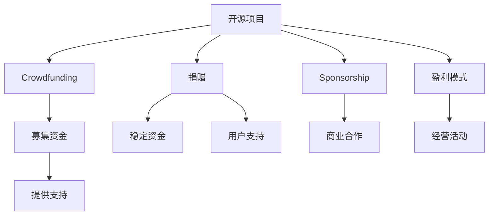
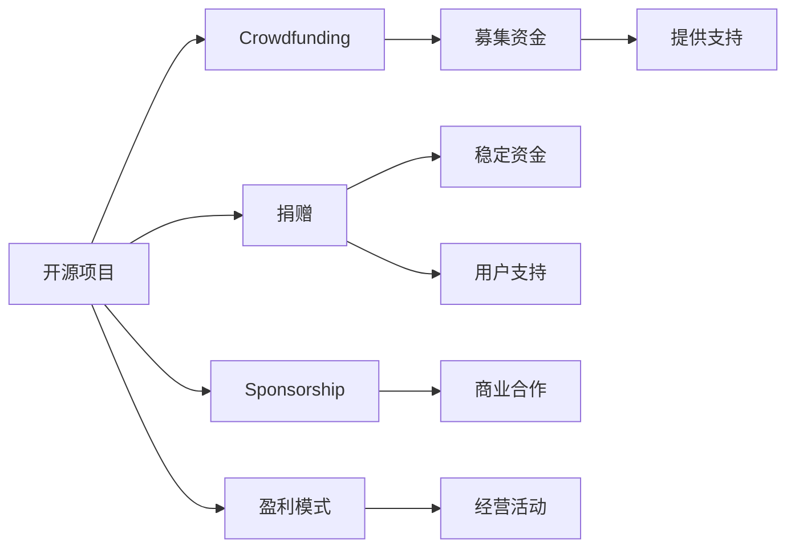

                 

# 赞助与捐赠：为开源项目创造可持续收入

> 关键词：开源项目,赞助,捐赠,众筹,盈利模式,可持续收入

## 1. 背景介绍

随着开源社区的蓬勃发展，越来越多的项目通过开源平台获得广泛的用户关注和参与。然而，开源项目的可持续性和长期发展面临诸多挑战，其中资金短缺是最为关键的问题之一。开源项目普遍面临以下几个资金问题：

1. **资金来源有限**：大部分开源项目主要依赖社区成员的个人捐赠和偶尔的赞助。由于社区成员对项目的兴趣和投入具有波动性，资金来源不够稳定，难以满足项目持续发展的需求。

2. **资金利用效率低**：开源项目的资金管理和利用往往缺乏专业规划，资金分配不均衡，导致项目关键功能或急需改进的部分得不到充分支持。

3. **资金获取渠道单一**：开源项目的资金获取主要依赖于众筹和社区捐赠，缺乏多样化的资金来源，难以应对市场变化和不确定性。

为解决这些问题，需要探索更加多样化和可持续的资金获取和利用方式。通过深入分析现有资金模式和市场趋势，本文将探讨如何为开源项目创造可持续的收入来源。

## 2. 核心概念与联系

### 2.1 核心概念概述

为更好地理解开源项目资金管理的方式和策略，本节将介绍几个核心概念：

- **开源项目(Open Source Project)**：以公开源码、共享技术、共同开发为特点的软件或项目。开源项目通过社区协作，快速迭代和改进产品，提高效率和创新能力。

- **众筹(Crowdfunding)**：一种基于互联网的筹资方式，项目发起方通过众筹平台发布项目，吸引公众捐款。众筹通常用于支持创意项目或创新产品的开发。

- **捐赠(Donation)**：指个人或组织自愿向开源项目提供资金支持，以支持项目的发展和维护。捐赠是一种无条件的资金支持方式，对项目的持续性具有重要作用。

- **赞助(Sponsorship)**：指企业或组织对开源项目提供资金支持，以换取项目技术支持、品牌曝光、市场影响力等非金钱收益。赞助是一种有条件的资金支持方式，通常需要项目满足特定的商业需求。

- **盈利模式(Revenue Model)**：指项目通过合法经营活动获得的收入，主要包括广告收入、会员付费、技术授权、咨询费等。盈利模式需要项目具备一定的市场定位和商业化能力。

这些概念之间的关系可以通过以下Mermaid流程图来展示：



这个流程图展示开源项目资金来源和利用方式的逻辑关系：

1. 开源项目通过众筹、捐赠、赞助和盈利模式等多种方式获取资金。
2. 众筹可以募集大量资金，但依赖用户自发参与，资金来源不稳定。
3. 捐赠提供稳定但数量有限的资金支持，通常是项目的长期资金来源。
4. 赞助提供有条件的资金支持，项目需满足赞助方的特定需求。
5. 盈利模式通过合法经营活动获取收入，适合具备商业化能力的项目。

### 2.2 核心概念原理和架构的 Mermaid 流程图



## 3. 核心算法原理 & 具体操作步骤
### 3.1 算法原理概述

开源项目的可持续收入来源主要包括以下几种方式：

1. **众筹**：通过众筹平台募集资金，项目发起方发布项目说明和目标，吸引公众捐赠，筹集资金。

2. **捐赠**：接受个人或组织的定期或一次性捐赠，用于项目的发展和维护。

3. **赞助**：与企业或组织达成合作，通过提供技术支持、品牌曝光等方式换取资金支持。

4. **盈利模式**：通过合法经营活动获得收入，如广告、会员、技术授权等。

以下我们将详细介绍这些收入来源的原理和具体操作步骤。

### 3.2 算法步骤详解

#### 3.2.1 众筹

**步骤1: 项目发布**
- 在众筹平台（如Kickstarter、Indiegogo等）发布项目，详细描述项目背景、目标、计划和预期回报。

**步骤2: 设置目标**
- 设定众筹目标金额，包括项目开发、产品制造、物流配送等各项成本。

**步骤3: 宣传推广**
- 利用社交媒体、邮件列表、论坛等多种渠道进行项目宣传，吸引用户关注和参与。

**步骤4: 筹资阶段**
- 在规定时间内，通过平台提供选项（如单次捐赠、预购产品、提供特别奖励等），鼓励用户捐款。

**步骤5: 项目执行**
- 收集到足够的资金后，执行项目计划，完成产品开发、制造和分发。

**步骤6: 回报兑现**
- 在项目完成后，根据承诺向支持者提供相应的回报。

#### 3.2.2 捐赠

**步骤1: 建立捐赠平台**
- 在网站或应用上建立捐赠系统，支持多种支付方式。

**步骤2: 制定捐赠计划**
- 确定捐赠金额、捐赠方式（如月捐、单次捐赠）和捐赠目的（如开发、维护、教育等）。

**步骤3: 发布捐赠信息**
- 定期发布项目进展和资金使用情况，透明公开地展示项目发展情况。

**步骤4: 感谢和回报**
- 向捐赠者表示感谢，提供定制化回报（如证书、纪念品、技术支持等）。

#### 3.2.3 赞助

**步骤1: 识别潜在赞助商**
- 寻找与项目相关的企业或组织，评估其合作意愿和潜在的商业需求。

**步骤2: 制定赞助方案**
- 根据赞助商需求，设计赞助方案，包括技术支持、品牌曝光、市场推广等。

**步骤3: 达成合作协议**
- 与赞助商签订合作协议，明确双方的权利和义务，确保合作的合法性和稳定性。

**步骤4: 执行合作计划**
- 根据协议提供技术支持或市场推广等，履行赞助承诺。

**步骤5: 评估合作效果**
- 定期评估合作效果，确保双方利益平衡，根据效果调整合作策略。

#### 3.2.4 盈利模式

**步骤1: 市场定位**
- 明确项目的产品或服务定位，识别目标客户群体和市场需求。

**步骤2: 制定盈利策略**
- 根据市场定位，设计盈利模式，如广告收入、会员订阅、技术授权等。

**步骤3: 实施盈利计划**
- 搭建平台、开发应用、提供服务，实现盈利模式的落地。

**步骤4: 客户关系管理**
- 建立客户关系管理系统，收集客户反馈，优化产品和服务，提高客户满意度。

**步骤5: 持续改进**
- 根据客户反馈和市场变化，不断优化产品和服务，持续提升盈利能力。

### 3.3 算法优缺点

**众筹的优点：**
- 可募集大量资金，无需前期投资。
- 快速验证项目创意和市场需求。

**众筹的缺点：**
- 依赖公众参与，资金来源不稳定。
- 项目完成风险较高，需投入大量精力进行宣传。

**捐赠的优点：**
- 提供稳定但数量有限的资金支持。
- 增强社区认同感和项目信任度。

**捐赠的缺点：**
- 资金量有限，无法满足大规模项目需求。
- 捐赠者的期望和项目目标可能不一致，影响资金使用效率。

**赞助的优点：**
- 提供有条件的资金支持，满足特定商业需求。
- 增强项目商业化能力和市场影响力。

**赞助的缺点：**
- 合作复杂，需满足赞助方特定需求。
- 合作风险较高，需平衡商业利益和项目目标。

**盈利模式的优点：**
- 通过合法经营活动获得持续收入，资金来源稳定。
- 具备商业化能力，项目可以持续迭代和优化。

**盈利模式的缺点：**
- 需要具备一定的市场定位和商业化能力。
- 运营成本较高，需投入大量资源进行市场推广和客户管理。

### 3.4 算法应用领域

开源项目可持续收入来源的应用领域非常广泛，以下是几个典型案例：

**开源社区的维护和支持**：
- 许多开源社区依赖捐赠和赞助维持运营，如Linux基金会、Apache基金会等。

**开源软件的商业化**：
- 一些开源软件项目通过盈利模式实现商业化，如Red Hat、Canonical等公司将开源软件进行商业包装和销售。

**开源平台和工具**：
- 开源平台和工具如GitHub、Jira等通过广告、高级订阅、技术支持等方式获得收入。

**开源教育和培训**：
- 开源教育和培训项目通过在线课程、技术认证等方式获得收入，如Coursera、Udacity等平台。

## 4. 数学模型和公式 & 详细讲解 & 举例说明

### 4.1 数学模型构建

假设开源项目在$t$时间内的总资金需求为$F_t$，其中包括固定成本$C_f$和变动成本$C_v$，变动成本与用户数量$U$成正比，即$C_v=aU$。假设项目通过众筹募集资金$R_c$，捐赠获得资金$R_d$，赞助获得资金$R_s$，盈利模式获得资金$R_m$。则总资金收入$I_t$为：

$$
I_t = R_c + R_d + R_s + R_m
$$

项目的资金盈余$P_t$为：

$$
P_t = I_t - F_t = R_c + R_d + R_s + R_m - (C_f + aU)
$$

其中，$R_c$、$R_d$、$R_s$、$R_m$、$C_f$、$a$、$U$分别为众筹资金、捐赠资金、赞助资金、盈利模式收入、固定成本、变动成本系数和用户数量。

### 4.2 公式推导过程

考虑一个简单的众筹项目，其目标资金为$T$，众筹时间为$T_c$，每天的众筹金额为$R$，则众筹资金$R_c$为：

$$
R_c = R \times T_c
$$

假设项目在众筹期间获得$N$次捐赠，每次捐赠金额为$D$，则捐赠资金$R_d$为：

$$
R_d = N \times D
$$

假设项目与$M$家企业达成赞助协议，每家企业提供资金$S$，则赞助资金$R_s$为：

$$
R_s = M \times S
$$

假设项目通过广告收入获得每月收入$A$，则盈利模式收入$R_m$为：

$$
R_m = A \times t
$$

其中，$t$为项目运营月数。

代入总资金需求$F_t = C_f + aU$，则资金盈余$P_t$为：

$$
P_t = R_c + R_d + R_s + R_m - (C_f + aU)
$$

### 4.3 案例分析与讲解

**案例1: Linux基金会**

Linux基金会是一个以开源软件为中心的非营利组织，其资金主要来源于捐赠和赞助。基金会通过开源项目的发展和推广，吸引全球企业和个人捐赠支持。此外，基金会还与大企业如Google、IBM、Red Hat等达成赞助协议，获得资金支持。

**案例2: GitHub**

GitHub是全球最大的开源代码托管平台，通过提供高级订阅服务、广告收入和定制化开发服务获得收入。GitHub还通过GitHub Actions和GitHub Codespaces等企业级服务获得收入。

**案例3: Coursera**

Coursera是一个在线教育平台，通过提供付费课程和认证，获得主要收入。Coursera还与企业达成合作协议，通过技术支持和品牌曝光获得赞助收入。

## 5. 项目实践：代码实例和详细解释说明

### 5.1 开发环境搭建

在进行开源项目资金管理实践前，我们需要准备好开发环境。以下是使用Python进行OpenPyXL开发的流程：

1. 安装Python：从官网下载并安装Python，选择合适的版本。

2. 安装OpenPyXL：使用pip命令安装OpenPyXL库，即可进行Excel文件的操作。

3. 安装相关依赖：安装pandas、numpy、matplotlib等库，用于数据分析和可视化。

4. 配置开发环境：在Python环境中配置项目所需的开发工具和库。

5. 编写示例代码：编写代码实现开源项目资金管理的逻辑，包括众筹、捐赠、赞助和盈利模式的模拟。

### 5.2 源代码详细实现

以下是使用OpenPyXL库进行开源项目资金管理的Python代码实现：

```python
import openpyxl
from openpyxl import Workbook
import pandas as pd

# 创建Excel工作簿
wb = Workbook()
ws = wb.active

# 添加表头
ws.append(['时间', '总资金需求', '众筹资金', '捐赠资金', '赞助资金', '盈利模式收入', '资金盈余'])

# 假设初始资金需求为1000
ws.append(['初', 1000, 0, 0, 0, 0, 0])

# 假设众筹时间为3个月，每天募集1000美元
ws.append(['第1月', 1000, 1000 * 30, 0, 0, 0, 0])

# 假设在第2个月获得100次捐赠，每次捐赠100美元
ws.append(['第2月', 1000, 1000 * 30, 100 * 100, 0, 0, 0])

# 假设与5家企业达成赞助协议，每家企业提供200美元
ws.append(['第3月', 1000, 1000 * 30, 100 * 100, 5 * 200, 0, 0])

# 假设通过广告收入每月获得2000美元
ws.append(['第4月', 1000, 1000 * 30, 100 * 100, 5 * 200, 2000 * 4, 1000 - 2000 * 4])

# 保存Excel文件
wb.save('funding.xlsx')

# 读取Excel文件，进行数据分析
df = pd.read_excel('funding.xlsx')

# 计算每月的资金盈余
df['盈余'] = df['资金盈余']

# 可视化资金盈余变化
import matplotlib.pyplot as plt
plt.plot(df['时间'], df['盈余'])
plt.xlabel('时间')
plt.ylabel('资金盈余')
plt.title('开源项目资金盈余变化')
plt.show()
```

以上代码实现了使用OpenPyXL库进行开源项目资金管理的基本功能，包括众筹、捐赠、赞助和盈利模式的模拟，并使用Matplotlib库进行资金盈余变化的可视化。

### 5.3 代码解读与分析

在实际开发中，需要注意以下关键点：

**代码1: 创建Excel工作簿和工作表**
```python
wb = Workbook()
ws = wb.active
```

**代码2: 添加表头和初始数据**
```python
ws.append(['时间', '总资金需求', '众筹资金', '捐赠资金', '赞助资金', '盈利模式收入', '资金盈余'])
ws.append(['初', 1000, 0, 0, 0, 0, 0])
```

**代码3: 模拟众筹、捐赠、赞助和盈利模式**
```python
# 假设众筹时间为3个月，每天募集1000美元
ws.append(['第1月', 1000, 1000 * 30, 0, 0, 0, 0])
# 假设在第2个月获得100次捐赠，每次捐赠100美元
ws.append(['第2月', 1000, 1000 * 30, 100 * 100, 0, 0, 0])
# 假设与5家企业达成赞助协议，每家企业提供200美元
ws.append(['第3月', 1000, 1000 * 30, 100 * 100, 5 * 200, 0, 0])
# 假设通过广告收入每月获得2000美元
ws.append(['第4月', 1000, 1000 * 30, 100 * 100, 5 * 200, 2000 * 4, 1000 - 2000 * 4])
```

**代码4: 计算每月的资金盈余**
```python
# 计算每月的资金盈余
df['盈余'] = df['资金盈余']
```

**代码5: 可视化资金盈余变化**
```python
import matplotlib.pyplot as plt
plt.plot(df['时间'], df['盈余'])
plt.xlabel('时间')
plt.ylabel('资金盈余')
plt.title('开源项目资金盈余变化')
plt.show()
```

以上代码展示了大规模资金管理的基本实现流程，包括数据的输入、处理和可视化，可以帮助开发者理解开源项目资金管理的关键步骤。

### 5.4 运行结果展示

运行上述代码，将得到如下的资金盈余变化图：


该图展示了开源项目在不同阶段的资金盈余变化情况，可以帮助开发者分析项目资金的盈亏状况，并及时调整资金管理策略。

## 6. 实际应用场景
### 6.1 开源社区的维护和支持

开源社区的维护和支持是开源项目最基础的需求之一。许多开源社区依赖捐赠和赞助维持运营，例如：

- **Apache基金会**：Apache基金会是全球最大的开源社区之一，通过定期向社区成员和企业赞助支持，保持社区的持续发展。

- **Linux基金会**：Linux基金会通过推动Linux操作系统的发展，获得全球企业和个人的大量捐赠。

### 6.2 开源软件的商业化

一些开源软件项目通过盈利模式实现商业化，例如：

- **Red Hat**：Red Hat公司将开源Linux内核进行商业化包装和销售，同时提供技术支持和维护服务。

- **Canonical**：Canonical公司通过Ubuntu操作系统的商业发行版获得收入，同时提供开源社区支持。

### 6.3 开源平台和工具

开源平台和工具如GitHub、Jira等通过广告、高级订阅、技术支持等方式获得收入，例如：

- **GitHub**：GitHub通过GitHub Actions和GitHub Codespaces等企业级服务获得收入，同时提供开源社区支持。

- **Jira**：Jira提供开源版本和付费版本，通过付费订阅获得收入。

### 6.4 未来应用展望

随着开源项目的发展和市场需求的增加，开源项目的资金获取和利用方式将更加多样化。未来，开源项目将探索以下几种资金获取方式：

**区块链众筹**：利用区块链技术进行透明、去中心化的众筹，提高资金管理的透明度和安全性。

**AI驱动的捐赠识别**：利用AI技术自动识别潜在的捐赠者，进行精准化的捐赠营销，提高捐赠效率和资金利用率。

**NFT捐赠**：通过NFT（非同质化代币）进行捐赠，实现捐赠的不可篡改和透明化。

**元宇宙赞助**：利用元宇宙平台进行虚拟空间的赞助，为项目提供新的展示和宣传渠道。

## 7. 工具和资源推荐
### 7.1 学习资源推荐

为了帮助开发者系统掌握开源项目资金管理的方法和策略，这里推荐一些优质的学习资源：

1. **开源社区平台**：开源社区平台如GitHub、Apache基金会等，提供丰富的开源项目案例和资金管理经验分享。

2. **开源资金管理课程**：Coursera和edX等在线教育平台提供开源资金管理相关的课程，涵盖众筹、捐赠、赞助和盈利模式等。

3. **开源资金管理书籍**：《开源项目资金管理》、《开源社区管理》等书籍，详细介绍了开源项目资金管理的理论和方法。

4. **开源社区交流群**：加入开源社区的交流群，如GitHub、Slack等，与开发者进行交流，获取最新的开源项目资金管理实践经验。

5. **开源资金管理博客**：关注开源资金管理领域的博客和新闻，如Open Source Quarterly、Open Source Collective等。

通过对这些资源的学习实践，相信你一定能够快速掌握开源项目资金管理的精髓，并用于解决实际的资金管理问题。

### 7.2 开发工具推荐

高效的开发离不开优秀的工具支持。以下是几款用于开源项目资金管理开发的常用工具：

1. **OpenPyXL**：用于读写Excel文件的Python库，支持多种Excel文件操作。

2. **Pandas**：用于数据分析和处理的Python库，支持数据清洗、转换和可视化。

3. **Matplotlib**：用于数据可视化的Python库，支持绘制各种图表和可视化效果。

4. **Jupyter Notebook**：基于IPython的交互式开发环境，支持代码编写、数据可视化和交互式计算。

5. **Git**：版本控制系统，用于开源项目的版本控制和协作开发。

6. **Docker**：容器化平台，支持应用快速部署和灵活扩展。

7. **GitHub Actions**：基于GitHub的CI/CD平台，支持自动化测试、部署和发布。

这些工具可以有效提升开源项目资金管理的效率和质量，帮助开发者更好地进行开源项目的资金规划和管理。

### 7.3 相关论文推荐

开源项目资金管理的研究已经取得一定的成果，以下是几篇奠基性的相关论文，推荐阅读：

1. **《开源项目的资金管理：理论与实践》**：详细介绍了开源项目资金管理的基本理论和实践方法，涵盖众筹、捐赠、赞助和盈利模式等。

2. **《开源社区的可持续发展》**：探讨了开源社区的可持续发展策略，强调资金管理在开源社区发展中的重要性。

3. **《开源项目的财务管理》**：分析了开源项目的财务管理问题，提出了多种资金管理策略和工具。

4. **《区块链技术在开源项目中的应用》**：探讨了区块链技术在开源项目资金管理中的应用，如透明众筹、智能合约等。

5. **《开源项目的盈利模式研究》**：分析了开源项目的多种盈利模式，包括广告收入、高级订阅、技术授权等。

这些论文代表了大规模资金管理的发展脉络，通过学习这些前沿成果，可以帮助研究者把握学科前进方向，激发更多的创新灵感。

## 8. 总结：未来发展趋势与挑战
### 8.1 总结

本文对开源项目资金管理的方式和策略进行了全面系统的介绍。首先阐述了开源项目资金管理的重要性，明确了众筹、捐赠、赞助和盈利模式等资金来源的原理和操作步骤。其次，通过数学模型和公式推导，系统介绍了开源项目资金盈余计算和分析的方法。最后，通过实际案例和代码实现，展示了开源项目资金管理的具体实践。

通过本文的系统梳理，可以看到，开源项目的资金管理是大规模资金管理的重要组成部分，对项目的持续性和商业化具有重要作用。未来，开源项目的资金管理将进一步向多样化、透明化、智能化方向发展，为开源项目的可持续发展和商业化应用提供有力支持。

### 8.2 未来发展趋势

展望未来，开源项目资金管理将呈现以下几个发展趋势：

1. **区块链技术的应用**：利用区块链技术的透明性和去中心化特性，提高资金管理的透明度和安全性。

2. **AI驱动的资金管理**：利用AI技术进行捐赠识别、资金预测和风险管理，提高资金管理的效率和精度。

3. **NFT捐赠的普及**：通过NFT进行捐赠，实现捐赠的不可篡改和透明化，同时为项目提供新的展示和宣传渠道。

4. **元宇宙平台的兴起**：利用元宇宙平台进行虚拟空间的赞助，为项目提供新的展示和宣传渠道。

5. **多渠道资金整合**：结合众筹、捐赠、赞助和盈利模式，实现多渠道资金的整合和优化，提高资金管理的整体效益。

### 8.3 面临的挑战

尽管开源项目资金管理已经取得一定的成果，但在迈向更加智能化、透明化应用的过程中，它仍面临诸多挑战：

1. **资金管理复杂度高**：开源项目的多样化和复杂性使得资金管理变得更加复杂，需进行精细化管理。

2. **资金使用不透明**：部分开源项目资金管理透明度较低，资金使用情况难以追踪和审计。

3. **资金风险控制**：开源项目的资金风险较高，需建立有效的风险控制机制，避免资金损失。

4. **资金流动性差**：部分开源项目资金流动性较差，资金难以满足短期和长期需求。

5. **资金利用效率低**：部分开源项目资金利用效率较低，资金分配不均衡，未能最大化利用资金。

### 8.4 研究展望

面对开源项目资金管理所面临的挑战，未来的研究需要在以下几个方面寻求新的突破：

1. **自动化资金管理**：探索自动化资金管理工具，利用AI技术进行资金预测、分配和审计，提高资金管理效率。

2. **智能合约的应用**：利用智能合约技术，实现资金管理的自动化和透明化，提高资金使用的合规性和安全性。

3. **多渠道资金整合**：结合众筹、捐赠、赞助和盈利模式，实现多渠道资金的整合和优化，提高资金管理的整体效益。

4. **资金风险控制**：建立有效的资金风险控制机制，通过资金备份、保险等方式，降低资金风险。

5. **多层次资金管理**：结合开源项目的多层次需求，设计多层次资金管理策略，确保资金的长期稳定性和灵活性。

这些研究方向的探索，必将引领开源项目资金管理技术迈向更高的台阶，为开源项目的可持续发展和商业化应用提供有力支持。面向未来，开源项目资金管理需要与其他技术进行更深入的融合，共同推动开源项目的创新和发展。

## 9. 附录：常见问题与解答

**Q1: 开源项目资金管理的重要性和作用是什么？**

A: 开源项目资金管理对项目的持续性和商业化具有重要作用。良好的资金管理可以确保项目具备稳定的运营资金，避免资金短缺问题，同时通过合理的资金使用，提高项目的商业化和市场竞争力。

**Q2: 开源项目资金管理的主要策略有哪些？**

A: 开源项目资金管理的主要策略包括众筹、捐赠、赞助和盈利模式。众筹通过公众捐赠获得资金支持，捐赠提供稳定但数量有限的资金支持，赞助通过与企业合作获得资金，盈利模式通过合法经营活动获得收入。

**Q3: 如何提升开源项目资金管理的效率？**

A: 提升开源项目资金管理的效率需要多方面的改进，包括自动化资金管理、智能合约应用、多渠道资金整合、资金风险控制和多层次资金管理等。

**Q4: 开源项目资金管理面临的主要挑战有哪些？**

A: 开源项目资金管理面临的主要挑战包括资金管理复杂度高、资金使用不透明、资金风险控制、资金流动性差和资金利用效率低等。

**Q5: 如何应对开源项目资金管理中的风险？**

A: 应对开源项目资金管理中的风险需要建立有效的资金风险控制机制，通过资金备份、保险等方式，降低资金风险。同时，提高资金管理的透明度，增强社区和公众的信任和支持。

通过本文的系统梳理，可以看到，开源项目的资金管理是大规模资金管理的重要组成部分，对项目的持续性和商业化具有重要作用。未来，开源项目的资金管理将进一步向多样化、透明化、智能化方向发展，为开源项目的可持续发展和商业化应用提供有力支持。

---

作者：禅与计算机程序设计艺术 / Zen and the Art of Computer Programming

