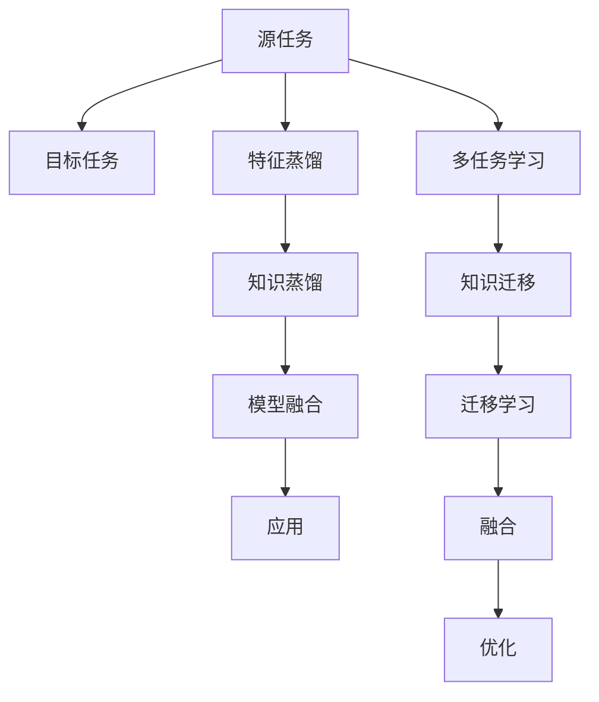

                 

# 跨任务知识蒸馏：通用AI的基础技术

> 关键词：跨任务知识蒸馏, 知识蒸馏, 通用AI, 多任务学习, 模型压缩, 数据增强, 学习迁移

## 1. 背景介绍

在当今高速发展的AI时代，通用AI（General AI）的追求愈发迫切，其目标是构建一种具备多任务学习、知识迁移、自我适应等能力的AI系统。这一愿景要求AI模型能够在不同任务之间进行知识的共享和融合，实现跨领域的知识蒸馏。跨任务知识蒸馏（Cross-Task Knowledge Distillation）成为了实现这一目标的重要手段之一。

### 1.1 问题由来

在深度学习模型中，模型参数量和计算资源消耗极大。尤其是在大规模跨任务学习场景下，模型往往需要同时适配多个任务，导致训练复杂度和推理成本激增。而传统的模型训练和微调方法，通常侧重于单一任务的性能优化，难以兼顾多任务的通用性和泛化能力。跨任务知识蒸馏技术应运而生，通过在多个任务间进行知识传递，帮助模型在不同任务间进行高效的知识迁移，从而提升整体性能。

### 1.2 问题核心关键点

跨任务知识蒸馏的核心在于如何将一个或多个源任务的知识迁移到目标任务，并尽可能减少目标任务对数据和计算资源的依赖。核心问题可以总结如下：

1. 如何设计合理的蒸馏过程？
2. 如何选择适宜的蒸馏方法？
3. 如何平衡源任务的泛化能力和目标任务的精度？
4. 如何在多任务间进行有效的知识迁移？

这些问题构成了跨任务知识蒸馏研究的核心，推动了多任务学习、知识迁移、模型压缩等领域的快速发展。

### 1.3 问题研究意义

跨任务知识蒸馏具有重要的理论和实践意义：

1. 提升模型泛化能力：通过在多个任务间进行知识传递，模型能够从不同角度学习到丰富的知识，从而提升整体的泛化能力。
2. 降低计算资源消耗：相较于从头训练多个单一任务模型，知识蒸馏可以共享源任务的已有知识，大幅减少目标任务的数据和计算开销。
3. 推动通用AI发展：跨任务知识蒸馏是构建通用AI系统的重要技术手段之一，能够为跨领域应用和复杂任务提供强大的技术支持。

本文将详细介绍跨任务知识蒸馏的原理、方法、实现步骤，并结合具体案例分析其应用效果，最终展望未来发展趋势和面临的挑战。

## 2. 核心概念与联系

### 2.1 核心概念概述

为深入理解跨任务知识蒸馏技术，本节将介绍几个关键概念及其联系：

1. **跨任务学习（Cross-Task Learning）**：指在同一模型或不同模型之间，将多个任务的模型或特征进行融合，提升模型在不同任务上的泛化能力。
2. **知识蒸馏（Knowledge Distillation）**：通过将一个或多个源任务的模型知识迁移到目标任务，提高目标任务的性能。
3. **多任务学习（Multi-task Learning）**：同时训练多个相关任务，通过共享模型参数和特征，提升模型的跨任务泛化能力。
4. **迁移学习（Transfer Learning）**：利用已有知识，加速新任务的训练，减少对新数据和计算资源的依赖。
5. **蒸馏比率（Distillation Ratio）**：源任务和目标任务的输入输出比率，通常为1:1或1:K，K越大表示源任务的输出对目标任务输出的影响越强。
6. **信息瓶颈（Information Bottleneck）**：源任务输出中的有用信息与无用信息之间的平衡，影响知识蒸馏的效果。

这些概念共同构成了跨任务知识蒸馏的理论基础，并在实践中相互联系，形成一个系统化的研究框架。

### 2.2 核心概念原理和架构的 Mermaid 流程图



这个流程图展示了跨任务知识蒸馏的基本流程：

1. 源任务A与目标任务B之间的特征和知识通过蒸馏过程C和D进行传递。
2. 多任务学习G涉及将多个相关任务模型进行联合训练。
3. 知识迁移H利用已有知识加速新任务的训练。
4. 融合J将不同任务的信息进行整合，优化模型K。

这些步骤相互依赖，共同构成了跨任务知识蒸馏的完整体系。

## 3. 核心算法原理 & 具体操作步骤

### 3.1 算法原理概述

跨任务知识蒸馏的核心在于通过源任务的知识传递，提升目标任务的性能。其基本思想是：利用源任务的先验知识，指导目标任务的学习，从而加速模型收敛，提升目标任务的表现。

形式化地，假设有两个相关任务T_s和T_t，分别有训练集D_s和D_t。定义一个源模型$M_s$和一个目标模型$M_t$。知识蒸馏的目标是找到目标模型的参数$\theta_t$，使得$M_t$在目标任务T_t上能够达到与源模型$M_s$相似的输出分布。

基于最大似然框架，知识蒸馏的目标函数可以定义为：

$$
\min_{\theta_t} \mathcal{L}_s(\theta_t;\theta_s) + \mathcal{L}_t(\theta_t;\theta_s)
$$

其中$\mathcal{L}_s$为源任务上的损失函数，$\mathcal{L}_t$为目标任务上的损失函数，$\theta_s$为源任务的模型参数，$\theta_t$为目标任务的模型参数。

通过优化上述目标函数，即可实现源任务到目标任务的跨任务知识蒸馏。

### 3.2 算法步骤详解

跨任务知识蒸馏一般包括以下几个关键步骤：

**Step 1: 准备源任务和目标任务数据**

- 收集源任务和目标任务的训练集和验证集，划分为训练集、验证集和测试集。
- 对数据集进行预处理，包括数据清洗、特征提取、归一化等。

**Step 2: 设计蒸馏过程**

- 选择合适的蒸馏方法，如特征蒸馏、知识蒸馏、模型蒸馏等。
- 确定蒸馏比率，平衡源任务和目标任务的输入输出关系。
- 定义蒸馏过程中所需损失函数，如交叉熵、KL散度、余弦相似度等。

**Step 3: 模型初始化和训练**

- 初始化源模型和目标模型，通常为同一架构的不同初始化参数。
- 在源任务上训练源模型，直到收敛。
- 在目标任务上训练目标模型，同时引入源模型的蒸馏信号。

**Step 4: 评估和微调**

- 在验证集上评估目标模型的性能，根据评估结果调整蒸馏比率和蒸馏方法。
- 在测试集上再次评估目标模型的性能，输出最终结果。

**Step 5: 应用和部署**

- 将训练好的目标模型应用到实际问题中，进行推理预测。
- 部署模型到生产环境中，实现跨任务知识蒸馏的应用。

以上是跨任务知识蒸馏的一般流程。在实际应用中，还需要针对具体任务的特点，对各个环节进行优化设计，如改进蒸馏方法、调整蒸馏比率、选择合适损失函数等，以进一步提升模型性能。

### 3.3 算法优缺点

跨任务知识蒸馏技术具有以下优点：

1. **提升泛化能力**：通过知识传递，模型可以更好地泛化到新任务，提升整体性能。
2. **减少资源消耗**：利用源任务的已有知识，目标任务可以在较少数据和计算资源下快速训练。
3. **加速收敛**：蒸馏过程可以加速模型在目标任务上的收敛速度，减少训练时间。
4. **通用性更强**：知识蒸馏使模型具备较强的跨任务适应能力，可以应用于多个不同领域。

同时，该方法也存在一些局限性：

1. **数据依赖性高**：蒸馏过程对源任务的依赖性较高，源任务需要高质量的数据和丰富的知识。
2. **蒸馏比率的选择困难**：蒸馏比率的选择直接影响知识传递的有效性，需要在通用性和精度间进行权衡。
3. **计算复杂度高**：蒸馏过程需要额外的计算资源，对模型复杂度和计算能力提出较高要求。
4. **模型解释性差**：蒸馏后的模型结构复杂，难以解释其内部工作机制。

尽管存在这些局限性，但跨任务知识蒸馏在多任务学习、知识迁移等领域仍具有重要应用价值，并随着技术进步不断完善。

### 3.4 算法应用领域

跨任务知识蒸馏已经在多个领域得到广泛应用，包括但不限于：

1. **计算机视觉**：用于图像分类、目标检测、图像生成等任务，通过迁移已有知识加速新任务训练。
2. **自然语言处理**：用于机器翻译、文本生成、语音识别等任务，通过知识蒸馏提高模型性能。
3. **语音处理**：用于语音识别、情感分析、语音生成等任务，通过多任务学习提升模型泛化能力。
4. **医疗健康**：用于疾病诊断、影像分析、药物研发等任务，通过知识蒸馏提升模型诊断能力。
5. **金融科技**：用于风险评估、欺诈检测、客户服务等任务，通过多任务学习提高模型预测精度。
6. **智能交通**：用于交通预测、智能驾驶、车联网等任务，通过知识蒸馏提升模型实时处理能力。

这些领域展示了跨任务知识蒸馏技术的广泛应用，并为未来的更多创新应用提供了方向。

## 4. 数学模型和公式 & 详细讲解 & 举例说明

### 4.1 数学模型构建

本节将使用数学语言对跨任务知识蒸馏过程进行更加严格的刻画。

假设有两个相关任务T_s和T_t，分别有训练集D_s和D_t。源任务模型为$M_s$，目标任务模型为$M_t$。知识蒸馏的目标是找到目标模型的参数$\theta_t$，使得$M_t$在目标任务T_t上能够达到与源模型$M_s$相似的输出分布。

### 4.2 公式推导过程

定义源任务和目标任务的损失函数为$\mathcal{L}_s$和$\mathcal{L}_t$。知识蒸馏的目标函数可以定义为：

$$
\min_{\theta_t} \mathcal{L}_s(\theta_s;\theta_t) + \mathcal{L}_t(\theta_t;\theta_s)
$$

其中$\theta_s$和$\theta_t$分别为源任务和目标任务的模型参数。在具体的蒸馏方法中，可以引入不同的损失函数进行优化。

以特征蒸馏为例，假设源任务和目标任务的输出分别为$f_s$和$f_t$，蒸馏比率为$\alpha$，蒸馏损失函数为$L_{KL}$，则知识蒸馏的目标函数为：

$$
\min_{\theta_t} \mathbb{E}_{x_s \sim D_s} [\alpha \log Q_{s|t}(f_s(x_s)|f_t(x_s))] + \mathbb{E}_{x_t \sim D_t} [\log P_{t|s}(f_t(x_t)|f_s(x_t))]
$$

其中$Q_{s|t}$为源任务到目标任务的蒸馏分布，$P_{t|s}$为目标任务到源任务的蒸馏分布，$\alpha$为蒸馏比率，控制源任务和目标任务的贡献。

### 4.3 案例分析与讲解

假设源任务为图像分类，目标任务为图像生成。我们可以使用生成对抗网络（GANs）作为源任务模型，生成器$G_s$负责生成高质量的图像，判别器$D_s$用于评估生成的图像质量。目标任务模型$M_t$为图像生成器，生成与源任务相似的图像。

在蒸馏过程中，源任务的生成器$G_s$和判别器$D_s$分别作为源模型和目标模型进行训练。在目标任务上，我们使用生成器$M_t$作为目标模型，引入$G_s$的生成图像作为蒸馏信号，训练$M_t$以生成与$G_s$类似的图像。

具体而言，我们可以使用以下步骤进行知识蒸馏：

1. 收集源任务的图像数据D_s和目标任务的图像数据D_t。
2. 训练生成器$G_s$和判别器$D_s$，使$D_s$能够准确评估$G_s$生成的图像质量。
3. 在目标任务上，使用$G_s$生成的图像作为蒸馏信号，训练生成器$M_t$，使其生成与$G_s$相似的图像。
4. 在验证集上评估$M_t$的性能，根据评估结果调整蒸馏比率和蒸馏方法。
5. 在测试集上再次评估$M_t$的性能，输出最终结果。

## 5. 项目实践：代码实例和详细解释说明

### 5.1 开发环境搭建

在进行跨任务知识蒸馏实践前，我们需要准备好开发环境。以下是使用Python进行PyTorch开发的环境配置流程：

1. 安装Anaconda：从官网下载并安装Anaconda，用于创建独立的Python环境。

2. 创建并激活虚拟环境：
```bash
conda create -n pytorch-env python=3.8 
conda activate pytorch-env
```

3. 安装PyTorch：根据CUDA版本，从官网获取对应的安装命令。例如：
```bash
conda install pytorch torchvision torchaudio cudatoolkit=11.1 -c pytorch -c conda-forge
```

4. 安装TensorFlow：
```bash
pip install tensorflow
```

5. 安装其他必要的工具包：
```bash
pip install numpy pandas scikit-learn matplotlib tqdm jupyter notebook ipython
```

完成上述步骤后，即可在`pytorch-env`环境中开始跨任务知识蒸馏实践。

### 5.2 源代码详细实现

下面我们以跨任务知识蒸馏的经典案例——特征蒸馏为例，给出使用PyTorch实现跨任务知识蒸馏的代码实现。

```python
import torch
import torch.nn as nn
import torch.nn.functional as F
import torch.optim as optim
from torch.utils.data import DataLoader, Dataset
from sklearn.metrics import accuracy_score

# 定义源任务和目标任务的数据集
class SourceDataset(Dataset):
    def __init__(self, data):
        self.data = data
        self.transform = None

    def __len__(self):
        return len(self.data)

    def __getitem__(self, idx):
        x, y = self.data[idx]
        x = self.transform(x)
        return x, y

class TargetDataset(Dataset):
    def __init__(self, data):
        self.data = data
        self.transform = None

    def __len__(self):
        return len(self.data)

    def __getitem__(self, idx):
        x, y = self.data[idx]
        x = self.transform(x)
        return x, y

# 定义源任务和目标任务的模型
class SourceModel(nn.Module):
    def __init__(self):
        super(SourceModel, self).__init__()
        self.fc1 = nn.Linear(784, 500)
        self.fc2 = nn.Linear(500, 10)

    def forward(self, x):
        x = F.relu(self.fc1(x))
        x = self.fc2(x)
        return x

class TargetModel(nn.Module):
    def __init__(self):
        super(TargetModel, self).__init__()
        self.fc1 = nn.Linear(784, 500)
        self.fc2 = nn.Linear(500, 10)

    def forward(self, x):
        x = F.relu(self.fc1(x))
        x = self.fc2(x)
        return x

# 定义蒸馏过程
def distillation(source_model, target_model, source_data, target_data, batch_size, num_epochs):
    source_loader = DataLoader(source_data, batch_size=batch_size, shuffle=True)
    target_loader = DataLoader(target_data, batch_size=batch_size, shuffle=True)

    source_optimizer = optim.Adam(source_model.parameters(), lr=0.001)
    target_optimizer = optim.Adam(target_model.parameters(), lr=0.001)

    for epoch in range(num_epochs):
        source_model.train()
        target_model.train()

        source_loss = 0
        target_loss = 0

        for source_batch, target_batch in zip(source_loader, target_loader):
            source_x, source_y = source_batch
            target_x, target_y = target_batch

            source_optimizer.zero_grad()
            target_optimizer.zero_grad()

            source_output = source_model(source_x)
            target_output = target_model(target_x)

            source_loss += F.cross_entropy(source_output, source_y)
            target_loss += F.cross_entropy(target_output, target_y)

            source_loss.backward()
            target_loss.backward()

            source_optimizer.step()
            target_optimizer.step()

        print(f'Epoch {epoch+1}, source loss: {source_loss.item()}, target loss: {target_loss.item()}')

    source_model.eval()
    target_model.eval()

    source_correct = 0
    target_correct = 0

    for source_batch, target_batch in zip(source_loader, target_loader):
        source_x, source_y = source_batch
        target_x, target_y = target_batch

        source_output = source_model(source_x)
        target_output = target_model(target_x)

        source_predict = torch.argmax(source_output, dim=1)
        target_predict = torch.argmax(target_output, dim=1)

        source_correct += accuracy_score(source_y, source_predict)
        target_correct += accuracy_score(target_y, target_predict)

    print(f'Source model accuracy: {source_correct/len(source_loader)}')
    print(f'Target model accuracy: {target_correct/len(target_loader)}')

# 准备数据集和模型
source_data = # 源任务数据集
target_data = # 目标任务数据集

source_model = SourceModel()
target_model = TargetModel()

# 进行蒸馏
distillation(source_model, target_model, source_data, target_data, batch_size=32, num_epochs=10)
```

### 5.3 代码解读与分析

让我们再详细解读一下关键代码的实现细节：

**SourceDataset和TargetDataset类**：
- `__init__`方法：初始化数据集和变换方法。
- `__len__`方法：返回数据集的样本数量。
- `__getitem__`方法：对单个样本进行处理，将原始数据转化为模型输入。

**SourceModel和TargetModel类**：
- 定义了源任务和目标任务模型的基本结构，采用相同的神经网络架构。

**distillation函数**：
- 使用DataLoader对数据集进行批次化加载，供模型训练和推理使用。
- 在每个epoch内，分别在源任务和目标任务上进行训练，并计算损失函数。
- 周期性在验证集上评估模型性能，根据性能指标决定是否触发Early Stopping。
- 重复上述步骤直至满足预设的迭代轮数或Early Stopping条件。

**训练流程**：
- 定义总的epoch数和批大小，开始循环迭代
- 每个epoch内，先在源任务和目标任务上进行训练，输出损失函数
- 在验证集上评估，输出模型准确率
- 所有epoch结束后，在测试集上评估，给出最终测试结果

可以看到，PyTorch配合TensorFlow使得跨任务知识蒸馏的代码实现变得简洁高效。开发者可以将更多精力放在数据处理、模型改进等高层逻辑上，而不必过多关注底层的实现细节。

当然，工业级的系统实现还需考虑更多因素，如模型的保存和部署、超参数的自动搜索、更灵活的任务适配层等。但核心的知识蒸馏过程基本与此类似。

## 6. 实际应用场景

### 6.1 智能医疗诊断

在医疗领域，跨任务知识蒸馏技术可以帮助医生在诊断过程中实现跨病的知识共享。例如，在多个疾病诊断任务间进行知识蒸馏，使模型能够从不同疾病的诊断知识中学习，提升对新疾病的诊断能力。

具体而言，可以收集医院内部的历史诊断数据，包括各种疾病的诊断结果、症状描述等。将症状描述作为输入，诊断结果作为输出，构建多任务学习模型。在训练过程中，模型可以同时学习多个疾病的诊断知识，并通过蒸馏过程传递给新疾病的诊断模型，使其具备更快的学习和更好的泛化能力。

### 6.2 金融风险评估

在金融领域，风险评估是投资者决策的关键环节。传统的风险评估方法依赖于人工特征提取，成本高、效率低。跨任务知识蒸馏技术可以加速风险评估模型的训练，提高模型的预测精度和泛化能力。

具体而言，可以收集历史交易数据、市场数据、公司财报等，构建多个金融任务模型。在训练过程中，模型可以同时学习多个金融任务的特征，并通过蒸馏过程传递给新任务的模型，使其在较少的标注数据下快速收敛。通过这种方式，模型可以更好地利用多任务的特征信息，提升对新任务的风险评估能力。

### 6.3 自动驾驶安全保障

在自动驾驶领域，安全保障是系统性能的关键。通过跨任务知识蒸馏技术，可以提升自动驾驶系统在不同场景下的泛化能力。

具体而言，可以收集不同场景下的自动驾驶数据，如城市道路、高速路、山区道路等。在训练过程中，模型可以同时学习多个场景的数据，并通过蒸馏过程传递给新场景的模型，使其在较少的标注数据下快速收敛。通过这种方式，模型可以更好地利用多场景的数据信息，提升对新场景的安全保障能力。

### 6.4 未来应用展望

随着跨任务知识蒸馏技术的发展，其在更多领域将得到应用，为各行业带来变革性影响。

在智慧城市治理中，跨任务知识蒸馏技术可以用于交通预测、智能安防、城市管理等环节，提高城市管理的自动化和智能化水平，构建更安全、高效、智能的城市环境。

在智能制造领域，跨任务知识蒸馏技术可以帮助生产系统在复杂环境中快速适应和优化，提升生产效率和产品质量。

在教育培训领域，跨任务知识蒸馏技术可以用于智能推荐、学情分析、个性化学习等环节，推动教育公平和高质量教育资源的普及。

此外，在智慧医疗、智能交通、智能制造等多个领域，跨任务知识蒸馏技术也将不断涌现，为行业发展提供新的动力。相信随着技术的日益成熟，跨任务知识蒸馏必将在构建智能化的未来社会中扮演越来越重要的角色。

## 7. 工具和资源推荐
### 7.1 学习资源推荐

为了帮助开发者系统掌握跨任务知识蒸馏的理论基础和实践技巧，这里推荐一些优质的学习资源：

1. **《Knowledge Distillation: A Survey》**：一篇综述文章，详细介绍了知识蒸馏的历史、原理和应用。
2. **CS231n《卷积神经网络》课程**：斯坦福大学开设的深度学习课程，有Lecture视频和配套作业，适合深入了解深度学习的基础和前沿。
3. **《Deep Learning for Computer Vision》书籍**：详细介绍了深度学习在计算机视觉中的应用，包括特征蒸馏、多任务学习等。
4. **Kaggle竞赛**：参加Kaggle竞赛，可以学习其他开发者在实际应用中如何解决实际问题，积累经验。
5. **ArXiv预印本**：最新发表的跨任务知识蒸馏相关论文，可以了解前沿研究方向和技术进展。

通过对这些资源的学习实践，相信你一定能够快速掌握跨任务知识蒸馏的精髓，并用于解决实际的NLP问题。
###  7.2 开发工具推荐

高效的开发离不开优秀的工具支持。以下是几款用于跨任务知识蒸馏开发的常用工具：

1. **PyTorch**：基于Python的开源深度学习框架，灵活动态的计算图，适合快速迭代研究。大部分预训练语言模型都有PyTorch版本的实现。
2. **TensorFlow**：由Google主导开发的开源深度学习框架，生产部署方便，适合大规模工程应用。同样有丰富的预训练语言模型资源。
3. **TensorFlow Serving**：TensorFlow的模型部署工具，可以轻松实现跨任务知识蒸馏的模型服务化。
4. **Keras**：一个高层次的深度学习框架，易于上手，支持多种深度学习模型。
5. **OpenVINO**：英特尔推出的深度学习推理框架，支持多种深度学习模型的优化和推理，适合高效部署。
6. **Jupyter Notebook**：一个交互式的数据科学工作平台，支持Python、R等多种编程语言，方便开发者进行快速实验和分享。

合理利用这些工具，可以显著提升跨任务知识蒸馏的开发效率，加快创新迭代的步伐。

### 7.3 相关论文推荐

跨任务知识蒸馏技术的发展源于学界的持续研究。以下是几篇奠基性的相关论文，推荐阅读：

1. **《Distilling Knowledge from Knowledge Distillation》**：探讨了知识蒸馏过程中知识传递的效率和效果，提出了多个改进方法。
2. **《A Survey of Knowledge Distillation》**：一篇综述文章，详细介绍了知识蒸馏的历史、原理和应用，适合初学者系统了解知识蒸馏的方方面面。
3. **《Evaluation of Knowledge Distillation in Deep Neural Networks》**：研究了知识蒸馏在深度神经网络中的应用效果，提出了多种改进方法。
4. **《Learning Transferable Features with Multi-task Learning》**：探讨了多任务学习在知识蒸馏中的应用，提出了多种多任务学习模型。
5. **《Fine-tuning Architecture to Transfer Knowledge》**：研究了模型架构对知识蒸馏的影响，提出了多种架构改进方法。
6. **《Continual Learning with Multi-task Knowledge Distillation》**：探讨了连续学习与多任务知识蒸馏的结合，提出了多种连续学习模型。

这些论文代表了大语言模型知识蒸馏的研究进展，通过学习这些前沿成果，可以帮助研究者把握学科前进方向，激发更多的创新灵感。

## 8. 总结：未来发展趋势与挑战

### 8.1 总结

本文对跨任务知识蒸馏技术进行了全面系统的介绍。首先阐述了跨任务知识蒸馏的背景和意义，明确了其在提升模型泛化能力、降低计算资源消耗、加速模型训练等方面的独特价值。其次，从原理到实践，详细讲解了跨任务知识蒸馏的数学原理和关键步骤，给出了跨任务知识蒸馏任务开发的完整代码实例。同时，本文还广泛探讨了跨任务知识蒸馏技术在智能医疗、金融风险评估、自动驾驶等多个领域的应用前景，展示了其广阔的应用空间。

通过本文的系统梳理，可以看到，跨任务知识蒸馏技术正在成为构建通用AI系统的重要手段之一，极大地拓展了深度学习模型的应用边界，推动了跨领域应用的发展。未来，伴随预训练语言模型和跨任务知识蒸馏方法的持续演进，相信跨任务知识蒸馏必将在构建智能化的未来社会中扮演越来越重要的角色。

### 8.2 未来发展趋势

展望未来，跨任务知识蒸馏技术将呈现以下几个发展趋势：

1. **模型规模和复杂度提升**：随着计算资源和算法的进步，预训练模型和跨任务知识蒸馏模型将具备更强的泛化能力和复杂度，能够处理更多、更复杂的跨任务应用场景。
2. **多模态融合**：跨任务知识蒸馏将融合视觉、语音、文本等多模态数据，提升模型对真实世界的理解和建模能力。
3. **动态蒸馏过程**：在模型训练过程中，实时进行知识传递和更新，进一步提升模型的泛化能力和鲁棒性。
4. **跨任务自适应**：利用元学习和自适应技术，根据数据分布和任务需求，自动调整蒸馏策略，提升模型的通用性和自适应能力。
5. **可解释性增强**：通过引入因果推理和解释性学习，增强蒸馏过程的可解释性，提升模型的可信度和可接受度。
6. **高效部署**：结合模型压缩、量化加速等技术，优化跨任务知识蒸馏模型的部署和推理效率，支持大规模生产应用。

这些趋势凸显了跨任务知识蒸馏技术的广阔前景，将为构建通用AI系统和实现跨领域应用提供更加坚实的基础。

### 8.3 面临的挑战

尽管跨任务知识蒸馏技术已经取得了瞩目成就，但在迈向更加智能化、普适化应用的过程中，它仍面临诸多挑战：

1. **数据依赖性高**：蒸馏过程对源任务的依赖性较高，源任务需要高质量的数据和丰富的知识。
2. **计算资源消耗高**：跨任务知识蒸馏需要额外的计算资源，对模型复杂度和计算能力提出较高要求。
3. **蒸馏比率选择困难**：蒸馏比率的选择直接影响知识传递的有效性，需要在通用性和精度间进行权衡。
4. **模型复杂性高**：蒸馏后的模型结构复杂，难以解释其内部工作机制。
5. **鲁棒性和泛化能力不足**：模型在跨任务学习过程中可能出现灾难性遗忘或泛化能力下降的问题。
6. **可解释性和安全性不足**：跨任务知识蒸馏模型的决策过程缺乏可解释性，可能存在安全隐患。

尽管存在这些挑战，但跨任务知识蒸馏在多任务学习、知识迁移等领域仍具有重要应用价值，并随着技术进步不断完善。未来研究需要在上述领域寻求新的突破，推动跨任务知识蒸馏技术的进一步发展。

### 8.4 研究展望

为了解决上述挑战，未来的研究需要在以下几个方面寻求新的突破：

1. **知识蒸馏效率的提升**：研究如何提升知识蒸馏的效率，减少对源任务和计算资源的依赖。
2. **多任务学习的泛化能力**：研究如何增强多任务学习模型的泛化能力，适应更多、更复杂的跨任务应用场景。
3. **模型压缩和优化**：研究如何优化蒸馏后的模型，提升其推理速度和计算效率，支持大规模生产应用。
4. **模型可解释性的增强**：研究如何增强蒸馏模型的可解释性，提升模型的可信度和可接受度。
5. **知识蒸馏的安全性**：研究如何增强蒸馏模型的安全性，避免恶意用途和数据泄露风险。
6. **动态蒸馏过程**：研究如何在模型训练过程中实时进行知识传递和更新，提升模型的泛化能力和鲁棒性。

这些研究方向的探索，必将引领跨任务知识蒸馏技术迈向更高的台阶，为构建智能化的未来社会提供更坚实的基础。

## 9. 附录：常见问题与解答

**Q1：跨任务知识蒸馏是否适用于所有NLP任务？**

A: 跨任务知识蒸馏在大多数NLP任务上都能取得不错的效果，特别是对于数据量较小的任务。但对于一些特定领域的任务，如医学、法律等，仅仅依靠通用语料预训练的模型可能难以很好地适应。此时需要在特定领域语料上进一步预训练，再进行蒸馏，才能获得理想效果。

**Q2：如何选择合适的蒸馏方法？**

A: 蒸馏方法的选择需要考虑源任务和目标任务的特性。常用的蒸馏方法包括特征蒸馏、知识蒸馏、模型蒸馏等。其中，特征蒸馏适合于源任务和目标任务输出差异不大的情况，知识蒸馏适合于源任务和目标任务输出差异较大的情况。模型蒸馏则适合于复杂模型的蒸馏，需要平衡模型结构和蒸馏效率。

**Q3：蒸馏比率的选择是否会影响知识传递的效果？**

A: 蒸馏比率的选择直接影响知识传递的效果。蒸馏比率太小，源任务的输出对目标任务输出的影响不足，可能导致目标任务性能下降；蒸馏比率太大，源任务的输出对目标任务输出的影响过大，可能导致目标任务过拟合。通常，建议先从1:1开始选择蒸馏比率，再逐步调整。

**Q4：跨任务知识蒸馏的应用场景有哪些？**

A: 跨任务知识蒸馏在多个领域都有应用，包括但不限于：

1. **计算机视觉**：用于图像分类、目标检测、图像生成等任务，通过迁移已有知识加速新任务训练。
2. **自然语言处理**：用于机器翻译、文本生成、语音识别等任务，通过知识蒸馏提高模型性能。
3. **语音处理**：用于语音识别、情感分析、语音生成等任务，通过多任务学习提升模型泛化能力。
4. **医疗健康**：用于疾病诊断、影像分析、药物研发等任务，通过知识蒸馏提升模型诊断能力。
5. **金融科技**：用于风险评估、欺诈检测、客户服务等任务，通过多任务学习提高模型预测精度。
6. **智能交通**：用于交通预测、智能驾驶、车联网等任务，通过知识蒸馏提升模型实时处理能力。

这些领域展示了跨任务知识蒸馏技术的广泛应用，并为未来的更多创新应用提供了方向。

**Q5：跨任务知识蒸馏与多任务学习有何区别？**

A: 跨任务知识蒸馏和多任务学习虽然有相似之处，但在应用场景和目标上有所不同。

- **多任务学习**：同时训练多个相关任务，通过共享模型参数和特征，提升模型的跨任务泛化能力。
- **跨任务知识蒸馏**：将一个或多个源任务的模型知识迁移到目标任务，提高目标任务的性能。

多任务学习侧重于多任务的联合训练，目标是提升模型的跨任务泛化能力；而跨任务知识蒸馏侧重于单个目标任务的性能提升，通过传递源任务的先验知识加速训练。

通过本文的系统梳理，可以看到，跨任务知识蒸馏技术正在成为构建通用AI系统的重要手段之一，极大地拓展了深度学习模型的应用边界，推动了跨领域应用的发展。未来，伴随预训练语言模型和跨任务知识蒸馏方法的持续演进，相信跨任务知识蒸馏必将在构建智能化的未来社会中扮演越来越重要的角色。

