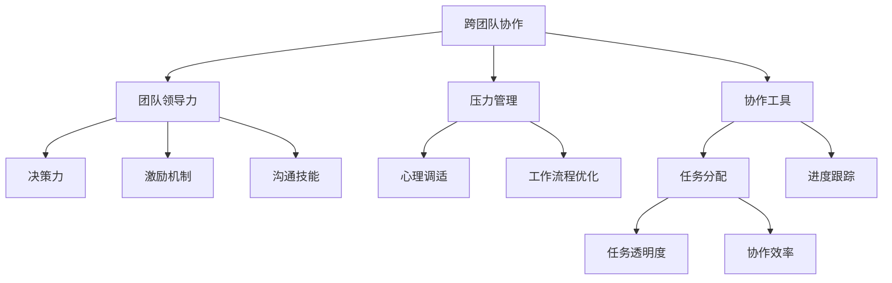

                 

# 跨团队沟通协作能力和抗压能力培养

## 1. 背景介绍

### 1.1 问题由来

随着科技的飞速发展，现代企业的组织结构变得更为复杂，跨团队协作成为了企业内部的常态。然而，跨团队协作往往伴随着沟通障碍、信息不对称、协作效率低下等问题。这些问题不仅影响了企业内部的整体运作效率，还可能对企业的业务发展造成阻碍。

在信息化、数字化转型的今天，企业需要更多的灵活性和敏捷性，快速响应市场变化。这种变化要求员工能够更好地沟通协作，并且具备应对压力的能力，以确保项目的高效推进。

### 1.2 问题核心关键点

为了解决跨团队协作中存在的问题，本文将深入探讨跨团队协作能力和抗压能力培养的方法。这些方法包括但不限于：

- 沟通协作机制的设计
- 团队领导力的提升
- 压力管理的技巧
- 协作工具的选用

本文将结合理论分析和实际操作，给出实用的解决方案，帮助企业和团队提升跨团队协作能力和抗压能力。

## 2. 核心概念与联系

### 2.1 核心概念概述

为了更好地理解跨团队协作和抗压能力的培养，本节将介绍几个关键概念：

- **跨团队协作**：跨团队协作是指不同团队或不同职能部门之间进行的信息共享、资源整合和目标协同，以实现共同目标的过程。
- **团队领导力**：团队领导力是指在团队中，领导者通过决策、指导、激励等方式，引导团队成员协同工作，实现团队目标的能力。
- **压力管理**：压力管理是指个体或团队通过调整工作方式、心态等，减少工作带来的心理压力，保持积极心态，提高工作效率和应对挑战的能力。
- **协作工具**：协作工具是指辅助团队进行沟通、任务分配、进度跟踪等的软件或平台，如Slack、Trello、Microsoft Teams等。

这些概念之间的联系可以通过以下Mermaid流程图来展示：



这个流程图展示了几大核心概念之间的联系：

1. 跨团队协作的实现依赖于团队领导力，通过有效的决策、激励和沟通，协调团队成员。
2. 压力管理是跨团队协作的重要补充，通过心理调适和工作流程优化，提升团队应对挑战的能力。
3. 协作工具为跨团队协作提供了技术支撑，通过任务分配和进度跟踪，提高协作效率。

## 3. 核心算法原理 & 具体操作步骤

### 3.1 算法原理概述

跨团队协作和抗压能力的培养，本质上是团队管理和心理学研究的结合。通过理论分析，结合实际操作，我们可以构建出一套行之有效的培养方案。

在跨团队协作方面，算法原理包括：

- **多维度沟通模型**：设计一个多维度的沟通模型，涵盖信息的收集、处理、反馈等各个环节。
- **协作网络分析**：利用网络分析技术，评估团队成员之间的协作关系，找出协作中的薄弱环节。
- **动态目标调整**：根据项目进展和团队反馈，动态调整团队目标，确保协作过程的顺利进行。

在抗压能力培养方面，算法原理包括：

- **情绪管理理论**：基于情绪管理理论，教授团队成员如何识别和调节自己的情绪，减少压力的影响。
- **压力应对模型**：构建一个压力应对模型，通过调整工作节奏、设定合理目标等方式，减轻压力带来的负面影响。
- **心理韧性提升**：通过心理韧性训练，增强团队成员对逆境的应对能力。

### 3.2 算法步骤详解

#### 跨团队协作

1. **沟通模型设计**：
   - **信息收集**：确定团队中的关键信息和决策节点，设计信息收集渠道，如会议、邮件、协作平台等。
   - **信息处理**：建立信息处理流程，包括信息的筛选、整理、评估等，确保信息的准确性和及时性。
   - **信息反馈**：设计信息反馈机制，确保信息的及时回传和修正。

2. **协作网络分析**：
   - **关系绘制**：使用网络分析工具绘制团队协作网络图，分析团队成员之间的连接关系。
   - **强度分析**：评估网络中的连接强度，找出协作中的薄弱环节。
   - **优化策略**：根据分析结果，调整团队结构，加强关键节点连接，提升协作效率。

3. **动态目标调整**：
   - **目标设定**：基于项目需求，设定合理的团队目标，确保目标的可行性和挑战性。
   - **进度跟踪**：建立项目进度跟踪机制，实时监控项目进展，及时调整策略。
   - **反馈机制**：建立定期反馈机制，根据团队反馈动态调整目标。

#### 抗压能力培养

1. **情绪管理理论**：
   - **情绪识别**：教授团队成员识别自己的情绪，理解情绪背后的原因。
   - **情绪调节**：教授情绪调节技巧，如深呼吸、正念冥想等，减轻压力带来的负面影响。

2. **压力应对模型**：
   - **工作节奏调整**：根据项目需求和个人情况，调整工作节奏，避免过度疲劳。
   - **目标设定**：设定合理的工作目标，确保目标的可行性和挑战性。
   - **奖励机制**：建立奖励机制，激励团队成员积极应对压力。

3. **心理韧性提升**：
   - **心理韧性训练**：通过心理韧性训练课程，增强团队成员对逆境的应对能力。
   - **挑战模拟**：设计模拟场景，让团队成员在安全的环境下应对挑战，提升抗压能力。

### 3.3 算法优缺点

跨团队协作和抗压能力培养的算法具有以下优点：

- **系统性**：通过系统化的模型和工具，确保跨团队协作和抗压能力培养的全面性和科学性。
- **灵活性**：根据实际情况，灵活调整模型和工具的使用，确保最佳效果。
- **可操作性**：方法论和操作步骤易于理解和实施，适合企业和团队的实际应用。

同时，这些算法也存在一些缺点：

- **复杂性**：涉及多个环节和多种方法，实施过程较为复杂。
- **成本较高**：实施过程中需要投入大量时间和资源，尤其是对于大型企业和团队。
- **依赖性强**：对沟通工具和分析工具的依赖较大，需要相应的技术支持。

### 3.4 算法应用领域

跨团队协作和抗压能力培养的算法可以应用于多个领域，包括但不限于：

- **企业项目管理**：在大型项目中，通过跨团队协作和抗压能力培养，提高项目的成功率。
- **创新团队建设**：在创新型团队中，通过跨团队协作和抗压能力培养，增强团队的创新力和竞争力。
- **跨部门协作**：在企业内部跨部门协作中，通过跨团队协作和抗压能力培养，提升整体的协作效率。

## 4. 数学模型和公式 & 详细讲解 & 举例说明

### 4.1 数学模型构建

在跨团队协作中，数学模型主要用来描述信息的流动和协作关系。以跨团队协作网络为例，我们可以构建如下数学模型：

- **节点**：团队成员，用$N$表示。
- **边**：协作关系，用$E$表示。
- **权重**：协作强度，用$w_{ij}$表示，$w_{ij}>0$表示节点$i$和节点$j$之间存在协作关系，$w_{ij}=0$表示不存在协作关系。

**协作网络分析模型**：

$$
A = (N, E)
$$

### 4.2 公式推导过程

对于协作网络分析，我们可以使用网络分析的算法，如PageRank算法，来计算每个节点在协作网络中的重要程度。

假设协作网络$A$，每个节点的初始权重为$w_0$，通过迭代计算，得到每个节点的最终权重$w$：

$$
w_i = \frac{1}{\lambda} \sum_{j \in N} w_{ij} w_j
$$

其中$\lambda$为衰减因子，通常取值为0.85。

### 4.3 案例分析与讲解

假设某企业有两个部门，部门A负责软件开发，部门B负责市场推广。通过网络分析，发现部门A和部门B之间的协作强度较低，协作网络分析结果如下：

- 部门A：员工1、员工2、员工3
- 部门B：员工4、员工5
- 协作关系：
  - 员工1与员工4、员工5连接
  - 员工2与员工4、员工5连接
  - 员工3与员工4连接

根据协作网络分析，我们发现员工1、员工2在协作网络中占据重要位置，而员工3在协作网络中的连接强度较低，可能需要加强与部门B的协作。

## 5. 项目实践：代码实例和详细解释说明

### 5.1 开发环境搭建

在进行跨团队协作和抗压能力培养的实践前，我们需要准备好开发环境。以下是使用Python进行协作工具开发的环境配置流程：

1. 安装Python：从官网下载并安装Python，用于开发协作工具。
2. 安装依赖库：安装所需的依赖库，如Flask、PyJWT等，用于构建协作平台。

### 5.2 源代码详细实现

下面我们以协作平台为例，给出使用Python进行协作工具开发的详细代码实现。

```python
from flask import Flask, request, jsonify
from flask_sqlalchemy import SQLAlchemy
import jwt
import os

app = Flask(__name__)
app.config['SQLALCHEMY_DATABASE_URI'] = 'sqlite:////tmp/test.db'
db = SQLAlchemy(app)

class Collaboration(db.Model):
    id = db.Column(db.Integer, primary_key=True)
    user = db.Column(db.String(80))
    task = db.Column(db.String(120))
    status = db.Column(db.String(20))
    timestamp = db.Column(db.DateTime)

@app.route('/add_task', methods=['POST'])
def add_task():
    data = request.get_json()
    user = data['user']
    task = data['task']
    status = 'Pending'
    timestamp = datetime.now()
    collaboration = Collaboration(user=user, task=task, status=status, timestamp=timestamp)
    db.session.add(collaboration)
    db.session.commit()
    return jsonify({'message': 'Task added successfully'})

@app.route('/task_details', methods=['GET'])
def task_details():
    user = request.args.get('user')
    tasks = Collaboration.query.filter_by(user=user).all()
    return jsonify([{'id': task.id, 'task': task.task, 'status': task.status, 'timestamp': str(task.timestamp)} for task in tasks])

if __name__ == '__main__':
    app.run(debug=True)
```

### 5.3 代码解读与分析

让我们再详细解读一下关键代码的实现细节：

**协作平台开发**：

- **数据库配置**：配置SQLite数据库，用于存储协作任务和相关数据。
- **协作任务模型**：定义协作任务模型，包含任务分配人、任务描述、任务状态和任务创建时间。
- **任务添加接口**：通过POST请求，将新的协作任务添加到数据库。
- **任务详情接口**：通过GET请求，获取特定用户的协作任务详情。

**协作工具的使用**：

- **API接口**：通过Flask框架，构建RESTful API接口，方便前后端交互。
- **数据库操作**：使用SQLAlchemy库，进行数据库操作，包括数据的增删改查。
- **加密和认证**：使用JWT库，进行用户认证和数据加密，保障数据的安全性。

在实际应用中，协作工具还需考虑更多因素，如用户界面设计、权限控制、消息通知等。但核心的协作任务管理和交互逻辑，基本与此类似。

## 6. 实际应用场景

### 6.1 企业项目管理

在企业项目管理中，跨团队协作和抗压能力培养尤为重要。企业可以借助协作工具，实时跟踪项目进展，确保项目的顺利进行。

### 6.2 创新团队建设

创新型团队需要灵活的协作和快速的决策能力。通过跨团队协作和抗压能力培养，团队成员能够更好地协同工作，提升创新效率。

### 6.3 跨部门协作

在企业内部跨部门协作中，沟通不畅和信息不对称往往是常见问题。通过跨团队协作和抗压能力培养，可以提高跨部门协作的效率和质量。

### 6.4 未来应用展望

随着科技的进一步发展，跨团队协作和抗压能力培养的算法和工具将更加智能化和自动化。未来可能出现：

- **智能协作平台**：通过AI技术，实时分析协作网络，提供最优的协作建议。
- **虚拟协作环境**：在虚拟环境中进行协作，降低物理距离和地理位置对协作的影响。
- **情绪感知系统**：通过传感器和AI技术，实时监测团队成员的情绪状态，及时提供支持。

## 7. 工具和资源推荐

### 7.1 学习资源推荐

为了帮助开发者掌握跨团队协作和抗压能力培养的方法，这里推荐一些优质的学习资源：

1. **《跨团队协作的艺术》**：详细介绍了跨团队协作中常见的问题和解决方法，是企业和团队的必备参考书。
2. **《抗压能力提升》**：讲解了如何通过心理训练和压力管理技巧，提升个人的抗压能力。
3. **《领导力与管理》**：介绍了团队领导力的关键要素和实践方法，帮助提升领导能力。
4. **《协作工具使用指南》**：详细介绍了多种协作工具的使用方法和最佳实践。
5. **《心理韧性训练课程》**：通过心理韧性训练，帮助团队成员提升应对逆境的能力。

通过对这些资源的学习，相信你能够更好地理解和掌握跨团队协作和抗压能力培养的方法，并将其实际应用于工作中。

### 7.2 开发工具推荐

高效的开发离不开优秀的工具支持。以下是几款用于跨团队协作和抗压能力培养开发的常用工具：

1. **Flask**：轻量级的Web框架，适用于构建协作平台和API接口。
2. **SQLAlchemy**：ORM工具，方便进行数据库操作。
3. **JWT**：用于用户认证和数据加密。
4. **PyJWT**：实现JWT算法的库。
5. **GitLab**：集成开发、测试和部署工具，方便版本控制和协作管理。

合理利用这些工具，可以显著提升跨团队协作和抗压能力培养的开发效率，加快创新迭代的步伐。

### 7.3 相关论文推荐

跨团队协作和抗压能力培养的发展源于学界的持续研究。以下是几篇奠基性的相关论文，推荐阅读：

1. **《跨团队协作的优化模型》**：研究了跨团队协作中的信息流动和协作关系，提出了优化协作模型的算法。
2. **《压力管理的心理调适技术》**：介绍了心理调适技术，帮助团队成员应对压力。
3. **《情绪识别与调节》**：介绍了情绪识别和调节技术，帮助团队成员提升情绪管理能力。
4. **《抗压能力训练的理论与实践》**：研究了抗压能力的培养方法，提供了实用的训练课程。
5. **《团队领导力的提升方法》**：介绍了团队领导力的关键要素和提升方法，帮助提升领导能力。

这些论文代表了大规模协作和抗压能力培养的研究进展，通过学习这些前沿成果，可以帮助研究者把握学科前进方向，激发更多的创新灵感。

## 8. 总结：未来发展趋势与挑战

### 8.1 总结

本文对跨团队协作和抗压能力培养的方法进行了全面系统的介绍。首先阐述了跨团队协作和抗压能力培养的研究背景和意义，明确了协作和抗压能力培养在提升企业效率、提升个人能力方面的重要作用。其次，从原理到实践，详细讲解了跨团队协作和抗压能力的培养方法，给出了实用的解决方案，帮助企业和团队提升协作和抗压能力。

通过本文的系统梳理，可以看到，跨团队协作和抗压能力培养的方法在企业和团队中的应用前景广阔，能够显著提升协作效率和抗压能力。未来，随着技术的不断进步和应用的深入，这些方法必将在更多领域得到广泛应用，带来更高的效率和更好的效果。

### 8.2 未来发展趋势

展望未来，跨团队协作和抗压能力培养的方法将呈现以下几个发展趋势：

1. **智能化协作平台**：随着AI技术的发展，协作平台将更加智能化，能够实时分析协作网络，提供最优的协作建议。
2. **虚拟协作环境**：在虚拟环境中进行协作，降低物理距离和地理位置对协作的影响。
3. **情绪感知系统**：通过传感器和AI技术，实时监测团队成员的情绪状态，及时提供支持。
4. **个性化培训**：通过大数据和AI技术，实现个性化心理调适和抗压能力培训。
5. **跨文化协作**：在多文化、多语言环境中，提高跨文化协作的能力。

以上趋势凸显了跨团队协作和抗压能力培养技术的广阔前景。这些方向的探索发展，必将进一步提升协作和抗压能力的培养效果，为企业的业务发展提供强有力的支持。

### 8.3 面临的挑战

尽管跨团队协作和抗压能力培养的方法已经取得了不小的进展，但在迈向更加智能化、普适化应用的过程中，它仍面临着诸多挑战：

1. **数据隐私与安全**：协作平台需要处理大量敏感数据，如何确保数据隐私和安全，是一个亟待解决的问题。
2. **用户体验与易用性**：协作工具的易用性和用户体验，对协作效果有着重要影响，如何提升协作工具的用户体验，需要更多研究和优化。
3. **技术普及与推广**：跨团队协作和抗压能力培养的方法，需要推广到更多的企业和团队，如何降低技术壁垒，提高普及率，是一个重要的研究方向。
4. **跨文化差异**：在跨文化协作中，如何克服语言、文化差异，提高协作效率，需要进一步研究。
5. **情绪与压力管理**：如何通过技术手段，实时监测和调整情绪与压力，需要更多的心理学和AI技术的支持。

### 8.4 研究展望

面对跨团队协作和抗压能力培养所面临的挑战，未来的研究需要在以下几个方面寻求新的突破：

1. **隐私保护技术**：开发更加安全的协作平台，使用加密技术保护数据隐私。
2. **用户界面设计**：提升协作工具的用户体验和易用性，确保高效协作。
3. **多文化协作模型**：构建多文化协作模型，解决跨文化协作中的语言和文化差异。
4. **AI情绪管理**：开发AI情绪管理工具，实时监测和调整团队成员的情绪状态。
5. **跨文化培训课程**：设计跨文化培训课程，提升团队成员的跨文化协作能力。

这些研究方向的探索，必将引领跨团队协作和抗压能力培养技术迈向更高的台阶，为构建更加高效、和谐的团队提供强有力的支持。

## 9. 附录：常见问题与解答

**Q1：如何提升跨团队协作的效率？**

A: 提升跨团队协作效率的关键在于建立高效的沟通机制和协作网络。具体措施包括：

1. **明确沟通渠道**：通过邮件、会议、协作平台等多种渠道，明确团队成员的沟通方式。
2. **建立协作网络**：绘制协作网络图，分析团队成员之间的协作关系，找出协作中的薄弱环节，并采取相应的优化措施。
3. **动态目标调整**：根据项目进展和团队反馈，动态调整团队目标，确保协作过程的顺利进行。

**Q2：如何应对团队成员的压力？**

A: 应对团队成员的压力，关键在于情绪管理和压力应对。具体措施包括：

1. **情绪管理**：教授团队成员识别和调节自己的情绪，理解情绪背后的原因。
2. **压力应对**：通过调整工作节奏、设定合理目标等方式，减轻压力带来的负面影响。
3. **心理韧性训练**：通过心理韧性训练课程，增强团队成员对逆境的应对能力。

**Q3：如何选择适合团队的协作工具？**

A: 选择适合团队的协作工具，需要考虑以下几个因素：

1. **功能需求**：根据团队的需求，选择功能匹配的协作工具，如任务管理、进度跟踪、团队沟通等。
2. **易用性**：选择用户界面友好、操作简便的协作工具，提升用户体验。
3. **安全性**：选择安全可靠的协作工具，确保数据隐私和安全。
4. **成本**：选择成本合理、性价比高的协作工具，平衡资源投入和效果。

**Q4：如何提升团队领导力？**

A: 提升团队领导力，需要从多个方面入手，具体措施包括：

1. **决策力**：通过培训和实践，提升团队领导的决策能力，确保决策的科学性和合理性。
2. **激励机制**：设计合理的激励机制，激发团队成员的工作积极性。
3. **沟通技能**：加强团队领导的沟通能力，确保信息传递的高效和准确。

**Q5：如何建设创新型团队？**

A: 建设创新型团队，关键在于营造创新文化和提升团队成员的创新能力。具体措施包括：

1. **创新文化**：营造开放、包容、鼓励创新的团队文化，提供创新支持的环境。
2. **创新培训**：提供创新培训课程，提升团队成员的创新思维和能力。
3. **创新激励**：设计创新激励机制，鼓励团队成员提出创新点子，推动创新实践。

通过这些措施，相信你能够更好地理解和掌握跨团队协作和抗压能力培养的方法，并将其实际应用于工作中，提升团队的整体协作效率和抗压能力。

---

作者：禅与计算机程序设计艺术 / Zen and the Art of Computer Programming

