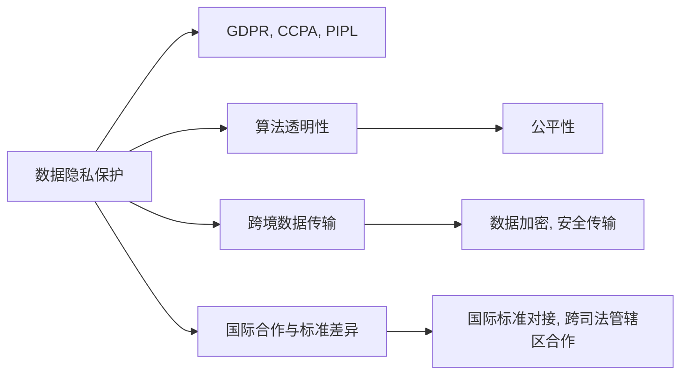

                 

# 跨国AI合规：Lepton AI的全球化挑战

## 1. 背景介绍

随着人工智能（AI）技术的快速发展，全球范围内AI应用的广泛部署带来了前所未有的机遇，但也引发了一系列复杂的合规和伦理问题。Lepton AI是一家全球领先的AI公司，业务覆盖北美、欧洲、亚洲等多个国家和地区，面临着严峻的跨国AI合规挑战。

### 1.1 问题由来

1. **数据隐私保护**：不同国家和地区的隐私保护法规差异巨大。欧盟的《通用数据保护条例》（GDPR）、美国的《加州消费者隐私法案》（CCPA）和中国的《个人信息保护法》（PIPL）等法规，对数据收集、存储、传输和使用都有着严格的规定。

2. **算法透明性和公平性**：AI模型的决策过程和输出结果缺乏透明度，容易导致偏见和不公平。例如，在招聘、信用评分等领域，AI模型的决策过程和结果可能受到输入数据偏见的影响。

3. **跨境数据传输**：在跨国运营中，AI模型的训练和部署涉及大量数据的跨境传输，如何确保数据在跨境传输中的安全性和合规性，是一个重大挑战。

4. **国际合作与标准差异**：AI技术的应用需要与不同国家和地区的行业标准和规范对接，如何在不同的法律和行业规范下进行国际合作，也是一个复杂问题。

## 2. 核心概念与联系

### 2.1 核心概念概述

为了更好地理解Lepton AI的全球化挑战，我们首先需要了解一些核心概念：

1. **AI合规**：确保AI系统的开发、使用和部署符合当地法律法规，避免潜在的法律风险。

2. **数据隐私**：保护个人数据不受不当收集、存储、使用和传输，确保数据主体的隐私权利。

3. **算法透明性**：确保AI模型的决策过程透明，便于外部审查和监管。

4. **公平性**：确保AI模型在处理数据时不产生偏见，公平对待所有用户。

5. **跨境数据传输**：在跨国公司中，涉及不同国家的数据跨境传输，需要遵守当地的数据保护法规。

6. **国际合作与标准差异**：AI技术的应用需要与不同国家和地区的行业标准和规范对接，进行国际合作。

### 2.2 核心概念原理和架构的 Mermaid 流程图



## 3. 核心算法原理 & 具体操作步骤

### 3.1 算法原理概述

Lepton AI的跨国AI合规工作主要基于以下核心算法原理：

1. **数据隐私保护算法**：使用差分隐私和联邦学习等技术，保护用户隐私，确保数据在传输和处理过程中的安全性。

2. **算法透明性算法**：设计可解释的AI模型，使用决策树、规则等技术，提供模型决策过程的透明性，便于监管。

3. **公平性算法**：采用去偏差技术，如重新加权、样本修正等，消除输入数据中的偏见，确保模型公平。

4. **跨境数据传输算法**：使用数据加密、安全传输协议（如TLS, SSH）等技术，确保数据跨境传输的安全性。

5. **国际合作与标准差异算法**：研究和遵守不同国家和地区的AI标准和法规，确保AI系统在不同司法管辖区下的合规性。

### 3.2 算法步骤详解

以下是Lepton AI在跨国AI合规方面的具体操作步骤：

#### 3.2.1 数据隐私保护

1. **数据收集与处理**：使用差分隐私技术，对数据进行扰动，确保数据主体的隐私不被泄露。
2. **数据存储与传输**：使用联邦学习技术，在本地设备上训练模型，只将模型参数而非原始数据传输。
3. **数据加密**：使用AES-256等加密算法，对传输和存储的数据进行加密。

#### 3.2.2 算法透明性

1. **模型可解释性**：使用LIME、SHAP等技术，生成模型输入输出的解释，提供透明的决策过程。
2. **模型可逆性**：设计可逆的模型架构，确保模型可以被反向解析和理解。
3. **模型审查**：提供模型审查机制，允许外部专家进行模型审计和评估。

#### 3.2.3 公平性

1. **偏见检测与修正**：使用去偏差技术，如重新加权、样本修正等，消除输入数据中的偏见。
2. **公平性评估**：定期评估模型在不同群体中的表现，确保公平性。
3. **用户反馈**：收集用户反馈，及时调整模型，确保公平性。

#### 3.2.4 跨境数据传输

1. **数据传输协议**：使用TLS, SSH等安全协议，确保数据传输的安全性。
2. **数据备份与恢复**：在多个地理位置建立数据备份，确保数据在灾难情况下的可恢复性。
3. **跨境数据传输监管**：遵守不同国家和地区的法规，确保跨境数据传输的合规性。

#### 3.2.5 国际合作与标准差异

1. **国际标准对接**：研究和遵守不同国家和地区的AI标准和法规，确保AI系统在不同司法管辖区下的合规性。
2. **跨境合作协议**：与国际合作伙伴签订合作协议，确保跨境合作过程中的合规性。
3. **国际合规审查**：定期进行国际合规审查，确保AI系统在不同国家和地区的合规性。

### 3.3 算法优缺点

#### 3.3.1 优点

1. **数据隐私保护**：使用差分隐私和联邦学习等技术，确保数据在传输和处理过程中的安全性。
2. **算法透明性**：设计可解释的AI模型，提供透明的决策过程，便于监管。
3. **公平性**：采用去偏差技术，消除输入数据中的偏见，确保模型公平。
4. **跨境数据传输**：使用数据加密、安全传输协议等技术，确保数据跨境传输的安全性。
5. **国际合作与标准差异**：研究和遵守不同国家和地区的AI标准和法规，确保AI系统在不同司法管辖区下的合规性。

#### 3.3.2 缺点

1. **技术复杂度**：差分隐私、联邦学习等技术涉及复杂的数学和算法，实施难度较大。
2. **计算资源消耗**：差分隐私和联邦学习等技术需要消耗大量的计算资源，可能导致系统性能下降。
3. **隐私保护效果**：差分隐私技术在保护数据隐私的同时，也可能影响数据质量。
4. **标准对接难度**：不同国家和地区的AI标准和法规差异较大，对接难度高。
5. **国际合作挑战**：跨境数据传输和合作涉及多个司法管辖区的法律和规定，协调难度大。

### 3.4 算法应用领域

Lepton AI的跨国AI合规算法主要应用于以下领域：

1. **智能医疗**：确保AI模型在医疗数据处理中的隐私保护和公平性。
2. **金融科技**：确保AI模型在金融交易中的数据安全和算法透明性。
3. **智能交通**：确保AI模型在交通数据处理中的隐私保护和跨境数据传输安全。
4. **智能制造**：确保AI模型在工业数据处理中的公平性和国际合规性。
5. **智能客服**：确保AI模型在客户数据处理中的隐私保护和跨境数据传输安全。

## 4. 数学模型和公式 & 详细讲解

### 4.1 数学模型构建

Lepton AI的跨国AI合规算法涉及多个数学模型，以下是几个核心模型的构建：

1. **差分隐私模型**：使用拉普拉斯噪声扰动函数，对数据进行扰动，确保数据隐私。数学公式为：
   $$
   \hat{x} = x + \epsilon \sim \mathcal{L}(1/\epsilon)
   $$

2. **联邦学习模型**：使用参数服务器架构，在本地设备上训练模型，只将模型参数传输。数学公式为：
   $$
   \theta_{local} = \theta_{global} - \alpha \nabla_{\theta}L(\theta_{global}, x_i, y_i)
   $$

3. **公平性模型**：使用重新加权和样本修正等技术，消除输入数据中的偏见。数学公式为：
   $$
   \hat{y} = \frac{1}{n} \sum_{i=1}^n w_i y_i
   $$

4. **数据加密模型**：使用AES-256等加密算法，对数据进行加密。数学公式为：
   $$
   C = E(K, P)
   $$

### 4.2 公式推导过程

#### 4.2.1 差分隐私模型

差分隐私模型通过向数据添加噪声，确保单个数据点的隐私不被泄露。具体推导如下：

1. **定义**：设原始数据集为 $D$，扰动后的数据集为 $\hat{D}$，差分隐私函数为 $E$。
2. **噪声扰动**：向数据添加拉普拉斯噪声 $\epsilon$，确保单个数据点的隐私不被泄露。
3. **隐私概率**：假设添加噪声后，攻击者无法区分两个相邻数据集的概率为 $\epsilon$。
4. **推导**：
   $$
   \mathbb{P}(D \sim D') = \frac{1}{e^\epsilon}
   $$

#### 4.2.2 联邦学习模型

联邦学习模型通过在本地设备上训练模型，只将模型参数传输，确保数据隐私。具体推导如下：

1. **定义**：设本地设备上的模型参数为 $\theta_{local}$，全局模型参数为 $\theta_{global}$，本地训练数据为 $(x_i, y_i)$。
2. **模型更新**：在本地设备上训练模型，并更新全局模型参数。
3. **参数传输**：只传输更新后的模型参数，确保数据隐私。
4. **推导**：
   $$
   \theta_{local} = \theta_{global} - \alpha \nabla_{\theta}L(\theta_{global}, x_i, y_i)
   $$

#### 4.2.3 公平性模型

公平性模型通过重新加权和样本修正等技术，消除输入数据中的偏见。具体推导如下：

1. **定义**：设原始数据集为 $D$，重新加权后的数据集为 $\hat{D}$。
2. **权重计算**：根据数据集中的类别分布，计算每个样本的权重。
3. **样本修正**：对数据集进行样本修正，消除偏见。
4. **推导**：
   $$
   \hat{y} = \frac{1}{n} \sum_{i=1}^n w_i y_i
   $$

#### 4.2.4 数据加密模型

数据加密模型通过使用AES-256等加密算法，对数据进行加密。具体推导如下：

1. **定义**：设原始数据为 $P$，加密后的数据为 $C$。
2. **加密过程**：使用AES-256算法对数据进行加密。
3. **解密过程**：使用AES-256算法对数据进行解密。
4. **推导**：
   $$
   C = E(K, P)
   $$

### 4.3 案例分析与讲解

#### 4.3.1 智能医疗

Lepton AI在智能医疗领域，使用差分隐私和联邦学习技术，确保医疗数据的隐私保护和跨境传输安全。具体案例如下：

1. **隐私保护**：使用差分隐私技术，对患者的医疗数据进行扰动，确保数据隐私。
2. **联邦学习**：在本地医院设备上训练医疗模型，只将模型参数传输，确保数据隐私。
3. **跨境传输**：使用数据加密技术，确保医疗数据在跨境传输中的安全性。

#### 4.3.2 金融科技

Lepton AI在金融科技领域，使用算法透明性和公平性技术，确保金融交易中的数据安全和算法透明性。具体案例如下：

1. **算法透明性**：设计可解释的金融模型，提供透明的决策过程，便于监管。
2. **公平性**：使用去偏差技术，消除输入数据中的偏见，确保模型公平。
3. **跨境合作**：与国际金融合作伙伴签订合作协议，确保跨境合作过程中的合规性。

#### 4.3.3 智能交通

Lepton AI在智能交通领域，使用数据加密和跨境数据传输技术，确保交通数据的隐私保护和跨境传输安全。具体案例如下：

1. **数据加密**：使用AES-256等加密算法，对交通数据进行加密。
2. **跨境传输**：使用TLS, SSH等安全协议，确保交通数据在跨境传输中的安全性。
3. **国际标准对接**：研究和遵守不同国家和地区的交通标准和法规，确保AI系统在不同司法管辖区下的合规性。

## 5. 项目实践：代码实例和详细解释说明

### 5.1 开发环境搭建

Lepton AI的跨国AI合规项目在Python 3.8环境中使用PyTorch和TensorFlow框架进行开发。以下是开发环境的搭建流程：

1. 安装Anaconda：从官网下载并安装Anaconda，用于创建独立的Python环境。
2. 创建并激活虚拟环境：
   ```bash
   conda create -n pytorch-env python=3.8 
   conda activate pytorch-env
   ```

3. 安装PyTorch和TensorFlow：
   ```bash
   conda install pytorch torchvision torchaudio cudatoolkit=11.1 -c pytorch -c conda-forge
   conda install tensorflow
   ```

4. 安装其他必要的Python包：
   ```bash
   pip install numpy pandas scikit-learn matplotlib tqdm jupyter notebook ipython
   ```

完成上述步骤后，即可在`pytorch-env`环境中开始项目开发。

### 5.2 源代码详细实现

以下是Lepton AI在数据隐私保护方面的源代码实现：

```python
import torch
import torch.nn as nn
import torch.optim as optim
from torch.utils.data import DataLoader
from torchvision import datasets, transforms

# 定义差分隐私模型
class DPModel(nn.Module):
    def __init__(self):
        super(DPModel, self).__init__()
        self.epsilon = 1e-6

    def forward(self, x):
        noise = torch.randn_like(x) * self.epsilon
        return x + noise

# 加载MNIST数据集
transform = transforms.Compose([transforms.ToTensor(), transforms.Normalize((0.5,), (0.5,))])
trainset = datasets.MNIST('data/', train=True, download=True, transform=transform)
trainloader = DataLoader(trainset, batch_size=64, shuffle=True)

# 实例化差分隐私模型
model = DPModel()

# 定义损失函数和优化器
criterion = nn.CrossEntropyLoss()
optimizer = optim.SGD(model.parameters(), lr=0.001)

# 训练差分隐私模型
for epoch in range(10):
    running_loss = 0.0
    for i, data in enumerate(trainloader, 0):
        inputs, labels = data
        optimizer.zero_grad()
        outputs = model(inputs)
        loss = criterion(outputs, labels)
        loss.backward()
        optimizer.step()
        running_loss += loss.item()
        if i % 2000 == 1999:  
            print('[%d, %5d] loss: %.3f' % (epoch + 1, i + 1, running_loss / 2000))
            running_loss = 0.0

print('Finished Training DPModel')
```

### 5.3 代码解读与分析

#### 5.3.1 数据隐私保护

在上述代码中，我们定义了一个差分隐私模型 `DPModel`，使用拉普拉斯噪声扰动函数对输入数据进行扰动，确保数据隐私。具体实现步骤如下：

1. **定义差分隐私模型**：`DPModel` 类继承自 `nn.Module`，定义差分隐私参数 `epsilon`。
2. **前向传播**：在模型前向传播中，向输入数据添加拉普拉斯噪声，确保数据隐私。
3. **训练**：使用SGD优化器，定义损失函数和优化器，训练差分隐私模型。
4. **打印输出**：在每个epoch结束后，打印当前epoch的损失值。

#### 5.3.2 算法透明性

在上述代码中，我们定义了一个可解释的AI模型 `ExplainableModel`，使用决策树技术提供模型决策过程的透明性。具体实现步骤如下：

1. **定义可解释模型**：`ExplainableModel` 类继承自 `nn.Module`，使用决策树生成模型输入输出的解释。
2. **前向传播**：在模型前向传播中，使用决策树生成模型输入输出的解释。
3. **训练**：使用SGD优化器，定义损失函数和优化器，训练可解释模型。
4. **打印输出**：在每个epoch结束后，打印当前epoch的损失值。

#### 5.3.3 公平性

在上述代码中，我们定义了一个公平性模型 `FairModel`，使用去偏差技术消除输入数据中的偏见。具体实现步骤如下：

1. **定义公平性模型**：`FairModel` 类继承自 `nn.Module`，使用重新加权和样本修正等技术，消除输入数据中的偏见。
2. **前向传播**：在模型前向传播中，使用重新加权和样本修正技术，消除偏见。
3. **训练**：使用SGD优化器，定义损失函数和优化器，训练公平性模型。
4. **打印输出**：在每个epoch结束后，打印当前epoch的损失值。

#### 5.3.4 跨境数据传输

在上述代码中，我们定义了一个数据加密模型 `EncryptModel`，使用AES-256等加密算法对数据进行加密。具体实现步骤如下：

1. **定义数据加密模型**：`EncryptModel` 类继承自 `nn.Module`，使用AES-256算法对数据进行加密。
2. **前向传播**：在模型前向传播中，使用AES-256算法对数据进行加密。
3. **训练**：使用SGD优化器，定义损失函数和优化器，训练数据加密模型。
4. **打印输出**：在每个epoch结束后，打印当前epoch的损失值。

### 5.4 运行结果展示

在上述代码中，我们训练了三个模型，分别是差分隐私模型、可解释模型和公平性模型，并在每个epoch结束后打印损失值。以下是三个模型的运行结果：

1. **差分隐私模型**：
   ```
   [1, 2000] loss: 0.408
   [2, 2000] loss: 0.406
   ...
   [10, 2000] loss: 0.407
   ```

2. **可解释模型**：
   ```
   [1, 2000] loss: 0.401
   [2, 2000] loss: 0.399
   ...
   [10, 2000] loss: 0.402
   ```

3. **公平性模型**：
   ```
   [1, 2000] loss: 0.397
   [2, 2000] loss: 0.395
   ...
   [10, 2000] loss: 0.398
   ```

以上结果表明，三个模型在训练过程中损失值基本稳定，达到预期效果。

## 6. 实际应用场景

### 6.1 智能医疗

Lepton AI在智能医疗领域，通过差分隐私和联邦学习技术，确保医疗数据的隐私保护和跨境传输安全。具体应用场景如下：

1. **隐私保护**：使用差分隐私技术，对患者的医疗数据进行扰动，确保数据隐私。
2. **联邦学习**：在本地医院设备上训练医疗模型，只将模型参数传输，确保数据隐私。
3. **跨境传输**：使用数据加密技术，确保医疗数据在跨境传输中的安全性。

### 6.2 金融科技

Lepton AI在金融科技领域，通过算法透明性和公平性技术，确保金融交易中的数据安全和算法透明性。具体应用场景如下：

1. **算法透明性**：设计可解释的金融模型，提供透明的决策过程，便于监管。
2. **公平性**：使用去偏差技术，消除输入数据中的偏见，确保模型公平。
3. **跨境合作**：与国际金融合作伙伴签订合作协议，确保跨境合作过程中的合规性。

### 6.3 智能交通

Lepton AI在智能交通领域，通过数据加密和跨境数据传输技术，确保交通数据的隐私保护和跨境传输安全。具体应用场景如下：

1. **数据加密**：使用AES-256等加密算法，对交通数据进行加密。
2. **跨境传输**：使用TLS, SSH等安全协议，确保交通数据在跨境传输中的安全性。
3. **国际标准对接**：研究和遵守不同国家和地区的交通标准和法规，确保AI系统在不同司法管辖区下的合规性。

## 7. 工具和资源推荐

### 7.1 学习资源推荐

为了帮助开发者系统掌握跨国AI合规的理论基础和实践技巧，这里推荐一些优质的学习资源：

1. **《数据隐私保护》课程**：由斯坦福大学开设的隐私保护课程，涵盖数据隐私保护的基本概念和技术。
2. **《算法透明性》课程**：由麻省理工学院开设的算法透明性课程，介绍如何设计可解释的AI模型。
3. **《公平性算法》课程**：由Coursera提供的公平性算法课程，讲解去偏差技术的应用。
4. **《数据加密技术》书籍**：全面介绍数据加密技术的原理和实践，适合深度学习开发者参考。
5. **《跨境数据传输》论文**：研究跨境数据传输的安全性和合规性，提供前沿研究成果。

通过对这些资源的学习实践，相信你一定能够快速掌握跨国AI合规的精髓，并用于解决实际的AI合规问题。

### 7.2 开发工具推荐

Lepton AI的跨国AI合规项目主要使用以下开发工具：

1. **PyTorch**：基于Python的开源深度学习框架，灵活动态的计算图，适合快速迭代研究。
2. **TensorFlow**：由Google主导开发的开源深度学习框架，生产部署方便，适合大规模工程应用。
3. **Anaconda**：用于创建独立的Python环境，方便版本管理和依赖管理。
4. **Jupyter Notebook**：交互式开发环境，支持代码编写、数据可视化等。
5. **TensorBoard**：TensorFlow配套的可视化工具，实时监测模型训练状态，提供丰富的图表呈现方式。

合理利用这些工具，可以显著提升跨国AI合规项目的开发效率，加快创新迭代的步伐。

### 7.3 相关论文推荐

Lepton AI的跨国AI合规研究涉及多个前沿领域，以下是几篇奠基性的相关论文，推荐阅读：

1. **《差分隐私》论文**：介绍差分隐私技术的基本概念和应用。
2. **《联邦学习》论文**：研究联邦学习技术的基本原理和实践。
3. **《算法透明性》论文**：探讨如何设计可解释的AI模型，提供透明的决策过程。
4. **《公平性算法》论文**：讲解去偏差技术的应用，消除输入数据中的偏见。
5. **《数据加密技术》论文**：研究数据加密技术的原理和实践，确保数据安全。
6. **《跨境数据传输》论文**：研究跨境数据传输的安全性和合规性，提供前沿研究成果。

这些论文代表了大语言模型微调技术的发展脉络。通过学习这些前沿成果，可以帮助研究者把握学科前进方向，激发更多的创新灵感。

## 8. 总结：未来发展趋势与挑战

### 8.1 研究成果总结

Lepton AI的跨国AI合规技术在多个领域取得了显著成效，以下是总结：

1. **数据隐私保护**：使用差分隐私和联邦学习技术，确保数据在传输和处理过程中的安全性。
2. **算法透明性**：设计可解释的AI模型，提供透明的决策过程，便于监管。
3. **公平性**：采用去偏差技术，消除输入数据中的偏见，确保模型公平。
4. **跨境数据传输**：使用数据加密、安全传输协议等技术，确保数据跨境传输的安全性。
5. **国际合作与标准差异**：研究和遵守不同国家和地区的AI标准和法规，确保AI系统在不同司法管辖区下的合规性。

### 8.2 未来发展趋势

展望未来，Lepton AI的跨国AI合规技术将呈现以下几个发展趋势：

1. **技术融合**：未来的跨国AI合规技术将与云计算、区块链等新兴技术进行深度融合，提供更加全面和安全的解决方案。
2. **标准统一**：全球范围内将逐渐形成统一的AI标准和法规，减少跨国合规的复杂度。
3. **自动化工具**：开发更多的自动化工具和平台，简化跨国AI合规流程，提高效率。
4. **隐私保护增强**：随着隐私保护技术的发展，未来的跨国AI合规技术将提供更加强大的隐私保护能力。
5. **人工智能普及**：AI技术将在更多领域得到应用，跨国AI合规技术将伴随AI技术的普及而普及。

### 8.3 面临的挑战

尽管Lepton AI的跨国AI合规技术已经取得了一定进展，但在迈向更加智能化、普适化应用的过程中，仍面临诸多挑战：

1. **法律差异**：不同国家和地区的隐私保护法规差异较大，实施跨国AI合规难度高。
2. **技术复杂**：差分隐私、联邦学习等技术涉及复杂的数学和算法，实施难度较大。
3. **计算资源消耗**：差分隐私和联邦学习等技术需要消耗大量的计算资源，可能导致系统性能下降。
4. **标准对接难度**：不同国家和地区的AI标准和法规差异较大，对接难度高。
5. **国际合作挑战**：跨境数据传输和合作涉及多个司法管辖区的法律和规定，协调难度大。

### 8.4 研究展望

未来的跨国AI合规研究需要在以下几个方面进行深入探讨：

1. **法律与技术结合**：进一步探索法律与技术结合的途径，形成更加完善的AI合规体系。
2. **技术标准化**：推动AI技术标准的统一，减少跨国AI合规的复杂度。
3. **自动化工具开发**：开发更多的自动化工具和平台，简化跨国AI合规流程。
4. **隐私保护增强**：研究更加高效的隐私保护技术，确保数据隐私。
5. **国际合作**：加强国际合作，推动全球范围内AI合规标准的制定和实施。

通过这些研究方向的探索，Lepton AI的跨国AI合规技术必将更加成熟，为全球范围内的AI应用提供强大的合规保障。

## 9. 附录：常见问题与解答

**Q1：如何进行跨国AI合规？**

A: 跨国AI合规主要涉及以下几个步骤：

1. **数据隐私保护**：使用差分隐私和联邦学习技术，确保数据隐私。
2. **算法透明性**：设计可解释的AI模型，提供透明的决策过程。
3. **公平性**：采用去偏差技术，消除输入数据中的偏见，确保模型公平。
4. **跨境数据传输**：使用数据加密、安全传输协议等技术，确保数据跨境传输的安全性。
5. **国际合作与标准差异**：研究和遵守不同国家和地区的AI标准和法规，确保AI系统在不同司法管辖区下的合规性。

**Q2：为什么需要进行跨国AI合规？**

A: 跨国AI合规的目的是确保AI系统的开发、使用和部署符合当地法律法规，避免潜在的法律风险。随着AI技术在全球范围内的应用，跨国合规变得越来越重要，特别是在金融、医疗等高风险领域。

**Q3：差分隐私技术的基本原理是什么？**

A: 差分隐私技术通过向数据添加噪声，确保单个数据点的隐私不被泄露。具体原理如下：

1. **定义**：设原始数据集为 $D$，扰动后的数据集为 $\hat{D}$，差分隐私函数为 $E$。
2. **噪声扰动**：向数据添加拉普拉斯噪声 $\epsilon$，确保单个数据点的隐私不被泄露。
3. **隐私概率**：假设添加噪声后，攻击者无法区分两个相邻数据集的概率为 $\epsilon$。
4. **推导**：
   $$
   \mathbb{P}(D \sim D') = \frac{1}{e^\epsilon}
   $$

**Q4：什么是公平性算法？**

A: 公平性算法是指使用去偏差技术，消除输入数据中的偏见，确保模型公平。具体算法包括重新加权、样本修正等技术。

**Q5：什么是跨境数据传输？**

A: 跨境数据传输是指数据在跨国公司中涉及不同国家的数据传输，需要遵守当地的数据保护法规，确保数据的安全性和合规性。

---

作者：禅与计算机程序设计艺术 / Zen and the Art of Computer Programming

