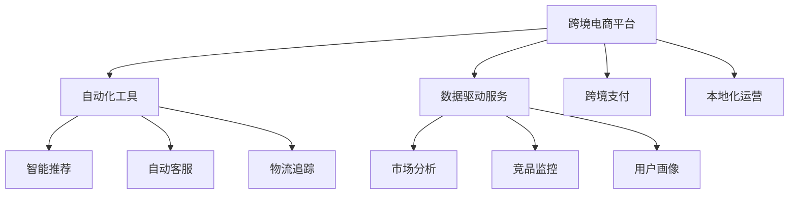

                 

## 1. 背景介绍

### 1.1 问题由来
随着全球化的深入发展，跨境电商业务在全球范围内蓬勃兴起。以亚马逊、eBay、速卖通为代表的跨境电商平台，以及阿里巴巴、Shopify等独立站模式，吸引了全球数以亿计的消费者和数百万卖家。越来越多的国内厂商利用跨境电商平台将产品销往全球市场。

然而，跨境电商业务涉及到复杂的国际贸易规则、物流配送、货币结算、文化差异等问题，加之不同国家的电商法律规定各异，导致跨境电商创业的门槛较高，风险较大。同时，由于国内厂商对于跨境电商市场的运营经验较少，在商品推广、营销策略、用户体验等方面也存在较大挑战。

为了帮助国内厂商降低跨境电商运营难度，加速业务国际化，跨境自动化创业应运而生。通过对跨境电商运营流程的自动化、智能化改造，帮助跨境电商商家降低运营成本、提升业务效率、加速市场拓展。

### 1.2 问题核心关键点
跨境自动化创业主要包括以下几个关键点：

- **跨境电商平台**：包括亚马逊、eBay、速卖通、Shopify等平台，为跨境电商商家提供交易平台、支付系统、库存管理、物流配送等基础服务。
- **自动化工具**：利用机器学习、自然语言处理、图像识别等技术，提供智能推荐、自动客服、物流追踪、广告投放等自动化工具。
- **数据驱动**：通过收集和分析跨境电商业务中的海量数据，提供市场分析、竞品监控、用户画像等数据驱动服务。
- **跨境支付**：为跨境电商商家提供跨境支付解决方案，实现便捷安全的国际结算。
- **本地化运营**：帮助商家理解不同国家和地区的市场特点和运营规则，提升本地化运营效率。

这些关键点相互支撑，共同构成跨境自动化创业的核心技术框架。通过利用这些技术手段，商家能够实现跨境电商业务的自动化、智能化和本地化，降低运营难度，提升市场竞争力。

## 2. 核心概念与联系

### 2.1 核心概念概述

为更好地理解跨境自动化创业的技术框架和关键技术，本节将介绍几个密切相关的核心概念：

- **跨境电商平台**：如亚马逊、eBay、速卖通、Shopify等，提供交易、支付、物流等基础电商服务。
- **自动化工具**：如智能推荐、自动客服、物流追踪等，利用机器学习和NLP技术提升运营效率。
- **数据驱动服务**：如市场分析、竞品监控、用户画像等，通过大数据和AI技术提供智能决策支持。
- **跨境支付**：如PayPal、Stripe、Alipay等，提供便捷安全的国际支付解决方案。
- **本地化运营**：如地区法规合规、市场文化适配等，帮助商家更好地理解运营规则，提升本地化运营效率。

这些核心概念之间的逻辑关系可以通过以下Mermaid流程图来展示：



这个流程图展示了的核心概念及其之间的关系：

1. 跨境电商平台提供基本服务。
2. 自动化工具利用机器学习和NLP技术提升运营效率。
3. 数据驱动服务通过大数据和AI技术提供决策支持。
4. 跨境支付解决国际结算问题。
5. 本地化运营帮助商家更好地适应不同国家和地区的市场。

这些概念共同构成了跨境自动化创业的技术框架，使得商家能够更好地应对跨境电商的复杂挑战，提升运营效率和市场竞争力。

## 3. 核心算法原理 & 具体操作步骤

### 3.1 算法原理概述

跨境自动化创业的核心算法原理主要集中在以下几个方面：

- **机器学习与自然语言处理**：利用机器学习算法训练智能推荐、自动客服、物流追踪等自动化工具，通过自然语言处理技术提升广告投放、商品描述等文本处理能力。
- **数据驱动决策**：通过收集和分析跨境电商业务中的海量数据，构建市场分析、竞品监控、用户画像等数据驱动服务。
- **跨境支付解决方案**：利用区块链、加密技术等构建安全便捷的跨境支付系统。
- **本地化运营策略**：通过地区法规分析、市场文化适配等手段，帮助商家理解并适应不同国家和地区的运营规则。

### 3.2 算法步骤详解

跨境自动化创业的算法步骤主要包括以下几个方面：

**Step 1: 准备跨境电商平台数据**
- 收集跨境电商平台的交易数据、用户行为数据、物流数据等，构建数据驱动服务的训练集和测试集。

**Step 2: 自动化工具的训练与部署**
- 利用机器学习算法，对收集到的数据进行训练，构建智能推荐、自动客服、物流追踪等自动化工具。
- 将训练好的模型部署到跨境电商平台，使其能够实时响应商家的运营需求。

**Step 3: 数据驱动服务的构建**
- 利用NLP技术和机器学习算法，对收集到的海量数据进行文本处理和分析，构建市场分析、竞品监控、用户画像等数据驱动服务。
- 将构建好的服务集成到商家管理后台，提供智能决策支持。

**Step 4: 跨境支付解决方案的实现**
- 利用区块链和加密技术，构建安全便捷的跨境支付系统。
- 将跨境支付系统集成到商家的电商平台，实现便捷安全的国际结算。

**Step 5: 本地化运营策略的制定**
- 分析不同国家和地区的法规、文化特点，制定适合各地区的本地化运营策略。
- 提供地区法规合规和市场文化适配服务，帮助商家更好地适应市场环境。

### 3.3 算法优缺点

跨境自动化创业的算法具有以下优点：

- **提升运营效率**：通过自动化工具和数据驱动服务，商家能够降低运营成本，提升业务效率。
- **降低运营难度**：通过本地化运营策略，商家能够更好地理解并适应不同国家和地区的运营规则，降低跨境电商的运营难度。
- **加速市场拓展**：通过智能化推荐和广告投放，商家能够精准定位目标客户，加速市场拓展。

同时，该算法也存在以下缺点：

- **依赖电商平台**：跨境自动化创业高度依赖跨境电商平台，一旦平台政策发生变化，可能会对业务产生影响。
- **数据质量要求高**：数据驱动服务的效果很大程度上取决于数据的质量和完整性，数据采集和处理成本较高。
- **技术复杂度高**：涉及机器学习、NLP、区块链等多种技术，技术实现较为复杂。

### 3.4 算法应用领域

跨境自动化创业的算法主要应用于以下几个领域：

- **智能推荐**：通过机器学习算法，对商品进行特征提取和推荐排序，提升商家商品曝光率和销售额。
- **自动客服**：利用NLP技术，构建智能客服机器人，处理商家的客户咨询和售后问题，提升客户体验。
- **物流追踪**：通过实时数据分析，跟踪物流状态，提供透明化的物流服务，提升客户满意度。
- **广告投放**：通过智能推荐和NLP技术，优化广告投放策略，提升广告投放效果和ROI。
- **市场分析**：通过收集和分析市场数据，提供市场趋势分析和竞品监控，帮助商家制定合理的市场策略。
- **用户画像**：通过用户行为数据分析，构建用户画像，指导个性化推荐和精准营销。

## 4. 数学模型和公式 & 详细讲解 & 举例说明

### 4.1 数学模型构建

本节将使用数学语言对跨境自动化创业的主要算法进行更加严格的刻画。

假设跨境电商平台有 $N$ 个商家，每个商家有 $M$ 个商品，每个商品有 $d$ 个特征。设商家 $i$ 的 $j$ 商品的特征向量为 $\mathbf{x}_{i,j} \in \mathbb{R}^d$，历史销量向量为 $\mathbf{y}_{i,j} \in \mathbb{R}$。设市场中的总销量为 $S$，商家 $i$ 的总销量为 $s_i$。构建市场分析模型的目标是最小化模型误差：

$$
\min_{\theta} \frac{1}{S} \sum_{i=1}^N \sum_{j=1}^M \Vert \mathbf{y}_{i,j} - \mathbf{x}_{i,j} \theta \Vert^2
$$

其中 $\theta$ 为模型参数，$\Vert \cdot \Vert$ 为范数。

### 4.2 公式推导过程

以下我们以智能推荐算法为例，推导推荐模型及推荐公式的数学推导过程。

假设智能推荐模型为线性回归模型：

$$
\hat{y}_{i,j} = \mathbf{x}_{i,j}^T \theta
$$

其中 $\hat{y}_{i,j}$ 为模型预测的商品销量。将历史销量数据代入模型，构建均方误差损失函数：

$$
\ell(\theta) = \frac{1}{S} \sum_{i=1}^N \sum_{j=1}^M (\mathbf{y}_{i,j} - \mathbf{x}_{i,j}^T \theta)^2
$$

利用梯度下降算法，求解损失函数最小化：

$$
\frac{\partial \ell(\theta)}{\partial \theta} = \frac{1}{S} \sum_{i=1}^N \sum_{j=1}^M 2 (\mathbf{y}_{i,j} - \mathbf{x}_{i,j}^T \theta) \mathbf{x}_{i,j}
$$

求解上述梯度方程，得到模型参数的更新公式：

$$
\theta \leftarrow \theta - \eta \frac{1}{S} \sum_{i=1}^N \sum_{j=1}^M 2 (\mathbf{y}_{i,j} - \mathbf{x}_{i,j}^T \theta) \mathbf{x}_{i,j}
$$

其中 $\eta$ 为学习率。通过迭代计算，逐步优化模型参数 $\theta$，直至收敛。

### 4.3 案例分析与讲解

假设某跨境电商平台上有 $N=100$ 个商家，每个商家有 $M=1000$ 个商品。平台的历史销量数据 $S=1000000$ 条。利用上述算法，训练智能推荐模型。

设商家 $i$ 的 $j$ 商品的特征向量 $\mathbf{x}_{i,j} \in \mathbb{R}^d$ 为：

$$
\mathbf{x}_{i,j} = \begin{bmatrix} x_{i,j,1} \\ x_{i,j,2} \\ \vdots \\ x_{i,j,d} \end{bmatrix}
$$

其中 $x_{i,j,k}$ 为第 $i$ 个商家第 $j$ 个商品的 $k$ 个特征。

设历史销量向量 $\mathbf{y}_{i,j} \in \mathbb{R}$ 为：

$$
\mathbf{y}_{i,j} = y_{i,j}
$$

其中 $y_{i,j}$ 为第 $i$ 个商家第 $j$ 个商品的历史销量。

根据上述数据和模型，可以计算推荐模型参数 $\theta$：

$$
\theta \leftarrow \theta - \eta \frac{1}{S} \sum_{i=1}^N \sum_{j=1}^M 2 (\mathbf{y}_{i,j} - \mathbf{x}_{i,j}^T \theta) \mathbf{x}_{i,j}
$$

通过迭代计算，逐步优化模型参数 $\theta$，直至收敛。得到最终的智能推荐模型。

## 5. 项目实践：代码实例和详细解释说明

### 5.1 开发环境搭建

在进行跨境自动化创业的算法实践前，我们需要准备好开发环境。以下是使用Python进行TensorFlow开发的环境配置流程：

1. 安装Anaconda：从官网下载并安装Anaconda，用于创建独立的Python环境。

2. 创建并激活虚拟环境：
```bash
conda create -n tf-env python=3.8 
conda activate tf-env
```

3. 安装TensorFlow：根据CUDA版本，从官网获取对应的安装命令。例如：
```bash
conda install tensorflow==2.3
```

4. 安装各类工具包：
```bash
pip install numpy pandas scikit-learn matplotlib tqdm jupyter notebook ipython
```

完成上述步骤后，即可在`tf-env`环境中开始算法实践。

### 5.2 源代码详细实现

下面我们以智能推荐算法为例，给出使用TensorFlow进行跨境自动化创业的PyTorch代码实现。

首先，定义智能推荐模型的输入输出：

```python
import tensorflow as tf
from tensorflow.keras import layers, models

# 定义特征输入层
input_layer = layers.DenseFeatures(input_shape=(d,), name='input_layer')

# 定义线性回归层
linear_layer = layers.Dense(units=1, name='linear_layer')

# 定义模型
model = models.Sequential([
    input_layer,
    linear_layer
])
```

然后，定义模型和优化器：

```python
# 训练集数据
train_data = ...
train_labels = ...

# 定义损失函数
loss = tf.keras.losses.MeanSquaredError()

# 定义优化器
optimizer = tf.keras.optimizers.Adam(learning_rate=0.01)
```

接着，定义训练和评估函数：

```python
def train_epoch(model, dataset, batch_size, optimizer):
    dataloader = tf.data.Dataset.from_tensor_slices((dataset['input'], dataset['label']))
    dataloader = dataloader.shuffle(buffer_size=1024).batch(batch_size)
    model.compile(optimizer=optimizer, loss=loss)
    model.fit(dataloader, epochs=10, verbose=1)

def evaluate(model, dataset, batch_size):
    dataloader = tf.data.Dataset.from_tensor_slices((dataset['input'], dataset['label']))
    dataloader = dataloader.shuffle(buffer_size=1024).batch(batch_size)
    model.evaluate(dataloader)
```

最后，启动训练流程并在测试集上评估：

```python
epochs = 10
batch_size = 16

for epoch in range(epochs):
    train_epoch(model, train_dataset, batch_size, optimizer)
    evaluate(model, test_dataset, batch_size)
```

以上就是使用TensorFlow进行智能推荐算法的完整代码实现。可以看到，利用TensorFlow，算法实现变得简洁高效。

### 5.3 代码解读与分析

让我们再详细解读一下关键代码的实现细节：

**train_epoch函数**：
- 利用TensorFlow的DataLoader从训练集中按批次读取数据。
- 使用Sequential模型进行前向传播和反向传播，更新模型参数。
- 迭代多个epoch，输出训练过程中的损失值。

**evaluate函数**：
- 使用TensorFlow的DataLoader从测试集中按批次读取数据。
- 使用Sequential模型进行前向传播，计算模型在测试集上的损失值。
- 输出测试结果。

**训练流程**：
- 定义总的epoch数和batch size，开始循环迭代
- 每个epoch内，先在训练集上训练，输出损失值
- 在测试集上评估，输出测试结果

可以看到，TensorFlow提供了强大的工具支持，使得算法实现变得简单易懂，易于调试和优化。

## 6. 实际应用场景

### 6.1 智能推荐系统

跨境自动化创业的核心应用场景之一是智能推荐系统。智能推荐系统能够根据用户的历史行为和偏好，推荐用户可能感兴趣的商品，提升用户体验和转化率。

具体而言，商家可以通过收集用户浏览、购买、评分等行为数据，构建用户画像和行为序列。利用智能推荐算法，预测用户对不同商品的兴趣程度，实现个性化推荐。智能推荐系统通常采用协同过滤、内容推荐、深度学习等技术，提升推荐精度和用户满意度。

### 6.2 自动客服系统

跨境自动化创业的另一个核心应用场景是自动客服系统。自动客服系统能够处理商家的客户咨询和售后问题，提升客户体验和商家效率。

具体而言，商家可以利用NLP技术，训练自动客服机器人。通过自然语言理解技术，自动客服机器人能够理解客户咨询内容，并给出相应的回答或解决方案。自动客服系统通常采用语音识别、对话管理、情感分析等技术，实现全天候客户服务。

### 6.3 物流追踪系统

跨境自动化创业的第三个核心应用场景是物流追踪系统。物流追踪系统能够实时跟踪商品的物流状态，提供透明化的物流服务，提升客户满意度。

具体而言，商家可以利用GPS和物联网技术，实时获取物流数据。通过数据分析和可视化，物流追踪系统能够显示商品的实时位置和运输状态，方便客户查询和追踪。物流追踪系统通常采用大数据分析和可视化技术，提升物流透明度和客户满意度。

## 7. 工具和资源推荐

### 7.1 学习资源推荐

为了帮助开发者系统掌握跨境自动化创业的理论基础和实践技巧，这里推荐一些优质的学习资源：

1. 《深度学习》系列课程：斯坦福大学开设的深度学习课程，涵盖机器学习、深度学习、自然语言处理等内容，适合初学者入门。

2. 《机器学习实战》书籍：实用性的机器学习实战指南，涵盖机器学习算法、TensorFlow等工具的使用。

3. 《Python机器学习》书籍：实用的Python机器学习教程，涵盖机器学习算法、数据处理、模型训练等内容。

4. TensorFlow官方文档：TensorFlow的官方文档，提供详尽的API文档和代码示例，适合深入学习和开发。

5. Kaggle竞赛平台：数据科学和机器学习竞赛平台，提供大量数据集和挑战，适合练习和提升技能。

通过对这些资源的学习实践，相信你一定能够快速掌握跨境自动化创业的精髓，并用于解决实际的跨境电商问题。

### 7.2 开发工具推荐

高效的开发离不开优秀的工具支持。以下是几款用于跨境自动化创业的常用工具：

1. TensorFlow：基于Python的开源深度学习框架，灵活动态的计算图，适合快速迭代研究。TensorFlow的Keras API使用简便，适合构建复杂模型。

2. PyTorch：基于Python的开源深度学习框架，动态计算图，适合研究新算法和新模型。PyTorch的自动微分和优化器库TensorBoard功能强大，适合调试和可视化。

3. Jupyter Notebook：交互式数据科学工作环境，支持Python、R、Julia等多种语言，适合快速原型开发和实验。

4. Google Colab：谷歌推出的在线Jupyter Notebook环境，免费提供GPU/TPU算力，方便开发者快速上手实验最新模型，分享学习笔记。

合理利用这些工具，可以显著提升跨境自动化创业的开发效率，加快创新迭代的步伐。

### 7.3 相关论文推荐

跨境自动化创业的研究源于学界的持续研究。以下是几篇奠基性的相关论文，推荐阅读：

1. 《深度学习》一书：深度学习领域的经典著作，涵盖深度学习的基本概念、算法和应用。

2. 《机器学习实战》一书：实用性的机器学习实战指南，涵盖机器学习算法、TensorFlow等工具的使用。

3. 《TensorFlow官方文档》：TensorFlow的官方文档，提供详尽的API文档和代码示例，适合深入学习和开发。

4. 《机器学习与数据挖掘》一书：机器学习与数据挖掘领域的经典教材，涵盖机器学习算法、数据处理等内容。

5. 《Kaggle竞赛平台》：数据科学和机器学习竞赛平台，提供大量数据集和挑战，适合练习和提升技能。

这些论文代表了大语言模型微调技术的发展脉络。通过学习这些前沿成果，可以帮助研究者把握学科前进方向，激发更多的创新灵感。

## 8. 总结：未来发展趋势与挑战

### 8.1 总结

本文对跨境自动化创业的算法进行全面系统的介绍。首先阐述了跨境自动化创业的研究背景和意义，明确了智能推荐、自动客服、物流追踪等核心技术对跨境电商运营的重大影响。其次，从原理到实践，详细讲解了机器学习、NLP、物流追踪等核心算法的数学原理和关键步骤，给出了跨境自动化创业的完整代码实例。同时，本文还广泛探讨了智能推荐系统、自动客服系统、物流追踪系统等核心技术在跨境电商领域的应用前景，展示了跨境自动化创业的巨大潜力。此外，本文精选了跨境自动化创业的各类学习资源，力求为读者提供全方位的技术指引。

通过本文的系统梳理，可以看到，跨境自动化创业的算法已经在跨境电商领域广泛应用，显著提升了商家运营效率和客户体验。未来，伴随算法的进一步演进和跨境电商市场的持续增长，跨境自动化创业必将在更广阔的应用领域大放异彩。

### 8.2 未来发展趋势

展望未来，跨境自动化创业的算法将呈现以下几个发展趋势：

1. **智能推荐算法的多样化**：未来的智能推荐算法将更加多样化，融合深度学习、协同过滤、内容推荐等多种技术，提升推荐精度和个性化程度。

2. **自动客服系统的智能化**：未来的自动客服系统将更加智能化，利用NLP技术提升自然语言理解和对话管理能力，实现更高效、更自然的客户服务。

3. **物流追踪系统的实时化**：未来的物流追踪系统将更加实时化，利用物联网技术和数据分析技术，实现实时物流状态监测和可视化。

4. **跨境支付系统的安全性**：未来的跨境支付系统将更加安全，利用区块链和加密技术，保障跨境支付的安全性和可靠性。

5. **本地化运营策略的精细化**：未来的本地化运营策略将更加精细化，利用地区法规分析和市场文化适配技术，提升商家在各地区的运营效率。

6. **跨境电商平台的平台化**：未来的跨境电商平台将更加平台化，提供更全面的电商服务，降低商家的跨境电商运营难度。

以上趋势凸显了跨境自动化创业的广阔前景。这些方向的探索发展，必将进一步提升跨境电商系统的性能和应用范围，为跨境电商市场带来更高效、更智能、更便捷的体验。

### 8.3 面临的挑战

尽管跨境自动化创业的算法已经取得了瞩目成就，但在迈向更加智能化、普适化应用的过程中，它仍面临着诸多挑战：

1. **数据获取的困难**：跨境电商市场涉及多国市场，数据获取和处理成本较高，数据质量和多样性不足。

2. **算法复杂度高**：跨境自动化创业的算法涉及机器学习、NLP、物流追踪等多种技术，算法实现复杂。

3. **用户隐私保护**：跨境电商市场涉及多国用户，用户隐私保护问题较为复杂，数据安全和隐私保护问题需妥善解决。

4. **法规合规问题**：跨境电商市场涉及多国法规，法规合规问题较为复杂，需确保算法的合法合规性。

5. **技术落地难度**：跨境自动化创业的技术实现较为复杂，技术落地难度较大。

6. **本地化运营挑战**：不同国家和地区的市场特点和文化差异较大，本地化运营挑战较大。

正视跨境自动化创业面临的这些挑战，积极应对并寻求突破，将是大规模跨境电商自动化发展的必由之路。相信随着学界和产业界的共同努力，这些挑战终将一一被克服，跨境自动化创业必将在构建人机协同的智能时代中扮演越来越重要的角色。

### 8.4 研究展望

面对跨境自动化创业所面临的种种挑战，未来的研究需要在以下几个方面寻求新的突破：

1. **数据获取和处理**：优化数据采集和处理流程，提升数据质量和多样性，降低数据获取成本。

2. **算法优化**：开发更加高效、易用的算法框架，降低算法实现难度。

3. **用户隐私保护**：引入隐私保护技术，如差分隐私、联邦学习等，保障用户隐私安全。

4. **法规合规**：建立法规合规审查机制，确保算法的合法合规性。

5. **本地化运营**：引入本地化运营策略，提升商家在各地区的运营效率。

6. **跨境电商平台**：构建更全面的跨境电商平台，提供更便捷的跨境电商服务。

这些研究方向的探索，必将引领跨境自动化创业技术迈向更高的台阶，为跨境电商市场带来更高效、更智能、更便捷的体验。面向未来，跨境自动化创业技术还需要与其他人工智能技术进行更深入的融合，如知识表示、因果推理、强化学习等，多路径协同发力，共同推动跨境电商市场的进步。只有勇于创新、敢于突破，才能不断拓展跨境自动化创业的边界，让跨境电商市场实现规模化、智能化和全球化发展。

