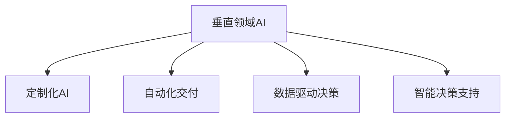

                 

# 跨行业AI解决方案：Lepton AI的垂直领域拓展

> 关键词：跨行业AI, Lepton AI, 垂直领域, 定制化AI, 自动化, 数据驱动, 智能决策, 企业转型

## 1. 背景介绍

### 1.1 问题由来

近年来，人工智能(AI)技术的迅猛发展，使得各行各业纷纷探索将AI技术引入自身领域，以期提升效率、降低成本、增强竞争力。然而，由于行业特性各异，现有的AI技术往往无法直接应用到各个垂直领域中。此外，AI技术的部署和应用也面临诸多挑战，如数据获取成本高、模型定制化需求高、业务场景复杂等。因此，开发适用于不同行业场景的AI解决方案，成为当前AI产业的重要课题。

### 1.2 问题核心关键点

Lepton AI的核心理念是：通过高度定制化的AI解决方案，帮助各行业客户构建以AI为核心的新业务模式，实现数字化转型和智能化升级。其核心关键点包括：

- 垂直领域定制化：针对不同行业特性和需求，设计定制化的AI解决方案。
- 自动化交付：通过标准化的模型开发流程和工具，实现AI解决方案的快速交付。
- 数据驱动决策：结合行业数据和业务场景，通过数据驱动的方式优化AI模型。
- 智能决策支持：构建基于AI的智能决策系统，辅助企业做出高效、准确的决策。
- 长期伙伴关系：与客户建立长期合作关系，持续优化AI解决方案，确保其适应行业变化。

这些关键点共同构成了Lepton AI的核心优势，使其在垂直领域AI解决方案中脱颖而出。

## 2. 核心概念与联系

### 2.1 核心概念概述

为更好地理解Lepton AI的垂直领域拓展策略，本节将介绍几个密切相关的核心概念：

- 垂直领域AI：针对特定行业或业务场景定制的AI解决方案，具备行业特定的知识和逻辑。
- 定制化AI：根据客户需求量身定制的AI模型和系统，避免通用AI技术在特定场景下的不适应。
- 自动化交付：通过标准化的流程和工具，实现AI模型和系统的快速部署和迭代。
- 数据驱动决策：利用行业数据和业务知识，优化AI模型参数，提升决策效果。
- 智能决策支持：构建基于AI的智能决策系统，辅助企业管理层做出高效决策。

这些概念之间的逻辑关系可以通过以下Mermaid流程图来展示：



这个流程图展示了一些核心概念及其之间的关系：

1. 垂直领域AI通过行业特定的知识，构建定制化的AI模型和系统。
2. 定制化AI进一步提升了模型的行业适应性和效果。
3. 自动化交付使得AI解决方案可以快速部署和迭代，缩短业务落地周期。
4. 数据驱动决策通过行业数据优化模型，提升AI决策的准确性和有效性。
5. 智能决策支持进一步提升了AI系统的应用深度，助力企业实现智能化管理。

这些概念共同构成了Lepton AI的垂直领域拓展策略，使其能够有效应对不同行业的应用需求，推动AI技术的深度落地。

## 3. 核心算法原理 & 具体操作步骤
### 3.1 算法原理概述

Lepton AI的垂直领域拓展，本质上是一个深度定制化的AI模型开发和部署过程。其核心思想是：根据行业特性和需求，设计特定领域的AI模型，并结合数据驱动和自动化交付的方法，实现高效、精准的AI解决方案。

形式化地，假设特定垂直领域 $D$ 的AI模型为 $M_D$，其参数为 $\theta$。在模型训练过程中，需要收集该领域的标注数据 $D=\{(x_i, y_i)\}_{i=1}^N$，其中 $x_i$ 为输入，$y_i$ 为标签。在模型微调阶段，目标是最小化损失函数 $\mathcal{L}(M_D, D)$，即：

$$
\theta^* = \mathop{\arg\min}_{\theta} \mathcal{L}(M_D, D)
$$

其中 $\mathcal{L}$ 为针对任务 $D$ 设计的损失函数，用于衡量模型预测输出与真实标签之间的差异。常见的损失函数包括交叉熵损失、均方误差损失等。

### 3.2 算法步骤详解

Lepton AI的垂直领域拓展一般包括以下几个关键步骤：

**Step 1: 数据收集与处理**
- 收集垂直领域的标注数据 $D$，划分为训练集、验证集和测试集。
- 对数据进行清洗、标注、划分，确保数据的质量和多样性。

**Step 2: 模型设计**
- 根据垂直领域的特性，设计适合该领域的高效模型架构。如针对图像识别设计卷积神经网络(CNN)，针对自然语言处理设计Transformer等。
- 根据任务类型，设计合适的输出层和损失函数。如分类任务使用交叉熵损失，生成任务使用负对数似然损失。

**Step 3: 模型训练**
- 使用垂直领域的标注数据 $D$，在计算资源上训练模型 $M_D$。
- 选择适当的优化算法，如Adam、SGD等，设置学习率、批大小等超参数。
- 结合数据驱动决策，利用行业数据优化模型参数。

**Step 4: 模型部署与迭代**
- 将训练好的模型 $M_D$ 部署到实际应用环境中，进行模型交付。
- 根据反馈数据，不断优化模型，进行模型迭代。
- 结合自动化交付工具，实现模型的快速更新和升级。

**Step 5: 智能决策支持**
- 将模型嵌入到智能决策系统中，辅助企业进行高效决策。
- 定期收集反馈数据，对模型进行优化和调整。

以上是Lepton AI垂直领域拓展的一般流程。在实际应用中，还需要针对具体行业的需求，对各环节进行优化设计，如改进模型架构、引入更多的正则化技术、搜索最优的超参数组合等，以进一步提升模型性能。

### 3.3 算法优缺点

Lepton AI的垂直领域拓展方法具有以下优点：

1. 高度定制化：根据行业特性和需求，设计定制化的AI解决方案，满足行业具体需求。
2. 高效部署：通过自动化交付工具，快速部署AI模型和系统，缩短业务落地周期。
3. 数据驱动：利用行业数据优化模型，提升AI决策的准确性和有效性。
4. 智能决策：构建基于AI的智能决策系统，辅助企业做出高效决策。

同时，该方法也存在一定的局限性：

1. 数据获取难度大：垂直领域数据的收集和处理难度较大，可能面临数据质量差、数据量少等问题。
2. 模型开发成本高：高度定制化的模型开发和优化需要较多资源和经验。
3. 业务复杂度高：不同行业的业务场景复杂多样，模型设计和部署需要较高的业务理解能力。
4. 需求变化快：行业需求和市场环境变化快，需要持续优化和迭代AI模型。

尽管存在这些局限性，但就目前而言，Lepton AI的垂直领域拓展方法仍是在特定垂直领域内应用效果最佳的AI解决方案。未来相关研究的重点在于如何进一步降低数据获取和模型开发的成本，提高模型的智能化和自适应性，同时兼顾可解释性和伦理安全性等因素。

### 3.4 算法应用领域

Lepton AI的垂直领域AI解决方案，已经在金融、医疗、制造、零售、能源等多个行业得到了广泛应用，具体包括：

- 金融风控：通过AI模型进行风险评估、欺诈检测、信用评分等。
- 医疗影像：利用AI模型进行疾病诊断、影像分析、路径规划等。
- 制造流程优化：应用AI模型进行设备故障预测、质量控制、生产调度等。
- 零售推荐系统：通过AI模型进行商品推荐、价格优化、库存管理等。
- 能源智能调度：利用AI模型进行能源需求预测、优化调度、智能运维等。

此外，Lepton AI还在智能家居、智慧城市、智慧教育等更多领域探索新的应用场景，为各行各业提供智能化升级的解决方案。

## 4. 数学模型和公式 & 详细讲解 & 举例说明

### 4.1 数学模型构建

本节将使用数学语言对Lepton AI的垂直领域拓展过程进行更加严格的刻画。

记垂直领域 $D$ 的AI模型为 $M_D:\mathcal{X} \rightarrow \mathcal{Y}$，其中 $\mathcal{X}$ 为输入空间，$\mathcal{Y}$ 为输出空间，$\theta \in \mathbb{R}^d$ 为模型参数。假设垂直领域 $D$ 的训练集为 $D=\{(x_i, y_i)\}_{i=1}^N, x_i \in \mathcal{X}, y_i \in \mathcal{Y}$。

定义模型 $M_D$ 在数据样本 $(x,y)$ 上的损失函数为 $\ell(M_D(x),y)$，则在数据集 $D$ 上的经验风险为：

$$
\mathcal{L}(D, \theta) = \frac{1}{N} \sum_{i=1}^N \ell(M_D(x_i),y_i)
$$

Lepton AI的目标是最小化经验风险，即找到最优参数：

$$
\theta^* = \mathop{\arg\min}_{\theta} \mathcal{L}(D, \theta)
$$

在实践中，我们通常使用基于梯度的优化算法（如SGD、Adam等）来近似求解上述最优化问题。设 $\eta$ 为学习率，$\lambda$ 为正则化系数，则参数的更新公式为：

$$
\theta \leftarrow \theta - \eta \nabla_{\theta}\mathcal{L}(D, \theta) - \eta\lambda\theta
$$

其中 $\nabla_{\theta}\mathcal{L}(D, \theta)$ 为损失函数对参数 $\theta$ 的梯度，可通过反向传播算法高效计算。

### 4.2 公式推导过程

以下我们以金融风控任务为例，推导交叉熵损失函数及其梯度的计算公式。

假设模型 $M_D$ 在输入 $x$ 上的输出为 $\hat{y}=M_D(x) \in [0,1]$，表示样本属于高风险的概率。真实标签 $y \in \{0,1\}$。则二分类交叉熵损失函数定义为：

$$
\ell(M_D(x),y) = -[y\log \hat{y} + (1-y)\log (1-\hat{y})]
$$

将其代入经验风险公式，得：

$$
\mathcal{L}(D, \theta) = -\frac{1}{N}\sum_{i=1}^N [y_i\log M_D(x_i)+(1-y_i)\log(1-M_D(x_i))]
$$

根据链式法则，损失函数对参数 $\theta_k$ 的梯度为：

$$
\frac{\partial \mathcal{L}(D, \theta)}{\partial \theta_k} = -\frac{1}{N}\sum_{i=1}^N (\frac{y_i}{M_D(x_i)}-\frac{1-y_i}{1-M_D(x_i)}) \frac{\partial M_D(x_i)}{\partial \theta_k}
$$

其中 $\frac{\partial M_D(x_i)}{\partial \theta_k}$ 可进一步递归展开，利用自动微分技术完成计算。

在得到损失函数的梯度后，即可带入参数更新公式，完成模型的迭代优化。重复上述过程直至收敛，最终得到适应垂直领域任务的最优模型参数 $\theta^*$。

## 5. 项目实践：代码实例和详细解释说明
### 5.1 开发环境搭建

在进行垂直领域AI解决方案开发前，我们需要准备好开发环境。以下是使用Python进行PyTorch开发的环境配置流程：

1. 安装Anaconda：从官网下载并安装Anaconda，用于创建独立的Python环境。

2. 创建并激活虚拟环境：
```bash
conda create -n pytorch-env python=3.8 
conda activate pytorch-env
```

3. 安装PyTorch：根据CUDA版本，从官网获取对应的安装命令。例如：
```bash
conda install pytorch torchvision torchaudio cudatoolkit=11.1 -c pytorch -c conda-forge
```

4. 安装Transformers库：
```bash
pip install transformers
```

5. 安装各类工具包：
```bash
pip install numpy pandas scikit-learn matplotlib tqdm jupyter notebook ipython
```

完成上述步骤后，即可在`pytorch-env`环境中开始垂直领域AI解决方案的开发。

### 5.2 源代码详细实现

下面我们以金融风控任务为例，给出使用Transformers库对BERT模型进行垂直领域微调的PyTorch代码实现。

首先，定义金融风控任务的标注数据处理函数：

```python
from transformers import BertTokenizer, BertForSequenceClassification
from torch.utils.data import Dataset
import torch

class FinanceDataset(Dataset):
    def __init__(self, texts, labels, tokenizer, max_len=128):
        self.texts = texts
        self.labels = labels
        self.tokenizer = tokenizer
        self.max_len = max_len
        
    def __len__(self):
        return len(self.texts)
    
    def __getitem__(self, item):
        text = self.texts[item]
        label = self.labels[item]
        
        encoding = self.tokenizer(text, return_tensors='pt', max_length=self.max_len, padding='max_length', truncation=True)
        input_ids = encoding['input_ids'][0]
        attention_mask = encoding['attention_mask'][0]
        
        # 将label转换为数字
        label = torch.tensor(label, dtype=torch.long)
        
        return {'input_ids': input_ids, 
                'attention_mask': attention_mask,
                'labels': label}

# 创建dataset
tokenizer = BertTokenizer.from_pretrained('bert-base-cased')
train_dataset = FinanceDataset(train_texts, train_labels, tokenizer)
dev_dataset = FinanceDataset(dev_texts, dev_labels, tokenizer)
test_dataset = FinanceDataset(test_texts, test_labels, tokenizer)
```

然后，定义模型和优化器：

```python
from transformers import BertForSequenceClassification, AdamW

model = BertForSequenceClassification.from_pretrained('bert-base-cased', num_labels=2)

optimizer = AdamW(model.parameters(), lr=2e-5)
```

接着，定义训练和评估函数：

```python
from torch.utils.data import DataLoader
from tqdm import tqdm
from sklearn.metrics import classification_report

device = torch.device('cuda') if torch.cuda.is_available() else torch.device('cpu')
model.to(device)

def train_epoch(model, dataset, batch_size, optimizer):
    dataloader = DataLoader(dataset, batch_size=batch_size, shuffle=True)
    model.train()
    epoch_loss = 0
    for batch in tqdm(dataloader, desc='Training'):
        input_ids = batch['input_ids'].to(device)
        attention_mask = batch['attention_mask'].to(device)
        labels = batch['labels'].to(device)
        model.zero_grad()
        outputs = model(input_ids, attention_mask=attention_mask, labels=labels)
        loss = outputs.loss
        epoch_loss += loss.item()
        loss.backward()
        optimizer.step()
    return epoch_loss / len(dataloader)

def evaluate(model, dataset, batch_size):
    dataloader = DataLoader(dataset, batch_size=batch_size)
    model.eval()
    preds, labels = [], []
    with torch.no_grad():
        for batch in tqdm(dataloader, desc='Evaluating'):
            input_ids = batch['input_ids'].to(device)
            attention_mask = batch['attention_mask'].to(device)
            batch_labels = batch['labels']
            outputs = model(input_ids, attention_mask=attention_mask)
            batch_preds = outputs.logits.argmax(dim=1).to('cpu').tolist()
            batch_labels = batch_labels.to('cpu').tolist()
            for pred, label in zip(batch_preds, batch_labels):
                preds.append(pred)
                labels.append(label)
                
    print(classification_report(labels, preds))
```

最后，启动训练流程并在测试集上评估：

```python
epochs = 5
batch_size = 16

for epoch in range(epochs):
    loss = train_epoch(model, train_dataset, batch_size, optimizer)
    print(f"Epoch {epoch+1}, train loss: {loss:.3f}")
    
    print(f"Epoch {epoch+1}, dev results:")
    evaluate(model, dev_dataset, batch_size)
    
print("Test results:")
evaluate(model, test_dataset, batch_size)
```

以上就是使用PyTorch对BERT进行金融风控任务垂直领域微调的完整代码实现。可以看到，得益于Transformers库的强大封装，我们可以用相对简洁的代码完成BERT模型的加载和微调。

### 5.3 代码解读与分析

让我们再详细解读一下关键代码的实现细节：

**FinanceDataset类**：
- `__init__`方法：初始化文本、标签、分词器等关键组件。
- `__len__`方法：返回数据集的样本数量。
- `__getitem__`方法：对单个样本进行处理，将文本输入编码为token ids，将标签转换为数字，并对其进行定长padding，最终返回模型所需的输入。

**数据处理**：
- 利用BERT的分词器将文本转换为token ids和attention mask，同时将标签转换为数字，方便模型训练。

**模型和优化器**：
- 使用BertForSequenceClassification类定义二分类模型，设置2个输出标签。
- 使用AdamW优化器进行模型训练，设置适当的学习率。

**训练和评估函数**：
- 使用PyTorch的DataLoader对数据集进行批次化加载，供模型训练和推理使用。
- 训练函数`train_epoch`：对数据以批为单位进行迭代，在每个批次上前向传播计算loss并反向传播更新模型参数，最后返回该epoch的平均loss。
- 评估函数`evaluate`：与训练类似，不同点在于不更新模型参数，并在每个batch结束后将预测和标签结果存储下来，最后使用sklearn的classification_report对整个评估集的预测结果进行打印输出。

**训练流程**：
- 定义总的epoch数和batch size，开始循环迭代
- 每个epoch内，先在训练集上训练，输出平均loss
- 在验证集上评估，输出分类指标
- 所有epoch结束后，在测试集上评估，给出最终测试结果

可以看到，PyTorch配合Transformers库使得BERT微调的代码实现变得简洁高效。开发者可以将更多精力放在数据处理、模型改进等高层逻辑上，而不必过多关注底层的实现细节。

当然，工业级的系统实现还需考虑更多因素，如模型的保存和部署、超参数的自动搜索、更灵活的任务适配层等。但核心的微调范式基本与此类似。

## 6. 实际应用场景
### 6.1 金融风控

金融风控是垂直领域AI解决方案的一个重要应用场景。传统金融风险管理往往依赖人工审核，耗时耗力且容易出错。而使用AI技术进行风险评估、欺诈检测等，可以大大提升金融风险管理效率和准确性。

在技术实现上，可以收集金融领域的历史交易数据、客户信息、行为数据等，构建标注数据集。在此基础上对预训练语言模型进行微调，使其能够自动判断交易是否存在风险。微调后的模型可以实时处理交易数据，快速识别高风险交易，辅助金融决策。

### 6.2 医疗影像

医疗影像分析是另一个典型的垂直领域AI应用场景。传统的医疗影像诊断需要耗费大量时间和精力，且容易受医生经验的影响。而AI技术可以通过学习大量医疗影像数据，自动生成诊断报告，辅助医生进行诊断决策。

具体而言，可以收集大量的医疗影像数据，并对每个影像标注相应的疾病标签。在此基础上对预训练语言模型进行微调，使其能够自动理解影像中的病理特征，并输出诊断结果。微调后的模型可以辅助医生进行疾病筛查、病理分析等工作，提升诊断效率和准确性。

### 6.3 制造流程优化

制造流程优化也是垂直领域AI解决方案的重要应用场景之一。传统的制造流程优化往往依赖经验和直觉，难以全面覆盖生产中的各种问题。而AI技术可以通过学习历史生产数据，自动优化生产流程，提升生产效率和产品质量。

在实践中，可以收集制造业的生产数据、设备数据、员工数据等，构建标注数据集。在此基础上对预训练语言模型进行微调，使其能够自动分析生产中的异常情况，并提出优化建议。微调后的模型可以实时监控生产流程，自动调整生产参数，实现智能化生产管理。

### 6.4 零售推荐系统

零售推荐系统是垂直领域AI解决方案的又一重要应用场景。传统的零售推荐系统往往依赖人工干预，难以应对海量数据和多样化的用户需求。而AI技术可以通过学习用户行为数据，自动推荐商品，提升用户体验和销售业绩。

具体而言，可以收集用户的浏览、点击、购买等行为数据，构建标注数据集。在此基础上对预训练语言模型进行微调，使其能够自动分析用户兴趣，并推荐相关商品。微调后的模型可以实时更新推荐结果，提升用户满意度。

### 6.5 能源智能调度

能源智能调度是垂直领域AI解决方案的又一重要应用场景。传统的能源调度往往依赖人工经验，难以应对快速变化的能源需求和市场环境。而AI技术可以通过学习历史能源数据，自动优化能源调度，提升能源利用效率和经济效益。

在实践中，可以收集能源的历史使用数据、市场价格数据、天气数据等，构建标注数据集。在此基础上对预训练语言模型进行微调，使其能够自动分析能源需求和市场环境，并提出优化建议。微调后的模型可以实时调整能源分配，实现智能化能源管理。

## 7. 工具和资源推荐
### 7.1 学习资源推荐

为了帮助开发者系统掌握垂直领域AI解决方案的理论基础和实践技巧，这里推荐一些优质的学习资源：

1. 《深度学习理论与实践》系列书籍：全面介绍了深度学习的基本原理和实践方法，涵盖了垂直领域AI开发中的关键技术。

2. 《TensorFlow实战》课程：由Google官方推出的TensorFlow入门和进阶课程，包括垂直领域AI开发的相关内容。

3. 《PyTorch官方文档》：PyTorch官方提供的详细文档，涵盖垂直领域AI开发中的工具和库。

4. 《自然语言处理综述》论文：对自然语言处理领域的经典模型和算法进行了全面综述，为垂直领域AI开发提供了理论支持。

5. 《机器学习实战》书籍：结合实际项目，讲解了垂直领域AI开发中的技术细节和实践经验。

通过对这些资源的学习实践，相信你一定能够快速掌握垂直领域AI解决方案的理论基础和实践技巧，并用于解决实际的AI问题。
###  7.2 开发工具推荐

高效的开发离不开优秀的工具支持。以下是几款用于垂直领域AI解决方案开发的常用工具：

1. PyTorch：基于Python的开源深度学习框架，灵活动态的计算图，适合快速迭代研究。大部分预训练语言模型都有PyTorch版本的实现。

2. TensorFlow：由Google主导开发的开源深度学习框架，生产部署方便，适合大规模工程应用。同样有丰富的预训练语言模型资源。

3. Transformers库：HuggingFace开发的NLP工具库，集成了众多SOTA语言模型，支持PyTorch和TensorFlow，是进行垂直领域AI开发的重要工具。

4. Weights & Biases：模型训练的实验跟踪工具，可以记录和可视化模型训练过程中的各项指标，方便对比和调优。与主流深度学习框架无缝集成。

5. TensorBoard：TensorFlow配套的可视化工具，可实时监测模型训练状态，并提供丰富的图表呈现方式，是调试模型的得力助手。

6. Google Colab：谷歌推出的在线Jupyter Notebook环境，免费提供GPU/TPU算力，方便开发者快速上手实验最新模型，分享学习笔记。

合理利用这些工具，可以显著提升垂直领域AI解决方案的开发效率，加快创新迭代的步伐。

### 7.3 相关论文推荐

垂直领域AI的发展源于学界的持续研究。以下是几篇奠基性的相关论文，推荐阅读：

1. Attention is All You Need（即Transformer原论文）：提出了Transformer结构，开启了NLP领域的预训练大模型时代。

2. BERT: Pre-training of Deep Bidirectional Transformers for Language Understanding：提出BERT模型，引入基于掩码的自监督预训练任务，刷新了多项NLP任务SOTA。

3. Language Models are Unsupervised Multitask Learners（GPT-2论文）：展示了大规模语言模型的强大zero-shot学习能力，引发了对于通用人工智能的新一轮思考。

4. Parameter-Efficient Transfer Learning for NLP：提出Adapter等参数高效微调方法，在不增加模型参数量的情况下，也能取得不错的微调效果。

5. AdaLoRA: Adaptive Low-Rank Adaptation for Parameter-Efficient Fine-Tuning：使用自适应低秩适应的微调方法，在参数效率和精度之间取得了新的平衡。

这些论文代表了大规模语言模型微调技术的发展脉络。通过学习这些前沿成果，可以帮助研究者把握学科前进方向，激发更多的创新灵感。

## 8. 总结：未来发展趋势与挑战

### 8.1 总结

本文对Lepton AI的垂直领域拓展策略进行了全面系统的介绍。首先阐述了垂直领域AI的背景和意义，明确了垂直领域AI在特定行业中的应用价值。其次，从原理到实践，详细讲解了垂直领域AI的数学模型和关键步骤，给出了垂直领域AI解决方案的完整代码实现。同时，本文还广泛探讨了垂直领域AI在金融、医疗、制造、零售、能源等多个行业的应用前景，展示了垂直领域AI解决方案的巨大潜力。

通过本文的系统梳理，可以看到，Lepton AI的垂直领域拓展策略正成为各行各业AI应用的重要范式，极大地拓展了AI技术的应用边界，推动AI技术的深度落地。Lepton AI通过高度定制化的AI解决方案，帮助各行业客户构建以AI为核心的新业务模式，实现数字化转型和智能化升级。相信在学界和产业界的共同努力下，Lepton AI必将引领垂直领域AI解决方案的发展，为构建更加智能、高效、安全的未来社会贡献力量。

### 8.2 未来发展趋势

展望未来，Lepton AI的垂直领域拓展技术将呈现以下几个发展趋势：

1. 模型规模持续增大。随着算力成本的下降和数据规模的扩张，垂直领域预训练语言模型的参数量还将持续增长。超大规模语言模型蕴含的丰富行业知识，有望支撑更加复杂多变的行业微调。

2. 微调方法日趋多样。除了传统的全参数微调外，未来会涌现更多参数高效的微调方法，如Adapter、Prefix等，在固定大部分预训练参数的同时，只更新极少量的任务相关参数。

3. 数据驱动决策成为常态。随着垂直领域数据的不断积累，数据驱动决策将逐渐成为行业共识，提升AI决策的准确性和有效性。

4. 智能决策系统普及。构建基于AI的智能决策系统，辅助企业进行高效决策，将成为各行业AI解决方案的标准配置。

5. 持续学习成为习惯。随着行业需求和市场环境的变化，持续优化和迭代AI模型，保持其时效性和适应性，将成为各行业AI解决方案的必备能力。

6. 跨领域知识融合。将不同领域的知识进行融合，提升AI模型对复杂业务场景的理解和建模能力，将是未来的一个重要方向。

以上趋势凸显了Lepton AI垂直领域拓展技术的广阔前景。这些方向的探索发展，必将进一步提升垂直领域AI解决方案的性能和应用范围，为各行业客户带来更高效、更可靠的AI服务。

### 8.3 面临的挑战

尽管Lepton AI的垂直领域拓展技术已经取得了瞩目成就，但在迈向更加智能化、普适化应用的过程中，它仍面临着诸多挑战：

1. 数据获取难度大。垂直领域数据的收集和处理难度较大，可能面临数据质量差、数据量少等问题。

2. 模型开发成本高。高度定制化的模型开发和优化需要较多资源和经验。

3. 业务复杂度高。不同行业的业务场景复杂多样，模型设计和部署需要较高的业务理解能力。

4. 需求变化快。行业需求和市场环境变化快，需要持续优化和迭代AI模型。

5. 技术标准化难。不同行业之间的AI技术标准难以统一，阻碍了AI技术的跨行业应用。

尽管存在这些挑战，但就目前而言，Lepton AI的垂直领域拓展方法仍是在特定垂直领域内应用效果最佳的AI解决方案。未来相关研究的重点在于如何进一步降低数据获取和模型开发的成本，提高模型的智能化和自适应性，同时兼顾可解释性和伦理安全性等因素。

### 8.4 研究展望

面对Lepton AI垂直领域拓展所面临的种种挑战，未来的研究需要在以下几个方面寻求新的突破：

1. 探索无监督和半监督微调方法。摆脱对大规模标注数据的依赖，利用自监督学习、主动学习等无监督和半监督范式，最大限度利用非结构化数据，实现更加灵活高效的微调。

2. 研究参数高效和计算高效的微调范式。开发更加参数高效的微调方法，在固定大部分预训练参数的同时，只更新极少量的任务相关参数。同时优化微调模型的计算图，减少前向传播和反向传播的资源消耗，实现更加轻量级、实时性的部署。

3. 融合因果和对比学习范式。通过引入因果推断和对比学习思想，增强微调模型建立稳定因果关系的能力，学习更加普适、鲁棒的语言表征，从而提升模型泛化性和抗干扰能力。

4. 引入更多先验知识。将符号化的先验知识，如知识图谱、逻辑规则等，与神经网络模型进行巧妙融合，引导微调过程学习更准确、合理的语言模型。同时加强不同模态数据的整合，实现视觉、语音等多模态信息与文本信息的协同建模。

5. 结合因果分析和博弈论工具。将因果分析方法引入微调模型，识别出模型决策的关键特征，增强输出解释的因果性和逻辑性。借助博弈论工具刻画人机交互过程，主动探索并规避模型的脆弱点，提高系统稳定性。

6. 纳入伦理道德约束。在模型训练目标中引入伦理导向的评估指标，过滤和惩罚有偏见、有害的输出倾向。同时加强人工干预和审核，建立模型行为的监管机制，确保输出符合人类价值观和伦理道德。

这些研究方向的探索，必将引领Lepton AI垂直领域拓展技术迈向更高的台阶，为构建安全、可靠、可解释、可控的智能系统铺平道路。面向未来，Lepton AI需要在技术研发、产品应用、用户服务等各个环节持续创新，才能真正实现AI技术在垂直领域的深度落地和广泛应用。

## 9. 附录：常见问题与解答

**Q1：Lepton AI的垂直领域拓展方法是否适用于所有垂直领域？**

A: Lepton AI的垂直领域拓展方法已经在大金融、医疗影像、制造流程优化、零售推荐系统等多个领域得到应用。但该方法也面临一定的局限性，如数据获取难度大、模型开发成本高等。未来需要进一步优化数据处理和模型设计方法，以更好地适应各垂直领域的应用需求。

**Q2：微调过程中如何选择合适的学习率？**

A: 垂直领域AI模型的学习率一般要比预训练时小1-2个数量级，如果使用过大的学习率，容易破坏预训练权重，导致过拟合。一般建议从1e-5开始调参，逐步减小学习率，直至收敛。也可以使用warmup策略，在开始阶段使用较小的学习率，再逐渐过渡到预设值。需要注意的是，不同的优化器(如AdamW、Adafactor等)以及不同的学习率调度策略，可能需要设置不同的学习率阈值。

**Q3：采用垂直领域AI解决方案时需要考虑哪些因素？**

A: 采用垂直领域AI解决方案时，需要考虑以下因素：
1. 数据质量：确保垂直领域数据的质量和多样性，避免数据偏斜和噪声影响。
2. 模型结构：根据垂直领域特性，设计合适的模型架构，如卷积神经网络、Transformer等。
3. 超参数：选择适当的优化算法和超参数，如学习率、批大小、正则化系数等。
4. 业务场景：深入理解垂直领域的业务场景，合理设计任务适配层和损失函数。
5. 反馈机制：建立反馈机制，收集和分析模型预测结果，不断优化模型。

这些因素需要在实际应用中综合考虑，以达到最优的模型效果。

**Q4：垂直领域AI解决方案在落地部署时需要注意哪些问题？**

A: 将垂直领域AI解决方案转化为实际应用，还需要考虑以下问题：
1. 模型裁剪：去除不必要的层和参数，减小模型尺寸，加快推理速度。
2. 量化加速：将浮点模型转为定点模型，压缩存储空间，提高计算效率。
3. 服务化封装：将模型封装为标准化服务接口，便于集成调用。
4. 弹性伸缩：根据请求流量动态调整资源配置，平衡服务质量和成本。
5. 监控告警：实时采集系统指标，设置异常告警阈值，确保服务稳定性。
6. 安全防护：采用访问鉴权、数据脱敏等措施，保障数据和模型安全。

合理利用这些工具，可以显著提升垂直领域AI解决方案的开发效率，加快创新迭代的步伐。

---

作者：禅与计算机程序设计艺术 / Zen and the Art of Computer Programming

