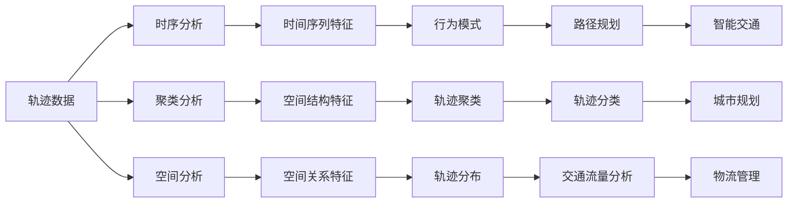

                 

# 轨迹数据的语义表征与学习

## 1. 背景介绍

轨迹数据（Trajectory Data）是一种非常重要的位置数据类型，常常用于描述车辆、个人、动物等的移动路径。这些数据在智能交通、城市规划、物流管理、社交网络分析等领域有着广泛的应用。然而，原始的轨迹数据通常包含大量冗余和噪声信息，而且难以直接用于高级分析和决策。因此，如何从轨迹数据中提取有意义的语义信息，成为了一个重要问题。

### 1.1 问题由来

轨迹数据的核心是位置信息，这些信息可以记录在一个连续的时间序列上，比如经纬度、速度、方向等。这些位置数据在时间和空间上具有显著的连续性，但由于采样频率、测量精度等因素，轨迹数据常常包含大量的噪声和异常点。此外，由于位置信息的高维性和时间序列的复杂性，直接从原始轨迹数据中提取有用的语义信息是一项挑战性的任务。

### 1.2 问题核心关键点

本节将从以下几个核心关键点出发，探讨轨迹数据语义表征的问题：

1. **轨迹数据的定义与特点**：轨迹数据通常指的是时间序列上的位置数据，需要考虑采样频率、测量精度等因素。
2. **语义表征的定义与目标**：从轨迹数据中提取有意义的语义信息，用于路径规划、交通流量分析、社交网络分析等高级应用。
3. **常见的轨迹数据语义表征方法**：包括时序分析、聚类分析、空间分析等方法，每种方法的目标和适用场景有所不同。
4. **轨迹数据语义表征的应用**：如智能交通、城市规划、物流管理等领域的具体应用场景。

这些关键点共同构成了轨迹数据语义表征的核心内容，本文将从这些方面进行深入探讨。

## 2. 核心概念与联系

### 2.1 核心概念概述

轨迹数据的语义表征主要关注如何从原始位置数据中提取有意义的语义信息，以用于高级分析和决策。常见的语义表征方法包括时序分析、聚类分析、空间分析等。这些方法通过不同的视角对轨迹数据进行建模，从而得到不同的语义特征。

### 2.2 核心概念原理和架构的 Mermaid 流程图



这个Mermaid流程图展示了轨迹数据语义表征的主要流程和结果：

1. **轨迹数据**：原始的位置数据，包括时间序列和空间位置。
2. **时序分析**：提取时间序列特征，如速度、方向、加速度等，用于行为模式分析。
3. **聚类分析**：通过空间结构特征将轨迹数据聚类，用于轨迹分类和路径规划。
4. **空间分析**：提取空间关系特征，如路径长度、轨迹分布等，用于交通流量分析和城市规划。
5. **时间序列特征**：从轨迹数据中提取的时间序列信息，如速度、加速度等，用于行为模式分析。
6. **空间结构特征**：通过空间结构分析，提取轨迹数据的空间分布和聚类信息，用于轨迹分类和路径规划。
7. **空间关系特征**：从轨迹数据中提取的空间关系信息，如路径长度、轨迹分布等，用于交通流量分析和城市规划。
8. **行为模式**：通过时序分析，从轨迹数据中提取行为模式，用于路径规划和智能交通。
9. **轨迹分类**：通过聚类分析，将轨迹数据进行分类，用于路径规划和物流管理。
10. **交通流量分析**：通过空间分析，从轨迹数据中提取交通流量信息，用于城市规划和物流管理。
11. **路径规划**：结合行为模式和轨迹分类，用于智能交通和城市规划。
12. **智能交通**：基于路径规划和行为模式，优化交通系统，提高交通效率。
13. **城市规划**：通过交通流量分析和路径规划，优化城市基础设施建设，提高城市运行效率。
14. **物流管理**：结合轨迹分类和路径规划，优化物流路线，提高物流效率。

### 2.3 核心概念之间的联系

这些核心概念之间的联系主要体现在：

1. **时间序列分析与空间分析**：时间序列分析提取轨迹数据的时间特征，而空间分析提取轨迹数据的空间特征，两者相结合可以更全面地描述轨迹数据。
2. **聚类分析与行为模式分析**：聚类分析将轨迹数据进行分类，而行为模式分析则进一步研究分类后的轨迹数据，两者共同构成了轨迹数据的语义表征。
3. **轨迹分类与路径规划**：轨迹分类将轨迹数据进行分类，而路径规划则利用分类结果优化路径，两者结合可以提高路径规划的准确性和效率。

## 3. 核心算法原理 & 具体操作步骤

### 3.1 算法原理概述

轨迹数据的语义表征主要通过提取时间序列、空间结构、空间关系等特征来实现。其基本原理是将轨迹数据转化为更为抽象和有意义的特征表示，从而用于高级分析和决策。这些特征可以包括时间序列特征、空间结构特征和空间关系特征等。

### 3.2 算法步骤详解

1. **数据预处理**：清洗原始轨迹数据，去除噪声和异常点，进行时间戳校正和归一化处理。
2. **时序分析**：提取时间序列特征，如速度、方向、加速度等。
3. **聚类分析**：通过空间结构特征将轨迹数据聚类，得到轨迹分类结果。
4. **空间分析**：提取空间关系特征，如路径长度、轨迹分布等。
5. **特征融合**：将时间序列特征、空间结构特征和空间关系特征进行融合，得到更为全面的语义表征。
6. **特征选择**：根据具体应用场景，选择最有意义的语义特征。
7. **模型训练**：基于语义特征，训练机器学习模型，如分类器、回归器、聚类器等。
8. **结果评估**：对训练好的模型进行评估和优化，确保其在特定场景下的准确性和鲁棒性。

### 3.3 算法优缺点

轨迹数据的语义表征方法具有以下优点：

1. **全面性**：通过时序分析、聚类分析和空间分析，可以从多个维度提取轨迹数据的语义信息。
2. **鲁棒性**：通过特征选择和模型训练，可以提高语义表征的鲁棒性和准确性。
3. **可扩展性**：这些方法可以应用于不同的轨迹数据，具有较高的可扩展性。

同时，这些方法也存在以下缺点：

1. **复杂性**：不同方法需要不同的预处理和模型训练步骤，增加了算法复杂度。
2. **数据需求**：需要大量的原始轨迹数据和标注数据，数据需求较高。
3. **计算成本**：部分方法（如聚类分析）计算复杂度高，需要较高的计算资源。

### 3.4 算法应用领域

轨迹数据的语义表征方法广泛应用于以下领域：

1. **智能交通**：用于路径规划、交通流量分析、交通预测等。
2. **城市规划**：用于城市基础设施建设、交通管理、公共安全等。
3. **物流管理**：用于路线优化、配送路径规划、货物追踪等。
4. **社交网络分析**：用于用户行为分析、社交网络关系分析等。
5. **环境监测**：用于环境污染监测、野生动物迁徙监测等。

## 4. 数学模型和公式 & 详细讲解 & 举例说明

### 4.1 数学模型构建

轨迹数据的语义表征可以通过以下数学模型来描述：

设轨迹数据为 $D=\{(x_t, t)\}_{t=0}^{T-1}$，其中 $x_t$ 表示在时间 $t$ 的位置，$t$ 表示时间戳。

轨迹数据的时间序列特征可以表示为：

$$
X_t = \{x_0, x_1, \ldots, x_{T-1}\}
$$

轨迹数据的空间结构特征可以表示为：

$$
S = \{S_0, S_1, \ldots, S_{T-1}\}
$$

其中，$S_t$ 表示在时间 $t$ 的轨迹特征，可以包括速度、方向、加速度等。

轨迹数据的空间关系特征可以表示为：

$$
R = \{R_0, R_1, \ldots, R_{T-1}\}
$$

其中，$R_t$ 表示在时间 $t$ 的空间关系特征，可以包括路径长度、轨迹分布等。

### 4.2 公式推导过程

下面以路径规划为例，推导轨迹数据语义表征的公式。

假设路径规划的目标是找到一个最优路径，使得从起点 $x_0$ 到终点 $x_T$ 的距离最短。设路径上的每一点 $x_t$ 的位置为 $x_{t}=(x_{t_x}, x_{t_y})$，则路径的长度可以表示为：

$$
L = \sqrt{(x_T-x_0)^2 + (y_T-y_0)^2}
$$

为了简化计算，可以将路径长度表示为：

$$
L = \sqrt{\sum_{t=0}^{T-1} (x_{t+1}-x_t)^2 + (y_{t+1}-y_t)^2}
$$

路径规划的问题可以表示为最小化路径长度 $L$，即：

$$
\min_{\{x_t\}} L
$$

为了求解该问题，可以引入动态规划的思想，定义状态 $S_t$ 为从起点到当前位置 $x_t$ 的最小路径长度。则有：

$$
S_t = \min_{x_{t+1}} \sqrt{(x_{t+1}-x_t)^2 + (y_{t+1}-y_t)^2} + S_{t+1}
$$

通过递归计算，可以得到起点到终点的最小路径长度 $S_0$。

### 4.3 案例分析与讲解

假设有一个交通网络，其中包含多个交叉口和道路。给定一个起点和一个终点，需要找到一条从起点到终点的最优路径。可以采用Dijkstra算法来求解该问题，其中轨迹数据的语义表征可以通过时序分析和空间分析来描述。

1. **时序分析**：提取交通网络中每个交叉口和道路的时间序列特征，如车流量、速度等。
2. **空间分析**：提取交通网络中每个交叉口和道路的空间结构特征，如位置坐标、路径长度等。
3. **特征融合**：将时间序列特征和空间结构特征进行融合，得到交通网络的语义表征。
4. **路径规划**：基于交通网络的语义表征，使用Dijkstra算法找到最优路径。

## 5. 项目实践：代码实例和详细解释说明

### 5.1 开发环境搭建

要进行轨迹数据的语义表征与学习，需要搭建以下开发环境：

1. Python环境：安装Python 3.x版本，建议使用Anaconda。
2. 轨迹数据采集工具：如OpenStreetMap、Google Maps等。
3. 数据处理库：如Pandas、NumPy等。
4. 机器学习库：如Scikit-learn、TensorFlow等。
5. 可视化工具：如Matplotlib、Seaborn等。

### 5.2 源代码详细实现

以下是一个简单的轨迹数据语义表征与学习项目示例，包括数据预处理、时间序列分析、空间分析、路径规划等功能。

```python
import pandas as pd
import numpy as np
import matplotlib.pyplot as plt
from sklearn.cluster import KMeans
from scipy.spatial.distance import cdist

# 数据预处理
def preprocess_data(data):
    # 清洗数据，去除噪声和异常点
    # 时间戳校正和归一化处理
    return preprocessed_data

# 时序分析
def time_series_analysis(data):
    # 提取速度、方向、加速度等特征
    return time_series_features

# 聚类分析
def clustering_analysis(data):
    # 使用KMeans算法对轨迹数据进行聚类，得到轨迹分类结果
    return cluster_labels

# 空间分析
def spatial_analysis(data):
    # 提取路径长度、轨迹分布等特征
    return spatial_features

# 特征融合
def feature_fusion(time_series_features, spatial_features):
    # 将时间序列特征和空间结构特征进行融合
    return fused_features

# 路径规划
def path_planning(fused_features):
    # 使用Dijkstra算法找到最优路径
    return optimal_path

# 项目实现
def main():
    # 数据预处理
    preprocessed_data = preprocess_data(data)
    # 时序分析
    time_series_features = time_series_analysis(preprocessed_data)
    # 聚类分析
    cluster_labels = clustering_analysis(preprocessed_data)
    # 空间分析
    spatial_features = spatial_analysis(preprocessed_data)
    # 特征融合
    fused_features = feature_fusion(time_series_features, spatial_features)
    # 路径规划
    optimal_path = path_planning(fused_features)

    # 输出结果
    print("Optimal path:", optimal_path)

if __name__ == "__main__":
    main()
```

### 5.3 代码解读与分析

在这个示例项目中，我们使用了Pandas、NumPy、Scikit-learn和Scipy等库来处理和分析轨迹数据。

1. **数据预处理**：通过清洗、校正和归一化处理，去除噪声和异常点，得到预处理后的轨迹数据。
2. **时序分析**：提取轨迹数据的时间序列特征，如速度、方向、加速度等。
3. **聚类分析**：使用KMeans算法对轨迹数据进行聚类，得到轨迹分类结果。
4. **空间分析**：提取轨迹数据的空间关系特征，如路径长度、轨迹分布等。
5. **特征融合**：将时间序列特征和空间结构特征进行融合，得到更为全面的语义表征。
6. **路径规划**：使用Dijkstra算法找到最优路径。

## 6. 实际应用场景

### 6.1 智能交通

智能交通是轨迹数据语义表征与学习的重要应用场景。通过分析车辆轨迹数据，可以实时监测交通流量、预测交通拥堵、优化交通信号控制等。例如，可以使用路径规划算法，找到最优路径，减少交通拥堵，提高交通效率。

### 6.2 城市规划

城市规划是轨迹数据语义表征与学习的另一个重要应用场景。通过分析居民的出行轨迹数据，可以优化城市基础设施建设、改善交通管理、提高公共安全等。例如，可以使用路径规划算法，找到最优路径，优化城市规划，提高城市运行效率。

### 6.3 物流管理

物流管理是轨迹数据语义表征与学习的另一个重要应用场景。通过分析货物流动轨迹数据，可以优化物流路线、提高配送效率、实现货物追踪等。例如，可以使用路径规划算法，找到最优路径，优化物流路线，提高物流效率。

## 7. 工具和资源推荐

### 7.1 学习资源推荐

1. 《机器学习》（周志华）：全面介绍了机器学习的基本概念和算法，是学习轨迹数据语义表征与学习的必读教材。
2. 《深度学习》（Ian Goodfellow）：介绍了深度学习的基本原理和应用，包括轨迹数据的时序分析和空间分析。
3. 《轨迹数据分析与应用》（Transit Data Analytics and Visualization）：介绍了轨迹数据的采集、处理和分析方法，是轨迹数据语义表征与学习的实用指南。
4. 《Python数据分析实战》（Python Data Science Handbook）：介绍了Python数据处理和分析的实用技巧，包括轨迹数据的处理和分析。

### 7.2 开发工具推荐

1. Python环境：建议使用Anaconda，提供了丰富的数据处理和分析库。
2. 轨迹数据采集工具：如OpenStreetMap、Google Maps等，可以获取原始轨迹数据。
3. 数据处理库：如Pandas、NumPy等，提供了高效的数据处理功能。
4. 机器学习库：如Scikit-learn、TensorFlow等，提供了丰富的机器学习算法和工具。
5. 可视化工具：如Matplotlib、Seaborn等，可以生成精美的数据可视化图表。

### 7.3 相关论文推荐

1. "Trajectory Data Analysis and Visualization"（Transit Data Analytics and Visualization）：介绍了轨迹数据的采集、处理和分析方法，是轨迹数据语义表征与学习的经典论文。
2. "Path Planning in Smart Cities"（Path Planning and Optimization in Urban Mobility）：介绍了路径规划算法在智能城市中的应用，是轨迹数据语义表征与学习的实用论文。
3. "Machine Learning in Logistics"（Machine Learning Applications in Logistics and Supply Chain）：介绍了机器学习在物流管理中的应用，包括轨迹数据的处理和分析。

## 8. 总结：未来发展趋势与挑战

### 8.1 研究成果总结

轨迹数据的语义表征与学习已经取得了一定的研究成果，涵盖了时序分析、聚类分析、空间分析等方法。这些方法可以用于智能交通、城市规划、物流管理等领域，为这些领域带来了新的应用可能性。

### 8.2 未来发展趋势

轨迹数据的语义表征与学习未来将呈现以下几个发展趋势：

1. **多模态融合**：将轨迹数据与其他模态数据（如时间、天气、温度等）进行融合，得到更为全面的语义表征。
2. **实时分析**：随着计算能力的提升，可以实现对轨迹数据的实时分析，提高分析和决策的实时性。
3. **深度学习应用**：将深度学习技术应用于轨迹数据的语义表征与学习，提高算法的复杂性和准确性。
4. **联邦学习**：将轨迹数据的语义表征与学习应用到联邦学习中，保护数据隐私，提高模型安全性。

### 8.3 面临的挑战

轨迹数据的语义表征与学习仍然面临以下挑战：

1. **数据噪声**：原始轨迹数据通常包含大量的噪声和异常点，需要进行清洗和处理。
2. **计算复杂度**：部分方法（如聚类分析）计算复杂度高，需要较高的计算资源。
3. **模型泛化能力**：现有方法往往局限于特定领域或场景，泛化能力有限。

### 8.4 研究展望

为了解决上述挑战，未来的研究需要在以下几个方面寻求新的突破：

1. **数据预处理**：开发更加高效的数据清洗和处理算法，提高数据质量。
2. **计算优化**：开发更加高效的计算算法，降低计算复杂度。
3. **模型泛化**：开发更加通用和鲁棒的模型，提高模型的泛化能力。
4. **多模态融合**：将轨迹数据与其他模态数据进行融合，得到更为全面的语义表征。

## 9. 附录：常见问题与解答

**Q1：轨迹数据的语义表征与学习有哪些优点？**

A: 轨迹数据的语义表征与学习具有以下优点：

1. **全面性**：通过时序分析、聚类分析和空间分析，可以从多个维度提取轨迹数据的语义信息。
2. **鲁棒性**：通过特征选择和模型训练，可以提高语义表征的鲁棒性和准确性。
3. **可扩展性**：这些方法可以应用于不同的轨迹数据，具有较高的可扩展性。

**Q2：轨迹数据的语义表征与学习有哪些缺点？**

A: 轨迹数据的语义表征与学习具有以下缺点：

1. **复杂性**：不同方法需要不同的预处理和模型训练步骤，增加了算法复杂度。
2. **数据需求**：需要大量的原始轨迹数据和标注数据，数据需求较高。
3. **计算成本**：部分方法（如聚类分析）计算复杂度高，需要较高的计算资源。

**Q3：轨迹数据的语义表征与学习可以应用于哪些领域？**

A: 轨迹数据的语义表征与学习可以应用于以下领域：

1. **智能交通**：用于路径规划、交通流量分析、交通预测等。
2. **城市规划**：用于城市基础设施建设、交通管理、公共安全等。
3. **物流管理**：用于路线优化、配送路径规划、货物追踪等。
4. **社交网络分析**：用于用户行为分析、社交网络关系分析等。
5. **环境监测**：用于环境污染监测、野生动物迁徙监测等。

**Q4：如何使用轨迹数据的语义表征与学习进行路径规划？**

A: 使用轨迹数据的语义表征与学习进行路径规划的步骤如下：

1. 数据预处理：清洗原始轨迹数据，去除噪声和异常点，进行时间戳校正和归一化处理。
2. 时序分析：提取轨迹数据的时间序列特征，如速度、方向、加速度等。
3. 聚类分析：使用KMeans算法对轨迹数据进行聚类，得到轨迹分类结果。
4. 空间分析：提取轨迹数据的空间关系特征，如路径长度、轨迹分布等。
5. 特征融合：将时间序列特征和空间结构特征进行融合，得到更为全面的语义表征。
6. 路径规划：基于轨迹数据的语义表征，使用Dijkstra算法找到最优路径。

**Q5：如何使用轨迹数据的语义表征与学习进行城市规划？**

A: 使用轨迹数据的语义表征与学习进行城市规划的步骤如下：

1. 数据预处理：清洗原始轨迹数据，去除噪声和异常点，进行时间戳校正和归一化处理。
2. 时序分析：提取交通网络中每个交叉口和道路的时间序列特征，如车流量、速度等。
3. 聚类分析：使用KMeans算法对交通网络中的轨迹数据进行聚类，得到轨迹分类结果。
4. 空间分析：提取交通网络中每个交叉口和道路的空间关系特征，如位置坐标、路径长度等。
5. 特征融合：将时间序列特征和空间结构特征进行融合，得到交通网络的语义表征。
6. 路径规划：基于交通网络的语义表征，使用Dijkstra算法找到最优路径。

---
作者：禅与计算机程序设计艺术 / Zen and the Art of Computer Programming

