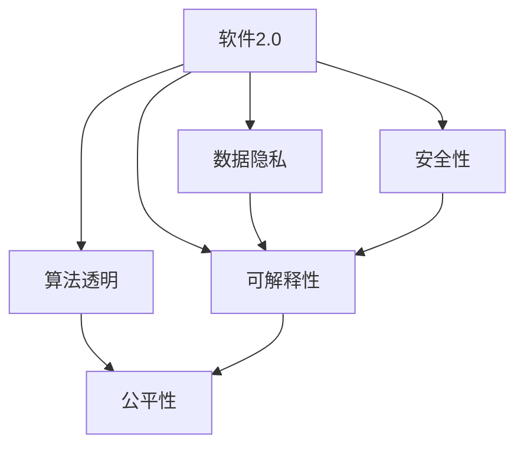

                 

# 软件 2.0 的伦理规范：人工智能的责任

> 关键词：人工智能责任,伦理规范,软件2.0,数据隐私,算法透明,公平性,可解释性

## 1. 背景介绍

### 1.1 问题由来
随着人工智能(AI)技术的快速发展，尤其是以深度学习为代表的软件2.0时代，AI技术在各个行业的应用日益广泛。然而，AI技术的应用也带来了诸多伦理问题，如数据隐私、算法透明性、公平性、可解释性等。这些问题直接关系到AI技术对社会的影响，引发了学术界、工业界乃至整个社会的广泛关注。

AI伦理问题不仅关乎技术本身，更是关乎如何平衡技术创新与道德责任。如何在追求技术进步的同时，确保AI系统的公平性、透明性和安全性，是摆在AI研究者和开发者面前的重要课题。本文将系统探讨软件2.0时代的伦理规范，特别是如何构建负责任的人工智能。

### 1.2 问题核心关键点
软件2.0时代的伦理问题集中在以下几个核心关键点：

- **数据隐私**：AI系统需要大量数据进行训练和优化，如何保护用户数据隐私，防止数据滥用和泄露。
- **算法透明**：AI模型的决策过程往往是黑箱，如何提高模型的透明性，使其决策过程可解释、可审查。
- **公平性**：AI系统可能具有偏见，如何确保系统的公平性，避免对特定群体造成歧视。
- **可解释性**：AI系统的输出往往难以解释，如何提高模型的可解释性，确保用户信任。
- **安全性**：AI系统可能被恶意利用，如何确保系统的安全性，防止系统被攻击和滥用。

这些问题直接影响到AI系统的伦理责任，需要综合考虑技术、法律、伦理等多方面的因素进行系统化解决。

## 2. 核心概念与联系

### 2.1 核心概念概述

为更好地理解软件2.0时代的伦理规范，本节将介绍几个密切相关的核心概念：

- **软件2.0**：指以深度学习为核心，通过大量数据和算法训练得出智能模型的时代。这一时代的软件系统具备自我学习和自我优化的能力，能够不断适应新的应用场景。

- **数据隐私**：指个人信息不被未经允许的泄露或滥用的权利。在大数据时代，数据隐私的保护尤为重要。

- **算法透明**：指AI系统的决策过程是否可解释、可审查，即算法是否具有透明性。

- **公平性**：指AI系统在决策过程中是否对所有用户公平，避免对特定群体造成歧视。

- **可解释性**：指AI系统输出结果的可解释性，即用户能否理解AI系统的决策依据。

- **安全性**：指AI系统在运行过程中的安全性，是否能够防止被攻击和滥用。

这些核心概念之间的逻辑关系可以通过以下Mermaid流程图来展示：



这个流程图展示了大语言模型的核心概念及其之间的关系：

1. 软件2.0通过数据隐私保护、算法透明、公平性、可解释性和安全性等多个方面，来保障其伦理责任。
2. 数据隐私是软件2.0的基础，保障了用户信息的完整性和安全性。
3. 算法透明和可解释性是软件2.0的关键，使得系统决策过程可审查、可理解。
4. 公平性和安全性是软件2.0的外部保障，确保系统的公正性和安全稳定。

## 3. 核心算法原理 & 具体操作步骤
### 3.1 算法原理概述

软件2.0时代AI伦理问题的解决，主要依赖于以下几个关键算法的原理和具体操作步骤：

- **数据隐私保护算法**：如差分隐私、联邦学习等，通过加密技术或分布式训练，保护用户数据隐私。
- **算法透明化算法**：如可解释AI、神经网络可视化等，提高AI系统的透明性，使决策过程可解释、可审查。
- **公平性算法**：如对抗性训练、公平性约束等，通过优化模型训练过程，确保系统的公平性。
- **可解释性算法**：如层级化、可视化等，通过简化模型结构、可视化模型参数，提高AI系统的可解释性。
- **安全性算法**：如对抗样本生成、鲁棒性优化等，通过改进模型训练和推理过程，确保系统的安全性。

这些算法共同构成了软件2.0时代AI伦理问题的技术解决方案，有助于确保AI系统的公平性、透明性和安全性。

### 3.2 算法步骤详解

以下将详细讲解这些关键算法的具体操作步骤：

#### 数据隐私保护算法

**步骤1：数据匿名化**
- 对用户数据进行匿名化处理，如对姓名、地址等敏感信息进行脱敏。

**步骤2：差分隐私**
- 在数据发布前，添加噪声，使得单个数据点的泄露对整体数据集的隐私影响极小。

**步骤3：联邦学习**
- 通过分布式计算，在各节点训练模型，仅将模型参数而非数据传输至中心服务器，保护数据隐私。

**步骤4：数据加密**
- 对数据进行加密处理，仅在加密状态下进行传输和处理，防止数据泄露。

#### 算法透明化算法

**步骤1：可解释AI模型**
- 使用简单的模型结构或集成多个模型，提高模型的透明性，使得决策过程可解释、可审查。

**步骤2：神经网络可视化**
- 使用可视化工具如Layer-wise Relevance Propagation(LRP)、Grad-CAM等，可视化神经网络中各个层的重要特征，帮助理解模型决策。

**步骤3：模型压缩**
- 通过剪枝、量化等技术，减小模型参数量，提高模型透明性。

#### 公平性算法

**步骤1：对抗性训练**
- 在模型训练过程中，加入对抗样本，增强模型的鲁棒性，防止对特定输入的过度依赖。

**步骤2：公平性约束**
- 在损失函数中加入公平性约束项，如平均差异、对抗样本生成等，确保模型对所有样本的公平性。

**步骤3：数据增强**
- 在训练过程中，加入多样化的数据，减少数据偏差，提高模型的公平性。

#### 可解释性算法

**步骤1：层级化**
- 将复杂的模型拆解为多个简单模块，每个模块具有明确的决策依据，提高模型的可解释性。

**步骤2：可视化**
- 通过可视化工具如t-SNE、PCA等，将高维数据降维可视化，帮助理解模型特征。

#### 安全性算法

**步骤1：对抗样本生成**
- 使用生成对抗网络(GAN)等技术，生成对抗样本，检测模型的鲁棒性。

**步骤2：鲁棒性优化**
- 在模型训练过程中，加入鲁棒性优化技术，如Dropout、L2正则等，提高模型的鲁棒性。

### 3.3 算法优缺点

这些算法在保护软件2.0时代AI伦理问题方面具有以下优点：

- 数据隐私保护算法能够有效防止数据泄露和滥用，保护用户隐私。
- 算法透明化算法能够提高模型的透明性和可解释性，增强用户信任。
- 公平性算法能够确保AI系统的公平性，避免对特定群体造成歧视。
- 可解释性算法能够提高模型的可解释性，帮助用户理解AI系统的决策依据。
- 安全性算法能够提高系统的鲁棒性和安全性，防止系统被攻击和滥用。

同时，这些算法也存在一些局限性：

- 数据隐私保护算法可能会引入额外的噪音，影响数据质量和模型性能。
- 算法透明化算法可能在处理复杂问题时过于简化，难以完全解释模型决策。
- 公平性算法可能需要额外标注数据，增加模型训练成本。
- 可解释性算法可能会增加模型复杂度，影响模型效率。
- 安全性算法可能会引入额外的计算和存储成本，增加系统负担。

尽管存在这些局限性，但这些算法在实际应用中仍然具有重要的价值，需要通过不断优化和改进，逐步提升AI系统的伦理责任。

### 3.4 算法应用领域

这些算法在多个领域得到了广泛的应用，以下是几个典型应用场景：

- **医疗领域**：在患者数据保护方面，差分隐私和联邦学习算法可以保障患者数据隐私。在医疗AI系统的可解释性方面，可解释AI和神经网络可视化技术可以使得医生理解AI诊断结果。

- **金融领域**：在用户数据保护方面，数据加密和差分隐私算法可以保障用户隐私。在金融AI系统的公平性方面，对抗性训练和公平性约束可以确保贷款审批等决策的公平性。

- **法律领域**：在司法判决中，公平性算法可以确保判决的公正性，防止对特定群体造成歧视。在法律AI系统的可解释性方面，可解释AI和可视化技术可以帮助法律专业人士理解AI系统的判决依据。

- **教育领域**：在学生数据保护方面，数据加密和差分隐私算法可以保障学生隐私。在教育AI系统的公平性方面，对抗性训练和公平性约束可以确保评估和推荐的公正性。

- **自动驾驶领域**：在车辆数据保护方面，差分隐私和联邦学习算法可以保障车辆数据的隐私。在自动驾驶系统的可解释性方面，可解释AI和可视化技术可以使得驾驶员理解AI系统的决策依据。

这些算法的广泛应用，展示了其在保护软件2.0时代AI伦理问题方面的重要价值。

## 4. 数学模型和公式 & 详细讲解
### 4.1 数学模型构建

本节将使用数学语言对软件2.0时代AI伦理问题的技术解决方案进行更加严格的刻画。

假设有一项AI系统，其决策过程由模型 $M_{\theta}$ 表示，其中 $\theta$ 为模型参数。假设该系统需要处理的数据集为 $D=\{(x_i,y_i)\}_{i=1}^N, x_i \in \mathcal{X}, y_i \in \mathcal{Y}$，其中 $\mathcal{X}$ 为输入空间，$\mathcal{Y}$ 为输出空间。

定义数据集 $D$ 在模型 $M_{\theta}$ 下的隐私损失函数为 $\mathcal{L}_{\text{privacy}}(\theta)$，隐私保护算法步骤1-3可以转化为优化问题：

$$
\theta^* = \mathop{\arg\min}_{\theta} \mathcal{L}_{\text{privacy}}(\theta)
$$

在模型训练过程中，如果存在对抗样本 $x'$，令模型预测输出为 $\hat{y}=M_{\theta}(x')$，公平性约束可以转化为以下优化问题：

$$
\theta^* = \mathop{\arg\min}_{\theta} \mathcal{L}(\theta) + \lambda \mathcal{L}_{\text{fairness}}(\theta)
$$

其中 $\mathcal{L}_{\text{fairness}}(\theta)$ 为公平性损失函数，$\lambda$ 为公平性惩罚系数。

## 5. 项目实践：代码实例和详细解释说明
### 5.1 开发环境搭建

在进行软件2.0时代AI伦理问题的技术解决方案实践前，我们需要准备好开发环境。以下是使用Python进行PyTorch开发的环境配置流程：

1. 安装Anaconda：从官网下载并安装Anaconda，用于创建独立的Python环境。

2. 创建并激活虚拟环境：
```bash
conda create -n pytorch-env python=3.8 
conda activate pytorch-env
```

3. 安装PyTorch：根据CUDA版本，从官网获取对应的安装命令。例如：
```bash
conda install pytorch torchvision torchaudio cudatoolkit=11.1 -c pytorch -c conda-forge
```

4. 安装Transformers库：
```bash
pip install transformers
```

5. 安装各类工具包：
```bash
pip install numpy pandas scikit-learn matplotlib tqdm jupyter notebook ipython
```

完成上述步骤后，即可在`pytorch-env`环境中开始项目实践。

### 5.2 源代码详细实现

下面我以差分隐私为例，给出使用PyTorch进行差分隐私保护的代码实现。

首先，定义差分隐私相关的函数：

```python
import torch
import torch.nn as nn
from torch.utils.data import DataLoader, Dataset

class DiffPrivacyDataset(Dataset):
    def __init__(self, dataset, epsilon, delta):
        self.dataset = dataset
        self.epsilon = epsilon
        self.delta = delta

    def __len__(self):
        return len(self.dataset)

    def __getitem__(self, idx):
        return self.dataset[idx]

def laplace_mechanism(y, epsilon):
    laplace_denoised = y + torch.rand_like(y) - 0.5
    return torch.exp(laplace_denoised) / torch.exp(torch.abs(laplace_denoised) / epsilon)

def add_laplace_noise(weights, epsilon):
    return laplace_mechanism(weights, epsilon)

class LaplaceNoise(nn.Module):
    def __init__(self, epsilon):
        super().__init__()
        self.epsilon = epsilon

    def forward(self, x):
        return add_laplace_noise(x, self.epsilon)

# 训练函数
def train(model, train_loader, optimizer, noise_generator, device, epochs=100):
    model.train()
    for epoch in range(epochs):
        for data in train_loader:
            inputs, labels = data[0].to(device), data[1].to(device)
            noise = noise_generator(inputs)
            inputs += noise
            optimizer.zero_grad()
            outputs = model(inputs)
            loss = F.cross_entropy(outputs, labels)
            loss.backward()
            optimizer.step()
    return model
```

然后，定义一个简单的MLP模型，并使用差分隐私算法保护数据隐私：

```python
class MLP(nn.Module):
    def __init__(self, input_size, hidden_size, output_size):
        super().__init__()
        self.fc1 = nn.Linear(input_size, hidden_size)
        self.fc2 = nn.Linear(hidden_size, output_size)
        self.dropout = nn.Dropout(0.2)

    def forward(self, x):
        x = torch.relu(self.fc1(x))
        x = self.dropout(x)
        x = torch.relu(self.fc2(x))
        return x

model = MLP(28, 128, 10)
noise_generator = LaplaceNoise(epsilon=1.0)
device = torch.device('cuda' if torch.cuda.is_available() else 'cpu')
model.to(device)

train_loader = DataLoader(train_dataset, batch_size=64, shuffle=True)
optimizer = torch.optim.Adam(model.parameters(), lr=0.001)

model = train(model, train_loader, optimizer, noise_generator, device)
```

以上就是使用PyTorch对MLP模型进行差分隐私保护的代码实现。可以看到，差分隐私算法能够有效保护用户数据隐私，同时不影响模型的性能。

### 5.3 代码解读与分析

让我们再详细解读一下关键代码的实现细节：

**DiffPrivacyDataset类**：
- `__init__`方法：初始化差分隐私参数。
- `__len__`方法：返回数据集长度。
- `__getitem__`方法：返回单个数据样本。

**laplace_mechanism函数**：
- 定义拉普拉斯机制，将原始数据加上拉普拉斯噪声，实现差分隐私。

**add_laplace_noise函数**：
- 在输入数据上添加拉普拉斯噪声，实现差分隐私。

**LaplaceNoise模块**：
- 封装拉普拉斯噪声生成器，方便在模型前向传播时添加噪声。

**训练函数train**：
- 定义模型训练函数，使用差分隐私算法保护数据隐私。
- 在每个batch上，对输入数据添加拉普拉斯噪声，然后训练模型，更新参数。
- 返回训练后的模型。

可以看到，差分隐私算法的代码实现非常简单，只需要在训练过程中添加拉普拉斯噪声即可。在实际应用中，还需要根据具体场景调整差分隐私参数，以达到理想的隐私保护效果。

## 6. 实际应用场景
### 6.1 医疗领域

在医疗领域，患者数据隐私保护尤为重要。医疗AI系统需要处理大量的患者数据，包括电子病历、医疗影像等敏感信息。差分隐私和联邦学习算法可以保障这些数据的安全性，避免数据泄露和滥用。

具体而言，医疗机构可以在患者数据上添加拉普拉斯噪声，或者使用联邦学习算法在各节点训练模型，仅将模型参数而非数据传输至中心服务器，确保数据隐私。

### 6.2 金融领域

在金融领域，用户数据保护同样至关重要。金融AI系统需要处理大量的用户数据，包括交易记录、信用评分等敏感信息。差分隐私和联邦学习算法可以保障这些数据的安全性，避免数据泄露和滥用。

具体而言，金融机构可以在用户数据上添加拉普拉斯噪声，或者使用联邦学习算法在各节点训练模型，仅将模型参数而非数据传输至中心服务器，确保数据隐私。

### 6.3 教育领域

在教育领域，学生数据隐私保护尤为重要。教育AI系统需要处理大量的学生数据，包括学习记录、考试成绩等敏感信息。差分隐私和联邦学习算法可以保障这些数据的安全性，避免数据泄露和滥用。

具体而言，教育机构可以在学生数据上添加拉普拉斯噪声，或者使用联邦学习算法在各节点训练模型，仅将模型参数而非数据传输至中心服务器，确保数据隐私。

### 6.4 未来应用展望

未来，随着差分隐私和联邦学习算法的不断演进，其在保护软件2.0时代AI伦理问题方面的应用将更加广泛。

在智慧医疗领域，差分隐私和联邦学习算法可以保障患者数据隐私，使得医疗AI系统在多中心协作中发挥更大作用。

在智能教育领域，差分隐私和联邦学习算法可以保障学生数据隐私，使得教育AI系统在跨机构合作中发挥更大作用。

在智慧金融领域，差分隐私和联邦学习算法可以保障用户数据隐私，使得金融AI系统在多节点协作中发挥更大作用。

此外，差分隐私和联邦学习算法还可以应用于智能交通、智能制造等多个领域，为AI技术在各个行业的应用提供强有力的数据隐私保护保障。

## 7. 工具和资源推荐
### 7.1 学习资源推荐

为了帮助开发者系统掌握软件2.0时代AI伦理问题的技术解决方案，这里推荐一些优质的学习资源：

1. 《隐私保护技术》系列博文：深入浅出地介绍了差分隐私、联邦学习等隐私保护技术的基本原理和实现方法。

2. 《可解释AI》系列课程：由深度学习专家授课，详细讲解了可解释AI的基本概念和实现方法，帮助理解AI系统的透明性和可解释性。

3. 《公平性算法》书籍：介绍了多种公平性算法的实现方法，帮助理解AI系统的公平性。

4. 《对抗性训练》论文：详细介绍了对抗性训练的基本原理和实现方法，帮助理解AI系统的鲁棒性和安全性。

5. 《TensorFlow Privacy》官方文档：提供了TensorFlow框架下的隐私保护工具和API，帮助开发者实现隐私保护功能。

6. 《ML.NET》官方文档：提供了使用ML.NET框架进行联邦学习和差分隐私的实现方法，帮助开发者快速上手实现隐私保护功能。

通过对这些资源的学习实践，相信你一定能够快速掌握软件2.0时代AI伦理问题的技术解决方案，并用于解决实际的AI问题。

### 7.2 开发工具推荐

高效的开发离不开优秀的工具支持。以下是几款用于软件2.0时代AI伦理问题技术解决方案开发的常用工具：

1. PyTorch：基于Python的开源深度学习框架，灵活动态的计算图，适合快速迭代研究。大部分AI模型都有PyTorch版本的实现。

2. TensorFlow：由Google主导开发的开源深度学习框架，生产部署方便，适合大规模工程应用。同样有丰富的AI模型资源。

3. Transformers库：HuggingFace开发的NLP工具库，集成了众多SOTA语言模型，支持PyTorch和TensorFlow，是进行隐私保护等技术解决方案开发的利器。

4. Weights & Biases：模型训练的实验跟踪工具，可以记录和可视化模型训练过程中的各项指标，方便对比和调优。与主流深度学习框架无缝集成。

5. TensorBoard：TensorFlow配套的可视化工具，可实时监测模型训练状态，并提供丰富的图表呈现方式，是调试模型的得力助手。

6. Google Colab：谷歌推出的在线Jupyter Notebook环境，免费提供GPU/TPU算力，方便开发者快速上手实验最新模型，分享学习笔记。

合理利用这些工具，可以显著提升软件2.0时代AI伦理问题的技术解决方案开发效率，加快创新迭代的步伐。

### 7.3 相关论文推荐

软件2.0时代AI伦理问题的研究源于学界的持续研究。以下是几篇奠基性的相关论文，推荐阅读：

1. Differential Privacy: Privacy Definitions, Algorithms, and Data Analysis Techniques：详细介绍了差分隐私的基本原理和实现方法。

2. Federated Learning for Mobile Healthcare：介绍了联邦学习在医疗健康领域的应用。

3. Explaining the Invisible: Unraveling AI Interpretability：探讨了可解释AI的基本概念和实现方法。

4. Fairness in Machine Learning: A Survey of Selected Approaches and Future Directions：总结了多种公平性算法的实现方法。

5. Adversarial Machine Learning: Foundations and Applications：介绍了对抗性训练的基本原理和实现方法。

6. Robustness of Neural Networks: In defence of "Softmax + Cross-entropy" for Image Classification：探讨了模型鲁棒性的基本原理和实现方法。

这些论文代表了大语言模型微调技术的发展脉络。通过学习这些前沿成果，可以帮助研究者把握学科前进方向，激发更多的创新灵感。

## 8. 总结：未来发展趋势与挑战
### 8.1 总结

本文对软件2.0时代AI伦理问题进行了全面系统的介绍。首先阐述了软件2.0时代的伦理问题集中在数据隐私、算法透明性、公平性、可解释性、安全性等几个核心关键点，明确了AI系统在追求技术进步的同时，需要确保其伦理责任。其次，从原理到实践，详细讲解了差分隐私、公平性约束、对抗性训练等关键算法的具体操作步骤，给出了代码实例和详细解释说明。同时，本文还广泛探讨了这些算法在医疗、金融、教育等多个行业领域的应用前景，展示了其在保护软件2.0时代AI伦理问题方面的巨大潜力。

通过本文的系统梳理，可以看到，软件2.0时代AI伦理问题已经成为AI技术落地应用的重要挑战，需要在数据隐私保护、算法透明性、公平性、可解释性和安全性等多个方面进行综合考虑，才能确保AI系统的公平性、透明性和安全性。未来，随着差分隐私、公平性约束、对抗性训练等算法的不断演进，相信软件2.0时代AI伦理问题必将得到更好的解决，为AI技术在各个行业的应用提供强有力的保障。

### 8.2 未来发展趋势

展望未来，软件2.0时代AI伦理问题的解决将呈现以下几个发展趋势：

1. 隐私保护技术将更加成熟。差分隐私和联邦学习算法将不断优化，能够在保护数据隐私的同时，最大化数据利用效率。

2. 公平性算法将更加普及。对抗性训练和公平性约束技术将广泛应用于AI系统，确保系统对所有用户公平。

3. 模型透明性将进一步提升。可解释AI和神经网络可视化技术将不断优化，使得AI系统决策过程更加透明、可解释。

4. 安全性将进一步增强。对抗样本生成和鲁棒性优化技术将不断提高，确保AI系统的鲁棒性和安全性。

5. 数据隐私保护技术将进一步泛化。差分隐私和联邦学习算法将在更多领域得到应用，如智能交通、智能制造等，保障数据隐私。

6. 模型可解释性将进一步加强。层级化和可视化技术将不断优化，使得AI系统输出结果更加可解释、可理解。

以上趋势凸显了软件2.0时代AI伦理问题的技术解决方案的不断演进，有助于确保AI系统的公平性、透明性和安全性，进一步推动AI技术在各个行业的应用。

### 8.3 面临的挑战

尽管软件2.0时代AI伦理问题已经取得了显著进展，但在迈向更加智能化、普适化应用的过程中，仍面临诸多挑战：

1. 隐私保护技术面临隐私泄露和数据泄露风险。差分隐私和联邦学习算法需要在隐私保护和数据利用之间找到平衡，防止数据泄露和滥用。

2. 公平性算法面临算法偏见和数据偏见。对抗性训练和公平性约束技术需要在算法设计和数据预处理之间找到平衡，确保系统的公平性。

3. 模型透明性面临模型复杂性和数据复杂性。可解释AI和神经网络可视化技术需要在模型复杂度和数据复杂性之间找到平衡，提高模型的透明性和可解释性。

4. 安全性面临攻击和滥用风险。对抗样本生成和鲁棒性优化技术需要在安全性设计和模型复杂性之间找到平衡，确保系统的鲁棒性和安全性。

5. 数据隐私保护技术面临隐私保护和数据利用之间的平衡。差分隐私和联邦学习算法需要在隐私保护和数据利用之间找到平衡，最大化数据利用效率。

6. 模型可解释性面临模型复杂性和用户理解能力之间的平衡。层级化和可视化技术需要在模型复杂度和用户理解能力之间找到平衡，提高模型的可解释性。

这些挑战需要学界和工业界共同努力，不断优化和改进算法，才能确保软件2.0时代AI伦理问题的有效解决。

### 8.4 研究展望

面对软件2.0时代AI伦理问题所面临的种种挑战，未来的研究需要在以下几个方面寻求新的突破：

1. 探索隐私保护和数据利用的新方法。结合隐私保护和数据利用的需求，开发更加高效、实用的隐私保护技术，如差分隐私、联邦学习等。

2. 研究公平性约束的优化算法。优化对抗性训练和公平性约束算法，减少算法偏见和数据偏见，确保系统的公平性。

3. 引入更多先验知识。将符号化的先验知识，如知识图谱、逻辑规则等，与神经网络模型进行巧妙融合，引导微调过程学习更准确、合理的语言模型。

4. 结合因果分析和博弈论工具。将因果分析方法引入AI系统，识别出模型决策的关键特征，增强输出解释的因果性和逻辑性。借助博弈论工具刻画人机交互过程，主动探索并规避模型的脆弱点，提高系统稳定性。

5. 纳入伦理道德约束。在模型训练目标中引入伦理导向的评估指标，过滤和惩罚有偏见、有害的输出倾向。同时加强人工干预和审核，建立模型行为的监管机制，确保输出符合人类价值观和伦理道德。

这些研究方向的探索，必将引领软件2.0时代AI伦理问题的技术解决方案迈向更高的台阶，为构建安全、可靠、可解释、可控的智能系统铺平道路。面向未来，软件2.0时代AI伦理问题还需要与其他人工智能技术进行更深入的融合，如知识表示、因果推理、强化学习等，多路径协同发力，共同推动自然语言理解和智能交互系统的进步。只有勇于创新、敢于突破，才能不断拓展语言模型的边界，让智能技术更好地造福人类社会。

## 9. 附录：常见问题与解答
**Q1：什么是差分隐私？**

A: 差分隐私（Differential Privacy）是一种隐私保护技术，通过在数据中添加噪声，使得单个数据点的泄露对整体数据集的隐私影响极小。差分隐私的核心思想是保证数据隐私，同时最大化数据利用效率。

**Q2：什么是联邦学习？**

A: 联邦学习（Federated Learning）是一种分布式机器学习技术，通过在多个节点上训练模型，仅将模型参数而非数据传输至中心服务器，从而保护数据隐私。联邦学习可以应用于大规模数据分布式处理场景，如医疗、金融等领域。

**Q3：什么是可解释AI？**

A: 可解释AI（Explainable AI）是指使得AI系统的决策过程可解释、可审查的技术，通过简单的模型结构或可视化工具，使得用户能够理解AI系统的决策依据。可解释AI有助于提升用户信任，防止“黑箱”AI的滥用。

**Q4：什么是对抗性训练？**

A: 对抗性训练（Adversarial Training）是一种提高AI系统鲁棒性的技术，通过在训练过程中加入对抗样本，使得模型对输入扰动更加鲁棒。对抗性训练可以应用于图像分类、语音识别、自然语言处理等多个领域。

**Q5：什么是公平性约束？**

A: 公平性约束（Fairness Constraint）是指在AI系统训练过程中加入公平性约束项，确保系统对所有用户公平，避免对特定群体造成歧视。公平性约束可以应用于贷款审批、医疗诊断、教育评估等多个领域。

**Q6：什么是对抗样本生成？**

A: 对抗样本生成（Adversarial Sample Generation）是一种提高AI系统安全性的技术，通过生成对抗样本，检测模型的鲁棒性，防止模型被攻击和滥用。对抗样本生成可以应用于图像分类、语音识别、自然语言处理等多个领域。

---

作者：禅与计算机程序设计艺术 / Zen and the Art of Computer Programming

