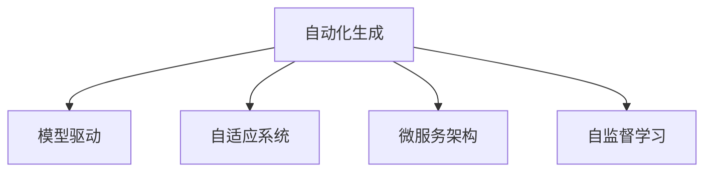

                 

# 软件 2.0 的未来展望：更智能、更强大

## 1. 背景介绍

### 1.1 问题由来

在过去的十年中，软件行业的技术已经经历了翻天覆地的变化。从云计算、大数据、人工智能到区块链，技术栈在不断迭代更新。这些技术不仅极大地改变了软件开发的范式，也重塑了用户的使用体验。特别是，人工智能和大数据技术的深度融合，使得软件系统变得更加智能和强大。然而，随着技术的不断演进，软件系统的复杂性和难度也在不断增加，这对开发者和用户的知识水平提出了更高的要求。

### 1.2 问题核心关键点

软件 2.0（Software 2.0）的概念源于Andrej Karpathy对深度学习的描述：“人类可以设计算法，但算法无法设计算法。”软件 2.0即是指通过算法自动生成软件系统的过程。这种自动生成软件的技术，包括程序优化、版本迭代、测试和部署等，使得软件开发变得更加高效、灵活和可扩展。

软件 2.0的核心关键点包括：
- **自动化**：通过AI和大数据技术，实现软件开发的自动化。
- **自适应**：软件系统能够根据环境变化进行自适应更新和优化。
- **可扩展**：软件系统具有良好的模块化和可组合性，能够快速适应新的需求。
- **智能决策**：软件系统能够基于大数据和机器学习模型，进行智能决策和预测。

## 2. 核心概念与联系

### 2.1 核心概念概述

为了更好地理解软件 2.0，我们首先需要介绍几个核心概念：

- **自动化生成**：通过AI和大数据技术，自动生成软件系统的各个组成部分，包括代码、测试用例、部署策略等。
- **模型驱动**：软件系统基于机器学习模型进行构建和优化，能够智能地处理复杂问题和优化性能。
- **自适应系统**：软件系统能够根据环境变化和用户反馈，自动调整其行为和策略。
- **微服务架构**：软件系统采用微服务架构，具有良好的模块化和可组合性，能够快速适应新需求和扩展。
- **自监督学习**：通过无标签数据进行训练，使得模型能够从数据中自动发现模式和规律，提升其泛化能力。

这些核心概念之间的逻辑关系可以通过以下Mermaid流程图来展示：



这个流程图展示了软件 2.0的核心概念及其之间的关系：

1. 自动化生成软件系统中的各个组件，提供智能的构建和优化基础。
2. 基于模型驱动，智能地处理复杂问题和优化性能。
3. 自适应系统根据环境变化和用户反馈进行智能调整。
4. 微服务架构提供良好的模块化和可组合性，方便系统扩展。
5. 自监督学习提升模型的泛化能力，处理更多样化的数据。

## 3. 核心算法原理 & 具体操作步骤
### 3.1 算法原理概述

软件 2.0的核心算法原理主要基于AI和大数据技术，包括机器学习、深度学习、自然语言处理等。其核心思想是通过算法自动生成和优化软件系统的各个组成部分，实现智能的软件开发和管理。

### 3.2 算法步骤详解

软件 2.0的算法步骤主要包括以下几个关键步骤：

**Step 1: 数据收集和预处理**
- 收集软件系统的运行数据、用户行为数据、市场趋势数据等，作为算法的输入。
- 对数据进行清洗、归一化、特征工程等预处理，以便于后续的模型训练。

**Step 2: 模型训练**
- 使用机器学习算法（如决策树、随机森林、神经网络等）对数据进行训练，得到模型参数。
- 使用深度学习算法（如卷积神经网络、循环神经网络等）对数据进行端到端的训练，得到更为复杂的模型。

**Step 3: 模型评估和优化**
- 使用测试数据集对模型进行评估，计算其准确率、召回率、F1值等指标。
- 对模型进行优化，包括超参数调整、正则化、模型融合等，提升模型性能。

**Step 4: 自动化生成**
- 使用训练好的模型自动生成软件系统的各个组成部分，包括代码、测试用例、部署策略等。
- 通过代码生成器将模型转换为可执行代码，并进行单元测试、集成测试、系统测试等。

**Step 5: 部署和监控**
- 将生成的软件系统部署到生产环境，进行实时监控和运行。
- 根据运行数据和用户反馈，自动进行系统更新和优化。

### 3.3 算法优缺点

软件 2.0的算法具有以下优点：
1. 高效性：自动化生成和优化能够显著提高软件开发的效率，减少人为错误。
2. 准确性：通过机器学习和大数据技术，模型能够自动发现复杂问题和规律，提升预测准确性。
3. 灵活性：自适应系统和微服务架构使得软件系统能够灵活扩展和调整，适应不同的需求和环境。

同时，该软件 2.0算法也存在一些缺点：
1. 数据依赖：算法的性能和准确性高度依赖于数据的质量和多样性。
2. 可解释性不足：大多数AI模型是黑盒模型，缺乏可解释性，难以调试和优化。
3. 鲁棒性问题：算法可能在面对新数据和新问题时表现不稳定。
4. 计算资源消耗大：训练和运行AI模型需要大量的计算资源和时间。

尽管存在这些局限性，但整体而言，软件 2.0的算法在提升软件开发效率、优化软件性能、增强系统灵活性方面具有重要意义。

### 3.4 算法应用领域

软件 2.0的算法在多个领域得到了广泛应用，包括但不限于：

- **软件开发**：自动生成代码、测试用例、文档等，提高开发效率和代码质量。
- **软件测试**：使用自动化测试工具进行单元测试、集成测试、系统测试，保证软件质量。
- **软件部署**：自动化部署软件系统，提升部署效率和可靠性。
- **系统监控和优化**：实时监控系统运行状态，自动进行性能优化和问题排查。
- **智能运维**：基于AI技术进行运维操作，提高运维效率和系统稳定性。
- **数据分析**：使用机器学习算法进行数据分析，提取有用信息，辅助决策。

## 4. 数学模型和公式 & 详细讲解  
### 4.1 数学模型构建

软件 2.0的算法模型构建主要基于机器学习和大数据技术，下面以一个简单的分类模型为例，进行数学模型的构建。

假设我们有一个二分类问题，数据集为 $D=\{(x_i, y_i)\}_{i=1}^N$，其中 $x_i$ 是输入特征向量， $y_i$ 是标签。模型的目标是最小化预测误差，即：

$$
\min_{\theta} \frac{1}{N} \sum_{i=1}^N \ell(\hat{y_i}, y_i)
$$

其中 $\ell$ 是损失函数，$\hat{y_i}$ 是模型预测的标签。

### 4.2 公式推导过程

以逻辑回归为例，推导分类模型的损失函数和梯度更新公式。

逻辑回归模型的预测公式为：

$$
\hat{y_i} = \frac{1}{1+e^{-z_i}} = \frac{1}{1+e^{-\theta^T x_i}}
$$

其中 $z_i = \theta^T x_i$，$\theta$ 是模型参数。

使用交叉熵损失函数 $\ell(y_i, \hat{y_i}) = -(y_i \log \hat{y_i} + (1-y_i) \log (1-\hat{y_i}))$，得到经验风险：

$$
\mathcal{L}(\theta) = \frac{1}{N} \sum_{i=1}^N -(y_i \log \hat{y_i} + (1-y_i) \log (1-\hat{y_i}))
$$

对模型参数 $\theta$ 求导，得到梯度更新公式：

$$
\theta \leftarrow \theta - \eta \nabla_{\theta}\mathcal{L}(\theta)
$$

其中 $\eta$ 为学习率，$\nabla_{\theta}\mathcal{L}(\theta)$ 为损失函数对模型参数的梯度。

### 4.3 案例分析与讲解

以一个简单的股票预测为例，展示如何使用机器学习算法进行自动化生成和优化。

假设我们有一组历史股票数据 $D=\{(t_i, p_i)\}_{i=1}^N$，其中 $t_i$ 是时间，$p_i$ 是股票价格。我们希望使用机器学习模型预测未来的股票价格。

- **数据预处理**：对时间 $t_i$ 进行归一化处理，对股票价格 $p_i$ 进行平滑处理。
- **模型训练**：使用随机森林算法对数据进行训练，得到模型参数。
- **模型评估**：使用测试数据集对模型进行评估，计算其准确率、召回率、F1值等指标。
- **自动化生成**：使用训练好的模型自动生成预测价格，并进行可视化展示。

## 5. 项目实践：代码实例和详细解释说明
### 5.1 开发环境搭建

在进行软件 2.0的算法实践前，我们需要准备好开发环境。以下是使用Python进行PyTorch开发的环境配置流程：

1. 安装Anaconda：从官网下载并安装Anaconda，用于创建独立的Python环境。

2. 创建并激活虚拟环境：
```bash
conda create -n pytorch-env python=3.8 
conda activate pytorch-env
```

3. 安装PyTorch：根据CUDA版本，从官网获取对应的安装命令。例如：
```bash
conda install pytorch torchvision torchaudio cudatoolkit=11.1 -c pytorch -c conda-forge
```

4. 安装TensorFlow：由Google主导开发的开源深度学习框架，生产部署方便，适合大规模工程应用。同样有丰富的预训练语言模型资源。

5. 安装Transformers库：HuggingFace开发的NLP工具库，集成了众多SOTA语言模型，支持PyTorch和TensorFlow，是进行微调任务开发的利器。

6. 安装各类工具包：
```bash
pip install numpy pandas scikit-learn matplotlib tqdm jupyter notebook ipython
```

完成上述步骤后，即可在`pytorch-env`环境中开始软件 2.0的算法实践。

### 5.2 源代码详细实现

这里以一个简单的分类问题为例，展示如何使用PyTorch进行模型训练和自动化生成。

首先，定义数据处理函数：

```python
import torch
import torch.nn as nn
import torch.optim as optim
import torch.utils.data as data

class MyDataset(data.Dataset):
    def __init__(self, X, y):
        self.X = X
        self.y = y
        
    def __len__(self):
        return len(self.X)
    
    def __getitem__(self, item):
        return self.X[item], self.y[item]
```

然后，定义模型和优化器：

```python
import torch.nn.functional as F

class MyModel(nn.Module):
    def __init__(self, input_size, output_size):
        super(MyModel, self).__init__()
        self.fc1 = nn.Linear(input_size, 64)
        self.fc2 = nn.Linear(64, output_size)
        
    def forward(self, x):
        x = F.relu(self.fc1(x))
        x = self.fc2(x)
        return x

model = MyModel(10, 2)
optimizer = optim.SGD(model.parameters(), lr=0.01)
criterion = nn.CrossEntropyLoss()
```

接着，定义训练和评估函数：

```python
def train_epoch(model, data_loader, optimizer, criterion):
    model.train()
    loss_sum = 0
    for data, target in data_loader:
        optimizer.zero_grad()
        output = model(data)
        loss = criterion(output, target)
        loss_sum += loss.item()
        loss.backward()
        optimizer.step()
    return loss_sum / len(data_loader)
        
def evaluate(model, data_loader):
    model.eval()
    loss_sum = 0
    correct_sum = 0
    for data, target in data_loader:
        with torch.no_grad():
            output = model(data)
            loss = criterion(output, target)
            loss_sum += loss.item()
            pred = output.argmax(dim=1)
            correct_sum += (pred == target).sum().item()
    return loss_sum / len(data_loader), correct_sum / len(data_loader.dataset)
```

最后，启动训练流程并在测试集上评估：

```python
epochs = 10
batch_size = 32

for epoch in range(epochs):
    train_loss = train_epoch(model, train_loader, optimizer, criterion)
    test_loss, test_acc = evaluate(model, test_loader)
    
    print(f"Epoch {epoch+1}, train loss: {train_loss:.3f}, test loss: {test_loss:.3f}, test acc: {test_acc:.3f}")
    
print("Test results:")
evaluate(model, test_loader)
```

以上就是使用PyTorch进行简单的分类问题的模型训练和自动化生成的完整代码实现。可以看到，通过PyTorch的强大封装，我们可以用相对简洁的代码完成模型训练和自动化生成的实现。

## 6. 实际应用场景
### 6.1 软件开发自动化

软件开发自动化是软件 2.0的一个重要应用场景。通过自动化生成和优化软件系统的各个组成部分，可以显著提高开发效率和代码质量。

具体而言，可以使用AI和大数据技术，自动化生成代码、测试用例、文档等，提升开发效率。例如，使用机器学习算法对代码进行自动化生成，可以快速构建功能模块，提升代码重用性。使用自然语言处理技术对文档进行自动化生成，可以快速生成API文档、用户手册等，提升文档质量。

### 6.2 软件测试自动化

软件测试自动化是软件 2.0的另一个重要应用场景。通过自动化测试工具进行单元测试、集成测试、系统测试等，可以大幅提升软件质量，缩短测试周期。

具体而言，可以使用机器学习算法对测试用例进行自动化生成和优化，提升测试覆盖率和测试效率。使用深度学习算法对软件系统的功能进行端到端测试，提高测试准确性和可靠性。使用自然语言处理技术对用户反馈进行分析，提取问题点和改进建议，提高问题排查效率。

### 6.3 智能运维

智能运维是软件 2.0的另一个重要应用场景。通过自动化生成和优化运维操作，可以大幅提升运维效率和系统稳定性。

具体而言，可以使用机器学习算法对系统性能进行自动化监控和优化，提高系统稳定性和可用性。使用自然语言处理技术对用户反馈进行分析，提取问题点和改进建议，提高问题排查效率。使用决策树算法对故障诊断进行自动化处理，快速定位问题原因，缩短故障处理时间。

### 6.4 未来应用展望

随着软件 2.0技术的不断发展，其应用领域将不断拓展，为各行各业带来革命性变革。

在智慧医疗领域，通过自动化生成和优化医疗系统，可以提升医疗服务的智能化水平，辅助医生诊疗，加速新药开发进程。

在智能教育领域，通过自动化生成和优化教育系统，可以因材施教，促进教育公平，提高教学质量。

在智慧城市治理中，通过自动化生成和优化城市管理系统，可以提高城市管理的自动化和智能化水平，构建更安全、高效的未来城市。

此外，在企业生产、社会治理、文娱传媒等众多领域，软件 2.0技术也将不断涌现，为传统行业数字化转型升级提供新的技术路径。相信随着技术的日益成熟，软件 2.0必将在构建人机协同的智能时代中扮演越来越重要的角色。

## 7. 工具和资源推荐
### 7.1 学习资源推荐

为了帮助开发者系统掌握软件 2.0的理论基础和实践技巧，这里推荐一些优质的学习资源：

1. 《软件2.0：深度学习与自动化编程》系列博文：由软件2.0领域的专家撰写，深入浅出地介绍了软件 2.0的基本概念、应用场景和实现方法。

2. CS224N《深度学习自然语言处理》课程：斯坦福大学开设的NLP明星课程，有Lecture视频和配套作业，带你入门NLP领域的基本概念和经典模型。

3. 《软件 2.0》书籍：介绍软件 2.0的基本原理和实现方法，包括自动化生成、微服务架构、智能运维等内容。

4. GitHub开源项目：众多开源软件 2.0项目，提供了丰富的案例和代码，便于学习和借鉴。

5. Google AI开放平台：提供丰富的工具和资源，支持软件 2.0技术的研究和应用。

通过对这些资源的学习实践，相信你一定能够快速掌握软件 2.0的精髓，并用于解决实际的NLP问题。

### 7.2 开发工具推荐

高效的开发离不开优秀的工具支持。以下是几款用于软件 2.0开发的常用工具：

1. PyTorch：基于Python的开源深度学习框架，灵活动态的计算图，适合快速迭代研究。大部分预训练语言模型都有PyTorch版本的实现。

2. TensorFlow：由Google主导开发的开源深度学习框架，生产部署方便，适合大规模工程应用。同样有丰富的预训练语言模型资源。

3. Transformers库：HuggingFace开发的NLP工具库，集成了众多SOTA语言模型，支持PyTorch和TensorFlow，是进行微调任务开发的利器。

4. Weights & Biases：模型训练的实验跟踪工具，可以记录和可视化模型训练过程中的各项指标，方便对比和调优。与主流深度学习框架无缝集成。

5. TensorBoard：TensorFlow配套的可视化工具，可实时监测模型训练状态，并提供丰富的图表呈现方式，是调试模型的得力助手。

6. Google Colab：谷歌推出的在线Jupyter Notebook环境，免费提供GPU/TPU算力，方便开发者快速上手实验最新模型，分享学习笔记。

合理利用这些工具，可以显著提升软件 2.0开发的效率和效果，加快创新迭代的步伐。

### 7.3 相关论文推荐

软件 2.0的研究源于学界的持续研究。以下是几篇奠基性的相关论文，推荐阅读：

1. Automated Software Engineering with deep learning（使用深度学习进行自动化软件开发）：研究如何使用深度学习技术进行自动化代码生成和优化。

2. Machine Learning in Software Engineering：探讨机器学习在软件开发中的应用，包括代码生成、测试、优化等。

3. Deep Learning for Software Engineering：介绍深度学习在软件工程中的应用，包括自动代码生成、自动化测试、智能运维等。

4. AI-Driven Software Evolution：介绍如何使用AI技术进行软件演化，包括自动化构建、测试、优化等。

这些论文代表了大语言模型微调技术的发展脉络。通过学习这些前沿成果，可以帮助研究者把握学科前进方向，激发更多的创新灵感。

## 8. 总结：未来发展趋势与挑战

### 8.1 总结

本文对软件 2.0的概念和应用进行了全面系统的介绍。首先阐述了软件 2.0的基本概念和应用场景，明确了其自动化、智能化的核心特点。其次，从原理到实践，详细讲解了软件 2.0的数学模型和算法步骤，给出了自动化生成的完整代码实例。同时，本文还广泛探讨了软件 2.0在软件开发、测试、运维等多个行业领域的应用前景，展示了其巨大的潜力。

通过本文的系统梳理，可以看到，软件 2.0技术正在成为软件开发的重要范式，极大地提升了开发效率和系统性能。未来，伴随技术不断演进，软件 2.0必将在更广阔的领域发挥更大作用，推动软件技术的不断进步。

### 8.2 未来发展趋势

展望未来，软件 2.0技术将呈现以下几个发展趋势：

1. 自动化水平不断提高。随着算法和数据技术的不断进步，软件 2.0将变得更加智能和高效，能够自动处理更多复杂的开发任务。

2. 模型驱动的软件开发兴起。基于AI和大数据技术，软件 2.0将更加注重模型的训练和优化，提升软件的智能和可靠性。

3. 自适应系统更加普及。软件 2.0将具备更强的自适应能力，能够根据环境变化和用户反馈进行实时优化和调整。

4. 微服务架构广泛应用。微服务架构将成为软件 2.0的主流架构，提供良好的模块化和可组合性，方便系统扩展和维护。

5. 数据驱动的决策更加重要。软件 2.0将更加注重数据的积累和分析，通过数据驱动的决策，提升系统的智能化水平。

以上趋势凸显了软件 2.0技术的广阔前景。这些方向的探索发展，必将进一步提升软件开发效率、优化系统性能、增强系统稳定性，为构建人机协同的智能时代奠定基础。

### 8.3 面临的挑战

尽管软件 2.0技术已经取得了瞩目成就，但在迈向更加智能化、普适化应用的过程中，它仍面临诸多挑战：

1. 数据依赖。软件 2.0的性能和效果高度依赖于数据的质量和多样性，获取高质量数据成本较高。

2. 模型鲁棒性不足。算法可能在面对新数据和新问题时表现不稳定，需要更多的鲁棒性设计和测试。

3. 计算资源消耗大。训练和运行AI模型需要大量的计算资源和时间，可能存在计算瓶颈。

4. 可解释性不足。大多数AI模型是黑盒模型，缺乏可解释性，难以调试和优化。

5. 安全性问题。算法可能学习到有偏见、有害的信息，传递到下游任务，产生误导性输出，带来安全隐患。

6. 应用场景复杂。不同领域的应用场景和需求不同，需要针对性地进行优化和调整。

正视软件 2.0面临的这些挑战，积极应对并寻求突破，将是大语言模型微调走向成熟的必由之路。相信随着学界和产业界的共同努力，这些挑战终将一一被克服，软件 2.0必将在构建人机协同的智能时代中扮演越来越重要的角色。

### 8.4 研究展望

面对软件 2.0面临的诸多挑战，未来的研究需要在以下几个方面寻求新的突破：

1. 探索更多高效的数据采集和处理方法。改进数据预处理和特征工程技术，提升数据质量，降低数据依赖。

2. 研究更鲁棒的算法设计和验证方法。通过引入更多先验知识、增加数据多样性等手段，提升模型的鲁棒性和泛化能力。

3. 优化计算资源的使用和调度。通过模型压缩、分布式训练等技术，减少计算资源消耗，提高计算效率。

4. 增强模型的可解释性和可解释性技术。通过模型蒸馏、可视化等手段，提升模型的可解释性和可理解性。

5. 加强模型的安全和隐私保护。通过数据脱敏、对抗样本训练等技术，提高模型的安全性。

6. 拓展应用场景和领域。根据不同领域的需求，开发针对性的软件 2.0解决方案，提升其应用范围和效果。

这些研究方向的探索，必将引领软件 2.0技术迈向更高的台阶，为构建安全、可靠、可解释、可控的智能系统铺平道路。面向未来，软件 2.0需要与其他AI技术进行更深入的融合，如知识表示、因果推理、强化学习等，多路径协同发力，共同推动自然语言理解和智能交互系统的进步。只有勇于创新、敢于突破，才能不断拓展软件 2.0的边界，让智能技术更好地造福人类社会。

## 9. 附录：常见问题与解答

**Q1：软件 2.0是否适用于所有软件开发场景？**

A: 软件 2.0在大多数软件开发场景中都具有广泛的应用前景，特别是在复杂系统开发和数据驱动的开发任务中表现尤为突出。但某些简单的、小规模的开发任务，如脚本编写、配置管理等，可能不需要或无法直接应用软件 2.0。

**Q2：软件 2.0如何应对大规模数据集？**

A: 软件 2.0的性能高度依赖于数据的质量和多样性。为了应对大规模数据集，需要采用分布式数据处理和存储技术，如Hadoop、Spark等，以提高数据处理效率。同时，可以使用模型蒸馏和知识图谱等技术，提升模型的泛化能力和可解释性。

**Q3：软件 2.0在实时系统中如何实现？**

A: 在实时系统中，软件 2.0可以采用微服务架构和容器化技术，提高系统的可扩展性和可维护性。同时，可以使用事件驱动编程模型，提升系统的响应速度和实时处理能力。

**Q4：软件 2.0在应用中如何保证数据隐私和安全？**

A: 软件 2.0在应用中需要严格遵守数据隐私和安全法规，如GDPR、CCPA等。可以使用数据加密、匿名化、脱敏等技术，保护用户隐私。同时，可以引入区块链技术，保障数据的完整性和不可篡改性。

**Q5：软件 2.0在应用中如何处理不确定性和鲁棒性问题？**

A: 不确定性和鲁棒性是软件 2.0面临的重要问题。为了解决这些问题，可以使用对抗样本训练、鲁棒性评估等技术，提高模型的鲁棒性和泛化能力。同时，可以引入因果分析和对抗攻击等手段，提升系统的鲁棒性和可解释性。

这些问题的回答，希望对你深入理解和应用软件 2.0技术有所帮助。总之，软件 2.0是一个充满挑战和机遇的领域，只有不断创新和探索，才能在这个领域中取得突破和成功。

---

作者：禅与计算机程序设计艺术 / Zen and the Art of Computer Programming

