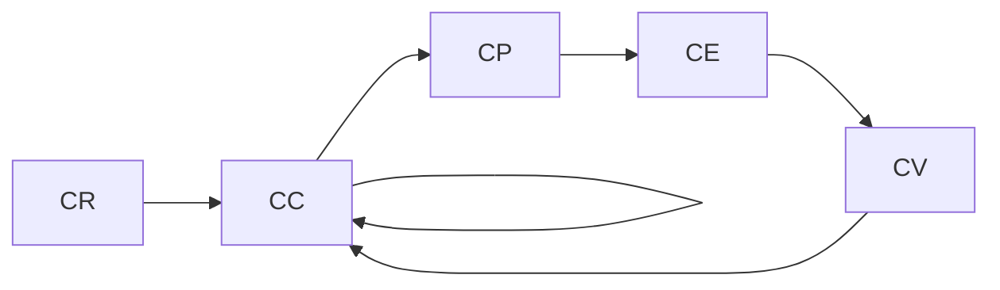

                 

# 软件2.0的变更管理策略

软件2.0时代，持续不断的技术革新和用户需求变化要求软件系统不断更新和演进，而变更管理成为保障软件持续健康运行的关键。本文从软件变更的必要性和重要性出发，详细探讨了软件变更管理策略的实现步骤、应用场景及面临的挑战，旨在为软件项目管理者提供实用的指导和建议。

## 1. 背景介绍

### 1.1 软件变更的必要性
在软件2.0时代，技术日新月异，用户体验需求快速变化。软件变更的必要性主要体现在以下方面：
- **技术演进**：新技术、新框架的出现要求软件系统进行升级，以满足性能和安全性需求。
- **功能扩展**：用户需求的变化要求软件添加新功能或优化现有功能。
- **安全修复**：软件漏洞和安全问题需要及时修复，以保障系统稳定性和用户数据安全。
- **法规合规**：政策和法规的变化要求软件系统进行合规性调整，以符合法律要求。

### 1.2 软件变更的重要性
软件变更管理得当，可以保障变更过程高效、透明，减少变更风险，提升用户满意度。其重要性体现在：
- **提升用户体验**：及时更新和优化功能，解决用户问题，提升用户体验。
- **增强系统稳定性**：及时修复漏洞和安全问题，保障系统稳定性。
- **实现业务目标**：确保变更与业务目标一致，提升业务价值。

## 2. 核心概念与联系

### 2.1 核心概念概述
软件变更管理是指对软件变更进行规划、执行、监控和评估的过程，旨在保证变更的顺利实施，同时降低变更风险。核心概念包括：

- **变更请求(Change Request, CR)**：对软件功能、性能、安全性等方面进行的修改请求。
- **变更控制(Change Control, CC)**：对变更请求进行评估、审批、实施和验证的过程。
- **变更计划(Change Plan, CP)**：为变更实施制定的详细计划，包括资源分配、时间安排、风险评估等。
- **变更执行(Change Execution, CE)**：按照变更计划实施变更请求的过程。
- **变更验证(Change Validation, CV)**：对变更结果进行测试和验证，确保变更满足要求。
- **变更闭环(Change Closure, CC)**：变更实施完成后，对变更过程进行总结和评估，更新相关文档和流程。

### 2.2 核心概念的联系
软件变更管理通过一套流程化的机制，将变更请求、控制、计划、执行、验证和闭环串联起来，确保变更的顺利实施。核心概念之间的联系可以通过以下Mermaid流程图表示：



## 3. 核心算法原理 & 具体操作步骤

### 3.1 算法原理概述
软件变更管理通过变更请求、控制、计划、执行、验证和闭环等步骤，确保变更的顺利实施。具体原理包括：

1. **变更请求管理**：对变更请求进行收集、分类和初步评估，确定变更的优先级和可行性。
2. **变更控制管理**：对变更请求进行评估、审批和优先级调整，确保变更符合业务需求和系统架构。
3. **变更计划管理**：为变更请求制定详细的实施计划，包括时间安排、资源分配和风险评估。
4. **变更执行管理**：按照变更计划实施变更请求，监控变更进度和风险。
5. **变更验证管理**：对变更结果进行测试和验证，确保变更满足要求。
6. **变更闭环管理**：变更实施完成后，对变更过程进行总结和评估，更新相关文档和流程。

### 3.2 算法步骤详解
软件变更管理的具体操作步骤如下：

1. **收集变更请求**：通过系统或人工方式收集变更请求，包括功能需求、性能优化、安全修复等。
2. **初步评估变更请求**：对变更请求进行分类和初步评估，确定变更的优先级和可行性。
3. **变更评估和审批**：对变更请求进行详细评估，包括技术可行性、影响范围、时间安排等，审批通过后进入变更计划管理。
4. **制定变更计划**：根据变更请求的评估结果，制定详细的变更计划，包括时间安排、资源分配、风险评估等。
5. **执行变更请求**：按照变更计划实施变更请求，监控变更进度和风险。
6. **测试和验证变更**：对变更结果进行测试和验证，确保变更满足要求。
7. **变更总结和评估**：变更实施完成后，对变更过程进行总结和评估，更新相关文档和流程。

### 3.3 算法优缺点
软件变更管理算法的优点包括：
- **流程化管理**：通过标准化流程，保障变更的规范性和一致性。
- **风险控制**：通过评估和审批，控制变更风险，减少负面影响。
- **透明度提升**：通过记录和跟踪变更过程，提升变更过程的透明度。
- **经验积累**：通过总结和评估，积累变更管理经验，提升变更管理能力。

缺点包括：
- **流程复杂**：流程复杂，需要大量时间和人力。
- **变更延迟**：变更流程较长，可能导致变更延迟。
- **成本高**：变更管理需要投入大量资源，成本较高。

### 3.4 算法应用领域
软件变更管理在软件开发、IT运维、业务系统更新等领域都有广泛应用。具体应用场景包括：

- **软件开发项目**：变更需求收集、评估、审批、计划、执行和验证。
- **IT运维**：系统升级、补丁安装、安全修复等变更管理。
- **业务系统更新**：功能扩展、性能优化、数据迁移等变更管理。

## 4. 数学模型和公式 & 详细讲解 & 举例说明

### 4.1 数学模型构建
软件变更管理的数学模型可以简化为以下公式：

$$
\text{变更管理} = \text{变更请求} \times \text{变更控制} \times \text{变更计划} \times \text{变更执行} \times \text{变更验证} \times \text{变更闭环}
$$

其中，每个因子表示软件变更管理的一个环节，通过乘法关系表示各个环节的协同作用。

### 4.2 公式推导过程
- **变更请求**：收集变更请求，包括需求描述、影响范围、优先级等。
- **变更控制**：对变更请求进行评估和审批，确定变更的可行性和优先级。
- **变更计划**：根据变更请求制定详细的计划，包括时间安排、资源分配、风险评估等。
- **变更执行**：按照变更计划实施变更请求，监控变更进度和风险。
- **变更验证**：对变更结果进行测试和验证，确保变更满足要求。
- **变更闭环**：变更实施完成后，对变更过程进行总结和评估，更新相关文档和流程。

### 4.3 案例分析与讲解
假设某企业需要进行系统升级，变更过程如下：
1. 收集变更请求：收集到系统升级的需求，包括新功能的增加和旧功能的优化。
2. 变更评估和审批：对需求进行评估和审批，确定升级的可行性和优先级。
3. 制定变更计划：制定详细的计划，包括升级时间、资源分配和风险评估。
4. 执行变更请求：按照计划实施升级，监控进度和风险。
5. 测试和验证变更：对升级结果进行测试和验证，确保系统稳定性和功能完备。
6. 变更总结和评估：升级完成后，对变更过程进行总结和评估，更新相关文档和流程。

## 5. 项目实践：代码实例和详细解释说明

### 5.1 开发环境搭建
- **安装JIRA**：选择JIRA作为变更管理系统，可以通过JIRA来收集、评估和审批变更请求。
- **安装Git**：使用Git进行代码版本控制，确保变更请求的跟踪和回溯。
- **安装Confluence**：使用Confluence来记录和分享变更相关的文档和报告。

### 5.2 源代码详细实现
以下是一个简化版的变更管理流程代码示例，通过Python实现：

```python
# 定义变更请求类
class ChangeRequest:
    def __init__(self, description, impact, priority):
        self.description = description
        self.impact = impact
        self.priority = priority

# 定义变更控制类
class ChangeControl:
    def __init__(self, project_id):
        self.project_id = project_id
        self.requests = []

    def add_request(self, request):
        self.requests.append(request)

    def review_requests(self):
        # 对变更请求进行评估和审批
        pass

    def prioritize_requests(self):
        # 对变更请求进行优先级调整
        pass

# 定义变更计划类
class ChangePlan:
    def __init__(self, project_id, request):
        self.project_id = project_id
        self.request = request
        self.time_arrangement = []
        self.resource_allocation = []

    def define_plan(self):
        # 制定变更计划
        pass

# 定义变更执行类
class ChangeExecution:
    def __init__(self, project_id, request):
        self.project_id = project_id
        self.request = request
        self.time_remaining = []
        self.risk_level = []

    def execute_request(self):
        # 按照变更计划实施变更请求
        pass

    def monitor_progress(self):
        # 监控变更进度和风险
        pass

# 定义变更验证类
class ChangeValidation:
    def __init__(self, project_id, request):
        self.project_id = project_id
        self.request = request
        self.test_results = []

    def validate_request(self):
        # 对变更结果进行测试和验证
        pass

# 定义变更闭环类
class ChangeClosure:
    def __init__(self, project_id, request):
        self.project_id = project_id
        self.request = request
        self.documents = []

    def summarize_request(self):
        # 变更实施完成后，对变更过程进行总结
        pass

    def update_documents(self):
        # 更新相关文档和流程
        pass

# 实现变更管理流程
def manage_changes(project_id):
    cc = ChangeControl(project_id)
    cp = ChangePlan(project_id, cc.requests[0])
    ce = ChangeExecution(project_id, cp.request)
    cv = ChangeValidation(project_id, ce.request)
    cc = ChangeClosure(project_id, cv.request)

    cc.add_request(ChangeRequest("系统升级", "高", "高"))
    cc.review_requests()
    cc.prioritize_requests()
    cp.define_plan()
    ce.execute_request()
    ce.monitor_progress()
    cv.validate_request()
    cc.summarize_request()
    cc.update_documents()
```

### 5.3 代码解读与分析
通过上述代码，我们可以看到软件变更管理的核心步骤。具体分析如下：
- **变更请求类(ChangeRequest)**：定义变更请求的属性和方法，包括描述、影响范围和优先级。
- **变更控制类(ChangeControl)**：收集变更请求，评估和审批变更请求，调整优先级。
- **变更计划类(ChangePlan)**：根据变更请求制定详细的计划，包括时间安排和资源分配。
- **变更执行类(ChangeExecution)**：按照计划实施变更请求，监控变更进度和风险。
- **变更验证类(ChangeValidation)**：对变更结果进行测试和验证，确保变更满足要求。
- **变更闭环类(ChangeClosure)**：变更实施完成后，对变更过程进行总结和评估，更新相关文档和流程。

## 6. 实际应用场景

### 6.1 软件开发项目
在软件开发项目中，变更管理尤为重要。项目需求、功能扩展、性能优化等都需要通过变更管理流程进行审批和实施。通过JIRA等工具，可以将变更请求、评估、审批、计划、执行和验证全流程化管理，提升项目管理效率。

### 6.2 IT运维
IT运维中，系统升级、补丁安装、安全修复等变更管理是日常工作的重要内容。通过Confluence记录变更流程和文档，使用Git进行代码版本控制，可以确保变更的可追溯性和安全性。

### 6.3 业务系统更新
业务系统更新包括功能扩展、性能优化、数据迁移等。通过变更管理流程，可以规范变更过程，减少变更风险，提升业务系统的稳定性和用户体验。

## 7. 工具和资源推荐

### 7.1 学习资源推荐
- **《变更管理最佳实践》**：提供变更管理的基本知识和最佳实践。
- **《变更管理工具使用指南》**：详细介绍JIRA、Confluence等变更管理工具的使用。
- **《软件变更管理》在线课程**：通过在线课程学习变更管理的核心技术和应用案例。

### 7.2 开发工具推荐
- **JIRA**：变更管理工具，支持需求收集、评估、审批、计划、执行和验证。
- **Confluence**：文档管理系统，支持记录变更流程和文档。
- **Git**：版本控制系统，支持代码版本控制和变更跟踪。

### 7.3 相关论文推荐
- **《变更管理实践与挑战》**：探讨软件变更管理的实践和挑战。
- **《软件变更管理技术综述》**：详细介绍变更管理的核心技术和应用场景。
- **《变更管理算法的优化研究》**：对变更管理算法的优化进行研究，提升变更管理的效率和效果。

## 8. 总结：未来发展趋势与挑战

### 8.1 研究成果总结
软件变更管理是软件2.0时代的关键技术之一，通过规范化的流程和工具，保障变更的顺利实施，降低变更风险，提升软件系统的稳定性和用户体验。研究成果主要体现在以下方面：
- **流程化管理**：通过标准化的变更管理流程，提升变更管理的规范性和一致性。
- **风险控制**：通过评估和审批，控制变更风险，减少负面影响。
- **透明度提升**：通过记录和跟踪变更过程，提升变更过程的透明度。
- **经验积累**：通过总结和评估，积累变更管理经验，提升变更管理能力。

### 8.2 未来发展趋势
未来软件变更管理的发展趋势包括：
- **自动化工具普及**：更多自动化工具将应用于变更管理，提升变更管理效率。
- **云计算和DevOps结合**：云计算和DevOps工具的结合，将进一步简化变更管理流程。
- **AI辅助变更管理**：引入AI技术，提升变更管理的智能化水平，如通过机器学习预测变更风险。

### 8.3 面临的挑战
软件变更管理面临的挑战包括：
- **流程复杂**：流程复杂，需要大量时间和人力。
- **变更延迟**：变更流程较长，可能导致变更延迟。
- **成本高**：变更管理需要投入大量资源，成本较高。

### 8.4 研究展望
未来软件变更管理的研究展望包括：
- **多渠道变更管理**：将变更管理与其他技术手段结合，提升变更管理效率。
- **敏捷变更管理**：采用敏捷管理方法，提升变更管理的灵活性和适应性。
- **跨部门变更管理**：将变更管理贯穿软件生命周期，提升变更管理的全过程管理能力。

## 9. 附录：常见问题与解答

**Q1: 如何收集和处理变更请求？**

A: 收集变更请求可以通过系统收集或人工记录。处理变更请求需要进行分类和初步评估，确定变更的优先级和可行性。

**Q2: 变更评估和审批流程如何设计？**

A: 变更评估和审批流程需要明确标准和责任，通过系统工具进行记录和管理。评估和审批过程中需要考虑技术可行性、影响范围、时间安排等因素。

**Q3: 如何制定详细的变更计划？**

A: 制定变更计划需要充分了解变更需求，制定详细的时间安排和资源分配，并评估风险。可以通过项目管理工具进行计划制定和跟踪。

**Q4: 变更执行过程中如何监控进度和风险？**

A: 变更执行过程中需要建立监控机制，跟踪变更进度，评估风险，及时调整计划。可以使用项目管理工具进行进度跟踪和风险管理。

**Q5: 变更验证过程中需要注意哪些关键点？**

A: 变更验证过程中需要测试变更结果，验证其满足要求。需要注意测试用例的覆盖率、测试结果的可靠性等关键点。

通过本文对软件2.0变更管理策略的详细介绍，希望能为软件开发、IT运维和业务系统更新等领域的项目管理者提供实用的指导和建议。软件变更管理是保障软件系统持续健康运行的关键，需要我们在实践中不断探索和优化。

