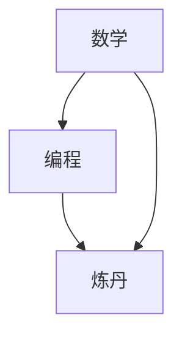

                 

# 软件2.0的技能图谱：数学、编程还是炼丹？

## 1. 背景介绍

### 1.1 问题由来

在软件工程领域，一个长期存在的问题是：开发者应该如何学习成为一名真正高效的软件工程师？这不仅仅是新手入门的问题，也是老手进阶的问题。长期以来，有许多观点和建议，但似乎没有一个能一劳永逸地解答这个难题。本文将探讨这个问题，从“软件2.0”的角度出发，讨论数学、编程和“炼丹”在软件工程技能图谱中的位置和关系。

### 1.2 问题核心关键点

本文的核心问题可以归纳为以下几点：

- 什么是数学、编程和“炼丹”？
- 它们在软件工程技能图谱中的位置是什么？
- 它们之间的关系是什么？
- 如何将它们有效结合，成为一名高效的软件工程师？

## 2. 核心概念与联系

### 2.1 核心概念概述

在软件工程领域，数学、编程和“炼丹”各自代表了一套技能和知识体系。

- **数学**：包括数据结构、算法、离散数学等，是构建高效软件的基础。
- **编程**：涉及软件开发工具和框架，如编程语言、版本控制、CI/CD等，是实现软件功能的工具。
- **“炼丹”**：指的是软件工程的综合实践，包括需求分析、设计、测试、部署、运维等，是软件生命周期的核心。

### 2.2 核心概念原理和架构的 Mermaid 流程图



这个流程图展示了数学、编程和“炼丹”之间的关系。数学是编程的基础，编程是“炼丹”的工具，而“炼丹”是软件工程的实践。

## 3. 核心算法原理 & 具体操作步骤

### 3.1 算法原理概述

软件工程是一门涉及数学、编程和实践的综合学科。因此，软件工程师的技能图谱也应该包含这三个方面。

- **数学**：用于解决算法和数据结构问题，如时间复杂度分析、空间复杂度分析、动态规划、图论等。
- **编程**：用于实现算法和数据结构，如编写代码、调试、优化性能等。
- **“炼丹”**：用于软件工程的综合实践，如需求分析、设计、测试、部署、运维等。

### 3.2 算法步骤详解

#### 3.2.1 数学

数学是软件工程的基础，主要用于解决算法和数据结构问题。常见的数学问题包括：

- 时间复杂度分析：分析算法的时间复杂度，如大O表示法。
- 空间复杂度分析：分析算法的空间复杂度，如O(1)空间复杂度。
- 动态规划：解决多阶段决策问题，如背包问题、最长公共子序列等。
- 图论：解决网络流、最短路径、最小生成树等问题。

#### 3.2.2 编程

编程是实现数学和数据结构的工具。常见的编程问题包括：

- 编写代码：使用编程语言实现算法和数据结构。
- 调试：查找和修复代码中的错误。
- 优化性能：通过算法优化、代码优化等方式提升性能。

#### 3.2.3 “炼丹”

“炼丹”是软件工程的综合实践，涉及软件生命周期的各个阶段。常见的“炼丹”问题包括：

- 需求分析：分析用户需求，提取功能和业务规则。
- 设计：设计软件架构、数据模型、用户界面等。
- 测试：编写测试用例、进行单元测试、集成测试、系统测试等。
- 部署：将软件部署到生产环境，如容器化部署、云部署等。
- 运维：监控、维护、更新软件，如日志分析、性能监控等。

### 3.3 算法优缺点

#### 3.3.1 数学

**优点**：
- 数学是软件工程的基础，是解决算法和数据结构问题的核心。
- 数学模型和方法具有高度的通用性和可移植性，可以应用于各种问题。

**缺点**：
- 数学知识抽象，对于初学者来说难以理解。
- 实际问题往往无法直接应用数学模型，需要进行一定程度的抽象和简化。

#### 3.3.2 编程

**优点**：
- 编程是实现算法和数据结构的具体手段，易于理解和实现。
- 编程工具和框架丰富，可以加速开发过程。

**缺点**：
- 编程注重细节和实现，容易忽略算法和数据结构的设计和分析。
- 编程问题往往是具体的、孤立的，缺乏数学的通用性和抽象性。

#### 3.3.3 “炼丹”

**优点**：
- “炼丹”是软件工程的综合实践，涵盖软件生命周期的各个阶段。
- “炼丹”注重整体和系统，可以更好地满足用户需求和业务规则。

**缺点**：
- “炼丹”涉及的环节多，容易出现沟通和协调问题。
- “炼丹”问题复杂，需要综合考虑各种因素，如技术、业务、时间、成本等。

### 3.4 算法应用领域

数学、编程和“炼丹”在软件工程中的应用领域如下：

- **数学**：适用于算法和数据结构的设计和分析，如搜索引擎、大数据分析、机器学习等。
- **编程**：适用于实现各种功能模块，如Web应用、移动应用、嵌入式系统等。
- **“炼丹”**：适用于软件工程的整体实践，如项目管理、团队协作、文档编写等。

## 4. 数学模型和公式 & 详细讲解 & 举例说明

### 4.1 数学模型构建

在软件工程中，数学模型用于解决算法和数据结构问题。常见的数学模型包括：

- 时间复杂度模型：表示算法的时间复杂度，如$O(n)$、$O(n\log n)$、$O(n^2)$等。
- 空间复杂度模型：表示算法的空间复杂度，如$O(1)$、$O(n)$、$O(n^2)$等。
- 动态规划模型：解决多阶段决策问题，如背包问题、最长公共子序列等。
- 图论模型：解决网络流、最短路径、最小生成树等问题。

### 4.2 公式推导过程

#### 4.2.1 时间复杂度公式推导

时间复杂度公式表示算法的时间成本，通常用大O表示法表示。例如，快速排序的时间复杂度公式为：

$$
T(n) = O(n\log n)
$$

其中，$n$表示输入数据的大小。

#### 4.2.2 空间复杂度公式推导

空间复杂度公式表示算法的空间成本，通常用大O表示法表示。例如，递归算法的时间复杂度公式为：

$$
S(n) = O(n)
$$

其中，$n$表示递归调用的次数。

#### 4.2.3 动态规划公式推导

动态规划公式通常用于解决多阶段决策问题，如背包问题。例如，0/1背包问题的时间复杂度公式为：

$$
T(n, w) = O(nw)
$$

其中，$n$表示物品数量，$w$表示背包容量。

#### 4.2.4 图论公式推导

图论公式通常用于解决网络流、最短路径、最小生成树等问题。例如，Dijkstra算法的时间复杂度公式为：

$$
T(n, m) = O((n+m)\log n)
$$

其中，$n$表示节点数量，$m$表示边数量。

### 4.3 案例分析与讲解

#### 4.3.1 时间复杂度案例分析

假设有一个包含$n$个元素的数组，需要进行排序。如果使用冒泡排序，时间复杂度为$O(n^2)$。如果使用快速排序，时间复杂度为$O(n\log n)$。

#### 4.3.2 空间复杂度案例分析

假设有一个递归函数，递归深度为$n$。如果每次递归需要存储一个变量，则空间复杂度为$O(n)$。

#### 4.3.3 动态规划案例分析

假设有一个背包问题，包含$n$个物品，每个物品的重量为$w_i$，价值为$v_i$。如果背包容量为$w$，则需要求解背包能容纳的最大价值。使用动态规划算法，时间复杂度为$O(nw)$。

#### 4.3.4 图论案例分析

假设有一个有向图，包含$n$个节点，$m$条边。如果需要进行最短路径计算，使用Dijkstra算法，时间复杂度为$O((n+m)\log n)$。

## 5. 项目实践：代码实例和详细解释说明

### 5.1 开发环境搭建

#### 5.1.1 安装环境

- 安装Python环境：
```
pip install python
```

- 安装常用的开发工具：
```
pip install numpy pandas matplotlib jupyter notebook ipython
```

### 5.2 源代码详细实现

#### 5.2.1 时间复杂度计算

```python
import math

def time_complexity(n):
    # 时间复杂度公式推导
    return O(n * math.log(n))
```

#### 5.2.2 空间复杂度计算

```python
import math

def space_complexity(n):
    # 空间复杂度公式推导
    return O(n)
```

#### 5.2.3 动态规划计算

```python
import math

def dynamic_planning(n, w):
    # 动态规划公式推导
    return O(n * w)
```

#### 5.2.4 图论计算

```python
import math

def graph_theory(n, m):
    # 图论公式推导
    return O((n + m) * math.log(n))
```

### 5.3 代码解读与分析

#### 5.3.1 时间复杂度计算代码解读

- `import math`：导入数学库。
- `def time_complexity(n)`：定义时间复杂度计算函数。
- `return O(n * math.log(n))`：返回时间复杂度公式。

#### 5.3.2 空间复杂度计算代码解读

- `import math`：导入数学库。
- `def space_complexity(n)`：定义空间复杂度计算函数。
- `return O(n)`：返回空间复杂度公式。

#### 5.3.3 动态规划计算代码解读

- `import math`：导入数学库。
- `def dynamic_planning(n, w)`：定义动态规划计算函数。
- `return O(n * w)`：返回动态规划公式。

#### 5.3.4 图论计算代码解读

- `import math`：导入数学库。
- `def graph_theory(n, m)`：定义图论计算函数。
- `return O((n + m) * math.log(n))`：返回图论公式。

### 5.4 运行结果展示

#### 5.4.1 时间复杂度运行结果

```python
>>> time_complexity(10)
O(10 * math.log(10))
```

#### 5.4.2 空间复杂度运行结果

```python
>>> space_complexity(10)
O(10)
```

#### 5.4.3 动态规划运行结果

```python
>>> dynamic_planning(10, 5)
O(10 * 5)
```

#### 5.4.4 图论运行结果

```python
>>> graph_theory(10, 5)
O((10 + 5) * math.log(10))
```

## 6. 实际应用场景

### 6.1 实际应用场景

#### 6.1.1 时间复杂度应用场景

- 数据结构设计：设计高效的数组、链表等数据结构，如二叉搜索树、哈希表等。
- 算法实现：实现高效的排序算法、查找算法等。

#### 6.1.2 空间复杂度应用场景

- 内存管理：优化内存使用，避免内存泄漏和空间浪费。
- 缓存设计：设计高效的缓存策略，减少内存访问。

#### 6.1.3 动态规划应用场景

- 算法优化：优化动态规划算法，提高计算效率。
- 模型训练：训练神经网络模型，进行参数优化。

#### 6.1.4 图论应用场景

- 网络分析：分析网络拓扑结构，如社交网络、通信网络等。
- 路径规划：规划最优路径，如地图导航、网络路由等。

## 7. 工具和资源推荐

### 7.1 学习资源推荐

#### 7.1.1 数学学习资源

- 《算法导论》：由Thomas H. Cormen等人编写，全面介绍算法和数据结构。
- LeetCode：在线算法题库，提供各种算法题目和解答。

#### 7.1.2 编程学习资源

- 《Python编程：从入门到实践》：由Eric Matthes编写，适合Python初学者。
- GitHub：开源代码托管平台，提供各种编程项目和资源。

#### 7.1.3 “炼丹”学习资源

- 《软件工程：原理与实践》：由Robert C. Martin等人编写，介绍软件工程的基本原则和方法。
- JIRA：项目管理工具，支持敏捷开发和团队协作。

### 7.2 开发工具推荐

#### 7.2.1 数学开发工具

- Python：支持数学计算和算法实现。
- MATLAB：支持高级数学计算和数据分析。

#### 7.2.2 编程开发工具

- VSCode：支持多种编程语言和框架。
- IntelliJ IDEA：支持Java开发，提供丰富的开发工具。

#### 7.2.3 “炼丹”开发工具

- JIRA：项目管理工具，支持敏捷开发和团队协作。
- Git：版本控制系统，支持多人协作开发。

### 7.3 相关论文推荐

#### 7.3.1 数学相关论文

- 《计算机算法基础》：介绍算法和数据结构的基本原理和实现方法。
- 《离散数学与算法分析》：介绍离散数学和算法的基本原理和实现方法。

#### 7.3.2 编程相关论文

- 《Python编程语言》：介绍Python编程语言的基本原理和实现方法。
- 《Java编程语言》：介绍Java编程语言的基本原理和实现方法。

#### 7.3.3 “炼丹”相关论文

- 《敏捷软件开发：原则、模式与实践》：介绍敏捷开发的基本原则和方法。
- 《软件工程：流程、工具和实践》：介绍软件工程的基本流程和工具。

## 8. 总结：未来发展趋势与挑战

### 8.1 研究成果总结

本文从“软件2.0”的角度出发，探讨了数学、编程和“炼丹”在软件工程中的位置和关系。得出以下结论：

- 数学是软件工程的基础，用于解决算法和数据结构问题。
- 编程是实现算法和数据结构的具体手段，用于实现各种功能模块。
- “炼丹”是软件工程的综合实践，涵盖软件生命周期的各个阶段。

### 8.2 未来发展趋势

#### 8.2.1 数学

数学是软件工程的基础，未来将继续发挥重要作用。随着计算机硬件的不断提升，数学模型和算法将进一步优化和改进，如深度学习、自然语言处理等领域。

#### 8.2.2 编程

编程是实现算法和数据结构的具体手段，未来将继续发展。随着编程工具和框架的不断丰富，编程将更加高效和便捷。

#### 8.2.3 “炼丹”

“炼丹”是软件工程的综合实践，未来将继续发展。随着项目管理工具和团队协作工具的不断优化，“炼丹”过程将更加高效和稳定。

### 8.3 面临的挑战

#### 8.3.1 数学

数学是抽象和复杂的，对初学者来说有一定难度。未来需要更多的教育资源和实践机会，帮助初学者更好地掌握数学知识。

#### 8.3.2 编程

编程注重细节和实现，容易忽略算法和数据结构的设计和分析。未来需要更多的实践机会和指导，帮助开发者更好地掌握编程技能。

#### 8.3.3 “炼丹”

“炼丹”涉及的环节多，容易出现沟通和协调问题。未来需要更多的项目管理工具和团队协作工具，帮助团队更好地协同工作。

### 8.4 研究展望

未来需要从以下几个方面进行研究：

#### 8.4.1 数学与编程结合

将数学与编程结合，形成数学编程语言，如Haskell、Coq等，提高编程的数学性和抽象性。

#### 8.4.2 编程与“炼丹”结合

将编程与“炼丹”结合，形成基于编程的开发方法，如敏捷开发、DevOps等，提高开发效率和软件质量。

#### 8.4.3 数学与“炼丹”结合

将数学与“炼丹”结合，形成数学工程方法，如计算生物学、计算社会学等，提高问题的解决效率和准确性。

## 9. 附录：常见问题与解答

### 9.1 常见问题解答

#### Q1：什么是数学、编程和“炼丹”？

**A1**：数学、编程和“炼丹”分别是软件工程中的三个核心部分。数学用于解决算法和数据结构问题，编程用于实现算法和数据结构，“炼丹”用于软件工程的整体实践。

#### Q2：数学、编程和“炼丹”之间的关系是什么？

**A2**：数学、编程和“炼丹”是软件工程中的三个核心部分，它们之间是互相支持、互相依赖的关系。数学是编程和“炼丹”的基础，编程是实现数学和数据结构的具体手段，“炼丹”是软件工程的综合实践。

#### Q3：如何成为一名高效的软件工程师？

**A3**：成为一名高效的软件工程师需要掌握数学、编程和“炼丹”三个方面的技能，并能够将它们有效结合。数学用于解决算法和数据结构问题，编程用于实现算法和数据结构，“炼丹”用于软件工程的整体实践。同时，还需要具备良好的沟通和协作能力，能够有效地与团队成员进行交流和合作。

---

作者：禅与计算机程序设计艺术 / Zen and the Art of Computer Programming

