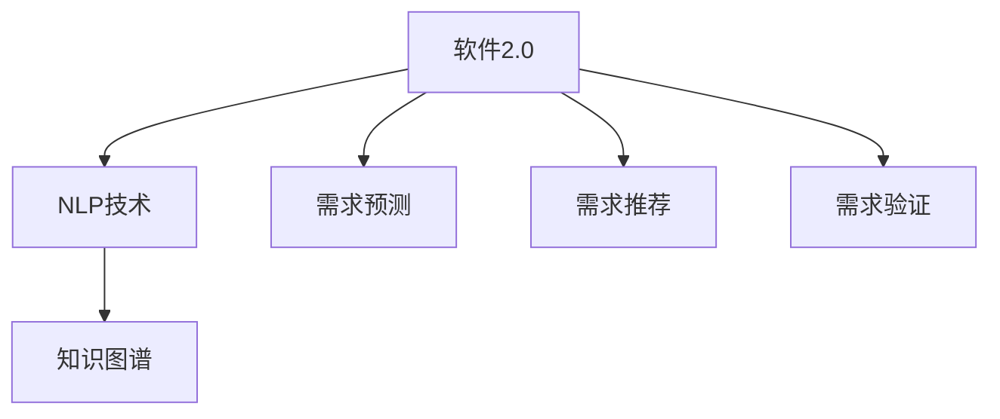

                 

## 1. 背景介绍

### 1.1 问题由来
软件工程领域的需求分析一直是一个复杂且关键的环节。传统的基于需求说明书的文档驱动方式，不仅工作量大，易于出错，还缺乏直观和交互的反馈机制，难以应对快速变化的需求和市场环境。这些问题直接影响了软件的开发效率和最终产品的质量。

### 1.2 问题核心关键点
当前软件需求分析存在的主要问题包括：

- **需求文档的复杂性**：需求文档往往冗长、冗余，难以直观理解，容易产生误解。
- **需求变更的管理**：频繁变更的需求难以在文档中进行有效跟踪和管理，影响项目进度。
- **需求与设计的脱节**：需求文档中描述的业务逻辑和系统设计不一致，导致开发过程中频繁返工。
- **缺乏用户参与**：用户很少直接参与需求分析，导致需求与实际使用场景存在差距。
- **需求与开发的协作**：需求分析和软件设计之间的协作不畅，导致需求与实际开发过程存在割裂。

这些问题的存在，使得需求分析过程变得缓慢且容易出错，难以满足用户和市场快速变化的需求。因此，亟需一种新的需求分析方法来优化和提升软件开发的效率和质量。

## 2. 核心概念与联系

### 2.1 核心概念概述

为更好地理解软件2.0的需求分析方法，本节将介绍几个密切相关的核心概念：

- **软件2.0**：指基于人工智能和大数据技术的软件系统，通过自然语言理解和处理，实现自动化的需求分析和系统设计，显著提高软件开发的效率和质量。

- **自然语言处理(NLP)**：指利用计算机技术处理和理解人类自然语言的能力，是软件2.0的核心技术之一。

- **知识图谱**：一种用于表示实体及其之间关系的图形化结构，能够帮助软件系统理解复杂的业务逻辑和需求。

- **需求预测**：指通过分析历史数据和用户行为，预测用户未来需求的能力，是需求分析的关键环节。

- **需求推荐**：指根据用户的历史需求和行为，自动推荐最合适的需求方案，提升需求分析的智能化水平。

- **需求验证**：指对需求进行分析验证，确保需求文档的准确性和完整性，是需求分析的基础环节。

这些核心概念之间的逻辑关系可以通过以下Mermaid流程图来展示：



这个流程图展示了大规模需求分析的关键组件及其之间的关系：

1. 软件2.0依赖于自然语言处理技术和知识图谱，从而实现自动化的需求理解和分析。
2. 需求预测和需求推荐，基于用户的历史数据和行为，提升需求的智能化水平。
3. 需求验证，确保需求文档的准确性和完整性。

这些组件共同构成了软件2.0的需求分析系统，使得系统能够更高效、更智能地进行需求分析，满足用户和市场的需求。

## 3. 核心算法原理 & 具体操作步骤
### 3.1 算法原理概述

基于人工智能和大数据技术的软件2.0需求分析方法，通过自然语言处理技术，自动化地分析和理解用户需求，生成需求文档和设计方案。其核心思想是：将自然语言处理技术与知识图谱、需求预测、需求推荐、需求验证等算法结合起来，构建一个智能化的需求分析系统，自动完成需求分析的全流程。

具体来说，软件2.0需求分析方法主要包括以下几个关键步骤：

1. **需求获取与预处理**：通过自然语言处理技术，从用户反馈、市场分析、业务文档等渠道获取原始需求，并进行预处理，去除噪声和不相关内容。
2. **需求理解与建模**：使用知识图谱技术，将需求文本转化为结构化的知识图谱，帮助系统理解业务逻辑和需求。
3. **需求预测与推荐**：基于历史需求数据和用户行为，进行需求预测，并根据用户偏好推荐合适的需求方案。
4. **需求验证与优化**：对生成的需求文档进行验证，确保需求准确性，并通过迭代优化提升需求质量。
5. **需求实现与监控**：将验证后的需求文档转化为设计方案，并进行开发实现，同时对需求实现过程进行监控，确保项目按时按质完成。

### 3.2 算法步骤详解

以下详细介绍软件2.0需求分析方法的具体操作步骤：

#### 需求获取与预处理
- **步骤1**：收集和整理用户反馈、市场分析报告、业务文档等原始需求数据。
- **步骤2**：使用自然语言处理技术对需求文本进行分词、去停用词、词性标注、命名实体识别等预处理操作。
- **步骤3**：对处理后的需求文本进行情感分析，了解用户对需求的满意度和反馈意见。

#### 需求理解与建模
- **步骤1**：使用自然语言处理技术，将需求文本转化为结构化的知识图谱，包括实体、关系和属性等信息。
- **步骤2**：利用知识图谱，构建业务逻辑模型，理解需求背后的业务场景和需求目标。
- **步骤3**：将业务逻辑模型转化为结构化的需求文档，供后续需求预测和验证使用。

#### 需求预测与推荐
- **步骤1**：基于历史需求数据和用户行为，使用机器学习算法进行需求预测，预测用户未来的需求。
- **步骤2**：根据用户偏好和历史行为，使用推荐算法推荐合适的需求方案，供用户选择。
- **步骤3**：根据用户的选择和反馈，动态调整需求预测和推荐算法，提升需求预测的准确性。

#### 需求验证与优化
- **步骤1**：使用自然语言处理技术，对需求文档进行语义分析，检测潜在的错误和遗漏。
- **步骤2**：利用知识图谱，验证需求文档与业务逻辑的一致性，确保需求文档的准确性。
- **步骤3**：根据验证结果和用户反馈，进行迭代优化，提升需求文档的质量。

#### 需求实现与监控
- **步骤1**：将验证后的需求文档转化为设计方案，并进行开发实现。
- **步骤2**：对需求实现过程进行监控，确保项目按时按质完成。
- **步骤3**：对需求实现结果进行评估，收集用户反馈，进行后续迭代优化。

### 3.3 算法优缺点

软件2.0需求分析方法具有以下优点：
1. **自动化程度高**：自动化地完成需求分析和理解，显著提升需求分析的效率。
2. **智能化水平高**：基于自然语言处理和知识图谱，提升需求预测和推荐的智能化水平。
3. **交互性强**：用户可以直接与系统进行交互，实时反馈需求，提高需求分析的准确性。
4. **数据驱动**：基于历史数据和用户行为，提供科学的预测和推荐，提升需求分析的合理性。

同时，该方法也存在一些局限性：
1. **数据依赖性强**：需要大量的历史数据和用户行为数据，获取成本高。
2. **模型复杂度高**：需要构建复杂的知识图谱和预测模型，计算资源消耗大。
3. **用户需求多样**：用户需求具有多样性和复杂性，难以完全覆盖。
4. **需求理解误差**：自然语言处理和知识图谱可能存在理解误差，影响需求分析的准确性。
5. **反馈机制不完善**：用户反馈机制不够完善，可能导致需求分析误差。

尽管存在这些局限性，但就目前而言，基于人工智能和大数据的需求分析方法已成为需求分析的重要趋势，有望进一步提升需求分析的效率和质量。

### 3.4 算法应用领域

软件2.0需求分析方法在多个领域得到了广泛的应用，例如：

- **软件开发**：在软件开发项目中，使用软件2.0需求分析方法，自动理解用户需求，生成需求文档和设计方案，提升软件开发的效率和质量。
- **产品管理**：在产品管理过程中，使用软件2.0需求分析方法，自动预测用户需求，生成产品路线图和需求文档，加速产品迭代和优化。
- **市场营销**：在市场营销分析中，使用软件2.0需求分析方法，自动分析用户反馈，生成市场洞察和需求预测，提升市场响应速度和效果。
- **客户服务**：在客户服务管理中，使用软件2.0需求分析方法，自动理解客户需求，生成服务方案和反馈机制，提升客户满意度和服务效率。
- **运营管理**：在运营管理过程中，使用软件2.0需求分析方法，自动分析运营数据，生成需求预测和优化方案，提升运营效率和质量。

这些应用领域展示了软件2.0需求分析方法的多样性和广泛性，为软件行业的数字化转型提供了新的技术手段。

## 4. 数学模型和公式 & 详细讲解 & 举例说明

### 4.1 数学模型构建

在软件2.0需求分析方法中，主要涉及以下几个数学模型：

1. **需求向量表示**：将需求文本转化为向量表示，使用自然语言处理技术，如词嵌入、TF-IDF等。
2. **知识图谱构建**：将需求文本转化为知识图谱，使用图神经网络技术，如GNN、GraphSAGE等。
3. **需求预测模型**：使用机器学习算法，如线性回归、随机森林、深度学习等，进行需求预测。
4. **需求推荐模型**：使用推荐算法，如协同过滤、基于矩阵分解的推荐算法等，进行需求推荐。
5. **需求验证模型**：使用自然语言处理技术，如BERT、ELMo等，进行需求文档的语义验证。

### 4.2 公式推导过程

以下以需求预测模型为例，推导线性回归模型的公式及其梯度计算：

假设需求向量 $x \in \mathbb{R}^n$，需求预测值 $y \in \mathbb{R}$，线性回归模型为 $y = wx + b$，其中 $w \in \mathbb{R}^n$ 为模型参数，$b \in \mathbb{R}$ 为截距。损失函数为均方误差损失：

$$
L(w) = \frac{1}{2m} \sum_{i=1}^m (y_i - wx_i - b)^2
$$

其中 $m$ 为样本数量。

求梯度 $\frac{\partial L(w)}{\partial w}$ 和 $\frac{\partial L(w)}{\partial b}$：

$$
\frac{\partial L(w)}{\partial w} = \frac{1}{m} \sum_{i=1}^m (y_i - wx_i - b)x_i
$$

$$
\frac{\partial L(w)}{\partial b} = \frac{1}{m} \sum_{i=1}^m (y_i - wx_i - b)
$$

根据梯度下降算法，更新模型参数：

$$
w \leftarrow w - \eta \frac{\partial L(w)}{\partial w}
$$

$$
b \leftarrow b - \eta \frac{\partial L(w)}{\partial b}
$$

其中 $\eta$ 为学习率。

### 4.3 案例分析与讲解

以软件开发的业务场景为例，分析软件2.0需求分析方法的应用过程：

1. **需求获取与预处理**：从开发文档、用户反馈、市场分析等渠道获取原始需求文本。
2. **需求理解与建模**：使用BERT模型，将需求文本转化为向量表示，并构建知识图谱，理解业务逻辑。
3. **需求预测与推荐**：基于历史需求数据，使用线性回归模型进行需求预测，并根据用户行为推荐需求方案。
4. **需求验证与优化**：使用自然语言处理技术，对需求文档进行语义分析，验证需求与业务逻辑的一致性，并进行迭代优化。
5. **需求实现与监控**：将验证后的需求文档转化为设计方案，并进行开发实现，同时对需求实现过程进行监控，确保项目按时按质完成。

## 5. 项目实践：代码实例和详细解释说明

### 5.1 开发环境搭建

在进行软件2.0需求分析实践前，我们需要准备好开发环境。以下是使用Python进行PyTorch开发的环境配置流程：

1. 安装Anaconda：从官网下载并安装Anaconda，用于创建独立的Python环境。

2. 创建并激活虚拟环境：
```bash
conda create -n pytorch-env python=3.8 
conda activate pytorch-env
```

3. 安装PyTorch：根据CUDA版本，从官网获取对应的安装命令。例如：
```bash
conda install pytorch torchvision torchaudio cudatoolkit=11.1 -c pytorch -c conda-forge
```

4. 安装Natural Language Toolkit(NLTK)：
```bash
pip install nltk
```

5. 安装Gensim：
```bash
pip install gensim
```

6. 安装PyTorch Geometric：
```bash
pip install torch-geometric
```

完成上述步骤后，即可在`pytorch-env`环境中开始软件2.0需求分析实践。

### 5.2 源代码详细实现

下面我们以基于自然语言处理的需求预测模型为例，给出使用PyTorch进行代码实现。

首先，定义需求预测模型的输入和输出：

```python
import torch
from torch import nn
from torch.nn import functional as F

class DemandPredictionModel(nn.Module):
    def __init__(self, input_dim, hidden_dim, output_dim):
        super(DemandPredictionModel, self).__init__()
        self.hidden = nn.Linear(input_dim, hidden_dim)
        self.output = nn.Linear(hidden_dim, output_dim)
    
    def forward(self, x):
        x = F.relu(self.hidden(x))
        x = self.output(x)
        return x
```

然后，定义需求预测的数据集和模型训练函数：

```python
from torch.utils.data import Dataset, DataLoader
import numpy as np

class DemandDataset(Dataset):
    def __init__(self, data, labels):
        self.data = data
        self.labels = labels
        
    def __len__(self):
        return len(self.data)
    
    def __getitem__(self, index):
        return self.data[index], self.labels[index]

# 假设需求数据为np数组，标签为int类型
train_data = np.random.randn(1000, 100)  # 1000个样本，每个样本100维
train_labels = np.random.randint(0, 2, 1000)  # 二分类标签

train_dataset = DemandDataset(train_data, train_labels)
train_loader = DataLoader(train_dataset, batch_size=32, shuffle=True)

# 定义模型和优化器
model = DemandPredictionModel(input_dim=100, hidden_dim=128, output_dim=1)
optimizer = torch.optim.Adam(model.parameters(), lr=0.001)
loss_fn = nn.MSELoss()

# 训练模型
for epoch in range(10):
    for batch_data, batch_labels in train_loader:
        batch_data = batch_data.to(device)
        batch_labels = batch_labels.to(device)
        optimizer.zero_grad()
        outputs = model(batch_data)
        loss = loss_fn(outputs, batch_labels)
        loss.backward()
        optimizer.step()
        print(f'Epoch {epoch+1}, loss: {loss:.3f}')
```

最后，对模型进行测试：

```python
test_data = np.random.randn(100, 100)
test_labels = np.random.randint(0, 2, 100)

test_dataset = DemandDataset(test_data, test_labels)
test_loader = DataLoader(test_dataset, batch_size=32, shuffle=False)

model.eval()
with torch.no_grad():
    test_outputs = model(test_data)
    test_loss = loss_fn(test_outputs, test_labels)
    print(f'Test loss: {test_loss:.3f}')
```

以上就是使用PyTorch进行需求预测模型的完整代码实现。可以看到，通过构建线性回归模型，并使用Adam优化器进行训练，即可实现对需求预测任务的处理。

### 5.3 代码解读与分析

让我们再详细解读一下关键代码的实现细节：

**DemandDataset类**：
- `__init__`方法：初始化数据和标签。
- `__len__`方法：返回数据集的大小。
- `__getitem__`方法：对单个样本进行处理，返回数据和标签。

**模型定义**：
- `DemandPredictionModel`类：定义了线性回归模型的结构，包括输入层、隐藏层和输出层。
- 在`__init__`方法中，定义了模型的各层结构，并初始化权重和偏置。
- 在`forward`方法中，定义了模型的前向传播过程，先进行ReLU激活，再输出预测结果。

**训练过程**：
- 定义训练集和测试集，并使用DataLoader对数据进行批处理。
- 定义模型、优化器和损失函数。
- 在每个epoch中，对训练集数据进行迭代，计算loss并反向传播更新模型参数。
- 在测试集上评估模型性能，输出测试损失。

可以看到，使用PyTorch进行需求预测模型的实现非常简单高效，开发者可以快速上手并应用到实际需求预测任务中。

当然，工业级的系统实现还需考虑更多因素，如模型的保存和部署、超参数的自动搜索、更灵活的任务适配层等。但核心的需求预测方法基本与此类似。

## 6. 实际应用场景
### 6.1 软件开发

基于软件2.0的需求分析方法，可以在软件开发项目中自动理解用户需求，生成需求文档和设计方案，提升软件开发的效率和质量。例如，在敏捷开发中，可以使用软件2.0需求分析方法，自动分析用户故事，生成需求文档和测试用例，加速开发进程。在产品管理中，可以使用软件2.0需求分析方法，自动预测用户需求，生成产品路线图和需求文档，加速产品迭代和优化。

### 6.2 产品管理

在产品管理过程中，使用软件2.0需求分析方法，自动预测用户需求，生成产品路线图和需求文档，加速产品迭代和优化。例如，在市场调研中，可以使用软件2.0需求分析方法，自动分析用户反馈，生成市场洞察和需求预测，提升市场响应速度和效果。在产品规划中，可以使用软件2.0需求分析方法，自动生成需求文档和原型设计，提高产品规划的准确性和效率。

### 6.3 市场营销

在市场营销分析中，使用软件2.0需求分析方法，自动分析用户反馈，生成市场洞察和需求预测，提升市场响应速度和效果。例如，在广告投放中，可以使用软件2.0需求分析方法，自动分析用户需求，生成广告创意和投放策略，提高广告效果和投资回报率。在客户分析中，可以使用软件2.0需求分析方法，自动分析用户行为，生成客户画像和需求预测，提升客户满意度和服务效率。

### 6.4 未来应用展望

随着软件2.0需求分析方法的不断发展，未来将在更多领域得到应用，为软件行业的数字化转型提供新的技术手段。

在智慧城市治理中，软件2.0需求分析方法可以自动分析用户反馈，生成服务方案和反馈机制，提升城市管理的自动化和智能化水平。在智慧医疗领域，软件2.0需求分析方法可以自动分析患者需求，生成医疗方案和推荐，提高医疗服务的智能化水平。在智慧交通领域，软件2.0需求分析方法可以自动分析用户需求，生成交通方案和推荐，提升交通服务的智能化水平。

此外，在教育、金融、制造等多个领域，软件2.0需求分析方法也将得到广泛应用，为各行各业的数字化转型升级提供新的技术路径。相信随着技术的日益成熟，软件2.0需求分析方法将成为软件需求分析的重要范式，推动软件技术的发展和应用。

## 7. 工具和资源推荐
### 7.1 学习资源推荐

为了帮助开发者系统掌握软件2.0的需求分析理论基础和实践技巧，这里推荐一些优质的学习资源：

1. **《软件2.0：自然语言处理与智能系统》**：介绍自然语言处理技术和软件2.0需求分析方法，适合有一定基础的开发者和研究者。
2. **《深度学习与自然语言处理》**：介绍深度学习技术和自然语言处理的应用，适合对深度学习感兴趣的开发者。
3. **Kaggle竞赛平台**：提供丰富的自然语言处理竞赛，通过实践提升需求分析技能。
4. **Coursera课程**：提供自然语言处理和软件工程的在线课程，系统学习需求分析方法和实践技巧。
5. **Google AI博客**：分享自然语言处理和软件2.0需求分析的最新进展和应用案例，了解行业前沿动态。

通过对这些资源的学习实践，相信你一定能够快速掌握软件2.0的需求分析方法，并应用于实际的软件开发和需求分析任务中。

### 7.2 开发工具推荐

高效的开发离不开优秀的工具支持。以下是几款用于软件2.0需求分析开发的常用工具：

1. **PyTorch**：基于Python的开源深度学习框架，适合自然语言处理任务的实现。
2. **TensorFlow**：由Google主导开发的开源深度学习框架，支持多种硬件平台，适合大规模工程应用。
3. **PyTorch Geometric**：用于图神经网络的框架，适合处理知识图谱和需求预测任务。
4. **NLTK**：自然语言处理工具包，提供丰富的文本处理功能。
5. **Gensim**：用于文本处理和主题建模的库，适合处理大规模文本数据。
6. **Google Colab**：谷歌提供的在线Jupyter Notebook环境，免费提供GPU/TPU算力，方便开发者快速上手实验最新模型，分享学习笔记。

合理利用这些工具，可以显著提升软件2.0需求分析任务的开发效率，加快创新迭代的步伐。

### 7.3 相关论文推荐

软件2.0需求分析方法的研究源于学界的持续研究。以下是几篇奠基性的相关论文，推荐阅读：

1. **自然语言处理综述**：介绍自然语言处理技术的发展历程和应用前景，适合了解需求分析的基础知识。
2. **知识图谱与需求分析**：探讨知识图谱在需求分析中的应用，适合了解知识图谱的需求预测方法。
3. **深度学习与需求预测**：介绍深度学习技术在需求预测中的应用，适合了解深度学习的需求预测方法。
4. **协同过滤与需求推荐**：介绍协同过滤技术在需求推荐中的应用，适合了解推荐算法的需求推荐方法。
5. **自然语言处理与需求验证**：探讨自然语言处理技术在需求验证中的应用，适合了解需求验证的方法和工具。

这些论文代表了大规模需求分析的研究脉络，通过学习这些前沿成果，可以帮助研究者把握学科前进方向，激发更多的创新灵感。

## 8. 总结：未来发展趋势与挑战

### 8.1 总结

本文对基于自然语言处理和知识图谱的软件2.0需求分析方法进行了全面系统的介绍。首先阐述了软件2.0需求分析的学术背景和实际应用场景，明确了该方法在提升软件开发效率和质量方面的独特价值。其次，从原理到实践，详细讲解了软件2.0需求分析的数学模型和关键步骤，给出了软件2.0需求分析的完整代码实例。同时，本文还广泛探讨了软件2.0需求分析在软件开发、产品管理、市场营销等多个领域的应用前景，展示了该方法的多样性和广泛性。此外，本文精选了软件2.0需求分析的学习资源、开发工具和相关论文，力求为读者提供全方位的技术指引。

通过本文的系统梳理，可以看到，基于自然语言处理和知识图谱的软件2.0需求分析方法正在成为需求分析的重要趋势，显著提升了需求分析的效率和质量。未来，随着自然语言处理技术和知识图谱技术的不断进步，软件2.0需求分析方法将在更多领域得到应用，为软件行业的数字化转型提供新的技术手段。

### 8.2 未来发展趋势

展望未来，软件2.0需求分析方法将呈现以下几个发展趋势：

1. **模型智能化提升**：随着深度学习和大数据技术的发展，软件2.0需求分析方法将更加智能化，提升需求预测和推荐的准确性和鲁棒性。
2. **用户参与度提升**：软件2.0需求分析方法将更加注重用户的参与和反馈，通过交互式界面提升需求理解的准确性。
3. **数据驱动增强**：软件2.0需求分析方法将更加依赖于大量的历史数据和用户行为数据，通过数据分析提升需求预测和推荐的合理性。
4. **多模态融合**：软件2.0需求分析方法将引入更多模态的信息，如图像、语音等，提升需求理解的全面性和深度。
5. **自动化水平提升**：软件2.0需求分析方法将进一步自动化，通过自动化流程提升需求分析的效率和质量。
6. **安全性增强**：软件2.0需求分析方法将更加注重用户隐私和数据安全，确保需求分析过程的透明和可控。

这些趋势展示了软件2.0需求分析方法的发展方向，有望进一步提升需求分析的智能化水平，满足用户和市场的需求。

### 8.3 面临的挑战

尽管软件2.0需求分析方法已经取得了一定的进展，但在实现过程中仍面临一些挑战：

1. **数据质量和量级**：需求分析依赖于大量的高质量数据，获取和处理成本较高。
2. **模型复杂度**：自然语言处理和知识图谱模型的复杂度较高，计算资源消耗大。
3. **需求理解误差**：自然语言处理和知识图谱模型可能存在理解误差，影响需求分析的准确性。
4. **用户参与度不足**：用户参与度低，需求分析结果可能与实际需求存在差距。
5. **反馈机制不完善**：需求分析的反馈机制不完善，可能导致需求分析误差。

尽管存在这些挑战，但就目前而言，基于自然语言处理和知识图谱的需求分析方法已成为需求分析的重要趋势，有望进一步提升需求分析的效率和质量。

### 8.4 研究展望

面向未来，软件2.0需求分析方法需要在以下几个方面寻求新的突破：

1. **多模态融合**：引入更多模态的信息，如图像、语音等，提升需求理解的全面性和深度。
2. **自动化水平提升**：进一步自动化需求分析和文档生成流程，提升需求分析的效率和质量。
3. **安全性增强**：引入更多用户隐私和安全保护机制，确保需求分析过程的透明和可控。
4. **跨领域应用**：在更多领域推广和应用软件2.0需求分析方法，拓展需求分析的应用范围。
5. **交互式界面设计**：设计更加交互式的用户界面，提升用户参与度和需求理解的准确性。
6. **知识图谱的自动化构建**：自动化构建知识图谱，减少手动构建的成本和时间。

这些研究方向的探索，必将引领软件2.0需求分析方法迈向更高的台阶，为软件行业的数字化转型提供新的技术手段。

## 9. 附录：常见问题与解答

**Q1：什么是软件2.0？**

A: 软件2.0是基于人工智能和大数据技术的软件系统，通过自然语言理解和处理，实现自动化的需求分析和系统设计，显著提高软件开发的效率和质量。

**Q2：软件2.0需求分析的优势是什么？**

A: 软件2.0需求分析具有以下优势：
1. 自动化程度高：自动化地完成需求分析和理解，提升需求分析的效率。
2. 智能化水平高：基于自然语言处理和知识图谱，提升需求预测和推荐的智能化水平。
3. 用户参与度强：用户可以直接与系统进行交互，实时反馈需求，提高需求分析的准确性。
4. 数据驱动：基于历史数据和用户行为，提供科学的预测和推荐，提升需求分析的合理性。

**Q3：软件2.0需求分析的挑战是什么？**

A: 软件2.0需求分析面临以下挑战：
1. 数据质量和量级：需求分析依赖于大量的高质量数据，获取和处理成本较高。
2. 模型复杂度：自然语言处理和知识图谱模型的复杂度较高，计算资源消耗大。
3. 需求理解误差：自然语言处理和知识图谱模型可能存在理解误差，影响需求分析的准确性。
4. 用户参与度不足：用户参与度低，需求分析结果可能与实际需求存在差距。
5. 反馈机制不完善：需求分析的反馈机制不完善，可能导致需求分析误差。

**Q4：软件2.0需求分析的未来发展方向是什么？**

A: 软件2.0需求分析的未来发展方向包括：
1. 模型智能化提升：随着深度学习和大数据技术的发展，软件2.0需求分析方法将更加智能化。
2. 用户参与度提升：软件2.0需求分析方法将更加注重用户的参与和反馈。
3. 数据驱动增强：软件2.0需求分析方法将更加依赖于大量的历史数据和用户行为数据。
4. 多模态融合：软件2.0需求分析方法将引入更多模态的信息，如图像、语音等。
5. 自动化水平提升：软件2.0需求分析方法将进一步自动化需求分析和文档生成流程。
6. 安全性增强：软件2.0需求分析方法将更加注重用户隐私和数据安全。

**Q5：如何提高软件2.0需求分析的准确性？**

A: 提高软件2.0需求分析的准确性，可以采取以下措施：
1. 获取高质量数据：收集和处理高质量的需求数据和用户行为数据，减少噪声和不相关内容。
2. 选择合适的模型：选择适合的自然语言处理和知识图谱模型，提升需求预测和推荐的准确性。
3. 引入用户反馈：设计交互式界面，鼓励用户实时反馈需求，提升需求理解的准确性。
4. 多模态融合：引入更多模态的信息，如图像、语音等，提升需求理解的全面性和深度。
5. 自动化反馈机制：设计自动化反馈机制，及时纠正需求分析的误差，提升需求分析的准确性。

**Q6：软件2.0需求分析的应用场景有哪些？**

A: 软件2.0需求分析在多个领域得到了广泛的应用，包括：
1. 软件开发：在软件开发项目中，自动理解用户需求，生成需求文档和设计方案，提升软件开发的效率和质量。
2. 产品管理：在产品管理过程中，自动预测用户需求，生成产品路线图和需求文档，加速产品迭代和优化。
3. 市场营销：在市场营销分析中，自动分析用户反馈，生成市场洞察和需求预测，提升市场响应速度和效果。
4. 客户服务：在客户服务管理中，自动理解客户需求，生成服务方案和反馈机制，提升客户满意度和服务效率。
5. 运营管理：在运营管理过程中，自动分析运营数据，生成需求预测和优化方案，提升运营效率和质量。

**Q7：软件2.0需求分析的实际案例有哪些？**

A: 软件2.0需求分析的实际案例包括：
1. 软件开发：某软件开发公司使用软件2.0需求分析方法，自动理解用户故事，生成需求文档和测试用例，加速开发进程。
2. 产品管理：某电商平台使用软件2.0需求分析方法，自动预测用户需求，生成产品路线图和需求文档，加速产品迭代和优化。
3. 市场营销：某广告公司使用软件2.0需求分析方法，自动分析用户反馈，生成广告创意和投放策略，提高广告效果和投资回报率。
4. 客户服务：某电信运营商使用软件2.0需求分析方法，自动理解客户需求，生成服务方案和反馈机制，提升客户满意度和服务效率。
5. 运营管理：某物流公司使用软件2.0需求分析方法，自动分析运营数据，生成需求预测和优化方案，提升运营效率和质量。

---

作者：禅与计算机程序设计艺术 / Zen and the Art of Computer Programming

