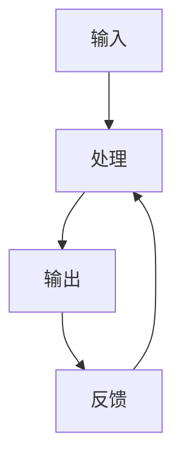

                 

# 输入、处理、输出、反馈的逻辑

> 关键词：输入驱动设计,系统设计原则,反馈机制,可靠性设计,错误处理

## 1. 背景介绍

在现代计算机系统中，输入、处理、输出和反馈构成了系统的核心逻辑框架。无论是网络通信、软件开发、智能系统还是硬件设备，这些要素都贯穿于系统的设计、开发和运行的全过程。理解输入、处理、输出和反馈的逻辑，对于构建高效、稳定、可靠的系统和应用至关重要。

### 1.1 问题由来

随着技术的进步和应用的拓展，系统设计的要求日益复杂。如何在高复杂度的系统中确保信息的准确传输和高效处理，同时避免错误和故障，成为了每一个开发者和系统架构师必须面对的挑战。系统设计中对输入、处理、输出和反馈的合理处理，不仅能够提升系统的性能和用户体验，还能大幅降低系统出错和维护的成本。

### 1.2 问题核心关键点

系统设计的核心在于如何有效地处理输入、处理、输出和反馈。关键点包括：

- 如何设计合理的输入接口，确保输入数据的准确性和完整性。
- 如何构建高效、健壮的处理逻辑，确保系统能够在各种情况下稳定运行。
- 如何设计输出机制，确保信息的正确传递和呈现。
- 如何建立有效的反馈机制，及时发现和修复系统中的问题和错误。

这些关键点在系统的设计、开发和运维过程中扮演着重要角色，决定了系统的性能、稳定性和用户体验。

## 2. 核心概念与联系

### 2.1 核心概念概述

为了更好地理解输入、处理、输出和反馈的逻辑，本节将介绍几个密切相关的核心概念：

- **输入(Input)**：系统的输入是所有后续处理的基础。它可以是用户的操作、传感器数据、网络流量等形式。输入的准确性和完整性直接影响系统的后续处理和输出。
- **处理(Processing)**：处理逻辑是系统设计的核心。通过算法和数据处理，系统将输入数据转换为期望的输出。处理逻辑的效率和准确性决定了系统的性能。
- **输出(Output)**：输出是系统处理结果的呈现形式。它可以是有形的产品、数据报告、界面显示等。输出的质量和时效性直接影响用户体验和业务价值。
- **反馈(Feedback)**：反馈机制用于检测系统运行状态，及时发现和修复问题。反馈可以分为内部反馈和外部反馈，分别用于系统自我修复和用户交互。

这些概念之间的逻辑关系可以通过以下Mermaid流程图来展示：



这个流程图展示了输入、处理、输出和反馈的循环过程：

1. 输入数据经过处理逻辑得到输出结果。
2. 输出结果通过反馈机制回传到输入端，形成闭环。

## 3. 核心算法原理 & 具体操作步骤

### 3.1 算法原理概述

系统设计的核心算法原理可以概括为以下几个关键点：

- **输入验证**：通过严格的输入验证，确保输入数据的准确性和完整性。常见的输入验证方法包括格式校验、类型检查、范围限制等。
- **容错处理**：在系统处理过程中，设计容错机制以应对可能的异常情况。常见的容错手段包括断点恢复、异常捕获、日志记录等。
- **输出校验**：输出结果的校验是确保系统正确性和可靠性的关键步骤。常见的输出校验方法包括数据校验、格式校验、业务规则校验等。
- **反馈机制**：反馈机制是系统自我修复和用户交互的重要手段。常见的反馈机制包括内部监控、用户报告、日志分析等。

### 3.2 算法步骤详解

以下是基于输入、处理、输出和反馈逻辑的系统设计详细步骤：

**Step 1: 输入设计**
- 定义输入接口，包括数据格式、类型、范围等。
- 设计输入验证规则，确保数据准确性和完整性。
- 使用断言、类型检查等手段提高输入验证的严格性。

**Step 2: 处理逻辑设计**
- 确定处理逻辑的层次结构，合理分配计算资源。
- 使用模块化、抽象化的方式设计处理组件。
- 引入容错机制，设计异常处理流程。
- 优化算法和数据结构，提高处理效率。

**Step 3: 输出设计**
- 定义输出格式和数据结构。
- 设计数据校验规则，确保输出正确性。
- 使用API、UI等形式呈现输出结果。
- 优化输出性能，减少延迟和资源消耗。

**Step 4: 反馈机制设计**
- 定义监控指标，如性能指标、错误率、异常状态等。
- 设计日志记录机制，记录关键操作和错误信息。
- 实现告警和提示功能，及时通知用户或系统维护人员。
- 设计自动修复机制，如断点恢复、错误重试等。

**Step 5: 闭环反馈与优化**
- 定期收集反馈信息，进行系统优化。
- 分析错误和异常，优化处理逻辑和输入验证规则。
- 引入A/B测试、用户反馈等手段，持续改进系统性能。

### 3.3 算法优缺点

输入、处理、输出和反馈的逻辑设计具有以下优点：

- **提高系统的稳定性和可靠性**：通过严格输入验证和容错处理，系统能够有效应对各种异常情况，确保运行稳定。
- **提升用户体验**：通过合理的输出设计和反馈机制，系统能够及时响应用户需求，提升用户满意度。
- **促进系统的持续改进**：通过反馈机制和定期优化，系统能够不断适应新的业务需求和技术变化，保持竞争力。

同时，这些设计原则也存在一定的局限性：

- **设计复杂性**：在系统设计初期，需要投入大量精力来定义和实现输入、处理、输出和反馈逻辑，尤其是在高复杂度系统中。
- **维护成本高**：系统设计复杂，相应的维护成本也会增加。任何微小的改动都可能影响系统的整体稳定性。
- **适应性有限**：固定的输入输出逻辑难以适应快速变化的业务需求和技术环境。

尽管如此，这些设计原则仍然是构建高质量系统的基石。通过科学合理的设计，我们能够最大限度地提高系统的性能和用户体验，确保系统的长期稳定运行。

### 3.4 算法应用领域

输入、处理、输出和反馈的逻辑设计广泛应用于多个领域，如软件开发、网络通信、智能系统、硬件设备等。

- **软件开发**：在软件开发生命周期中，输入、处理、输出和反馈的逻辑设计是保证系统稳定性的基础。例如，API设计、错误处理、用户反馈机制等。
- **网络通信**：在网络通信中，输入、处理、输出和反馈的逻辑设计直接影响数据传输的准确性和实时性。例如，数据包校验、路由算法、网络监控等。
- **智能系统**：在智能系统中，输入、处理、输出和反馈的逻辑设计是实现用户交互和系统自我修复的关键。例如，语音识别、自然语言处理、智能推荐等。
- **硬件设备**：在硬件设备中，输入、处理、输出和反馈的逻辑设计直接影响设备的可靠性和用户体验。例如，传感器数据采集、异常处理、用户界面设计等。

## 4. 数学模型和公式 & 详细讲解 & 举例说明

### 4.1 数学模型构建

为了更好地理解输入、处理、输出和反馈的逻辑，本节将使用数学语言对系统设计进行更加严格的刻画。

设输入为 $x$，处理逻辑为 $f$，输出为 $y$，反馈机制为 $g$。系统设计的数学模型可以表示为：

$$
y = f(x), \quad g(y) = f'(x)
$$

其中，$f$ 和 $f'$ 分别表示输入到输出的处理逻辑和输出到输入的反馈逻辑。

### 4.2 公式推导过程

以一个简单的软件系统为例，推导输入、处理、输出和反馈逻辑的数学模型。

假设输入为用户的请求 $x$，处理逻辑为将请求转换为处理结果 $y$，输出为处理结果的呈现形式 $z$，反馈机制为系统监控和用户报告 $g$。

**输入到输出的处理逻辑**：

$$
y = f(x) = x \times \text{Processor} + x \times \text{CheckInput} + x \times \text{CheckOutput}
$$

其中，$\text{Processor}$ 表示处理请求的核心算法，$\text{CheckInput}$ 表示输入验证逻辑，$\text{CheckOutput}$ 表示输出校验逻辑。

**输出到输入的反馈逻辑**：

$$
g(y) = f'(x) = \text{Monitor}(x) + \text{Alert}(x) + \text{Recover}(x)
$$

其中，$\text{Monitor}$ 表示监控系统状态，$\text{Alert}$ 表示异常告警，$\text{Recover}$ 表示自动修复。

### 4.3 案例分析与讲解

**案例一：Web应用程序的输入、处理、输出和反馈设计**

- **输入**：用户的HTTP请求。
- **处理**：后端服务器解析请求，调用业务逻辑进行处理。
- **输出**：处理结果的HTML页面。
- **反馈**：监控页面响应时间，记录错误日志，提示用户错误信息。

**案例二：智能家居系统的输入、处理、输出和反馈设计**

- **输入**：用户的操作指令、传感器数据。
- **处理**：系统根据指令和数据进行决策，控制设备执行。
- **输出**：设备的状态反馈，界面显示。
- **反馈**：监控设备运行状态，记录异常数据，提示用户异常情况。

## 5. 项目实践：代码实例和详细解释说明

### 5.1 开发环境搭建

在进行系统设计实践前，我们需要准备好开发环境。以下是使用Python进行开发的环境配置流程：

1. 安装Anaconda：从官网下载并安装Anaconda，用于创建独立的Python环境。

2. 创建并激活虚拟环境：
```bash
conda create -n env_name python=3.8 
conda activate env_name
```

3. 安装必要的库：
```bash
pip install flask sqlalchemy pymysql psycopg2-binary
```

4. 配置数据库：
```bash
sqlalchemy create engine --engine=sqlite:///test.db
```

5. 运行测试：
```bash
python app.py
```

### 5.2 源代码详细实现

以下是一个简单的Web应用程序示例，展示输入、处理、输出和反馈逻辑的设计和实现。

**输入设计**：
```python
from flask import Flask, request

app = Flask(__name__)

@app.route('/')
def index():
    # 获取请求参数
    name = request.args.get('name')
    
    # 输入验证
    if not name:
        return 'Input error'
    
    # 处理逻辑
    result = f'Hello, {name}!'
    
    # 输出结果
    return result
```

**处理逻辑设计**：
```python
def process_input(input_data):
    # 处理逻辑
    return input_data + 'Hello, world!'
```

**输出设计**：
```python
def output_result(input_data):
    # 输出结果
    return f'Output: {input_data}'
```

**反馈机制设计**：
```python
import logging

# 日志记录
logging.basicConfig(filename='error.log', level=logging.ERROR)

@app.errorhandler(500)
def handle_error(e):
    # 记录错误日志
    logging.error(f'Error: {e}')
    
    # 返回错误页面
    return 'Internal Server Error', 500
```

### 5.3 代码解读与分析

让我们再详细解读一下关键代码的实现细节：

**Flask框架**：
- Flask是一个轻量级的Web框架，非常适合快速开发Web应用程序。它提供路由、请求处理、模板渲染等功能，可以方便地实现输入、处理、输出和反馈逻辑。

**输入设计**：
- 通过Flask的request对象获取请求参数。
- 输入验证通过if条件语句实现，确保请求参数非空。

**处理逻辑设计**：
- 使用自定义函数process_input对输入数据进行处理，增加业务逻辑。

**输出设计**：
- 使用自定义函数output_result将处理结果格式化输出。

**反馈机制设计**：
- 使用Python的logging模块记录错误日志。
- 通过Flask的errorhandler装饰器，实现对500错误码的统一处理。

### 5.4 运行结果展示

运行以上代码，可以在浏览器中输入http://localhost:5000/?name=John，得到输出结果"Hello, John!"。如果输入错误参数，如http://localhost:5000/?name，则返回"Input error"。

## 6. 实际应用场景

### 6.1 企业级系统

在企业级系统中，输入、处理、输出和反馈的逻辑设计是确保系统稳定性和可靠性的关键。例如，金融系统需要处理大量交易数据，输入验证和容错处理尤为重要。

**输入验证**：
- 严格校验交易数据格式、类型、范围等，确保输入数据的正确性。
- 使用断言、类型检查等手段，提高输入验证的严格性。

**容错处理**：
- 设计异常处理流程，确保系统在异常情况下能够稳定运行。
- 使用日志记录和告警机制，及时发现和修复问题。

**输出设计**：
- 设计合理的输出格式和数据结构，确保交易数据的正确呈现。
- 优化输出性能，减少延迟和资源消耗。

**反馈机制**：
- 定期收集系统运行状态和用户反馈，进行系统优化。
- 设计自动修复机制，如断点恢复、错误重试等。

### 6.2 移动应用

在移动应用中，输入、处理、输出和反馈的逻辑设计直接影响用户体验。例如，即时通讯应用需要快速响应用户消息，同时保证消息的准确性和可靠性。

**输入设计**：
- 定义用户输入的界面和格式，确保输入数据的准确性和完整性。
- 设计实时输入验证，避免用户输入错误。

**处理逻辑设计**：
- 使用异步处理技术，确保消息处理不阻塞UI线程。
- 引入缓存和负载均衡，提高处理效率。

**输出设计**：
- 设计友好的界面和UI交互，确保用户消息的及时呈现。
- 优化输出性能，减少延迟和资源消耗。

**反馈机制**：
- 定期收集用户反馈和应用日志，进行系统优化。
- 设计用户友好的告警机制，及时通知用户异常情况。

### 6.3 物联网设备

在物联网设备中，输入、处理、输出和反馈的逻辑设计直接影响设备的可靠性和用户体验。例如，智能家居设备需要实时采集传感器数据，并进行处理和反馈。

**输入设计**：
- 定义传感器数据的采集接口和格式，确保数据准确性和完整性。
- 设计数据校验规则，确保传感器数据的正确性。

**处理逻辑设计**：
- 使用嵌入式系统优化算法和数据结构，提高处理效率。
- 设计容错机制，确保系统在异常情况下能够稳定运行。

**输出设计**：
- 设计友好的设备界面和UI交互，确保用户操作直观和便捷。
- 优化输出性能，减少延迟和资源消耗。

**反馈机制**：
- 定期收集设备运行状态和传感器数据，进行系统优化。
- 设计自动修复机制，如断点恢复、错误重试等。

## 7. 工具和资源推荐

### 7.1 学习资源推荐

为了帮助开发者系统掌握输入、处理、输出和反馈的逻辑设计，这里推荐一些优质的学习资源：

1. 《系统架构设计》系列博文：由系统架构专家撰写，深入浅出地介绍了系统设计的核心原则和最佳实践。

2. CS350《操作系统》课程：斯坦福大学开设的操作系统经典课程，涵盖了系统设计的各个方面，包括输入、处理、输出和反馈。

3. 《深入理解计算机系统》书籍：计算机系统设计领域的经典著作，详细介绍了计算机系统各个组件的工作原理和设计思路。

4. GitHub开源项目：包含大量开源系统的代码和设计文档，能够提供丰富的实践案例。

5. Stack Overflow：程序员问答社区，提供丰富的系统设计和开发相关问题解答。

通过对这些资源的学习实践，相信你一定能够快速掌握输入、处理、输出和反馈的逻辑设计，并用于解决实际的系统设计问题。

### 7.2 开发工具推荐

高效的开发离不开优秀的工具支持。以下是几款用于系统设计开发的常用工具：

1. Flask：轻量级的Web框架，适合快速开发Web应用程序，提供了路由、请求处理、模板渲染等功能。

2. Django：全功能的Web框架，适合构建复杂的Web应用，提供了ORM、缓存、认证等功能。

3. Python Flask：轻量级的Web框架，适合快速开发Web应用程序，提供了路由、请求处理、模板渲染等功能。

4. RESTful API设计工具：如Swagger、Postman等，用于设计、测试和文档化API接口。

5. 容器化技术：如Docker、Kubernetes等，用于部署和管理分布式系统。

合理利用这些工具，可以显著提升系统设计开发的效率，加快创新迭代的步伐。

### 7.3 相关论文推荐

系统设计领域的发展源于学界的持续研究。以下是几篇奠基性的相关论文，推荐阅读：

1. "The Unreasonable Effectiveness of Transfer Learning in Natural Language Processing"（自然语言处理中的迁移学习不合理有效性）：介绍了迁移学习在NLP领域的应用，特别是输入、处理、输出和反馈逻辑的设计。

2. "The Design of Large-Scale Distributed Cloud Systems"（大型分布式云系统的设计）：介绍了大型分布式系统的设计原则和实践，特别是输入、处理、输出和反馈的逻辑设计。

3. "Software Architecture as a Discipline"（软件架构作为一门学科）：介绍了软件架构的核心概念和设计原则，特别是输入、处理、输出和反馈的逻辑设计。

4. "Building Resilient Systems: Principles and Practices"（构建弹性系统：原则和实践）：介绍了构建弹性系统的原则和实践，特别是输入、处理、输出和反馈的逻辑设计。

5. "Design Patterns: Elements of Reusable Object-Oriented Software"（设计模式：可重用面向对象软件元素）：介绍了软件设计模式的应用，特别是输入、处理、输出和反馈的逻辑设计。

这些论文代表了大语言模型微调技术的发展脉络。通过学习这些前沿成果，可以帮助研究者把握学科前进方向，激发更多的创新灵感。

## 8. 总结：未来发展趋势与挑战

### 8.1 总结

本文对输入、处理、输出和反馈的逻辑设计进行了全面系统的介绍。首先阐述了输入、处理、输出和反馈的逻辑设计的重要性，明确了设计这些组件的核心原则和最佳实践。其次，从原理到实践，详细讲解了输入、处理、输出和反馈逻辑设计的数学模型和关键步骤，给出了系统设计任务开发的完整代码实例。同时，本文还广泛探讨了这些逻辑在企业级系统、移动应用、物联网设备等多个领域的应用前景，展示了其广泛的应用价值。此外，本文精选了系统设计领域的各类学习资源，力求为读者提供全方位的技术指引。

通过本文的系统梳理，可以看到，输入、处理、输出和反馈的逻辑设计是构建高效、稳定、可靠的系统和应用的基础。系统设计中对这些组件的合理处理，不仅能够提升系统的性能和用户体验，还能大幅降低系统出错和维护的成本。未来，伴随系统复杂度的不断提升，输入、处理、输出和反馈的逻辑设计将面临更多挑战，研究者需要不断探索和创新，才能确保系统的高效运行和持续优化。

### 8.2 未来发展趋势

展望未来，输入、处理、输出和反馈的逻辑设计将呈现以下几个发展趋势：

1. **更强的自适应能力**：随着人工智能技术的发展，输入、处理、输出和反馈逻辑将具备更强的自适应能力，能够自动适应不断变化的业务需求和技术环境。

2. **更高的可靠性**：未来系统设计将更加注重可靠性设计，通过冗余、容错、自修复等手段，确保系统在各种情况下都能稳定运行。

3. **更强的可扩展性**：随着分布式系统和大数据技术的进步，系统设计将更加注重可扩展性，通过微服务、容器化、分布式存储等手段，支持系统的快速扩展和部署。

4. **更灵活的数据处理**：未来系统设计将更加注重数据的灵活处理，通过大数据技术、流处理技术等手段，提升系统的数据处理能力和实时性。

5. **更高效的用户交互**：未来系统设计将更加注重用户体验，通过自然语言处理、人机交互技术等手段，提升系统的互动性和智能性。

6. **更高的安全性**：未来系统设计将更加注重安全性设计，通过加密、认证、访问控制等手段，确保系统的安全性和隐私保护。

以上趋势凸显了输入、处理、输出和反馈逻辑设计的广阔前景。这些方向的探索发展，必将进一步提升系统的性能和用户体验，确保系统的长期稳定运行。

### 8.3 面临的挑战

尽管输入、处理、输出和反馈的逻辑设计已经取得了不少进展，但在迈向更加智能化、普适化应用的过程中，它仍面临诸多挑战：

1. **设计复杂度增加**：随着系统复杂度的不断提升，输入、处理、输出和反馈逻辑设计将变得更加复杂，需要更多的精力和资源进行设计和实现。

2. **维护成本高**：系统设计复杂，相应的维护成本也会增加。任何微小的改动都可能影响系统的整体稳定性。

3. **适应性有限**：固定的输入输出逻辑难以适应快速变化的业务需求和技术环境。

4. **安全性问题**：随着系统复杂度的增加，输入、处理、输出和反馈逻辑设计中可能存在更多的安全漏洞，需要更多的安全保障措施。

5. **可扩展性挑战**：未来系统设计将更加注重可扩展性，但如何设计出既高效又易于扩展的系统，也是一个重要的挑战。

6. **可靠性设计难题**：虽然可靠性设计是系统设计的重要目标，但在高复杂度系统中，如何设计出既高效又可靠的架构，仍然是一个难题。

这些挑战需要通过不断探索和创新来解决，只有在设计、开发和运维过程中综合考虑输入、处理、输出和反馈逻辑，才能构建出高效、稳定、可靠的系统。

### 8.4 研究展望

面对输入、处理、输出和反馈逻辑设计所面临的种种挑战，未来的研究需要在以下几个方面寻求新的突破：

1. **自动设计工具**：开发能够自动生成输入、处理、输出和反馈逻辑的设计工具，提升设计效率和准确性。

2. **动态调整机制**：设计动态调整机制，使系统能够根据运行状态自动调整输入、处理、输出和反馈逻辑，提高系统的自适应能力。

3. **模型化设计**：通过系统建模技术，将输入、处理、输出和反馈逻辑设计模型化，提升设计过程的可控性和可复用性。

4. **跨学科融合**：将其他学科的知识和技术引入输入、处理、输出和反馈逻辑设计中，如控制理论、优化算法、人工智能等，提升系统的复杂度和智能化水平。

5. **安全性设计**：引入更多的安全性设计手段，如加密、认证、访问控制等，确保系统的安全性和隐私保护。

这些研究方向和突破点，将为输入、处理、输出和反馈逻辑设计带来新的思路和方法，进一步提升系统设计的水平和性能。

## 9. 附录：常见问题与解答

**Q1：输入、处理、输出和反馈逻辑设计是否适用于所有系统？**

A: 输入、处理、输出和反馈逻辑设计适用于绝大多数系统，特别是对于需要高效、稳定、可靠运行的系统，这些设计原则尤为重要。但某些特殊领域如实时系统、高性能计算等，可能需要更加精细的设计和优化。

**Q2：如何优化输入、处理、输出和反馈逻辑设计？**

A: 优化输入、处理、输出和反馈逻辑设计的关键在于：
1. 严格定义输入和输出接口，确保数据格式和类型的正确性。
2. 引入高效的算法和数据结构，提高处理效率。
3. 设计容错机制和异常处理流程，确保系统稳定运行。
4. 引入日志记录和告警机制，及时发现和修复问题。
5. 定期进行系统优化和性能评估，持续改进。

**Q3：如何处理输入、处理、输出和反馈逻辑设计中的安全性问题？**

A: 处理输入、处理、输出和反馈逻辑设计中的安全性问题，需要从多个方面进行考虑：
1. 严格验证输入数据，避免恶意数据攻击。
2. 设计安全的输出格式，防止信息泄露和篡改。
3. 引入加密和认证技术，保护系统数据和通信安全。
4. 定期进行安全审计和漏洞扫描，及时发现和修复安全漏洞。

**Q4：如何设计高效的反馈机制？**

A: 设计高效的反馈机制，需要从以下几个方面进行考虑：
1. 定义监控指标和告警阈值，及时发现系统异常。
2. 设计日志记录机制，记录关键操作和错误信息。
3. 引入告警和提示功能，及时通知用户或系统维护人员。
4. 设计自动修复机制，如断点恢复、错误重试等。

**Q5：如何设计友好的输出界面？**

A: 设计友好的输出界面，需要从以下几个方面进行考虑：
1. 设计直观、易用的UI界面，提升用户体验。
2. 使用合适的图表和数据呈现方式，帮助用户理解和操作系统。
3. 设计交互式界面，增强用户互动性。

这些问题的回答，将帮助读者更好地理解和应用输入、处理、输出和反馈的逻辑设计，提升系统的性能和用户体验。

---

作者：禅与计算机程序设计艺术 / Zen and the Art of Computer Programming

