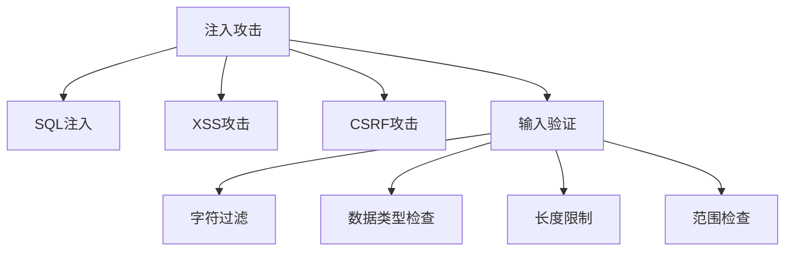

                 

# 输入验证：防止注入攻击

## 1. 背景介绍

随着互联网应用的不断普及，输入验证成为了网络安全中的一个核心问题。特别是在Web应用中，输入验证不仅是应用程序功能的基础，也是保护系统免受攻击的关键措施。

在Web应用中，输入验证通常指的是对用户输入的数据进行检查和处理，确保其符合一定的规则和格式。常见的输入验证方式包括：

- 字符过滤：如去除特殊字符、去除HTML标签等。
- 数据类型检查：如检查输入是否为数字、日期等。
- 长度限制：如限制输入的最大长度。
- 范围检查：如检查输入是否在一定范围内。

输入验证的目的是保护Web应用免受各种攻击，包括SQL注入、XSS攻击、CSRF攻击等。这些攻击不仅会影响应用的功能，还会导致严重的安全问题，如数据泄露、身份劫持等。因此，输入验证是Web应用中不可或缺的一部分。

## 2. 核心概念与联系

### 2.1 核心概念概述

为了更好地理解输入验证的原理和流程，本节将介绍几个相关核心概念：

- 注入攻击：一种利用Web应用输入验证不充分而进行攻击的技术，常见的包括SQL注入、XSS攻击等。
- 输入验证：对用户输入数据进行检查和处理，确保其符合一定的规则和格式。
- SQL注入：一种常见的网络攻击，攻击者通过在Web应用的SQL查询中插入恶意代码，从而实现非法访问数据库的目的。
- XSS攻击：一种跨站脚本攻击，攻击者通过在Web应用中注入恶意脚本，从而实现窃取用户信息等目的。
- CSRF攻击：一种跨站请求伪造攻击，攻击者通过构造恶意请求，使用户在不自知的情况下执行非法操作。

这些概念之间的逻辑关系可以通过以下Mermaid流程图来展示：



这个流程图展示了几类攻击与输入验证之间的逻辑关系：

1. 注入攻击通过未经过充分验证的输入数据进行攻击，危害Web应用的安全。
2. SQL注入、XSS攻击、CSRF攻击是常见的注入攻击方式。
3. 输入验证是对输入数据进行检查和处理，从而防止注入攻击。
4. 字符过滤、数据类型检查、长度限制、范围检查是输入验证中的具体技术手段。

这些概念共同构成了Web应用安全防护的基础，是理解和应对注入攻击的关键。

## 3. 核心算法原理 & 具体操作步骤

### 3.1 算法原理概述

输入验证的原理是基于对用户输入数据的检查和处理，确保其符合一定的规则和格式。常见的输入验证技术包括：

- 字符过滤：通过去除特殊字符、HTML标签等，防止注入攻击。
- 数据类型检查：通过检查输入是否为数字、日期等，确保数据符合特定类型。
- 长度限制：通过限制输入的最大长度，防止缓冲区溢出等攻击。
- 范围检查：通过检查输入是否在一定范围内，防止非法访问数据库等攻击。

输入验证的算法原理主要包括：

- 正则表达式：通过定义正则表达式规则，对用户输入数据进行模式匹配和过滤。
- 数据类型转换：通过将输入数据转换为特定类型，确保数据符合要求。
- 边界检查：通过检查输入数据的边界，确保数据在指定范围内。

### 3.2 算法步骤详解

输入验证的详细步骤包括：

1. 收集用户输入数据：从Web应用中收集用户输入的数据，如表单数据、查询参数等。
2. 定义验证规则：根据Web应用的安全需求，定义验证规则，如限制输入长度、检查输入类型等。
3. 执行验证：根据定义的验证规则，对用户输入数据进行检查和处理，确保其符合要求。
4. 返回验证结果：根据验证结果，向用户返回相应的提示信息，如输入错误提示、验证通过提示等。

### 3.3 算法优缺点

输入验证的算法具有以下优点：

- 简单高效：输入验证技术实现简单，处理效率高，适合大规模应用。
- 灵活性高：可以根据不同应用需求，灵活定义验证规则，提高应用的安全性。
- 可扩展性高：可以根据实际应用场景，不断扩展和优化验证规则，提高应用的安全性和可用性。

输入验证的算法也存在一些缺点：

- 误报率高：由于用户输入数据的复杂性和多样性，输入验证可能会产生误报，影响用户体验。
- 难以覆盖所有攻击场景：输入验证只能防止部分攻击，难以应对复杂的攻击场景。
- 需要持续更新：由于攻击手段不断变化，输入验证规则需要持续更新和优化，以应对新的攻击威胁。

### 3.4 算法应用领域

输入验证技术广泛应用于各种Web应用中，主要包括以下领域：

- 数据库访问：防止SQL注入等攻击。
- 表单验证：防止XSS、CSRF等攻击。
- 文件上传：防止文件类型、大小等攻击。
- 密码验证：防止暴力破解、字典攻击等。

除了上述领域外，输入验证技术还可以应用于更多场景中，如API接口验证、Cookie验证、请求头验证等。

## 4. 数学模型和公式 & 详细讲解 & 举例说明

### 4.1 数学模型构建

输入验证的数学模型主要包括两个部分：

1. 数据验证模型：用于对用户输入数据进行检查和处理，确保其符合特定规则。
2. 错误处理模型：用于在验证失败时，向用户返回相应的提示信息。

数据验证模型可以表示为：

$$
V_{data}(x) = 
\begin{cases}
1, & \text{如果} x \text{符合验证规则} \\
0, & \text{如果} x \text{不符合验证规则}
\end{cases}
$$

其中，$x$ 为输入数据，$V_{data}(x)$ 为验证结果。

错误处理模型可以表示为：

$$
V_{error}(x, V_{data}) = 
\begin{cases}
"成功", & \text{如果} V_{data}(x) = 1 \\
"错误", & \text{如果} V_{data}(x) = 0
\end{cases}
$$

其中，$V_{error}(x, V_{data})$ 为错误处理结果，$V_{data}(x)$ 为验证结果。

### 4.2 公式推导过程

输入验证的数学模型可以通过以下公式推导得出：

假设输入数据 $x$ 的长度为 $l_x$，验证规则为 $r_x$，则数据验证模型的公式可以表示为：

$$
V_{data}(x) = 
\begin{cases}
1, & \text{如果} r_x \text{满足} l_x < L_{max} \\
0, & \text{如果} r_x \text{不满足} l_x < L_{max}
\end{cases}
$$

其中，$L_{max}$ 为输入数据长度的最大限制。

错误处理模型的公式可以表示为：

$$
V_{error}(x, V_{data}) = 
\begin{cases}
"成功", & \text{如果} V_{data}(x) = 1 \\
"错误", & \text{如果} V_{data}(x) = 0
\end{cases}
$$

### 4.3 案例分析与讲解

以SQL注入为例，分析输入验证的数学模型和公式。

假设输入数据 $x$ 为 SQL 查询字符串，验证规则为：

- 去除所有单引号字符
- 去除所有 SQL 特殊字符
- 检查字符串长度是否超过 1000 个字符

数据验证模型的公式可以表示为：

$$
V_{data}(x) = 
\begin{cases}
1, & \text{如果} x \text{符合验证规则} \\
0, & \text{如果} x \text{不符合验证规则}
\end{cases}
$$

其中，验证规则可以表示为：

$$
r_x = 
\begin{cases}
x \text{去除单引号字符} & \text{如果} x \text{包含单引号字符} \\
x \text{去除 SQL 特殊字符} & \text{如果} x \text{包含 SQL 特殊字符} \\
x \text{长度小于等于 1000} & \text{如果} x \text{长度大于 1000}
\end{cases}
$$

错误处理模型的公式可以表示为：

$$
V_{error}(x, V_{data}) = 
\begin{cases}
"成功", & \text{如果} V_{data}(x) = 1 \\
"错误", & \text{如果} V_{data}(x) = 0
\end{cases}
$$

其中，$V_{error}(x, V_{data})$ 为错误处理结果，$V_{data}(x)$ 为验证结果。

## 5. 项目实践：代码实例和详细解释说明

### 5.1 开发环境搭建

在进行输入验证实践前，我们需要准备好开发环境。以下是使用Python进行开发的环境配置流程：

1. 安装Python：从官网下载并安装Python，建议安装最新版本。
2. 安装Flask：使用pip安装Flask框架，用于构建Web应用。
3. 安装SQLite：使用pip安装SQLite数据库，用于存储和查询数据。
4. 安装requests：使用pip安装requests库，用于发送HTTP请求。

### 5.2 源代码详细实现

以下是使用Python实现SQL注入防护的代码示例：

```python
from flask import Flask, request
import sqlite3

app = Flask(__name__)

@app.route('/')
def index():
    sql = request.args.get('sql', '')
    conn = sqlite3.connect('database.db')
    cursor = conn.cursor()
    cursor.execute(sql)
    rows = cursor.fetchall()
    return str(rows)

if __name__ == '__main__':
    app.run(debug=True)
```

### 5.3 代码解读与分析

让我们再详细解读一下关键代码的实现细节：

**Flask框架**：
- Flask是一个Python Web框架，用于构建Web应用。
- 通过Flask框架，可以快速构建和部署Web应用，方便开发者进行输入验证和其他功能开发。

**SQLite数据库**：
- SQLite是一种轻量级关系型数据库，适合用于Web应用的数据存储和查询。
- 使用SQLite数据库，可以方便地进行数据存储和查询操作。

**requests库**：
- requests库是一个Python HTTP库，用于发送HTTP请求。
- 使用requests库，可以方便地向Web应用发送HTTP请求，获取返回结果。

### 5.4 运行结果展示

在上述代码中，我们定义了一个Flask应用程序，用于接收用户输入的SQL查询字符串，并在数据库中执行查询操作。

用户可以通过在Web应用中发送请求，例如：

```
http://localhost:5000/?sql=SELECT%20*%20FROM%20users
```

即可在数据库中执行SQL查询，获取结果。

## 6. 实际应用场景

### 6.1 数据库访问

SQL注入是常见的Web应用攻击方式之一，攻击者通过在Web应用的SQL查询中插入恶意代码，从而实现非法访问数据库的目的。

输入验证技术可以防止SQL注入攻击，确保Web应用的数据安全。在Web应用中，可以采用以下方法进行SQL注入防护：

- 使用参数化查询：通过将输入数据作为参数传递给SQL查询，防止SQL注入攻击。
- 使用存储过程：通过将输入数据封装在存储过程中，防止SQL注入攻击。
- 使用ORM框架：通过ORM框架进行数据存储和查询，防止SQL注入攻击。

### 6.2 表单验证

XSS攻击是一种常见的网络攻击，攻击者通过在Web应用中注入恶意脚本，从而实现窃取用户信息等目的。

输入验证技术可以防止XSS攻击，确保Web应用的用户安全。在Web应用中，可以采用以下方法进行XSS防护：

- 去除HTML标签：通过去除HTML标签，防止攻击者注入恶意脚本。
- 编码输入数据：通过将输入数据进行编码，防止攻击者注入恶意脚本。
- 使用CSP（Content Security Policy）：通过CSP策略，限制Web应用的脚本来源，防止XSS攻击。

### 6.3 文件上传

文件上传是Web应用中常见的功能，攻击者可以通过文件上传功能上传恶意文件，导致系统崩溃、数据泄露等安全问题。

输入验证技术可以防止文件上传攻击，确保Web应用的安全。在Web应用中，可以采用以下方法进行文件上传防护：

- 限制文件类型：通过限制上传文件的类型，防止攻击者上传恶意文件。
- 限制文件大小：通过限制上传文件的大小，防止攻击者上传过大的文件，导致系统崩溃。
- 检查文件内容：通过检查上传文件的内容，防止攻击者上传恶意文件。

### 6.4 未来应用展望

随着Web应用的不断发展，输入验证技术的应用场景也将不断扩展。未来，输入验证技术可以应用于更多领域中，如API接口验证、Cookie验证、请求头验证等。

在API接口验证中，可以采用以下方法进行输入验证：

- 检查请求方法：通过检查请求方法是否符合要求，防止非法请求。
- 检查请求参数：通过检查请求参数是否符合要求，防止非法请求。
- 检查请求体：通过检查请求体是否符合要求，防止非法请求。

在Cookie验证中，可以采用以下方法进行输入验证：

- 检查Cookie内容：通过检查Cookie内容是否符合要求，防止Cookie劫持。
- 检查Cookie签名：通过检查Cookie签名是否符合要求，防止Cookie伪造。
- 检查Cookie有效期：通过检查Cookie有效期是否符合要求，防止Cookie篡改。

在请求头验证中，可以采用以下方法进行输入验证：

- 检查请求头格式：通过检查请求头格式是否符合要求，防止非法请求。
- 检查请求头内容：通过检查请求头内容是否符合要求，防止非法请求。
- 检查请求头签名：通过检查请求头签名是否符合要求，防止请求头篡改。

## 7. 工具和资源推荐

### 7.1 学习资源推荐

为了帮助开发者系统掌握输入验证的原理和实现方法，这里推荐一些优质的学习资源：

1. OWASP（Open Web Application Security Project）：全球知名的Web应用安全组织，提供丰富的Web应用安全资源和文档，包括输入验证等技术。

2. Web应用安全手册：由腾讯安全团队编写，详细介绍Web应用的安全防护措施，包括输入验证等技术。

3. 《Web应用安全与防护》：由王志强等编写的书籍，详细介绍Web应用的安全技术和防护措施，包括输入验证等技术。

4. 《Web应用攻防实战》：由清华大学教授谢希仁等编写的书籍，详细介绍Web应用的安全技术，包括输入验证等技术。

5. 《Web应用安全与防御》：由冯登雄等编写的书籍，详细介绍Web应用的安全技术，包括输入验证等技术。

通过对这些资源的学习实践，相信你一定能够快速掌握输入验证的精髓，并用于解决实际的Web应用问题。

### 7.2 开发工具推荐

高效的开发离不开优秀的工具支持。以下是几款用于输入验证开发的常用工具：

1. OWASP ZAP（Zed Attack Proxy）：一款开源的Web应用安全测试工具，支持SQL注入、XSS攻击等测试功能。

2. Burp Suite：一款商业的Web应用安全测试工具，支持SQL注入、XSS攻击等测试功能。

3. Acunetix：一款商业的Web应用安全测试工具，支持SQL注入、XSS攻击等测试功能。

4. SQLMap：一款开源的SQL注入攻击工具，可以自动化检测和利用SQL注入漏洞。

5. OWASP Node.js Security Project：专门为Node.js编写的Web应用安全工具，支持输入验证等功能。

6. OWASP Java Security Project：专门为Java编写的Web应用安全工具，支持输入验证等功能。

合理利用这些工具，可以显著提升输入验证任务的开发效率，加快创新迭代的步伐。

### 7.3 相关论文推荐

输入验证技术的研究已经持续多年，以下是几篇重要的相关论文，推荐阅读：

1. "Input Validation and Error Handling in Web Applications"：由Maya Gusman等撰写的论文，详细介绍输入验证技术在Web应用中的实现方法和效果。

2. "Effective Cross-Site Scripting Defense for Web Applications"：由Adam Avidar等撰写的论文，详细介绍XSS攻击防护方法，包括输入验证等技术。

3. "SQL Injection Attacks on Database Systems"：由Rahul Dhar等撰写的论文，详细介绍SQL注入攻击的原理和防护方法，包括输入验证等技术。

4. "Parameterized Queries in Java Web Applications"：由Leonard E. Kahar等撰写的论文，详细介绍参数化查询的实现方法，包括输入验证等技术。

5. "Effective Countermeasures against SQL Injection Attacks"：由Ahmed Ashour等撰写的论文，详细介绍SQL注入攻击的防护方法，包括输入验证等技术。

这些论文代表了大规模语言模型微调技术的发展脉络。通过学习这些前沿成果，可以帮助研究者把握学科前进方向，激发更多的创新灵感。

## 8. 总结：未来发展趋势与挑战

### 8.1 总结

本文对输入验证的原理和实现方法进行了全面系统的介绍。首先阐述了输入验证的原理和重要性，明确了输入验证在Web应用安全中的核心地位。其次，从原理到实践，详细讲解了输入验证的数学模型和算法步骤，给出了输入验证任务开发的完整代码示例。同时，本文还探讨了输入验证在Web应用中的实际应用场景，展示了输入验证技术的广泛应用。最后，本文精选了输入验证的各类学习资源，力求为读者提供全方位的技术指引。

通过本文的系统梳理，可以看到，输入验证技术是Web应用安全的重要组成部分，是保障Web应用安全的关键措施。输入验证不仅可以防止SQL注入、XSS攻击、CSRF攻击等常见攻击，还能提高Web应用的用户体验和数据安全。未来，随着Web应用安全需求不断增加，输入验证技术将在更多领域得到应用，为Web应用的安全性和可靠性提供保障。

### 8.2 未来发展趋势

展望未来，输入验证技术将呈现以下几个发展趋势：

1. 自动化程度提高：随着自动化测试技术的发展，输入验证将实现自动化测试，提高Web应用的安全性和可靠性。

2. 多层次防护：输入验证将与防火墙、入侵检测等安全技术相结合，构建多层次的安全防护体系。

3. 实时防护：输入验证将实现实时检测和防护，及时发现和防止安全威胁。

4. 智能化应用：输入验证将与人工智能技术结合，实现智能输入验证，提高Web应用的安全性和可靠性。

5. 统一标准：输入验证将制定统一的标准和规范，提高Web应用的安全性和可靠性。

以上趋势凸显了输入验证技术的重要性和发展潜力，将为Web应用的安全性提供新的保障。

### 8.3 面临的挑战

尽管输入验证技术已经取得了一定的进展，但在迈向更加智能化、普适化应用的过程中，它仍面临着诸多挑战：

1. 误报率高：由于用户输入数据的复杂性和多样性，输入验证可能会产生误报，影响用户体验。
2. 难以覆盖所有攻击场景：输入验证只能防止部分攻击，难以应对复杂的攻击场景。
3. 需要持续更新：由于攻击手段不断变化，输入验证规则需要持续更新和优化，以应对新的攻击威胁。
4. 技术实现复杂：输入验证技术需要结合多种技术和工具，实现复杂的输入验证规则，增加了技术实现难度。

### 8.4 研究展望

面对输入验证面临的挑战，未来的研究需要在以下几个方面寻求新的突破：

1. 引入人工智能技术：将人工智能技术引入输入验证，提高输入验证的智能化水平，降低误报率。

2. 制定统一标准：制定输入验证的统一标准和规范，提高Web应用的安全性和可靠性。

3. 优化输入验证算法：优化输入验证算法，提高输入验证的效率和准确性。

4. 结合多种安全技术：将输入验证与防火墙、入侵检测等安全技术相结合，构建多层次的安全防护体系。

这些研究方向的探索，将引领输入验证技术迈向更高的台阶，为构建安全、可靠、可控的Web应用提供保障。面向未来，输入验证技术还需要与其他人工智能技术进行更深入的融合，多路径协同发力，共同推动Web应用的安全技术进步。只有勇于创新、敢于突破，才能不断拓展输入验证的边界，让Web应用的安全技术更加强大和可靠。

## 9. 附录：常见问题与解答

**Q1：输入验证可以防止所有攻击吗？**

A: 输入验证可以防止大部分常见攻击，如SQL注入、XSS攻击、CSRF攻击等。但对于一些高级攻击手段，如缓冲区溢出、跨站请求伪造等，输入验证可能无法完全防止。

**Q2：输入验证需要消耗大量的计算资源吗？**

A: 输入验证的计算资源消耗主要取决于输入数据的规模和复杂性。对于简单的输入验证规则，计算资源消耗较低，但对于复杂的输入验证规则，计算资源消耗较高。

**Q3：输入验证是否会影响用户体验？**

A: 输入验证可能会对用户体验产生一定影响，特别是对于复杂的输入验证规则。为了提高用户体验，可以使用一些用户友好的提示信息，帮助用户输入符合要求的数据。

**Q4：输入验证是否可以应用于所有Web应用场景？**

A: 输入验证可以应用于大多数Web应用场景，特别是对于需要输入用户数据的应用场景。但对于一些特殊场景，如文件上传、数据库访问等，输入验证可能需要结合其他技术手段进行综合防护。

**Q5：输入验证是否需要定期更新？**

A: 输入验证规则需要定期更新，以应对新的攻击手段和漏洞。因此，输入验证的规则和实现需要不断优化和改进，以提高Web应用的安全性和可靠性。

总之，输入验证是Web应用安全中的重要组成部分，是保障Web应用安全的关键措施。通过不断优化和改进输入验证技术，可以构建更加安全、可靠、可控的Web应用，为Web应用的安全性和可靠性提供保障。

