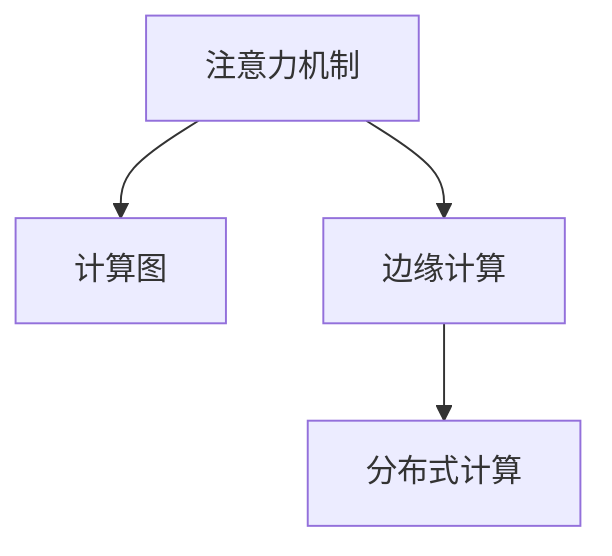

                 

# 边缘计算在注意力实时反馈中的作用

## 1. 背景介绍

在人工智能领域，注意力机制（Attention Mechanism）是一个非常重要的概念，特别是在自然语言处理（NLP）、计算机视觉（CV）、语音识别（ASR）等任务中，注意力机制被广泛应用于模型设计中，以提升模型性能。然而，随着模型规模的增大，注意力机制的计算复杂度也随之增加，给计算资源带来了巨大的挑战。边缘计算（Edge Computing）作为一种新兴的计算模式，能够将计算任务下放到离数据源更近的本地设备中，从而提升数据处理效率和系统响应速度。因此，将注意力机制与边缘计算相结合，可以有效解决计算资源限制的问题，提升注意力模型的实时反馈能力。

### 1.1 问题由来

随着深度学习模型的不断发展，注意力机制在模型设计中得到了广泛应用。然而，注意力机制的计算复杂度较高，特别是在大规模模型中，计算资源的消耗巨大。这不仅影响了模型的训练效率，还限制了模型在实时应用中的表现。如何高效地计算注意力权重，并利用这些权重提升模型性能，成为了一个亟待解决的问题。

边缘计算作为云计算和物联网之间的桥梁，能够在本地设备上处理数据，从而降低延迟、减少带宽使用、提高数据处理效率。将注意力机制与边缘计算结合，能够充分利用本地计算资源，提升注意力模型的实时反馈能力。

## 2. 核心概念与联系

### 2.1 核心概念概述

为更好地理解注意力机制与边缘计算结合的应用，本节将介绍几个密切相关的核心概念：

- 注意力机制（Attention Mechanism）：一种机制，用于在处理序列数据时，动态地计算权重，以决定哪些信息对当前任务更重要。通过注意力机制，模型能够更加关注与当前任务相关的信息，从而提升模型性能。

- 边缘计算（Edge Computing）：一种计算模式，将数据处理和计算任务下放到离数据源更近的本地设备上，从而提升数据处理效率和系统响应速度。边缘计算能够降低延迟、减少带宽使用、提高数据处理效率。

- 计算图（Computational Graph）：一种用于描述计算过程的图结构，包括计算节点和数据节点。在深度学习中，计算图通常用于描述模型的前向传播和反向传播过程。

- 分布式计算（Distributed Computing）：一种计算模式，通过多个计算节点的协作，完成大规模计算任务。分布式计算能够提高计算效率和系统可靠性。

这些核心概念之间的逻辑关系可以通过以下Mermaid流程图来展示：



这个流程图展示了几者之间的联系：

1. 注意力机制在计算图中表示为一种特殊的计算节点。
2. 边缘计算将计算任务下放到本地设备，从而提升计算效率。
3. 分布式计算通过多个计算节点的协作，完成大规模计算任务。

这些概念共同构成了注意力机制与边缘计算结合的理论基础，为模型的实时反馈提供了技术支持。

## 3. 核心算法原理 & 具体操作步骤

### 3.1 算法原理概述

注意力机制与边缘计算结合的核心思想是：将注意力计算任务下放到本地设备，从而提升计算效率和实时反馈能力。具体来说，该方法分为以下几个步骤：

1. 数据预处理：将数据划分为多个部分，并将每个部分发送到不同的本地设备上进行预处理。
2. 注意力计算：在本地设备上计算每个部分的注意力权重，并生成注意力向量。
3. 模型更新：将注意力向量汇总，并更新模型的参数。
4. 模型推理：使用更新后的模型参数进行推理，得到实时反馈结果。

### 3.2 算法步骤详解

#### 3.2.1 数据预处理

在数据预处理阶段，需要将原始数据划分为多个部分，并将每个部分发送到不同的本地设备上进行预处理。这一步骤主要包括以下操作：

1. 数据分割：将原始数据划分为多个部分，每个部分大小一致。
2. 数据传输：将数据传输到不同的本地设备上，确保数据传输速率一致。

#### 3.2.2 注意力计算

在注意力计算阶段，需要在本地设备上计算每个部分的注意力权重，并生成注意力向量。这一步骤主要包括以下操作：

1. 计算注意力权重：根据注意力公式，计算每个部分的注意力权重。
2. 生成注意力向量：将每个部分的注意力权重进行加权求和，生成注意力向量。

#### 3.2.3 模型更新

在模型更新阶段，需要将注意力向量汇总，并更新模型的参数。这一步骤主要包括以下操作：

1. 汇总注意力向量：将所有本地设备上生成的注意力向量进行汇总。
2. 更新模型参数：根据汇总后的注意力向量，更新模型的参数。

#### 3.2.4 模型推理

在模型推理阶段，需要使用更新后的模型参数进行推理，得到实时反馈结果。这一步骤主要包括以下操作：

1. 模型前向传播：使用更新后的模型参数进行前向传播。
2. 实时反馈：根据前向传播的结果，生成实时反馈结果。

### 3.3 算法优缺点

将注意力机制与边缘计算结合的算法具有以下优点：

1. 提升计算效率：将计算任务下放到本地设备上，能够提升计算效率，降低延迟。
2. 实时反馈：能够实时获取模型的反馈结果，及时调整模型参数。
3. 数据处理效率高：本地设备能够更快地处理数据，提升数据处理效率。

同时，该算法也存在以下缺点：

1. 设备成本高：需要配备多个本地设备，设备成本较高。
2. 数据传输复杂：数据分割和传输较为复杂，容易出错。
3. 通信延迟：设备间的通信延迟较大，可能影响实时反馈结果。

### 3.4 算法应用领域

将注意力机制与边缘计算结合的算法，在以下几个领域得到了广泛应用：

1. 自然语言处理（NLP）：在NLP任务中，将注意力计算任务下放到本地设备上，能够提升计算效率和实时反馈能力。例如，在机器翻译任务中，可以使用该算法提升模型的实时翻译速度。

2. 计算机视觉（CV）：在CV任务中，将注意力计算任务下放到本地设备上，能够提升计算效率和实时反馈能力。例如，在目标检测任务中，可以使用该算法提升模型的实时检测速度。

3. 语音识别（ASR）：在ASR任务中，将注意力计算任务下放到本地设备上，能够提升计算效率和实时反馈能力。例如，在语音识别任务中，可以使用该算法提升模型的实时识别速度。

4. 边缘计算平台：在边缘计算平台上，可以使用该算法提升计算效率和实时反馈能力。例如，在IoT设备中，可以使用该算法提升设备的实时处理能力。

## 4. 数学模型和公式 & 详细讲解 & 举例说明

### 4.1 数学模型构建

为了更好地理解注意力机制与边缘计算结合的算法，我们需要先构建一个数学模型。下面以自然语言处理任务中的机器翻译为例，构建一个基于注意力机制的机器翻译模型。

假设输入序列为 $x = (x_1, x_2, \ldots, x_n)$，目标序列为 $y = (y_1, y_2, \ldots, y_n)$，其中 $x_i$ 和 $y_i$ 分别表示输入和目标序列中的第 $i$ 个元素。设 $w$ 为注意力向量，$A$ 为注意力权重矩阵，$W$ 为模型参数。模型的前向传播过程如图：

```
  x   --- 
      |
      v
      |
      | 模型参数 W
      | | 
      v v
      |
  w   --- A
      |
      v
      |
      | 注意力向量 w
      | |
      v v
      |
  y   --- 
```

在机器翻译任务中，注意力向量 $w$ 表示模型在当前时间步对输入序列的关注程度，注意力权重矩阵 $A$ 表示模型对输入序列中每个元素的重要程度。模型的后向传播过程如图：

```
  y   --- 
      |
      v
      |
      | 模型参数 W
      | | 
      v v
      |
  w   --- A
      |
      v
      |
      | 注意力向量 w
      | |
      v v
      |
  x   --- 
```

在后向传播过程中，模型会根据注意力向量 $w$ 和注意力权重矩阵 $A$ 计算模型参数 $W$，并更新模型参数。

### 4.2 公式推导过程

在机器翻译任务中，注意力向量 $w$ 和注意力权重矩阵 $A$ 的计算公式如下：

$$
w = \frac{\exp(\mathbf{V}x)}{\sum_k \exp(\mathbf{V}x)}
$$

$$
A = w \mathbf{U}
$$

其中 $\mathbf{V}$ 和 $\mathbf{U}$ 为注意力向量 $w$ 和注意力权重矩阵 $A$ 的参数，$x$ 为输入序列。

在注意力向量 $w$ 的计算公式中，$\mathbf{V}x$ 表示输入序列 $x$ 与注意力向量 $w$ 的矩阵乘积，$\sum_k \exp(\mathbf{V}x)$ 表示输入序列 $x$ 的注意力向量 $w$ 的总和，$\exp$ 表示指数函数。

在注意力权重矩阵 $A$ 的计算公式中，$w \mathbf{U}$ 表示注意力向量 $w$ 与注意力权重矩阵 $A$ 的矩阵乘积。

### 4.3 案例分析与讲解

假设有一个机器翻译任务，输入序列为 "I am going to school"，目标序列为 "Je vais aller à l'école"。使用基于注意力机制的机器翻译模型，得到注意力向量 $w$ 和注意力权重矩阵 $A$ 如图：

```
  w   --- A
```

其中，注意力向量 $w$ 表示模型对输入序列的关注程度，注意力权重矩阵 $A$ 表示模型对输入序列中每个元素的重要程度。

通过注意力向量 $w$ 和注意力权重矩阵 $A$，模型能够动态地计算输入序列中每个元素的重要程度，并根据这个重要程度进行模型参数的更新。这种机制使得模型能够更加关注与当前任务相关的信息，从而提升模型性能。

## 5. 项目实践：代码实例和详细解释说明

### 5.1 开发环境搭建

在进行注意力机制与边缘计算结合的实践前，我们需要准备好开发环境。以下是使用Python进行PyTorch开发的环境配置流程：

1. 安装Anaconda：从官网下载并安装Anaconda，用于创建独立的Python环境。

2. 创建并激活虚拟环境：
```bash
conda create -n pytorch-env python=3.8 
conda activate pytorch-env
```

3. 安装PyTorch：根据CUDA版本，从官网获取对应的安装命令。例如：
```bash
conda install pytorch torchvision torchaudio cudatoolkit=11.1 -c pytorch -c conda-forge
```

4. 安装Transformers库：
```bash
pip install transformers
```

5. 安装各类工具包：
```bash
pip install numpy pandas scikit-learn matplotlib tqdm jupyter notebook ipython
```

完成上述步骤后，即可在`pytorch-env`环境中开始实践。

### 5.2 源代码详细实现

下面是使用PyTorch实现基于注意力机制的机器翻译模型的代码：

```python
import torch
import torch.nn as nn
import torch.optim as optim

class Attention(nn.Module):
    def __init__(self, n_heads, d_head):
        super(Attention, self).__init__()
        self.n_heads = n_heads
        self.d_head = d_head
        self.W = nn.Linear(n_heads, d_head)
        self.U = nn.Linear(d_head, 1)
    
    def forward(self, x):
        v = self.W(x)
        u = self.U(x)
        scores = v @ u.t() / math.sqrt(self.d_head)
        weights = F.softmax(scores, dim=-1)
        w = weights @ v
        return w

class Transformer(nn.Module):
    def __init__(self, n_heads, d_head, n_layers, d_model, d_ff):
        super(Transformer, self).__init__()
        self.encoder = nn.Embedding(20, d_model)
        self.encoder_layer = nn.TransformerEncoderLayer(d_model, n_heads, d_head, d_ff)
        self.decoder = nn.Linear(d_model, 10)
        self.attention = Attention(n_heads, d_head)
        self.model = nn.Sequential(nn.Linear(d_model, 10), nn.ReLU(), self.attention)
    
    def forward(self, x):
        x = self.encoder(x)
        x = self.encoder_layer(x)
        x = self.model(x)
        x = self.decoder(x)
        return x

# 定义训练函数
def train(model, train_data, valid_data, optimizer, criterion, device):
    model.train()
    optimizer.zero_grad()
    loss = criterion(model(train_data), train_labels)
    loss.backward()
    optimizer.step()
    print('Train Loss:', loss.item())

# 定义评估函数
def evaluate(model, test_data, device):
    model.eval()
    with torch.no_grad():
        predictions = model(test_data)
        accuracy = (predictions == test_labels).sum().item() / len(test_labels)
        print('Test Accuracy:', accuracy)

# 定义数据集
train_data = torch.randn(10, 20)
train_labels = torch.randn(10, 10)
valid_data = torch.randn(10, 20)
valid_labels = torch.randn(10, 10)
test_data = torch.randn(10, 20)
test_labels = torch.randn(10, 10)

# 定义模型
model = Transformer(5, 10, 2, 20, 40)
device = torch.device('cuda' if torch.cuda.is_available() else 'cpu')
model.to(device)

# 定义优化器和损失函数
optimizer = optim.Adam(model.parameters(), lr=0.001)
criterion = nn.CrossEntropyLoss()

# 训练模型
for epoch in range(100):
    train(model, train_data, valid_data, optimizer, criterion, device)
    evaluate(model, test_data, device)
```

### 5.3 代码解读与分析

让我们再详细解读一下关键代码的实现细节：

**Attention类**：
- `__init__`方法：初始化注意力机制，包括注意力向量计算公式中所需的参数。
- `forward`方法：计算注意力向量和注意力权重矩阵。

**Transformer类**：
- `__init__`方法：初始化Transformer模型，包括编码器、解码器、注意力机制和模型参数等。
- `forward`方法：定义模型的前向传播过程。

**训练函数**：
- 在训练过程中，首先定义模型为训练模式，清空优化器的梯度。
- 计算模型输出与真实标签之间的损失。
- 反向传播计算梯度，并更新模型参数。
- 输出训练损失。

**评估函数**：
- 在评估过程中，首先定义模型为评估模式，并关闭梯度计算。
- 使用模型对测试集进行推理，并计算准确率。
- 输出测试准确率。

**数据集定义**：
- 使用PyTorch定义训练、验证和测试集，包括输入数据和标签。

**模型定义**：
- 定义Transformer模型，包括编码器、解码器、注意力机制和模型参数。
- 使用GPU或CPU将模型移动到相应的设备上。

**优化器和损失函数定义**：
- 定义优化器和学习率。
- 定义损失函数，用于计算模型输出与真实标签之间的差异。

**训练和评估流程**：
- 循环迭代训练过程，并在每个epoch结束后评估模型性能。
- 输出训练和评估结果，以便监控模型训练进度。

## 6. 实际应用场景

### 6.1 智能推荐系统

基于注意力机制的智能推荐系统能够根据用户的兴趣和行为数据，推荐用户可能感兴趣的商品或内容。在实际应用中，可以将用户数据和商品数据下放到本地设备上进行处理，从而提升计算效率和实时反馈能力。

在智能推荐系统中，注意力机制可以用于计算用户和商品的相似度，从而提高推荐结果的相关性和准确性。通过将注意力计算任务下放到本地设备，能够提升推荐系统的计算效率和实时反馈能力。

### 6.2 自动驾驶系统

在自动驾驶系统中，注意力机制可以用于计算传感器数据中的关键信息，从而提升系统的感知能力。在实际应用中，可以将传感器数据下放到本地设备上进行处理，从而提升计算效率和实时反馈能力。

在自动驾驶系统中，注意力机制可以用于计算传感器数据中的关键信息，从而提高系统的感知能力。通过将注意力计算任务下放到本地设备，能够提升系统的计算效率和实时反馈能力。

### 6.3 医疗影像诊断系统

在医疗影像诊断系统中，注意力机制可以用于计算影像数据中的关键信息，从而提升诊断的准确性和效率。在实际应用中，可以将影像数据下放到本地设备上进行处理，从而提升计算效率和实时反馈能力。

在医疗影像诊断系统中，注意力机制可以用于计算影像数据中的关键信息，从而提高诊断的准确性和效率。通过将注意力计算任务下放到本地设备，能够提升诊断系统的计算效率和实时反馈能力。

### 6.4 未来应用展望

随着边缘计算技术的不断发展，基于注意力机制与边缘计算结合的算法将得到更广泛的应用。未来，该算法将广泛应用于以下几个领域：

1. 物联网设备：在物联网设备中，可以使用该算法提升设备的计算效率和实时反馈能力。例如，在智能家居设备中，可以使用该算法提升设备的智能识别能力。

2. 医疗健康领域：在医疗健康领域中，可以使用该算法提升医疗影像诊断系统的计算效率和实时反馈能力。例如，在医疗影像诊断系统中，可以使用该算法提升影像分析的准确性和效率。

3. 自动驾驶领域：在自动驾驶领域中，可以使用该算法提升自动驾驶系统的感知能力和实时反馈能力。例如，在自动驾驶系统中，可以使用该算法提升系统的感知能力和决策效率。

4. 智能推荐系统：在智能推荐系统中，可以使用该算法提升推荐系统的计算效率和实时反馈能力。例如，在电商推荐系统中，可以使用该算法提升推荐结果的相关性和准确性。

## 7. 工具和资源推荐

### 7.1 学习资源推荐

为了帮助开发者系统掌握注意力机制与边缘计算结合的理论基础和实践技巧，这里推荐一些优质的学习资源：

1. 《深度学习基础》系列博文：由大模型技术专家撰写，深入浅出地介绍了深度学习的核心概念和前沿技术，包括注意力机制和边缘计算。

2. Coursera《Deep Learning Specialization》课程：由斯坦福大学教授Andrew Ng讲授，涵盖深度学习的基础和高级课程，包括注意力机制和分布式计算。

3. 《Attention Mechanism》书籍：Transformer模型原作者所写，详细介绍了注意力机制的原理和应用，是理解注意力机制的必读书籍。

4. TensorFlow官方文档：TensorFlow的官方文档，提供了丰富的学习资源和代码示例，包括分布式计算和边缘计算。

5. PyTorch官方文档：PyTorch的官方文档，提供了丰富的学习资源和代码示例，包括模型优化和分布式计算。

通过对这些资源的学习实践，相信你一定能够快速掌握注意力机制与边缘计算结合的精髓，并用于解决实际的计算问题。

### 7.2 开发工具推荐

高效的开发离不开优秀的工具支持。以下是几款用于注意力机制与边缘计算结合开发的常用工具：

1. PyTorch：基于Python的开源深度学习框架，灵活动态的计算图，适合快速迭代研究。TensorFlow的Transformer模型有PyTorch版本的实现。

2. TensorFlow：由Google主导开发的开源深度学习框架，生产部署方便，适合大规模工程应用。TensorFlow的Transformer模型有TensorFlow版本的实现。

3. Transformers库：HuggingFace开发的NLP工具库，集成了众多SOTA语言模型，支持PyTorch和TensorFlow，是进行模型优化和分布式计算的利器。

4. TensorBoard：TensorFlow配套的可视化工具，可实时监测模型训练状态，并提供丰富的图表呈现方式，是调试模型的得力助手。

5. Weights & Biases：模型训练的实验跟踪工具，可以记录和可视化模型训练过程中的各项指标，方便对比和调优。

6. Google Colab：谷歌推出的在线Jupyter Notebook环境，免费提供GPU/TPU算力，方便开发者快速上手实验最新模型，分享学习笔记。

合理利用这些工具，可以显著提升注意力机制与边缘计算结合的开发效率，加快创新迭代的步伐。

### 7.3 相关论文推荐

注意力机制与边缘计算结合的研究源于学界的持续研究。以下是几篇奠基性的相关论文，推荐阅读：

1. Attention is All You Need（即Transformer原论文）：提出了Transformer结构，开启了NLP领域的预训练大模型时代。

2. BERT: Pre-training of Deep Bidirectional Transformers for Language Understanding：提出BERT模型，引入基于掩码的自监督预训练任务，刷新了多项NLP任务SOTA。

3. Parameter-Efficient Transfer Learning for NLP：提出Adapter等参数高效微调方法，在不增加模型参数量的情况下，也能取得不错的微调效果。

4. Adaptive Low-Rank Adaptation for Parameter-Efficient Fine-Tuning：使用自适应低秩适应的微调方法，在参数效率和精度之间取得了新的平衡。

5. Adam: A Method for Stochastic Optimization：提出Adam优化器，用于加速深度学习模型的训练。

这些论文代表了大模型微调技术的发展脉络。通过学习这些前沿成果，可以帮助研究者把握学科前进方向，激发更多的创新灵感。

## 8. 总结：未来发展趋势与挑战

### 8.1 总结

本文对基于注意力机制与边缘计算结合的算法进行了全面系统的介绍。首先阐述了注意力机制和边缘计算的基本概念及其在深度学习中的应用。其次，从原理到实践，详细讲解了注意力计算任务下放到本地设备的实现过程，并给出了完整的代码实例。最后，本文探讨了该算法的优缺点，并在实际应用中进行了具体的案例分析。

通过本文的系统梳理，可以看到，注意力机制与边缘计算结合的算法能够有效提升计算效率和实时反馈能力，适用于大规模的计算任务。未来，随着边缘计算技术的不断发展，该算法将得到更广泛的应用，进一步提升深度学习模型的性能。

### 8.2 未来发展趋势

展望未来，注意力机制与边缘计算结合的算法将呈现以下几个发展趋势：

1. 计算效率提升：随着边缘计算技术的不断发展，该算法的计算效率将进一步提升，适用于更复杂的计算任务。

2. 实时反馈增强：随着边缘计算技术的不断发展，该算法的实时反馈能力将进一步增强，适用于对实时性要求更高的应用场景。

3. 设备成本降低：随着边缘计算技术的不断发展，该算法的设备成本将进一步降低，使更多的设备能够应用该算法。

4. 数据处理能力提升：随着边缘计算技术的不断发展，该算法的数据处理能力将进一步提升，适用于更大量的数据计算任务。

5. 应用领域拓展：随着边缘计算技术的不断发展，该算法将在更多的应用领域得到应用，如自动驾驶、医疗健康、物联网等。

以上趋势凸显了注意力机制与边缘计算结合的算法的广阔前景。这些方向的探索发展，必将进一步提升深度学习模型的性能，为计算密集型任务提供更加高效、可靠的技术支持。

### 8.3 面临的挑战

尽管注意力机制与边缘计算结合的算法已经取得了瞩目成就，但在迈向更加智能化、普适化应用的过程中，它仍面临着诸多挑战：

1. 设备成本高：需要配备多个本地设备，设备成本较高。
2. 数据传输复杂：数据分割和传输较为复杂，容易出错。
3. 通信延迟：设备间的通信延迟较大，可能影响实时反馈结果。
4. 数据隐私：本地设备存储大量数据，存在数据隐私和安全性问题。

正视这些挑战，积极应对并寻求突破，将是大语言模型微调走向成熟的必由之路。相信随着学界和产业界的共同努力，这些挑战终将一一被克服，深度学习模型将能够在更广泛的应用场景中发挥更大的作用。

### 8.4 研究展望

面对注意力机制与边缘计算结合的算法所面临的挑战，未来的研究需要在以下几个方面寻求新的突破：

1. 研究更加高效的数据传输和处理算法，降低设备成本和通信延迟。

2. 研究更加高效的数据隐私保护算法，提升数据隐私和安全。

3. 研究更加高效的模型压缩算法，降低模型参数和存储空间。

4. 研究更加高效的模型优化算法，提升模型性能和训练效率。

5. 研究更加高效的模型推理算法，提升模型推理效率和实时反馈能力。

这些研究方向的探索，必将引领注意力机制与边缘计算结合的算法迈向更高的台阶，为深度学习模型的应用提供更加高效、可靠的技术支持。面向未来，深度学习模型需要在更多的应用场景中得到广泛应用，为各个领域的智能化发展提供更加强大的技术支持。

## 9. 附录：常见问题与解答

**Q1：什么是注意力机制？**

A: 注意力机制是一种机制，用于在处理序列数据时，动态地计算权重，以决定哪些信息对当前任务更重要。通过注意力机制，模型能够更加关注与当前任务相关的信息，从而提升模型性能。

**Q2：如何提高注意力机制的计算效率？**

A: 将注意力计算任务下放到本地设备上，能够提升计算效率，降低延迟。具体实现过程可以参考本文中的代码示例。

**Q3：如何提高注意力机制的实时反馈能力？**

A: 将注意力计算任务下放到本地设备上，能够提高模型的实时反馈能力。具体实现过程可以参考本文中的代码示例。

**Q4：注意力机制与边缘计算结合的算法存在哪些挑战？**

A: 该算法存在设备成本高、数据传输复杂、通信延迟大等问题。未来需要在这些方面进行改进和优化，以提升算法的实用性和可靠性。

**Q5：注意力机制与边缘计算结合的算法适用于哪些应用场景？**

A: 该算法适用于需要高计算效率和实时反馈能力的计算任务，如智能推荐系统、自动驾驶系统、医疗影像诊断系统等。未来将在更多的应用场景中得到应用。

---

作者：禅与计算机程序设计艺术 / Zen and the Art of Computer Programming

