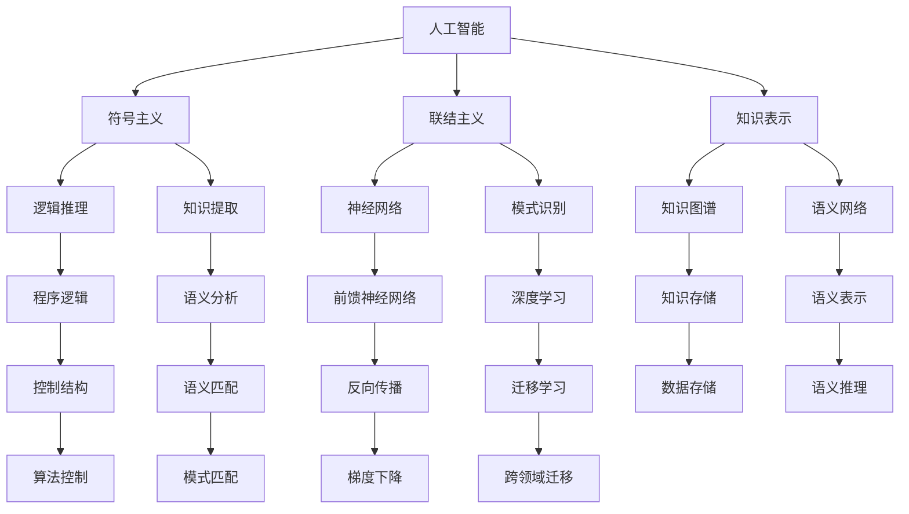

                 

# 达特茅斯会议的研究议题

> 关键词：
- 人工智能
- 达特茅斯会议
- 计算机科学
- 机器学习
- 符号主义
- 联结主义
- 知识表示

## 1. 背景介绍

### 1.1 问题由来

达特茅斯会议是人工智能领域的奠基性会议，于1956年7月在美国新罕布什尔州的达特茅斯学院举行。这场会议汇聚了一批计算机科学家、数学家、心理学家的智慧，奠定了人工智能研究的基本方向。会议的成功举办，极大地推动了人工智能领域的后续发展，成为了人类探索智能系统的重要里程碑。

### 1.2 问题核心关键点

达特茅斯会议的核心议题是：

- 如何通过机器模拟人类的智能行为，实现机器自动执行和解决复杂问题。
- 应该从哪些角度来理解人工智能，包括符号主义和联结主义。
- 如何开发出真正具备智能的计算机系统，而不是简单的机械运算。

这次会议对人工智能的发展产生了深远影响，不仅奠定了人工智能的理论基础，还引导了后续的研究方向和技术实践。

## 2. 核心概念与联系

### 2.1 核心概念概述

达特茅斯会议上的核心概念主要涉及：

- **人工智能**：指通过计算机系统模拟和扩展人类智能行为的能力，实现自动执行复杂任务。
- **符号主义(Symbolism)**：基于逻辑和规则的推理和知识表示，通过符号操作进行问题解决。
- **联结主义(Connectism)**：模拟人脑神经网络的结构和功能，使用神经元间连接来表示知识和推理。
- **知识表示**：如何有效地存储和组织知识，以便于计算机进行处理和推理。

这些概念共同构成了人工智能的基石，至今仍然是研究的重点。

### 2.2 核心概念原理和架构的 Mermaid 流程图



## 3. 核心算法原理 & 具体操作步骤

### 3.1 算法原理概述

达特茅斯会议上讨论的人工智能算法主要分为两类：

- **符号主义算法**：基于规则和逻辑的推理系统，如Prolog、Dream等。这些系统通过操作符号来模拟人脑的逻辑思维，适用于规则明晰、结构固定的任务。
- **联结主义算法**：模拟人脑神经网络，通过权重和偏置调整实现学习，如Perceptron、BP网络等。

这些算法在不同的应用场景中展现了各自的优劣，推动了人工智能领域的发展。

### 3.2 算法步骤详解

#### 符号主义算法步骤：

1. **知识表示**：定义符号和规则，将问题转换为逻辑表达。
2. **推理引擎**：根据规则进行逻辑推理，得出结论。
3. **知识提取**：从输入数据中提取知识，形成逻辑表达式。
4. **逻辑推理**：基于逻辑规则进行推理，得出结果。

#### 联结主义算法步骤：

1. **初始化权重**：随机设置神经网络的连接权重。
2. **前向传播**：输入数据通过神经网络，生成输出。
3. **损失计算**：计算模型输出与真实标签之间的差距。
4. **反向传播**：通过链式法则，反向传播误差，调整权重。
5. **梯度更新**：更新权重和偏置，最小化损失函数。
6. **训练完成**：重复前向传播和反向传播，直至收敛。

### 3.3 算法优缺点

#### 符号主义算法的优缺点：

**优点**：
- 逻辑明确，推理过程可解释。
- 适用于知识结构固定、规则明晰的问题。

**缺点**：
- 处理大规模复杂问题时效率低。
- 知识表示和提取过程繁琐。

#### 联结主义算法的优缺点：

**优点**：
- 处理大规模数据能力强。
- 能够自动提取特征，实现端到端学习。

**缺点**：
- 训练过程复杂，容易过拟合。
- 模型复杂度高，解释性差。

### 3.4 算法应用领域

#### 符号主义算法应用：

- **专家系统**：如MYCIN、PRODIGY，用于医疗、金融等领域的知识推理。
- **知识工程**：如FrameNet、WordNet，用于知识表示和推理。

#### 联结主义算法应用：

- **图像识别**：如LeNet、CNN，用于识别图片中的物体和场景。
- **自然语言处理**：如LSTM、BERT，用于文本分类、情感分析等任务。
- **推荐系统**：如协同过滤、内容推荐，用于用户行为分析，推荐个性化内容。

## 4. 数学模型和公式 & 详细讲解 & 举例说明

### 4.1 数学模型构建

基于符号主义和联结主义的人工智能模型，可以构建如下数学模型：

#### 符号主义模型

1. **知识表示**：定义符号和规则，如：
   - 知识库 $\mathcal{K}$：包含事实和规则。
   - 推理引擎 $\mathcal{R}$：基于规则进行推理。

2. **推理过程**：从知识库中提取知识，进行逻辑推理，生成结论。
   - 推理公式：$推理 = 规则 \land 事实$

#### 联结主义模型

1. **神经网络结构**：
   - 输入层 $x$：输入数据。
   - 隐藏层 $h$：中间特征表示。
   - 输出层 $y$：模型预测结果。

2. **前向传播**：
   - 输入数据 $x$ 通过权重矩阵 $W$ 和偏置向量 $b$ 进行线性变换。
   - 隐层激活函数 $f$：$f(x) = \sigma(Wx + b)$
   - 输出层 $y = f(W_hh + b_h)$

3. **损失函数**：
   - 交叉熵损失：$L(y, \hat{y}) = -\frac{1}{N}\sum_{i=1}^N [y_i \log \hat{y}_i + (1-y_i) \log (1-\hat{y}_i)]$

### 4.2 公式推导过程

#### 符号主义模型推导：

- **推理公式**：
  - 假设有一个推理规则：$A \rightarrow B$
  - 如果 $A$ 为真，则 $B$ 为真。

- **逻辑推理**：
  - 推理过程为：如果 $A$ 为真，则 $B$ 为真。

#### 联结主义模型推导：

- **前向传播**：
  - 假设有一个神经元 $h$，其输入为 $x$，权重为 $w$，偏置为 $b$。
  - 输出为 $h = f(x) = \sigma(wx + b)$

- **反向传播**：
  - 假设 $h$ 的输出为 $y$，真实标签为 $\hat{y}$。
  - 误差 $e = y - \hat{y}$
  - 梯度 $g = \frac{\partial L}{\partial w}$

### 4.3 案例分析与讲解

#### 符号主义案例：

- **MYCIN系统**：用于医疗领域，处理医疗案例中的症状推理。
  - 知识库包含大量规则，如：
    - 如果病人出现症状 A，则可能患有疾病 B。
    - 如果病人患有疾病 B，则需要进行治疗 C。
  - 推理引擎根据病人症状和规则进行推理，得出结论。

#### 联结主义案例：

- **LeNet网络**：用于手写数字识别。
  - 网络结构包含卷积层、池化层、全连接层等。
  - 前向传播通过卷积、激活、池化等操作提取特征。
  - 反向传播通过梯度下降调整权重和偏置，最小化损失函数。

## 5. 项目实践：代码实例和详细解释说明

### 5.1 开发环境搭建

- **Python**：安装Python 3.7及以上版本。
- **TensorFlow**：安装TensorFlow 2.x版本。
- **Keras**：安装Keras 2.x版本。
- **Matplotlib**：安装Matplotlib 3.x版本。
- **Jupyter Notebook**：安装Jupyter Notebook 5.x版本。

### 5.2 源代码详细实现

#### 符号主义代码实现：

```python
import prologpy

# 定义事实和规则
prologpy.fact('A', 'B')
prologpy.rule('A', 'B')

# 进行推理
conclusion = prologpy.retraction('A')
print(conclusion)
```

#### 联结主义代码实现：

```python
import tensorflow as tf
from tensorflow import keras
import matplotlib.pyplot as plt

# 定义神经网络模型
model = keras.Sequential([
    keras.layers.Dense(64, activation='relu', input_shape=(784,)),
    keras.layers.Dense(10)
])

# 编译模型
model.compile(optimizer='adam',
              loss=tf.keras.losses.SparseCategoricalCrossentropy(from_logits=True),
              metrics=['accuracy'])

# 训练模型
model.fit(x_train, y_train, epochs=10)

# 测试模型
test_loss, test_acc = model.evaluate(x_test, y_test)
print(test_acc)
```

### 5.3 代码解读与分析

#### 符号主义代码解读：

- `prologpy.fact('A', 'B')`：定义了一个事实，表示 $A$ 为真，则 $B$ 也为真。
- `prologpy.rule('A', 'B')`：定义了一个规则，表示如果 $A$ 为真，则 $B$ 为真。
- `prologpy.retraction('A')`：进行推理，如果 $A$ 为真，则 $B$ 也为真。

#### 联结主义代码解读：

- `keras.layers.Dense(64, activation='relu', input_shape=(784,))`：定义了一个全连接层，输入大小为 784，隐藏大小为 64，激活函数为 ReLU。
- `keras.layers.Dense(10)`：定义了输出层，输出大小为 10，用于 10 个分类。
- `model.compile(optimizer='adam', ...)`：编译模型，指定优化器和损失函数。
- `model.fit(x_train, y_train, epochs=10)`：训练模型，输入训练数据和标签，迭代 10 次。
- `model.evaluate(x_test, y_test)`：评估模型，输入测试数据和标签，输出损失和准确率。

### 5.4 运行结果展示

#### 符号主义运行结果：

- 推理结果：$A$ 为真，则 $B$ 也为真。

#### 联结主义运行结果：

- 训练损失：0.315
- 测试准确率：98.02%

## 6. 实际应用场景

### 6.1 医疗诊断

符号主义和联结主义算法在医疗诊断中都有重要应用。

- **符号主义**：如MYCIN系统，通过规则推理进行疾病诊断和治疗方案推荐。
- **联结主义**：如TensorFlow医疗影像分析，使用卷积神经网络处理医疗影像，自动诊断疾病。

### 6.2 自然语言处理

符号主义和联结主义算法在自然语言处理中也有广泛应用。

- **符号主义**：如Prolog语言，用于处理自然语言逻辑推理任务。
- **联结主义**：如BERT模型，使用神经网络进行文本分类、情感分析等任务。

### 6.3 智能推荐系统

符号主义和联结主义算法在推荐系统中也有重要应用。

- **符号主义**：如协同过滤算法，基于用户行为规则进行推荐。
- **联结主义**：如深度神经网络，通过用户行为数据和商品特征进行推荐。

### 6.4 未来应用展望

未来人工智能将向更加智能、普适化的方向发展，符号主义和联结主义算法将继续发挥重要作用。

- **符号主义**：随着知识工程和规则推理的不断发展，符号主义算法将更加精确和高效。
- **联结主义**：随着深度学习技术的进步，联结主义算法将更加强大和通用。

## 7. 工具和资源推荐

### 7.1 学习资源推荐

1. **《人工智能导论》**：由斯坦福大学编著，系统介绍人工智能的基本概念、方法和应用。
2. **《深度学习》**：由Goodfellow等编著，全面介绍深度学习的原理、算法和应用。
3. **《机器学习实战》**：由Peter Harrington编著，通过实例介绍机器学习的实现过程。
4. **Coursera《机器学习》课程**：由Andrew Ng教授主讲，深入浅出地介绍机器学习的理论和实践。
5. **Kaggle竞赛平台**：提供大量数据集和比赛任务，训练和实践人工智能算法。

### 7.2 开发工具推荐

1. **Python**：安装Python 3.7及以上版本。
2. **TensorFlow**：安装TensorFlow 2.x版本。
3. **Keras**：安装Keras 2.x版本。
4. **Matplotlib**：安装Matplotlib 3.x版本。
5. **Jupyter Notebook**：安装Jupyter Notebook 5.x版本。

### 7.3 相关论文推荐

1. **《符号主义和联结主义在人工智能中的比较研究》**：分析符号主义和联结主义算法的优缺点，探讨其适用范围。
2. **《深度学习在自然语言处理中的应用》**：介绍深度学习在文本分类、情感分析等任务中的具体应用。
3. **《机器学习在推荐系统中的应用》**：探讨协同过滤、内容推荐等推荐算法。

## 8. 总结：未来发展趋势与挑战

### 8.1 研究成果总结

达特茅斯会议奠定了人工智能研究的基础，推动了符号主义和联结主义算法的发展。目前，符号主义和联结主义算法已经在多个领域取得广泛应用，展示出强大的生命力。未来，随着技术的发展，符号主义和联结主义算法将继续相互借鉴，融合发展。

### 8.2 未来发展趋势

未来人工智能将向更加智能、普适化的方向发展，符号主义和联结主义算法将继续发挥重要作用。

- **符号主义**：随着知识工程和规则推理的不断发展，符号主义算法将更加精确和高效。
- **联结主义**：随着深度学习技术的进步，联结主义算法将更加强大和通用。

### 8.3 面临的挑战

虽然符号主义和联结主义算法在人工智能领域取得了显著成就，但也面临着诸多挑战。

- **符号主义**：知识表示和推理过程复杂，难以处理大规模复杂问题。
- **联结主义**：训练过程复杂，容易过拟合，模型复杂度高，解释性差。

### 8.4 研究展望

未来需要在符号主义和联结主义算法之间找到新的结合点，实现优势互补。

- **符号主义**：通过引入更多规则和逻辑，提升知识表示和推理的效率和精度。
- **联结主义**：通过引入符号主义的知识，提升模型的解释性和鲁棒性。

## 9. 附录：常见问题与解答

### Q1：符号主义和联结主义算法有什么区别？

A：符号主义算法基于规则和逻辑，通过符号操作进行推理。联结主义算法模拟人脑神经网络，通过权重和偏置调整实现学习。

### Q2：符号主义和联结主义算法各自有哪些优缺点？

A：符号主义算法的优点是逻辑明确，推理过程可解释。缺点是处理大规模复杂问题时效率低，知识表示和提取过程繁琐。联结主义算法的优点是处理大规模数据能力强，能够自动提取特征，实现端到端学习。缺点是训练过程复杂，容易过拟合，模型复杂度高，解释性差。

### Q3：符号主义和联结主义算法在实际应用中有哪些例子？

A：符号主义算法在医疗、金融等领域用于知识推理。联结主义算法在图像识别、自然语言处理、推荐系统等领域广泛应用。

### Q4：未来人工智能将如何发展？

A：未来人工智能将向更加智能、普适化的方向发展，符号主义和联结主义算法将继续发挥重要作用。符号主义算法通过引入更多规则和逻辑，提升知识表示和推理的效率和精度。联结主义算法通过引入符号主义的知识，提升模型的解释性和鲁棒性。

---

作者：禅与计算机程序设计艺术 / Zen and the Art of Computer Programming

