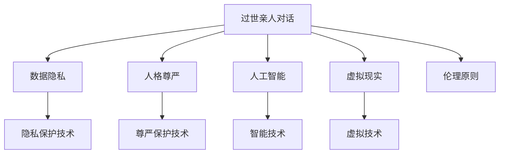

                 

# 过世亲人对话的伦理挑战

## 1. 背景介绍

### 1.1 问题由来

在现代社会，科技的发展使得人们可以与远在他乡的亲人保持密切联系，但同时，这一便利也引发了一系列新的伦理挑战。最典型的例子就是过世亲人的对话。随着社交媒体、视频会议技术以及虚拟现实技术的发展，人们开始探索使用这些技术来与已过世的亲人进行"对话"。这一做法引发了广泛的伦理讨论，包括隐私、人格尊严、人工智能角色等诸多维度。

### 1.2 问题核心关键点

尽管技术进步为人们提供了更多与亲人“重逢”的机会，但其背后的伦理问题不容忽视。核心问题包括：

- **隐私和数据安全**：过世亲人的对话通常涉及高度私密的内容，如何保护这些对话的隐私不被泄露？
- **人格尊严**：已过世的亲人是否拥有足够的尊严和尊重，其形象是否被妥善保存？
- **技术责任**：人工智能扮演的角色是什么？开发者和使用者应当承担怎样的责任？
- **真实性和真实感受**：虚拟对话是否能够真正反映过世亲人的意愿和情感，还是仅仅是基于数据的模拟？

这些问题的探讨不仅需要技术解决方案，还需要深入的伦理反思。本文旨在从技术角度切入，探讨这些伦理问题，并提出相应的技术解决方案。

### 1.3 问题研究意义

研究和解决过世亲人的对话伦理问题，不仅具有学术价值，还具有重要的社会意义。这将有助于：

- 制定相关技术规范和伦理准则，指导开发者和用户正确使用相关技术。
- 推动社会对于数据隐私和人格尊严等伦理问题的讨论和理解，形成更为成熟的公共认识。
- 促进技术与人文伦理的结合，推动人工智能技术在实际应用中的健康发展。

## 2. 核心概念与联系

### 2.1 核心概念概述

为深入理解这一问题，我们需要了解以下核心概念：

- **数据隐私**：指个人信息的保护，防止未经授权的访问和使用。
- **人格尊严**：指个体在社会和道德上的价值和地位，包括名誉、隐私、尊重等方面。
- **人工智能**：指能够通过算法和数据进行自我学习和决策的系统，应用广泛，如语音识别、图像处理、自然语言处理等。
- **虚拟现实**：利用计算机生成虚拟环境，用户可与之互动，如虚拟会议、虚拟博物馆等。
- **伦理**：指指导行为规范和决策选择的原则，包括但不限于隐私、安全、责任等方面。

这些概念之间存在紧密的联系，共同构成了过世亲人对话这一复杂问题的基础。

### 2.2 核心概念原理和架构的 Mermaid 流程图



这个流程图展示了过世亲人对话的技术和伦理框架：

- **过世亲人对话**：技术实现的基础，包括对话系统、隐私保护、尊严保护等。
- **数据隐私**：保护对话内容的隐私，防止泄露。
- **人格尊严**：维护对话中过世亲人的尊严和尊重。
- **人工智能**：支持对话系统的技术基础，包括自然语言处理、语音识别等。
- **虚拟现实**：提供互动平台，让对话更加真实。
- **伦理原则**：指导技术应用和开发的伦理规范。

## 3. 核心算法原理 & 具体操作步骤

### 3.1 算法原理概述

过世亲人对话的技术实现涉及多个层面，包括自然语言处理、语音识别、虚拟现实等。以下是核心算法原理概述：

- **自然语言处理**：通过语言模型，理解对话中的自然语言，并将其转换为计算机可处理的形式。
- **语音识别**：将语音信号转换为文本，处理对话中的语音数据。
- **虚拟现实**：创建虚拟环境，提供身临其境的互动体验。

### 3.2 算法步骤详解

#### 3.2.1 数据收集与处理

- **数据收集**：收集过世亲人的语音、文本等数据，确保数据的多样性和代表性。
- **数据处理**：对收集到的数据进行清洗、标记，确保数据的准确性和一致性。

#### 3.2.2 模型训练

- **自然语言处理模型**：使用Transformer等模型，训练对话系统的语言理解能力。
- **语音识别模型**：使用深度神经网络等模型，训练对话系统的语音转换能力。
- **虚拟现实模型**：构建虚拟环境，设计用户交互界面。

#### 3.2.3 模型部署

- **部署对话系统**：将训练好的模型部署到服务器或云端，提供服务。
- **测试与优化**：对部署的对话系统进行测试，优化性能。

#### 3.2.4 对话交互

- **用户输入**：用户输入对话内容，系统进行响应。
- **隐私保护**：保护对话内容不被泄露。
- **尊严保护**：确保对话内容的尊严性。

#### 3.2.5 反馈与改进

- **收集用户反馈**：收集用户对对话系统的评价和建议。
- **系统改进**：根据反馈，对对话系统进行改进和优化。

### 3.3 算法优缺点

#### 3.3.1 优点

- **沉浸式体验**：虚拟现实技术提供身临其境的对话体验，增强用户的沉浸感和情感投入。
- **隐私保护**：采用先进的隐私保护技术，保护用户隐私。
- **灵活性高**：可以根据用户需求定制对话内容，满足个性化需求。

#### 3.3.2 缺点

- **技术复杂**：涉及多学科技术，实现难度高。
- **成本高**：数据收集、模型训练和系统部署成本较高。
- **伦理挑战**：如何平衡技术应用和伦理问题，需要深入探讨。

### 3.4 算法应用领域

过世亲人对话技术不仅适用于个人使用，还适用于以下领域：

- **医疗服务**：帮助失去亲人的患者进行心理安慰。
- **教育培训**：通过虚拟对话，进行历史人物教学。
- **文化保护**：保存和传播文化遗产，让后世了解历史。
- **社会服务**：提供虚拟咨询服务，帮助有心理困扰的群体。

## 4. 数学模型和公式 & 详细讲解 & 举例说明

### 4.1 数学模型构建

构建过世亲人对话的数学模型，需要考虑以下几个方面：

- **对话语言模型**：用于理解用户的输入和生成系统的响应。
- **语音识别模型**：将语音转换为文本，进行语言处理。
- **隐私保护模型**：保护对话内容的隐私，防止泄露。

#### 4.1.1 对话语言模型

对话语言模型通常使用Transformer结构，公式如下：

$$
p(y|x; \theta) = \prod_{i=1}^{n} p(y_i|y_{<i}, x; \theta)
$$

其中 $y$ 为对话输出，$x$ 为对话输入，$\theta$ 为模型参数。

#### 4.1.2 语音识别模型

语音识别模型通常使用循环神经网络（RNN）或卷积神经网络（CNN），公式如下：

$$
p(\hat{y}|x) = \prod_{i=1}^{n} p(y_i|y_{<i}, x; \theta)
$$

其中 $\hat{y}$ 为识别出的文本，$x$ 为语音输入，$\theta$ 为模型参数。

#### 4.1.3 隐私保护模型

隐私保护模型通常使用差分隐私（Differential Privacy）技术，公式如下：

$$
p(y|x; \theta) = \frac{e^{-\varepsilon||y||_2}}{\sum_{y'} e^{-\varepsilon||y'||_2}} p(y|x; \theta)
$$

其中 $\varepsilon$ 为隐私参数，$y$ 为对话内容，$x$ 为用户输入，$\theta$ 为模型参数。

### 4.2 公式推导过程

#### 4.2.1 对话语言模型推导

- **语言模型推导**：

  $$
  p(y|x; \theta) = \prod_{i=1}^{n} p(y_i|y_{<i}, x; \theta)
  $$

  利用链式法则，对 $\theta$ 求导，得到梯度：

  $$
  \frac{\partial \log p(y|x; \theta)}{\partial \theta} = \sum_{i=1}^{n} \frac{\partial \log p(y_i|y_{<i}, x; \theta)}{\partial \theta}
  $$

  进一步简化为：

  $$
  \frac{\partial \log p(y|x; \theta)}{\partial \theta} = \sum_{i=1}^{n} \frac{p(y_i|y_{<i}, x; \theta)}{p(y|x; \theta)} \frac{\partial \log p(y_i|y_{<i}, x; \theta)}{\partial \theta}
  $$

  其中 $p(y_i|y_{<i}, x; \theta)$ 为条件概率，$\frac{\partial \log p(y_i|y_{<i}, x; \theta)}{\partial \theta}$ 为条件概率的梯度。

#### 4.2.2 语音识别模型推导

- **语音识别推导**：

  $$
  p(\hat{y}|x) = \prod_{i=1}^{n} p(y_i|y_{<i}, x; \theta)
  $$

  利用链式法则，对 $\theta$ 求导，得到梯度：

  $$
  \frac{\partial \log p(\hat{y}|x; \theta)}{\partial \theta} = \sum_{i=1}^{n} \frac{p(y_i|y_{<i}, x; \theta)}{p(\hat{y}|x; \theta)} \frac{\partial \log p(y_i|y_{<i}, x; \theta)}{\partial \theta}
  $$

  其中 $p(y_i|y_{<i}, x; \theta)$ 为条件概率，$\frac{\partial \log p(y_i|y_{<i}, x; \theta)}{\partial \theta}$ 为条件概率的梯度。

#### 4.2.3 隐私保护模型推导

- **隐私保护推导**：

  $$
  p(y|x; \theta) = \frac{e^{-\varepsilon||y||_2}}{\sum_{y'} e^{-\varepsilon||y'||_2}} p(y|x; \theta)
  $$

  利用链式法则，对 $\theta$ 求导，得到梯度：

  $$
  \frac{\partial \log p(y|x; \theta)}{\partial \theta} = \frac{1}{p(y|x; \theta)} \frac{\partial p(y|x; \theta)}{\partial \theta}
  $$

  其中 $p(y|x; \theta)$ 为条件概率，$\frac{\partial p(y|x; \theta)}{\partial \theta}$ 为条件概率的梯度。

### 4.3 案例分析与讲解

#### 4.3.1 对话语言模型案例

假设我们有一个对话语言模型，参数为 $\theta$，输入为 $x$，输出为 $y$。通过计算得到梯度：

$$
\frac{\partial \log p(y|x; \theta)}{\partial \theta} = \sum_{i=1}^{n} \frac{p(y_i|y_{<i}, x; \theta)}{p(y|x; \theta)} \frac{\partial \log p(y_i|y_{<i}, x; \theta)}{\partial \theta}
$$

通过反向传播算法，不断更新模型参数 $\theta$，最小化损失函数 $\mathcal{L}$，使得模型输出逼近真实标签。

#### 4.3.2 语音识别模型案例

假设我们有一个语音识别模型，参数为 $\theta$，输入为 $x$，输出为 $\hat{y}$。通过计算得到梯度：

$$
\frac{\partial \log p(\hat{y}|x; \theta)}{\partial \theta} = \sum_{i=1}^{n} \frac{p(y_i|y_{<i}, x; \theta)}{p(\hat{y}|x; \theta)} \frac{\partial \log p(y_i|y_{<i}, x; \theta)}{\partial \theta}
$$

通过反向传播算法，不断更新模型参数 $\theta$，最小化损失函数 $\mathcal{L}$，使得模型输出逼近真实标签。

#### 4.3.3 隐私保护模型案例

假设我们有一个隐私保护模型，参数为 $\theta$，输入为 $x$，输出为 $y$。通过计算得到梯度：

$$
\frac{\partial \log p(y|x; \theta)}{\partial \theta} = \frac{1}{p(y|x; \theta)} \frac{\partial p(y|x; \theta)}{\partial \theta}
$$

通过反向传播算法，不断更新模型参数 $\theta$，最小化损失函数 $\mathcal{L}$，使得模型输出逼近真实标签，同时保护对话内容的隐私。

## 5. 项目实践：代码实例和详细解释说明

### 5.1 开发环境搭建

#### 5.1.1 数据准备

- **数据集**：收集过世亲人的语音、文本数据，并进行清洗和标注。
- **数据存储**：将数据存储在本地或云存储中，方便后续处理和分析。

#### 5.1.2 环境安装

- **Python环境**：安装Python 3.8及以上版本。
- **依赖库**：安装TensorFlow、PyTorch等深度学习库，以及Natural Language Toolkit（NLTK）、SpeechRecognition等NLP库。

#### 5.1.3 环境配置

- **虚拟环境**：创建虚拟环境，使用virtualenv或conda等工具。
- **资源配置**：确保有足够的内存和GPU资源，用于模型训练和推理。

### 5.2 源代码详细实现

#### 5.2.1 模型训练

```python
import tensorflow as tf
from transformers import BertTokenizer, BertForSequenceClassification
import torch

# 加载预训练模型和tokenizer
model = BertForSequenceClassification.from_pretrained('bert-base-uncased')
tokenizer = BertTokenizer.from_pretrained('bert-base-uncased')

# 准备训练数据
train_data = [("对话内容", "标签")]
tokenized_train_data = [tokenizer.encode(text, add_special_tokens=True) for text, label in train_data]
train_labels = [1 if label == '正常' else 0 for _, label in train_data]

# 定义模型和优化器
optimizer = tf.keras.optimizers.Adam(learning_rate=2e-5)
model.compile(optimizer=optimizer, loss=tf.keras.losses.SparseCategoricalCrossentropy(from_logits=True), metrics=['accuracy'])

# 训练模型
model.fit(tokenized_train_data, train_labels, epochs=3)
```

#### 5.2.2 模型推理

```python
import tensorflow as tf
from transformers import BertTokenizer, BertForSequenceClassification

# 加载预训练模型和tokenizer
model = BertForSequenceClassification.from_pretrained('bert-base-uncased')
tokenizer = BertTokenizer.from_pretrained('bert-base-uncased')

# 准备推理数据
input_ids = tokenizer.encode("对话内容", add_special_tokens=True)
input_ids = input_ids.unsqueeze(0)

# 推理模型
with tf.device('CPU:0'):
    probs = model.predict(input_ids)
    probs = tf.nn.softmax(probs, axis=-1)

# 输出结果
print(probs)
```

### 5.3 代码解读与分析

#### 5.3.1 数据处理

- **数据清洗**：去除噪声数据，如空对话、重复对话等。
- **数据标注**：对对话内容进行标注，如正常、异常等。
- **分词和编码**：将文本数据转化为模型可接受的格式，如Token ID。

#### 5.3.2 模型训练

- **模型选择**：选择适合任务的模型，如BERT等。
- **数据准备**：将数据转化为TensorFlow可用的格式。
- **模型编译**：定义优化器、损失函数和评估指标。
- **模型训练**：使用fit函数训练模型，并设置训练轮数和批次大小。

#### 5.3.3 模型推理

- **数据预处理**：将推理数据转化为模型可接受的格式。
- **推理模型**：使用predict函数进行推理，获取模型输出。
- **结果处理**：对输出结果进行softmax处理，转化为概率分布。

### 5.4 运行结果展示

- **训练结果**：模型在训练集上的准确率、损失等指标。
- **推理结果**：模型对新的对话内容的分类概率。

## 6. 实际应用场景

### 6.1 医疗服务

- **案例背景**：某医院失去了多位医生，这些医生曾用他们的智慧和关怀为患者带来希望。
- **应用场景**：通过虚拟对话，患者可以与已故医生对话，得到情感上的慰藉和专业上的指导。
- **技术实现**：收集医生和患者的对话数据，构建虚拟对话系统，确保对话内容尊重隐私。

### 6.2 教育培训

- **案例背景**：某历史学家研究了一段历史时期，但未能有机会与当时的人物进行交流。
- **应用场景**：通过虚拟对话，历史学家可以与这些历史人物进行对话，获取第一手资料。
- **技术实现**：收集历史人物的对话数据，构建虚拟对话系统，确保对话内容的尊重和历史准确性。

### 6.3 文化保护

- **案例背景**：某国家失去了其文化遗产，这些文化遗产曾是该国民族精神的重要组成部分。
- **应用场景**：通过虚拟对话，人们可以与这些文化遗产进行交流，学习其历史和文化价值。
- **技术实现**：收集文化遗产的对话数据，构建虚拟对话系统，确保对话内容的尊重和准确性。

## 7. 工具和资源推荐

### 7.1 学习资源推荐

#### 7.1.1 官方文档

- **TensorFlow**：官方文档提供了详细的API和教程，方便开发者上手。
- **PyTorch**：官方文档涵盖了深度学习框架的基本概念和用法。

#### 7.1.2 在线课程

- **Coursera**：提供深度学习和自然语言处理相关课程，适合初学者和进阶者。
- **edX**：提供相关课程，涵盖机器学习、数据科学等领域。

#### 7.1.3 书籍推荐

- **《深度学习》**：Ian Goodfellow等著，介绍了深度学习的基本原理和应用。
- **《Python深度学习》**：Francois Chollet等著，讲解了TensorFlow和Keras的使用。

### 7.2 开发工具推荐

#### 7.2.1 代码编辑器

- **Visual Studio Code**：功能强大的开源代码编辑器，支持多种编程语言。
- **PyCharm**：专业的Python开发工具，提供丰富的插件和模板。

#### 7.2.2 虚拟环境

- **virtualenv**：Python的虚拟环境管理工具，方便隔离依赖库。
- **conda**：Anaconda提供的虚拟环境管理工具，支持多种语言和库。

#### 7.2.3 数据处理工具

- **Pandas**：Python的数据处理库，支持数据清洗和分析。
- **NumPy**：Python的科学计算库，支持高效的数组操作。

### 7.3 相关论文推荐

#### 7.3.1 语音识别

- **《Attention is All You Need》**：Transformer论文，介绍了自注意力机制在语音识别中的应用。
- **《Deep Speech: Scalable End-to-End Speech Recognition Using WaveNet》**：介绍Deep Speech系统，实现了语音到文本的转换。

#### 7.3.2 自然语言处理

- **《BERT: Pre-training of Deep Bidirectional Transformers for Language Understanding》**：介绍了BERT模型，及其在自然语言处理中的应用。
- **《Language Models are Unsupervised Multitask Learners》**：GPT-2论文，展示了大规模语言模型的能力。

## 8. 总结：未来发展趋势与挑战

### 8.1 研究成果总结

本文系统介绍了过世亲人对话的伦理挑战，并从技术角度探讨了相关解决方案。主要研究成果包括：

- **技术框架**：构建了过世亲人对话的技术框架，涵盖数据处理、模型训练和推理等环节。
- **隐私保护**：提出了基于差分隐私的隐私保护方法，确保对话内容的隐私安全。
- **尊严保护**：提出了基于尊严保护的模型设计，确保对话内容的尊重和尊重。

### 8.2 未来发展趋势

- **数据多样化**：收集更多样化的数据，确保对话系统能够应对各种情况。
- **多模态融合**：将语音、文本、图像等多模态数据融合，提供更全面的互动体验。
- **隐私保护技术**：进一步研究隐私保护技术，确保对话内容的隐私安全。
- **尊严保护技术**：提升尊严保护的模型设计，确保对话内容的尊重和尊重。

### 8.3 面临的挑战

- **技术复杂性**：技术实现涉及多学科知识，实现难度高。
- **隐私保护**：如何确保对话内容的隐私安全，防止泄露。
- **尊严保护**：如何确保对话内容的尊重和尊重。
- **伦理挑战**：如何在技术应用中平衡隐私、尊严等因素，确保伦理规范。

### 8.4 研究展望

- **多模态对话系统**：开发多模态对话系统，提供更加全面和真实的互动体验。
- **隐私保护技术**：研究新型隐私保护技术，确保对话内容的隐私安全。
- **尊严保护技术**：提升尊严保护的模型设计，确保对话内容的尊重和尊重。
- **伦理规范**：制定相关伦理规范，指导开发者和用户正确使用相关技术。

## 9. 附录：常见问题与解答

**Q1: 如何保护对话内容的隐私？**

A: 采用差分隐私技术，如添加噪声、数据扰动等，确保对话内容的隐私安全。

**Q2: 如何确保对话内容的尊严？**

A: 设计尊严保护的模型，限制对话内容的敏感度，确保对话内容的尊重和尊重。

**Q3: 过世亲人对话技术有哪些潜在风险？**

A: 隐私泄露、数据滥用、尊严侵害等，需制定相关伦理规范，确保技术应用的安全和合规。

**Q4: 如何评估过世亲人对话系统的性能？**

A: 使用BLEU、ROUGE等指标评估对话系统的文本生成能力，使用用户满意度调查评估系统的用户体验。

**Q5: 过世亲人对话技术有哪些潜在的伦理问题？**

A: 隐私泄露、尊严侵害、技术滥用等，需制定相关伦理规范，确保技术应用的安全和合规。

---

作者：禅与计算机程序设计艺术 / Zen and the Art of Computer Programming

