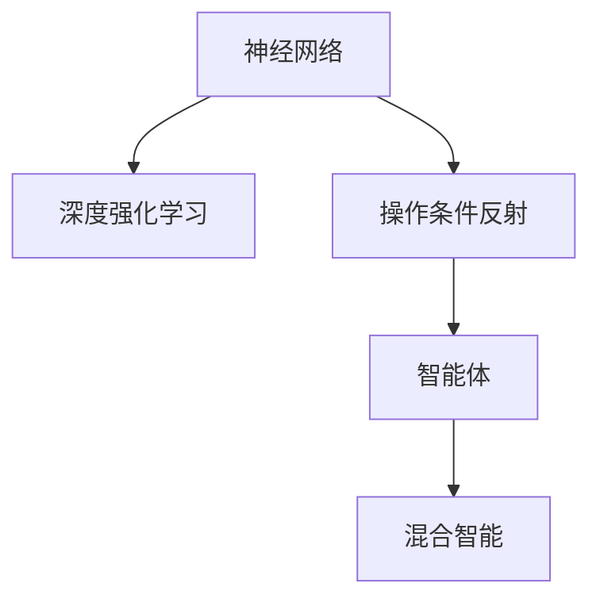

                 

## 1. 背景介绍

人工智能(AI)研究涵盖着广泛的理论和技术体系，连接主义和行为主义是其中两大重要研究范式。连接主义（又称为神经计算）是模仿人类神经系统的一种计算范式，主要侧重于如何利用计算模型模仿人脑的工作原理。行为主义则侧重于模仿生物体在自然环境中的行为模式，主要通过编程和控制策略实现智能体（agent）对环境的交互。这两种范式虽然目标相似，但在理论基础和实现路径上存在诸多差异。

连接主义主要以神经网络为模型，追求模拟人类神经元之间的连接和交互，并逐步实现自主学习和高级认知功能。通过反向传播算法进行参数优化，神经网络可以自动提取和泛化复杂模式，因此广泛应用于图像识别、语音识别、自然语言处理等领域。

行为主义则强调智能体的行为目标和环境交互，其理论基础是操作条件反射、强化学习等心理学原理。智能体通过试错和迭代优化，不断调整自身行为策略以实现目标。行为主义在机器人控制、自动驾驶、游戏AI等领域表现出色。

尽管两者看似不同，但实质上，连接主义和行为主义之间存在着紧密的联系和互补性。两者都力图通过不同的方法和机制，实现对复杂系统的智能模拟。因此，本文将深入探讨连接主义与行为主义的潜力，以期对两者的融合与互补做出更全面和深入的分析。

## 2. 核心概念与联系

### 2.1 核心概念概述

为更好地理解连接主义和行为主义的潜力，本节将介绍几个关键概念：

- **神经网络（Neural Network）**：一种模拟人脑神经元之间连接的计算模型，由输入层、隐藏层和输出层构成，通过反向传播算法进行参数优化，实现自动特征提取和泛化。
- **强化学习（Reinforcement Learning, RL）**：通过智能体与环境的交互，智能体在每一步操作后接收到环境给予的奖励或惩罚，通过不断试错调整自身策略以最大化累积奖励。
- **操作条件反射（Operant Conditioning）**：行为主义中的核心概念，指生物体通过行为与环境之间的交互，学会控制行为以获取最大收益。
- **智能体（Agent）**：在行为主义中，智能体是指在特定环境下，通过策略学习实现目标的行为体。智能体通常由感知、决策和执行三部分组成。
- **深度强化学习（Deep Reinforcement Learning）**：结合深度学习和强化学习的技术，以深度神经网络作为模型，通过训练实现策略学习，广泛应用于游戏AI、机器人控制等领域。
- **混合智能（Hybrid Intelligence）**：结合连接主义和行为主义的优势，实现两者互补和协同，以应对更加复杂的智能问题。

这些概念之间的逻辑关系可以通过以下Mermaid流程图来展示：



这个流程图展示了几大核心概念的联系与演进路径：

1. 神经网络作为连接主义的核心，是深度学习的基础。
2. 深度强化学习结合了神经网络和强化学习的优点，提升了模型在复杂环境中的决策能力。
3. 操作条件反射是行为主义的基础理论，指导智能体的行为策略。
4. 智能体作为行为主义的核心组件，通过环境交互实现自主学习和行为优化。
5. 混合智能是连接主义和行为主义融合的产物，能够更好地应对复杂的智能问题。

## 3. 核心算法原理 & 具体操作步骤

### 3.1 算法原理概述

连接主义和行为主义在算法原理上存在显著差异，但都力图通过不同机制实现对复杂系统的智能模拟。连接主义主要关注如何通过神经网络模型提取数据特征，并通过反向传播算法进行参数优化。而行为主义则侧重于通过智能体的行为策略在环境中获取最大收益。

在实际应用中，这两种算法往往需要结合使用。例如，在自动驾驶中，可以通过连接主义提取和理解路面信息，但行为主义的奖励机制可以帮助车辆学习最优驾驶策略。

### 3.2 算法步骤详解

以下将分别介绍连接主义和行为主义的算法步骤：

#### 连接主义算法步骤：

1. **数据准备**：收集并标注大量训练数据，用于训练神经网络。
2. **模型构建**：选择合适的神经网络结构，如卷积神经网络（CNN）、循环神经网络（RNN）、Transformer等。
3. **特征提取**：通过神经网络模型提取输入数据的特征表示。
4. **参数优化**：使用反向传播算法对模型参数进行优化，最小化预测误差。
5. **模型评估**：在测试集上评估模型的性能，调整超参数。

#### 行为主义算法步骤：

1. **环境建模**：构建模拟环境，定义状态、动作和奖励函数。
2. **智能体设计**：设计智能体的感知、决策和执行模块。
3. **策略学习**：通过行为主义算法（如Q-learning、SARSA等）训练智能体的策略，使其在环境中获取最大奖励。
4. **行为评估**：评估智能体在环境中的表现，调整策略参数。

### 3.3 算法优缺点

连接主义和行为主义各自有其独特的优点和局限性：

#### 连接主义的优点：

1. **泛化能力强**：神经网络模型通过反向传播算法进行参数优化，能够自动提取数据的特征，具有良好的泛化能力。
2. **表示能力强**：神经网络模型能够处理高维数据，并通过多层次的特征提取，构建复杂的特征表示。
3. **并行计算**：神经网络模型能够利用并行计算资源，加速模型的训练和推理。

#### 连接主义的局限性：

1. **黑盒问题**：神经网络模型的内部工作机制难以解释，缺乏可解释性。
2. **过拟合风险**：神经网络模型在训练过程中容易发生过拟合，特别是在训练数据较少时。
3. **资源需求高**：神经网络模型参数量较大，训练和推理过程需要大量的计算资源。

#### 行为主义的优点：

1. **目标导向**：行为主义强调智能体在环境中通过学习实现目标，具有明确的目标导向。
2. **可解释性强**：行为主义算法的决策过程具有可解释性，每个动作与奖励都有明确的数学依据。
3. **环境适应性强**：行为主义算法通过不断试错，能够适应复杂多变的环境。

#### 行为主义的局限性：

1. **复杂度较高**：行为主义算法在处理复杂环境时，需要设计精细化的奖励函数和智能体策略。
2. **训练过程缓慢**：行为主义算法的训练过程相对缓慢，需要大量的试错次数。
3. **难以处理连续动作**：行为主义算法通常处理离散动作，难以处理连续动作。

### 3.4 算法应用领域

连接主义和行为主义在多个领域都得到了广泛应用，主要体现在以下几个方面：

- **计算机视觉**：通过卷积神经网络（CNN）处理图像数据，实现目标检测、图像分类等任务。
- **自然语言处理**：通过循环神经网络（RNN）和Transformer处理文本数据，实现机器翻译、文本生成等任务。
- **机器人控制**：通过强化学习算法训练机器人，使其能够自主执行复杂的控制任务。
- **自动驾驶**：通过连接主义提取道路信息，结合行为主义训练驾驶策略，实现自主驾驶。
- **游戏AI**：通过强化学习算法训练游戏AI，使其能够在复杂游戏中自主决策和执行。

## 4. 数学模型和公式 & 详细讲解 & 举例说明

### 4.1 数学模型构建

连接主义和行为主义在数学模型上也有显著差异。以下是两个领域的典型数学模型：

#### 连接主义数学模型：

1. **多层感知机（MLP）**：多层感知机由多个神经网络层组成，每层有多个神经元，通过前向传播和反向传播算法进行参数优化。
2. **卷积神经网络（CNN）**：CNN通过卷积操作提取图像特征，适用于处理空间数据。
3. **循环神经网络（RNN）**：RNN通过循环结构处理序列数据，适用于处理文本和时间序列数据。
4. **Transformer**：Transformer通过自注意力机制处理序列数据，适用于处理长序列和复杂结构数据。

#### 行为主义数学模型：

1. **Q-learning**：Q-learning通过估计动作-状态-奖励（Q值）函数，实现智能体的策略学习。公式为：
   $$
   Q(s,a) \leftarrow (1-\alpha)Q(s,a)+\alpha(r+\gamma\max Q(s',a'))
   $$
   其中，$Q(s,a)$表示在状态$s$下执行动作$a$的Q值，$r$为即时奖励，$\gamma$为折扣因子，$s'$为下一个状态，$a'$为下一个动作。

2. **SARSA**：SARSA通过更新状态动作对（$(s,a)$）的Q值，实现智能体的策略学习。公式为：
   $$
   Q(s,a) \leftarrow (1-\alpha)Q(s,a)+\alpha(r+\gamma Q(s',a'))
   $$
   其中，$Q(s',a')$为下一个状态动作对的Q值。

### 4.2 公式推导过程

以下是Q-learning算法的详细推导过程：

1. **状态动作对Q值的更新**：
   $$
   Q(s,a) \leftarrow (1-\alpha)Q(s,a)+\alpha(r+\gamma\max Q(s',a'))
   $$
   其中，$r$为即时奖励，$\gamma$为折扣因子，$s'$为下一个状态，$a'$为下一个动作。

2. **状态值函数的更新**：
   $$
   V(s) \leftarrow (1-\alpha)V(s)+\alpha Q(s,\pi(s))
   $$
   其中，$V(s)$为状态$s$的状态值函数，$\pi(s)$为智能体在状态$s$下的动作策略。

3. **动作策略的更新**：
   $$
   \pi(s) \leftarrow \arg\max_a Q(s,a)
   $$
   即选择使得$Q(s,a)$最大的动作$a$作为策略。

### 4.3 案例分析与讲解

**案例1：机器翻译**

机器翻译是自然语言处理领域的经典任务，可以同时体现连接主义和行为主义的潜力。

- **连接主义**：通过循环神经网络（RNN）或Transformer处理输入和输出的文本序列，提取和编码源语言和目标语言之间的对应关系。
- **行为主义**：通过序列到序列（Seq2Seq）模型，训练智能体在每一步预测下一个单词，结合解码器输出完整的翻译结果。

**案例2：自动驾驶**

自动驾驶是行为主义和连接主义结合的经典应用。

- **连接主义**：通过卷积神经网络（CNN）和循环神经网络（RNN）提取和理解道路信息，如车道线、交通标志等。
- **行为主义**：通过强化学习算法，训练智能体在复杂环境中学习最优驾驶策略，如车道保持、交通灯识别等。

## 5. 项目实践：代码实例和详细解释说明

### 5.1 开发环境搭建

在进行连接主义和行为主义项目实践前，需要准备好开发环境。以下是使用Python进行TensorFlow和PyTorch开发的环境配置流程：

1. 安装Anaconda：从官网下载并安装Anaconda，用于创建独立的Python环境。
2. 创建并激活虚拟环境：
```bash
conda create -n tf_env python=3.8 
conda activate tf_env
```
3. 安装TensorFlow和PyTorch：根据CUDA版本，从官网获取对应的安装命令。例如：
```bash
conda install tensorflow tensorflow-gpu=2.6 -c tf
conda install pytorch torchvision torchaudio cudatoolkit=11.1 -c pytorch -c conda-forge
```
4. 安装相关库：
```bash
pip install numpy pandas scikit-learn matplotlib tqdm jupyter notebook ipython
```
完成上述步骤后，即可在`tf_env`环境中开始实践。

### 5.2 源代码详细实现

下面我们以深度强化学习中Q-learning为例，给出使用TensorFlow进行智能体训练的Python代码实现。

首先，定义智能体（Agent）类：

```python
import tensorflow as tf
from tensorflow.keras.models import Sequential
from tensorflow.keras.layers import Dense, Flatten

class Agent:
    def __init__(self, state_size, action_size, learning_rate):
        self.state_size = state_size
        self.action_size = action_size
        self.learning_rate = learning_rate
        self.model = self._build_model()
        self.memory = []

    def _build_model(self):
        model = Sequential()
        model.add(Flatten(input_shape=(self.state_size,)))
        model.add(Dense(24, activation='relu'))
        model.add(Dense(self.action_size, activation='linear'))
        model.compile(loss='mse', optimizer=tf.keras.optimizers.Adam(lr=self.learning_rate))
        return model
```

然后，定义训练函数：

```python
from collections import deque
import numpy as np

def train_agent(agent, env, num_episodes=2000, memory_size=2000, batch_size=32):
    memory = deque(maxlen=memory_size)
    for episode in range(num_episodes):
        state = env.reset()
        state = np.reshape(state, [1, agent.state_size])
        for t in range(200):
            action = agent.act(state)
            next_state, reward, done, _ = env.step(action)
            next_state = np.reshape(next_state, [1, agent.state_size])
            memory.append((state, action, reward, next_state, done))
            if len(memory) > batch_size:
                minibatch = random.sample(memory, batch_size)
                for state, action, reward, next_state, done in minibatch:
                    target = reward
                    if not done:
                        target = (reward + np.amax(agent.model.predict(next_state)[0]))
                    target_f = target - np.amax(agent.model.predict(state)[0])
                    agent.model.fit(state, np.array([target_f]), epochs=1, verbose=0)
            if done:
                state = env.reset()
                state = np.reshape(state, [1, agent.state_size])
    print("Num episodes: {}, Score: {:.2f}".format(episode, agent.eval()))

def eval_agent(agent, env):
    state = env.reset()
    state = np.reshape(state, [1, agent.state_size])
    total_reward = 0
    for t in range(200):
        action = np.argmax(agent.model.predict(state)[0])
        next_state, reward, done, _ = env.step(action)
        total_reward += reward
        if done:
            break
        state = np.reshape(next_state, [1, agent.state_size])
    print("Final reward: {:.2f}".format(total_reward))
```

最后，启动训练流程并在测试集上评估：

```python
agent = Agent(state_size=4, action_size=2, learning_rate=0.01)
env = gym.make('CartPole-v0')

for episode in range(10):
    train_agent(agent, env)
    eval_agent(agent, env)
```

以上就是使用TensorFlow进行Q-learning的完整代码实现。可以看到，TensorFlow提供了丰富的深度学习模型和优化器，使得训练过程变得简洁高效。

### 5.3 代码解读与分析

让我们再详细解读一下关键代码的实现细节：

**Agent类**：
- `__init__`方法：初始化智能体，构建模型并设置超参数。
- `_build_model`方法：定义智能体的神经网络模型结构。

**train_agent函数**：
- 使用随机采样的方式从记忆中提取批量的数据。
- 在每个时间步上，智能体根据状态动作对（state, action）预测Q值，计算出目标值（target）。
- 通过反向传播算法更新模型参数，最小化预测Q值与目标值之间的误差。

**eval_agent函数**：
- 使用智能体在测试集上进行评估，计算总奖励。

**训练流程**：
- 训练过程中，智能体在每个时间步上选择动作，更新状态和奖励。
- 将状态、动作、奖励、下一个状态和结束状态存入记忆中。
- 当记忆中存储了足够的样本时，从记忆中随机采样一批数据，进行模型参数更新。
- 重复训练直到达到预设的迭代次数，输出智能体的测试奖励。

可以看到，TensorFlow提供的高级API大大简化了深度学习模型的构建和训练过程，使得开发者可以更专注于模型的设计和优化。

## 6. 实际应用场景

### 6.1 智能推荐系统

智能推荐系统是连接主义和行为主义结合的重要应用。

- **连接主义**：通过深度学习模型提取用户的历史行为数据，学习用户的兴趣偏好和行为模式。
- **行为主义**：通过强化学习算法训练推荐模型，优化推荐策略，提升推荐效果。

在实际应用中，智能推荐系统可以应用于电商、社交媒体、新闻内容等领域，通过个性化推荐提高用户满意度和粘性。

### 6.2 自动化交易

自动化交易是行为主义在金融领域的重要应用。

- **连接主义**：通过深度学习模型提取市场数据，学习市场趋势和波动规律。
- **行为主义**：通过强化学习算法训练交易策略，优化买卖决策，实现收益最大化。

在实际应用中，自动化交易系统可以应用于股票、期货、外汇等市场，通过智能交易提高投资回报率。

### 6.3 游戏AI

游戏AI是行为主义和连接主义结合的典型应用。

- **连接主义**：通过深度学习模型提取游戏环境中的特征，学习对手的行为模式和游戏规则。
- **行为主义**：通过强化学习算法训练AI玩家，优化游戏策略，实现胜利。

在实际应用中，游戏AI可以应用于各种类型的游戏，如策略游戏、射击游戏等，通过智能游戏AI提高游戏体验和可玩性。

## 7. 工具和资源推荐

### 7.1 学习资源推荐

为了帮助开发者系统掌握连接主义和行为主义的理论基础和实践技巧，这里推荐一些优质的学习资源：

1. 《深度学习》（Ian Goodfellow）：深度学习领域的经典教材，系统讲解了深度学习的基本理论和算法。
2. 《强化学习》（Richard S. Sutton, Andrew G. Barto）：强化学习领域的经典教材，全面介绍了强化学习的基本理论和算法。
3. 《Python深度学习》（Francois Chollet）：TensorFlow和Keras的实战指南，适合初学者快速上手深度学习。
4. 《Reinforcement Learning: An Introduction》（Richard S. Sutton, Andrew G. Barto）：强化学习的入门教程，适合初学者了解强化学习的基本概念和算法。
5. OpenAI Gym：一个开源的强化学习环境，包含丰富的游戏和任务，适合训练和测试强化学习算法。

通过对这些资源的学习实践，相信你一定能够快速掌握连接主义和行为主义的精髓，并用于解决实际的智能问题。

### 7.2 开发工具推荐

高效的开发离不开优秀的工具支持。以下是几款用于连接主义和行为主义开发的常用工具：

1. TensorFlow：由Google主导开发的开源深度学习框架，生产部署方便，适合大规模工程应用。
2. PyTorch：基于Python的开源深度学习框架，灵活易用，适合快速迭代研究。
3. OpenAI Gym：一个开源的强化学习环境，包含丰富的游戏和任务，适合训练和测试强化学习算法。
4. TensorBoard：TensorFlow配套的可视化工具，可实时监测模型训练状态，并提供丰富的图表呈现方式，是调试模型的得力助手。
5. Weights & Biases：模型训练的实验跟踪工具，可以记录和可视化模型训练过程中的各项指标，方便对比和调优。

合理利用这些工具，可以显著提升连接主义和行为主义项目的开发效率，加快创新迭代的步伐。

### 7.3 相关论文推荐

连接主义和行为主义的研究源于学界的持续研究。以下是几篇奠基性的相关论文，推荐阅读：

1. DeepMind's AlphaGo：通过强化学习算法训练AI围棋，实现人类级智能，奠定了深度强化学习的基础。
2. LeCun等《Deep Learning》：深度学习领域的经典教材，系统讲解了深度学习的基本理论和算法。
3. Silver等《Mastering the Game of Go without Human Knowledge》：AlphaGo的训练方法和策略，详细介绍了深度强化学习在复杂环境中的应用。
4. Sutton等《Reinforcement Learning: An Introduction》：强化学习领域的经典教材，全面介绍了强化学习的基本理论和算法。
5. Mnih等《Playing Atari with Deep Reinforcement Learning》：通过强化学习算法训练AI游戏，实现了在游戏环境中的自主决策和执行。

这些论文代表了大语言模型微调技术的发展脉络。通过学习这些前沿成果，可以帮助研究者把握学科前进方向，激发更多的创新灵感。

## 8. 总结：未来发展趋势与挑战

### 8.1 总结

本文对连接主义和行为主义的研究背景和应用潜力进行了全面系统的介绍。首先阐述了连接主义和行为主义的研究背景和目标，明确了两者在理论基础和实现路径上的紧密联系。其次，从原理到实践，详细讲解了连接主义和行为主义的数学模型和关键算法，给出了具体的代码实现和分析。同时，本文还广泛探讨了连接主义和行为主义在智能推荐、自动化交易、游戏AI等多个领域的应用前景，展示了连接主义和行为主义的巨大潜力。

通过本文的系统梳理，可以看到，连接主义和行为主义在各自的理论和技术体系中，都展现了强大的应用潜力。这两者之间的互补和融合，将极大地推动智能技术的发展，为构建智能系统提供新的思路和方法。

### 8.2 未来发展趋势

展望未来，连接主义和行为主义将呈现以下几个发展趋势：

1. **混合智能**：连接主义和行为主义的融合，实现两者的互补和协同，将带来更加强大的智能系统。
2. **跨领域应用**：连接主义和行为主义将在更多的领域得到应用，如机器人控制、自动驾驶、金融、医疗等。
3. **大规模并行计算**：随着硬件计算能力的提升，连接主义和行为主义算法将在更大规模和更复杂的环境中进行计算。
4. **模型压缩和优化**：为了提升模型的计算效率和资源利用率，连接主义和行为主义模型需要进行更高效的压缩和优化。
5. **自适应学习**：连接主义和行为主义算法需要具备更强的自适应能力，能够根据环境变化动态调整策略。

以上趋势凸显了连接主义和行为主义的广阔前景。这些方向的探索发展，必将进一步提升智能系统的性能和应用范围，为人类认知智能的进化带来深远影响。

### 8.3 面临的挑战

尽管连接主义和行为主义已经取得了瞩目成就，但在迈向更加智能化、普适化应用的过程中，仍面临诸多挑战：

1. **资源消耗**：连接主义和行为主义算法通常需要大量的计算资源和时间，特别是在复杂环境中的训练和推理。如何降低资源消耗，提高计算效率，还需要更多的研究。
2. **模型可解释性**：连接主义和行为主义模型通常被认为是“黑盒”，难以解释其内部工作机制和决策逻辑。如何提高模型的可解释性，是未来研究的重要方向。
3. **数据质量**：连接主义和行为主义算法需要高质量的数据进行训练和优化。如何获取和处理高质量的数据，是模型性能提升的关键。
4. **安全性**：连接主义和行为主义模型可能存在安全漏洞，如对抗攻击、数据泄露等。如何保障模型的安全性，是模型部署的重要考虑因素。
5. **伦理道德**：连接主义和行为主义模型在实际应用中，可能存在伦理道德问题，如偏见、歧视等。如何设计模型以确保公平和公正，是模型应用的重要保障。

### 8.4 研究展望

面对连接主义和行为主义面临的挑战，未来的研究需要在以下几个方面寻求新的突破：

1. **高效优化算法**：开发更高效的优化算法，如自适应学习率、自适应优化器等，降低模型训练和推理的资源消耗。
2. **可解释性增强**：通过引入可解释性方法，如注意力机制、决策树等，提高连接主义和行为主义模型的可解释性。
3. **数据增强和处理**：研究更高效的数据增强和预处理技术，提升数据的质量和多样性，提高模型的性能。
4. **安全性和鲁棒性**：设计更安全、更鲁棒的连接主义和行为主义模型，增强模型的抗干扰能力和抵御攻击能力。
5. **伦理道德框架**：建立模型设计和应用的伦理道德框架，确保模型的公平、公正和透明。

这些研究方向的探索，必将引领连接主义和行为主义技术迈向更高的台阶，为构建安全、可靠、可解释、可控的智能系统铺平道路。面向未来，连接主义和行为主义需要与其他人工智能技术进行更深入的融合，如知识表示、因果推理、强化学习等，多路径协同发力，共同推动智能技术的发展。只有勇于创新、敢于突破，才能不断拓展智能系统的边界，让智能技术更好地造福人类社会。

## 9. 附录：常见问题与解答

**Q1：连接主义和行为主义在实际应用中如何相互结合？**

A: 连接主义和行为主义在实际应用中可以通过以下方式结合：

1. **集成架构**：将连接主义和行为主义模型集成到一个统一的架构中，共同处理输入数据和输出决策。例如，在智能推荐系统中，连接主义模型提取用户行为特征，行为主义模型优化推荐策略。

2. **交互训练**：通过交互训练的方式，将连接主义和行为主义模型结合。例如，在自动驾驶中，连接主义模型提取道路信息，行为主义模型训练驾驶策略，两者通过交互训练共同优化。

3. **数据融合**：将连接主义和行为主义模型处理的数据进行融合，提升系统的综合性能。例如，在游戏AI中，连接主义模型提取游戏环境信息，行为主义模型训练AI玩家策略，两者通过数据融合实现更全面的智能推理。

**Q2：连接主义和行为主义在应用中各自的优势和劣势是什么？**

A: 连接主义和行为主义在应用中各自具有优势和劣势：

1. **连接主义优势**：
   - **泛化能力强**：连接主义模型能够自动提取数据特征，具备良好的泛化能力。
   - **表示能力强**：连接主义模型能够处理高维数据，构建复杂的特征表示。
   - **计算高效**：连接主义模型可以利用并行计算资源，提高模型的训练和推理效率。

2. **行为主义优势**：
   - **目标导向**：行为主义算法通过优化目标函数，能够实现明确的优化目标。
   - **可解释性强**：行为主义算法具有明确的决策逻辑和可解释性，容易理解和调试。
   - **环境适应性强**：行为主义算法通过试错和迭代优化，能够适应复杂多变的环境。

3. **连接主义劣势**：
   - **黑盒问题**：连接主义模型缺乏可解释性，难以解释其内部工作机制和决策逻辑。
   - **过拟合风险**：连接主义模型在训练过程中容易发生过拟合，特别是在训练数据较少时。
   - **资源需求高**：连接主义模型参数量较大，训练和推理过程需要大量的计算资源。

4. **行为主义劣势**：
   - **复杂度较高**：行为主义算法在处理复杂环境时，需要设计精细化的奖励函数和智能体策略。
   - **训练过程缓慢**：行为主义算法的训练过程相对缓慢，需要大量的试错次数。
   - **难以处理连续动作**：行为主义算法通常处理离散动作，难以处理连续动作。

**Q3：如何衡量连接主义和行为主义模型的性能？**

A: 连接主义和行为主义模型的性能可以通过以下指标进行衡量：

1. **准确率（Accuracy）**：在分类任务中，衡量模型预测的正确率。例如，在机器翻译任务中，衡量模型输出的翻译文本与真实翻译文本的匹配程度。

2. **F1分数（F1 Score）**：在分类任务中，衡量模型的精度和召回率。例如，在命名实体识别任务中，衡量模型识别的实体与真实实体的匹配程度。

3. **平均奖励（Average Reward）**：在强化学习任务中，衡量模型在特定环境中的累积奖励。例如，在自动驾驶任务中，衡量模型在特定道路上的行驶里程和安全性。

4. **收敛速度**：衡量模型在训练过程中的收敛速度和稳定性。例如，在神经网络模型中，衡量模型参数更新的速度和效果。

5. **计算效率**：衡量模型在训练和推理过程中的计算效率和资源消耗。例如，在深度学习模型中，衡量模型在GPU/TPU等高性能设备上的计算速度和内存占用。

通过这些指标，可以全面评估连接主义和行为主义模型的性能和效果，进行对比和优化。

**Q4：如何设计连接主义和行为主义模型融合的架构？**

A: 设计连接主义和行为主义模型融合的架构，需要考虑以下几个关键要素：

1. **输入处理**：将连接主义和行为主义模型的输入数据进行统一处理，提取共同特征。例如，在智能推荐系统中，将用户行为数据和物品特征进行融合，形成统一的数据输入。

2. **模型融合**：将连接主义和行为主义模型进行融合，实现两者互补和协同。例如，在自动驾驶中，将连接主义模型提取的道路信息与行为主义模型训练的驾驶策略进行融合。

3. **输出处理**：将连接主义和行为主义模型的输出结果进行统一处理，形成最终决策。例如，在游戏AI中，将连接主义模型提取的游戏环境信息与行为主义模型训练的AI玩家策略进行融合，形成最终的游戏决策。

4. **反馈机制**：建立连接主义和行为主义模型之间的反馈机制，实现双向学习。例如，在强化学习任务中，将行为主义模型输出的奖励信息反馈到连接主义模型中，优化模型的特征提取能力。

通过以上设计，可以构建一个连接主义和行为主义模型融合的架构，实现两者的互补和协同，提升系统的综合性能。

---

作者：禅与计算机程序设计艺术 / Zen and the Art of Computer Programming

